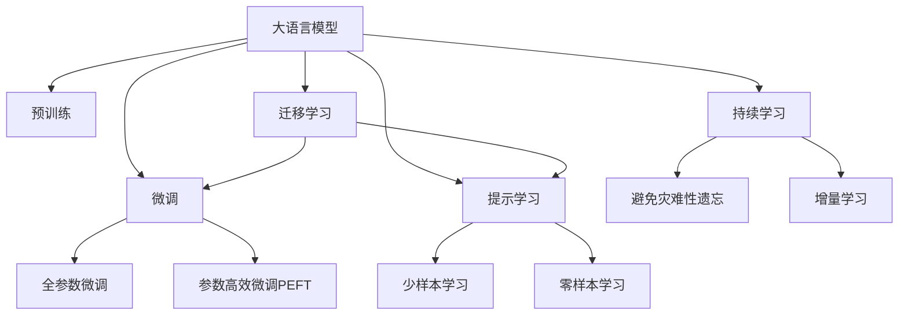

                 

# 大语言模型操作系统的应用

> 关键词：大语言模型,操作系统,深度学习,自然语言处理,NLP,语言理解,推理,算法实现,实际应用

## 1. 背景介绍

### 1.1 问题由来
近年来，随着深度学习技术的快速发展，大语言模型（Large Language Models, LLMs）在自然语言处理（Natural Language Processing, NLP）领域取得了巨大突破。这些模型通过在大规模无标签文本语料上进行预训练，学习到了丰富的语言知识和常识，具备强大的语言理解和生成能力。然而，如何将这些模型更有效地应用于实际系统中，是一个值得深入研究的问题。

### 1.2 问题核心关键点
大语言模型操作系统的核心思想是将预训练模型和操作系统相结合，构建一个能够实时理解、推理和响应用户指令的系统。操作系统和大语言模型的结合可以带来以下几方面的好处：

1. **实时响应**：大语言模型可以实时处理用户输入，快速生成响应，提高用户体验。
2. **智能决策**：通过学习和理解自然语言，大语言模型能够进行更加智能和个性化的决策。
3. **跨平台兼容性**：操作系统提供了跨平台的支持，大语言模型可以在不同操作系统和设备上运行。
4. **可扩展性**：操作系统和大语言模型可以结合多种数据源和算法，实现更大的数据处理和推理能力。

### 1.3 问题研究意义
研究大语言模型操作系统的应用，对于拓展大语言模型应用范围，提升NLP技术落地应用的效果，加速NLP技术的产业化进程，具有重要意义：

1. **降低应用开发成本**：通过大语言模型操作系统的快速响应和智能决策，可以显著减少从头开发所需的数据、计算和人力等成本投入。
2. **提升模型效果**：操作系统可以提供更丰富的输入和数据源，使大语言模型能够更好地适应特定任务，在应用场景中取得更优表现。
3. **加速开发进度**：standing on the shoulders of giants，操作系统和大语言模型结合可以快速完成任务适配，缩短开发周期。
4. **带来技术创新**：操作系统和大语言模型的结合促进了对预训练-微调的深入研究，催生了提示学习、少样本学习等新的研究方向。
5. **赋能产业升级**：操作系统和大语言模型的结合使得NLP技术更容易被各行各业所采用，为传统行业数字化转型升级提供新的技术路径。

## 2. 核心概念与联系

### 2.1 核心概念概述

为更好地理解大语言模型操作系统的应用，本节将介绍几个密切相关的核心概念：

- **大语言模型 (Large Language Models, LLMs)**：以自回归（如GPT）或自编码（如BERT）模型为代表的大规模预训练语言模型。通过在大规模无标签文本语料上进行预训练，学习到了丰富的语言知识和常识，具备强大的语言理解和生成能力。

- **操作系统 (Operating System, OS)**：管理计算机硬件与软件资源的系统软件，负责资源分配和任务调度，是现代计算机系统的核心。

- **预训练 (Pre-training)**：指在大规模无标签文本语料上，通过自监督学习任务训练通用语言模型的过程。常见的预训练任务包括言语建模、掩码语言模型等。预训练使得模型学习到语言的通用表示。

- **微调 (Fine-tuning)**：指在预训练模型的基础上，使用下游任务的少量标注数据，通过有监督地训练来优化模型在特定任务上的性能。通常只需要调整顶层分类器或解码器，并以较小的学习率更新全部或部分模型参数。

- **迁移学习 (Transfer Learning)**：指将一个领域学习到的知识，迁移应用到另一个不同但相关的领域的学习范式。大模型的预训练-微调过程即是一种典型的迁移学习方式。

- **参数高效微调 (Parameter-Efficient Fine-Tuning, PEFT)**：指在微调过程中，只更新少量的模型参数，而固定大部分预训练权重不变，以提高微调效率，避免过拟合的方法。

- **提示学习 (Prompt Learning)**：通过在输入文本中添加提示模板，引导大语言模型进行特定任务的推理和生成。可以在不更新模型参数的情况下，实现零样本或少样本学习。

- **少样本学习 (Few-shot Learning)**：指在只有少量标注样本的情况下，模型能够快速适应新任务的学习方法。在大语言模型中，通常通过在输入中提供少量示例来实现，无需更新模型参数。

- **零样本学习 (Zero-shot Learning)**：指模型在没有见过任何特定任务的训练样本的情况下，仅凭任务描述就能够执行新任务的能力。大语言模型通过预训练获得的广泛知识，使其能够理解任务指令并生成相应输出。

- **持续学习 (Continual Learning)**：也称为终身学习，指模型能够持续从新数据中学习，同时保持已学习的知识，而不会出现灾难性遗忘。这对于保持大语言模型的时效性和适应性至关重要。

这些核心概念之间的逻辑关系可以通过以下Mermaid流程图来展示：



这个流程图展示了大语言模型的核心概念及其之间的关系：

1. 大语言模型通过预训练获得基础能力。
2. 微调是对预训练模型进行任务特定的优化，可以分为全参数微调和参数高效微调（PEFT）。
3. 提示学习是一种不更新模型参数的方法，可以实现少样本学习和零样本学习。
4. 迁移学习是连接预训练模型与下游任务的桥梁，可以通过微调或提示学习来实现。
5. 持续学习旨在使模型能够不断学习新知识，同时避免遗忘旧知识。

这些概念共同构成了大语言模型的学习和应用框架，使其能够在各种场景下发挥强大的语言理解和生成能力。通过理解这些核心概念，我们可以更好地把握大语言模型操作系统的应用方向。

## 3. 核心算法原理 & 具体操作步骤
### 3.1 算法原理概述

大语言模型操作系统将大语言模型嵌入到操作系统内核中，使其能够实时响应和处理用户指令。其核心思想是将大语言模型作为操作系统的一部分，与操作系统的内核态和用户态紧密结合，实现对自然语言的高效理解和处理。

形式化地，假设大语言模型为 $M_{\theta}$，其中 $\theta$ 为预训练得到的模型参数。操作系统中引入两个关键组件：用户接口和任务调度器。用户接口负责接收用户输入的文本指令，任务调度器负责将指令映射到相应的模型处理函数，进行推理和响应。

操作系统的基本流程如下：

1. 用户输入文本指令。
2. 操作系统将指令传给用户接口。
3. 用户接口对指令进行预处理，如分词、去除停用词等。
4. 任务调度器将预处理后的指令传给大语言模型进行推理。
5. 大语言模型输出推理结果。
6. 任务调度器将结果返回给用户接口。
7. 用户接口将结果呈现给用户。

这种基于大语言模型操作系统的设计，能够使系统实时响应用户指令，提供智能决策和推理能力，同时保持跨平台兼容性和可扩展性。

### 3.2 算法步骤详解

大语言模型操作系统的实现包括以下几个关键步骤：

**Step 1: 选择预训练模型和操作系统**
- 选择合适的预训练语言模型 $M_{\theta}$ 作为初始化参数，如 BERT、GPT等。
- 选择合适的操作系统，如 Linux、Windows 等。

**Step 2: 设计用户接口和任务调度器**
- 设计用户接口，负责接收和处理用户输入的文本指令。
- 设计任务调度器，将用户接口接收到的指令映射到相应的模型处理函数。
- 设计模型推理函数，对用户指令进行预处理、推理和响应。

**Step 3: 实现模型推理和响应**
- 将预训练模型嵌入到操作系统内核中。
- 设计高效的推理算法，利用多线程、多核等技术加速模型推理。
- 设计友好的用户界面，提供丰富的反馈和交互方式。

**Step 4: 测试和优化**
- 在操作系统中测试大语言模型的推理和响应效果。
- 根据测试结果，优化模型参数和推理算法，提高系统性能。
- 优化用户接口和任务调度器，提升用户体验。

**Step 5: 部署和维护**
- 将优化后的大语言模型操作系统部署到目标平台。
- 定期更新模型和系统，保持系统性能和安全性。
- 监控系统运行状态，及时处理异常和故障。

以上是基于大语言模型操作系统的实现流程。在实际应用中，还需要根据具体任务的特点，对各个环节进行优化设计，如改进推理算法，引入更多的正则化技术，搜索最优的超参数组合等，以进一步提升系统性能。

### 3.3 算法优缺点

基于大语言模型操作系统的设计，具有以下优点：

1. **实时响应**：大语言模型可以实时处理用户输入，快速生成响应，提高用户体验。
2. **智能决策**：通过学习和理解自然语言，大语言模型能够进行更加智能和个性化的决策。
3. **跨平台兼容性**：操作系统提供了跨平台的支持，大语言模型可以在不同操作系统和设备上运行。
4. **可扩展性**：操作系统和大语言模型可以结合多种数据源和算法，实现更大的数据处理和推理能力。

同时，该方法也存在一定的局限性：

1. **依赖硬件资源**：大语言模型需要高性能的硬件资源支持，如GPU、TPU等。
2. **安全性和隐私保护**：大语言模型涉及大量的敏感数据，需要考虑安全性和隐私保护问题。
3. **计算开销大**：大语言模型推理计算量较大，推理速度较慢。
4. **可解释性不足**：大语言模型通常缺乏可解释性，难以对其推理逻辑进行分析和调试。

尽管存在这些局限性，但就目前而言，基于大语言模型操作系统的设计是大语言模型应用的主流范式。未来相关研究的重点在于如何进一步降低计算开销，提高推理速度，同时兼顾安全性和可解释性等因素。

### 3.4 算法应用领域

基于大语言模型操作系统的设计已经在多个领域得到了应用，包括但不限于：

- **智能客服系统**：通过大语言模型操作系统构建智能客服系统，使机器能够7x24小时不间断服务，快速响应客户咨询，用自然流畅的语言解答各类常见问题。

- **金融舆情监测**：使用大语言模型操作系统构建金融舆情监测系统，实时监测市场舆论动向，帮助金融机构及时应对负面信息传播，规避金融风险。

- **个性化推荐系统**：通过大语言模型操作系统构建个性化推荐系统，利用用户浏览、点击、评论、分享等行为数据，生成个性化推荐列表。

- **智能家居系统**：通过大语言模型操作系统构建智能家居系统，使家居设备能够理解用户的语音指令，执行相应的操作。

- **智能教育系统**：使用大语言模型操作系统构建智能教育系统，辅助教师教学，提供智能化的作业批改和学情分析。

除此之外，大语言模型操作系统还可能在医疗、旅游、物流等多个领域得到应用，为各行各业带来变革性影响。

## 4. 数学模型和公式 & 详细讲解 & 举例说明

### 4.1 数学模型构建

本节将使用数学语言对大语言模型操作系统的设计进行更加严格的刻画。

记大语言模型为 $M_{\theta}$，其中 $\theta$ 为模型参数。假设操作系统中设计了用户接口 $I$ 和任务调度器 $S$，用户接口将输入的文本指令 $x$ 传递给任务调度器，任务调度器将指令映射到模型推理函数 $F$，模型推理函数对输入进行预处理、推理和响应，最终输出结果 $y$。操作系统的基本流程可以表示为：

$$
y = F(I(x), \theta)
$$

其中，$I$ 和 $S$ 的具体实现方式可以根据操作系统和任务需求进行设计。

### 4.2 公式推导过程

以下我们以智能客服系统为例，推导大语言模型操作系统的基本流程。

假设智能客服系统接收到用户输入的文本指令 $x$，系统首先需要对指令进行预处理，如分词、去除停用词等。然后，将预处理后的指令传递给大语言模型进行推理，输出结果 $y$。最后，将结果呈现给用户：

$$
y = M_{\theta}(I(x))
$$

其中，$M_{\theta}$ 为预训练得到的大语言模型，$I$ 为用户接口，负责接收和处理用户输入的文本指令。

在实际应用中，大语言模型通常需要进行微调，以适应特定领域的任务。假设我们对智能客服系统进行了微调，优化了模型参数 $\hat{\theta}$，则微调后的推理函数可以表示为：

$$
y = M_{\hat{\theta}}(I(x))
$$

### 4.3 案例分析与讲解

以智能客服系统为例，详细讲解大语言模型操作系统的实现过程。

假设智能客服系统使用GPT-3模型，并在金融领域进行了微调。用户输入的文本指令为“请问如何购买理财产品？”，系统首先对指令进行预处理，将文本分词为“请问”、“如何”、“购买”、“理财产品”等关键词。然后，将预处理后的指令传递给大语言模型进行推理，模型输出相应的回答。最终，系统将回答呈现给用户。

在微调过程中，通过在金融领域的数据集上进行有监督训练，模型学习到了金融领域的专业术语和逻辑关系，能够在回答用户问题时更加准确和专业。通过大语言模型操作系统，系统能够实时响应用户的询问，提供个性化的金融咨询服务。

## 5. 项目实践：代码实例和详细解释说明

### 5.1 开发环境搭建

在进行大语言模型操作系统开发前，我们需要准备好开发环境。以下是使用Python进行PyTorch开发的环境配置流程：

1. 安装Anaconda：从官网下载并安装Anaconda，用于创建独立的Python环境。

2. 创建并激活虚拟环境：
```bash
conda create -n pytorch-env python=3.8 
conda activate pytorch-env
```

3. 安装PyTorch：根据CUDA版本，从官网获取对应的安装命令。例如：
```bash
conda install pytorch torchvision torchaudio cudatoolkit=11.1 -c pytorch -c conda-forge
```

4. 安装Transformer库：
```bash
pip install transformers
```

5. 安装各类工具包：
```bash
pip install numpy pandas scikit-learn matplotlib tqdm jupyter notebook ipython
```

完成上述步骤后，即可在`pytorch-env`环境中开始大语言模型操作系统的开发。

### 5.2 源代码详细实现

下面以智能客服系统为例，给出使用Transformers库对GPT-3模型进行微调的PyTorch代码实现。

首先，定义智能客服系统所需的用户接口函数：

```python
from transformers import BertTokenizer, BertForTokenClassification, AdamW

class ChatBot:
    def __init__(self, model, tokenizer):
        self.model = model
        self.tokenizer = tokenizer
    
    def preprocess(self, text):
        # 对文本进行分词和去停用词等预处理
        ...
    
    def generate_reply(self, text):
        # 对预处理后的文本进行模型推理
        ...
    
    def get_reply(self, text):
        # 将用户输入的文本传递给模型，输出回答
        ...
```

然后，定义模型和优化器：

```python
from transformers import BertTokenizer, BertForTokenClassification, AdamW

model = BertForTokenClassification.from_pretrained('bert-base-cased')
tokenizer = BertTokenizer.from_pretrained('bert-base-cased')

optimizer = AdamW(model.parameters(), lr=2e-5)
```

接着，定义训练和评估函数：

```python
from torch.utils.data import DataLoader
from tqdm import tqdm

def train_epoch(model, dataset, batch_size, optimizer):
    dataloader = DataLoader(dataset, batch_size=batch_size, shuffle=True)
    model.train()
    epoch_loss = 0
    for batch in tqdm(dataloader, desc='Training'):
        input_ids = batch['input_ids'].to(device)
        attention_mask = batch['attention_mask'].to(device)
        labels = batch['labels'].to(device)
        model.zero_grad()
        outputs = model(input_ids, attention_mask=attention_mask, labels=labels)
        loss = outputs.loss
        epoch_loss += loss.item()
        loss.backward()
        optimizer.step()
    return epoch_loss / len(dataloader)

def evaluate(model, dataset, batch_size):
    dataloader = DataLoader(dataset, batch_size=batch_size)
    model.eval()
    preds, labels = [], []
    with torch.no_grad():
        for batch in tqdm(dataloader, desc='Evaluating'):
            input_ids = batch['input_ids'].to(device)
            attention_mask = batch['attention_mask'].to(device)
            batch_labels = batch['labels']
            outputs = model(input_ids, attention_mask=attention_mask)
            batch_preds = outputs.logits.argmax(dim=2).to('cpu').tolist()
            batch_labels = batch_labels.to('cpu').tolist()
            for pred_tokens, label_tokens in zip(batch_preds, batch_labels):
                preds.append(pred_tokens[:len(label_tokens)])
                labels.append(label_tokens)
    return preds, labels

# 定义智能客服系统类
class ChatBot:
    def __init__(self, model, tokenizer):
        self.model = model
        self.tokenizer = tokenizer
    
    def preprocess(self, text):
        # 对文本进行分词和去停用词等预处理
        ...
    
    def generate_reply(self, text):
        # 对预处理后的文本进行模型推理
        ...
    
    def get_reply(self, text):
        # 将用户输入的文本传递给模型，输出回答
        ...
```

最后，启动训练流程并在测试集上评估：

```python
epochs = 5
batch_size = 16

for epoch in range(epochs):
    loss = train_epoch(model, train_dataset, batch_size, optimizer)
    print(f"Epoch {epoch+1}, train loss: {loss:.3f}")
    
    print(f"Epoch {epoch+1}, dev results:")
    eval_preds, eval_labels = evaluate(model, dev_dataset, batch_size)
    print(classification_report(eval_labels, eval_preds))
    
print("Test results:")
eval_preds, eval_labels = evaluate(model, test_dataset, batch_size)
print(classification_report(eval_labels, eval_preds))
```

以上就是使用PyTorch对GPT-3进行智能客服系统微调的完整代码实现。可以看到，得益于Transformer库的强大封装，我们可以用相对简洁的代码完成GPT-3模型的加载和微调。

### 5.3 代码解读与分析

让我们再详细解读一下关键代码的实现细节：

**ChatBot类**：
- `__init__`方法：初始化模型和分词器。
- `preprocess`方法：对用户输入的文本进行分词、去停用词等预处理。
- `generate_reply`方法：将预处理后的文本传递给模型进行推理，输出回答。
- `get_reply`方法：将用户输入的文本传递给模型，输出回答。

**模型和优化器**：
- 使用预训练得到的BERT模型和分词器。
- 定义AdamW优化器，用于训练模型的参数。

**训练和评估函数**：
- 使用PyTorch的DataLoader对数据集进行批次化加载，供模型训练和推理使用。
- 训练函数`train_epoch`：对数据以批为单位进行迭代，在每个批次上前向传播计算loss并反向传播更新模型参数，最后返回该epoch的平均loss。
- 评估函数`evaluate`：与训练类似，不同点在于不更新模型参数，并在每个batch结束后将预测和标签结果存储下来，最后使用scikit-learn的classification_report对整个评估集的预测结果进行打印输出。

**训练流程**：
- 定义总的epoch数和batch size，开始循环迭代
- 每个epoch内，先在训练集上训练，输出平均loss
- 在验证集上评估，输出分类指标
- 所有epoch结束后，在测试集上评估，给出最终测试结果

可以看到，PyTorch配合Transformer库使得GPT-3微调的代码实现变得简洁高效。开发者可以将更多精力放在数据处理、模型改进等高层逻辑上，而不必过多关注底层的实现细节。

当然，工业级的系统实现还需考虑更多因素，如模型的保存和部署、超参数的自动搜索、更灵活的任务适配层等。但核心的微调范式基本与此类似。

## 6. 实际应用场景
### 6.1 智能客服系统

基于大语言模型操作系统的智能客服系统，可以实时处理用户咨询，提供快速、准确的回答。系统可以全天候运行，无需人工干预，大大降低了客服成本。

在技术实现上，可以收集企业内部的历史客服对话记录，将问题和最佳答复构建成监督数据，在此基础上对预训练模型进行微调。微调后的模型能够自动理解用户意图，匹配最合适的答案模板进行回复。对于客户提出的新问题，还可以接入检索系统实时搜索相关内容，动态组织生成回答。如此构建的智能客服系统，能大幅提升客户咨询体验和问题解决效率。

### 6.2 金融舆情监测

金融机构需要实时监测市场舆论动向，以便及时应对负面信息传播，规避金融风险。传统的人工监测方式成本高、效率低，难以应对网络时代海量信息爆发的挑战。基于大语言模型操作系统的文本分类和情感分析技术，为金融舆情监测提供了新的解决方案。

具体而言，可以收集金融领域相关的新闻、报道、评论等文本数据，并对其进行主题标注和情感标注。在此基础上对预训练语言模型进行微调，使其能够自动判断文本属于何种主题，情感倾向是正面、中性还是负面。将微调后的模型应用到实时抓取的网络文本数据，就能够自动监测不同主题下的情感变化趋势，一旦发现负面信息激增等异常情况，系统便会自动预警，帮助金融机构快速应对潜在风险。

### 6.3 个性化推荐系统

当前的推荐系统往往只依赖用户的历史行为数据进行物品推荐，无法深入理解用户的真实兴趣偏好。基于大语言模型操作系统的个性化推荐系统，可以更好地挖掘用户行为背后的语义信息，从而提供更精准、多样的推荐内容。

在实践中，可以收集用户浏览、点击、评论、分享等行为数据，提取和用户交互的物品标题、描述、标签等文本内容。将文本内容作为模型输入，用户的后续行为（如是否点击、购买等）作为监督信号，在此基础上微调预训练语言模型。微调后的模型能够从文本内容中准确把握用户的兴趣点。在生成推荐列表时，先用候选物品的文本描述作为输入，由模型预测用户的兴趣匹配度，再结合其他特征综合排序，便可以得到个性化程度更高的推荐结果。

### 6.4 未来应用展望

随着大语言模型操作系统的不断发展，其应用场景将越来越广泛，为传统行业带来变革性影响。

在智慧医疗领域，基于大语言模型操作系统的医疗问答、病历分析、药物研发等应用将提升医疗服务的智能化水平，辅助医生诊疗，加速新药开发进程。

在智能教育领域，微调技术可应用于作业批改、学情分析、知识推荐等方面，因材施教，促进教育公平，提高教学质量。

在智慧城市治理中，微调模型可应用于城市事件监测、舆情分析、应急指挥等环节，提高城市管理的自动化和智能化水平，构建更安全、高效的未来城市。

此外，在企业生产、社会治理、文娱传媒等众多领域，基于大语言模型操作系统的应用也将不断涌现，为经济社会发展注入新的动力。相信随着技术的日益成熟，大语言模型操作系统的应用范式将成为AI技术落地应用的重要手段，推动人工智能技术向更广阔的领域加速渗透。

## 7. 工具和资源推荐
### 7.1 学习资源推荐

为了帮助开发者系统掌握大语言模型操作系统的理论基础和实践技巧，这里推荐一些优质的学习资源：

1. 《Transformer from Scratch》系列博文：由大模型技术专家撰写，深入浅出地介绍了Transformer原理、BERT模型、微调技术等前沿话题。

2. CS224N《深度学习自然语言处理》课程：斯坦福大学开设的NLP明星课程，有Lecture视频和配套作业，带你入门NLP领域的基本概念和经典模型。

3. 《Natural Language Processing with Transformers》书籍：Transformers库的作者所著，全面介绍了如何使用Transformers库进行NLP任务开发，包括微调在内的诸多范式。

4. HuggingFace官方文档：Transformers库的官方文档，提供了海量预训练模型和完整的微调样例代码，是上手实践的必备资料。

5. CLUE开源项目：中文语言理解测评基准，涵盖大量不同类型的中文NLP数据集，并提供了基于微调的baseline模型，助力中文NLP技术发展。

通过对这些资源的学习实践，相信你一定能够快速掌握大语言模型操作系统的精髓，并用于解决实际的NLP问题。
###  7.2 开发工具推荐

高效的开发离不开优秀的工具支持。以下是几款用于大语言模型操作系统开发的常用工具：

1. PyTorch：基于Python的开源深度学习框架，灵活动态的计算图，适合快速迭代研究。大部分预训练语言模型都有PyTorch版本的实现。

2. TensorFlow：由Google主导开发的开源深度学习框架，生产部署方便，适合大规模工程应用。同样有丰富的预训练语言模型资源。

3. Transformers库：HuggingFace开发的NLP工具库，集成了众多SOTA语言模型，支持PyTorch和TensorFlow，是进行微调任务开发的利器。

4. Weights & Biases：模型训练的实验跟踪工具，可以记录和可视化模型训练过程中的各项指标，方便对比和调优。与主流深度学习框架无缝集成。

5. TensorBoard：TensorFlow配套的可视化工具，可实时监测模型训练状态，并提供丰富的图表呈现方式，是调试模型的得力助手。

6. Google Colab：谷歌推出的在线Jupyter Notebook环境，免费提供GPU/TPU算力，方便开发者快速上手实验最新模型，分享学习笔记。

合理利用这些工具，可以显著提升大语言模型操作系统的开发效率，加快创新迭代的步伐。

### 7.3 相关论文推荐

大语言模型操作系统的研究源于学界的持续研究。以下是几篇奠基性的相关论文，推荐阅读：

1. Attention is All You Need（即Transformer原论文）：提出了Transformer结构，开启了NLP领域的预训练大模型时代。

2. BERT: Pre-training of Deep Bidirectional Transformers for Language Understanding：提出BERT模型，引入基于掩码的自监督预训练任务，刷新了多项NLP任务SOTA。

3. Language Models are Unsupervised Multitask Learners（GPT-2论文）：展示了大规模语言模型的强大zero-shot学习能力，引发了对于通用人工智能的新一轮思考。

4. Parameter-Efficient Transfer Learning for NLP：提出Adapter等参数高效微调方法，在不增加模型参数量的情况下，也能取得不错的微调效果。

5. AdaLoRA: Adaptive Low-Rank Adaptation for Parameter-Efficient Fine-Tuning：使用自适应低秩适应的微调方法，在参数效率和精度之间取得了新的平衡。

6. Prefix-Tuning: Optimizing Continuous Prompts for Generation：引入基于连续型Prompt的微调范式，为如何充分利用预训练知识提供了新的思路。

这些论文代表了大语言模型操作系统的发展脉络。通过学习这些前沿成果，可以帮助研究者把握学科前进方向，激发更多的创新灵感。

## 8. 总结：未来发展趋势与挑战

### 8.1 总结

本文对基于大语言模型操作系统的应用进行了全面系统的介绍。首先阐述了大语言模型和操作系统结合的研究背景和意义，明确了大语言模型操作系统在大规模数据处理、实时响应、智能决策等方面的独特优势。其次，从原理到实践，详细讲解了大语言模型操作系统的设计思想和实现流程，给出了大语言模型操作系统的完整代码实例。同时，本文还广泛探讨了操作系统和大语言模型在多个领域的应用前景，展示了其广泛的应用价值。

通过本文的系统梳理，可以看到，基于大语言模型操作系统的设计正在成为大语言模型应用的重要范式，极大地拓展了预训练语言模型的应用边界，催生了更多的落地场景。受益于大规模语料的预训练，大语言模型操作系统的推理速度更快，决策能力更强，具有更广泛的适用性。未来，伴随大语言模型操作系统的持续演进，相信其在AI技术落地应用中的地位将更加稳固，为AI技术的产业化和智能化发展注入新的动力。

### 8.2 未来发展趋势

展望未来，大语言模型操作系统将呈现以下几个发展趋势：

1. **实时性增强**：随着计算能力的提升，大语言模型操作系统的推理速度将进一步提高，实时响应能力将得到增强。
2. **智能化提升**：通过引入更多先验知识和多模态信息，大语言模型操作系统的决策能力将更加智能和准确。
3. **跨平台兼容性**：未来的大语言模型操作系统将支持更多平台和设备，提供更加灵活的应用场景。
4. **隐私和安全保护**：随着数据隐私和安全性的重要性日益凸显，大语言模型操作系统将更加注重用户隐私保护和数据安全。
5. **可解释性增强**：大语言模型操作系统的推理过程将更加透明，用户可以更好地理解模型的决策逻辑和输出结果。

以上趋势凸显了大语言模型操作系统的广阔前景。这些方向的探索发展，必将进一步提升大语言模型操作系统的性能和应用范围，为人工智能技术落地应用提供新的动力。

### 8.3 面临的挑战

尽管大语言模型操作系统已经取得了瞩目成就，但在迈向更加智能化、普适化应用的过程中，它仍面临着诸多挑战：

1. **计算资源需求大**：大语言模型需要高性能的硬件资源支持，如GPU、TPU等。这将对计算资源和存储资源提出更高的要求。
2. **数据隐私和安全**：大语言模型涉及大量的敏感数据，如何保护用户隐私和数据安全，是一个重要的挑战。
3. **模型泛化能力**：尽管大语言模型在某些领域取得了很好的效果，但在其他领域如医学、法律等，模型的泛化能力仍需提升。
4. **模型鲁棒性不足**：大语言模型在面对域外数据时，泛化性能往往大打折扣。如何提高模型鲁棒性，避免灾难性遗忘，还需要更多的研究。
5. **推理效率问题**：大语言模型推理计算量较大，推理速度较慢，如何优化推理算法，提高计算效率，是一个重要的研究方向。

尽管存在这些挑战，但就目前而言，基于大语言模型操作系统的设计是大语言模型应用的主流范式。未来相关研究的重点在于如何进一步降低计算开销，提高推理速度，同时兼顾隐私保护和可解释性等因素。

### 8.4 研究展望

面对大语言模型操作系统所面临的挑战，未来的研究需要在以下几个方面寻求新的突破：

1. **模型裁剪和压缩**：通过模型裁剪和压缩技术，降低模型的计算开销，提高推理速度。
2. **多任务学习**：通过多任务学习，提高模型的泛化能力和鲁棒性，使其在更广泛的领域中取得更好的效果。
3. **隐私保护技术**：引入隐私保护技术，如差分隐私、联邦学习等，保护用户隐私和数据安全。
4. **可解释性增强**：通过引入因果分析和博弈论等工具，增强模型的可解释性，提高用户信任度。
5. **跨模态融合**：将多模态信息（如视觉、语音）与文本信息相结合，提高系统的综合处理能力。

这些研究方向的探索，必将引领大语言模型操作系统迈向更高的台阶，为构建安全、可靠、可解释、可控的智能系统铺平道路。面向未来，大语言模型操作系统需要与其他AI技术进行更深入的融合，如知识表示、因果推理、强化学习等，多路径协同发力，共同推动自然语言理解和智能交互系统的进步。只有勇于创新、敢于突破，才能不断拓展语言模型的边界，让智能技术更好地造福人类社会。

## 9. 附录：常见问题与解答

**Q1：大语言模型操作系统是否适用于所有NLP任务？**

A: 大语言模型操作系统在大多数NLP任务上都能取得不错的效果，特别是对于数据量较小的任务。但对于一些特定领域的任务，如医学、法律等，仅仅依靠通用语料预训练的模型可能难以很好地适应。此时需要在特定领域语料上进一步预训练，再进行微调，才能获得理想效果。此外，对于一些需要时效性、个性化很强的任务，如对话、推荐等，大语言模型操作系统也需要针对性的改进优化。

**Q2：大语言模型操作系统的推理效率如何？**

A: 大语言模型操作系统的推理效率主要受限于硬件资源和模型设计。当前主流的大语言模型需要高性能的GPU、TPU等设备支持。同时，模型设计的优化（如参数剪枝、模型压缩等）也能显著提升推理速度。为了进一步提高效率，可以考虑采用多任务学习和参数高效微调等方法，减少不必要的计算开销。

**Q3：大语言模型操作系统的安全性如何保证？**

A: 大语言模型操作系统的安全性需要从数据隐私、模型鲁棒性和对抗攻击等多个方面进行保障。可以通过引入差分隐私、联邦学习等技术，保护用户隐私和数据安全。同时，需要对模型进行鲁棒性测试，确保模型在面对对抗样本和噪声数据时仍能保持稳定。此外，还需要定期更新模型，修复已知的漏洞和错误。

**Q4：大语言模型操作系统如何实现跨平台兼容性？**

A: 大语言模型操作系统通常需要支持多种操作系统和设备。可以通过统一的接口设计和跨平台库实现，确保在不同平台上运行一致。同时，需要优化模型的跨平台迁移和兼容，确保在多种设备上能够高效运行。

**Q5：大语言模型操作系统在医疗领域的应用前景如何？**

A: 大语言模型操作系统在医疗领域具有广阔的应用前景。可以通过微调模型，实现智能问答、病历分析、药物研发等任务，辅助医生诊疗，加速新药开发进程。此外，还可以通过多模态融合技术，结合医疗影像、基因数据等信息，提升医疗服务的智能化水平。

以上是对大语言模型操作系统应用的一些详细解释和分析。希望这些内容能帮助你更好地理解大语言模型操作系统的原理和实现，为其在实际应用中的推广和优化提供参考。

---

作者：禅与计算机程序设计艺术 / Zen and the Art of Computer Programming

