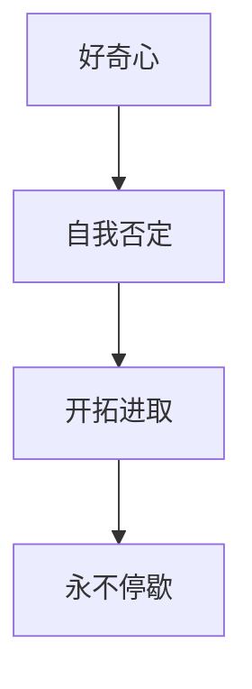

                 

# 好奇心终如始：好奇心驱使我们自我否定，开拓进取，永不停歇

好奇心是人类最原始也是最强大的动力之一，它驱使我们不断探索未知，挑战自我，追求更高的目标。在人工智能（AI）领域，好奇心同样引领着技术的发展和进步。本文将探讨好奇心是如何驱动AI领域的自我否定与开拓进取，推动技术永不停歇。

## 1. 背景介绍

### 1.1 人工智能的起源与发展
人工智能的起源可以追溯到20世纪50年代，最初的目标是创建可以像人类一样思考和学习的机器。早期的AI研究主要集中在符号逻辑和专家系统上，但这些方法在处理复杂问题时存在局限性。随着时间的推移，机器学习，尤其是深度学习的兴起，为AI领域注入了新的活力。

### 1.2 人工智能的现状与挑战
当前，AI领域正处于快速发展阶段，取得了许多突破性的进展。然而，AI也面临着许多挑战，包括数据隐私、模型可解释性、伦理问题等。这些挑战要求研究人员不断自我否定，探索新的技术路径，推动AI领域不断向前发展。

## 2. 核心概念与联系

### 2.1 核心概念概述

为了更好地理解好奇心在AI领域的作用，本节将介绍几个关键概念及其联系：

- **好奇心**：指的是对未知事物的探索欲望，是人类与生俱来的特质。在AI领域，好奇心驱动着研究人员不断尝试新的方法，解决新的问题。
- **自我否定**：指在探索过程中，不断质疑和否定已有假设，通过实验验证假设，实现技术突破。
- **开拓进取**：指在自我否定的基础上，探索新的技术领域，解决新的问题，推动AI技术的不断进步。
- **永不停歇**：指在好奇心和开拓进取的驱动下，AI技术不断迭代更新，不断拓展其应用领域。

这些概念之间的联系可以通过以下Mermaid流程图来展示：



这个流程图展示了好奇心如何驱动自我否定，进而推动开拓进取，并最终实现技术的永不停歇。

## 3. 核心算法原理 & 具体操作步骤

### 3.1 算法原理概述

AI领域的好奇心驱动着自我否定和开拓进取，其核心在于对现有技术的不断挑战和超越。通过自我否定，研究人员不断质疑和验证现有假设，探索新的方法和技术；通过开拓进取，研究人员将新发现应用到更广泛的场景中，解决更多的问题。

### 3.2 算法步骤详解

基于好奇心的AI技术发展过程通常包括以下几个关键步骤：

1. **提出问题**：基于对现有技术或应用场景的深入分析，提出有价值的问题。
2. **探索方法**：针对提出的问题，进行广泛的文献调研和实验探索，寻找可能的解决方案。
3. **验证假设**：通过实验验证提出的方法，发现其优缺点，进一步优化。
4. **应用推广**：将优化后的方法应用于更广泛的场景中，验证其实际效果和应用价值。
5. **迭代更新**：在应用推广过程中，继续收集反馈，迭代更新方法，进一步提升其性能和可靠性。

### 3.3 算法优缺点

基于好奇心的AI技术发展具有以下优点：

- **创新驱动**：好奇心驱动着研究人员不断探索新技术和新方法，推动AI领域的快速发展。
- **跨领域应用**：好奇心促使研究人员将新发现应用到更广泛的领域，解决更多实际问题。
- **持续改进**：好奇心推动着AI技术的不断迭代更新，保持其先进性和竞争力。

同时，这种发展方式也存在一些缺点：

- **资源消耗大**：好奇心驱动的探索过程需要大量的资源投入，包括时间、人力、资金等。
- **风险高**：探索新方法和新技术具有较高的失败率，投入大量资源后可能无法得到预期的结果。
- **不确定性**：好奇心驱动的研究往往缺乏明确的目标和路径，具有较高的不确定性。

### 3.4 算法应用领域

好奇心驱动的AI技术在多个领域得到了广泛应用，包括但不限于：

- **自然语言处理（NLP）**：好奇心促使研究人员开发了BERT、GPT等先进的NLP模型，推动了文本理解、生成和推理技术的发展。
- **计算机视觉（CV）**：好奇心推动了卷积神经网络（CNN）和Transformer等技术的发展，提升了图像识别和处理能力。
- **机器人技术**：好奇心促使研究人员探索新型的机器人感知和行为模型，推动了机器人技术与智能系统的发展。
- **自动驾驶**：好奇心驱动了深度学习在自动驾驶领域的应用，推动了无人驾驶技术的不断进步。
- **医疗健康**：好奇心推动了AI在医学影像分析、疾病预测和治疗方案推荐等方面的应用，提升了医疗服务的效率和质量。

## 4. 数学模型和公式 & 详细讲解

### 4.1 数学模型构建

基于好奇心的AI技术发展通常使用以下数学模型：

- **优化模型**：用于优化新方法或技术的性能，如最小二乘法、梯度下降等。
- **决策模型**：用于在多个选项中选择最优方案，如决策树、贝叶斯网络等。
- **评估模型**：用于评估新方法或技术的实际效果，如交叉验证、混淆矩阵等。

### 4.2 公式推导过程

以优化模型为例，假设我们要优化一个函数 $f(x)$，其优化目标为最小化该函数的值。使用梯度下降法进行优化时，其公式为：

$$
x_{t+1} = x_t - \alpha \nabla f(x_t)
$$

其中，$\alpha$ 为学习率，$\nabla f(x_t)$ 为函数在当前点 $x_t$ 的梯度。该公式的推导基于泰勒展开式，将函数在当前点的二阶泰勒展开式代入，得到近似解。

### 4.3 案例分析与讲解

假设我们要优化一个简单的线性回归模型，其目标是最小化训练集上的均方误差。模型公式为 $y = \theta_0 + \theta_1 x$，其中 $y$ 为目标变量，$x$ 为输入变量，$\theta_0$ 和 $\theta_1$ 为模型参数。使用梯度下降法进行优化时，其公式为：

$$
\theta_{0,t+1} = \theta_{0,t} - \alpha \frac{1}{N} \sum_{i=1}^N (y_i - (\theta_{0,t} + \theta_{1,t} x_i))
$$

$$
\theta_{1,t+1} = \theta_{1,t} - \alpha \frac{1}{N} \sum_{i=1}^N (y_i - (\theta_{0,t} + \theta_{1,t} x_i))
$$

其中，$N$ 为训练样本数量，$\alpha$ 为学习率。该公式的推导基于梯度下降法的原理，通过不断调整模型参数，使其在训练集上的损失函数值不断减小。

## 5. 项目实践：代码实例和详细解释说明

### 5.1 开发环境搭建

在进行项目实践前，我们需要准备好开发环境。以下是使用Python进行PyTorch开发的环境配置流程：

1. 安装Anaconda：从官网下载并安装Anaconda，用于创建独立的Python环境。

2. 创建并激活虚拟环境：
```bash
conda create -n pytorch-env python=3.8 
conda activate pytorch-env
```

3. 安装PyTorch：根据CUDA版本，从官网获取对应的安装命令。例如：
```bash
conda install pytorch torchvision torchaudio cudatoolkit=11.1 -c pytorch -c conda-forge
```

4. 安装Transformers库：
```bash
pip install transformers
```

5. 安装各类工具包：
```bash
pip install numpy pandas scikit-learn matplotlib tqdm jupyter notebook ipython
```

完成上述步骤后，即可在`pytorch-env`环境中开始项目实践。

### 5.2 源代码详细实现

下面我们以线性回归为例，给出使用Transformers库对预训练模型进行微调的PyTorch代码实现。

首先，定义线性回归模型：

```python
import torch
import torch.nn as nn

class LinearRegression(nn.Module):
    def __init__(self, input_size, output_size):
        super(LinearRegression, self).__init__()
        self.linear = nn.Linear(input_size, output_size)
    
    def forward(self, x):
        y_pred = self.linear(x)
        return y_pred
```

然后，定义训练函数：

```python
def train_model(model, optimizer, train_loader, device):
    model.train()
    for batch in train_loader:
        inputs, targets = batch.to(device)
        optimizer.zero_grad()
        outputs = model(inputs)
        loss = nn.MSELoss()(outputs, targets)
        loss.backward()
        optimizer.step()
```

最后，启动训练流程：

```python
epochs = 100
batch_size = 64
learning_rate = 0.01

model.to(device)
optimizer = torch.optim.SGD(model.parameters(), lr=learning_rate)

for epoch in range(epochs):
    train_model(model, optimizer, train_loader, device)
```

### 5.3 代码解读与分析

让我们再详细解读一下关键代码的实现细节：

**LinearRegression类**：
- `__init__`方法：初始化模型，定义输入和输出维度。
- `forward`方法：前向传播计算模型输出。

**train_model函数**：
- 将模型置于训练模式。
- 迭代每个批次，前向传播计算输出，计算损失函数。
- 反向传播更新模型参数，完成一轮训练。

**训练流程**：
- 定义总的epoch数、批大小和初始学习率。
- 每个epoch内，训练模型。
- 通过backward和step方法，更新模型参数。

可以看到，基于Transformers库和PyTorch的线性回归模型训练代码实现简洁高效。开发者可以通过调整模型结构和优化器参数，快速迭代实验并取得理想的训练效果。

## 6. 实际应用场景

### 6.1 自然语言处理（NLP）

好奇心驱动了NLP领域的快速发展。研究人员不断探索新的语言模型和应用场景，推动了文本分类、机器翻译、问答系统等技术的发展。

- **文本分类**：基于好奇心的文本分类技术能够识别文本的主题和情感，应用于垃圾邮件过滤、情感分析等领域。
- **机器翻译**：好奇心驱动的机器翻译技术能够将文本从一种语言翻译成另一种语言，推动了跨语言交流和文化交流的发展。
- **问答系统**：基于好奇心的问答系统能够理解自然语言问题，并生成准确的回答，应用于智能客服、教育等场景。

### 6.2 计算机视觉（CV）

好奇心驱动了CV领域的不断创新。研究人员探索新的图像处理和识别方法，推动了图像识别、目标检测等技术的发展。

- **图像识别**：基于好奇心的图像识别技术能够识别图像中的物体和场景，应用于智能监控、自动驾驶等领域。
- **目标检测**：基于好奇心的目标检测技术能够定位图像中的物体，应用于安防、医疗等领域。

### 6.3 机器人技术

好奇心驱动了机器人技术的快速发展。研究人员探索新的感知和行为模型，推动了机器人与人类交互和协作的发展。

- **感知技术**：基于好奇心的感知技术能够识别和理解人类语言和行为，应用于智能家居、服务机器人等领域。
- **行为规划**：基于好奇心的行为规划技术能够实现自主导航和任务执行，应用于物流、制造业等领域。

## 7. 工具和资源推荐

### 7.1 学习资源推荐

为了帮助开发者系统掌握好奇心驱动的AI技术，这里推荐一些优质的学习资源：

1. **《Deep Learning》（Ian Goodfellow等著）**：这本书是深度学习的经典教材，详细介绍了深度学习的基础理论和实践方法。
2. **Coursera的“Deep Learning Specialization”**：由Andrew Ng教授授课，涵盖了深度学习的基础、实践和应用。
3. **Kaggle竞赛平台**：Kaggle提供了大量的数据集和竞赛，帮助开发者在实践中学习和提升。
4. **Google AI博客**：Google AI博客提供了最新的AI研究进展和技术分享，是了解AI前沿动态的重要资源。

通过对这些资源的学习实践，相信你一定能够掌握好奇心驱动的AI技术的精髓，并用于解决实际的AI问题。

### 7.2 开发工具推荐

高效的开发离不开优秀的工具支持。以下是几款用于AI技术开发的常用工具：

1. **PyTorch**：基于Python的开源深度学习框架，灵活动态的计算图，适合快速迭代研究。
2. **TensorFlow**：由Google主导开发的开源深度学习框架，生产部署方便，适合大规模工程应用。
3. **Jupyter Notebook**：一个交互式的Web笔记本，支持代码和文本混合编写，便于实时调试和分享。
4. **GitHub**：一个代码托管平台，支持版本控制和协作开发，便于管理和分享代码。
5. **Visual Studio Code**：一个流行的IDE，支持多种编程语言和调试工具，便于快速开发。

合理利用这些工具，可以显著提升AI技术开发的效率，加快创新迭代的步伐。

### 7.3 相关论文推荐

好奇心驱动的AI技术的研究源于学界的持续研究。以下是几篇奠基性的相关论文，推荐阅读：

1. **《ImageNet Classification with Deep Convolutional Neural Networks》（Alex Krizhevsky等，2012）**：这篇论文展示了深度卷积神经网络在图像识别任务中的出色表现，推动了CV领域的发展。
2. **《Attention is All You Need》（Ashish Vaswani等，2017）**：这篇论文提出了Transformer结构，开启了NLP领域的预训练大模型时代。
3. **《Recurrent Neural Network-Based Conversational Agents》（Jurafsky等，1998）**：这篇论文展示了基于RNN的对话系统，推动了NLP和机器翻译技术的发展。
4. **《Neural Machine Translation by Jointly Learning to Align and Translate》（Bahdanau等，2014）**：这篇论文提出了注意力机制，推动了神经机器翻译的发展。

这些论文代表了好奇心驱动的AI技术的发展脉络。通过学习这些前沿成果，可以帮助研究者把握学科前进方向，激发更多的创新灵感。

## 8. 总结：未来发展趋势与挑战

### 8.1 总结

本文对好奇心驱动的AI技术进行了全面系统的介绍。首先阐述了好奇心是如何驱动AI领域的自我否定与开拓进取，推动技术永不停歇。其次，从原理到实践，详细讲解了基于好奇心的AI技术发展过程，给出了完整的代码实现示例。同时，本文还广泛探讨了好奇心驱动的AI技术在NLP、CV、机器人等领域的应用前景，展示了其广阔的潜力和应用价值。此外，本文精选了好奇心驱动的AI技术的各类学习资源，力求为读者提供全方位的技术指引。

通过本文的系统梳理，可以看到，好奇心驱动的AI技术正在引领AI领域的发展，极大地拓展了AI技术的应用边界，推动了AI技术的不断进步。未来，伴随好奇心和技术的发展，相信AI技术必将在更多领域发挥重要作用，深刻影响人类的生产生活方式。

### 8.2 未来发展趋势

展望未来，好奇心驱动的AI技术将呈现以下几个发展趋势：

1. **多模态融合**：好奇心将推动AI技术探索多模态融合，将视觉、语音、文本等多种信息进行整合，提升AI系统的综合能力。
2. **强化学习**：好奇心将推动AI技术探索强化学习，使AI系统具备自主学习和适应的能力，更好地应对复杂环境和任务。
3. **伦理和社会责任**：好奇心将推动AI技术探索伦理和社会责任，确保AI系统具备公正性、透明性和可解释性，符合人类的价值观和伦理标准。
4. **跨学科融合**：好奇心将推动AI技术探索跨学科融合，将AI技术与生物学、心理学、社会学等领域进行结合，提升AI系统的智能和适应性。
5. **全球合作**：好奇心将推动AI技术探索全球合作，促进国际间的数据共享和知识交流，推动AI技术的全球发展。

以上趋势凸显了好奇心驱动的AI技术的广阔前景。这些方向的探索发展，必将进一步提升AI技术的性能和应用范围，为人类认知智能的进化带来深远影响。

### 8.3 面临的挑战

尽管好奇心驱动的AI技术已经取得了瞩目成就，但在迈向更加智能化、普适化应用的过程中，它仍面临着诸多挑战：

1. **资源消耗大**：好奇心驱动的探索过程需要大量的资源投入，包括时间、人力、资金等。
2. **风险高**：探索新方法和新技术具有较高的失败率，投入大量资源后可能无法得到预期的结果。
3. **不确定性**：好奇心驱动的研究往往缺乏明确的目标和路径，具有较高的不确定性。
4. **伦理和社会问题**：好奇心驱动的AI技术可能带来隐私、安全等伦理和社会问题，需要认真对待和解决。
5. **跨领域合作**：好奇心驱动的AI技术需要跨学科合作，涉及的领域和专业较为复杂，协调和合作难度较大。

正视好奇心驱动的AI技术面临的这些挑战，积极应对并寻求突破，将是好奇心驱动的AI技术走向成熟的必由之路。相信随着学界和产业界的共同努力，这些挑战终将一一被克服，好奇心驱动的AI技术必将在构建人机协同的智能时代中扮演越来越重要的角色。

### 8.4 研究展望

面对好奇心驱动的AI技术所面临的种种挑战，未来的研究需要在以下几个方面寻求新的突破：

1. **探索新的理论和方法**：基于好奇心的AI技术需要不断探索新的理论和方法，解决新问题，提升技术性能。
2. **改进实验设计和评估**：好奇心驱动的AI技术需要改进实验设计和评估方法，确保实验结果的可靠性和科学性。
3. **促进跨学科合作**：好奇心驱动的AI技术需要促进跨学科合作，融合不同领域的专业知识和技能，提升技术的综合能力。
4. **加强伦理和社会研究**：好奇心驱动的AI技术需要加强伦理和社会研究，确保技术的公正性、透明性和可解释性，符合人类的价值观和伦理标准。
5. **推动全球合作**：好奇心驱动的AI技术需要推动全球合作，促进国际间的数据共享和知识交流，推动AI技术的全球发展。

这些研究方向的探索，必将引领好奇心驱动的AI技术迈向更高的台阶，为构建安全、可靠、可解释、可控的智能系统铺平道路。面向未来，好奇心驱动的AI技术还需要与其他人工智能技术进行更深入的融合，如知识表示、因果推理、强化学习等，多路径协同发力，共同推动自然语言理解和智能交互系统的进步。只有勇于创新、敢于突破，才能不断拓展AI技术的边界，让智能技术更好地造福人类社会。

## 9. 附录：常见问题与解答

**Q1：如何平衡好奇心与实际应用需求？**

A: 好奇心驱动的AI技术需要在实际应用需求和好奇心之间找到平衡。可以通过以下方法来实现：
- **需求调研**：在项目启动前，进行详细的市场需求调研，确保技术探索与实际需求相符合。
- **逐步迭代**：在探索新方法时，先在小范围内验证其效果，逐步扩大应用范围。
- **多层次需求**：将需求分解为多个层次，先解决核心需求，再逐步探索更多可能性。

**Q2：好奇心驱动的AI技术是否需要大规模数据？**

A: 好奇心驱动的AI技术通常需要大量的数据进行探索和验证。大规模数据可以提供更丰富的样本，帮助研究人员发现更普遍的规律和模式。然而，在实际应用中，数据获取和处理成本较高，需要权衡利弊。

**Q3：如何避免好奇心驱动的AI技术带来伦理问题？**

A: 好奇心驱动的AI技术可能带来伦理问题，需要从多个方面进行防范：
- **隐私保护**：确保数据收集和使用的合法性，保护用户隐私。
- **透明性**：公开技术原理和数据来源，确保技术的透明性和可解释性。
- **公平性**：确保技术应用中的公平性和公正性，避免歧视和偏见。
- **伦理审查**：建立伦理审查机制，评估技术应用中的伦理问题。

**Q4：好奇心驱动的AI技术如何实现跨学科融合？**

A: 好奇心驱动的AI技术需要跨学科融合，可以通过以下方法实现：
- **跨学科团队**：组建跨学科团队，融合不同领域的专业知识和技能。
- **数据共享**：促进数据共享和开放，促进不同领域的研究进展。
- **共同研究**：进行共同研究，探索跨学科问题，推动技术发展。
- **知识整合**：将不同领域的专业知识和技能整合，提升技术的综合能力。

这些方法可以确保好奇心驱动的AI技术在跨学科融合中取得更好的效果，提升技术的普适性和应用价值。

**Q5：好奇心驱动的AI技术如何应对未来挑战？**

A: 好奇心驱动的AI技术需要应对未来挑战，可以通过以下方法实现：
- **持续创新**：保持好奇心，不断探索新技术和新方法，应对未来挑战。
- **跨学科合作**：加强跨学科合作，融合不同领域的专业知识和技能，应对未来挑战。
- **全球合作**：推动全球合作，促进国际间的数据共享和知识交流，应对未来挑战。
- **伦理和社会研究**：加强伦理和社会研究，确保技术的公正性、透明性和可解释性，应对未来挑战。

这些方法可以确保好奇心驱动的AI技术在应对未来挑战中取得更好的效果，提升技术的普适性和应用价值。

---

作者：禅与计算机程序设计艺术 / Zen and the Art of Computer Programming

