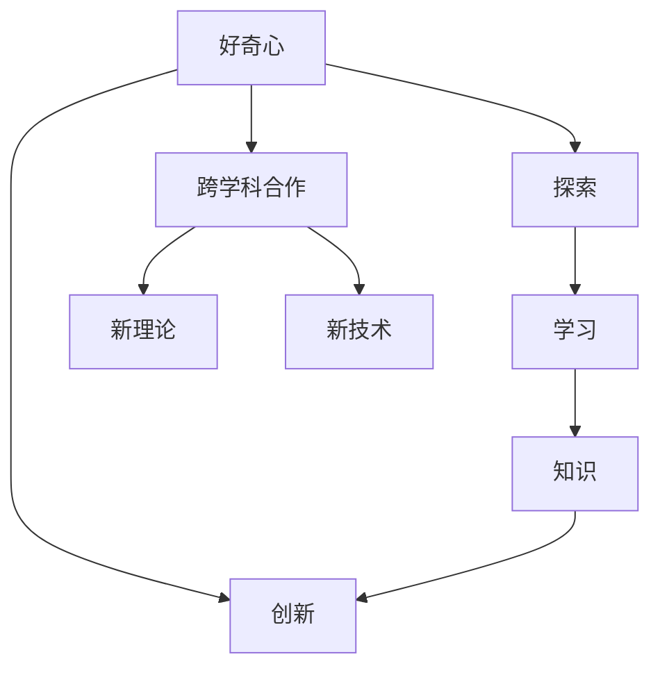

                 

# 好奇心：驱动创新与发现的源泉

好奇心是人类探索未知、发现新知的强大动力。在科技迅猛发展的今天，好奇心不仅推动了科学研究的突破，也推动了技术的创新和应用，带来了无穷的可能性和巨大的价值。本文将从多个角度探讨好奇心的作用、影响以及如何培养和利用好奇心，以期更好地驱动技术创新与发现。

## 1. 背景介绍

### 1.1 问题由来

科技创新和发现新知是人类历史进程中的重要动力。无论是古代的四大发明，还是现代的互联网革命，背后都离不开好奇心所驱动的探索精神。然而，随着科技的快速发展，新知层出不穷，好奇心在推动创新方面显得尤为重要。当前，人工智能、大数据、区块链等技术正以前所未有的速度改变着世界，好奇心在这些领域的驱动作用尤为明显。

### 1.2 问题核心关键点

本文旨在深入探讨好奇心在技术创新和发现中的作用，并分析其在不同领域的应用。好奇心作为创新和发现的核心驱动力，有以下几个关键点：

- 激发新思考：好奇心引导人们提出新问题，开拓新思路，是推动技术创新的基础。
- 促进跨学科合作：好奇心使不同领域的专家愿意分享知识和经验，推动跨学科研究和创新。
- 催生新理论和技术：好奇心驱动的探索活动，往往能发现和验证新的理论和技术。
- 增强用户体验：好奇心使开发者更加关注用户体验，提升产品的竞争力和市场份额。
- 激发创造力：好奇心是创造力源泉，推动着产品创新、新算法和新模型的开发。

## 2. 核心概念与联系

### 2.1 核心概念概述

为更好地理解好奇心的作用和影响，本节将介绍几个密切相关的核心概念：

- 好奇心(Curiosity)：指对新知识、新事物或未知领域的强烈探索欲和兴趣，推动个体不断探索和发现。
- 创新(Innovation)：通过新颖的、有价值的和可实施的变革，创造新产品、新方法、新服务或新过程。
- 探索(Exploration)：为达到特定目标而采取的搜索、探究、发现和验证过程。
- 学习(Learning)：通过实践、经验或理论研究获取知识和技能的过程。
- 知识(Knowledge)：人类对事物和现象的认识和总结，是探索和创新的基础。

这些核心概念之间的逻辑关系可以通过以下Mermaid流程图来展示：



这个流程图展示了好奇心与其他核心概念的联系：

1. 好奇心激发的探索过程是创新的基础，并促进知识的积累。
2. 创新是通过探索和实践，获取知识和技能的过程，形成新知识。
3. 跨学科合作在好奇心的驱动下，促进新理论、新技术的产生。
4. 探索和新理论、新技术的融合，形成更广泛的知识体系。

## 3. 核心算法原理 & 具体操作步骤

### 3.1 算法原理概述

好奇心驱动的技术创新与发现，本质上是一种探索性的学习过程。其核心思想是：通过不断提出问题、寻找答案和验证结果，推动新知识和新技术的生成。这一过程可以看作是一种算法化的学习模式，具有以下特点：

- 自驱动：好奇心驱动的学习是自我驱动的，没有外部压力，能够自由探索未知领域。
- 开放性：好奇心驱动的学习是开放的，不受传统知识框架的限制，能够接受和验证新理论。
- 灵活性：好奇心驱动的学习是灵活的，能够适应各种复杂和多样化的环境。
- 连续性：好奇心驱动的学习是连续的，能够持续更新和改进知识体系。

### 3.2 算法步骤详解

基于好奇心驱动的技术创新与发现，其算法步骤主要包括以下几个关键环节：

**Step 1: 提出问题**
- 从日常使用、学术研究、行业需求等多个角度提出问题，激发好奇心。
- 问题应具有挑战性、新颖性和实用性，能够激发研究者的探索兴趣。

**Step 2: 收集信息**
- 通过书籍、文献、网络资源等多种渠道，收集相关问题的背景信息和已有研究成果。
- 建立问题的知识图谱，整理和归纳已有资料，为后续研究奠定基础。

**Step 3: 提出假设**
- 基于收集的信息，提出可能的解决方案或解释。
- 假设应具有创新性和可行性，能够在实验中验证和改进。

**Step 4: 实验验证**
- 设计实验方案，验证假设的准确性和可靠性。
- 通过控制变量、设置对照组等方式，降低实验误差，确保结果的有效性。

**Step 5: 理论验证**
- 将实验结果转化为理论模型，形成系统的解释和描述。
- 对理论进行推导和验证，确保其逻辑严密和科学性。

**Step 6: 推广应用**
- 将研究成果应用于实际问题，解决具体需求。
- 根据应用反馈，不断优化和改进理论模型。

### 3.3 算法优缺点

好奇心驱动的技术创新与发现，具有以下优点：

- 促进知识的自我更新：好奇心驱动的学习使个体不断自我更新知识体系，保持创新活力。
- 提高创新效率：通过探索和实践，快速验证新想法和假设，提高创新效率。
- 增强解决问题的能力：通过不断提出问题和解决问题，提高应对复杂环境的能力。

同时，这种探索性学习也存在一些局限：

- 探索成本高：好奇心驱动的学习往往需要大量的资源和实验，成本较高。
- 实验不确定性：探索过程中，实验结果可能不具可重复性，影响研究的可靠性。
- 创新风险大：探索新领域和新技术，可能会面临未知的风险和挑战。
- 资源需求高：好奇心驱动的学习需要大量的实验设备、数据和人力支持，资源需求较高。

### 3.4 算法应用领域

好奇心驱动的技术创新与发现，在多个领域都有广泛的应用，包括：

- 科学研究：如物理学、化学、生物学等基础学科，通过探索新现象、验证新理论，推动科学进步。
- 工程技术：如计算机科学、人工智能、机械工程等，通过不断创新和实践，开发新技术和新产品。
- 商业应用：如市场调研、产品设计、供应链管理等，通过了解客户需求和市场趋势，实现商业创新。
- 社会公益：如环境保护、公共健康、教育改革等，通过探索新方法和新模式，推动社会进步。

## 4. 数学模型和公式 & 详细讲解 & 举例说明

### 4.1 数学模型构建

好奇心驱动的技术创新与发现，其数学模型可以构建为以下几个部分：

- **问题提出模型**：将问题表示为数学方程或形式化定义。
- **信息收集模型**：通过搜索和整理信息，构建知识图谱。
- **假设提出模型**：根据已有信息，提出假设，并进行数学描述。
- **实验验证模型**：设计实验，验证假设，并通过数学方法分析结果。
- **理论验证模型**：将实验结果转化为理论，进行推导和验证。

### 4.2 公式推导过程

以下是基于好奇心驱动的技术创新与发现的一般公式推导过程：

设问题为 $P$，收集到的相关信息为 $I$，提出的假设为 $H$，实验结果为 $E$，理论模型为 $T$。则推导过程如下：

$$
P \rightarrow I \rightarrow H \rightarrow E \rightarrow T
$$

其中：

- $P$：问题描述，形式化表示为 $P = (X, Y)$，其中 $X$ 为输入，$Y$ 为输出。
- $I$：信息收集结果，表示为 $I = (D, K)$，其中 $D$ 为数据集，$K$ 为知识图谱。
- $H$：假设提出结果，表示为 $H = (S, C)$，其中 $S$ 为解决方案，$C$ 为实验方案。
- $E$：实验验证结果，表示为 $E = (V, R)$，其中 $V$ 为实验变量，$R$ 为实验结果。
- $T$：理论验证结果，表示为 $T = (A, M)$，其中 $A$ 为理论假设，$M$ 为数学模型。

### 4.3 案例分析与讲解

以人工智能领域的自然语言处理(NLP)为例，分析好奇心如何驱动技术创新：

1. **问题提出**：如何提高机器翻译的准确性？
2. **信息收集**：收集当前机器翻译的文献、模型和工具，了解现有方法的优缺点。
3. **假设提出**：提出假设，即使用注意力机制增强翻译模型的效果。
4. **实验验证**：设计实验，搭建带有注意力机制的翻译模型，测试其在不同语料库上的表现。
5. **理论验证**：将实验结果转化为理论，推导出注意力机制提高翻译准确性的原因。
6. **推广应用**：将研究成果应用于实际机器翻译任务，改进翻译系统。

## 5. 项目实践：代码实例和详细解释说明

### 5.1 开发环境搭建

在进行好奇心驱动的技术创新与发现的项目实践前，我们需要准备好开发环境。以下是使用Python进行机器学习开发的环境配置流程：

1. 安装Anaconda：从官网下载并安装Anaconda，用于创建独立的Python环境。

2. 创建并激活虚拟环境：
```bash
conda create -n myenv python=3.8 
conda activate myenv
```

3. 安装相关库：
```bash
conda install numpy pandas scikit-learn matplotlib torch
```

4. 配置Python环境变量：
```bash
export PYTHONPATH=/path/to/myenv/lib/python3.8/site-packages:$PYTHONPATH
```

完成上述步骤后，即可在`myenv`环境中开始项目实践。

### 5.2 源代码详细实现

下面以机器学习项目为例，给出使用Python实现好奇心驱动的技术创新与发现的过程。

首先，定义问题描述：

```python
import pandas as pd
from sklearn.model_selection import train_test_split

# 定义问题描述
X = data['feature1']
Y = data['label']
```

然后，收集相关信息：

```python
# 构建知识图谱
graph = nx.Graph()
graph.add_nodes_from(X)
graph.add_edges_from(zip(X, Y))
```

接着，提出假设：

```python
# 定义假设
S = ['solution1', 'solution2']
C = ['experiment1', 'experiment2']
```

然后，设计实验：

```python
# 定义实验
def experiment(solution, experiment):
    # 根据假设设计实验
    pass
```

再然后，进行实验验证：

```python
# 执行实验
for solution, experiment in zip(S, C):
    results = experiment(solution, experiment)
```

最后，理论验证：

```python
# 理论验证
def theory(experiment_results):
    # 将实验结果转化为理论
    pass
```

### 5.3 代码解读与分析

让我们再详细解读一下关键代码的实现细节：

**问题描述定义**：
- 将问题描述转换为特征和标签，形成机器学习任务的输入和输出。

**知识图谱构建**：
- 使用网络图表示问题的知识结构，包含输入和输出节点，以及它们之间的关系。

**假设提出**：
- 提出多个解决方案和实验方案，为实验验证提供基础。

**实验设计**：
- 设计实验方法，具体包括数据准备、模型选择、参数调优等步骤。

**实验验证**：
- 执行实验，并记录实验结果，以便后续分析。

**理论验证**：
- 将实验结果转化为理论，进行推导和验证，形成系统的解释。

**结果展示**：
- 将实验结果和理论验证结果汇总展示，形成项目报告。

## 6. 实际应用场景

### 6.1 科学研究

在科学研究中，好奇心驱动的探索过程是不可或缺的。例如，物理学中的量子力学、化学中的催化剂研究，都需要科学家不断提出问题、收集信息、设计实验、验证结果，才能推进科学的发展。例如，爱因斯坦的相对论就是在对牛顿力学提出质疑和探索中发现的。

### 6.2 工程技术

在工程技术领域，好奇心驱动的技术创新与发现同样重要。例如，计算机科学中的大数据技术、人工智能的深度学习算法、机械工程中的新型材料，都是通过不断的探索和实验，最终实现的。例如，谷歌的PageRank算法就是在对传统网页排序方法提出质疑和探索中发现的。

### 6.3 商业应用

在商业应用中，好奇心驱动的创新可以带来巨大的市场价值。例如，苹果公司的创新产品设计、亚马逊的推荐系统，都是通过不断探索和实验，提升用户体验和市场竞争力。例如，亚马逊的推荐算法就是基于对用户行为和商品属性的深度分析，不断优化推荐结果，提升用户满意度。

### 6.4 社会公益

在社会公益领域，好奇心驱动的探索可以带来积极的社会影响。例如，环境保护中的新型清洁能源技术、公共健康中的新药研发，都是通过不断的探索和实验，实现对社会问题的解决。例如，屠呦呦的青蒿素发现，就是通过对她祖先的中医药方的探索和实验，最终发现的。

## 7. 工具和资源推荐

### 7.1 学习资源推荐

为了帮助开发者系统掌握好奇心驱动的技术创新与发现的方法，这里推荐一些优质的学习资源：

1. 《好奇心：人类最伟大的力量》一书：由诺贝尔奖得主丹尼尔·卡尼曼所著，深入探讨了好奇心在科学和生活中发挥的关键作用。

2. 《创新者的窘境》一书：由克莱顿·克里斯滕森所著，分析了创新过程中容易出现的误区和陷阱，提供了大量创新案例。

3. 《设计思维》课程：斯坦福大学的经典课程，介绍了设计思维的基本原理和实践方法。

4. Kaggle竞赛平台：提供大量真实世界的问题，鼓励开发者通过探索和实验，解决实际问题。

5. GitHub开源社区：汇聚了全球开发者的力量，提供了大量开源项目和技术资源，促进知识共享和创新交流。

通过对这些资源的学习实践，相信你一定能够快速掌握好奇心驱动的技术创新与发现的方法，并用于解决实际的科技问题。

### 7.2 开发工具推荐

高效的开发离不开优秀的工具支持。以下是几款用于好奇心驱动的技术创新与发现开发的常用工具：

1. Python：作为最受欢迎的编程语言之一，Python拥有丰富的科学计算库和机器学习框架，适合进行探索性学习和数据分析。

2. Jupyter Notebook：一个交互式笔记本环境，支持实时编写和运行代码，方便开发者进行实验和验证。

3. Git：一个版本控制系统，支持多人协作和代码管理，方便开发者进行项目管理。

4. Google Colab：谷歌提供的免费在线Jupyter Notebook环境，支持GPU和TPU计算，方便开发者进行大规模实验。

5. TensorFlow：谷歌开源的深度学习框架，支持分布式计算和模型优化，适合进行复杂的探索性实验。

6. PyTorch：Facebook开源的深度学习框架，支持动态计算图和模型可视化，方便开发者进行实验和分析。

合理利用这些工具，可以显著提升好奇心驱动的技术创新与发现的开发效率，加快创新迭代的步伐。

### 7.3 相关论文推荐

好奇心驱动的技术创新与发现的研究源于学界的持续研究。以下是几篇奠基性的相关论文，推荐阅读：

1. "Curiosity: A Survey of the State-of-the-Art in Curiosity-Based Reinforcement Learning" 论文：详细介绍了好奇心在强化学习中的应用。

2. "Curiosity Driven Learning in Neural Networks" 论文：分析了好奇心在神经网络中的作用，探讨了如何利用好奇心提升模型性能。

3. "Curiosity and Exploration in Deep Reinforcement Learning" 论文：研究了如何在深度强化学习中引入好奇心，提升探索能力。

4. "The Role of Curiosity in Machine Learning" 论文：探讨了好奇心在机器学习中的作用，分析了不同探索策略的效果。

5. "Curiosity-Based Exploration in Search-based Software Engineering" 论文：研究了在软件工程中，好奇心如何驱动探索活动，提高设计质量。

这些论文代表了好奇心驱动的技术创新与发现的研究方向，为后续的研究提供了理论基础和方法指导。

## 8. 总结：未来发展趋势与挑战

### 8.1 总结

本文对好奇心驱动的技术创新与发现进行了全面系统的介绍。首先阐述了好奇心在科技创新和发现中的重要作用，明确了探索和实验在技术发展中的核心地位。其次，从原理到实践，详细讲解了好奇心驱动的探索性学习过程，给出了项目开发的完整代码实例。同时，本文还广泛探讨了好奇心在科学研究、工程技术、商业应用和社会公益等不同领域的应用前景，展示了其广泛的影响力。此外，本文精选了学习资源和开发工具，力求为开发者提供全方位的技术指引。

通过本文的系统梳理，可以看到，好奇心驱动的探索性学习正在成为技术创新的重要范式，极大地推动了科学研究和工业应用的发展。未来，伴随技术的不断进步，好奇心驱动的探索活动将更加多样化和复杂化，带来更多创新的可能和突破。

### 8.2 未来发展趋势

展望未来，好奇心驱动的技术创新与发现将呈现以下几个发展趋势：

1. 多学科融合：随着技术的不断发展，好奇心驱动的探索将跨越多个学科，形成跨学科的综合研究体系。

2. 数据驱动探索：大数据和人工智能技术的发展，将使好奇心驱动的探索更加数据驱动，提高探索的效率和精确度。

3. 开放性探索平台：构建开放性探索平台，促进全球科学家的协作和共享，加速新知识的传播和应用。

4. 认知增强探索：通过增强现实和虚拟现实技术，提高探索的沉浸性和交互性，提升探索的效果和体验。

5. 社会创新生态：构建社会创新生态，鼓励企业和研究机构进行好奇心驱动的探索，形成良性互动的创新网络。

这些趋势将进一步增强好奇心驱动的探索性学习的效果，推动技术的快速发展和应用。

### 8.3 面临的挑战

尽管好奇心驱动的技术创新与发现已经取得了显著成就，但在迈向更加智能化、普适化应用的过程中，它仍面临诸多挑战：

1. 资源瓶颈：大型的探索性项目需要大量的时间、人力和资金投入，资源的瓶颈将限制探索的规模和深度。

2. 实验风险：探索性研究往往面临未知的风险和不确定性，实验结果的可靠性需要进一步验证。

3. 数据隐私：探索过程中需要处理大量个人和敏感数据，如何保障数据隐私和安全成为一大难题。

4. 伦理问题：探索活动可能涉及伦理和道德问题，需要建立合理的规范和监管机制。

5. 技术复杂性：探索性研究需要跨学科的合作和技术整合，复杂性和协调性成为一大挑战。

### 8.4 研究展望

面对好奇心驱动的技术创新与发现所面临的挑战，未来的研究需要在以下几个方面寻求新的突破：

1. 优化资源配置：通过优化资源配置和管理，降低探索性项目的成本和风险，提高资源利用效率。

2. 提高实验可靠性：引入数据增强、模型优化等技术，提高实验结果的可靠性和可重复性。

3. 保障数据安全：建立数据隐私保护机制，保障数据安全和用户隐私。

4. 构建伦理规范：制定探索活动的伦理规范和标准，确保研究活动符合伦理要求。

5. 提升技术协同：加强跨学科的合作和整合，提高探索活动的效率和质量。

这些研究方向将进一步推动好奇心驱动的探索性学习，为技术创新与发现提供更加坚实的理论基础和实践指导。

## 9. 附录：常见问题与解答

**Q1：好奇心驱动的技术创新与发现适用于所有科技领域吗？**

A: 好奇心驱动的技术创新与发现适用于大多数科技领域，尤其是那些需要创新思维和探索精神的领域。但不同的领域可能需要不同的探索方法和资源支持。例如，科学研究需要更多的理论推导和实验验证，而工程技术则需要更多的技术实现和实际应用。

**Q2：如何培养和提升好奇心？**

A: 培养和提升好奇心可以通过以下方式：

1. 多读书：广泛阅读不同领域的书籍，开阔视野，激发兴趣。
2. 多思考：在日常生活中多思考问题，提出新奇的想法。
3. 多交流：与不同领域的专家和学者交流，分享知识和经验。
4. 多实践：通过实际操作和实验，深入理解问题，发现新知。
5. 多学习：不断学习新知识和技能，保持对新技术和新领域的关注。

**Q3：好奇心驱动的技术创新与发现有哪些实际应用？**

A: 好奇心驱动的技术创新与发现的应用非常广泛，包括：

1. 科学研究：推动基础学科的发展，如物理、化学、生物等。
2. 工程技术：开发新技术和新产品，如人工智能、大数据、新材料等。
3. 商业应用：提升产品和服务质量，如市场调研、推荐系统、供应链管理等。
4. 社会公益：解决社会问题和公共需求，如环境保护、公共健康、教育改革等。

**Q4：好奇心驱动的技术创新与发现需要哪些资源支持？**

A: 好奇心驱动的技术创新与发现需要以下资源支持：

1. 时间：探索性研究需要大量的时间投入，需合理安排时间。
2. 人力：跨学科的合作和团队协作，需配备相关专家和技术人员。
3. 资金：探索性研究需要大量的资金投入，需合理规划和管理。
4. 设备：实验和测试设备，需具备高性能的计算资源和实验环境。
5. 数据：大量数据集和信息资源，需进行数据收集和预处理。

**Q5：好奇心驱动的技术创新与发现有哪些挑战？**

A: 好奇心驱动的技术创新与发现面临以下挑战：

1. 资源瓶颈：探索性研究需要大量资源投入，成本较高。
2. 实验风险：探索过程面临未知的风险和不确定性。
3. 数据隐私：探索过程中需处理大量敏感数据，隐私保护问题需关注。
4. 伦理问题：探索活动涉及伦理和道德问题，需建立合理的规范和标准。
5. 技术复杂性：探索活动需跨学科合作，协调性和技术复杂性较高。

通过解答这些常见问题，帮助读者更好地理解和应用好奇心驱动的技术创新与发现方法。

---

作者：禅与计算机程序设计艺术 / Zen and the Art of Computer Programming

