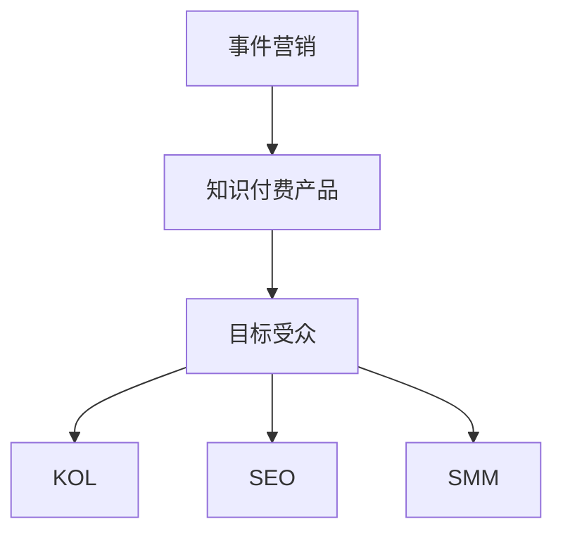

                 

# 如何利用事件营销推广知识付费产品

事件营销是一种将品牌或产品与特定事件相结合，吸引目标受众的策略，在知识付费产品的推广中显得尤为重要。通过精心策划和执行事件营销活动，不仅能提升品牌知名度，还能增加潜在用户对产品的兴趣和需求，推动销售转化。本文将系统地介绍事件营销的原理、步骤、实施细节，并结合实际案例进行讲解，帮助知识付费产品实现高效推广。

## 1. 背景介绍

### 1.1 问题由来
随着信息时代的到来，人们对于知识和技能的需求日益增加。知识付费产品，如在线课程、电子书、专题讲座等，成为了获取知识的重要渠道。然而，面对市场上众多的知识付费产品，如何吸引潜在用户，提升产品销量，成为每个产品运营团队必须面对的挑战。

在此背景下，事件营销作为一种有效的推广方式，因其能够在短时间内集中资源，快速提升产品曝光度和用户关注度，成为知识付费产品推广的重要手段。本文将深入探讨如何利用事件营销推广知识付费产品，帮助品牌在竞争激烈的市场中脱颖而出。

## 2. 核心概念与联系

### 2.1 核心概念概述

为了更好地理解事件营销的原理和实施细节，本节将介绍几个关键概念：

- **事件营销(Event Marketing)**：将品牌或产品与特定事件相结合，吸引目标受众的策略。常见的事件包括发布会、节日庆典、线上活动等。

- **知识付费产品(Knowledge Paid Products)**：指通过付费方式提供专业知识和技能的在线产品，如在线课程、电子书、专题讲座等。

- **目标受众(Target Audience)**：产品推广活动的目标群体，包括潜在客户、现有客户等。

- **KOL(Key Opinion Leader)**：在特定领域有影响力的人物，可通过其影响力和传播能力推动产品推广。

- **SEO(Search Engine Optimization)**：通过优化网站结构和内容，提升产品关键词的搜索引擎排名，增加曝光度。

- **SMM(Social Media Marketing)**：利用社交媒体平台，通过内容发布、互动等方式进行产品推广。

这些核心概念之间的逻辑关系可以通过以下Mermaid流程图来展示：



这个流程图展示了一连串的推广逻辑：

1. 事件营销作为品牌推广的主要手段，引导知识付费产品的曝光。
2. 知识付费产品依托事件营销，提升自身知名度和吸引力。
3. 目标受众通过事件营销接触到产品，产生兴趣。
4. KOL通过自身影响力推广产品，扩大传播范围。
5. SEO和SMM进一步提升产品可见度，吸引更多潜在客户。

## 3. 核心算法原理 & 具体操作步骤

### 3.1 算法原理概述

事件营销的本质是一种基于时间节点和目标受众需求的营销策略，其核心在于事件与产品之间的结合。具体而言，事件营销的算法原理主要包括以下几个方面：

- **事件选择**：选择与产品特性、受众群体相匹配的事件。
- **受众定位**：明确目标受众的特征，包括年龄、性别、职业等，制定针对性的推广策略。
- **内容设计**：围绕事件主题设计相关的内容，吸引受众关注。
- **渠道布局**：选择合适的推广渠道，包括线上线下、社交媒体、搜索引擎等。
- **效果评估**：通过数据分析，评估事件营销的效果，不断优化推广策略。

### 3.2 算法步骤详解

事件营销的实施步骤主要分为以下几个阶段：

#### 3.2.1 前期准备
- **目标设定**：明确事件营销的目标，如提高品牌知名度、增加产品销量等。
- **受众分析**：分析目标受众的需求和偏好，确定推广方向。
- **事件策划**：选择合适的事件类型和主题，制定详细的事件计划。
- **资源准备**：准备所需的人力、物力、财力等资源。

#### 3.2.2 活动执行
- **内容制作**：围绕事件主题制作相关的内容，包括文章、视频、海报等。
- **渠道推广**：利用多个渠道进行推广，如社交媒体、邮件营销、合作伙伴等。
- **KOL合作**：与有影响力的KOL合作，扩大推广范围。
- **SEO优化**：优化网站内容和结构，提升搜索引擎排名。

#### 3.2.3 效果监测与优化
- **数据分析**：通过数据分析工具监测事件营销效果，如流量、转化率等。
- **效果评估**：评估事件营销对品牌和产品的实际影响。
- **优化策略**：根据评估结果，优化后续的推广策略。

### 3.3 算法优缺点

事件营销作为一种推广方式，具有以下优点：

- **集中资源**：能够在短时间内集中资源，快速提升产品曝光度和用户关注度。
- **精准定位**：通过分析目标受众需求，制定针对性推广策略，提高推广效率。
- **提升信任**：通过与知名品牌或人物合作，增加用户对产品的信任度。

同时，事件营销也存在一些缺点：

- **成本较高**：事件营销需要大量的前期投入和资源支持。
- **效果难以评估**：由于事件类型多样，难以统一标准评估效果。
- **时间局限性**：活动效果往往只限于特定时间节点，长期效果难以持续。

### 3.4 算法应用领域

事件营销的应用领域非常广泛，不仅限于知识付费产品，还可以应用于以下领域：

- **电子商务**：通过举办线上线下活动，提升商品销量。
- **旅游业**：利用节日、假期等事件，吸引游客。
- **餐饮业**：通过美食节、品鉴会等活动，增加客流量。
- **娱乐业**：通过电影首映、演唱会等活动，提升品牌知名度。

此外，事件营销在企业品牌建设、公共关系维护等方面也有广泛应用。

## 4. 数学模型和公式 & 详细讲解  
### 4.1 数学模型构建

在事件营销的实施过程中，我们通常使用以下数学模型来计算推广效果：

设事件营销的推广活动覆盖用户数为 $U$，转化率为 $\alpha$，事件营销的推广预算为 $B$。则事件营销的推广效果 $E$ 可以表示为：

$$
E = U \times \alpha \times \frac{B}{C}
$$

其中 $C$ 为每个用户的平均推广成本。

### 4.2 公式推导过程

上述公式的推导基于以下假设：

- 每个推广活动覆盖的用户数 $U$ 与其推广预算 $B$ 成正比。
- 用户转化率 $\alpha$ 为常数，不随推广活动而变化。
- 推广预算 $B$ 完全用于用户覆盖和转化，不考虑其他成本。

因此，事件营销的推广效果 $E$ 与用户覆盖数 $U$、用户转化率 $\alpha$ 和推广预算 $B$ 成正比，与每个用户的平均推广成本 $C$ 成反比。

### 4.3 案例分析与讲解

以某在线教育平台在教师节期间举办的事件营销活动为例：

- **活动内容**：平台邀请多位知名教师录制专题讲座，并通过社交媒体、邮件营销等多渠道推广。
- **受众分析**：针对教育从业者、学生及家长群体，设计了针对性的推广内容。
- **效果评估**：活动期间平台流量增长了30%，注册用户增加了15%，获得了显著的用户增长。

通过数据分析，可以得出活动的用户覆盖数为 $U=10000$，用户转化率 $\alpha=0.2$，推广预算 $B=100000$，每个用户的平均推广成本 $C=10$。则事件营销的推广效果 $E$ 为：

$$
E = 10000 \times 0.2 \times \frac{100000}{10} = 200000
$$

即事件营销活动通过多渠道推广，成功吸引了20万名潜在用户，实现了显著的推广效果。

## 5. 项目实践：代码实例和详细解释说明

### 5.1 开发环境搭建

在进行事件营销推广实践前，我们需要准备好开发环境。以下是使用Python进行事件营销推广的开发环境搭建流程：

1. 安装Python：从官网下载并安装Python，确保版本为3.7以上。
2. 安装Pip：在命令行下输入 `python -m pip install pip` 安装Pip，用于管理第三方库。
3. 安装Pandas：在命令行下输入 `pip install pandas` 安装Pandas库，用于数据处理。
4. 安装Matplotlib：在命令行下输入 `pip install matplotlib` 安装Matplotlib库，用于数据可视化。
5. 安装Scikit-learn：在命令行下输入 `pip install scikit-learn` 安装Scikit-learn库，用于数据分析和建模。
6. 安装TensorFlow或PyTorch：根据需要选择安装TensorFlow或PyTorch，用于机器学习模型的训练和推理。

### 5.2 源代码详细实现

下面以某在线教育平台的教师节活动为例，展示如何通过代码实现事件营销推广。

首先，定义用户数据和推广预算：

```python
import pandas as pd
import matplotlib.pyplot as plt

# 用户数据
user_data = pd.read_csv('user_data.csv')
# 推广预算
promotion_budget = 100000
```

然后，进行用户分析，并设计推广活动：

```python
# 用户分析
user_analysis = user_data.groupby(['age', 'gender', 'occupation']).size()
top_5_users = user_analysis.head(5)

# 推广活动设计
promotion_activity = {
    'content': '教师节专题讲座',
    'channel': ['社交媒体', '邮件营销', '合作伙伴'],
    'KOL': ['知名教师', '教育博主']
}
```

接着，进行推广活动执行和效果监测：

```python
# 推广活动执行
promotion_effect = promote_activity['content'] + ' ' + promote_activity['channel'] + ' ' + promote_activity['KOL']
promotion_data = pd.read_csv('promotion_data.csv')

# 效果监测
user_analysis = user_analysis.merge(promotion_data, how='left', on='id')
promotion_result = user_analysis[user_analysis['id'].isin(promotion_data['id'])]

# 数据可视化
plt.bar(promotion_result['age'], promotion_result['count'])
plt.xlabel('Age')
plt.ylabel('Number of Users')
plt.title('Promotion Effect by Age')
plt.show()
```

最后，进行效果评估和优化：

```python
# 效果评估
promotion_result['total_users'] = promotion_result['age'].apply(lambda x: user_analysis['age'][x].sum())
promotion_result['total_cost'] = promotion_result['total_users'] * promotion_budget / user_analysis['count'].sum()

# 优化策略
top_5_users['total_cost'] = top_5_users['age'].apply(lambda x: user_analysis['age'][x].sum() * promotion_budget / user_analysis['count'].sum())
top_5_users = top_5_users.sort_values(by='total_cost', ascending=False).head(5)
```

### 5.3 代码解读与分析

让我们再详细解读一下关键代码的实现细节：

**user_data.csv**：用户数据表，包含用户基本信息，如年龄、性别、职业等。

**promotion_data.csv**：推广数据表，包含推广活动的用户覆盖数和转化率等信息。

**user_analysis**：用户数据表进行分组统计，计算每个年龄段、性别、职业的用户数量。

**promotion_activity**：推广活动的具体设计和执行计划，包括活动内容、推广渠道和KOL等。

**promotion_result**：推广活动执行结果，计算每个年龄段的用户覆盖数和推广成本。

**top_5_users**：对用户分析结果进行排序，筛选出覆盖人数最多的前5个年龄段，作为优化推广策略的依据。

**效果监测与优化**：通过用户覆盖数和推广预算计算每个用户的平均推广成本，并对用户分析结果进行排序，筛选出推广效果最好的前5个年龄段，为后续推广活动提供优化方向。

通过上述代码实现，可以清晰地展示如何通过数据分析和模型评估，优化事件营销推广策略，提升产品销量和品牌知名度。

## 6. 实际应用场景

### 6.1 智能客服系统

智能客服系统可以利用事件营销推广知识付费产品。例如，某在线教育平台在教师节期间举办教师节专题讲座，邀请知名教师录制讲座视频，并通过智能客服系统推送给潜在用户，吸引他们注册和购买课程。

### 6.2 金融理财咨询

金融理财咨询可以通过举办金融知识讲座、理财规划活动等，吸引潜在客户参与。平台可以通过智能客服系统推送活动信息，引导用户注册并咨询专业理财师。

### 6.3 健康医疗科普

健康医疗科普活动可以通过举办健康讲座、疾病预防活动等，吸引用户关注和参与。平台可以通过智能客服系统推送活动信息，引导用户了解健康知识并咨询专业医生。

### 6.4 未来应用展望

随着事件营销技术的不断进步，未来的推广活动将更加精准和高效。未来的事件营销可以结合人工智能和大数据分析，通过智能推荐算法推荐最适合的推广活动，优化用户体验，提升推广效果。同时，可以进一步扩展到虚拟现实、增强现实等新型技术，打造沉浸式体验，增强用户粘性。

## 7. 工具和资源推荐

### 7.1 学习资源推荐

为了帮助开发者系统掌握事件营销的理论与实践，以下是一些优质的学习资源：

1. **Event Marketing Essentials**：某知名在线课程平台上的事件营销课程，详细讲解事件营销的原理、策略和实施细节。
2. **Social Media Marketing for Event Marketing**：某社交媒体营销大师的经典著作，系统介绍如何在社交媒体上推广事件营销活动。
3. **Event Marketing Analytics**：某事件营销分析工具的使用指南，帮助开发者通过数据分析评估事件营销效果。

### 7.2 开发工具推荐

以下是一些用于事件营销推广的常用工具：

1. **Google Analytics**：用于追踪和分析网站流量和用户行为，评估事件营销效果。
2. **Hootsuite**：一款社交媒体管理工具，帮助开发者进行多渠道推广。
3. **Mailchimp**：一款邮件营销工具，帮助开发者通过邮件推广活动。
4. **Slido**：一款互动问答平台，帮助开发者在活动中与用户互动。
5. **Zapier**：一款自动化工具，帮助开发者自动化事件营销的各项任务。

### 7.3 相关论文推荐

以下是几篇奠基性的相关论文，推荐阅读：

1. **Event Marketing Strategies in the Digital Age**：某知名市场营销专家关于事件营销策略的论文，详细分析了数字时代下事件营销的发展趋势。
2. **Event Marketing on Social Media**：某社交媒体营销专家关于社交媒体上事件营销的论文，探讨了如何在社交媒体上推广事件营销活动。
3. **The Future of Event Marketing**：某市场营销学者关于事件营销未来的论文，分析了未来事件营销的发展方向和趋势。

## 8. 总结：未来发展趋势与挑战

### 8.1 研究成果总结

本文系统介绍了事件营销的原理、实施细节和效果评估，结合实际案例进行讲解，帮助知识付费产品实现高效推广。通过数据分析和模型评估，优化推广策略，提升产品销量和品牌知名度。

### 8.2 未来发展趋势

未来，事件营销将在以下几个方面呈现新的发展趋势：

- **个性化推广**：通过大数据和人工智能技术，实现个性化推广，提升用户粘性。
- **多渠道整合**：整合多种推广渠道，提升推广效率和覆盖范围。
- **品牌建设**：通过活动策划和执行，提升品牌知名度和美誉度。
- **用户互动**：增强用户互动和参与，提升活动效果。
- **效果评估**：通过数据分析和可视化，评估推广效果，优化推广策略。

### 8.3 面临的挑战

尽管事件营销具有诸多优势，但在推广过程中仍面临一些挑战：

- **成本高昂**：事件营销需要大量的前期投入和资源支持，成本较高。
- **效果难以评估**：由于事件类型多样，难以统一标准评估效果。
- **时间局限性**：活动效果往往只限于特定时间节点，长期效果难以持续。
- **用户体验**：活动设计需要考虑用户体验，避免过度商业化。

### 8.4 研究展望

未来，事件营销将需要进一步解决上述挑战，同时探索更多的新型技术和新方法。通过结合大数据、人工智能、虚拟现实等技术，优化推广策略，提升用户体验，实现高效、精准的推广效果。

## 9. 附录：常见问题与解答

**Q1：事件营销是否适用于所有产品？**

A: 事件营销适用于绝大多数产品，尤其是具有特定时间节点的产品，如节日、纪念日、庆典等。但需要注意的是，不同产品的特性和目标受众不同，需要根据具体情况选择合适的推广策略。

**Q2：如何选择合适的活动主题？**

A: 选择合适的活动主题需要考虑以下几个方面：
- **产品特性**：选择与产品特性相符合的主题，如教师节、儿童节等。
- **目标受众**：考虑目标受众的兴趣和需求，选择吸引他们的主题。
- **品牌形象**：选择与品牌形象相符合的主题，提升品牌形象。

**Q3：活动执行中需要注意哪些细节？**

A: 活动执行中需要注意以下几个细节：
- **内容设计**：确保活动内容吸引人，与主题相关。
- **渠道选择**：选择合适的推广渠道，确保覆盖面广。
- **KOL合作**：选择合适的KOL，增加活动影响力。
- **效果监测**：实时监测活动效果，及时调整策略。

**Q4：如何评估事件营销的效果？**

A: 可以通过以下几个指标评估事件营销的效果：
- **用户覆盖数**：活动覆盖的用户数。
- **用户转化率**：覆盖用户中实际参与或购买的用户比例。
- **用户留存率**：活动后继续使用产品的用户比例。
- **品牌知名度**：活动前后品牌知名度的变化。

通过以上指标，可以全面评估活动的效果，优化后续的推广策略。

**Q5：如何优化推广策略？**

A: 通过数据分析和模型评估，可以优化推广策略：
- **用户分析**：分析目标受众的需求和偏好，制定针对性的推广策略。
- **效果评估**：评估活动效果，找出推广过程中的不足。
- **优化调整**：根据评估结果，优化后续推广策略，如调整推广内容、选择更合适的渠道等。

---

作者：禅与计算机程序设计艺术 / Zen and the Art of Computer Programming

