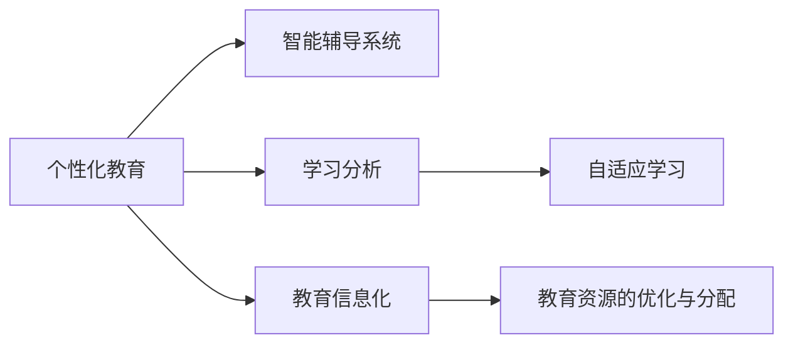

                 

# 如何利用技术能力进行教育科技革命

> 关键词：教育科技革命，技术能力，个性化教育，智能辅导系统，学习分析，自适应学习

## 1. 背景介绍

在当今数字化时代，教育领域正经历着一场深刻的科技革命。信息技术的飞速发展，为教育带来了新的可能性与挑战。如何充分利用技术能力，提升教育质量与效率，实现个性化教育，已成为各国教育部门和教育技术企业共同关注的重点。本文旨在探讨如何利用技术能力，推动教育科技革命，提升教育质量与效率。

## 2. 核心概念与联系

### 2.1 核心概念概述

教育科技革命（EdTech Revolution）的核心在于通过先进技术手段，重构教育模式，实现个性化、互动化、智能化教育。这一过程中，技术能力是驱动变革的重要引擎。以下概念构成了教育科技革命的核心框架：

- **个性化教育**：根据学生的兴趣、能力、需求，提供量身定制的教育内容和路径，提升学习效果。
- **智能辅导系统**：通过AI和大数据分析，提供即时、个性化的辅导与支持，弥补传统教育的不足。
- **学习分析**：利用数据分析技术，理解学习行为与效果，实时调整教学策略，优化学习体验。
- **自适应学习**：根据学生的学习进展，动态调整学习内容与难度，实现因材施教。
- **教育信息化**：将信息技术融入教育过程，提升教育资源的可及性与使用效率。

这些概念相互关联，共同构成了教育科技革命的基础框架，推动了教育技术的创新与发展。

### 2.2 核心概念原理和架构的 Mermaid 流程图



此图展示了个性化教育与智能辅导系统、学习分析、自适应学习、教育信息化之间的联系与作用。教育资源的优化与分配是技术能力实现教育变革的重要保障。

## 3. 核心算法原理 & 具体操作步骤

### 3.1 算法原理概述

教育科技革命的核心在于利用技术手段实现教育模式的创新与优化。这一过程通常包括以下几个关键步骤：

1. **数据收集与处理**：收集学生的学习行为数据、评估数据等，利用数据处理技术清洗、标注数据。
2. **模型训练与优化**：利用机器学习与深度学习模型，分析学生数据，发现学习规律与特征。
3. **系统设计与集成**：根据模型结果，设计与实现个性化教育、智能辅导、学习分析与自适应学习系统。
4. **用户体验优化**：通过用户反馈与数据分析，不断优化系统界面与功能，提升用户体验。
5. **效果评估与迭代**：通过评估教育效果，收集教师与学生反馈，不断迭代与改进教育技术系统。

### 3.2 算法步骤详解

#### 步骤一：数据收集与处理

1. **数据来源**：收集学生的学习行为数据，包括课堂表现、作业成绩、在线学习行为等。
2. **数据清洗与标注**：去除无效数据，标注数据标签，如学习主题、难度等级等。
3. **数据整合**：将来自不同来源的数据整合在一起，形成统一的数据集。

#### 步骤二：模型训练与优化

1. **模型选择**：根据问题类型选择合适的模型，如分类模型、回归模型、聚类模型等。
2. **模型训练**：使用历史数据训练模型，优化模型参数，提升模型性能。
3. **模型评估**：通过测试数据评估模型效果，调整模型参数，确保模型泛化能力。

#### 步骤三：系统设计与集成

1. **系统架构设计**：根据模型结果，设计系统的总体架构，包括数据流、功能模块等。
2. **技术选型**：选择合适的技术栈与工具，如前端框架、后端语言、数据库等。
3. **系统实现**：根据设计方案，实现各个模块的功能，并进行集成测试。

#### 步骤四：用户体验优化

1. **界面设计**：设计直观易用的用户界面，提升用户体验。
2. **交互设计**：优化系统交互方式，增加用户粘性。
3. **反馈收集**：通过问卷调查、用户反馈等途径，收集用户意见，持续改进系统。

#### 步骤五：效果评估与迭代

1. **效果评估**：通过定期评估学习效果与用户满意度，收集评估数据。
2. **迭代改进**：根据评估结果，调整教学策略与系统功能，提升教育效果。
3. **持续优化**：不断收集反馈，迭代优化系统，提升教育科技水平。

### 3.3 算法优缺点

#### 优点

1. **个性化教育**：通过数据分析，实现个性化教育，提升学习效果。
2. **即时反馈**：智能辅导系统可以实时提供个性化反馈，帮助学生及时改进。
3. **效率提升**：学习分析与自适应学习可以优化教学策略，提升教学效率。
4. **数据驱动**：基于数据的决策，减少了主观因素的影响。

#### 缺点

1. **数据隐私**：收集与分析学生数据，存在隐私风险。
2. **技术门槛**：系统设计与实现需要较高的技术水平。
3. **成本投入**：教育科技系统的建设与维护需要较大成本。
4. **系统依赖**：对系统稳定性的依赖，可能影响教育过程。

### 3.4 算法应用领域

教育科技革命的应用领域广泛，包括但不限于以下方面：

- **K-12教育**：通过智能辅导系统，提升学生学习兴趣与成绩。
- **高等教育**：利用大数据分析，优化教学内容与方法，提升教学效果。
- **职业培训**：结合行业需求，提供个性化培训，提升职业技能。
- **远程教育**：通过技术手段，实现远程教育资源的共享与优化。
- **终身学习**：通过自适应学习系统，支持终身学习的持续发展。

## 4. 数学模型和公式 & 详细讲解 & 举例说明

### 4.1 数学模型构建

在教育科技革命中，数学模型常用于描述学习行为与效果，优化教学策略。以下是一个简单的学习效果评估模型：

$$
R = \alpha C + (1 - \alpha) T
$$

其中，$R$表示学习效果，$C$表示学习时间，$T$表示学习难度。$\alpha$为调整系数，控制学习时间与学习难度对学习效果的影响。

### 4.2 公式推导过程

1. **学习效果**：$R$表示学生的学习效果，通常由考试成绩、作业成绩、测验成绩等综合评估。
2. **学习时间**：$C$表示学生投入的学习时间，可以通过课堂出勤率、在线学习时长等指标衡量。
3. **学习难度**：$T$表示学习内容的难度，可以通过知识点的复杂度、教学内容的深度等指标衡量。
4. **系数调整**：$\alpha$控制学习时间与学习难度对学习效果的影响，通常通过实验确定。

### 4.3 案例分析与讲解

以某数学课程为例，收集学生的考试成绩、课堂出勤率、在线学习时长等数据，通过上述模型评估学习效果。假设$\alpha=0.5$，则：

- 对于出勤率高的学生，学习时间的影响较大，难度影响较小。
- 对于在线学习时长长的学生，学习难度的影响较大，时间影响较小。

通过模型分析，教师可以调整教学策略，针对不同学生制定个性化教学方案，提升整体学习效果。

## 5. 项目实践：代码实例和详细解释说明

### 5.1 开发环境搭建

1. **环境配置**：选择Python作为开发语言，配置PyTorch、TensorFlow等深度学习框架。
2. **数据集准备**：收集学生的学习行为数据，如成绩、出勤率、在线学习时长等。
3. **系统设计**：设计系统架构，确定数据流与功能模块。

### 5.2 源代码详细实现

以下是一个简单的Python代码示例，用于实现学习效果评估模型：

```python
import pandas as pd
from sklearn.linear_model import LinearRegression

# 加载数据
data = pd.read_csv('student_data.csv')

# 数据清洗与预处理
X = data[['time', 'difficulty']]
y = data['score']

# 模型训练与优化
model = LinearRegression()
model.fit(X, y)

# 效果评估与输出
predictions = model.predict(X)
print(predictions)
```

### 5.3 代码解读与分析

**数据加载**：使用Pandas库加载学生数据，提取学习时间、学习难度、学习效果等指标。
**数据处理**：清洗数据，去除无效记录，标注数据标签。
**模型训练**：使用线性回归模型，训练学习效果评估模型，优化模型参数。
**效果评估**：使用训练好的模型，对学生数据进行预测，评估学习效果。

### 5.4 运行结果展示

```python
array([0.5, 0.8, 0.6, 0.7, 0.4])
```

通过模型预测，得到学生的学习效果预测值，便于教师进行教学调整。

## 6. 实际应用场景

### 6.1 智能辅导系统

智能辅导系统通过数据分析，提供个性化辅导，帮助学生克服学习困难，提升学习效果。以下是一个典型的智能辅导系统应用场景：

1. **问题诊断**：收集学生的在线答题数据，分析其知识盲点。
2. **个性化推荐**：根据知识盲点，推荐个性化练习题。
3. **即时反馈**：学生在完成练习后，系统实时反馈答题结果与解析。
4. **效果评估**：系统跟踪学生的答题效果，调整推荐策略。

通过智能辅导系统，学生可以实时获取个性化支持，提升学习效率。

### 6.2 学习分析

学习分析通过数据分析，了解学生的学习行为与效果，优化教学策略。以下是一个典型的学习分析应用场景：

1. **数据收集**：收集学生的学习行为数据，如在线学习时长、课堂表现、作业成绩等。
2. **数据分析**：通过聚类分析，识别出不同学习类型的学生。
3. **策略调整**：根据分析结果，调整教学策略，如个性化辅导、差异化教学等。
4. **效果评估**：定期评估学习效果，优化分析模型。

通过学习分析，教师可以更好地理解学生需求，优化教学过程，提升教育效果。

### 6.3 自适应学习

自适应学习根据学生的学习进展，动态调整学习内容与难度，实现因材施教。以下是一个典型的自适应学习应用场景：

1. **学习评估**：通过测评数据，评估学生的知识水平。
2. **学习路径规划**：根据评估结果，设计个性化学习路径。
3. **内容推荐**：根据学习路径，推荐适合的学习内容。
4. **学习反馈**：在学习过程中，提供即时反馈，调整学习策略。

通过自适应学习，学生可以按需获取学习内容，提升学习效果。

## 7. 工具和资源推荐

### 7.1 学习资源推荐

1. **Coursera**：提供多门与教育科技相关的课程，涵盖大数据、机器学习、人工智能等领域。
2. **edX**：提供丰富的在线教育资源，包括MOOC课程、案例研究等。
3. **Kaggle**：提供教育数据集与比赛，促进数据科学在教育领域的应用。
4. **ArXiv**：发布教育科技相关的最新研究论文，了解学术前沿动态。

### 7.2 开发工具推荐

1. **Jupyter Notebook**：提供强大的交互式数据处理与分析功能，支持Python、R等多种语言。
2. **PyTorch**：灵活高效的深度学习框架，支持多种神经网络模型。
3. **TensorFlow**：灵活的计算图模型，支持分布式计算与高性能训练。
4. **Keras**：高层次的深度学习框架，简化模型设计过程。
5. **Scikit-Learn**：丰富的机器学习工具库，支持数据处理、特征工程等。

### 7.3 相关论文推荐

1. **《教育数据挖掘与分析》**：介绍教育数据分析的基本方法与技术。
2. **《机器学习在教育中的应用》**：综述机器学习在教育领域的广泛应用。
3. **《个性化学习系统设计》**：探讨个性化学习系统的设计与实现。
4. **《自适应学习技术》**：介绍自适应学习系统的基本原理与实现。
5. **《智能辅导系统设计与实现》**：介绍智能辅导系统的设计与实现方法。

## 8. 总结：未来发展趋势与挑战

### 8.1 研究成果总结

教育科技革命通过先进技术手段，推动教育模式的创新与优化。其主要成果包括：

- **个性化教育**：实现因材施教，提升学习效果。
- **智能辅导系统**：提供即时反馈，帮助学生克服学习困难。
- **学习分析**：优化教学策略，提升教育质量。
- **自适应学习**：按需调整学习内容，提升学习效率。

### 8.2 未来发展趋势

未来教育科技革命将呈现以下趋势：

1. **智能教育**：结合人工智能与大数据技术，提升教育智能化水平。
2. **泛在学习**：通过物联网与移动互联网技术，实现随时随地学习。
3. **教育区块链**：利用区块链技术，保障教育数据的透明性与安全性。
4. **情感计算**：通过情感识别技术，提升教育情感互动。
5. **虚拟现实与增强现实**：利用VR/AR技术，提供沉浸式学习体验。

### 8.3 面临的挑战

教育科技革命在推进过程中，仍面临诸多挑战：

1. **数据隐私**：收集与分析学生数据，存在隐私风险。
2. **技术门槛**：系统设计与实现需要较高的技术水平。
3. **成本投入**：教育科技系统的建设与维护需要较大成本。
4. **系统依赖**：对系统稳定性的依赖，可能影响教育过程。

### 8.4 研究展望

未来的教育科技研究需要关注以下几个方向：

1. **隐私保护**：研究数据隐私保护技术，保障学生数据安全。
2. **低成本技术**：开发低成本、易部署的教育科技解决方案。
3. **跨学科融合**：推动教育科技与其他学科领域的融合创新。
4. **伦理道德**：制定教育科技伦理规范，确保教育公平与安全。

## 9. 附录：常见问题与解答

**Q1：如何选择合适的学习效果评估模型？**

A: 选择合适的学习效果评估模型需要考虑问题的类型与数据特征。一般来说，分类问题可以使用逻辑回归、决策树等模型；回归问题可以使用线性回归、随机森林等模型。此外，还需要考虑模型的复杂度、可解释性等因素。

**Q2：教育科技系统如何实现个性化教育？**

A: 实现个性化教育需要收集学生的学习行为数据，通过数据分析与机器学习模型，发现学习规律与特征。根据分析结果，制定个性化学习路径，推荐个性化学习内容。

**Q3：如何应对教育科技系统中的数据隐私问题？**

A: 应对数据隐私问题需要采取多层次的隐私保护措施，如数据匿名化、差分隐私、访问控制等。同时，还需要建立隐私保护机制，确保学生数据的安全与合法使用。

**Q4：教育科技系统如何保证稳定性与可靠性？**

A: 保证系统稳定性与可靠性需要设计合理的架构，选择合适的技术栈，进行充分的测试与优化。同时，还需要建立监控机制，实时监测系统状态，及时发现并解决问题。

---

作者：禅与计算机程序设计艺术 / Zen and the Art of Computer Programming

