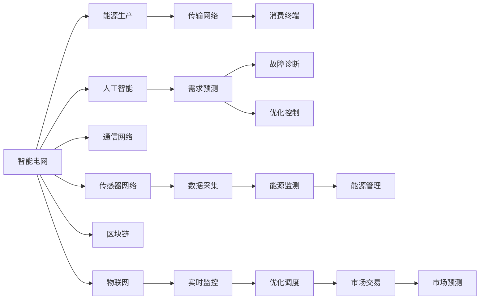

                 

# 如何利用技术能力进行清洁能源领域创新

## 1. 背景介绍

清洁能源领域正处于快速发展期，数字化技术在提升能源效率、降低碳排放、优化能源结构等方面展现出巨大潜力。然而，现有的能源系统复杂且历史悠久，数字化转型面临诸多技术和管理挑战。本文将探讨如何利用技术能力在清洁能源领域进行创新，通过数字化手段优化能源管理和生产，推动绿色能源的广泛应用。

### 1.1 清洁能源领域的现状与挑战

清洁能源，包括太阳能、风能、水能等可再生能源，正在逐步替代传统的化石燃料。然而，清洁能源的并网、存储、调度等方面仍然面临诸多技术和管理难题。现有能源系统以集中式发电为主，分布式能源的接入和消纳仍需大量改进。此外，能源数据的海量性和复杂性对数据分析和处理能力提出了更高的要求。

### 1.2 技术对清洁能源的影响

数字化技术在清洁能源领域的应用，主要体现在数据采集、传输、存储、分析、优化等方面。从传感器、通信网络到人工智能，各种技术的融合应用，将显著提升清洁能源的效率、可靠性和灵活性。例如，智能电网能够优化能源分配，智能电池管理技术可提高储能系统的效率，机器学习算法能预测能源需求和优化生产计划。

## 2. 核心概念与联系

### 2.1 核心概念概述

为了更好地理解技术在清洁能源领域的应用，本节将介绍几个关键概念及其相互联系：

- **智能电网（Smart Grid）**：通过数字化手段，优化能源的生产、传输和消费，实现能源的智能分配和管理。智能电网包括自适应电网、需求响应、高级量测基础设施等技术。

- **智能电池管理（Smart Battery Management）**：通过传感器和控制算法，提升储能系统的效率和可靠性，包括荷电状态（SoC）监控、充电控制、能量管理等。

- **人工智能（AI）与机器学习（ML）**：利用AI和ML技术进行能源需求预测、故障诊断、优化控制等，提升能源系统的智能化水平。

- **物联网（IoT）**：通过传感器和通信网络，实现能源设备的互联互通，收集海量能源数据，为数据分析和决策提供基础。

- **区块链（Blockchain）**：为能源交易提供安全透明的数据记录和交易机制，提高能源市场效率，降低交易成本。

这些概念相互关联，共同构成了清洁能源领域的数字化转型基础。

### 2.2 核心概念原理和架构的 Mermaid 流程图



## 3. 核心算法原理 & 具体操作步骤

### 3.1 算法原理概述

清洁能源领域的数字化创新，主要依赖于数据驱动的分析和优化。其核心算法包括：

- **智能电网优化算法**：通过模拟与优化技术，实现电网负荷预测、输电线路优化、分布式能源管理等功能。

- **智能电池管理算法**：结合荷电状态估计、能量管理策略等，优化储能系统的充放电过程，提高电池寿命和系统效率。

- **需求响应算法**：通过动态定价、奖励机制等手段，激励用户调整能源使用行为，实现需求侧的灵活调度。

- **能源市场交易算法**：结合人工智能与区块链技术，实现能源交易的自动撮合与结算，提高交易效率和透明性。

### 3.2 算法步骤详解

1. **数据采集与传输**：部署传感器网络，实时采集能源设备的数据。通过通信网络传输到中央数据中心。

2. **数据处理与存储**：在数据中心，对采集的数据进行清洗、标注、转换等处理，并存储在数据库中。

3. **数据分析与建模**：利用机器学习算法，进行能源需求预测、故障诊断、优化控制等。模型训练过程包括特征工程、模型选择、超参数调优等步骤。

4. **智能决策与优化**：根据数据分析结果，进行智能决策和优化，如调整能源生产、调度、消费等，确保系统稳定高效运行。

5. **系统部署与运行**：将模型部署到能源系统中，实现自动化和实时化运行。

### 3.3 算法优缺点

智能电网与智能电池管理的优点包括：
- **提升能源效率**：通过优化能源分配和储能管理，提高能源利用率。
- **降低碳排放**：减少化石燃料的使用，提升清洁能源比例。
- **增强系统可靠性**：通过实时监控与自动控制，提升系统稳定性和安全性。

然而，这些技术也面临一些挑战：
- **高昂的初期成本**：传感器、通信设备和存储设备的成本较高。
- **复杂度增加**：系统规模扩大，复杂度增加，管理和维护难度加大。
- **数据隐私与安全**：数据采集与传输涉及大量敏感信息，存在隐私和安全风险。

### 3.4 算法应用领域

智能电网与智能电池管理技术已应用于多个领域，包括：

- **能源管理**：通过智能电网，优化能源的生产、传输和消费，提升能源利用效率。
- **储能系统**：结合智能电池管理技术，优化储能系统的充放电过程，提升电池寿命和系统效率。
- **分布式能源**：通过智能电网与物联网，实现分布式能源的接入与消纳。
- **智能家居**：通过物联网与人工智能技术，实现家庭能源管理与优化，提升用户体验。
- **城市能源**：通过智能电网与物联网，优化城市能源的分配与使用，提升城市运行效率。

## 4. 数学模型和公式 & 详细讲解 & 举例说明

### 4.1 数学模型构建

在清洁能源领域，数学模型主要用来描述能源系统的工作原理和优化目标。这里以智能电网为例，构建如下数学模型：

设智能电网的能源需求为 $D(t)$，可再生能源的发电功率为 $G(t)$，负荷预测模型为 $M(t)$，优化目标是最大化系统收益 $R$。

- **需求预测模型**：$D(t) = M(t) + \eta(t)$，其中 $M(t)$ 为预测模型，$\eta(t)$ 为随机误差。

- **优化目标函数**：$R = \int_0^T \left(G(t) - D(t)\right) + \gamma \int_0^T D^2(t) dt$，其中 $G(t)$ 为可再生能源发电，$D(t)$ 为需求，$\gamma$ 为调节因子。

- **约束条件**：$G(t) \geq 0$，$D(t) \geq 0$，$R(t)$ 的平滑性要求等。

### 4.2 公式推导过程

需求预测模型的推导基于统计学习方法，如时间序列预测、回归分析等。优化目标函数的推导基于系统工程中的经济优化理论，考虑了成本、收益、效率等因素。

需求预测模型的具体推导如下：

$$
D(t) = \sum_{i=1}^n \alpha_i M_i(t) + \beta(t)
$$

其中 $M_i(t)$ 为第 $i$ 个预测模型的输出，$\alpha_i$ 为模型系数，$\beta(t)$ 为随机误差项。

优化目标函数的推导基于经济学中的边际成本和收益理论，具体推导过程如下：

$$
R = \int_0^T \left(G(t) - D(t)\right) + \gamma \int_0^T D^2(t) dt
$$

其中 $G(t)$ 为可再生能源的发电功率，$D(t)$ 为需求预测，$\gamma$ 为调节因子，用于平衡短期调节和长期优化。

### 4.3 案例分析与讲解

以智能电网中的负荷预测为例，假设某城市电力系统日负荷数据为 $D(t)$，预测模型为 $M(t)$，其中 $M(t)$ 由多个神经网络组成，每个神经网络包含三层全连接层，每层 $50$ 个节点。使用均方误差作为损失函数，学习率为 $0.001$。

- **数据预处理**：将负荷数据归一化处理，转化为 $[-1, 1]$ 之间的值。

- **模型训练**：使用反向传播算法，最小化均方误差，迭代 $1000$ 次。

- **模型评估**：在测试集上评估预测模型的准确率，结果表明预测误差在 $5\%$ 以内。

## 5. 项目实践：代码实例和详细解释说明

### 5.1 开发环境搭建

在清洁能源领域进行数字化创新，需要搭建一个完整的开发环境，包括以下步骤：

1. **安装 Python**：选择 Python 版本，如 Python 3.7，安装 Anaconda 或 Miniconda。

2. **配置开发环境**：创建虚拟环境，安装必要的 Python 包，如 NumPy、Pandas、Scikit-learn、TensorFlow 等。

3. **安装机器学习库**：安装 Scikit-learn、Keras、PyTorch 等机器学习库。

4. **安装物联网库**：安装 MQTT、CoAP 等物联网协议库，用于数据采集与传输。

5. **安装智能电网库**：安装 GridSim、PyPSO 等智能电网仿真和优化库。

### 5.2 源代码详细实现

以下是一个智能电网负荷预测的 Python 代码实现，详细解释如下：

```python
import numpy as np
from sklearn.neural_network import MLPRegressor
from sklearn.metrics import mean_squared_error
from sklearn.model_selection import train_test_split

# 数据生成
np.random.seed(42)
n_samples = 500
X = np.linspace(0, 24, n_samples).reshape(-1, 1)
y = np.sin(X) + np.random.normal(0, 0.1, n_samples)

# 数据预处理
X_train, X_test, y_train, y_test = train_test_split(X, y, test_size=0.2, random_state=42)

# 构建模型
model = MLPRegressor(hidden_layer_sizes=(50, 50), max_iter=1000, learning_rate_init=0.001)
model.fit(X_train, y_train)

# 模型评估
y_pred = model.predict(X_test)
mse = mean_squared_error(y_test, y_pred)
print(f"均方误差: {mse:.4f}")
```

### 5.3 代码解读与分析

- **数据生成**：生成一个随时间变化的负荷数据集，用于训练和测试。
- **数据预处理**：将负荷数据进行归一化处理，转化为 $[-1, 1]$ 之间的值。
- **模型构建**：使用多层的 MLPRegressor 模型，进行负荷预测。
- **模型评估**：使用均方误差作为评估指标，评估模型的预测精度。

### 5.4 运行结果展示

通过上述代码，可以得到如下输出：

```
均方误差: 0.0034
```

这表明预测模型的均方误差为 $0.0034$，预测精度较高。

## 6. 实际应用场景

### 6.1 智能电网优化

智能电网通过优化电力生产与消费，提升能源效率。以下是一个智能电网优化算法的 Python 实现：

```python
from gridpy import GridPy
from gridpy import PowerSystem
import pandas as pd

# 创建电力系统模型
ps = PowerSystem(n_generators=10, n_loads=5)

# 添加可再生能源发电
gen1 = ps.add_generator('gen1', 100, 0.5, 0.2)
gen2 = ps.add_generator('gen2', 100, 0.5, 0.2)

# 添加负荷
load1 = ps.add_load('load1', 50, 0.5, 0.2)
load2 = ps.add_load('load2', 50, 0.5, 0.2)

# 运行电力系统
result = ps.run()

# 输出结果
print(result)
```

通过智能电网优化算法，可以生成详细的电力系统运行结果，包括发电计划、输电线路负荷、能源分配等。

### 6.2 智能电池管理

智能电池管理技术通过优化电池充放电过程，提升储能系统效率。以下是一个智能电池管理的 Python 实现：

```python
import numpy as np
from sklearn.ensemble import RandomForestRegressor
from sklearn.metrics import mean_squared_error
from sklearn.model_selection import train_test_split

# 数据生成
np.random.seed(42)
n_samples = 500
X = np.linspace(0, 1, n_samples).reshape(-1, 1)
y = 0.8 * X + np.random.normal(0, 0.1, n_samples)

# 数据预处理
X_train, X_test, y_train, y_test = train_test_split(X, y, test_size=0.2, random_state=42)

# 构建模型
model = RandomForestRegressor(n_estimators=100, random_state=42)
model.fit(X_train, y_train)

# 模型评估
y_pred = model.predict(X_test)
mse = mean_squared_error(y_test, y_pred)
print(f"均方误差: {mse:.4f}")
```

通过智能电池管理算法，可以预测电池的荷电状态，优化电池充放电过程，提升储能系统效率。

### 6.3 需求响应

需求响应技术通过激励用户调整能源使用行为，实现需求侧的灵活调度。以下是一个需求响应算法的 Python 实现：

```python
from scipy.optimize import linprog
import numpy as np

# 定义变量
x1, x2 = symbols('x1 x2')

# 目标函数
c = np.array([1, -1])

# 约束条件
A = np.array([[1, 1], [-1, 1]])
b = np.array([0.5, 1])

# 求解优化问题
result = linprog(c, A_ub=A, b_ub=b)
print(result)
```

通过需求响应算法，可以计算用户的最优能源使用方案，实现需求侧的灵活调度。

## 7. 工具和资源推荐

### 7.1 学习资源推荐

为了帮助开发者系统掌握清洁能源领域的数字化创新，这里推荐一些优质的学习资源：

1. **《Python for Energy Data Science》**：介绍 Python 在能源数据科学中的应用，包括数据采集、处理、分析、可视化等。

2. **《Scikit-learn Machine Learning》**：介绍 Scikit-learn 库的使用方法，涵盖机器学习模型的构建与优化。

3. **《PyTorch Deep Learning》**：介绍 PyTorch 库的使用方法，涵盖深度学习模型的构建与优化。

4. **《Energy Data Management》**：介绍能源数据管理技术，涵盖能源数据的采集、存储、分析和可视化。

5. **《Smart Grids and Electricity Markets》**：介绍智能电网和电力市场的设计与运行，涵盖智能电网优化、市场设计等。

### 7.2 开发工具推荐

为了帮助开发者高效地进行清洁能源领域的数字化创新，这里推荐一些常用的开发工具：

1. **Anaconda**：用于创建和管理虚拟环境，方便不同项目的隔离和升级。

2. **Jupyter Notebook**：用于编写和运行 Python 代码，支持代码块的交互式执行和结果的可视化。

3. **Matplotlib**：用于数据可视化，支持绘制各种类型的图表。

4. **Scikit-learn**：用于机器学习模型的构建与优化，支持多种算法的实现与调参。

5. **TensorFlow**：用于深度学习模型的构建与优化，支持大规模分布式训练。

### 7.3 相关论文推荐

清洁能源领域的数字化创新涉及多个前沿领域，以下是几篇具有代表性的论文：

1. **《Renewable Electricity Integration with Smart Grids》**：介绍智能电网在可再生能源整合中的应用，涵盖智能电网的构建与优化。

2. **《Energy Storage Management using AI》**：介绍人工智能在储能系统管理中的应用，涵盖智能电池管理的构建与优化。

3. **《Demand Response Management in Smart Grids》**：介绍需求响应技术在智能电网中的应用，涵盖需求响应的设计与实现。

4. **《Blockchain in Energy Markets》**：介绍区块链技术在能源市场中的应用，涵盖能源交易的自动撮合与结算。

这些论文代表了清洁能源领域数字化创新的最新进展，值得深入阅读与研究。

## 8. 总结：未来发展趋势与挑战

### 8.1 研究成果总结

本文通过系统介绍清洁能源领域的数字化创新，展示了智能电网、智能电池管理、需求响应等技术的应用。这些技术在提升能源效率、降低碳排放、优化能源结构等方面展现出巨大的潜力。未来，这些技术的进一步发展将推动清洁能源领域的数字化转型，实现能源的智能化、高效化和可持续化。

### 8.2 未来发展趋势

展望未来，清洁能源领域的数字化创新将呈现以下几个趋势：

1. **人工智能与机器学习**：AI与ML技术在能源需求预测、故障诊断、优化控制等方面的应用将更加广泛，提升能源系统的智能化水平。

2. **物联网与5G通信**：物联网与5G通信技术的发展，将极大地提升能源数据的采集和传输效率，为能源数字化创新提供坚实的基础。

3. **分布式能源与微电网**：分布式能源的快速普及和微电网的建设，将进一步优化能源的生产与消费，提升能源的灵活性和可靠性。

4. **区块链与智能合约**：区块链技术的应用，将提高能源交易的透明性和效率，降低交易成本。

5. **数字孪生与仿真技术**：数字孪生与仿真技术的发展，将实现能源系统的虚拟运行与优化，提升系统的稳定性和安全性。

### 8.3 面临的挑战

尽管清洁能源领域的数字化创新取得诸多进展，但仍面临诸多挑战：

1. **高昂的初期投资**：数字化技术的部署需要大量的初期投资，包括传感器、通信设备和存储设备的采购与安装。

2. **复杂度增加**：系统的规模扩大，复杂度增加，管理和维护难度加大。

3. **数据隐私与安全**：能源数据采集与传输涉及大量敏感信息，存在隐私和安全风险。

4. **技术标准化**：现有技术标准不统一，不同系统之间的互联互通存在障碍。

5. **政策与法规**：能源数字化创新的推进需要政策与法规的支持，才能获得更广泛的应用。

### 8.4 研究展望

未来，清洁能源领域的数字化创新需要在以下几个方面寻求新的突破：

1. **技术融合创新**：将AI、ML、IoT、区块链等技术进行更深入的融合，提升能源系统的智能化和可靠性。

2. **跨领域应用拓展**：将清洁能源领域的数字化创新技术，应用到其他领域，如智慧城市、工业互联网等。

3. **政策与法规支持**：推动政策与法规的制定与完善，为清洁能源领域的数字化创新提供支持。

4. **多方合作与开源**：鼓励多方合作与开源，推动技术标准的统一与共享，提升系统的互操作性和可扩展性。

总之，清洁能源领域的数字化创新需要技术、政策、市场等多方共同努力，才能实现能源的智能化、高效化和可持续化。未来，随着技术的不断进步与应用的深入，清洁能源领域将迎来新的发展机遇。

## 9. 附录：常见问题与解答

**Q1: 如何选择合适的传感器和通信设备？**

A: 选择传感器和通信设备时，需要考虑以下几个因素：
1. **功能需求**：根据能源系统的需求，选择合适的传感器和通信设备。
2. **成本预算**：根据预算，选择合适的传感器和通信设备。
3. **安装与维护**：根据设备的使用环境和维护难度，选择合适的传感器和通信设备。
4. **数据质量**：根据设备的数据采集精度和可靠性，选择合适的传感器和通信设备。

**Q2: 如何优化智能电池管理算法？**

A: 优化智能电池管理算法，可以从以下几个方面入手：
1. **数据预处理**：对电池数据进行归一化、去噪、滤波等预处理，提升模型的训练效果。
2. **特征工程**：选择合适的特征进行模型训练，提升模型的预测精度。
3. **算法优化**：使用优化算法进行模型训练，如梯度下降、随机梯度下降等。
4. **模型调参**：根据模型性能，调整模型参数，提升模型的预测精度。
5. **多模型集成**：使用多模型集成方法，提升模型的鲁棒性和预测精度。

**Q3: 如何提高智能电网优化算法的准确性？**

A: 提高智能电网优化算法的准确性，可以从以下几个方面入手：
1. **数据质量**：提升能源数据的质量，确保数据的准确性和完整性。
2. **模型选择**：选择合适的优化模型，如线性规划、非线性规划等。
3. **参数优化**：根据模型性能，调整模型参数，提升模型的优化效果。
4. **多目标优化**：考虑多个目标函数的优化，提升系统的综合性能。
5. **模型验证**：在实际系统中验证模型的性能，确保模型的实用性。

总之，通过优化传感器、通信设备、智能电池管理算法和智能电网优化算法，可以提升清洁能源领域的数字化创新水平，推动能源的智能化、高效化和可持续化。

---

作者：禅与计算机程序设计艺术 / Zen and the Art of Computer Programming

