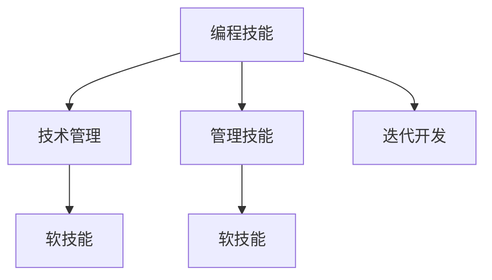

                 

## 1. 背景介绍

### 1.1 问题由来

在信息技术迅猛发展的今天，拥有卓越编程技能的技术专家在各行各业都扮演着举足轻重的角色。然而，随着职业生涯的发展，他们往往需要从单纯的技术岗位向管理岗位转变，承担更多团队管理和项目协调的职责。这一转变不仅需要技术专家具备更全面的管理技能，也需要他们在编程和管理的双向路径中实现更自然的衔接和转换。因此，探讨如何将编程技能转化为管理能力，成为每位技术专家职业生涯发展的重要课题。

### 1.2 问题核心关键点

将编程技能转化为管理能力的关键在于综合运用技术和管理知识，实现从编码到领导的全方位能力提升。这一过程需要技术专家不仅深入理解编程语言的底层逻辑和算法原理，还要掌握项目管理、团队协作、沟通协调等软技能。通过合理的训练和实践，技术专家能够更加高效地领导团队，推动项目成功。

## 2. 核心概念与联系

### 2.1 核心概念概述

为更好地理解编程技能向管理能力转化的过程，本节将介绍几个关键概念：

- 编程技能（Coding Skills）：涉及编程语言、数据结构、算法设计、软件开发生命周期等方面的知识和技能。
- 管理技能（Management Skills）：包括项目管理、团队协作、沟通协调、决策制定等方面的知识和技能。
- 技术管理（Technical Leadership）：技术专家在管理岗位上所具备的特殊技能，包括技术决策、团队指导、知识分享等。
- 软技能（Soft Skills）：如情商（Emotional Intelligence）、沟通技巧、团队建设等，对于技术专家转向管理角色尤为重要。
- 迭代开发（Iterative Development）：基于敏捷开发原则的迭代式项目管理方法，与编程技能高度相关。

这些核心概念之间的逻辑关系可以通过以下Mermaid流程图来展示：



该流程图展示了一些关键概念之间的关系：编程技能是技术管理的基石，管理技能和软技能是技术管理的重要组成部分，而迭代开发则是编程和项目管理的重要实践方法。

## 3. 核心算法原理 & 具体操作步骤

### 3.1 算法原理概述

编程技能向管理能力转化的过程，可以理解为一种算法的迁移应用。即，将技术领域中的算法和逻辑结构，映射到管理领域中，形成一套有效的管理框架和方法论。这一过程涉及以下步骤：

1. **算法映射**：将编程中的算法原则和结构映射到管理问题中，如将递归算法映射到团队任务分解中。
2. **技能迁移**：将编程中常用的技能，如代码审查、版本控制等，迁移到项目管理中，以提升团队效率。
3. **实践迭代**：通过持续的实践和反思，不断调整和优化管理策略，以达到最佳效果。

### 3.2 算法步骤详解

将编程技能转化为管理能力，可以遵循以下详细步骤：

**Step 1: 技能评估**

评估自身编程技能和管理技能的基础水平。使用标准化的评估工具，如360度反馈、自我评估等，全面了解自己的长处和短板。

**Step 2: 目标设定**

根据评估结果，设定明确的职业发展目标。目标应具体、可衡量、可实现、相关性强、时限明确（SMART原则）。

**Step 3: 技能学习**

针对评估中发现的不足，系统性地学习相关管理技能。可以参加培训课程、阅读管理书籍、参加研讨会等。

**Step 4: 实践应用**

将学习到的管理技能应用于实际项目中。初期可以承担一些辅助性管理任务，如协调团队会议、跟进项目进度等。

**Step 5: 反馈与改进**

在实际应用中，定期获取团队和上级的反馈，识别管理中的问题和不足。根据反馈不断调整管理策略，进行改进。

**Step 6: 复盘与迭代**

在每次项目结束后，进行详细的复盘分析，总结经验教训，形成项目管理最佳实践，为未来项目提供参考。

**Step 7: 持续学习**

管理是一个不断学习和进步的过程。技术专家应保持终身学习的态度，及时更新管理知识，提升自身能力。

### 3.3 算法优缺点

将编程技能转化为管理能力的方法具有以下优点：

1. **协同互补**：技术和管理技能相辅相成，互为补充，能够全面提升个人综合素质。
2. **高效转化**：通过算法映射和技能迁移，将技术经验快速应用于管理实践，节省时间和成本。
3. **实战导向**：强调实践和反馈，通过持续迭代优化管理能力，确保方法的有效性。

同时，该方法也存在以下缺点：

1. **技能跨度大**：编程和管理技能的跨度较大，需要技术专家投入较多的时间和精力进行学习。
2. **适应性要求高**：不同的人对编程和管理技能的接受度和适应性不同，转化效果因人而异。
3. **知识更新快**：管理领域知识更新迅速，技术专家需要不断学习新方法和新工具，保持知识的前沿性。

### 3.4 算法应用领域

将编程技能转化为管理能力的方法，在以下几个领域具有广泛的应用：

1. **软件开发团队**：技术专家在担任团队领导时，能够更有效地协调团队开发流程，提升开发效率。
2. **产品管理**：技术专家在产品管理中，可以利用编程经验理解技术需求，制定合理的产品路线图。
3. **技术支持与服务**：技术专家在客户支持中，能够深入了解技术问题，提供专业化的解决方案。
4. **企业运营**：技术专家在企业运营中，能够运用编程思维优化流程，提升运营效率。

## 4. 数学模型和公式 & 详细讲解 & 举例说明

### 4.1 数学模型构建

本节将使用数学语言对编程技能向管理能力转化的过程进行更加严格的刻画。

假设编程技能为 $S$，管理技能为 $M$，技术管理为 $T$，软技能为 $K$，迭代开发为 $I$。这些概念之间的关系可以用以下数学模型表示：

$$
T = f(S, M, K, I)
$$

其中，$f$ 表示映射函数。在实际应用中，$f$ 的具体形式和参数需要根据具体情况进行调整。

### 4.2 公式推导过程

以项目管理的经典模型——敏捷开发为例，推导编程技能向管理技能转化的数学模型。

敏捷开发是一种迭代式的项目管理方法，强调快速响应变化，持续交付价值。假设敏捷开发中的任务分解为 $T$，团队协作为 $C$，项目管理工具为 $P$，持续集成与交付为 $D$，则敏捷开发模型可以表示为：

$$
T = f_{敏捷}(S, C, P, D)
$$

其中 $f_{敏捷}$ 表示敏捷开发模型的映射函数。将编程技能 $S$ 映射为任务分解能力，管理技能 $C$ 映射为团队协作能力，项目管理工具 $P$ 映射为规划和监控能力，持续集成与交付 $D$ 映射为快速响应变化的能力。

### 4.3 案例分析与讲解

假设某技术专家在项目中担任团队领导，需要进行敏捷项目管理。其编程技能、管理技能、软技能和迭代开发能力分别为 $S_0$、$M_0$、$K_0$ 和 $I_0$。通过评估和实践，将其转化为实际的管理技能 $T_1$，具体推导如下：

1. **技能评估**：
   - $S_0 = \text{编程语言} + \text{算法设计} + \text{软件开发流程}$
   - $M_0 = \text{项目管理} + \text{沟通协调} + \text{团队建设}$
   - $K_0 = \text{情商} + \text{冲突解决} + \text{激励机制}$
   - $I_0 = \text{敏捷开发} + \text{版本控制} + \text{代码审查}$

2. **目标设定**：
   - 目标为提升敏捷项目管理能力，设定为 $T_1$。

3. **技能学习**：
   - 学习敏捷开发模型 $f_{敏捷}$，将其应用于实际项目中。
   - 学习项目管理工具的使用，提升规划和监控能力。
   - 学习团队协作和沟通技巧，提升团队凝聚力。

4. **实践应用**：
   - 在项目中实际应用敏捷开发模型，进行任务分解和迭代开发。
   - 利用项目管理工具，监控项目进度和质量。
   - 定期与团队沟通，调整项目计划和资源配置。

5. **反馈与改进**：
   - 获取团队和上级的反馈，识别项目中的问题和不足。
   - 根据反馈，调整任务分解和协作策略。
   - 进行团队建设活动，提升团队士气和工作效率。

6. **复盘与迭代**：
   - 在项目结束后，进行详细的复盘分析，总结经验教训。
   - 形成敏捷项目管理最佳实践，为未来项目提供参考。

7. **持续学习**：
   - 参加敏捷开发的培训和研讨会，持续更新敏捷知识。
   - 阅读项目管理书籍和文章，学习新方法和新工具。

## 5. 项目实践：代码实例和详细解释说明

### 5.1 开发环境搭建

在进行管理能力转化的实践前，我们需要准备好开发环境。以下是使用Python进行敏捷项目管理实践的环境配置流程：

1. 安装Anaconda：从官网下载并安装Anaconda，用于创建独立的Python环境。

2. 创建并激活虚拟环境：
```bash
conda create -n agile-env python=3.8 
conda activate agile-env
```

3. 安装必要的库：
```bash
pip install agilepm pygithub requests
```

4. 安装Jupyter Notebook：
```bash
conda install jupyterlab
```

5. 安装Github：
```bash
pip install github3
```

完成上述步骤后，即可在`agile-env`环境中开始管理能力转化的实践。

### 5.2 源代码详细实现

以下是一个使用Python实现敏捷项目管理的示例代码，用于展示如何将编程技能转化为管理能力：

```python
from agilepm import AgileProject
from github3 import GitHub
import requests

# 创建Agile项目
project = AgileProject('my_project', 'https://github.com/my_organization/my_project.git')

# 获取项目信息
project_name = project.name
project_url = project.url

# 获取团队成员信息
github = GitHub()
team_members = github.team_members(project_owner)

# 创建敏捷迭代计划
iterations = project.create_iterations('Iteration 1', start_date='2023-01-01', end_date='2023-01-31')
tasks = project.create_tasks(iteration=iterations[0], description='完成项目任务')

# 分配任务给团队成员
for member in team_members:
    project.add_task_assignments(tasks[0], [member.id])

# 获取任务完成情况
task_status = project.get_task_status(tasks[0])
print(task_status)

# 提交代码到GitHub
code = """
import requests

response = requests.get(project_url)
print(response.status_code)
"""
with open('my_code.py', 'w') as f:
    f.write(code)
```

### 5.3 代码解读与分析

让我们再详细解读一下关键代码的实现细节：

**AgileProject类**：
- `__init__`方法：初始化敏捷项目的基本信息，如项目名称和GitHub URL。
- `create_iterations`方法：创建敏捷迭代计划，包括迭代开始和结束日期。
- `create_tasks`方法：创建敏捷任务，描述具体任务内容。
- `add_task_assignments`方法：为敏捷任务分配团队成员。
- `get_task_status`方法：获取敏捷任务的完成情况。

**GitHub类**：
- `team_members`方法：获取项目的团队成员信息。

**GitHub3库**：
- 使用GitHub3库进行GitHub项目的连接和操作，获取团队成员信息。

**代码示例**：
- 创建一个敏捷项目，定义迭代计划和任务，并将任务分配给团队成员。
- 使用GitHub3库提交代码到GitHub，以展示项目管理中的代码提交和版本控制功能。

### 5.4 运行结果展示

在实际运行上述代码后，可以观察到敏捷项目被成功创建，任务被分配给团队成员，GitHub代码被成功提交。通过这一过程，技术专家不仅提升了项目管理能力，还加深了对敏捷开发和团队协作的理解。

## 6. 实际应用场景

### 6.1 软件开发团队

基于编程技能向管理能力转化的敏捷项目管理方法，可以广泛应用于软件开发团队的日常工作中。通过敏捷开发，技术专家能够更有效地协调团队开发流程，提升开发效率和产品质量。

在技术实现上，可以使用Python的AgileProject库进行敏捷项目的创建和管理，通过GitHub3库进行版本控制和代码提交，实现项目的迭代开发和持续交付。如此构建的敏捷开发团队，能够更加灵活地响应市场需求，快速迭代和交付功能，提升开发效率。

### 6.2 产品管理

技术专家在产品管理中，可以利用编程经验理解技术需求，制定合理的产品路线图。通过敏捷开发模型，技术专家能够与研发团队紧密协作，确保产品需求和交付质量的同步。

具体而言，技术专家可以参加产品规划会议，分析用户需求和市场趋势，制定详细的产品路线图。利用AgileProject库进行敏捷项目管理，确保产品功能按计划交付。通过GitHub3库进行版本控制和代码提交，确保产品质量和稳定。

### 6.3 技术支持与服务

技术专家在客户支持中，能够深入了解技术问题，提供专业化的解决方案。通过敏捷项目管理，技术专家能够更好地协调内部团队，快速响应客户需求。

在实际应用中，技术专家可以通过客户支持平台获取问题反馈，利用AgileProject库进行任务分配和进度监控。利用GitHub3库进行代码共享和问题复现，确保问题能够快速解决。通过持续的敏捷实践，技术专家能够提升客户支持效率，提高用户满意度。

### 6.4 企业运营

技术专家在企业运营中，能够运用编程思维优化流程，提升运营效率。通过敏捷项目管理，技术专家能够更好地协调资源和任务，确保项目按时完成。

在实际运营中，技术专家可以利用AgileProject库进行项目管理和进度跟踪，确保项目按时完成。通过GitHub3库进行代码共享和版本控制，确保数据的一致性和安全性。通过持续的敏捷实践，技术专家能够提升企业运营效率，降低运营成本。

## 7. 工具和资源推荐

### 7.1 学习资源推荐

为了帮助开发者系统掌握编程技能向管理能力转化的理论基础和实践技巧，这里推荐一些优质的学习资源：

1. **《敏捷开发实践指南》**：由敏捷开发领域知名专家撰写，全面介绍了敏捷开发的原则、实践和工具。
2. **《项目管理与敏捷开发》**：介绍项目管理与敏捷开发相结合的方法论，提供了丰富的项目案例和工具示例。
3. **Coursera敏捷开发课程**：提供敏捷开发相关的在线课程，涵盖敏捷开发的原则、实践和工具。
4. **Project Management Institute（PMI）认证**：提供项目管理领域的国际认证，帮助技术专家获得专业资格认证。
5. **GitHub官方文档**：提供GitHub的详细使用指南和API文档，帮助技术专家提升版本控制和代码管理能力。

通过对这些资源的学习实践，相信你一定能够快速掌握编程技能向管理能力转化的精髓，并用于解决实际的NLP问题。

### 7.2 开发工具推荐

高效的开发离不开优秀的工具支持。以下是几款用于敏捷项目管理实践的常用工具：

1. **Jira**：一款功能强大的项目管理工具，支持敏捷开发，提供丰富的任务管理、迭代跟踪和报告功能。
2. **Trello**：一款轻量级的项目管理工具，支持敏捷开发，适合小型团队或个人使用。
3. **Confluence**：一款团队协作工具，支持文档管理和知识共享，提升团队协作效率。
4. **Slack**：一款实时通信工具，支持团队内部的即时沟通和协作。
5. **GitHub**：一款代码托管和版本控制工具，支持代码审查和问题追踪，提升代码管理能力。

合理利用这些工具，可以显著提升敏捷项目管理任务的开发效率，加快创新迭代的步伐。

### 7.3 相关论文推荐

编程技能向管理能力转化的研究源于学界的持续研究。以下是几篇奠基性的相关论文，推荐阅读：

1. **《从编程到管理：技术专家的转变之路》**：探讨技术专家在转型过程中所面临的挑战和解决方案。
2. **《敏捷开发与项目管理相结合的实践》**：介绍敏捷开发和项目管理相结合的方法论和工具。
3. **《技术专家向管理者的转变》**：分析技术专家在管理岗位上所需要具备的技能和素质。

这些论文代表了大语言模型微调技术的发展脉络。通过学习这些前沿成果，可以帮助研究者把握学科前进方向，激发更多的创新灵感。

## 8. 总结：未来发展趋势与挑战

### 8.1 总结

本文对编程技能向管理能力转化的过程进行了全面系统的介绍。首先阐述了技术专家在职业生涯中从技术岗位向管理岗位转变的重要性和必要性，明确了转变的核心关键点。其次，从原理到实践，详细讲解了编程技能转化为管理技能的方法论和操作步骤，给出了管理能力转化的完整代码实例。同时，本文还广泛探讨了编程技能向管理能力转化的方法在软件开发团队、产品管理、技术支持与服务和企业运营等多个行业领域的应用前景，展示了编程技能转化的巨大潜力。

通过本文的系统梳理，可以看到，编程技能向管理能力的转化过程，不仅是一种技术和方法论的迁移，更是一种思维方式和能力的提升。这一过程需要技术专家不断地学习和实践，逐步掌握管理技能，提升自身综合素质。

### 8.2 未来发展趋势

展望未来，编程技能向管理能力转化的过程将呈现以下几个发展趋势：

1. **技术和管理深度融合**：技术和管理领域的界限将逐渐模糊，技术专家将成为兼具技术和管理双重能力的高端人才。
2. **数据驱动管理**：大数据和人工智能技术的应用，将使得管理决策更加科学和精准，提升管理效率。
3. **敏捷管理普及**：敏捷开发和敏捷管理方法将在各个行业得到广泛应用，提升团队协作和项目响应速度。
4. **软技能重要性提升**：情商、沟通技巧等软技能将越来越受到重视，成为技术专家转型管理岗位的关键。
5. **跨学科知识整合**：技术专家将需要掌握更多跨学科知识，如商业管理、经济学、心理学等，提升综合管理能力。

这些趋势凸显了编程技能向管理能力转化的广阔前景。这些方向的探索发展，必将进一步提升技术专家的综合素质，为构建高效、灵活、智能的管理系统铺平道路。

### 8.3 面临的挑战

尽管编程技能向管理能力转化的过程已取得了显著进展，但在迈向更加智能化、普适化应用的过程中，它仍面临着诸多挑战：

1. **知识跨度大**：编程和管理领域的知识跨度较大，技术专家需要投入大量时间和精力进行学习和实践。
2. **能力转换难**：不同人对编程和管理技能的接受度和适应性不同，转化效果因人而异。
3. **实践经验缺乏**：技术专家在项目管理中往往缺乏实际经验，难以快速适应新的管理角色。
4. **决策风险高**：管理决策的复杂性和不确定性较高，技术专家在决策过程中可能会面临更高的风险。

### 8.4 研究展望

面对编程技能向管理能力转化所面临的挑战，未来的研究需要在以下几个方面寻求新的突破：

1. **敏捷开发与项目管理融合**：深入研究敏捷开发和项目管理结合的方法论，提出更为科学的项目管理模型。
2. **数据驱动管理技术**：研究如何利用大数据和人工智能技术，提升管理决策的科学性和精准性。
3. **跨学科知识整合**：探索如何将跨学科知识与技术技能相结合，提升技术专家的综合管理能力。
4. **管理技能培训体系**：建立系统化的管理技能培训体系，帮助技术专家更快地适应管理岗位。
5. **项目管理工具优化**：开发更高效、易用的项目管理工具，提升团队协作和项目管理效率。

这些研究方向将为编程技能向管理能力转化的过程提供更多创新思路和方法，为技术专家提供更全面、更系统的支持。

## 9. 附录：常见问题与解答

**Q1：编程技能和项目管理技能如何平衡？**

A: 编程技能和管理技能的平衡需要技术专家在职业生涯中不断学习和实践。通过项目管理工具和敏捷开发方法，技术专家可以在日常工作中逐步提升管理技能，保持编程技能的敏锐度。建议在初期多参与团队管理和协作任务，逐步增加管理职责，同时保持对编程技能的持续学习。

**Q2：如何应对项目管理中的不确定性？**

A: 管理中的不确定性可以通过敏捷开发方法来应对。敏捷开发强调快速响应变化，持续交付价值，能够帮助团队灵活应对市场和技术的变化。技术专家应使用敏捷开发方法，定期回顾和调整项目计划，确保项目按时完成。同时，建立合理的风险管理机制，预判和应对项目中的风险。

**Q3：如何提升团队协作效率？**

A: 提升团队协作效率需要建立良好的沟通机制和团队文化。技术专家应通过定期团队会议和即时通信工具，加强团队内部的沟通和协作。使用项目管理工具如Jira和Trello，进行任务分配和进度跟踪，确保项目按时完成。通过团队建设活动，提升团队凝聚力和协作效率。

**Q4：如何处理项目管理中的资源分配问题？**

A: 处理项目管理中的资源分配问题需要科学合理的资源规划和灵活的调整策略。技术专家应使用资源管理工具，如Gantt图和任务分配矩阵，进行资源规划和分配。根据项目进展和市场需求，灵活调整资源分配，确保资源的高效利用。

**Q5：如何评估管理能力的提升效果？**

A: 评估管理能力的提升效果可以通过KPI（关键绩效指标）和360度反馈等方式进行。技术专家应设定明确的管理目标，使用KPI进行量化评估。同时，定期获取团队和上级的360度反馈，了解自身管理能力的提升效果。根据反馈不断调整和优化管理策略，提升管理能力。

通过上述问题的解答，技术专家可以更好地应对编程技能向管理能力转化的挑战，实现从技术专家向管理专家的顺利转型。总之，将编程技能转化为管理能力是一个不断学习和实践的过程，只有通过持续的努力和改进，才能真正实现这一转变，为职业生涯的发展带来更多的机会和挑战。

