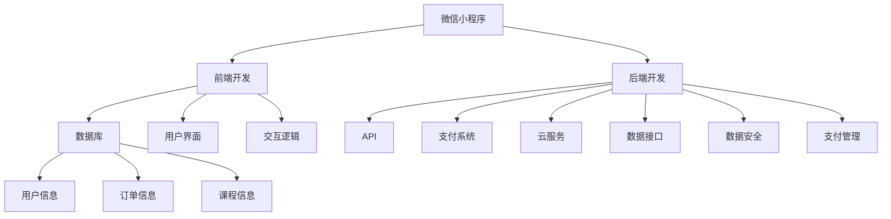

                 

# 如何打造知识付费的微信小程序

> 关键词：知识付费, 微信小程序, 前端开发, 后端开发, 数据库, API, 支付系统, 云服务

## 1. 背景介绍

在数字化时代，知识付费正成为教育、信息服务的重要组成部分。随着智能手机普及和移动互联网的快速演进，知识付费的市场需求日益旺盛。通过微信小程序等移动端平台，用户能够更方便地获取有价值的知识内容，享受高效便捷的交互体验。本文将系统介绍如何构建一个功能全面、操作简易、稳定性高的知识付费小程序，助你在竞争激烈的市场中脱颖而出。

## 2. 核心概念与联系

### 2.1 核心概念概述

在构建知识付费小程序前，首先需要了解一些核心概念及其相互关系：

- **微信小程序**：由微信提供的客户端应用，用户可以通过微信入口快速访问，无需下载安装应用，具备良好的用户粘性和体验。

- **知识付费**：用户为获取专业知识、技能培训、课程讲座等内容而支付费用的模式，涵盖音频、视频、文档等多种形式。

- **前端开发**：负责用户界面设计和交互逻辑实现，是知识付费小程序的直接呈现层面。

- **后端开发**：包括数据库设计、API接口开发、支付系统集成、云服务部署等，为小程序提供数据支持和服务保障。

- **数据库**：存储用户信息、订单信息、课程信息等关键数据，是知识付费系统的核心。

- **API**：为前端提供数据接口服务，支持用户在小程序内访问、查询、购买课程内容。

- **支付系统**：与第三方支付平台合作，确保支付流程的安全和顺畅。

- **云服务**：提供稳定的云服务器和数据库服务，支持小程序的高并发、高可用性需求。

### 2.2 核心概念原理和架构的 Mermaid 流程图



这个流程图展示了知识付费小程序的核心组件和功能模块：

1. 微信小程序作为用户交互平台，连接前端和后端。
2. 前端开发负责用户界面和交互逻辑，直接影响用户体验。
3. 后端开发提供数据接口、支付管理和云服务，支持前端和微信平台。
4. 数据库存储用户、订单和课程信息，是数据核心。
5. API提供数据接口服务，满足前端需求。
6. 支付系统集成第三方支付平台，确保交易安全。
7. 云服务提供稳定的服务器和数据库环境，支持高并发和高可用性。

## 3. 核心算法原理 & 具体操作步骤

### 3.1 算法原理概述

知识付费小程序的核心算法原理主要涉及前端和后端的技术细节。

- **前端算法**：包括页面渲染、数据加载、交互逻辑处理等，旨在提升用户体验和页面流畅度。

- **后端算法**：包括数据库设计、API接口开发、支付系统集成等，旨在保障数据安全和支付流程的稳定性。

### 3.2 算法步骤详解

#### 3.2.1 前端开发

1. **页面布局设计**：
   - 设计简洁美观的用户界面，确保页面布局符合用户操作习惯。
   - 使用微信小程序框架，如Taro、Miniprogram等，快速构建页面布局。

2. **数据加载优化**：
   - 利用网络请求、缓存机制，优化数据加载速度。
   - 对于复杂的课程信息，采用懒加载技术，减轻页面负担。

3. **交互逻辑实现**：
   - 实现用户注册、登录、购买、支付等关键功能。
   - 通过事件监听器、状态管理框架，如Redux、MobX等，管理应用状态。

4. **页面性能优化**：
   - 使用CSS3动画和JavaScript异步加载技术，提升页面渲染效率。
   - 应用分包加载、代码分割等技术，优化代码体积，提高加载速度。

#### 3.2.2 后端开发

1. **数据库设计**：
   - 设计用户、订单、课程等实体表，合理定义关系和索引。
   - 使用MySQL、MongoDB等关系型/非关系型数据库，支持高并发和高可用性。

2. **API接口开发**：
   - 实现用户认证、课程查询、订单处理等API接口。
   - 采用RESTful架构风格，使用JSON格式进行数据传输。

3. **支付系统集成**：
   - 集成第三方支付平台（如支付宝、微信支付），实现课程购买和支付。
   - 遵循支付接口规范，确保支付流程的安全性和可靠性。

4. **云服务部署**：
   - 使用阿里云、腾讯云等云服务提供商，部署数据库、API服务器。
   - 设置自动扩缩容机制，保障系统高并发下的稳定性。

### 3.3 算法优缺点

**前端开发**：
- **优点**：
  - 灵活快速，能够快速迭代用户界面和交互逻辑。
  - 可以访问微信提供的丰富的API接口，方便接入第三方服务。

- **缺点**：
  - 受微信平台限制，部分功能实现可能受限。
  - 数据和业务逻辑的复杂性可能导致性能瓶颈。

**后端开发**：
- **优点**：
  - 稳定性高，能够处理大量并发请求。
  - 数据和业务逻辑控制严格，安全性高。

- **缺点**：
  - 开发周期长，需要反复测试和优化。
  - 扩展性和维护成本较高，需持续投入。

### 3.4 算法应用领域

知识付费小程序在教育培训、知识传播、技能提升等多个领域具有广泛应用前景。具体应用包括：

1. **在线课程平台**：提供在线视频、音频、文档等课程内容，支持互动和评价。

2. **职业培训**：提供职业技能、管理知识、专业技能培训，帮助用户提升职业竞争力。

3. **知识传播**：汇集各类学术文章、科普知识、个人成长经验等内容，促进知识分享和交流。

4. **技能认证**：通过课程学习，提供技能认证和证书，增强用户专业背景。

5. **私教辅导**：提供一对一辅导、小组学习、专家答疑等服务，满足个性化学习需求。

## 4. 数学模型和公式 & 详细讲解 & 举例说明

### 4.1 数学模型构建

知识付费小程序的数据模型主要涉及用户、课程、订单等实体。以下是一个简单的数据模型：

- **用户表（user）**：
  - id (主键)
  - username (用户名)
  - email (邮箱)
  - password (密码)

- **课程表（course）**：
  - id (主键)
  - title (标题)
  - description (描述)
  - price (价格)

- **订单表（order）**：
  - id (主键)
  - user_id (外键，关联用户表)
  - course_id (外键，关联课程表)
  - status (状态：0-未支付，1-已支付，2-已观看)

### 4.2 公式推导过程

以订单状态的计算公式为例，假设用户通过微信小程序购买了一门课程，订单状态从0变为1。具体推导过程如下：

1. 用户通过微信小程序选择课程并下单。
2. 系统生成订单信息，包括订单号、课程ID、用户ID、订单状态等。
3. 将订单信息插入到订单表中，并更新用户和课程信息。
4. 订单状态通过API接口返回给前端，更新用户界面显示。

### 4.3 案例分析与讲解

**案例：用户购买课程后的订单状态更新**

1. 用户在微信小程序上搜索并购买了一门课程，订单状态为0（未支付）。
2. 用户完成支付，订单状态更新为1（已支付）。
3. 系统通过API接口将订单状态更新到数据库中。
4. 前端根据订单状态，更新用户界面的支付状态显示。

## 5. 项目实践：代码实例和详细解释说明

### 5.1 开发环境搭建

1. **前端开发环境**：
   - 安装Node.js和npm。
   - 使用微信小程序框架，如Taro、Miniprogram，配置项目目录。
   - 使用ESLint等工具，规范前端代码风格。

2. **后端开发环境**：
   - 安装Node.js和npm。
   - 使用Express、Koa等Node.js框架搭建API接口。
   - 使用MongoDB或MySQL数据库，进行数据库连接和数据存储。
   - 使用Postman等工具测试API接口，确保功能正确。

### 5.2 源代码详细实现

以下是一个简单的代码示例，展示用户注册、登录和课程查询的实现。

#### 前端代码

```javascript
import React from 'react';
import { View, Text, Button } from 'react-native';
import { useState } from 'react';
import axios from 'axios';

const RegisterPage = () => {
  const [username, setUsername] = useState('');
  const [password, setPassword] = useState('');

  const handleRegister = async () => {
    try {
      const response = await axios.post('/api/register', { username, password });
      console.log('注册成功', response.data);
    } catch (error) {
      console.error('注册失败', error);
    }
  };

  return (
    <View>
      <Text>用户名：</Text>
      <TextInput
        onChangeText={setUsername}
        value={username}
        keyboardType="email-address"
      />
      <Text>密码：</Text>
      <TextInput
        onChangeText={setPassword}
        value={password}
        secureTextEntry
      />
      <Button title="注册" onPress={handleRegister} />
    </View>
  );
};

export default RegisterPage;
```

#### 后端代码

```javascript
const express = require('express');
const app = express();
const bodyParser = require('body-parser');
const mongoose = require('mongoose');

// 连接数据库
mongoose.connect('mongodb://localhost:27017/online-courses', {
  useNewUrlParser: true,
  useUnifiedTopology: true,
});

// 定义用户模型
const userSchema = new mongoose.Schema({
  username: { type: String, required: true, unique: true },
  password: { type: String, required: true },
});

const User = mongoose.model('User', userSchema);

// 用户注册
app.post('/api/register', (req, res) => {
  const { username, password } = req.body;
  const newUser = new User({ username, password });
  newUser.save((err, user) => {
    if (err) {
      return res.status(500).json({ message: '注册失败' });
    }
    return res.status(200).json({ message: '注册成功' });
  });
});

// 用户登录
app.post('/api/login', (req, res) => {
  const { username, password } = req.body;
  User.findOne({ username }, (err, user) => {
    if (err) {
      return res.status(500).json({ message: '登录失败' });
    }
    if (!user) {
      return res.status(404).json({ message: '用户不存在' });
    }
    if (user.password !== password) {
      return res.status(401).json({ message: '密码错误' });
    }
    return res.status(200).json({ message: '登录成功', token: user._id });
});

// 课程查询
app.get('/api/courses', (req, res) => {
  const courses = [
    { id: 1, title: '前端开发', price: 99 },
    { id: 2, title: 'Python编程', price: 59 },
  ];
  res.json(courses);
});

app.listen(3000, () => {
  console.log('服务已启动');
});
```

### 5.3 代码解读与分析

**前端代码解读**：

- 使用React Native框架，构建简单的注册页面。
- 通过状态管理，实现用户输入和注册操作。
- 使用axios发送HTTP请求，进行用户注册和数据提交。

**后端代码解读**：

- 使用Express框架，构建RESTful风格的API接口。
- 使用MongoDB数据库，进行用户注册和课程查询。
- 定义用户模型，实现用户信息存储和查询。
- 实现注册、登录和课程查询功能，返回JSON数据。

### 5.4 运行结果展示

1. 前端注册页面：
   - 用户输入用户名和密码，点击登录按钮。
   - 通过网络请求，将注册信息提交到后端。
   - 后端接收到注册请求，验证用户名和密码，保存用户信息到数据库。
   - 返回注册成功的消息，用户成功注册并登录。

2. 课程查询页面：
   - 用户通过小程序进入课程查询页面。
   - 点击查询按钮，通过API接口获取课程列表。
   - 界面显示课程标题和价格，供用户选择购买。

## 6. 实际应用场景

### 6.1 在线教育平台

知识付费小程序可应用于各类在线教育平台，提供丰富的课程内容和学习资源。用户通过小程序接入课程平台，随时随地进行学习，获得优质教育资源。

**应用场景**：
- 在线视频课程：提供高清视频教程，支持播放、暂停、快进等操作。
- 直播互动：支持老师和学生实时互动，进行提问、回答、讨论等。
- 电子书和文档：提供PDF和Markdown格式的电子书和文档，供用户离线阅读。
- 智能练习：基于AI技术，提供智能练习题和测评系统，评估学习效果。

**技术实现**：
- 利用微信小程序框架，快速构建前端页面。
- 集成视频播放器、直播API、PDF解析器等第三方服务。
- 使用Node.js框架和数据库，实现用户管理、课程管理、支付集成等功能。
- 应用缓存机制和数据分片，提升系统的并发处理能力。

### 6.2 企业内部培训

企业可以通过知识付费小程序，构建内部培训和学习平台，提升员工技能和知识水平。通过微信小程序，员工可以随时随地进行在线培训，访问企业内部知识库。

**应用场景**：
- 内部培训课程：提供公司内部培训课程，帮助员工提升职业技能。
- 知识库查询：员工可以查询公司内部文档、手册等，快速获取知识。
- 专家讲座：邀请行业专家进行线上讲座，分享最新技术和发展动态。
- 学习社区：构建员工学习社区，促进知识分享和经验交流。

**技术实现**：
- 使用微信小程序框架，构建企业内部学习平台。
- 集成视频播放器、文档解析器、在线讲堂等模块。
- 使用Node.js框架和数据库，实现用户管理、课程管理、支付集成等功能。
- 应用缓存机制和数据分片，提升系统的并发处理能力。

### 6.3 个人知识管理

个人可以通过知识付费小程序，构建自己的知识库和管理系统，进行个性化知识积累和整理。通过小程序，用户可以随时随地进行笔记记录、资料收藏、知识分类等操作。

**应用场景**：
- 笔记记录：用户可以随时随地进行笔记记录，整理学习心得和重要知识点。
- 资料收藏：用户可以收藏各类资料，如电子书、文章、网页等，便于随时查阅。
- 知识分类：用户可以按照不同主题、标签等，对知识进行分类和整理。
- 智能推荐：根据用户行为和兴趣，推荐相关学习资源和知识内容。

**技术实现**：
- 使用微信小程序框架，构建个人知识管理系统。
- 集成文档编辑器、笔记应用、资料管理等模块。
- 使用Node.js框架和数据库，实现用户管理、笔记管理、资料管理等功能。
- 应用缓存机制和数据分片，提升系统的并发处理能力。

## 7. 工具和资源推荐

### 7.1 学习资源推荐

- **《微信小程序开发实战》**：详细介绍了微信小程序的开发技术栈、实战案例和最佳实践，适合初学者入门。
- **《Node.js开发教程》**：系统讲解Node.js的开发环境搭建、核心库函数、API接口设计等，是后端开发必备的学习资源。
- **《MongoDB数据库教程》**：介绍MongoDB的基本概念、CRUD操作、性能优化等，适合数据库开发人员参考。
- **《RESTful API设计规范》**：讲解RESTful API的设计原则、接口规范、错误处理等，帮助开发者设计高效、易于维护的API接口。

### 7.2 开发工具推荐

- **微信开发者工具**：提供全面的微信小程序开发和测试环境，支持预览、调试、分析等功能。
- **Postman**：一款API接口测试工具，支持发送各种HTTP请求，查看API响应数据。
- **MongoDB Compass**：一款MongoDB管理工具，提供图形化界面，方便数据库管理和查询。
- **Visual Studio Code**：一款轻量级IDE，支持JavaScript开发，提供丰富的插件和扩展功能。

### 7.3 相关论文推荐

- **《微信小程序的开发与设计》**：深入探讨微信小程序的技术架构、开发流程和设计原则，适合开发者参考。
- **《Node.js 非阻塞 I/O 编程》**：介绍Node.js的异步编程模型、事件驱动机制、非阻塞I/O等，适合后端开发人员学习。
- **《MongoDB性能优化实战》**：介绍MongoDB的高性能优化技巧、索引设计、缓存机制等，适合数据库管理员和开发人员参考。
- **《RESTful API设计指南》**：讲解RESTful API的设计规范、最佳实践、版本控制等，帮助开发者设计高效、易于维护的API接口。

## 8. 总结：未来发展趋势与挑战

### 8.1 研究成果总结

本文全面介绍了知识付费小程序的构建方法和技术实现，从前端开发、后端开发、数据库设计等多个角度，详细讲解了关键技术和应用场景。通过系统的分析和实践指导，帮助开发者掌握知识付费小程序的开发方法和技术细节。

### 8.2 未来发展趋势

- **交互体验升级**：未来知识付费小程序将更加注重交互体验，通过3D动画、AR技术、语音交互等方式，提升用户体验。
- **AI技术融合**：结合AI技术，如自然语言处理、计算机视觉等，提供智能推荐、个性化服务等功能，提升服务质量。
- **区块链技术应用**：通过区块链技术，实现课程版权保护、支付安全等功能，提升平台的可信度和安全性。
- **全场景应用**：知识付费小程序将覆盖更多应用场景，如企业培训、个人知识管理、教育培训等，推动知识传播和应用普及。
- **多平台融合**：结合微信小程序、支付宝小程序、抖音小程序等多种平台，提供跨平台、跨应用的综合服务，提升用户粘性和满意度。

### 8.3 面临的挑战

- **用户数据隐私**：知识付费小程序涉及大量用户数据，需要严格遵守隐私保护法规，确保用户信息安全。
- **支付安全风险**：微信小程序接入第三方支付平台，需要严格遵守支付安全规范，保障用户支付安全。
- **跨平台兼容**：知识付费小程序需要在多个平台和设备上运行，需确保跨平台兼容性和用户体验一致性。
- **性能优化**：知识付费小程序需处理大量并发请求，需优化系统性能，提升响应速度和稳定性。
- **内容质量保障**：知识付费小程序需要保证课程内容的质量和准确性，需引入专家审核和用户评价机制，提升平台信誉。

### 8.4 研究展望

未来的知识付费小程序将更加注重用户体验和内容质量，结合AI技术和区块链技术，提供更加丰富、智能、安全的服务。同时，通过持续优化性能和安全性，构建可靠、高效、可信的知识付费平台，推动知识传播和应用普及，助力数字化时代的知识分享和智慧增长。

## 9. 附录：常见问题与解答

### Q1: 微信小程序开发流程是怎样的？

A: 微信小程序开发流程包括规划、设计、开发、测试、发布等多个环节：
1. 规划阶段：明确小程序的业务需求和功能模块。
2. 设计阶段：设计页面布局、交互逻辑和数据模型。
3. 开发阶段：实现前端和后端功能模块，编写代码并测试。
4. 测试阶段：进行功能测试、性能测试和安全测试，确保小程序稳定可靠。
5. 发布阶段：打包发布到微信平台，供用户下载和使用。

### Q2: 如何保障微信小程序的安全性？

A: 微信小程序的安全性主要从以下几个方面保障：
1. 数据加密：对用户数据进行加密存储，防止数据泄露。
2. 访问控制：通过API接口权限控制，限制非法访问。
3. 漏洞扫描：定期进行代码审计和安全扫描，发现和修复潜在漏洞。
4. 安全测试：进行安全测试和渗透测试，模拟攻击场景，提升系统安全性。
5. 用户反馈：收集用户反馈和投诉，及时处理安全问题，改进安全措施。

### Q3: 如何优化微信小程序的性能？

A: 微信小程序的性能优化主要从以下几个方面入手：
1. 分包加载：使用代码分包、路由分包技术，减少页面加载时间和资源消耗。
2. 异步加载：使用异步加载技术，懒加载图片、视频等资源，提升页面渲染效率。
3. 缓存机制：使用缓存技术，缓存常用数据和API响应，减少重复请求。
4. 组件复用：使用组件复用技术，减少代码冗余，提升开发效率和可维护性。
5. 性能监控：使用性能监控工具，实时监测小程序的性能指标，及时发现和解决问题。

### Q4: 如何设计高效的数据模型？

A: 高效的数据模型设计主要从以下几个方面入手：
1. 合理设计表结构：根据业务需求，合理设计用户、订单、课程等实体表，避免冗余和冗余字段。
2. 使用索引和分片：使用索引和分片技术，提升数据库查询性能。
3. 使用缓存和缓存穿透：使用缓存技术，减少数据库访问次数，提升响应速度。
4. 定期优化数据结构：定期优化数据结构，避免性能瓶颈和数据冗余。
5. 引入数据压缩和分片：引入数据压缩和分片技术，减少数据存储成本，提升查询性能。

### Q5: 如何进行微信小程序的持续迭代和优化？

A: 微信小程序的持续迭代和优化主要从以下几个方面入手：
1. 持续收集用户反馈：通过用户反馈、问卷调查等方式，了解用户需求和问题。
2. 定期进行版本更新：定期发布小程序更新，修复已知问题和添加新功能。
3. 引入A/B测试：通过A/B测试，对比不同功能方案的效果，选择最优方案。
4. 引入数据分析：引入数据分析工具，监控小程序的用户行为和性能指标，指导迭代优化。
5. 引入用户参与设计：引入用户参与设计，收集用户意见，改进小程序设计和功能。

---

作者：禅与计算机程序设计艺术 / Zen and the Art of Computer Programming

