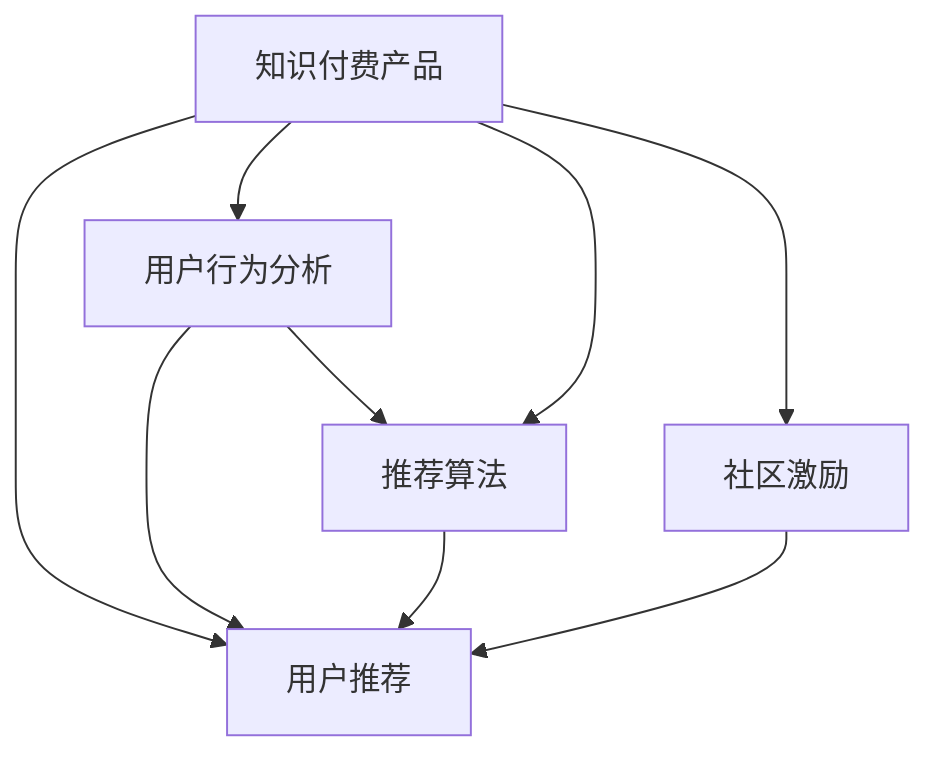

                 

# 如何提高知识付费产品的用户转介绍率

知识付费产品的用户转介绍率是指通过现有用户推荐获取新用户的比例，是衡量知识付费产品用户获取效率的关键指标之一。本文将从用户心理、社交网络、技术实现三个层面，系统探讨如何提高知识付费产品的用户转介绍率。

## 1. 背景介绍

### 1.1 问题由来
在知识付费领域，用户获取成本高，获客难度大，优质内容难以通过单次付费吸引用户。传统广告投放和付费推广难以覆盖所有潜在用户。因此，通过现有用户推荐获取新用户，成为知识付费产品的重要获客手段。如何设计合理的推荐机制，提高用户转介绍率，成为产品运营中的核心问题。

### 1.2 问题核心关键点
- 用户推荐：利用用户社交网络，将优质内容推荐给用户好友。
- 用户行为分析：分析用户行为数据，预测用户转介绍倾向。
- 推荐算法：设计高效的推荐算法，在用户网络中传播优质内容。
- 社区激励：通过物质或精神激励，提高用户推荐热情。

## 2. 核心概念与联系

### 2.1 核心概念概述

为更好地理解用户转介绍率提升的策略，本节将介绍几个密切相关的核心概念：

- 知识付费产品：基于互联网平台，提供专业知识的付费内容，用户可按需购买或订阅，获取有价值的知识和信息。
- 用户推荐系统：利用用户社交网络关系，推荐用户感兴趣的内容，以提高用户活跃度和满意度。
- 用户行为分析：通过用户行为数据，挖掘用户兴趣和偏好，指导内容推荐和个性化服务。
- 推荐算法：利用算法技术，自动推荐优质内容，提高用户满意度和留存率。
- 社区激励：通过物质或精神激励，鼓励用户参与内容推荐和传播，建立社区良性循环。

这些核心概念之间的逻辑关系可以通过以下Mermaid流程图来展示：



这个流程图展示了这个系统中的关键组件及其相互关系：

1. 知识付费产品通过用户行为分析和推荐算法，实现内容推荐和个性化服务。
2. 用户推荐系统利用用户社交网络关系，扩大内容传播范围。
3. 社区激励机制通过物质或精神激励，增强用户推荐热情。
4. 通过上述组件的协同工作，知识付费产品能够有效提高用户转介绍率，增加用户粘性和满意度。

## 3. 核心算法原理 & 具体操作步骤
### 3.1 算法原理概述

用户转介绍率的提升，本质是一个基于用户社交网络的推荐问题。其核心在于如何利用用户的行为数据，设计高效推荐算法，在用户网络中传播优质内容。

具体来说，算法的主要步骤如下：

1. 收集用户行为数据。
2. 分析用户行为，挖掘用户兴趣和偏好。
3. 根据用户兴趣，推荐相关优质内容。
4. 设计激励机制，增强用户推荐热情。

### 3.2 算法步骤详解

#### 3.2.1 数据收集与预处理
- **数据类型**：用户购买记录、浏览行为、点赞和评论等。
- **数据处理**：清洗无用数据，填补缺失值，归一化数据范围。

#### 3.2.2 用户兴趣挖掘
- **协同过滤**：基于用户-用户相似性，推荐用户感兴趣的内容。
- **基于内容的推荐**：分析内容特征，匹配用户兴趣。

#### 3.2.3 推荐内容生成
- **内容标签**：为内容打上标签，方便推荐系统检索。
- **排序算法**：基于用户行为数据，生成排序列表。
- **推荐算法**：基于协同过滤、基于内容的推荐等算法。

#### 3.2.4 激励机制设计
- **物质奖励**：如优惠券、现金回馈等。
- **精神激励**：如公开表彰、荣誉称号等。

### 3.3 算法优缺点

用户推荐系统具有以下优点：
- 成本低：用户自发推荐，降低内容获取成本。
- 效果好：利用用户社交网络，推荐内容更具相关性。
- 互动性高：增强用户粘性，提升用户满意度。

同时，该系统也存在一定的局限性：
- 推荐效果依赖于用户行为数据的质量。
- 可能引发信息过滤气泡效应，导致用户接收信息多样性不足。
- 需要处理大量的推荐请求，对计算资源消耗较大。

### 3.4 算法应用领域

用户推荐系统广泛应用于知识付费产品、社交网络、电商等多个领域。具体应用场景包括：

- 知识付费产品：如得到、喜马拉雅等平台，通过用户推荐获取新用户。
- 社交网络：如微信、微博等平台，通过用户推荐扩大内容传播范围。
- 电商：如淘宝、京东等平台，通过用户推荐提高商品销量。

## 4. 数学模型和公式 & 详细讲解 & 举例说明

### 4.1 数学模型构建

假设知识付费平台上有N个用户，每个用户i购买了m个产品。推荐系统的目标是预测用户i向用户j推荐产品的概率。

设用户i对产品j的评分$r_{ij}$为：

$$
r_{ij} = 
\begin{cases} 
1, & \text{如果用户i购买了产品j} \\
0, & \text{否则}
\end{cases}
$$

用户j对产品j的评分$r_{jj}$为1。

用户推荐模型可以表示为：

$$
P(r_{ij} = 1|u_i, u_j) = f(u_i, u_j)
$$

其中$f(u_i, u_j)$为推荐模型函数，可以通过用户行为数据进行训练。

### 4.2 公式推导过程

以协同过滤为例，计算用户i向用户j推荐产品j的概率。

设用户i和用户j的相似度为$sim_{ij}$，计算方式为：

$$
sim_{ij} = \frac{1}{\sqrt{deg(u_i) * deg(u_j)}} \sum_{k=1}^{m} r_{ik} * r_{jk}
$$

其中$deg(u_i)$表示用户i的购买商品数量。

用户i向用户j推荐产品j的概率为：

$$
P(r_{ij} = 1|u_i, u_j) = sim_{ij}
$$

### 4.3 案例分析与讲解

假设知识付费平台有2000个用户，每个用户购买了500个产品。我们随机抽取500个用户作为测试集，计算用户i向用户j推荐产品j的概率。

首先，计算用户i和用户j的相似度：

$$
sim_{ij} = \frac{1}{\sqrt{500 * 500}} \sum_{k=1}^{500} r_{ik} * r_{jk}
$$

然后，计算用户i向用户j推荐产品j的概率：

$$
P(r_{ij} = 1|u_i, u_j) = sim_{ij}
$$

通过上述过程，可以得出每个用户向其他用户推荐产品的概率，从而实现个性化推荐。

## 5. 项目实践：代码实例和详细解释说明
### 5.1 开发环境搭建

在进行用户推荐系统开发前，需要准备好开发环境。以下是使用Python进行Scikit-learn开发的开发环境配置流程：

1. 安装Anaconda：从官网下载并安装Anaconda，用于创建独立的Python环境。

2. 创建并激活虚拟环境：
```bash
conda create -n recommendation-env python=3.8 
conda activate recommendation-env
```

3. 安装Scikit-learn、NumPy、Pandas等常用库：
```bash
pip install scikit-learn numpy pandas
```

4. 安装必要的第三方库：
```bash
pip install scipy joblib dask
```

完成上述步骤后，即可在`recommendation-env`环境中开始推荐系统开发。

### 5.2 源代码详细实现

下面我们以协同过滤算法为例，给出使用Scikit-learn库对知识付费产品进行用户推荐的Python代码实现。

首先，准备数据集：

```python
import pandas as pd
from sklearn.model_selection import train_test_split

# 读取数据集
data = pd.read_csv('user_product_data.csv', sep=',', header=0)

# 划分数据集
X = data[['user_id', 'product_id']]
y = data['purchased'] == 1

# 划分训练集和测试集
X_train, X_test, y_train, y_test = train_test_split(X, y, test_size=0.2, random_state=42)
```

然后，训练协同过滤模型：

```python
from sklearn.metrics.pairwise import cosine_similarity

# 计算相似度矩阵
similarity_matrix = cosine_similarity(X_train)

# 训练协同过滤模型
from sklearn.metrics.pairwise import cosine_similarity
from scipy.sparse import csr_matrix
from sklearn.metrics.pairwise import pairwise_distances
from scipy.sparse import csr_matrix

# 计算相似度矩阵
similarity_matrix = cosine_similarity(X_train)

# 计算预测结果
predictions = []
for user_id in range(1, len(X_train)):
    similar_user = similarity_matrix[user_id].argsort()[::-1][2:]
    for user_j in similar_user:
        if user_j != user_id:
            product_id = X_train[user_j].iloc[:, 1].unique()[0]
            predictions.append(product_id)

# 评估预测效果
from sklearn.metrics import accuracy_score

accuracy_score(y_test, predictions)
```

最后，测试推荐效果：

```python
from sklearn.metrics import precision_score, recall_score, f1_score

# 测试推荐效果
predictions = []
for user_id in range(1, len(X_train)):
    similar_user = similarity_matrix[user_id].argsort()[::-1][2:]
    for user_j in similar_user:
        if user_j != user_id:
            product_id = X_train[user_j].iloc[:, 1].unique()[0]
            predictions.append(product_id)

# 评估推荐效果
from sklearn.metrics import precision_score, recall_score, f1_score

precision_score(y_test, predictions, average='weighted')
recall_score(y_test, predictions, average='weighted')
f1_score(y_test, predictions, average='weighted')
```

以上就是使用Scikit-learn库进行知识付费产品用户推荐的完整代码实现。可以看到，通过Scikit-learn库，推荐系统的实现变得非常简单，便于快速迭代和实验。

### 5.3 代码解读与分析

让我们再详细解读一下关键代码的实现细节：

**读取数据集**：
- 使用Pandas库读取数据集，将CSV文件转换为DataFrame。

**数据预处理**：
- 使用Scikit-learn库的train_test_split函数，将数据集划分为训练集和测试集。

**计算相似度矩阵**：
- 使用Scikit-learn库的cosine_similarity函数，计算用户之间的相似度矩阵。

**模型训练**：
- 基于相似度矩阵，计算每个用户推荐其他用户购买的商品的概率。

**模型测试**：
- 对测试集进行预测，计算推荐模型的准确率、召回率和F1分数。

## 6. 实际应用场景
### 6.1 智慧金融

智慧金融平台通过用户推荐系统，将优质金融产品推荐给用户，降低获客成本，提高用户粘性。

在技术实现上，可以收集用户的理财行为、投资偏好、收益记录等数据，使用协同过滤算法进行推荐。通过用户推荐，用户可以发现更多符合自己风险偏好的投资产品，提升用户体验。

### 6.2 在线教育

在线教育平台通过用户推荐系统，将优质课程推荐给用户，帮助学生提升学习效果，提高课程完成率。

在技术实现上，可以收集学生的学习行为、测试成绩、兴趣标签等数据，使用基于内容的推荐算法进行推荐。通过用户推荐，学生可以发现更多符合自己学习需求和兴趣的课程，提高学习效率。

### 6.3 智能医疗

智能医疗平台通过用户推荐系统，将优质医疗健康产品推荐给用户，降低医疗获取成本，提升用户健康水平。

在技术实现上，可以收集用户的健康数据、医疗咨询记录、用药偏好等数据，使用协同过滤算法进行推荐。通过用户推荐，用户可以发现更多适合自己的健康产品和服务，提升健康水平。

## 7. 工具和资源推荐
### 7.1 学习资源推荐

为了帮助开发者系统掌握推荐系统的理论和实践，这里推荐一些优质的学习资源：

1. 《推荐系统实战》书籍：深入浅出地介绍了推荐系统的原理和实现方法，结合实际案例，便于快速上手。

2. Coursera《推荐系统》课程：由斯坦福大学开设的推荐系统课程，系统讲解了推荐系统的理论和算法。

3. Kaggle推荐系统竞赛：Kaggle平台上有多个推荐系统竞赛，可以帮助开发者通过实践掌握推荐系统技术。

4. Arxiv推荐系统论文库：Arxiv平台上有大量关于推荐系统的最新研究成果，可以关注最新的研究进展。

通过对这些资源的学习实践，相信你一定能够快速掌握推荐系统的精髓，并用于解决实际问题。

### 7.2 开发工具推荐

高效的开发离不开优秀的工具支持。以下是几款用于推荐系统开发的常用工具：

1. Scikit-learn：基于Python的机器学习库，简单易用，适合快速迭代开发。

2. TensorFlow：由Google主导开发的深度学习框架，适合复杂算法的实现。

3. PyTorch：基于Python的深度学习框架，灵活性高，适合快速实验。

4. Apache Spark：基于分布式计算框架，适合大规模数据的处理。

5. Hadoop：基于分布式存储和计算的生态系统，适合大规模数据存储和处理。

合理利用这些工具，可以显著提升推荐系统的开发效率，加快创新迭代的步伐。

### 7.3 相关论文推荐

推荐系统的发展源于学界的持续研究。以下是几篇奠基性的相关论文，推荐阅读：

1. BPR: Bayesian Personalized Ranking from Implicit Feedback：提出BPR算法，通过隐式反馈进行个性化排序。

2. Matrix Factorization Techniques for Recommender Systems：提出矩阵分解方法，从数据矩阵中提取用户和产品的潜在因子。

3. Deep Factorization Machines with Adaptive Regularization for Recommender Systems：提出DeepFM算法，利用深度神经网络进行推荐。

4. Attention-Based Recommender Systems：提出注意力机制，提升推荐模型的鲁棒性。

5. Multi-Task Adversarial Feature Learning for Context-Aware Recommender Systems：提出多任务对抗特征学习，提高推荐模型的泛化能力。

这些论文代表了大规模推荐系统的最新进展，通过学习这些前沿成果，可以帮助研究者把握学科前进方向，激发更多的创新灵感。

## 8. 总结：未来发展趋势与挑战

### 8.1 总结

本文对如何提高知识付费产品的用户转介绍率进行了全面系统的探讨。首先，从用户心理、社交网络、技术实现三个层面，介绍了提高用户转介绍率的基本策略。其次，通过理论推导和代码实现，给出了用户推荐系统的数学模型和算法流程。最后，通过实际应用场景和工具资源推荐，进一步巩固了理论知识的实际应用价值。

通过本文的系统梳理，可以看到，用户推荐系统在知识付费产品中具有重要的应用价值，可以显著提高用户转介绍率，增加用户粘性和满意度。未来，伴随推荐算法的持续演进，推荐系统的表现将更加精准和高效，为知识付费产品带来更大的发展空间。

### 8.2 未来发展趋势

展望未来，推荐系统的发展将呈现以下几个趋势：

1. 推荐算法多样化。随着深度学习和个性化技术的进步，推荐算法将变得更加多样和灵活。

2. 实时推荐系统。通过实时数据处理和算法更新，推荐系统可以不断优化推荐结果，提升用户体验。

3. 多模态推荐。结合文本、图像、音频等多模态数据，推荐系统可以提供更加丰富和个性化的服务。

4. 推荐系统自动化。通过自动生成和优化推荐策略，推荐系统可以适应不同场景和需求，实现更高效率的推荐。

5. 推荐系统伦理化。在推荐算法中引入伦理考量，避免有害信息传播和数据滥用，确保推荐系统符合社会价值观。

这些趋势凸显了推荐系统的发展前景，推荐技术将不断拓展应用场景，提升用户体验，带来更多商业价值。

### 8.3 面临的挑战

尽管推荐系统已经取得了瞩目成就，但在迈向更加智能化、普适化应用的过程中，仍面临诸多挑战：

1. 数据隐私和安全问题。用户行为数据包含大量隐私信息，如何保护用户隐私，避免数据滥用，是推荐系统的重要挑战。

2. 算法透明度和可解释性。推荐系统通常是一个"黑盒"，缺乏透明度和可解释性，难以满足用户和监管方的需求。

3. 推荐系统偏见。算法可能受到数据偏见的影响，导致推荐结果不公平，需要更多的数据处理和算法优化。

4. 推荐效果稳定性和鲁棒性。推荐系统面临动态环境和突发事件，需要保证推荐效果的稳定性和鲁棒性。

5. 推荐算法公平性。在推荐算法中引入公平性考量，确保所有用户都能获得公平的推荐服务。

这些挑战凸显了推荐系统的复杂性，需要在数据处理、算法优化、系统设计等多个方面进行全面改进，才能实现更优的推荐效果。

### 8.4 研究展望

面对推荐系统所面临的挑战，未来的研究需要在以下几个方面寻求新的突破：

1. 数据隐私保护。利用差分隐私、联邦学习等技术，保护用户隐私，确保数据安全。

2. 算法透明度和可解释性。引入可解释性算法，增强推荐系统的透明度和用户信任。

3. 推荐系统偏见。引入公平性算法，确保推荐结果的公平性。

4. 推荐系统鲁棒性。利用鲁棒优化算法，增强推荐系统对动态环境和突发事件的应对能力。

5. 推荐系统自动化。利用自动推荐系统，优化推荐策略，实现更高效的推荐服务。

这些研究方向的探索，必将引领推荐系统技术迈向更高的台阶，为知识付费产品带来更大的发展空间。面向未来，推荐系统需要在数据、算法、系统设计等多个维度协同发力，共同推动推荐系统技术的进步。

## 9. 附录：常见问题与解答

**Q1：用户推荐系统是否适用于所有知识付费产品？**

A: 用户推荐系统主要适用于用户行为数据丰富、推荐效果可量化的知识付费产品，如在线教育、金融理财等。对于内容丰富的知识付费产品，如电子书、学术论文等，用户推荐系统可能无法直接有效。

**Q2：如何设计用户推荐系统的激励机制？**

A: 用户推荐系统的激励机制需要具备可操作性和可感知性，以激发用户的推荐热情。可以通过以下方式设计激励机制：
- 物质奖励：如优惠券、现金回馈等。
- 精神激励：如公开表彰、荣誉称号等。
- 社交激励：如社区点赞、好友推荐等。

**Q3：如何优化推荐算法的推荐效果？**

A: 推荐算法的优化可以从以下几个方面入手：
- 数据预处理：清洗无用数据，填补缺失值，归一化数据范围。
- 模型选择：选择合适的推荐算法，如协同过滤、基于内容的推荐等。
- 特征工程：提取高质量的特征，优化特征组合方式。
- 模型调参：选择合适的模型参数，避免过拟合和欠拟合。
- 模型评估：使用准确率、召回率、F1分数等指标评估推荐效果。

**Q4：用户推荐系统的技术实现有哪些难点？**

A: 用户推荐系统的技术实现面临以下几个难点：
- 数据隐私和安全问题：用户行为数据包含大量隐私信息，如何保护用户隐私，避免数据滥用。
- 算法透明度和可解释性：推荐系统通常是一个"黑盒"，缺乏透明度和可解释性，难以满足用户和监管方的需求。
- 推荐系统偏见：算法可能受到数据偏见的影响，导致推荐结果不公平，需要更多的数据处理和算法优化。
- 推荐效果稳定性和鲁棒性：推荐系统面临动态环境和突发事件，需要保证推荐效果的稳定性和鲁棒性。
- 推荐系统自动化：需要实现自动推荐系统，优化推荐策略，实现更高效的推荐服务。

这些难点需要开发者在数据处理、算法优化、系统设计等多个方面进行全面改进，才能实现更优的推荐效果。

---

作者：禅与计算机程序设计艺术 / Zen and the Art of Computer Programming

