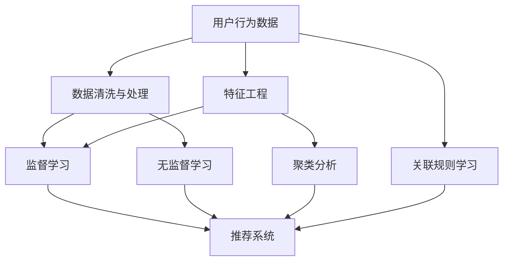

                 

# 如何进行有效的用户行为分析

> 关键词：用户行为分析, 数据处理, 特征工程, 模型评估, 数据可视化

## 1. 背景介绍

### 1.1 问题由来
在当今数字化时代，数据成为了企业最为宝贵的资产之一。企业不仅需要了解用户的基本属性，如年龄、性别、地域等，更需要洞察用户在网站、应用、产品上的行为，以便进行精细化运营和商业决策。用户行为分析（User Behavior Analysis, UBA）便是一种基于数据的技术，它通过分析用户行为数据，帮助企业揭示用户需求、预测用户行为，进而实现精准营销、个性化推荐、客户细分等商业目标。

### 1.2 问题核心关键点
进行有效的用户行为分析，涉及到以下几个核心关键点：
- 数据收集：从用户设备、应用、网站等各个渠道获取用户行为数据。
- 数据处理：对原始数据进行清洗、去重、格式化等处理，以确保数据质量。
- 特征工程：从原始数据中提取有用的特征，以便进行机器学习建模。
- 模型选择：选择合适的机器学习算法，构建预测模型。
- 模型评估：对模型进行评估和调优，确保其预测性能。
- 数据可视化：将分析结果以直观的图表形式呈现，便于业务理解和使用。

这些关键点构成了一个完整的用户行为分析流程，帮助企业获取数据洞察，指导商业决策。

### 1.3 问题研究意义
用户行为分析在现代商业中扮演着至关重要的角色。它能够帮助企业：
- 提升用户满意度：通过分析用户行为，识别用户痛点，优化产品设计和用户体验。
- 提高转化率：利用用户行为预测，精准营销，提升用户转化。
- 优化资源配置：合理配置广告、客户服务等资源，实现成本效益最大化。
- 增强市场竞争力：深入了解竞争对手的用户行为，制定更有效的市场策略。

因此，进行有效的用户行为分析，对于企业的商业成功至关重要。

## 2. 核心概念与联系

### 2.1 核心概念概述

为更好地理解用户行为分析的原理和实现，本节将介绍几个密切相关的核心概念：

- **用户行为数据**：用户在使用产品或服务过程中产生的数据，包括点击、浏览、购买、搜索等行为记录。
- **特征工程**：从原始数据中提取有用的特征，构建能够代表用户行为模式的向量，供机器学习模型使用。
- **监督学习**：使用带标签的数据集进行训练，构建能够预测用户行为模式的模型。
- **无监督学习**：使用未标记的数据集进行训练，发现数据中的潜在模式和结构。
- **推荐系统**：利用用户行为数据进行个性化推荐，提高用户体验和转化率。
- **聚类分析**：将用户按照行为相似度分为不同的群体，进行更精细的用户细分。
- **关联规则学习**：从大量交易数据中挖掘出频繁发生的商品组合，供商业决策使用。

这些核心概念之间的逻辑关系可以通过以下Mermaid流程图来展示：



这个流程图展示了用户行为分析的核心流程和关键技术：

1. 用户行为数据被清洗和处理，并从中提取特征。
2. 监督学习模型和无监督学习模型分别从有标记数据和无标记数据中学习用户行为模式。
3. 聚类分析和关联规则学习进一步细化用户群体，支持更精准的推荐和营销。
4. 最终，推荐系统根据用户行为预测，实现个性化推荐。

## 3. 核心算法原理 & 具体操作步骤
### 3.1 算法原理概述

用户行为分析的核心是构建能够预测用户行为模式的模型。常用的机器学习算法包括：
- 决策树、随机森林、梯度提升树等传统分类和回归算法。
- 支持向量机、K近邻、神经网络等高效算法。
- 集成学习算法，如Bagging、Boosting、Stacking等，通过组合多种算法提升模型性能。

这些算法通过训练数据集，学习输入特征与输出标签之间的关系，构建预测模型。在用户行为分析中，常用的输入特征包括：
- 时间戳：用户行为发生的时间。
- 设备信息：用户的设备类型、操作系统等。
- 地理位置：用户的地理位置信息。
- 浏览行为：用户在应用或网站上的浏览路径、停留时间等。
- 购买行为：用户的购买记录、订单信息等。

常用的输出标签包括：
- 用户类型：如新用户、老用户、流失用户等。
- 用户行为：如点击、浏览、购买、注册等。
- 用户满意度：如评价分数、反馈意见等。

### 3.2 算法步骤详解

用户行为分析的一般流程如下：

**Step 1: 数据收集**
- 从应用、网站、移动设备等渠道，收集用户行为数据。数据格式可以是日志文件、数据库记录、API接口返回结果等。

**Step 2: 数据清洗与处理**
- 对收集到的数据进行去重、去噪、格式化等处理，确保数据质量。
- 使用缺失值处理技术，如均值填充、插值等，填补数据中的空缺。
- 使用异常值检测和修正技术，识别并修正数据中的异常点。

**Step 3: 特征工程**
- 选择合适的特征，如时间戳、设备信息、地理位置、浏览行为、购买行为等。
- 对特征进行归一化、标准化、编码等处理，以便模型能够更好地学习。
- 构建新的特征组合，如时间窗口、地理位置区间、浏览路径等，以发现更深层次的模式。

**Step 4: 模型选择与训练**
- 选择合适的机器学习算法，如决策树、随机森林、神经网络等。
- 使用训练数据集，训练模型并调整超参数，以获得最佳预测性能。
- 使用交叉验证等技术，评估模型的泛化能力。

**Step 5: 模型评估**
- 使用测试数据集，评估模型的预测性能，如准确率、召回率、F1分数等。
- 对不同模型的性能进行比较，选择性能最优的模型进行应用。
- 使用ROC曲线、PR曲线等方法，评估模型的分类性能。

**Step 6: 数据可视化**
- 使用数据可视化工具，如Tableau、Power BI、Matplotlib等，将分析结果以图表形式呈现。
- 展示用户行为分布、行为模式、用户细分等结果，供业务理解和使用。

### 3.3 算法优缺点

用户行为分析算法具有以下优点：
- 高效性：通过自动化数据处理和模型训练，节省了大量人工干预的时间。
- 精确性：能够从大规模数据中发现深层次的模式和关系，提供精准的预测结果。
- 可解释性：大多数机器学习算法具有可解释性，便于业务理解和使用。
- 可扩展性：算法可应用于各种规模和类型的业务场景，支持实时分析和预测。

同时，用户行为分析算法也存在一些局限性：
- 数据依赖性：模型的预测性能很大程度上依赖于数据质量。数据缺失、异常会影响模型效果。
- 特征选择：需要人工选择和构建合适的特征，增加了工作量。
- 过拟合风险：模型在训练集上表现良好，但在测试集上可能存在过拟合风险。
- 动态性：用户行为变化较快，模型需要不断更新以保持预测性能。

### 3.4 算法应用领域

用户行为分析在多个领域都有广泛应用，以下是几个典型的应用场景：

- **电商推荐系统**：通过分析用户购买记录和浏览行为，实现个性化推荐，提高用户转化率。
- **金融风控系统**：分析用户交易行为，识别潜在风险，预防金融欺诈。
- **广告投放优化**：分析用户点击、转化等行为数据，优化广告投放策略，提高广告效果。
- **用户细分与分析**：通过聚类分析，将用户分成不同的群体，进行精细化运营。
- **社交媒体分析**：分析用户互动数据，了解用户兴趣和需求，优化社交媒体内容。
- **健康医疗监测**：分析用户健康数据，预测疾病风险，支持个性化医疗。

这些应用场景展示了用户行为分析的广泛应用，帮助企业实现精细化运营和商业决策。

## 4. 数学模型和公式 & 详细讲解 & 举例说明
### 4.1 数学模型构建

本节将使用数学语言对用户行为分析的模型构建过程进行更加严格的刻画。

设用户行为数据集为 $\{(x_i, y_i)\}_{i=1}^N$，其中 $x_i$ 为输入特征，$y_i$ 为输出标签。假设选择的机器学习算法为 $f(x; \theta)$，其中 $\theta$ 为模型参数。用户行为分析的目标是最小化预测误差，即：

$$
\theta^* = \mathop{\arg\min}_{\theta} \sum_{i=1}^N \ell(f(x_i; \theta), y_i)
$$

其中 $\ell$ 为损失函数，常用的损失函数包括均方误差、交叉熵等。

### 4.2 公式推导过程

以决策树算法为例，推导其在用户行为分析中的基本公式。

假设用户行为数据集为 $\{(x_i, y_i)\}_{i=1}^N$，其中 $x_i$ 为输入特征，$y_i$ 为输出标签。决策树的构建过程如下：

1. 对特征 $x$ 进行排序，选择最优特征 $X_{best}$。
2. 根据特征 $X_{best}$ 的值，将数据集划分为若干子集。
3. 对每个子集递归构建决策树，直至满足停止条件。

决策树的目标是最小化误差平方和：

$$
J(\theta) = \frac{1}{N} \sum_{i=1}^N (y_i - f(x_i; \theta))^2
$$

其中 $f(x; \theta)$ 为决策树的预测函数，$\theta$ 为模型参数。

决策树的预测函数为：

$$
f(x; \theta) = \sum_{k=1}^K \alpha_k \mathbb{I}(x_k = X_{best})
$$

其中 $\alpha_k$ 为权重，$\mathbb{I}(x_k = X_{best})$ 为指示函数。

通过上述公式，可以构建决策树模型，并通过训练数据集最小化误差平方和，预测新的用户行为。

### 4.3 案例分析与讲解

假设某电商平台的销售数据集如下：

| 用户ID | 时间戳 | 浏览记录 | 购买记录 |
| ------ | ------ | -------- | -------- |
| 1      | 2021-01-01 10:00:00 | ["A", "B", "C", "D"] | ["B", "C"] |
| 2      | 2021-01-02 12:00:00 | ["A", "B", "C", "D", "E"] | ["B"] |
| 3      | 2021-01-03 15:00:00 | ["A", "B", "C"] | [] |

**Step 1: 数据清洗与处理**

- 数据去重：去除重复的用户ID和时间戳。
- 数据格式化：将日期格式统一为YYYY-MM-DD HH:MM:SS。
- 数据填充：补充缺失的浏览记录和购买记录。

**Step 2: 特征工程**

- 时间戳特征：将时间戳转换为时间间隔、时间窗口等特征。
- 浏览记录特征：提取浏览次数、浏览频率等特征。
- 购买记录特征：提取购买次数、购买金额等特征。

**Step 3: 模型选择与训练**

- 选择决策树算法，构建决策树模型。
- 使用交叉验证技术，评估模型性能。
- 调整超参数，优化模型性能。

**Step 4: 模型评估**

- 使用测试数据集，评估模型预测性能。
- 计算准确率、召回率、F1分数等指标。

**Step 5: 数据可视化**

- 使用Matplotlib绘制用户行为分布图。
- 使用Tableau展示用户细分结果。

最终，通过决策树模型可以预测用户的购买行为，实现个性化推荐。

## 5. 项目实践：代码实例和详细解释说明
### 5.1 开发环境搭建

在进行用户行为分析项目实践前，我们需要准备好开发环境。以下是使用Python进行Scikit-learn开发的环境配置流程：

1. 安装Anaconda：从官网下载并安装Anaconda，用于创建独立的Python环境。

2. 创建并激活虚拟环境：
```bash
conda create -n uba-env python=3.8 
conda activate uba-env
```

3. 安装Scikit-learn：从官网获取对应的安装命令。例如：
```bash
conda install scikit-learn -c conda-forge
```

4. 安装各类工具包：
```bash
pip install pandas numpy matplotlib seaborn sklearn tqdm jupyter notebook ipython
```

完成上述步骤后，即可在`uba-env`环境中开始项目实践。

### 5.2 源代码详细实现

这里我们以电商推荐系统为例，给出使用Scikit-learn对用户行为数据进行分类的Python代码实现。

首先，定义数据处理函数：

```python
import pandas as pd
from sklearn.model_selection import train_test_split
from sklearn.preprocessing import StandardScaler
from sklearn.ensemble import RandomForestClassifier

def process_data(df):
    # 数据去重
    df.drop_duplicates(inplace=True)
    # 数据格式化
    df['timestamp'] = pd.to_datetime(df['timestamp'], format='%Y-%m-%d %H:%M:%S')
    # 数据填充
    df.fillna(method='ffill', inplace=True)
    return df
```

然后，定义模型和优化器：

```python
from sklearn.model_selection import train_test_split
from sklearn.ensemble import RandomForestClassifier
from sklearn.metrics import accuracy_score, precision_score, recall_score, f1_score

# 加载数据
df = pd.read_csv('user_behavior.csv')

# 数据处理
df = process_data(df)

# 划分训练集和测试集
X_train, X_test, y_train, y_test = train_test_split(df[['timestamp', 'browsing', 'purchasing']], df['type'], test_size=0.2, random_state=42)

# 特征标准化
scaler = StandardScaler()
X_train = scaler.fit_transform(X_train)
X_test = scaler.transform(X_test)

# 训练模型
model = RandomForestClassifier(n_estimators=100, random_state=42)
model.fit(X_train, y_train)

# 评估模型
y_pred = model.predict(X_test)
accuracy = accuracy_score(y_test, y_pred)
precision = precision_score(y_test, y_pred)
recall = recall_score(y_test, y_pred)
f1 = f1_score(y_test, y_pred)

print('Accuracy:', accuracy)
print('Precision:', precision)
print('Recall:', recall)
print('F1 Score:', f1)
```

最终，通过训练随机森林模型，评估其预测性能，并输出结果。

### 5.3 代码解读与分析

让我们再详细解读一下关键代码的实现细节：

**process_data函数**：
- 对数据进行去重、格式化和填充操作，确保数据质量。

**train_test_split方法**：
- 将数据集划分为训练集和测试集，用于模型训练和评估。

**StandardScaler类**：
- 对特征进行标准化处理，以便模型能够更好地学习。

**RandomForestClassifier类**：
- 使用随机森林算法，构建用户行为分类模型。

**accuracy_score, precision_score, recall_score, f1_score函数**：
- 计算模型的准确率、精确率、召回率和F1分数，评估模型性能。

通过上述代码，可以清晰地看到用户行为分析的实现过程，从数据处理到模型训练，再到性能评估，每个步骤都有详细的解释和实现。

## 6. 实际应用场景
### 6.1 智能推荐系统

基于用户行为分析的推荐系统，能够帮助电商、视频网站等平台实现个性化推荐，提高用户满意度和转化率。推荐系统通过分析用户的历史行为数据，预测用户的潜在需求，推荐相关商品或内容。

在技术实现上，可以收集用户浏览、点击、购买等行为数据，构建用户行为特征向量。使用推荐算法，如协同过滤、基于内容的推荐等，训练推荐模型。微调模型参数，优化推荐效果。最终，将推荐结果展示给用户，提升用户体验。

### 6.2 金融风控系统

金融风控系统通过分析用户交易行为，识别潜在的风险用户，预防金融欺诈。风控系统通过收集用户的交易数据，提取特征如交易金额、频率、时间等，使用分类算法，如逻辑回归、随机森林等，训练风险预测模型。

在具体实现中，需要收集用户的交易记录，构建用户行为特征向量。使用风控模型，对新用户进行风险评估，预测其是否存在欺诈行为。对于高风险用户，及时采取措施，防范金融风险。

### 6.3 广告投放优化

广告投放优化通过分析用户点击、转化等行为数据，优化广告投放策略，提高广告效果。广告投放优化系统收集用户广告点击数据，提取用户行为特征，使用回归算法，如线性回归、梯度提升树等，训练广告点击预测模型。

在实际应用中，需要收集广告点击数据，构建用户行为特征向量。使用广告投放优化模型，预测广告点击率，优化广告投放策略。通过A/B测试等手段，评估广告投放效果，调整投放策略。

### 6.4 未来应用展望

随着用户行为分析技术的不断发展，未来的应用场景将会更加广泛和深入。以下是几个未来可能的应用方向：

1. **跨平台行为分析**：将用户在多个平台上的行为数据整合，进行统一分析和预测，提供跨平台的个性化服务。
2. **实时行为分析**：利用流计算技术，实时分析用户行为数据，实现动态推荐和预警。
3. **智能客服系统**：通过分析用户在线客服聊天记录，预测用户需求，自动回答常见问题，提升客服效率。
4. **健康医疗监测**：分析用户的健康数据，预测疾病风险，提供个性化健康建议。
5. **社交媒体分析**：通过分析用户在社交媒体上的互动数据，预测用户兴趣和需求，优化社交媒体内容。

这些应用方向展示了用户行为分析的广泛前景，将为用户和企业带来更多的价值和机会。

## 7. 工具和资源推荐
### 7.1 学习资源推荐

为了帮助开发者系统掌握用户行为分析的理论基础和实践技巧，这里推荐一些优质的学习资源：

1. 《机器学习实战》：本书详细介绍了机器学习算法的实现和应用，包括决策树、随机森林、神经网络等，适合初学者入门。

2. 《Python数据科学手册》：该书系统介绍了Python在数据科学中的应用，包括数据处理、特征工程、模型训练等，是学习数据科学的必备参考书。

3. 《深度学习入门》：该书由TensorFlow官方出版，详细介绍了深度学习的基础知识和技术，包括神经网络、卷积神经网络、循环神经网络等。

4. 《Python机器学习》：该书由著名数据科学家Sebastian Raschka撰写，介绍了机器学习的基本原理和实践技巧，适合进阶学习。

5. 《数据科学导论》：该书由Coursera《机器学习》课程主讲人Andrew Ng撰写，系统介绍了机器学习的基本概念和算法，是入门数据科学的经典教材。

通过对这些资源的学习实践，相信你一定能够快速掌握用户行为分析的精髓，并用于解决实际的商业问题。

### 7.2 开发工具推荐

高效的开发离不开优秀的工具支持。以下是几款用于用户行为分析开发的常用工具：

1. Python：作为一种通用的编程语言，Python具有简单易学、库资源丰富的特点，是用户行为分析的首选语言。

2. Scikit-learn：一个基于Python的机器学习库，提供简单易用的机器学习算法，包括决策树、随机森林、支持向量机等。

3. TensorFlow：由Google开发的深度学习框架，提供高效的计算图和分布式训练支持，适合大规模深度学习模型开发。

4. PyTorch：由Facebook开发的深度学习框架，具有动态计算图和灵活的API设计，适合快速原型设计和研究。

5. Apache Spark：一个开源的大数据处理框架，提供分布式计算和数据分析功能，支持多种数据源和数据格式。

6. Tableau：一个强大的数据可视化工具，支持从多种数据源中提取数据，进行交互式可视化分析。

7. Power BI：由微软开发的商业智能工具，提供丰富的报表和仪表盘，支持多种数据源和分析功能。

合理利用这些工具，可以显著提升用户行为分析的开发效率，加快创新迭代的步伐。

### 7.3 相关论文推荐

用户行为分析在学术界和工业界都得到了广泛的研究。以下是几篇奠基性的相关论文，推荐阅读：

1. KDD Cup 2012: Predicting Customer Churn：该竞赛任务通过分析用户行为数据，预测用户的流失情况，展示了用户行为分析的强大应用。

2. The Factor Graph Model for Highly Precise and Robust Collaborative Filtering：该论文提出了基于因子图的推荐算法，通过联合建模用户和物品的隐式特征，实现高精度的推荐。

3. Adaptive Regularization for Online Matrix Factorization Learning：该论文提出了自适应正则化的在线矩阵分解算法，提高了推荐系统的稳定性和鲁棒性。

4. Mining Association Rules over Sequences：该论文提出了序列关联规则挖掘算法，从用户行为序列中挖掘频繁出现的物品组合，支持推荐和交叉销售。

5. Recommender Systems：该论文综述了推荐系统的基本原理和常用算法，包括协同过滤、基于内容的推荐等，是推荐系统研究的经典文献。

这些论文代表了大数据和推荐系统领域的研究进展，为未来用户行为分析提供了宝贵的理论基础和实践经验。

## 8. 总结：未来发展趋势与挑战
### 8.1 总结

本文对用户行为分析的原理和实践进行了全面系统的介绍。首先阐述了用户行为分析的研究背景和意义，明确了数据收集、数据处理、特征工程、模型选择、模型评估、数据可视化等关键步骤。其次，通过Python代码实例，展示了用户行为分析的实现过程。最后，探讨了用户行为分析在电商推荐、金融风控、广告投放等多个领域的广泛应用。

通过本文的系统梳理，可以看到，用户行为分析作为现代数据驱动商业的重要技术，通过自动化数据分析和机器学习建模，帮助企业洞察用户需求、优化资源配置、提升用户体验和转化率。未来，随着数据量的不断增加和技术的不断进步，用户行为分析必将在更广泛的场景中发挥作用，为企业带来更多的价值和机会。

### 8.2 未来发展趋势

展望未来，用户行为分析技术将呈现以下几个发展趋势：

1. **自动化和智能化**：自动化数据处理和智能化模型选择将成为用户行为分析的常态，降低人工干预的复杂度和成本。

2. **跨平台集成**：将用户在不同平台上的行为数据整合，进行统一分析和预测，实现跨平台的个性化服务。

3. **实时分析和实时推荐**：利用流计算和实时数据处理技术，实现实时行为分析和推荐，满足用户即时需求。

4. **多模态融合**：结合用户行为数据、社交媒体数据、地理位置数据等多种数据源，实现多模态信息的协同建模，提升预测精度。

5. **模型可解释性**：通过可解释性算法，如LIME、SHAP等，增强模型的透明度，帮助业务理解模型的决策逻辑。

6. **隐私保护和合规性**：随着用户隐私保护意识的增强，如何在保护用户隐私的同时进行行为分析，将是未来的重要课题。

### 8.3 面临的挑战

尽管用户行为分析技术已经取得了瞩目成就，但在迈向更加智能化和自动化应用的过程中，它仍面临着诸多挑战：

1. **数据质量**：数据质量直接影响模型的预测性能，数据缺失、异常和错误都会影响模型效果。

2. **特征选择**：需要人工选择和构建合适的特征，增加了工作量，同时特征选择不当也会影响模型性能。

3. **过拟合风险**：模型在训练集上表现良好，但在测试集上可能存在过拟合风险，需要进一步优化模型和数据。

4. **实时性要求**：实时分析和实时推荐对系统性能提出了更高的要求，需要优化数据处理和模型训练的效率。

5. **隐私保护**：在处理用户行为数据时，需要遵循隐私保护法律法规，保护用户隐私。

6. **跨平台集成**：不同平台的数据格式和存储方式不同，需要进行标准化和统一。

### 8.4 研究展望

未来，用户行为分析技术的研究需要关注以下几个方向：

1. **自动化数据处理**：开发自动化数据清洗、特征工程和模型训练的工具，降低人工干预的复杂度和成本。

2. **多模态融合**：结合用户行为数据、社交媒体数据、地理位置数据等多种数据源，实现多模态信息的协同建模，提升预测精度。

3. **模型可解释性**：通过可解释性算法，如LIME、SHAP等，增强模型的透明度，帮助业务理解模型的决策逻辑。

4. **隐私保护和合规性**：开发隐私保护技术，如差分隐私、联邦学习等，保护用户隐私和数据安全。

5. **实时分析和实时推荐**：利用流计算和实时数据处理技术，实现实时行为分析和推荐，满足用户即时需求。

6. **跨平台集成**：开发统一的数据处理和分析平台，支持跨平台的数据整合和分析。

这些研究方向的探索，必将引领用户行为分析技术迈向更高的台阶，为构建智能、高效的商业系统铺平道路。面向未来，用户行为分析技术还需要与其他人工智能技术进行更深入的融合，如知识表示、因果推理、强化学习等，多路径协同发力，共同推动数据驱动商业的进步。

## 9. 附录：常见问题与解答

**Q1：如何进行用户行为数据的收集？**

A: 用户行为数据的收集可以从多个渠道进行，包括：
1. 网站和应用：通过埋点技术，收集用户在网站和应用上的点击、浏览、购买等行为数据。
2. 社交媒体：通过API接口，收集用户在社交媒体上的互动数据。
3. 移动设备：通过移动设备的传感器和日志记录，收集用户的地理位置、设备信息等数据。
4. 在线客服：通过在线客服系统，收集用户聊天记录和反馈信息。

通过以上渠道，可以全面收集用户行为数据，为后续分析提供数据基础。

**Q2：如何进行用户行为数据的清洗和处理？**

A: 用户行为数据的清洗和处理主要包括以下几个步骤：
1. 数据去重：去除重复的记录和数据。
2. 数据格式化：统一数据格式，如日期格式、时间戳格式等。
3. 数据填充：填补缺失的字段和数据。
4. 数据标准化：对数据进行标准化处理，如缺失值处理、异常值检测等。

通过这些步骤，可以确保数据质量，为后续分析提供准确的数据基础。

**Q3：如何进行用户行为特征提取？**

A: 用户行为特征提取主要包括以下几个步骤：
1. 特征选择：选择有代表性和重要性的特征，如时间戳、设备信息、地理位置、浏览记录等。
2. 特征编码：对特征进行编码，如数值化、分类化等。
3. 特征组合：将多个特征组合成新的特征，如时间窗口、设备类型组合等。
4. 特征归一化：对特征进行归一化处理，如标准化、MinMax归一化等。

通过这些步骤，可以提取有用的特征，构建能够代表用户行为模式的向量，供机器学习模型使用。

**Q4：如何进行用户行为分析的模型选择和训练？**

A: 用户行为分析的模型选择和训练主要包括以下几个步骤：
1. 选择合适的机器学习算法，如决策树、随机森林、神经网络等。
2. 使用训练数据集，训练模型并调整超参数，以获得最佳预测性能。
3. 使用交叉验证等技术，评估模型的泛化能力。
4. 对模型进行调优和优化，以提高预测性能。

通过这些步骤，可以构建能够预测用户行为模式的模型，并实现高精度的预测和推荐。

**Q5：如何进行用户行为分析的模型评估和调优？**

A: 用户行为分析的模型评估和调优主要包括以下几个步骤：
1. 使用测试数据集，评估模型的预测性能，如准确率、召回率、F1分数等。
2. 对模型进行调优和优化，如调整超参数、增加特征等。
3. 使用不同的评估指标和评估方法，全面评估模型的性能。
4. 进行A/B测试等实验，验证模型的实际效果。

通过这些步骤，可以确保模型的预测性能，并进行必要的优化和调整。

**Q6：如何进行用户行为分析的数据可视化？**

A: 用户行为分析的数据可视化主要包括以下几个步骤：
1. 使用数据可视化工具，如Tableau、Power BI、Matplotlib等，将分析结果以图表形式呈现。
2. 展示用户行为分布、行为模式、用户细分等结果，供业务理解和使用。
3. 使用交互式图表，增强数据的可视化和分析效果。

通过这些步骤，可以将分析结果直观地展示给业务人员，帮助其理解用户行为和做出商业决策。

---

作者：禅与计算机程序设计艺术 / Zen and the Art of Computer Programming

