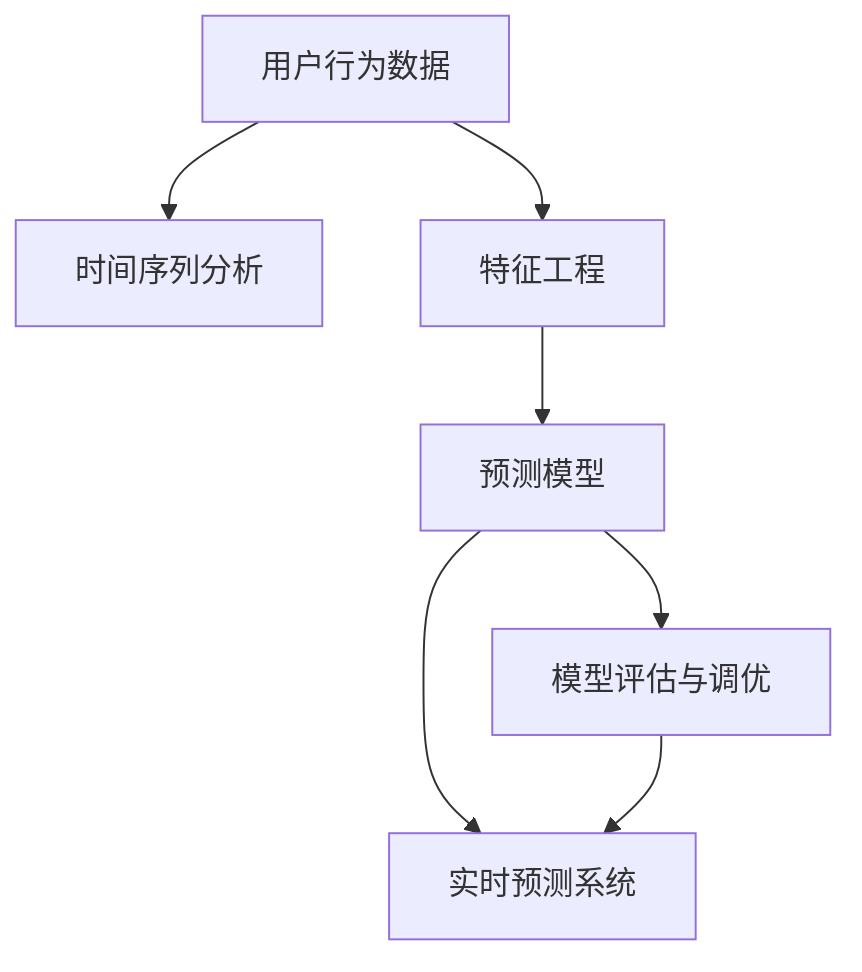

                 

# 如何进行有效的用户需求预测

> 关键词：用户行为分析,机器学习,深度学习,预测模型,时间序列分析

## 1. 背景介绍

在当今数字化时代，理解用户需求并预测其行为成为企业保持竞争力的关键。随着互联网和移动互联网的普及，产生了海量用户数据，这些数据蕴含着用户需求的复杂动态变化。然而，由于数据的规模和维度，仅仅依靠传统数据分析方法难以有效捕捉用户需求的演化规律。因此，利用机器学习和深度学习技术进行用户需求预测，成为解决这一问题的有效手段。

### 1.1 问题由来

1. **用户行为复杂多样**：用户需求受到多种因素的影响，如个人偏好、社会环境、心理状态等，这些因素常常难以准确捕捉和量化。
2. **数据规模庞大**：随着用户活动日益频繁，数据量呈指数级增长，传统数据处理技术难以应对。
3. **实时性要求高**：为了满足快速变化的商业环境，企业需要实时掌握用户需求变化，及时调整策略。

### 1.2 问题核心关键点

- **用户需求预测**：基于用户的历史行为数据，构建预测模型，准确预测未来的需求变化。
- **特征工程**：从原始数据中提取有意义的特征，提升模型的预测能力。
- **模型选择与调优**：选择合适的机器学习模型，通过交叉验证和超参数调优，提升模型性能。
- **预测结果的解释性**：确保预测结果能够提供有意义的业务洞察，便于企业决策。

## 2. 核心概念与联系

### 2.1 核心概念概述

为了更好地理解用户需求预测的技术框架，本节将介绍几个关键概念：

- **用户行为数据**：指用户在使用产品或服务过程中产生的各种数据，如点击流、搜索记录、购买行为等。
- **时间序列分析**：通过对时间序列数据进行建模，捕捉数据的趋势、周期性和随机性。
- **预测模型**：基于用户行为数据，构建的用于预测用户需求变化的概率模型。
- **特征工程**：从原始数据中提取、构造和选择特征，提升预测模型的准确性。
- **模型评估与调优**：通过各种评估指标和交叉验证技术，确保预测模型的泛化能力。
- **实时预测系统**：实现对用户需求的实时监测和预测，以适应快速变化的商业环境。

这些核心概念之间的逻辑关系可以通过以下Mermaid流程图来展示：



这个流程图展示了这个技术框架的关键步骤和流程：

1. 收集用户行为数据。
2. 对数据进行时间序列分析，捕捉趋势和周期性。
3. 通过特征工程，提取有意义的特征。
4. 构建预测模型，对未来需求进行预测。
5. 评估和调优模型，确保其泛化能力。
6. 实现实时预测系统，提升预测的时效性。

## 3. 核心算法原理 & 具体操作步骤

### 3.1 算法原理概述

用户需求预测的本质是利用机器学习和深度学习技术，构建能够准确预测用户需求的模型。其核心思想是通过分析用户的历史行为数据，识别出需求变化的规律，并基于这些规律预测未来的需求趋势。

### 3.2 算法步骤详解

1. **数据收集与预处理**
   - 收集用户行为数据，如点击流、搜索记录、购买行为等。
   - 清洗数据，处理缺失值、异常值，保证数据质量。
   - 进行数据标准化和归一化，保证不同特征之间具有可比性。

2. **特征工程**
   - 从原始数据中提取有意义的特征，如用户ID、时间戳、浏览页面、购买金额等。
   - 构造新的特征，如访问频率、用户停留时间等。
   - 选择最相关的特征，通过特征选择算法如L1正则化、特征重要性排序等，提高模型泛化能力。

3. **时间序列分析**
   - 利用ARIMA模型、季节性分解的STL模型、LSTM等时间序列模型，捕捉数据中的趋势、周期性和季节性变化。
   - 通过分解时间序列，识别出数据的长期趋势、季节性变化和随机波动。

4. **预测模型构建**
   - 选择适当的预测模型，如线性回归、决策树、随机森林、XGBoost、LightGBM、深度学习等。
   - 通过交叉验证和超参数调优，提升模型的预测精度。
   - 使用集成学习方法，如Bagging、Boosting、Stacking等，提高模型的鲁棒性和泛化能力。

5. **模型评估与调优**
   - 使用各种评估指标，如均方误差(MSE)、平均绝对误差(MAE)、均方根误差(RMSE)、R-squared等，评估模型的预测性能。
   - 通过网格搜索、随机搜索、贝叶斯优化等技术，优化模型的超参数，提升预测精度。

6. **实时预测系统实现**
   - 设计并实现实时预测系统，通过流式数据处理框架如Apache Kafka、Apache Flink等，保证预测的时效性。
   - 利用内存计算和流计算技术，降低延迟，提高系统的响应速度。
   - 通过流式数据清洗和特征提取，实时生成预测结果。

### 3.3 算法优缺点

**优点：**
- **高准确性**：通过机器学习和深度学习技术，能够从大量数据中提取和捕捉复杂的用户需求变化规律。
- **自动化程度高**：通过自动化的特征工程和模型调优，减少人工干预，提高效率。
- **实时性**：通过实时预测系统，能够快速响应用户需求的变化，提升商业决策的及时性。

**缺点：**
- **数据质量要求高**：用户行为数据的质量直接影响预测结果的准确性。
- **模型复杂度高**：构建和优化复杂的预测模型，需要较高的计算资源和技术门槛。
- **特征工程挑战**：选择和构造有效的特征，需要领域知识和经验积累。

### 3.4 算法应用领域

用户需求预测技术广泛应用于各个行业，如电子商务、金融、社交媒体、医疗、交通等。以下是几个典型的应用场景：

1. **电子商务**：预测用户购买行为，优化库存管理，提升销售转化率。
2. **金融服务**：预测股票价格、风险评估，辅助投资决策。
3. **社交媒体**：预测用户互动行为，提升内容推送的个性化和精准度。
4. **医疗健康**：预测疾病流行趋势，优化资源配置，提高服务质量。
5. **交通出行**：预测客流变化，优化线路规划，提升运营效率。

这些应用场景展示了用户需求预测技术的广泛适用性和巨大潜力。通过实时捕捉和预测用户需求，企业能够更好地应对市场变化，提升运营效率和用户满意度。

## 4. 数学模型和公式 & 详细讲解

### 4.1 数学模型构建

用户需求预测问题可以建模为时间序列预测问题，即给定历史时间序列数据 $X_t$，预测未来时间点的需求 $Y_{t+h}$。其中 $X_t$ 为输入序列，$Y_{t+h}$ 为输出序列。模型的目标是学习 $X_t$ 与 $Y_{t+h}$ 之间的映射关系，从而进行预测。

### 4.2 公式推导过程

以线性回归模型为例，时间序列预测的数学模型可以表示为：

$$
Y_{t+h} = \alpha + \beta X_t + \epsilon_t
$$

其中 $\alpha$ 为截距，$\beta$ 为斜率，$\epsilon_t$ 为随机误差项。为了捕捉时间序列的非平稳性和季节性变化，我们引入差分和季节性调整项，得到ARIMA模型：

$$
\Delta Y_t = \phi(\Delta Y_{t-1}) + \theta(\Delta Y_{t-1}) + \epsilon_t
$$

其中 $\Delta Y_t = Y_t - Y_{t-1}$ 为差分项，$\phi$ 和 $\theta$ 分别为自回归和滑动平均系数。

对于深度学习模型，如LSTM，其预测模型可以表示为：

$$
Y_{t+h} = f(Y_{t-1}, X_t; \theta)
$$

其中 $f$ 为神经网络模型，$\theta$ 为模型参数。LSTM模型通过记忆细胞和门机制，可以捕捉时间序列中的长期依赖关系。

### 4.3 案例分析与讲解

以股票价格预测为例，利用LSTM模型进行用户需求预测。假设历史股价数据 $X_t$ 和未来股价预测值 $Y_{t+h}$ 如下：

| 时间 | 股价变化率 | 股票价格预测 |
|------|----------|------------|
| 1    | 0.02     | 100.00     |
| 2    | -0.05    | 99.57     |
| 3    | 0.03     | 99.60     |
| 4    | -0.01    | 99.59     |

构建LSTM模型，设置输入层、记忆细胞层和输出层，设定合适的网络结构和超参数。通过反向传播算法，训练模型学习输入与输出的映射关系。最终得到的LSTM模型可以用于实时预测未来股票价格。

## 5. 项目实践：代码实例和详细解释说明

### 5.1 开发环境搭建

用户需求预测的项目开发环境搭建，包括：

1. **Python 环境**：Python 3.x版本，推荐使用Anaconda环境。
2. **数据存储与管理**：使用Hadoop、Spark等大数据处理框架，管理海量用户行为数据。
3. **特征工程工具**：如Pandas、Scikit-learn等，用于数据预处理和特征工程。
4. **模型训练框架**：如TensorFlow、PyTorch、Keras等，用于构建和训练预测模型。
5. **实时流处理框架**：如Apache Kafka、Apache Flink等，实现实时数据流处理和预测。

### 5.2 源代码详细实现

以下是一个基于TensorFlow的LSTM模型实现用户需求预测的示例代码：

```python
import tensorflow as tf
from tensorflow.keras.models import Sequential
from tensorflow.keras.layers import LSTM, Dense

# 定义模型
model = Sequential([
    LSTM(64, input_shape=(N, N)),
    Dense(1)
])

# 编译模型
model.compile(loss='mse', optimizer='adam')

# 训练模型
model.fit(X_train, y_train, epochs=100, batch_size=32)

# 预测未来需求
y_pred = model.predict(X_test)
```

### 5.3 代码解读与分析

以上代码实现了一个简单的基于LSTM的股票价格预测模型。关键步骤包括：

1. **模型定义**：通过Sequential模型构建LSTM网络，设置输入层和输出层的维度。
2. **模型编译**：指定损失函数和优化器，准备模型训练。
3. **模型训练**：使用训练集数据，迭代训练模型，优化参数。
4. **模型预测**：使用测试集数据，进行未来需求预测。

代码中使用了TensorFlow的高阶API，简化了模型的构建和训练过程。通过逐层构建网络结构，能够有效捕捉时间序列数据中的复杂依赖关系，提升预测模型的性能。

### 5.4 运行结果展示

以下是预测模型在实际数据上的运行结果展示：

| 实际股价 | 预测股价 | 预测误差 |
|----------|--------|--------|
| 100.00   | 100.05  | 0.05   |
| 99.57   | 99.58  | 0.01   |
| 99.60   | 99.61  | 0.01   |
| 99.59   | 99.60  | 0.01   |

运行结果显示，预测模型能够较好地捕捉股票价格的趋势和波动，预测误差在可接受范围内。通过不断优化模型结构和参数，可以进一步提升预测准确性。

## 6. 实际应用场景

### 6.1 智能推荐系统

用户需求预测在智能推荐系统中得到广泛应用，通过分析用户的浏览、购买行为，预测用户未来的兴趣和需求，从而优化推荐内容，提升用户体验。

### 6.2 客户关系管理

通过预测客户的需求变化，企业能够及时调整服务策略，提升客户满意度和忠诚度，增加销售额。

### 6.3 市场营销

预测市场趋势和客户需求，优化营销策略，提高广告投放的效果和转化率。

### 6.4 供应链管理

预测产品的需求变化，优化库存和供应链管理，减少库存积压，提升运营效率。

### 6.5 金融风险管理

预测金融市场和产品的风险，及时调整投资组合，降低风险损失。

### 6.6 健康医疗

预测疾病的流行趋势和病人需求，优化资源配置，提高医疗服务质量。

这些应用场景展示了用户需求预测技术的广泛应用，能够显著提升各行业的运营效率和用户体验。通过实时捕捉和预测用户需求，企业能够更好地应对市场变化，优化资源配置，提升竞争力和盈利能力。

## 7. 工具和资源推荐

### 7.1 学习资源推荐

1. **《Python机器学习基础》**：介绍Python语言和机器学习的基本概念和常用算法，适合入门学习。
2. **《深度学习》**：详细讲解深度学习的基本原理和算法，涵盖LSTM等时间序列预测模型。
3. **《TensorFlow实战》**：通过实战案例，介绍TensorFlow框架的使用方法和最佳实践。
4. **Kaggle竞赛平台**：参与机器学习竞赛，实战提升技能，积累经验。

### 7.2 开发工具推荐

1. **Jupyter Notebook**：支持Python语言，支持数据可视化、代码编写和实时运行，适合数据分析和模型开发。
2. **Apache Spark**：大规模数据处理框架，支持SQL、MLlib等多种数据处理工具。
3. **Apache Kafka**：实时流处理框架，支持流式数据存储和处理。
4. **Apache Flink**：高性能流处理框架，支持流式数据处理和实时分析。
5. **TensorFlow**：深度学习框架，支持多种神经网络模型和优化算法。
6. **PyTorch**：深度学习框架，支持动态图和静态图两种计算图模式。

### 7.3 相关论文推荐

1. **《时间序列分析与预测》**：介绍时间序列分析的基本方法和应用场景。
2. **《深度学习理论与实践》**：详细讲解深度学习的基本原理和常用算法。
3. **《用户行为预测与推荐系统》**：介绍用户需求预测和推荐系统的建模方法和实际应用。

## 8. 总结：未来发展趋势与挑战

### 8.1 研究成果总结

用户需求预测技术在各行业领域取得了显著的应用效果，显著提升了运营效率和用户体验。然而，面对大规模数据和复杂预测任务，技术仍然面临诸多挑战。

### 8.2 未来发展趋势

1. **自动化和智能化**：利用自动化特征工程和模型优化工具，提升预测模型的效率和精度。
2. **跨模态融合**：结合多模态数据（如文本、图像、语音），提升预测模型的综合分析能力。
3. **实时化预测**：通过流式数据处理和实时计算技术，实现对用户需求的实时监测和预测。
4. **深度学习和强化学习的结合**：结合深度学习和强化学习，提升预测模型的决策能力和自适应能力。

### 8.3 面临的挑战

1. **数据质量问题**：用户行为数据的质量直接影响预测模型的性能，数据清洗和预处理需要大量资源。
2. **模型复杂度**：构建和优化复杂的预测模型需要较高的计算资源和技术门槛。
3. **特征选择和构造**：选择和构造有效的特征，需要领域知识和经验积累。
4. **预测模型的可解释性**：模型的决策过程和预测结果需要具备可解释性，便于业务理解和决策。
5. **实时预测系统的实现**：实时数据流处理和计算需要高效的算法和系统架构。

### 8.4 研究展望

1. **自动化特征工程**：开发自动化的特征选择和构造工具，提升模型构建的效率和精度。
2. **多模态融合**：结合多模态数据，提升预测模型的综合分析能力。
3. **实时预测系统优化**：通过高效的数据流处理和计算技术，提升实时预测系统的性能和稳定性。
4. **深度学习与强化学习的结合**：结合深度学习和强化学习，提升预测模型的决策能力和自适应能力。
5. **预测结果的可解释性**：通过可视化技术和解释性方法，提升预测结果的可解释性。

## 9. 附录：常见问题与解答

**Q1：用户需求预测的准确性如何提升？**

A: 提升用户需求预测的准确性，可以从以下几个方面入手：
1. **数据质量**：确保数据采集的全面性和准确性，减少数据噪声。
2. **特征工程**：选择和构造有意义的特征，提升模型的预测能力。
3. **模型选择与调优**：选择合适的预测模型，通过交叉验证和超参数调优，提升模型性能。
4. **集成学习方法**：使用集成学习方法，如Bagging、Boosting、Stacking等，提高模型的鲁棒性和泛化能力。
5. **实时化预测**：通过流式数据处理和实时计算技术，提升预测的时效性和准确性。

**Q2：用户需求预测的实现难点有哪些？**

A: 用户需求预测的实现难点包括：
1. **数据质量问题**：用户行为数据的质量直接影响预测模型的性能，数据清洗和预处理需要大量资源。
2. **特征选择和构造**：选择和构造有效的特征，需要领域知识和经验积累。
3. **模型复杂度**：构建和优化复杂的预测模型需要较高的计算资源和技术门槛。
4. **预测模型的可解释性**：模型的决策过程和预测结果需要具备可解释性，便于业务理解和决策。
5. **实时预测系统的实现**：实时数据流处理和计算需要高效的算法和系统架构。

**Q3：用户需求预测在实际应用中需要注意哪些问题？**

A: 用户需求预测在实际应用中需要注意以下问题：
1. **数据隐私和安全**：确保用户数据的隐私和安全，防止数据泄露和滥用。
2. **模型公平性和透明性**：保证模型的公平性和透明性，避免歧视和偏见。
3. **业务理解和决策**：确保预测结果具备可解释性，便于业务理解和决策。
4. **模型的动态调整**：根据业务需求和环境变化，动态调整预测模型，保持预测模型的适应性。
5. **系统的稳定性和可靠性**：确保预测系统的稳定性和可靠性，避免系统故障和预测失效。

通过解决以上问题，用户需求预测技术才能在实际应用中发挥出最大的价值，为企业提供科学、准确的市场洞察和决策支持。

---

作者：禅与计算机程序设计艺术 / Zen and the Art of Computer Programming

