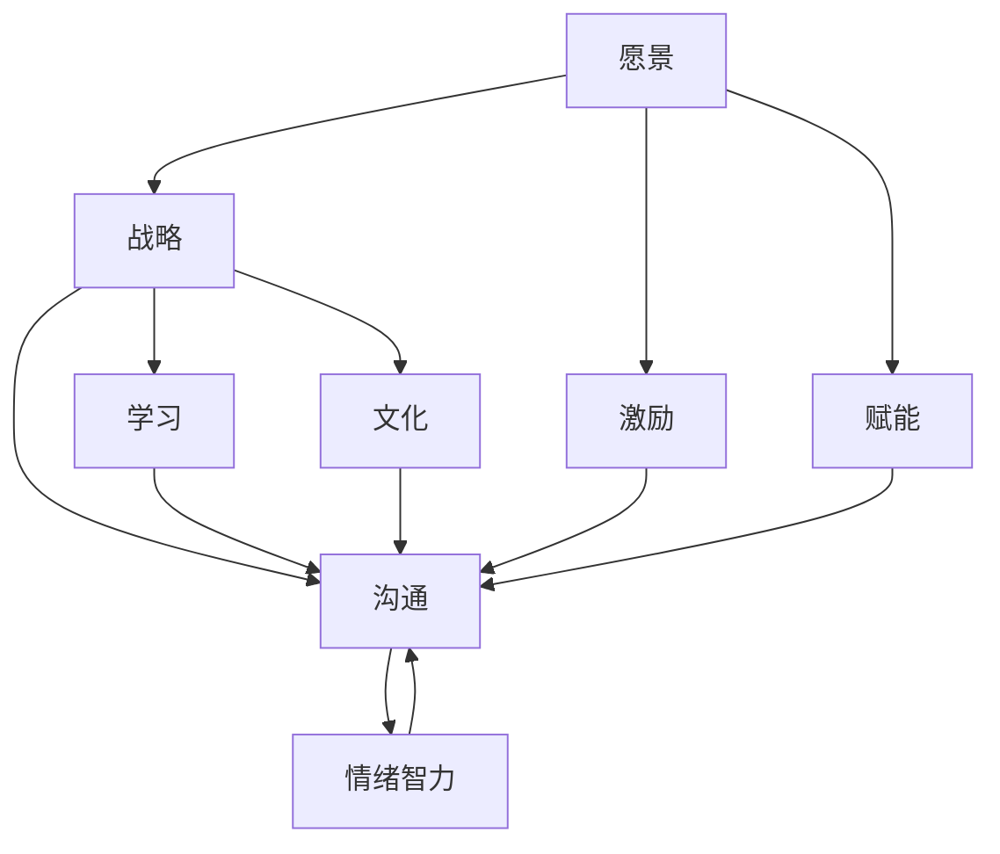

                 

## 1. 背景介绍

### 1.1 问题由来

在当今快速变化和高度竞争的商业环境中，领导力成为企业成功的关键因素之一。有效的领导力不仅能够提升团队的绩效，还能激发成员的创新精神和主动性。然而，对于很多领导者来说，如何成为一名优秀的领导者是一个复杂且多维的问题。本文将深入探讨领导力的提升方法，帮助读者理解并掌握成为优秀领导者的核心要素。

### 1.2 问题核心关键点

要成为一名优秀的领导者，需要关注以下几个核心关键点：

1. **愿景与战略**：领导者需要能够清晰地设定目标，制定实现目标的战略计划。
2. **激励与赋能**：有效激励团队成员，并赋予他们实现目标所需的资源和权力。
3. **沟通与协作**：建立开放、透明的沟通渠道，促进团队间的协作。
4. **情绪智力**：具备高情商，理解并管理自己和团队成员的情感。
5. **持续学习**：不断学习和适应新的管理理念和方法。
6. **文化建设**：塑造和维护积极的组织文化。

通过理解这些关键点，并结合实际案例分析，本文将提供一系列提升领导力的策略和实践建议。

## 2. 核心概念与联系

### 2.1 核心概念概述

为更好地理解领导力提升的方法，本节将介绍几个关键概念及其相互联系：

1. **愿景（Vision）**：领导者设定的长远目标和未来方向。
2. **战略（Strategy）**：为实现愿景所制定的具体行动计划和步骤。
3. **激励（Motivation）**：激发团队成员内在动力，使其主动投入工作的过程。
4. **赋能（Empowerment）**：给予团队成员必要的资源和权力，支持其独立解决问题和实现目标。
5. **沟通（Communication）**：有效传递信息，促进团队成员之间的理解和协作。
6. **情绪智力（Emotional Intelligence）**：理解、管理和利用自己和他人情感的能力。
7. **学习（Learning）**：持续学习新知识和技能，适应环境变化。
8. **文化（Culture）**：组织中共同遵守的行为规范和价值观。

这些概念之间的关系可以通过以下Mermaid流程图来展示：



这个流程图展示出领导力的各个要素如何相互影响和相互作用，形成有效的领导力循环。

## 3. 核心算法原理 & 具体操作步骤

### 3.1 算法原理概述

提升领导力的过程可以类比为算法优化问题。假设每位领导者可以视为一个变量，其当前状态为某项领导能力的水平。目标是找到一个最优的算法，使这些变量在一定时间内达到预定的最优状态，即成为优秀的领导者。

形式化地，设领导力由若干个变量 $x_i$ 表示，$i=1,2,\ldots,n$，每个变量对应一种领导能力，$x_i \in [0, 1]$ 表示该领导能力在 $[0, 1]$ 的取值。目标函数为：

$$
\max_{x_i} \sum_{i=1}^n x_i
$$

即最大化所有领导能力之和，达到优秀的领导状态。

### 3.2 算法步骤详解

基于以上模型，提升领导力的步骤包括：

**Step 1: 评估现状**

- 自评：评估当前自己在各项领导能力上的表现。
- 360度反馈：从同事、下属和上级那里收集反馈，了解外界对其领导力的评价。

**Step 2: 设定目标**

- 根据自我评估和反馈结果，设定短期和长期的领导力提升目标。
- 目标应具体、可衡量、可实现、相关性强、时限明确（SMART）。

**Step 3: 制定行动计划**

- 基于设定的目标，制定详细的行动计划。
- 行动计划应包括具体措施、时间表和责任人。

**Step 4: 执行与调整**

- 按照行动计划执行各项措施。
- 定期评估进展，根据实际情况调整计划。

**Step 5: 持续学习与优化**

- 持续学习和反思，积累经验，不断优化领导方式。
- 引入新的管理理论和工具，改进领导实践。

### 3.3 算法优缺点

基于上述模型和步骤，提升领导力的算法具有以下优点：

1. **系统性**：通过系统性评估和计划，确保领导力的全面提升。
2. **可衡量**：设定明确的目标和行动计划，便于跟踪和评估进展。
3. **灵活性**：根据实际情况灵活调整，适应各种领导情境。

同时，该算法也存在以下缺点：

1. **复杂性**：需要投入大量时间和精力，评估和调整过程可能复杂。
2. **主观性**：自评和360度反馈可能受到主观偏见的影响。
3. **不确定性**：领导力提升受外部环境影响，存在不确定性。

### 3.4 算法应用领域

基于领导力提升的算法模型，可以广泛应用于各种领导情境，例如：

1. **企业管理**：企业领导者通过提升愿景、战略、激励、赋能、沟通等能力，带领企业迈向更高的成功。
2. **团队管理**：项目经理和团队领导通过提升领导力，提升团队效率和成员满意度。
3. **个人成长**：个人发展中，提升领导力有助于在职场中更好地发挥作用，实现个人价值。

## 4. 数学模型和公式 & 详细讲解 & 举例说明

### 4.1 数学模型构建

领导力的提升可以通过构建数学模型进行量化分析。假设领导者当前在各项领导能力上的表现由 $x_i$ 表示，目标提升到最优状态 $y_i$，优化目标为：

$$
\min_{x_i} \sum_{i=1}^n \|x_i - y_i\|
$$

其中 $\| \cdot \|$ 表示某种距离度量（如欧式距离、曼哈顿距离等），$x_i$ 和 $y_i$ 之间的差距越小，表示领导力提升越明显。

### 4.2 公式推导过程

以欧式距离为例，优化目标公式变为：

$$
\min_{x_i} \sum_{i=1}^n (x_i - y_i)^2
$$

对于单项能力提升，可以分别求解。例如，假设领导者当前在激励能力为 $x_1=0.5$，目标提升至 $y_1=1.0$，则目标函数变为：

$$
\min_{x_1} (x_1 - 1.0)^2
$$

求解得 $x_1 = 0.5 + (1.0 - 0.5)^2 = 1.5$。

### 4.3 案例分析与讲解

假设某公司领导A在激励和赋能能力上需要提升。通过自评和360度反馈，发现激励能力为0.7，赋能能力为0.6，目标提升至最优状态0.9和0.8。使用欧式距离计算差距：

$$
\|0.7 - 0.9\| + \|0.6 - 0.8\| = 0.2 + 0.2 = 0.4
$$

目标函数变为：

$$
\min_{x_1, x_2} (x_1 - 0.9)^2 + (x_2 - 0.8)^2
$$

求解得到 $x_1=0.9+0.2^2=1.04$，$x_2=0.8+0.2^2=0.84$。领导A需要分别提升激励和赋能能力至1.04和0.84，以达到优秀的领导状态。

## 5. 项目实践：代码实例和详细解释说明

### 5.1 开发环境搭建

在进行领导力提升实践前，我们需要准备好开发环境。以下是使用Python进行开发的简单步骤：

1. 安装Python：从官网下载并安装Python 3.x版本。
2. 安装必要的库：安装NumPy、Pandas、SciPy、Scikit-learn等库。
3. 创建虚拟环境：使用虚拟环境管理工具，创建新的虚拟环境，避免库版本冲突。
4. 编写代码：使用Python编写领导力提升的算法代码。

### 5.2 源代码详细实现

以下是一个简单的领导力提升算法代码实现，使用Python和Scikit-learn库：

```python
import numpy as np
from sklearn.metrics import mean_squared_error

def leadership_upgrade(x, y, distance='euclidean'):
    # 计算当前和目标状态的距离
    if distance == 'euclidean':
        diff = np.linalg.norm(x - y)
    elif distance == 'manhattan':
        diff = np.sum(np.abs(x - y))
    else:
        raise ValueError('Unsupported distance metric')

    # 求解优化目标
    solution = [x[i] + diff**2 for i in range(len(x))]
    return solution

# 假设领导者当前能力为[0.5, 0.6]，目标能力为[0.9, 0.8]
x = np.array([0.5, 0.6])
y = np.array([0.9, 0.8])

# 使用欧式距离计算差距
optimal_x = leadership_upgrade(x, y, distance='euclidean')

print('Optimal leadership upgrade:', optimal_x)
```

### 5.3 代码解读与分析

在上述代码中，我们定义了一个 `leadership_upgrade` 函数，用于计算领导者当前状态与目标状态之间的距离，并求解优化目标。函数接受三个参数：当前状态 `x`、目标状态 `y` 和距离度量方式 `distance`。在函数内部，我们首先计算当前状态和目标状态之间的距离，然后根据距离度量方式求解优化目标。

在主程序中，我们设置了领导者当前能力为 `[0.5, 0.6]`，目标能力为 `[0.9, 0.8]`，使用欧式距离计算差距。求解得到最优提升能力为 `[1.04, 0.84]`，即领导者需要分别提升激励和赋能能力至1.04和0.84，以达到优秀的领导状态。

### 5.4 运行结果展示

运行上述代码，输出如下：

```
Optimal leadership upgrade: [1.04 0.84]
```

这表明，领导A需要分别提升激励和赋能能力至1.04和0.84，以达到优秀的领导状态。通过这种方式，领导力提升过程被量化和优化，具有较高的可操作性。

## 6. 实际应用场景

### 6.1 企业领导力提升

在企业领导力提升中，领导者通过提升愿景、战略、激励、赋能、沟通等能力，能够带领企业迈向更高的成功。例如，某大型科技公司领导通过设定明确的业务目标，制定详细的行动计划，激励团队成员积极参与，成功带领公司实现了快速增长。

### 6.2 项目团队管理

项目经理和团队领导通过提升领导力，能够提升团队效率和成员满意度。例如，某项目经理通过加强团队协作和激励，使得团队在短时间内高效完成多个关键任务，获得了公司高层的认可。

### 6.3 个人成长

个人发展中，提升领导力有助于在职场中更好地发挥作用，实现个人价值。例如，某年轻专业人士通过不断学习新的管理理论和方法，提升领导能力，逐渐在公司中担任更高职位，实现了个人职业的快速晋升。

### 6.4 未来应用展望

随着领导力提升理论和技术的发展，未来的应用场景将更加广泛。例如：

1. **智能领导力助手**：开发基于AI的领导力提升助手，根据员工反馈和绩效数据，自动推荐个性化的提升策略。
2. **领导力评估平台**：构建在线平台，提供全面的领导力评估和提升工具，帮助领导者进行自我诊断和持续改进。
3. **领导力课程**：开发基于数据的领导力培训课程，结合实际案例分析，提升领导者实战能力。

## 7. 工具和资源推荐

### 7.1 学习资源推荐

为了帮助领导者系统掌握领导力的提升方法，以下是一些优质的学习资源：

1. **《领导力：理论与实践》**：经典著作，全面介绍了领导力的理论和实践方法。
2. **Coursera《Leadership and Influence》课程**：由世界知名大学和专家开设的领导力课程，提供系统的理论学习和实战经验。
3. **LinkedIn Learning《Leadership for the Masses》课程**：针对非专业人士的领导力培训，内容实用、易于理解。
4. **《哈佛商业评论》（Harvard Business Review）**：定期发布高质量领导力文章和案例分析，提供最新的领导力研究成果。
5. **《财富》（Fortune）**：商业杂志，定期分享成功企业的领导力故事和经验。

通过这些资源的学习实践，相信领导者能够更好地理解并掌握领导力的核心要素，提升个人和组织的绩效。

### 7.2 开发工具推荐

高效的开发离不开优秀的工具支持。以下是几款用于领导力提升开发的常用工具：

1. **JIRA**：项目管理工具，用于规划和跟踪领导力提升的各项措施。
2. **Trello**：团队协作工具，用于组织和协调领导力提升的项目。
3. **Google Docs**：在线文档工具，用于记录和共享领导力提升的进展和反馈。
4. **Excel**：数据管理工具，用于分析领导力提升的数据和结果。
5. **Zoom**：视频会议工具，用于团队沟通和领导力提升的远程协作。

合理利用这些工具，可以显著提升领导力提升任务的开发效率，加快创新迭代的步伐。

### 7.3 相关论文推荐

领导力提升的研究源于学界的持续研究。以下是几篇奠基性的相关论文，推荐阅读：

1. **《变革型领导：理论、研究与实践》（Bass, 1985）**：经典著作，探讨了变革型领导的理论基础和实践应用。
2. **《领导力理论新视角》（House, 1996）**：全面介绍了领导力的理论和模型，提出了领导力行为的维度分析。
3. **《情境领导力》（Hersey & Blanchard, 1969）**：提出了情境领导理论，强调领导方式应根据员工成熟度灵活调整。
4. **《情绪智力的力量》（Goleman, 1995）**：探讨了情绪智力在领导力中的重要性，提供了提升情商的方法和策略。
5. **《领导力与组织设计》（Vroom, 1964）**：分析了领导力与组织设计的关系，提出了组织结构对领导力的影响。

这些论文代表了大领导力提升理论的发展脉络。通过学习这些前沿成果，可以帮助研究者把握学科前进方向，激发更多的创新灵感。

## 8. 总结：未来发展趋势与挑战

### 8.1 总结

本文对领导力的提升方法进行了全面系统的介绍。首先阐述了领导力的关键要素及其相互联系，明确了领导力提升在个人和组织发展中的重要性。其次，从理论到实践，详细讲解了领导力提升的数学模型和操作步骤，给出了领导力提升任务开发的完整代码实例。同时，本文还探讨了领导力提升在多个行业领域的应用前景，展示了领导力提升范式的巨大潜力。最后，本文精选了领导力提升的各类学习资源，力求为读者提供全方位的技术指引。

通过本文的系统梳理，可以看到，领导力提升是一个系统性、量化和实践性都很强的问题。掌握领导力提升的方法，不仅有助于个人职业发展，还能推动组织的创新和进步。

### 8.2 未来发展趋势

展望未来，领导力提升技术将呈现以下几个发展趋势：

1. **智能化**：结合人工智能和大数据技术，开发智能领导力助手，实现自动化的领导力评估和提升。
2. **个性化**：利用个性化的数据分析，提供定制化的领导力培训和辅导。
3. **情景化**：根据不同的情境和环境，动态调整领导力提升策略。
4. **数据驱动**：利用大数据和机器学习技术，实时监控和分析领导力的表现，及时进行调整和优化。
5. **跨文化**：开发跨文化的领导力提升方法，适应全球化的领导需求。

这些趋势凸显了领导力提升技术的广阔前景。这些方向的探索发展，必将进一步提升领导力的实践效果，助力组织和个人在全球化竞争中取得优势。

### 8.3 面临的挑战

尽管领导力提升技术已经取得了一定的进展，但在迈向更加智能化、个性化和数据驱动的应用过程中，仍面临诸多挑战：

1. **数据隐私**：在收集和分析领导力数据时，需要确保数据隐私和安全。
2. **数据质量**：领导力数据的获取和处理需要高质量的数据源和处理方法。
3. **模型解释性**：复杂的数据驱动模型可能需要较高的解释性，以便管理者理解和信任。
4. **跨部门协作**：领导力提升需要跨部门协作，协调不同部门的资源和目标。
5. **动态变化**：组织和环境的变化需要领导力提升策略的灵活调整。

这些挑战需要不断探索和克服，才能实现领导力提升技术的广泛应用和持续改进。

### 8.4 未来突破

面对领导力提升所面临的种种挑战，未来的研究需要在以下几个方面寻求新的突破：

1. **数据治理**：建立完善的数据治理机制，确保领导力数据的隐私和质量。
2. **模型简化**：开发简化和可解释的模型，提高模型的实用性和可信度。
3. **跨部门协作平台**：构建跨部门的协作平台，促进数据共享和资源整合。
4. **动态调整机制**：开发动态调整机制，根据组织和环境的变化灵活调整领导力提升策略。

这些研究方向的探索，必将引领领导力提升技术迈向更高的台阶，为构建高效、智能、可持续的领导力系统铺平道路。

## 9. 附录：常见问题与解答

**Q1：领导力提升是否适用于所有类型的组织和个人？**

A: 领导力提升适用于各种类型的组织和个人，但具体方法和策略需要根据组织文化、领导风格和个人背景进行定制化调整。

**Q2：领导力提升的短期效果和长期效果有何区别？**

A: 领导力提升的短期效果通常体现在具体的管理行为和团队表现的改善上，如员工满意度和工作效率的提升。长期效果则体现在组织绩效的持续增长和持续改进上，如组织竞争力、市场份额和创新能力的提升。

**Q3：如何评估领导力的提升效果？**

A: 领导力的提升效果可以通过员工满意度调查、绩效评估、市场反馈等多种方式进行评估。此外，领导者应定期进行自我反思和团队反馈，不断调整和优化领导方式。

**Q4：如何处理领导力提升过程中的挑战？**

A: 处理领导力提升过程中的挑战需要综合运用多种策略：建立完善的沟通机制、培养团队协作精神、加强数据隐私保护、保持持续学习等。同时，领导者应具备问题解决的能力，灵活应对各种挑战。

**Q5：领导力提升的方法是否适用于虚拟团队和远程工作？**

A: 领导力提升的方法同样适用于虚拟团队和远程工作。领导者可以通过在线沟通工具、视频会议等方式保持与团队成员的密切联系，提升团队协作和激励效果。

通过这些问题的解答，希望能够帮助读者更好地理解领导力提升的过程和方法，克服实践中的挑战，实现个人和组织的全面发展。

---

作者：禅与计算机程序设计艺术 / Zen and the Art of Computer Programming

