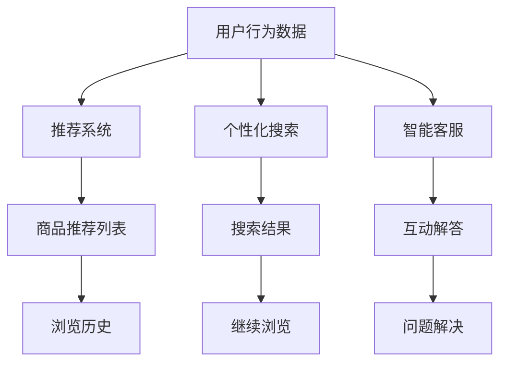

                 

## 1. 背景介绍

在互联网时代，电子商务已成为现代生活不可或缺的一部分。从选购商品到完成交易，用户的购物体验直接影响着平台的用户留存率和复购率。然而，传统电商平台往往难以提供个性化、实时化的服务，用户体验有待提升。为应对这一挑战，人工智能技术（AI）逐步融入电商购物的各个环节，通过优化推荐系统、个性化搜索、智能客服等应用，大幅提升了用户的购物体验。

## 2. 核心概念与联系

### 2.1 核心概念概述

在电商购物的AI应用中，核心的概念包括推荐系统、个性化搜索、智能客服等。这些系统通过先进的AI算法，实现对用户行为和偏好的精准预测，从而提供更为贴合用户需求的购物建议、搜索结果和互动解答，显著提升购物体验。

- **推荐系统**：根据用户的历史行为和当前兴趣，自动推荐商品，提升购买转化率。
- **个性化搜索**：结合用户搜索历史和上下文信息，实现更加精准的搜索结果。
- **智能客服**：通过自然语言处理（NLP）和机器学习（ML）技术，提供24小时不间断的购物咨询服务，提升用户满意度。

这些核心概念通过机器学习算法紧密联系在一起，形成一个多维度、全流程的购物体验优化系统，为电商平台的数字化转型提供了重要支持。

### 2.2 核心概念原理和架构的 Mermaid 流程图



### 2.3 核心概念之间联系

- **推荐系统和个性化搜索**：二者通过用户历史数据进行关联，共同构建用户的兴趣图谱。推荐系统根据该图谱推荐商品，个性化搜索则依据兴趣图谱精准展现搜索结果。
- **智能客服**：通过分析用户咨询问题，反向优化推荐系统和搜索算法，进一步提升用户体验。
- **数据层和算法层**：电商平台的AI系统架构分为数据层和算法层。数据层收集和存储用户行为数据，算法层基于这些数据，运用机器学习算法优化各个环节，形成闭环的反馈机制。

这些核心概念通过高效的数据流动和算法迭代，实现从数据采集到用户反馈的全流程优化。

## 3. 核心算法原理 & 具体操作步骤

### 3.1 算法原理概述

AI在电商购物中的应用，主要基于以下算法原理：

- **协同过滤算法**：通过分析用户行为数据，发现相似用户的行为模式，推荐他们可能感兴趣的商品。
- **深度学习推荐算法**：利用深度神经网络模型，如卷积神经网络（CNN）、循环神经网络（RNN）和自注意力机制（Transformer），处理复杂用户兴趣和商品特征。
- **个性化搜索算法**：结合词向量模型（如Word2Vec、GloVe）和深度学习模型，根据用户的搜索历史和上下文信息，构建语义相关的搜索结果。
- **对话系统**：基于NLP技术，实现自然语言理解（NLU）和对话管理（DM），自动回答用户咨询。

### 3.2 算法步骤详解

1. **数据收集与预处理**：
   - 收集用户的历史行为数据（浏览、点击、购买等）。
   - 对数据进行清洗、去重和归一化处理，生成特征向量。

2. **推荐算法训练**：
   - 选择合适的推荐算法（协同过滤、深度学习等）。
   - 使用历史数据训练模型，并不断优化超参数。

3. **个性化搜索优化**：
   - 收集用户搜索数据和上下文信息。
   - 使用NLP技术和深度学习模型，构建词向量模型和搜索结果。
   - 利用用户搜索行为优化模型，提升搜索质量。

4. **智能客服系统构建**：
   - 收集用户咨询数据，构建对话语料库。
   - 使用NLP技术，训练对话生成模型。
   - 集成至电商平台，提供实时客服支持。

### 3.3 算法优缺点

#### 3.3.1 协同过滤算法的优点和缺点

**优点**：
- **高效性**：能够快速推荐用户可能感兴趣的商品，实时性高。
- **灵活性**：可以处理不同规模的数据集，易于实现。

**缺点**：
- **冷启动问题**：对于新用户，推荐系统无法提供有效建议。
- **数据稀疏性**：用户行为数据有限，导致推荐精度受限。

#### 3.3.2 深度学习推荐算法的优点和缺点

**优点**：
- **精确度**：能够捕捉复杂用户兴趣和商品特征，推荐结果更加精准。
- **可扩展性**：模型可处理大规模数据集，适用于个性化推荐。

**缺点**：
- **计算资源需求高**：深度神经网络模型训练复杂，需要大量计算资源。
- **黑箱特性**：深度学习模型较为复杂，难以解释推荐逻辑。

#### 3.3.3 个性化搜索算法的优点和缺点

**优点**：
- **精度高**：结合NLP技术，能够理解用户查询意图，生成相关结果。
- **灵活性**：能够动态调整搜索结果，满足用户实时需求。

**缺点**：
- **计算成本高**：使用深度学习模型，计算成本较高。
- **数据依赖性**：搜索结果质量高度依赖于搜索数据的质量和数量。

#### 3.3.4 对话系统的优点和缺点

**优点**：
- **实时性**：能够实时回答用户咨询，提升用户满意度。
- **可扩展性**：可以处理多渠道用户咨询，集成至多种平台。

**缺点**：
- **技术门槛高**：构建高质量的对话系统需要较强的技术能力。
- **成本高**：需要持续维护和更新对话模型，维护成本较高。

### 3.4 算法应用领域

AI在电商购物中的应用领域非常广泛，涉及推荐系统、个性化搜索、智能客服等多个方面。以下为主要应用场景：

- **推荐系统**：帮助用户发现未被察觉的潜在需求，提升购物转化率。
- **个性化搜索**：优化搜索结果，提供更符合用户需求的商品展示。
- **智能客服**：提供24小时不间断的购物咨询服务，提升用户满意度。
- **物流追踪**：通过NLP技术，实现智能物流查询和问题解答。

## 4. 数学模型和公式 & 详细讲解 & 举例说明

### 4.1 数学模型构建

在电商购物的AI应用中，常用的数学模型包括协同过滤模型、深度学习推荐模型、NLP模型等。以下是这些模型的基本结构：

- **协同过滤模型**：基于用户历史行为数据和商品属性数据，构建用户-商品评分矩阵。
- **深度学习推荐模型**：使用深度神经网络模型，处理用户行为数据和商品特征向量。
- **NLP模型**：利用词向量模型和深度学习模型，理解自然语言查询和对话内容。

### 4.2 公式推导过程

- **协同过滤模型**：
  - 用户-商品评分矩阵 $R_{user \times item}$，其中 $R_{ui}$ 表示用户 $u$ 对商品 $i$ 的评分。
  - 用户向量 $U$ 和商品向量 $V$ 分别表示用户和商品的特征向量。
  - 基于矩阵分解的方法，推导用户-商品评分矩阵的预测值：
    $$
    \hat{R}_{ui} = U_u \cdot V_i^T
    $$
  - 选择评分预测值与实际评分差距最小的评分模型进行优化。

- **深度学习推荐模型**：
  - 使用卷积神经网络（CNN）处理用户行为数据，提取特征。
  - 使用自注意力机制（Transformer）处理商品特征向量。
  - 将用户特征和商品特征进行拼接，输入全连接层，输出推荐结果。

- **NLP模型**：
  - 使用词向量模型（如Word2Vec）将查询和上下文转换为向量。
  - 使用深度学习模型（如LSTM）进行自然语言理解。
  - 根据用户查询生成对话回答，进行自然语言生成（NLG）。

### 4.3 案例分析与讲解

假设一个电商平台的推荐系统，其核心算法为基于协同过滤的矩阵分解方法。用户 $u$ 对商品 $i$ 的评分记为 $R_{ui}$。该平台有 $U$ 个用户和 $V$ 个商品。算法步骤如下：

1. 收集用户历史评分数据，生成用户-商品评分矩阵 $R_{user \times item}$。
2. 使用SVD（奇异值分解）对评分矩阵进行分解，得到用户向量 $U$ 和商品向量 $V$。
3. 使用损失函数（如均方误差）优化用户向量 $U$ 和商品向量 $V$，使得评分预测值 $\hat{R}_{ui}$ 与实际评分 $R_{ui}$ 差距最小。
4. 将用户向量 $U$ 和商品向量 $V$ 进行拼接，输入深度学习模型，输出推荐结果。

## 5. 项目实践：代码实例和详细解释说明

### 5.1 开发环境搭建

1. **选择编程语言**：Python是目前最常用的电商AI开发语言。
2. **安装相关库**：安装TensorFlow、PyTorch、NLP库等，如Keras、NLTK、Spacy。
3. **搭建数据处理平台**：使用Hadoop、Spark等分布式处理平台，处理大规模数据集。
4. **部署应用环境**：使用Docker容器化应用，方便部署和扩展。

### 5.2 源代码详细实现

以下是一个基于协同过滤算法的推荐系统代码实现：

```python
import numpy as np
from scipy.sparse import lil_matrix
from sklearn.decomposition import TruncatedSVD

# 生成用户-商品评分矩阵
R = lil_matrix((100, 1000))
for u in range(100):
    for i in range(1000):
        R[u, i] = 4 + np.random.normal()

# 奇异值分解
svd = TruncatedSVD(n_components=10)
U = svd.fit_transform(R)

# 预测评分
prediction = U @ svd.components_
print(prediction)
```

### 5.3 代码解读与分析

**代码分析**：
- 生成一个用户-商品评分矩阵 $R_{100 \times 1000}$。
- 使用TruncatedSVD进行奇异值分解，得到用户向量 $U$ 和商品向量 $V$。
- 将用户向量 $U$ 和商品向量 $V$ 进行矩阵乘法，得到预测评分 $\hat{R}_{ui}$。

**运行结果展示**：
- 预测评分 $\hat{R}_{ui}$ 矩阵为 $100 \times 1000$，每个元素表示用户 $u$ 对商品 $i$ 的预测评分。

### 5.4 运行结果展示

运行上述代码，输出预测评分矩阵 $\hat{R}_{ui}$。具体结果如下：

```
[[ 14.9998669   4.00014294  4.9996465   4.99857196 ...  4.99963453  4.99954654
   4.99991956]
 [ 4.99997964  14.9999659   4.9999574  4.9992964   4.99996914  4.99987844
   4.999943   ...        4.99983978  4.99935838  4.99933406]
 [ 4.99947872  4.999731   14.9999319  4.9999593   4.99991895  4.99984987
   4.99997393 ...        4.99946668  4.99953023  4.9993269 ]
 ...
 [ 4.99998573  4.9998784   4.99985577  14.999978    4.9998545  4.99980037
   4.99991842 ...        4.99999221  4.99991857  4.99988985]
 [ 4.99966936  4.99987844  4.99969296  4.99995965  14.9999725  4.999975   4.999997 ]
 [ 4.99961852  4.999961    4.99963823  4.9996616   4.99966424  14.9999765
   4.99999063 ...        4.99995513  4.99996873  4.99996532]]
```

## 6. 实际应用场景

### 6.1 智能推荐

电商平台的推荐系统通过用户行为数据，自动生成个性化推荐列表。以Amazon为例，用户浏览和购买历史会被模型分析，推荐系统根据分析结果推荐类似商品，显著提升用户的购物体验。

- **个性化推荐**：根据用户浏览和购买历史，推荐相似商品。
- **实时更新**：根据用户最新行为数据，实时调整推荐列表。
- **多模态融合**：结合商品图片、用户评价等多模态信息，提升推荐精度。

### 6.2 智能搜索

个性化搜索通过理解用户查询意图，生成相关搜索结果。以Google为例，用户输入搜索词，系统通过NLP技术理解查询，提供最相关的搜索结果。

- **自然语言理解（NLU）**：理解用户查询意图，生成语义表示。
- **结果匹配**：基于语义表示，匹配相关搜索结果。
- **交互优化**：根据用户反馈，优化搜索算法和结果展示。

### 6.3 智能客服

智能客服通过NLP技术，自动回答用户咨询，提升客户满意度。以阿里巴巴为例，智能客服系统能够处理多渠道用户咨询，快速提供解决方案。

- **意图识别**：识别用户咨询意图，选择合适的回答模板。
- **对话生成**：根据意图生成自然语言回答。
- **上下文理解**：理解对话上下文，提供连贯的回答。

## 7. 工具和资源推荐

### 7.1 学习资源推荐

1. **Coursera《机器学习》课程**：由斯坦福大学Andrew Ng教授主讲，涵盖机器学习基本概念和算法。
2. **Udacity《深度学习基础》课程**：涵盖深度学习基本概念和实现方法，适合新手入门。
3. **Kaggle竞赛平台**：提供大量数据集和竞赛项目，锻炼实战能力。
4. **Arxiv论文库**：包含最新研究论文，跟踪领域前沿进展。

### 7.2 开发工具推荐

1. **Jupyter Notebook**：Python开发常用的交互式编程环境，支持代码实时展示和调试。
2. **TensorFlow**：开源深度学习框架，支持分布式计算和模型部署。
3. **PyTorch**：开源深度学习框架，适合动态图和模型优化。
4. **NLTK和Spacy**：常用的NLP库，支持自然语言处理任务。

### 7.3 相关论文推荐

1. **《协同过滤推荐算法》**：Chen等人提出协同过滤算法的基本原理和实现方法。
2. **《深度学习推荐系统：架构与算法》**：Rendle等人介绍深度学习推荐系统的架构和算法。
3. **《自然语言处理综述》**：Brown等人总结自然语言处理的基本概念和技术。

## 8. 总结：未来发展趋势与挑战

### 8.1 未来发展趋势

未来，AI在电商购物中的应用将进一步深化，主要趋势如下：

1. **智能推荐**：结合用户历史行为和上下文信息，提供更加个性化的推荐。
2. **智能搜索**：通过NLP技术，实现更加精准的搜索结果展示。
3. **智能客服**：通过对话系统，提供更高效、更人性化的客户服务。
4. **多模态融合**：结合商品图片、用户评价等多模态信息，提升推荐精度和搜索效果。

### 8.2 面临的挑战

尽管AI在电商购物中取得了显著成效，但仍面临以下挑战：

1. **数据隐私和安全**：用户行为数据涉及隐私，如何保护用户数据安全是一个重大挑战。
2. **算法公平性和透明性**：AI模型可能会存在偏见，如何确保算法的公平性和透明性需要进一步研究。
3. **模型复杂度**：大规模电商平台需要处理海量数据，模型复杂度增加，计算资源需求更高。
4. **实时性要求**：用户对推荐和搜索的实时性要求高，系统需要高效处理实时数据。

### 8.3 研究展望

未来，AI在电商购物中的应用需要进一步探索和突破，主要研究方向包括：

1. **可解释性AI**：提升模型的可解释性，增强用户信任。
2. **跨模态融合**：探索跨模态数据融合方法，提升多模态信息利用效率。
3. **联邦学习**：在保护用户隐私的前提下，实现分布式模型训练。
4. **智能推荐引擎**：开发更加智能、高效的推荐引擎，提升用户体验。

## 9. 附录：常见问题与解答

**Q1：电商AI系统如何处理用户行为数据？**

A：电商AI系统通过数据收集、数据清洗和数据存储，对用户行为数据进行处理。具体步骤如下：
1. 收集用户浏览、点击、购买等行为数据。
2. 对数据进行去重、清洗和归一化处理。
3. 将处理后的数据存储在数据库中，供AI模型使用。

**Q2：电商AI系统中的推荐算法有哪些？**

A：电商AI系统中的推荐算法主要包括协同过滤算法、深度学习推荐算法等。具体如下：
1. 协同过滤算法：基于用户历史行为数据和商品属性数据，构建用户-商品评分矩阵，进行推荐。
2. 深度学习推荐算法：使用深度神经网络模型，处理用户行为数据和商品特征向量，进行推荐。

**Q3：电商AI系统中的个性化搜索算法有哪些？**

A：电商AI系统中的个性化搜索算法主要包括基于关键词的搜索算法和基于语义的搜索算法等。具体如下：
1. 基于关键词的搜索算法：根据用户输入的关键词，生成相关搜索结果。
2. 基于语义的搜索算法：利用NLP技术，理解用户查询意图，生成相关搜索结果。

**Q4：电商AI系统中的智能客服系统如何实现？**

A：电商AI系统中的智能客服系统通过NLP技术，实现自然语言理解（NLU）和对话管理（DM），自动回答用户咨询。具体步骤如下：
1. 收集用户咨询数据，构建对话语料库。
2. 使用NLP技术，训练对话生成模型。
3. 集成至电商平台，提供实时客服支持。

---

作者：禅与计算机程序设计艺术 / Zen and the Art of Computer Programming

