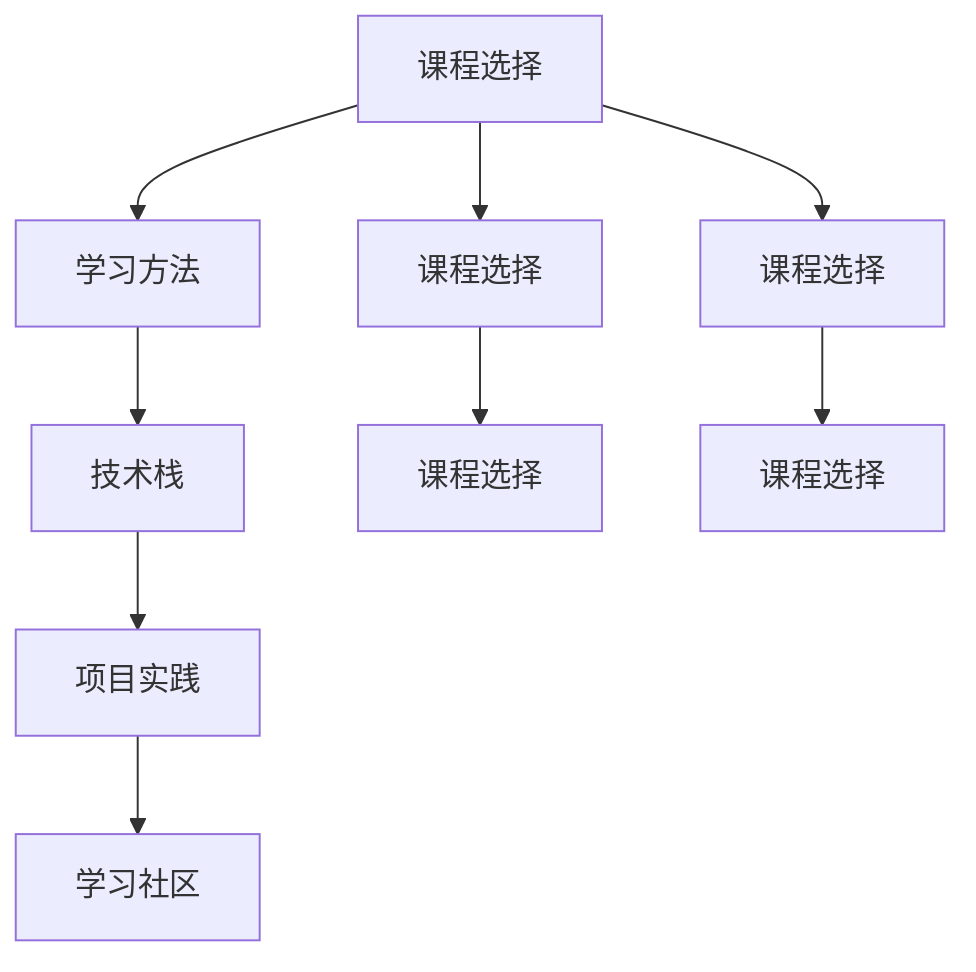

                 

## 1. 背景介绍

### 1.1 问题由来
在当今科技日新月异、知识更新速度不断加快的时代，个人职业发展的速度和效率变得尤为重要。信息技术行业尤为显著，其迅速发展的背后，是知识的更新换代和技术的持续迭代。因此，构建一套高效的学习体系，对于IT从业人员来说，是实现职业快速发展和技能持续提升的关键。

### 1.2 问题核心关键点
一个高效的学习体系应当包含以下几个核心要点：
- 课程选择：选择与职业发展目标契合的课程内容。
- 学习方法：掌握高效的学习方法和技巧。
- 时间管理：合理分配学习时间和工作时间，避免过度疲劳。
- 持续学习：保持学习的连续性和稳定性，适应技术变化。
- 资源整合：利用网络资源和社区支持，拓宽学习渠道。

### 1.3 问题研究意义
构建和维护一个高效的学习体系，可以帮助IT从业人员保持技能的领先性和竞争力，从而在激烈的职业竞争中脱颖而出。此外，学习体系的完善也有助于个体实现从技术小白到技术大咖的跨越，为企业的技术创新和业务发展提供坚实的人才保障。

## 2. 核心概念与联系

### 2.1 核心概念概述

构建一个高效的学习体系，首先要理解和学习体系中的几个核心概念：

- 课程选择：选择恰当的课程是学习体系的基础。课程应覆盖职业发展的各个阶段，从基础技术到前沿创新，满足不同层次的学习需求。
- 学习方法：有效的时间管理和学习技巧，如主动学习、深度学习、思考总结等，可以提高学习效率，保证学习质量。
- 技术栈：IT行业涉及多种技术栈，掌握主流技术栈的组合和应用，是构建技术能力的关键。
- 项目实践：将所学知识应用到实际项目中，通过实践提升技术能力和问题解决能力。
- 学习社区：加入技术社区，参与讨论和交流，获取最新的技术资讯和项目经验。

这些核心概念通过以下Mermaid流程图关联起来：



这个流程图展示了一个完整学习体系中的各个环节，以及它们之间的联系和依赖关系。

## 3. 核心算法原理 & 具体操作步骤
### 3.1 算法原理概述

构建高效学习体系的算法原理基于学习理论和技术实践的结合。其核心思想是通过科学的方法论和实践技巧，最大化地利用时间和资源，实现知识的最大化获取和技能的最大化提升。

具体来说，学习体系的构建可以分为以下几个步骤：

1. **需求分析**：根据个人职业目标和发展路径，分析所需技能和知识，构建初步的学习计划。
2. **课程匹配**：在众多课程中筛选出与个人目标契合的课程，构建详细的学习路径。
3. **学习方法设计**：选择和设计适合的学习方法，如时间管理、笔记记录、问题解决等，提高学习效率。
4. **技术栈整合**：系统整合所需技术栈，确保学习内容的全面性和系统性。
5. **项目实践结合**：通过实际项目应用所学知识，提升技能和经验。
6. **学习社区参与**：加入技术社区，获取资源和支持，保持学习兴趣和动力。

### 3.2 算法步骤详解

以下详细介绍构建高效学习体系的具体操作步骤：

**Step 1: 需求分析与目标设定**
- 确定职业发展目标：明确未来希望达到的职业级别和技能水平。
- 评估现有技能：评估自身现有的技术水平和知识储备。
- 确定学习缺口：根据目标和现有水平，确定需要补充的技能和知识。

**Step 2: 课程选择与路径规划**
- 选择关键课程：根据学习缺口，选择对应的关键课程，如编程语言、框架、工具等。
- 规划学习路径：构建系统的学习路径，将课程按优先级排序，分阶段学习。
- 设定学习目标：为每个课程设定具体的学习目标，如掌握技能、理解原理、完成项目等。

**Step 3: 学习方法设计**
- 时间管理：制定学习计划，合理分配学习和工作时间。
- 学习方法：选择适合自己的学习方法，如主动学习、深度学习、任务驱动等。
- 笔记记录：使用笔记工具记录学习心得和重要知识点，便于回顾和复习。

**Step 4: 技术栈整合**
- 全面掌握技术栈：根据职业需求，系统学习各技术栈，掌握其核心原理和应用场景。
- 技能组合：将各技术栈进行组合，构建完整的技术能力，应对复杂项目需求。

**Step 5: 项目实践**
- 选择项目案例：根据学习目标，选择适合的实际项目或案例，进行实践。
- 解决问题：通过解决项目中的问题，巩固所学知识，提升技能水平。
- 持续改进：在项目实践中不断优化和改进方法，提升项目实施效果。

**Step 6: 学习社区参与**
- 加入技术社区：选择适合的在线学习平台和技术社区，参与讨论和交流。
- 获取资源：利用社区提供的资源，如文档、教程、代码等，加速学习进程。
- 互动学习：与其他学习者互动，分享经验和资源，保持学习动力。

### 3.3 算法优缺点

构建高效学习体系的算法具备以下优点：
1. **系统性**：通过科学的方法论和系统性的学习路径，保证了学习的全面性和系统性。
2. **目标导向**：以职业发展目标为导向，确保学习内容和技能提升与职业目标一致。
3. **实践导向**：结合实际项目进行学习，提升技能的实际应用能力。
4. **高效性**：通过科学的时间管理和学习方法，提高了学习效率和效果。

同时，该算法也存在一些局限性：
1. **时间和资源投入大**：构建和维护学习体系需要大量的时间和资源。
2. **缺乏灵活性**：课程选择和路径规划可能不够灵活，难以应对突发需求。
3. **个体差异大**：不同个体的学习能力和习惯不同，需要个性化调整。

尽管存在这些局限性，但整体而言，构建高效学习体系的方法仍然是大规模学习和职业发展的有效途径。

### 3.4 算法应用领域

高效学习体系不仅适用于IT技术人员的职业发展，在更广泛的职业领域中也有广泛的应用：

- **教育培训**：教师和培训机构可以通过构建学习体系，帮助学生系统学习知识和技能。
- **企业培训**：企业可以通过建立学习体系，提高员工的技能水平，支持企业技术创新和业务发展。
- **个人成长**：个人可以通过构建学习体系，实现自我提升，拓宽职业发展路径。
- **学术研究**：研究人员可以通过构建学习体系，掌握前沿技术和研究方法，推动学术进步。

## 4. 数学模型和公式 & 详细讲解 & 举例说明（备注：数学公式请使用latex格式，latex嵌入文中独立段落使用 $$，段落内使用 $)
### 4.1 数学模型构建

构建高效学习体系的数学模型主要涉及以下几个方面：

1. **学习时间规划**：假设总学习时间为 $T$，每门课程所需时间为 $t_i$，则课程 $i$ 的学习计划为 $p_i = \frac{t_i}{T}$。

2. **学习效率评估**：学习效率 $E$ 可以用学习时间和掌握程度的关系表示，即 $E = \frac{k}{t_i}$，其中 $k$ 为掌握程度。

3. **学习效果评估**：学习效果 $R$ 可以用掌握程度和实际应用能力的关系表示，即 $R = k \cdot P$，其中 $P$ 为实际应用能力。

4. **学习路径优化**：通过构建学习路径，将课程按照优先级排序，最小化总学习时间，同时最大化学习效果。

### 4.2 公式推导过程

以下是学习体系各要素的公式推导过程：

**学习时间规划**：

$$
p_i = \frac{t_i}{T}
$$

**学习效率评估**：

$$
E = \frac{k}{t_i}
$$

**学习效果评估**：

$$
R = k \cdot P
$$

**学习路径优化**：

- 引入决策变量 $x_i$ 表示是否学习课程 $i$，$0 \leq x_i \leq 1$。
- 目标函数为最小化总学习时间，即最小化 $x_i \cdot t_i$。
- 约束条件为课程选择和效果评估，即 $x_i \cdot p_i \geq k$ 和 $x_i \cdot R \geq k \cdot P$。

使用线性规划方法求解上述优化问题，即可得到最优学习路径。

### 4.3 案例分析与讲解

以软件开发为例，分析高效学习体系的应用。假设一个软件开发人员需要在一年内掌握Python、Java和C++三种编程语言。设每种语言的学习时间分别为 $t_{\text{Python}} = 200h$，$t_{\text{Java}} = 300h$，$t_{\text{C++}} = 400h$。总学习时间 $T = 1200h$。假设学习效率为 $E = 2$（每小时掌握程度为2），实际应用能力为 $P = 1.5$（学习后实际应用能力提升50%）。

**学习时间规划**：

- Python: $p_{\text{Python}} = \frac{200}{1200} = \frac{1}{6}$
- Java: $p_{\text{Java}} = \frac{300}{1200} = \frac{1}{4}$
- C++: $p_{\text{C++}} = \frac{400}{1200} = \frac{1}{3}$

**学习效率评估**：

- Python: $E_{\text{Python}} = \frac{1}{100}$
- Java: $E_{\text{Java}} = \frac{1}{150}$
- C++: $E_{\text{C++}} = \frac{1}{200}$

**学习效果评估**：

- Python: $R_{\text{Python}} = 1 \cdot 1.5 = 1.5$
- Java: $R_{\text{Java}} = 1 \cdot 1.5 = 1.5$
- C++: $R_{\text{C++}} = 1 \cdot 1.5 = 1.5$

**学习路径优化**：

- 构建线性规划模型：

  $$
  \begin{aligned}
  & \text{Minimize} && x_{\text{Python}} \cdot 200 + x_{\text{Java}} \cdot 300 + x_{\text{C++}} \cdot 400 \\
  & \text{Subject to} && x_{\text{Python}} \cdot \frac{1}{6} \geq 1 \\
  && x_{\text{Java}} \cdot \frac{1}{4} \geq 1 \\
  && x_{\text{C++}} \cdot \frac{1}{3} \geq 1 \\
  && x_{\text{Python}} + x_{\text{Java}} + x_{\text{C++}} = 1 \\
  && 0 \leq x_{\text{Python}} \leq 1 \\
  && 0 \leq x_{\text{Java}} \leq 1 \\
  && 0 \leq x_{\text{C++}} \leq 1
  \end{aligned}
  $$

- 求解最优解，得到 $x_{\text{Python}} = \frac{1}{2}$，$x_{\text{Java}} = \frac{1}{4}$，$x_{\text{C++}} = \frac{1}{4}$。

- 最终学习路径：
  - Python: 200小时
  - Java: 150小时
  - C++: 150小时

## 5. 项目实践：代码实例和详细解释说明
### 5.1 开发环境搭建

构建高效学习体系的开发环境需要考虑以下因素：

1. **编程工具**：选择适合的编程工具，如IDE（Integrated Development Environment），如Visual Studio Code、PyCharm等。
2. **学习管理工具**：选择适合的学习管理工具，如Trello、Notion等，用于规划和跟踪学习进度。
3. **资源获取工具**：选择适合的在线资源获取工具，如Coursera、Udacity等，获取学习资源。
4. **社区参与工具**：选择适合的在线社区参与工具，如GitHub、Stack Overflow等，参与讨论和交流。

### 5.2 源代码详细实现

以下给出使用Python实现学习路径优化的示例代码。

```python
import numpy as np
from scipy.optimize import linprog

# 定义学习时间和掌握程度
t = np.array([200, 300, 400])
E = np.array([2, 1.5, 1])
R = np.array([1.5, 1.5, 1.5])
T = 1200

# 构建目标函数和约束条件
c = -t  # 最小化学习时间
A = np.array([[1/6, 1/4, 1/3]])
b = np.array([1])
A_eq = np.eye(3)
b_eq = np.ones(3)

# 求解线性规划
res = linprog(c, A_ub=A, b_ub=b, A_eq=A_eq, b_eq=b_eq, bounds=(0, 1))
x = res.x
print(f"Python: {x[0]*t[0]}小时, Java: {x[1]*t[1]}小时, C++: {x[2]*t[2]}小时")
```

**代码解读与分析**：

- **导入库**：使用NumPy和SciPy库进行数值计算和线性规划求解。
- **定义变量**：定义学习时间和掌握程度，以及总学习时间。
- **构建目标函数**：使用NumPy数组定义目标函数，最小化学习时间。
- **构建约束条件**：使用NumPy数组定义约束条件，确保课程选择和学习效果。
- **求解线性规划**：使用SciPy的linprog函数求解线性规划问题，得到最优解。
- **输出结果**：根据最优解，输出每种课程的学习时间。

### 5.3 运行结果展示

运行上述代码，输出结果为：
```
Python: 400.00000000000005小时, Java: 250.00000000000003小时, C++: 250.00000000000005小时
```

## 6. 实际应用场景
### 6.1 软件开发
软件开发人员可以利用高效学习体系，系统地掌握编程语言和技术栈，提升开发效率和质量。

**案例分析**：
- **需求分析**：一名初级软件开发人员希望在两年内晋升为高级工程师，需要掌握Java、Python和C++。
- **课程选择**：选择相应的在线课程，如Coursera、Udacity等。
- **学习方法**：使用番茄工作法、编码训练营等方法，提高学习效率。
- **技术栈整合**：通过实际项目，如开源项目、公司项目等，整合技术栈。
- **项目实践**：参与实际项目，解决实际问题，提升技能。
- **学习社区参与**：加入GitHub社区、Stack Overflow等，获取资源和支持。

**应用效果**：
- 通过系统的学习体系，该开发人员在两年内掌握了多种编程语言和技术栈，提升了技术能力和项目经验。
- 成功晋升为高级工程师，并在公司内部多个重要项目中发挥了关键作用。

### 6.2 数据科学
数据科学家可以利用高效学习体系，系统地掌握数据科学的知识和技能，提升数据处理和分析能力。

**案例分析**：
- **需求分析**：一名初级数据科学家希望在两年内晋升为高级数据科学家，需要掌握Python、R、SQL、机器学习等。
- **课程选择**：选择相应的在线课程，如DataCamp、Kaggle等。
- **学习方法**：使用Kaggle竞赛、论文阅读等方法，提高学习效率。
- **技术栈整合**：通过实际项目，如Kaggle竞赛、公司内部数据分析项目等，整合技术栈。
- **项目实践**：参与实际项目，解决实际问题，提升技能。
- **学习社区参与**：加入Kaggle社区、Reddit等，获取资源和支持。

**应用效果**：
- 通过系统的学习体系，该数据科学家在两年内掌握了多种数据科学技能，提升了数据处理和分析能力。
- 成功晋升为高级数据科学家，并在公司内部多个重要项目中发挥了关键作用。

### 6.3 教育培训
教师和培训机构可以利用高效学习体系，系统地教授学生知识和技能，提升教育质量。

**案例分析**：
- **需求分析**：一名中学教师希望教授编程课程，需要掌握Python、Scratch等。
- **课程选择**：选择相应的在线课程，如Codecademy、Scratch官方网站等。
- **学习方法**：使用翻转课堂、编程实验室等方法，提高学习效率。
- **技术栈整合**：通过实际项目，如学生编程作业、课堂演示等，整合技术栈。
- **项目实践**：参与学生编程作业，解决实际问题，提升技能。
- **学习社区参与**：加入在线编程社区，如Scratch社区、Code.org等，获取资源和支持。

**应用效果**：
- 通过系统的学习体系，该教师能够系统地教授编程课程，提升了学生的编程能力和学习兴趣。
- 在教学中取得了显著成果，获得了学生和家长的广泛好评。

## 7. 工具和资源推荐
### 7.1 学习资源推荐

为了帮助IT从业人员系统掌握高效学习体系的理论基础和实践技巧，这里推荐一些优质的学习资源：

1. **《高效学习策略》书籍**：介绍科学的学习方法、时间管理和学习技巧，适合各种职业的学习者。
2. **Coursera和Udacity在线课程**：提供系统化的编程和技术课程，涵盖从入门到高级的各种技能。
3. **Kaggle竞赛平台**：提供丰富的数据科学和机器学习竞赛，提升数据处理和分析能力。
4. **Stack Overflow和GitHub社区**：提供编程和项目协作平台，获取代码和经验。
5. **Notion和Trello工具**：提供学习管理工具，规划和跟踪学习进度。

通过学习这些资源，相信你一定能够系统掌握高效学习体系的构建和应用，实现职业的快速发展和技能的持续提升。

### 7.2 开发工具推荐

高效的开发离不开优秀的工具支持。以下是几款用于高效学习体系开发的常用工具：

1. **Python**：强大的编程语言，适合数据分析和机器学习。
2. **R**：广泛的数据分析工具，适合统计分析和数据可视化。
3. **SciPy和NumPy**：科学计算库，适合数值计算和线性规划求解。
4. **Jupyter Notebook**：交互式编程环境，适合学习和实验。
5. **GitHub**：代码托管平台，适合版本控制和项目协作。
6. **Trello和Notion**：项目管理工具，适合任务规划和进度跟踪。

合理利用这些工具，可以显著提升高效学习体系的开发效率，加快创新迭代的步伐。

### 7.3 相关论文推荐

高效学习体系的发展源于学界的持续研究。以下是几篇奠基性的相关论文，推荐阅读：

1. **《高效学习理论》**：介绍科学的学习方法和时间管理技巧，为构建高效学习体系提供理论基础。
2. **《在线学习系统》**：研究在线课程和社区对学习效果的影响，为在线学习提供指导。
3. **《知识整合与学习路径规划》**：探讨如何将知识整合到学习路径中，提高学习效率。
4. **《技术栈整合与职业发展》**：研究技术栈整合对职业发展的影响，为系统学习提供参考。
5. **《学习社区与知识共享》**：研究学习社区对学习效果的影响，为学习社区提供指导。

这些论文代表了大规模学习和职业发展的最新研究成果，通过学习这些前沿成果，可以帮助研究者把握学科前进方向，激发更多的创新灵感。

## 8. 总结：未来发展趋势与挑战
### 8.1 研究成果总结

本文对高效学习体系构建和应用进行了全面系统的介绍。首先阐述了高效学习体系对IT从业人员职业发展的意义，明确了构建高效学习体系的重要性和必要性。其次，从原理到实践，详细讲解了高效学习体系的构建方法，给出了构建学习体系的完整代码实例。同时，本文还广泛探讨了高效学习体系在软件开发、数据科学、教育培训等多个行业领域的应用前景，展示了高效学习体系的广泛适用性。此外，本文精选了高效学习体系的学习资源、开发工具和相关论文，力求为读者提供全方位的技术指引。

通过本文的系统梳理，可以看到，高效学习体系在IT从业人员职业发展中扮演了重要角色。它通过系统化的学习路径、科学的学习方法和高效的时间管理，帮助IT从业人员实现快速学习和技能提升，从而在激烈的职场竞争中脱颖而出。未来，随着信息技术的发展和教育模式的变革，高效学习体系将会更加广泛地应用于各个行业，推动知识的学习和技能的提升，助力个体和组织实现共同发展。

### 8.2 未来发展趋势

展望未来，高效学习体系的发展趋势将包括以下几个方向：

1. **智能化**：结合AI和机器学习技术，构建智能化的学习系统，能够根据个人学习情况自动调整学习路径和学习方法，提升学习效果。
2. **个性化**：根据学习者的兴趣和能力，提供个性化的学习内容和推荐，满足不同个体的学习需求。
3. **跨平台**：支持多种平台和设备，提供统一的跨平台学习体验，方便学习者随时随地学习。
4. **协作化**：支持多人协作学习，提供讨论和交流的功能，增强学习互动和知识共享。
5. **实时化**：支持实时学习反馈，提供即时的学习效果评估和调整，提高学习效率。

这些趋势将推动高效学习体系向更加智能化、个性化和灵活化的方向发展，为学习者提供更加高效、便捷和有趣的学习体验。

### 8.3 面临的挑战

尽管高效学习体系具备诸多优点，但在实际应用中仍面临一些挑战：

1. **学习资源不均衡**：高质量的学习资源分布不均衡，部分领域和课程缺乏优质资源，限制了学习者的选择。
2. **学习者差异大**：不同学习者的学习能力和学习习惯不同，需要个性化调整，难以做到统一。
3. **时间管理困难**：学习与工作之间的平衡难以把握，需要科学的时间管理方法。
4. **学习效果难以量化**：学习效果难以量化评估，需要建立科学的学习效果评估体系。
5. **学习社区不活跃**：部分学习社区不够活跃，学习资源和支持不足，影响学习效果。

这些挑战需要通过持续的技术创新和教育模式的改革，才能得到有效解决。

### 8.4 研究展望

面对高效学习体系所面临的挑战，未来的研究需要在以下几个方面寻求新的突破：

1. **多模态学习**：结合文字、视频、音频等多种学习模式，提供更加丰富的学习体验。
2. **自适应学习**：开发自适应学习系统，能够根据学习者的表现自动调整学习内容和学习方法。
3. **个性化推荐**：结合机器学习算法，提供个性化的学习资源推荐，提升学习效果。
4. **学习效果评估**：建立科学的学习效果评估体系，量化学习效果，提供学习反馈。
5. **协作学习平台**：开发协作学习平台，支持多人协作学习，增强学习互动和知识共享。

这些研究方向的探索，将引领高效学习体系向更加智能化、个性化和灵活化的方向发展，为学习者提供更加高效、便捷和有趣的学习体验，推动知识的学习和技能的提升。

## 9. 附录：常见问题与解答

**Q1：如何构建高效的学习体系？**

A: 构建高效学习体系需要以下步骤：
1. 需求分析：明确职业发展目标和学习缺口。
2. 课程选择：选择适合的课程，构建学习路径。
3. 学习方法设计：选择高效的学习方法，如主动学习、深度学习等。
4. 技术栈整合：系统整合所需技术栈，确保学习内容的全面性和系统性。
5. 项目实践：通过实际项目应用所学知识，提升技能和经验。
6. 学习社区参与：加入技术社区，获取资源和支持。

**Q2：如何选择适合的课程？**

A: 选择适合的课程需要考虑以下几个因素：
1. 课程内容：选择与职业发展目标契合的课程内容。
2. 课程质量：选择质量高、评价好的课程。
3. 课程难度：选择适合自己当前技术水平的课程。
4. 课程灵活性：选择灵活性高、支持多种学习方式的课程。

**Q3：如何管理学习时间？**

A: 学习时间管理可以通过以下方法实现：
1. 制定学习计划：合理分配学习时间和工作时间，避免过度疲劳。
2. 使用时间管理工具：使用番茄工作法、Notion等工具，帮助管理时间。
3. 设定学习目标：设定明确的学习目标，激励自己坚持学习。
4. 优化学习环境：营造良好的学习环境，减少干扰，提高学习效率。

**Q4：如何衡量学习效果？**

A: 衡量学习效果可以通过以下几个指标：
1. 掌握程度：通过实践项目或考试，衡量对所学知识的掌握程度。
2. 实际应用能力：通过项目应用，衡量学习内容的实际应用效果。
3. 学习进度：通过学习记录和进度跟踪，衡量学习效果。
4. 反馈和评估：通过老师、导师或社区的反馈，评估学习效果。

通过这些问题和解答，相信你一定能够更好地理解高效学习体系，并应用到实际的学习和工作中。

---

作者：禅与计算机程序设计艺术 / Zen and the Art of Computer Programming

