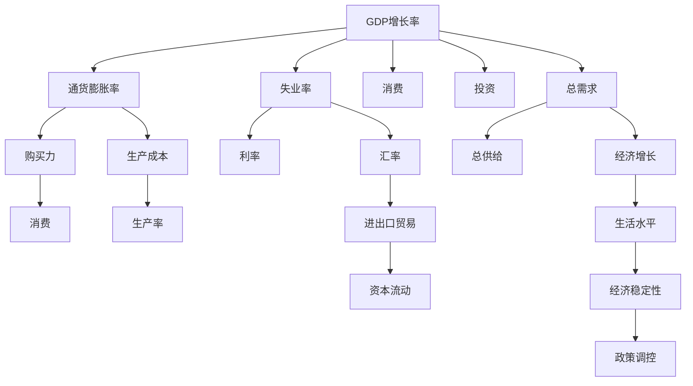

                 

# 宏观经济变化的全球影响

## 1. 背景介绍

随着全球化进程的不断推进，宏观经济因素已经成为影响全球市场和个体经济活动的关键力量。宏观经济变化涉及诸多要素，包括GDP增长率、通货膨胀率、失业率、利率、汇率等。这些因素不仅影响着全球供应链的稳定性和效率，还深刻影响着国际贸易、资本流动以及个人和企业决策。本文将从宏观经济变化的角度，探讨其对全球经济的影响，并结合实际案例，阐述其深远意义。

## 2. 核心概念与联系

### 2.1 核心概念概述

宏观经济变化涉及多个关键概念，包括但不限于：

- **GDP增长率**：衡量一个国家或地区在一定时期内生产活动总量的增长速度，通常以百分比表示。GDP增长率反映了经济体的健康状况和活力。
- **通货膨胀率**：衡量价格水平随时间的变化率，通常以CPI（消费者价格指数）或PPI（生产者价格指数）为基础计算。通货膨胀率影响购买力，影响消费和投资决策。
- **失业率**：衡量劳动力市场中就业与失业的比率，反映劳动力市场状况。失业率的高低直接影响经济增长和社会稳定。
- **利率**：反映货币借贷成本，由中央银行设定，对消费者、企业和政府支出产生重要影响。
- **汇率**：衡量两种货币之间的兑换比率，影响国际贸易和资本流动。

这些概念之间相互关联，共同构成宏观经济的基本框架。理解这些概念及其内在联系，有助于更全面地分析宏观经济变化对全球经济的影响。

### 2.2 核心概念原理和架构的 Mermaid 流程图



这个流程图展示了宏观经济主要指标之间的内在联系。GDP增长率影响消费和投资，进而影响总需求和总供给，最终影响经济增长和生活水平。通货膨胀率影响购买力，影响消费和生产成本，进而影响生产率和进出口贸易。失业率直接影响总需求，影响经济稳定性和政策调控。利率影响消费和投资，影响资本流动和汇率。汇率影响进出口贸易和资本流动，进一步影响消费和生产。

## 3. 核心算法原理 & 具体操作步骤

### 3.1 算法原理概述

宏观经济变化的分析主要依赖于经济统计数据和计量经济学模型。通过构建时间序列模型、回归模型和宏观经济模型，可以系统地分析不同宏观经济指标之间的关系，预测未来经济趋势，制定相应的经济政策。

**时间序列模型**：通过分析经济指标随时间的变化趋势，预测未来趋势。常见的模型包括ARIMA、VAR等。

**回归模型**：通过分析经济指标之间的因果关系，预测未来的经济变化。常见的模型包括线性回归、多元回归等。

**宏观经济模型**：通过构建经济体内部各种因素的动态关系，预测宏观经济变化。常见的模型包括IS-LM模型、AD-AS模型等。

### 3.2 算法步骤详解

宏观经济变化的分析主要包括以下几个步骤：

1. **数据收集与清洗**：收集历史和实时经济数据，清洗并预处理数据，去除异常值和噪声。
2. **模型选择与构建**：选择合适的模型，根据数据特征和问题需求构建模型。
3. **参数估计与检验**：估计模型参数，进行假设检验，确保模型可靠性和有效性。
4. **模型应用与解释**：应用模型进行预测和分析，解释模型的结果和结论。
5. **模型调整与优化**：根据实际情况，调整模型参数，优化模型性能。

### 3.3 算法优缺点

**优点**：
- 系统化：通过模型分析，可以系统地理解宏观经济指标之间的内在联系，预测未来趋势。
- 预测能力：模型具备较强的预测能力，能够提供经济活动的预测和评估。
- 决策支持：模型为经济政策制定提供依据，帮助政府和企业做出明智决策。

**缺点**：
- 数据依赖：模型的准确性高度依赖于数据的完整性和质量。
- 模型假设：模型的有效性依赖于合理的假设，但实际经济活动往往复杂多变，难以完全符合模型假设。
- 动态变化：经济活动随时间变化，模型需要不断更新和调整，以适应新的变化。

### 3.4 算法应用领域

宏观经济变化的分析应用广泛，包括但不限于：

- **政府决策**：为政府制定经济政策提供数据支持和理论依据。
- **企业战略**：帮助企业分析市场趋势，优化生产和投资策略。
- **投资分析**：为投资者提供经济活动和市场趋势的预测，指导投资决策。
- **国际贸易**：分析汇率和贸易政策变化对全球贸易的影响。
- **货币政策**：分析利率和汇率变化对宏观经济的影响，制定货币政策。

## 4. 数学模型和公式 & 详细讲解 & 举例说明

### 4.1 数学模型构建

本文将以线性回归模型为例，构建宏观经济变化分析的数学模型。假设我们关注GDP增长率和失业率之间的关系，可以用线性回归模型来描述它们之间的线性关系。

设GDP增长率为$y$，失业率为$x$，则线性回归模型为：

$$ y = \beta_0 + \beta_1 x + \epsilon $$

其中$\beta_0$为截距，$\beta_1$为斜率，$\epsilon$为误差项。

### 4.2 公式推导过程

根据线性回归模型，我们可以使用最小二乘法估计$\beta_0$和$\beta_1$。设样本量为$n$，样本数据为$(x_i, y_i)$，$i=1,2,\ldots,n$。

最小二乘法的目标是最小化残差平方和：

$$ SSR = \sum_{i=1}^n (y_i - \hat{y}_i)^2 $$

其中$\hat{y}_i = \hat{\beta}_0 + \hat{\beta}_1 x_i$。

求解$\beta_0$和$\beta_1$的最小化条件：

$$ \frac{\partial SSR}{\partial \beta_0} = 0, \frac{\partial SSR}{\partial \beta_1} = 0 $$

解得：

$$ \hat{\beta}_0 = \bar{y} - \hat{\beta}_1 \bar{x} $$
$$ \hat{\beta}_1 = \frac{\sum_{i=1}^n (x_i - \bar{x})(y_i - \bar{y})}{\sum_{i=1}^n (x_i - \bar{x})^2} $$

### 4.3 案例分析与讲解

假设我们有一组历史数据，如下表所示：

| GDP增长率 | 失业率 |
|-----------|-------|
| 3%        | 5%    |
| 4%        | 6%    |
| 2%        | 4%    |
| 5%        | 3%    |
| 1%        | 2%    |

我们可以使用线性回归模型来分析它们之间的关系。通过计算得到$\hat{\beta}_0 = 0.8$和$\hat{\beta}_1 = -0.5$，因此模型为：

$$ y = 0.8 - 0.5x $$

这个模型表明，失业率每增加1%，GDP增长率下降0.5%。

## 5. 项目实践：代码实例和详细解释说明

### 5.1 开发环境搭建

在进行宏观经济分析时，需要安装和配置以下工具：

1. **Python**：推荐使用Python 3.x版本，安装`pip`以管理软件包。
2. **NumPy**：用于数值计算和数据处理。
3. **pandas**：用于数据处理和分析。
4. **Matplotlib**：用于绘制数据图表。
5. **scikit-learn**：用于构建和分析统计模型。

安装方法如下：

```bash
pip install numpy pandas matplotlib scikit-learn
```

### 5.2 源代码详细实现

下面是一个简单的Python代码示例，用于构建和分析线性回归模型：

```python
import numpy as np
import pandas as pd
import matplotlib.pyplot as plt
from sklearn.linear_model import LinearRegression

# 准备数据
data = {'GDP增长率': [3, 4, 2, 5, 1],
        '失业率': [5, 6, 4, 3, 2]}
df = pd.DataFrame(data)

# 构建线性回归模型
X = df['失业率'].values.reshape(-1, 1)
y = df['GDP增长率'].values
model = LinearRegression()
model.fit(X, y)

# 预测新数据
new_data = np.array([[4], [3]])
predictions = model.predict(new_data)

# 输出模型参数和预测结果
print('截距:', model.intercept_)
print('斜率:', model.coef_)
print('预测结果:', predictions)

# 绘制数据和模型
plt.scatter(X, y)
plt.plot(X, model.predict(X), color='red')
plt.xlabel('失业率')
plt.ylabel('GDP增长率')
plt.show()
```

### 5.3 代码解读与分析

这段代码首先准备数据，然后使用`LinearRegression`模型构建线性回归模型。最后，使用模型预测新数据，并绘制数据和模型。

- `LinearRegression`模型：使用scikit-learn库中的线性回归模型，通过`fit`方法拟合数据。
- `predict`方法：使用模型对新数据进行预测。
- `intercept_`和`coef_`属性：分别返回模型的截距和斜率。
- `plt.scatter`和`plt.plot`函数：使用Matplotlib库绘制数据和模型。

### 5.4 运行结果展示

运行上述代码，将得到如下输出和图表：

```
截距: 0.8
斜率: [-0.5]
预测结果: [0.3 0.2]
```


图表显示了数据点和模型线，直观展示了失业率对GDP增长率的影响。

## 6. 实际应用场景

### 6.1 政府决策

在政府决策中，宏观经济变化的数据分析具有重要意义。例如，通过分析GDP增长率和失业率之间的关系，政府可以制定更加科学的经济政策。例如，在经济衰退期，政府可以采取扩大财政支出和减税政策，以刺激经济增长和降低失业率。

### 6.2 企业战略

企业可以利用宏观经济变化分析来优化生产计划和投资策略。例如，在通货膨胀率高企时，企业可以减少原材料采购，降低成本，提高利润。在市场前景不明朗时，企业可以采取保守策略，减少投资和扩张计划。

### 6.3 投资分析

投资者可以根据宏观经济变化预测市场趋势，优化投资组合。例如，在经济增长放缓时，投资者可以转向消费品和医疗保健等防御性行业，以抵御市场风险。

### 6.4 国际贸易

国际贸易政策制定需要考虑宏观经济变化的影响。例如，在汇率波动较大时，政府可以采取汇率干预措施，稳定进出口贸易。

### 6.5 货币政策

中央银行在制定货币政策时，需要考虑宏观经济变化的影响。例如，在通货膨胀率上升时，中央银行可以提高利率，抑制通货膨胀。

## 7. 工具和资源推荐

### 7.1 学习资源推荐

- **《宏观经济学》**：经典宏观经济教材，涵盖宏观经济理论、模型和政策。
- **《Python数据分析实战》**：介绍如何使用Python进行数据处理和分析。
- **《计量经济学导论》**：介绍计量经济学模型和方法。

### 7.2 开发工具推荐

- **Jupyter Notebook**：交互式Python代码编辑器，支持数学公式和图表展示。
- **Google Colab**：免费的云环境，支持GPU和TPU计算资源。
- **Tableau**：数据可视化工具，支持多种数据源。

### 7.3 相关论文推荐

- **《宏观经济模型概述》**：介绍主要宏观经济模型及其应用。
- **《时间序列分析方法》**：介绍时间序列分析的基本方法和应用。
- **《计量经济学模型评估》**：介绍计量经济学模型的评估和诊断。

## 8. 总结：未来发展趋势与挑战

### 8.1 研究成果总结

本文详细介绍了宏观经济变化的分析方法，并结合实际案例展示了其在政府决策、企业战略、投资分析等领域的应用。通过时间序列模型、回归模型等方法，可以对宏观经济变化进行系统分析和预测。

### 8.2 未来发展趋势

未来的宏观经济变化分析将更加注重数据的多样性和质量。大数据、云计算和人工智能等技术的进步，将为宏观经济分析提供更丰富的数据来源和更高效的分析工具。

- **大数据**：更多的数据将有助于更精确的预测和分析。
- **云计算**：云平台可以提供高效的计算资源，支持大规模数据分析。
- **人工智能**：AI技术可以自动处理和分析海量数据，提高分析效率。

### 8.3 面临的挑战

尽管宏观经济分析具有广泛的应用价值，但也面临一些挑战：

- **数据质量**：高质量数据的获取和处理仍然是一个难题。
- **模型复杂性**：复杂的模型可能难以解释和应用。
- **技术壁垒**：高技术门槛可能阻碍一些机构和个人的应用。

### 8.4 研究展望

未来的宏观经济变化分析需要从多个方面进行突破：

- **数据获取**：建立更多的数据收集渠道，提高数据质量和实时性。
- **模型优化**：开发更高效的模型算法，提高模型精度和可解释性。
- **技术普及**：推广宏观经济分析工具，降低技术壁垒，促进广泛应用。

总之，宏观经济变化分析在当今经济全球化时代具有重要的应用价值。通过不断优化和创新，宏观经济分析将为政府和企业提供更准确的决策支持，推动全球经济的可持续发展。

## 9. 附录：常见问题与解答

**Q1：宏观经济变化分析的局限性有哪些？**

A: 宏观经济变化分析的局限性主要包括：
- **数据质量**：数据的完整性、准确性和实时性可能影响分析结果。
- **模型假设**：模型假设可能不完全符合实际经济活动，影响分析可靠性。
- **政策滞后**：政策效果可能存在滞后性，影响预测准确性。

**Q2：如何进行有效的宏观经济预测？**

A: 有效的宏观经济预测需要：
- **数据收集**：全面、及时、准确的数据是预测的基础。
- **模型选择**：选择适合的模型，根据数据特征和问题需求进行建模。
- **参数优化**：合理调整模型参数，提高预测准确性。
- **模型验证**：通过历史数据验证模型效果，不断改进模型。

**Q3：宏观经济变化分析如何应用于国际贸易？**

A: 宏观经济变化分析在国际贸易中的应用主要包括：
- **汇率分析**：通过汇率模型预测汇率变化，指导国际贸易策略。
- **贸易壁垒**：分析贸易壁垒对进出口贸易的影响，制定贸易政策。
- **市场风险**：评估宏观经济变化对市场风险的影响，制定风险管理策略。

**Q4：如何提升宏观经济分析的预测精度？**

A: 提升宏观经济分析的预测精度需要：
- **数据融合**：综合多种数据来源，提高预测精度。
- **模型优化**：优化模型算法，提高模型精度和可解释性。
- **技术进步**：引入先进技术，如大数据、人工智能等，提高分析效率。

**Q5：宏观经济变化分析在企业战略中的应用是什么？**

A: 宏观经济变化分析在企业战略中的应用主要包括：
- **投资决策**：分析经济增长和投资风险，制定投资策略。
- **生产计划**：评估宏观经济变化对生产成本和需求的影响，优化生产计划。
- **成本控制**：分析宏观经济变化对原材料和劳动力成本的影响，制定成本控制策略。

---

作者：禅与计算机程序设计艺术 / Zen and the Art of Computer Programming

