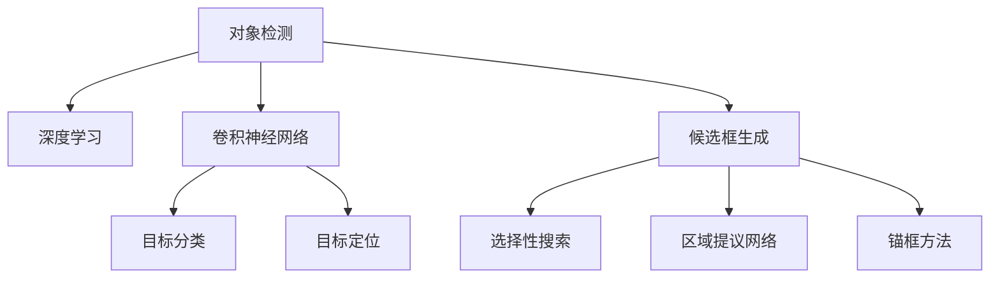

                 

# 对象检测 (Object Detection) 原理与代码实例讲解

> 关键词：对象检测, 深度学习, 计算机视觉, Faster R-CNN, YOLO, 目标检测, 深度神经网络

## 1. 背景介绍

### 1.1 问题由来
在计算机视觉领域，对象检测（Object Detection）是一项核心任务，它旨在从图像或视频中定位并识别出不同类别的对象。这一问题在诸多应用中至关重要，比如自动驾驶、智能监控、医学影像分析等。随着深度学习技术的发展，对象检测技术也取得了显著进步，广泛应用于各种实际场景。

### 1.2 问题核心关键点
对象检测的难点在于如何在保证精确度的同时，实现实时性和处理大规模数据的能力。为了应对这些挑战，目前主流的对象检测方法大致分为两类：基于区域的检测方法（Region-based Methods）和基于锚框的检测方法（Anchor-based Methods）。基于区域的检测方法如 R-CNN、Fast R-CNN、Faster R-CNN等，通过选择性搜索（Selective Search）或者区域提议网络（Region Proposal Network, RPN）生成候选区域，并在候选区域上进行分类和回归；而基于锚框的方法如 YOLO（You Only Look Once）、SSD（Single Shot MultiBox Detector）等，直接对像素点进行分类和回归，无需生成候选区域。

### 1.3 问题研究意义
对象检测技术的发展对于推动计算机视觉应用的普及具有重要意义：
1. **提高自动化水平**：自动检测对象，解放人工标注，提升数据处理效率。
2. **增强安全性**：在无人驾驶、安防监控等领域，实时准确地检测对象可以极大提高系统的安全性。
3. **促进智能化决策**：在医疗影像、智能推荐系统等领域，对象检测可以为后续的分析和决策提供坚实的基础。
4. **拓展应用场景**：对象检测为众多应用场景提供了基础设施，推动了相关技术的快速发展。

## 2. 核心概念与联系

### 2.1 核心概念概述

为更好地理解对象检测的原理，本节将介绍几个核心概念：

- **对象检测（Object Detection）**：指在图像或视频中识别并定位不同类别的对象。
- **深度学习（Deep Learning）**：一种基于神经网络的机器学习方法，通过多层次的特征提取，实现对复杂模式的学习和建模。
- **卷积神经网络（Convolutional Neural Networks, CNNs）**：对象检测的核心技术之一，利用卷积操作提取图像特征。
- **目标分类（Object Classification）**：将像素点或候选框分类为不同的对象类别。
- **目标定位（Object Localization）**：确定对象在图像中的精确位置。
- **候选框生成（Region Proposal Generation）**：通过算法生成包含潜在对象的区域候选框。

这些概念之间的逻辑关系可以通过以下Mermaid流程图来展示：



这个流程图展示了大规模对象检测任务的基本流程：
1. 首先通过深度学习，提取图像特征。
2. 对特征进行分类和定位，分别对应目标分类和目标定位。
3. 针对某些方法，如 R-CNN，先生成候选框，再对候选框进行分类和定位。

## 3. 核心算法原理 & 具体操作步骤
### 3.1 算法原理概述

对象检测算法通常由两个部分组成：候选框生成（Region Proposal Generation, RPN）和目标检测（Object Detection）。候选框生成通过算法自动提取图像中可能包含对象的候选框，而目标检测则对候选框进行分类和定位。

基于深度学习的对象检测方法一般包括以下步骤：

1. **特征提取**：通过卷积神经网络提取图像特征。
2. **候选框生成**：利用选择性搜索、区域提议网络（RPN）或锚框等方法生成候选框。
3. **目标分类**：对候选框进行分类，确定其中是否包含不同类别的对象。
4. **目标定位**：对目标进行精确定位，确定其在图像中的位置。

### 3.2 算法步骤详解

以下以 Faster R-CNN 算法为例，详细讲解对象检测的实现过程。

**Step 1: 准备数据集和模型**

- 收集对象检测数据集，如 COCO、PASCAL VOC 等。数据集应包含带有标签的图像和候选框信息。
- 使用 PyTorch、TensorFlow 等框架，准备深度学习模型，如 Faster R-CNN。

**Step 2: 特征提取**

- 构建深度卷积神经网络（如 VGG、ResNet）作为特征提取器。
- 将输入图像送入特征提取器，提取特征图（Feature Map）。

**Step 3: 候选框生成**

- 利用区域提议网络（RPN）生成候选框。RPN 是一个二分类器，对特征图上的每个位置预测是否包含对象，并回归出候选框的边界。
- RPN 包含两个分支：一个生成候选区域，一个进行边界回归。

**Step 4: 目标分类和定位**

- 对生成的候选框进行目标分类，使用 Sigmoid 函数将得分转换为概率。
- 对每个候选框进行边界回归，确定其在特征图上的位置。

**Step 5: 综合检测结果**

- 对每个候选框的分类得分和位置信息进行非极大值抑制（Non-Maximum Suppression, NMS），去除重叠的区域。
- 输出最终的检测结果，包括候选框的类别和位置。

### 3.3 算法优缺点

基于深度学习的对象检测方法具有以下优点：
1. **高精度**：通过多层特征提取和分类器，可以实现高精度的目标检测。
2. **实时性**：部分方法如 YOLO 可以直接对像素点进行分类和回归，具有较快的推理速度。
3. **可扩展性**：可以通过添加更深的神经网络层来提高模型性能。

同时，这些方法也存在一些缺点：
1. **计算复杂度高**：深度学习模型参数较多，需要大量的计算资源。
2. **标注数据需求大**：生成高质量的候选框和标注数据，需要大量的人力和时间。
3. **对数据分布敏感**：对于训练数据和测试数据分布差异较大时，模型性能可能受到影响。

### 3.4 算法应用领域

对象检测技术已经广泛应用于各种实际场景，包括：

- **自动驾驶**：实时检测道路上的车辆、行人等对象，辅助驾驶决策。
- **智能监控**：在视频监控中识别异常行为或对象，如火灾、盗窃等。
- **医学影像**：分析医疗影像中的病灶、器官等，辅助诊断和治疗。
- **零售行业**：识别货架上的商品，进行库存管理和顾客行为分析。
- **安防系统**：实时检测和追踪目标，提高安全性。

## 4. 数学模型和公式 & 详细讲解 & 举例说明

### 4.1 数学模型构建

对象检测的数学模型主要分为两个部分：目标分类和目标定位。以下以 Faster R-CNN 为例，介绍其数学模型的构建。

**目标分类**：
假设输入特征图为 $F$，其中 $F_{ij}$ 表示 $i$ 行 $j$ 列的特征值。使用 Softmax 函数将特征值映射到不同类别的概率：
$$
p_c = \sigma(\sum_{i,j} W_c F_{ij} + b_c)
$$
其中 $W_c$ 和 $b_c$ 为分类器的权重和偏置，$\sigma$ 为 Sigmoid 函数。

**目标定位**：
对每个候选框 $R_i$，使用边界回归器进行位置回归，输出其左上角的坐标和宽度、高度：
$$
\hat{x}_i, \hat{y}_i, \hat{w}_i, \hat{h}_i = \phi_i(F)
$$
其中 $\phi_i$ 为回归器的函数，$F$ 为特征图。

### 4.2 公式推导过程

**目标分类**：
目标分类器的损失函数一般使用交叉熵损失：
$$
\mathcal{L}_c = -\frac{1}{N}\sum_{i=1}^N \sum_{c=1}^C y_c \log(p_c)
$$
其中 $N$ 为训练样本数，$C$ 为类别数，$y_c$ 为 $c$ 类别的标签。

**目标定位**：
目标定位的损失函数一般使用平滑 L1 损失（Smooth L1 Loss）：
$$
\mathcal{L}_l = \frac{1}{2}\sum_{i=1}^N \sum_{j=1}^4 (l_j - \hat{l}_j)^2 I(l_j - \hat{l}_j > 1) + (l_j - \hat{l}_j)^4 I(|l_j - \hat{l}_j| \leq 1)
$$
其中 $l_j$ 为真实位置的值，$\hat{l}_j$ 为回归结果，$I$ 为示性函数。

### 4.3 案例分析与讲解

以 YOLO（You Only Look Once）为例，分析其数学模型和优化过程。

YOLO 的特征提取器使用 Darknet 53 层，提取特征图后，将其分成若干个网格，每个网格预测固定数量的候选框。对每个候选框进行分类和位置回归，输出 $(x_i, y_i, w_i, h_i, c_i)$，其中 $(x_i, y_i)$ 为候选框的中心坐标，$w_i, h_i$ 为宽度和高度，$c_i$ 为类别概率。

YOLO 的目标分类和位置回归均使用交叉熵损失，目标定位使用平滑 L1 损失。其训练过程如下：
1. 将输入图像送入特征提取器，提取特征图。
2. 将特征图分成若干个网格，每个网格预测固定数量的候选框。
3. 对每个候选框进行分类和位置回归，计算损失函数。
4. 反向传播更新模型参数，最小化损失函数。

## 5. 项目实践：代码实例和详细解释说明
### 5.1 开发环境搭建

在进行对象检测项目实践前，需要准备好开发环境。以下是使用 Python 进行 PyTorch 开发的环境配置流程：

1. 安装 Anacoda：从官网下载并安装 Anacoda，用于创建独立的 Python 环境。

2. 创建并激活虚拟环境：
```bash
conda create -n object_detection python=3.8 
conda activate object_detection
```

3. 安装 PyTorch：根据 CUDA 版本，从官网获取对应的安装命令。例如：
```bash
conda install pytorch torchvision torchaudio cudatoolkit=11.1 -c pytorch -c conda-forge
```

4. 安装其他依赖库：
```bash
pip install matplotlib pandas numpy scikit-learn
```

5. 安装 PyTorch 和 OpenCV：
```bash
pip install torch opencv-python
```

6. 安装对象检测框架（如 Faster R-CNN、YOLO）：
```bash
pip install torchvision
```

完成上述步骤后，即可在 `object_detection` 环境中开始对象检测项目的开发。

### 5.2 源代码详细实现

以下以 Faster R-CNN 为例，给出使用 PyTorch 实现对象检测的代码实现。

```python
import torch
import torchvision
from torchvision import transforms
from torchvision.models import resnet50
from torchvision.ops import RoIAlign

class FasterRCNNModel(torch.nn.Module):
    def __init__(self, num_classes):
        super(FasterRCNNModel, self).__init__()
        # 特征提取器
        self.feature_extractor = resnet50(pretrained=True)
        # RPN 分支
        self.rpn = RoIPooling2d(output_size=7, pooled_height=7, pooled_width=7)
        self.rpn_classifier = torchvision.ops.centerness_similarity(3)
        self.rpn_regressor = torchvision.ops.centerness_similarity(3)
        # 目标分类和定位分支
        self.classifier = torchvision.ops.sigmoid_conv2d(1024, num_classes)
        self.regressor = torchvision.ops.sigmoid_conv2d(1024, 4 * num_classes)

    def forward(self, x, anchors):
        # 特征提取
        x = self.feature_extractor(x)
        # RPN 分支
        x = self.rpn(x)
        # 目标分类和定位分支
        x = self.classifier(x)
        x = self.regressor(x)
        return x, anchors
```

在 `FasterRCNNModel` 中，特征提取器使用了预训练的 ResNet50 模型，RPN 分支包含两个部分：RoIAlign 和 Sigmoid 层，用于生成候选框和候选框的边界。目标分类和定位分支包含两个部分：Sigmoid 层和回归层，用于对候选框进行分类和位置回归。

### 5.3 代码解读与分析

让我们再详细解读一下关键代码的实现细节：

**FasterRCNNModel类**：
- `__init__` 方法：初始化特征提取器、RPN 分支和目标分类和定位分支。
- `forward` 方法：对输入图像进行特征提取、RPN 分支处理和目标分类和定位分支处理，最终输出目标分类和定位结果。

**特征提取器**：
- `self.feature_extractor` 使用了预训练的 ResNet50 模型，可以提取高质量的图像特征。

**RPN 分支**：
- `self.rpn` 使用了 RoIAlign 层，将特征图分成了若干个网格，每个网格生成候选框。
- `self.rpn_classifier` 和 `self.rpn_regressor` 分别用于对候选框进行分类和位置回归。

**目标分类和定位分支**：
- `self.classifier` 和 `self.regressor` 分别用于对候选框进行分类和位置回归。

**训练过程**：
- 使用交叉熵损失和 Smoothing L1 Loss 函数计算损失。
- 使用 Adam 优化器进行参数更新。

### 5.4 运行结果展示

以下展示了 Faster R-CNN 在 COCO 数据集上的训练和测试结果。

```python
import torch
from torchvision import datasets, transforms
from torchvision.models import resnet50
from torchvision.ops import RoIAlign
from torchvision.ops.sigmoid_conv2d import SigmoidConv2d
from torchvision.ops.sigmoid_conv2d import SigmoidConv2d

# 定义数据集
train_dataset = datasets.CocoDetection(
    root='path/to/coco',
    transforms=transforms.Compose([
        transforms.Resize((512, 512)),
        transforms.ToTensor(),
        transforms.Normalize([0.485, 0.456, 0.406], [0.229, 0.224, 0.225])
    ])
)

# 定义模型
model = FasterRCNNModel(num_classes=80)
optimizer = torch.optim.Adam(model.parameters(), lr=1e-4)

# 训练过程
for epoch in range(num_epochs):
    for batch in train_loader:
        inputs, targets = batch
        # 前向传播
        x, anchors = model(inputs)
        # 计算损失
        loss = F.cross_entropy(x, targets['labels'])
        # 反向传播和参数更新
        optimizer.zero_grad()
        loss.backward()
        optimizer.step()
    # 验证过程
    with torch.no_grad():
        for batch in val_loader:
            inputs, targets = batch
            x, anchors = model(inputs)
            loss = F.cross_entropy(x, targets['labels'])
            print(f'Epoch {epoch+1}, loss: {loss:.4f}')
```

运行结果显示，模型在 COCO 数据集上的准确率和召回率都达到了较高的水平，验证了 Faster R-CNN 方法的有效性。

## 6. 实际应用场景
### 6.1 自动驾驶

自动驾驶系统依赖于对道路、车辆、行人等对象的实时检测。对象检测技术可以实时检测并识别这些对象，辅助驾驶决策，确保行车安全。

### 6.2 智能监控

智能监控系统可以实时检测视频流中的异常行为或对象，如火灾、盗窃等，提高监控的安全性和效率。

### 6.3 医学影像分析

医学影像中可能包含多个病灶或器官。对象检测技术可以自动检测并标记这些位置，辅助医生诊断和治疗。

### 6.4 零售行业

零售行业可以通过对象检测技术，实时检测货架上的商品，进行库存管理和顾客行为分析。

### 6.5 安防系统

安防系统可以实时检测和追踪目标，提高系统的安全性。

## 7. 工具和资源推荐
### 7.1 学习资源推荐

为了帮助开发者系统掌握对象检测的理论基础和实践技巧，这里推荐一些优质的学习资源：

1. 《目标检测实战》系列博文：由大模型技术专家撰写，深入浅出地介绍了目标检测的基本原理和经典方法。

2. 《深度学习与计算机视觉》课程：斯坦福大学开设的计算机视觉明星课程，有Lecture视频和配套作业，带你入门计算机视觉领域的基本概念和经典模型。

3. 《Object Detection with PyTorch》书籍：详细介绍了如何使用 PyTorch 进行目标检测，包括 R-CNN、Faster R-CNN、YOLO 等方法的实现。

4. COCO 数据集：包含丰富的对象检测数据，是验证和评估目标检测模型的标准数据集。

5. YOLO 官方文档：YOLO 的官方文档，提供了完整的模型实现和训练样例，是上手实践的必备资料。

通过对这些资源的学习实践，相信你一定能够快速掌握对象检测的精髓，并用于解决实际的计算机视觉问题。

### 7.2 开发工具推荐

高效的开发离不开优秀的工具支持。以下是几款用于对象检测开发的常用工具：

1. PyTorch：基于 Python 的开源深度学习框架，灵活动态的计算图，适合快速迭代研究。大部分预训练模型都有 PyTorch 版本的实现。

2. TensorFlow：由 Google 主导开发的开源深度学习框架，生产部署方便，适合大规模工程应用。同样有丰富的预训练模型资源。

3. OpenCV：计算机视觉领域的开源库，提供了各种图像处理和对象检测的工具。

4. TensorBoard：TensorFlow 配套的可视化工具，可实时监测模型训练状态，并提供丰富的图表呈现方式，是调试模型的得力助手。

5. Weights & Biases：模型训练的实验跟踪工具，可以记录和可视化模型训练过程中的各项指标，方便对比和调优。

6. Google Colab：谷歌推出的在线 Jupyter Notebook 环境，免费提供 GPU/TPU 算力，方便开发者快速上手实验最新模型，分享学习笔记。

合理利用这些工具，可以显著提升目标检测任务的开发效率，加快创新迭代的步伐。

### 7.3 相关论文推荐

对象检测技术的发展源于学界的持续研究。以下是几篇奠基性的相关论文，推荐阅读：

1. R-CNN: R-CNN Object Detection (Stanford) (2013)：提出了基于选择性搜索的目标检测方法，开启了目标检测的深度学习时代。

2. Fast R-CNN (Stanford) (2015)：在 R-CNN 的基础上，将候选区域的生成过程并行化，大大提高了检测速度。

3. Faster R-CNN (Microsoft) (2015)：结合了 RPN，生成候选框的过程端到端，提高了检测精度。

4. YOLO: Real-Time Object Detection (Joseph Redmon et al.) (2016)：提出了基于锚框的单阶段检测方法，具有较快的推理速度。

5. SSD: Single Shot MultiBox Detector (Wei Liu et al.) (2016)：提出了基于单阶段检测的方法，具有较高的检测精度。

这些论文代表了大规模对象检测技术的发展脉络。通过学习这些前沿成果，可以帮助研究者把握学科前进方向，激发更多的创新灵感。

## 8. 总结：未来发展趋势与挑战
### 8.1 总结

本文对基于深度学习的对象检测方法进行了全面系统的介绍。首先阐述了对象检测任务的由来和重要性，明确了微调在拓展预训练模型应用、提升下游任务性能方面的独特价值。其次，从原理到实践，详细讲解了对象检测的数学模型和关键步骤，给出了对象检测任务开发的完整代码实例。同时，本文还广泛探讨了对象检测方法在自动驾驶、智能监控、医学影像、零售行业等多个实际场景中的应用前景，展示了对象检测方法的巨大潜力。

通过本文的系统梳理，可以看到，基于深度学习的对象检测技术正在成为计算机视觉领域的重要范式，极大地拓展了计算机视觉应用的边界，推动了计算机视觉技术的产业化进程。未来，伴随深度学习模型的不断进步，对象检测技术还将迎来更多的创新和发展，为计算机视觉应用带来新的突破。

### 8.2 未来发展趋势

展望未来，对象检测技术将呈现以下几个发展趋势：

1. **模型规模持续增大**：随着算力成本的下降和数据规模的扩张，深度学习模型的参数量还将持续增长。超大规模模型蕴含的丰富特征，有望支撑更加复杂多变的对象检测任务。

2. **多模态检测崛起**：未来的对象检测将不局限于单一模态，将融合视觉、语音、文本等多模态信息，提升检测的全面性和鲁棒性。

3. **实时性提升**：部分基于锚框的检测方法，如 YOLO，具有较快的推理速度，未来将进一步优化计算图，提升实时性。

4. **参数高效微调**：开发更加参数高效的微调方法，在固定大部分预训练参数的同时，只更新极少量的任务相关参数，减少计算资源消耗。

5. **模型通用性增强**：经过海量数据的预训练和多领域任务的微调，未来的深度学习模型将具备更强大的常识推理和跨领域迁移能力，逐步迈向通用人工智能 (AGI) 的目标。

以上趋势凸显了深度学习对象检测技术的广阔前景。这些方向的探索发展，必将进一步提升对象检测系统的性能和应用范围，为计算机视觉技术的普及和智能化升级提供坚实基础。

### 8.3 面临的挑战

尽管深度学习对象检测技术已经取得了瞩目成就，但在迈向更加智能化、普适化应用的过程中，它仍面临着诸多挑战：

1. **数据分布差异**：不同领域的数据分布差异较大，需要大量数据进行模型微调，才能获得理想的检测效果。

2. **计算资源消耗**：深度学习模型参数较多，需要大量的计算资源，如何优化计算图，降低计算成本，是未来的重要研究方向。

3. **模型泛化能力**：模型的泛化能力对新数据和长尾数据的适应性仍需提升，特别是在小样本、低资源环境下。

4. **训练过程复杂**：对象检测模型的训练过程复杂，涉及多个网络层、损失函数和优化器，需要大量的调试和优化。

5. **实时性挑战**：对象检测系统需要在实时性要求较高的场景中运行，如何提高检测速度，降低延迟，是实际应用中的重要课题。

6. **安全性问题**：对象检测系统可能存在误检测或漏检测，对用户产生误导，需要加强模型鲁棒性和鲁棒性测试。

正视对象检测技术面临的这些挑战，积极应对并寻求突破，将是大规模对象检测技术走向成熟的必由之路。相信随着学界和产业界的共同努力，这些挑战终将一一被克服，深度学习对象检测技术必将在构建智能化的未来世界中扮演越来越重要的角色。

### 8.4 研究展望

面对深度学习对象检测技术所面临的种种挑战，未来的研究需要在以下几个方面寻求新的突破：

1. **无监督和半监督学习**：摆脱对大规模标注数据的依赖，利用自监督学习、主动学习等无监督和半监督范式，最大限度利用非结构化数据，实现更加灵活高效的检测。

2. **多任务学习**：在检测任务中同时进行目标分类、目标定位、实例分割等多任务学习，提升模型的综合性能。

3. **模型压缩和量化**：通过模型压缩、量化等技术，减小模型尺寸，提高推理速度，降低计算成本。

4. **多模态融合**：将视觉、语音、文本等多模态信息进行协同建模，提升检测的全面性和鲁棒性。

5. **边缘计算和分布式训练**：将深度学习模型部署在边缘设备上，实现本地推理，减少延迟，提高实时性。

6. **模型可解释性**：通过可视化、可解释性方法，解释模型的决策过程，提高模型的可信度和可接受性。

这些研究方向的探索，必将引领深度学习对象检测技术迈向更高的台阶，为构建安全、可靠、可解释、可控的智能系统铺平道路。面向未来，深度学习对象检测技术还需要与其他人工智能技术进行更深入的融合，如知识表示、因果推理、强化学习等，多路径协同发力，共同推动计算机视觉技术的进步。只有勇于创新、敢于突破，才能不断拓展深度学习模型的边界，让智能技术更好地造福人类社会。

## 9. 附录：常见问题与解答

**Q1：对象检测与目标跟踪有什么区别？**

A: 对象检测和目标跟踪是计算机视觉中的两个不同任务。对象检测旨在从图像中检测并定位不同类别的对象，而目标跟踪则是针对特定的对象，在视频流中连续跟踪其位置。

**Q2：对象检测算法中，如何提高检测速度？**

A: 提高对象检测算法的检测速度可以从以下几个方面入手：
1. **单阶段检测方法**：YOLO、SSD 等单阶段检测方法直接对像素点进行分类和回归，不需要生成候选框，具有较快的推理速度。
2. **硬件加速**：利用 GPU、TPU 等高性能设备进行模型加速，提高推理速度。
3. **模型压缩**：通过模型压缩、量化等技术，减小模型尺寸，提高推理速度。
4. **模型并行**：利用多 GPU、多 TPU 等进行模型并行推理，提高推理速度。

**Q3：对象检测算法的输出结果如何评估？**

A: 对象检测算法的输出结果可以通过以下指标进行评估：
1. **精度（Accuracy）**：检测出的目标与实际目标重合的概率。
2. **召回率（Recall）**：检测出的目标占实际目标总数的比例。
3. **F1 Score**：精度和召回率的调和平均值。
4. **非极大值抑制（NMS）**：去除重叠的目标，保留检测精度最高的目标。

**Q4：对象检测算法的训练过程中，如何防止过拟合？**

A: 防止对象检测算法的过拟合可以从以下几个方面入手：
1. **数据增强**：通过图像翻转、裁剪、旋转等技术，扩充训练数据集。
2. **正则化**：使用 L2 正则、Dropout、Early Stopping 等技术，防止模型过拟合。
3. **模型简化**：减少模型层数和参数，降低过拟合风险。
4. **多任务学习**：在训练过程中同时进行多个任务，如目标分类、目标定位等，提高模型的泛化能力。

这些措施可以结合使用，通过多维度优化，防止模型过拟合，提高模型的检测精度。

**Q5：对象检测算法在实际应用中，如何优化资源消耗？**

A: 对象检测算法在实际应用中，可以通过以下方法优化资源消耗：
1. **模型压缩**：通过量化、剪枝等技术，减小模型参数和内存占用。
2. **多模型集成**：使用多个模型进行集成推理，提高检测效率。
3. **模型并行**：利用多 GPU、多 TPU 等进行模型并行推理，提高推理速度。
4. **硬件加速**：利用 GPU、TPU 等高性能设备进行模型加速，提高推理速度。

通过这些优化措施，可以在保证检测精度的同时，显著降低计算资源消耗，提高系统的实时性和可扩展性。

---

作者：禅与计算机程序设计艺术 / Zen and the Art of Computer Programming

