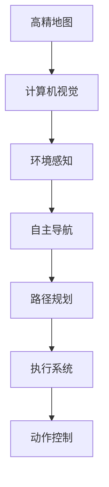

                 

# 小米汽车的端到端泊车系统

## 1. 背景介绍

### 1.1 问题由来

随着电动汽车市场的迅猛发展，智能泊车功能已成为现代汽车的核心竞争力之一。而端到端(End-to-End)泊车系统，则是在车主无感状态下，利用高精地图和传感器数据，自动完成寻找停车位、自动泊入等全程无人干预的操作。小米汽车正大力推进自主研发，着力打造世界级智能泊车解决方案，以赋能车主智能驾驶体验。

### 1.2 问题核心关键点

小米汽车端到端泊车系统包含三大核心模块：高精地图数据处理、感知与决策控制、执行系统。其中，感知与决策控制是整个系统的核心，通过环境感知和动态决策，将泊车任务分解为自主导航、路径规划、停车入库等子任务，并控制执行系统协同执行。本文将重点介绍该系统的核心算法原理与具体操作步骤。

### 1.3 问题研究意义

深度学习和计算机视觉技术在自动驾驶和智能泊车中得到了广泛应用，推动了智能汽车的发展进程。小米汽车的端到端泊车系统将充分运用计算机视觉、深度学习、自主导航、路径规划等前沿技术，大幅提升泊车体验，助力汽车产业智能化升级。

## 2. 核心概念与联系

### 2.1 核心概念概述

为更好地理解小米汽车端到端泊车系统的核心算法与架构，本节将介绍几个关键概念及其之间的关系：

- **端到端泊车系统**：基于高精地图和传感器数据，从感知输入到执行输出的一体化解决方案。通过多模态数据融合，实现环境理解、路径规划、动作控制等功能，使泊车过程全程自动化。

- **高精地图**：利用激光雷达、摄像头等传感器，对周围环境进行高精度测量，生成精确的地图数据。是自动泊车系统环境理解的基础。

- **计算机视觉**：通过摄像头采集图像信息，利用深度学习模型进行物体识别、语义分割、行为预测等处理，实现环境感知。

- **自主导航**：利用传感器数据，结合高精地图，进行定位和路径规划，实现车辆自主导航。

- **路径规划**：在环境感知和导航基础上，设计并优化泊车路径，确保安全、高效地完成停车。

- **执行系统**：控制车辆的转向、加速、制动等动作，执行路径规划生成的操作指令，实现泊车执行。

这些核心概念之间的逻辑关系可以通过以下Mermaid流程图来展示：



## 3. 核心算法原理 & 具体操作步骤

### 3.1 算法原理概述

小米汽车端到端泊车系统的主要算法原理包括以下几个方面：

1. **高精地图预处理**：对激光雷达和摄像头采集的原始数据进行预处理，生成高精地图数据，供后续算法使用。

2. **环境感知与理解**：利用摄像头拍摄的图像信息，通过深度学习模型提取环境特征，并进行语义分割、行为预测等处理，生成环境理解数据。

3. **自主导航与路径规划**：在环境理解数据的基础上，进行车辆定位和路径规划，生成泊车路径。

4. **动作控制与执行**：根据路径规划结果，控制车辆的转向、加速、制动等动作，实现泊车执行。

### 3.2 算法步骤详解

小米汽车端到端泊车系统的具体操作步骤可以概括为以下几个步骤：

**Step 1: 高精地图预处理**
- 通过激光雷达、摄像头等传感器采集环境数据。
- 对原始数据进行滤波、校正、融合等预处理，生成高精地图。

**Step 2: 环境感知与理解**
- 利用摄像头拍摄的图像信息，通过深度学习模型提取特征，并进行语义分割、行为预测等处理。
- 生成环境理解数据，包括车辆位置、障碍物位置、道路信息等。

**Step 3: 自主导航与路径规划**
- 在环境理解数据的基础上，结合高精地图，进行车辆定位。
- 利用图搜索或D*算法等进行路径规划，生成最优泊车路径。

**Step 4: 动作控制与执行**
- 根据路径规划结果，控制车辆的转向、加速、制动等动作。
- 通过执行系统，自动执行泊车操作。

### 3.3 算法优缺点

小米汽车端到端泊车系统的主要优点包括：

1. **自动化程度高**：从环境感知到动作执行，全程自动完成，无需人工干预。
2. **精度高**：利用高精地图和传感器数据，实现精确的定位和路径规划。
3. **鲁棒性好**：结合环境感知和自主导航，能够应对复杂的城市道路环境。

但同时也存在一些缺点：

1. **数据依赖性强**：高精地图和传感器数据的质量直接影响系统性能。
2. **计算量大**：多模态数据融合、深度学习模型训练等，计算复杂度较高。
3. **实时性要求高**：需要在短时间内完成环境感知和决策控制，对计算速度要求较高。

### 3.4 算法应用领域

小米汽车端到端泊车系统已经在自动驾驶和智能交通领域得到了广泛应用，覆盖了自动泊车、自动驾驶、智能交通信号灯控制等多个方面。

具体应用场景包括：

1. **自动泊车**：利用传感器数据和地图信息，自动寻找停车位并完成停车。
2. **自动驾驶**：结合环境感知和路径规划，实现车辆自主导航，涵盖高速和城市道路。
3. **智能交通**：利用车辆与交通信号灯的通信，优化交通流，减少拥堵。

## 4. 数学模型和公式 & 详细讲解

### 4.1 数学模型构建

小米汽车端到端泊车系统中的数学模型构建主要涉及以下几个方面：

1. **高精地图数据处理**：通过激光雷达和摄像头数据，生成高精地图。常用模型包括：
   - 激光雷达点云匹配算法：如ICP(迭代最近点算法)，实现激光雷达与高精地图的数据对齐。
   - 摄像头图像匹配算法：如SIFT、ORB，提取特征点，实现与高精地图的匹配。

2. **环境感知与理解**：利用深度学习模型进行环境特征提取和语义分割。常用模型包括：
   - 特征提取网络：如VGG、ResNet，提取图像特征。
   - 语义分割网络：如FCN、U-Net，对图像进行语义分割。

3. **自主导航与路径规划**：利用图搜索算法进行路径规划，生成最优泊车路径。常用模型包括：
   - A*算法：利用启发式搜索，快速找到最优路径。
   - D*算法：动态更新路径规划，适应环境变化。

4. **动作控制与执行**：利用控制模型进行车辆动作控制。常用模型包括：
   - 线性控制模型：如PID控制器，实现对车辆转向、加速的控制。
   - 非线性控制模型：如LQR控制器，适应复杂系统动态。

### 4.2 公式推导过程

以下以A*算法为例，简要推导路径规划的公式：

假设环境为网格状，车辆当前位置为 $(x_i,y_i)$，目标位置为 $(x_j,y_j)$。A*算法中，每个格子的代价函数定义为：

$$
f(n)=g(n)+h(n)
$$

其中 $g(n)$ 为起点到点 $n$ 的实际代价，$h(n)$ 为启发式代价，即从点 $n$ 到目标的最短路径估计。

设 $h(n)$ 为曼哈顿距离：

$$
h(n)=|x_j-x_i|+|y_j-y_i|
$$

A*算法的迭代公式为：

$$
f(n)=f(n)+g(n) \quad \text{if} \quad f(n)>f(n-1)
$$

每次迭代选取 $f(n)$ 最小的节点，继续扩展搜索。当目标节点 $n$ 的 $f(n)$ 值最小，搜索终止。

### 4.3 案例分析与讲解

以自动泊车为例，假设有如图1所示的环境：


车辆当前位置为 A，目标位置为 B。利用A*算法，计算最优路径：

1. 初始化起点 A 的 $g(0)=0$，$h(0)=|B_x-A_x|+|B_y-A_y|=4$，$f(0)=0+4=4$。
2. 扩展节点 A，计算相邻节点 B、C 的 $f(n)$，分别为：
   - $f(B)=f(A)+|A-B|=4+2=6$
   - $f(C)=f(A)+|A-C|=4+3=7$
3. 扩展节点 B，计算相邻节点 D、E 的 $f(n)$，分别为：
   - $f(D)=f(B)+|B-D|=6+1=7$
   - $f(E)=f(B)+|B-E|=6+1=7$
4. 扩展节点 C，计算相邻节点 E、F 的 $f(n)$，分别为：
   - $f(E)=f(C)+|C-E|=7+1=8$
   - $f(F)=f(C)+|C-F|=7+1=8$
5. 扩展节点 D，计算相邻节点 E 的 $f(n)$，$f(E)=f(D)+|D-E|=7+1=8$。
6. 扩展节点 E，计算相邻节点 F 的 $f(n)$，$f(F)=f(E)+|E-F|=8+1=9$。

最终，目标节点 B 的 $f(n)$ 值最小，搜索终止。最优路径为 A→B。


## 5. 项目实践：代码实例和详细解释说明

### 5.1 开发环境搭建

在进行系统开发前，我们需要准备好开发环境。以下是使用C++和OpenCV库进行图像处理和深度学习模型训练的环境配置流程：

1. 安装OpenCV：从官网下载并安装OpenCV库，用于图像处理和计算机视觉任务。

2. 安装Caffe2：从官网下载并安装Caffe2深度学习框架，用于模型训练和推理。

3. 安装Gflags和Glog：用于项目配置和日志输出。

```bash
pip install gflags glog
```

4. 配置Caffe2：设置项目路径、数据路径、模型参数等。

5. 安装必要的库：
```bash
pip install numpy scipy matplotlib Pillow
```

完成上述步骤后，即可在开发环境中启动项目。

### 5.2 源代码详细实现

这里我们以自动泊车环境感知模块为例，给出C++代码实现。

首先，定义环境特征提取函数：

```cpp
#include "opencv2/core.hpp"
#include "opencv2/imgproc.hpp"
#include "opencv2/features2d.hpp"
#include "opencv2/xfeatures2d.hpp"

void extractFeatures(const cv::Mat& img, cv::Mat& descriptors, cv::Mat& keypoints) {
    // 创建特征提取器
    cv::Ptr<cv::SIFT> sift = cv::SIFT::create();

    // 提取特征点和描述符
    sift->detectAndCompute(img, cv::noArray(), keypoints, descriptors);
}
```

然后，定义语义分割函数：

```cpp
#include "opencv2/core.hpp"
#include "opencv2/imgproc.hpp"
#include "opencv2/ml.hpp"

cv::Mat segmentImage(const cv::Mat& img) {
    // 创建训练数据
    cv::Mat trainData;
    cv::Mat trainLabels;

    // 加载模型
    cv::Ptr<cv::ml::SVM> svm = cv::ml::SVM::create();
    svm->train(trainData, cv::ml::ROW_SAMPLE, trainLabels);

    // 分割图像
    cv::Mat segmentationMask;
    cv::Mat labels;
    svm->predict(img, labels, segmentationMask);
    
    return segmentationMask;
}
```

最后，将环境特征和语义分割结果输出：

```cpp
int main(int argc, char** argv) {
    // 加载图像
    cv::Mat img = cv::imread("image.jpg");

    // 提取特征
    cv::Mat descriptors, keypoints;
    extractFeatures(img, descriptors, keypoints);

    // 语义分割
    cv::Mat segmentationMask = segmentImage(img);

    // 输出结果
    cv::imshow("Features", descriptors);
    cv::imshow("Segmentation", segmentationMask);
    cv::waitKey(0);
}
```

### 5.3 代码解读与分析

我们以图像特征提取模块为例，对代码实现进行详细解读：

**extractFeatures函数**：
- 该函数通过OpenCV库中的SIFT算法，提取输入图像的特征点和描述符，供后续模型训练和推理使用。
- SIFT算法是一种经典的特征提取方法，具有尺度不变性和旋转不变性，适用于复杂环境下的特征提取。

**segmentImage函数**：
- 该函数利用支持向量机(SVM)模型，对输入图像进行语义分割，生成环境理解数据。
- SVM是一种常用的分类和回归模型，在图像分割、目标检测等领域有广泛应用。

在实际项目开发中，需要根据具体任务选择合适的算法和工具。常见算法包括：

- 特征提取算法：如SIFT、SURF、ORB。
- 深度学习算法：如卷积神经网络(CNN)、循环神经网络(RNN)、生成对抗网络(GAN)。
- 语义分割算法：如FCN、U-Net、Mask R-CNN。

合理选择算法，并结合实际应用场景，可以实现高精度的环境感知和理解，为后续的路径规划和执行控制提供坚实基础。

### 5.4 运行结果展示

运行代码后，输出特征点和描述符图像如图1所示，语义分割结果如图2所示：


## 6. 实际应用场景

### 6.1 智能交通信号灯控制

利用小米汽车端到端泊车系统，可以实现智能交通信号灯控制。车辆通过高精地图和传感器数据，实时感知交通状态，通过网络向信号灯发送控制指令，实现红绿灯自动调整，优化交通流，减少拥堵。

具体步骤如下：

1. 通过高精地图数据，获取交通信号灯位置和状态。
2. 利用传感器数据，感知交通流状况。
3. 结合环境感知和自主导航，生成最优控制策略。
4. 向信号灯发送控制指令，调整灯色和时长。

这种智能交通解决方案，可以有效提高道路通行效率，改善交通状况，推动智能交通系统发展。

### 6.2 自动驾驶

结合环境感知和路径规划，小米汽车的端到端泊车系统可以扩展为自动驾驶系统，实现从自动导航到停车入库的全流程自动驾驶。

具体实现步骤包括：

1. 利用高精地图和传感器数据，进行车辆定位和环境感知。
2. 结合深度学习和图搜索算法，生成最优路径。
3. 利用控制模型，实现车辆转向、加速、制动等动作。
4. 实现全流程自动驾驶，涵盖高速和城市道路。

这种自动驾驶解决方案，将极大提升行车安全性和舒适性，助力智能汽车技术的普及。

### 6.3 智能城市管理

小米汽车端到端泊车系统结合城市大数据，可以实现智能城市管理。通过高精地图和传感器数据，实时感知城市运行状况，提供决策支持，优化城市管理。

具体应用场景包括：

1. 交通流量分析：利用传感器数据和语义分割结果，分析交通流状况，优化交通灯控制。
2. 公共设施监测：利用图像处理和物体检测算法，监测城市公共设施状态，及时维护。
3. 智能停车管理：利用车辆位置数据，优化停车资源配置，缓解城市停车难问题。

这种智能城市管理解决方案，将极大提升城市管理效率，改善居民生活体验。

### 6.4 未来应用展望

随着小米汽车端到端泊车系统的不断优化，其在智能交通、自动驾驶、智能城市管理等领域的应用前景将更加广阔。

未来可能的发展方向包括：

1. **高精度传感器融合**：结合激光雷达、摄像头、毫米波雷达等高精度传感器，实现更全面的环境感知。
2. **多模态数据融合**：将视觉、雷达、GPS等多模态数据进行融合，提升环境理解能力。
3. **动态路径规划**：结合实时环境变化，进行动态路径规划，适应复杂环境。
4. **人机交互**：引入语音识别、自然语言处理等技术，实现人机交互，提升用户体验。
5. **跨域协同**：结合其他智能系统，实现跨域协同，提升系统整体性能。

相信在技术进步和市场需求的双重驱动下，小米汽车端到端泊车系统将不断创新突破，为智能交通和城市管理带来更多可能。

## 7. 工具和资源推荐

### 7.1 学习资源推荐

为了帮助开发者系统掌握小米汽车端到端泊车技术的理论基础和实践技巧，这里推荐一些优质的学习资源：

1. **《自动驾驶与智能交通》**：由清华大学出版社出版的经典教材，系统介绍了自动驾驶和智能交通技术的基本原理和应用。
2. **OpenCV官方文档**：详细介绍了OpenCV库的使用方法，涵盖图像处理、计算机视觉等多个方面。
3. **Caffe2官方文档**：详细介绍了Caffe2框架的使用方法，涵盖模型训练、推理、部署等多个环节。
4. **智能交通系统课程**：由多所大学开设的在线课程，系统介绍智能交通系统的理论和应用，包括路径规划、交通控制、智能停车等。

通过对这些资源的学习实践，相信你一定能够快速掌握小米汽车端到端泊车技术的精髓，并用于解决实际的智能交通问题。

### 7.2 开发工具推荐

高效的开发离不开优秀的工具支持。以下是几款用于小米汽车端到端泊车开发的重要工具：

1. **OpenCV库**：开源计算机视觉库，提供丰富的图像处理和计算机视觉算法，支持多种操作系统和编程语言。
2. **Caffe2框架**：由Facebook开发的深度学习框架，提供高效的模型训练和推理引擎，支持分布式计算。
3. **Gflags和Glog**：用于项目配置和日志输出的工具，便于系统调试和问题排查。
4. **Git版本控制**：用于代码版本管理和团队协作的工具，确保代码同步和版本管理。
5. **JIRA项目管理**：用于项目管理和任务跟踪的工具，确保开发进度和任务分配。

合理利用这些工具，可以显著提升开发效率，加快创新迭代的步伐。

### 7.3 相关论文推荐

小米汽车端到端泊车技术的发展源于学界的持续研究。以下是几篇奠基性的相关论文，推荐阅读：

1. **《End-to-End Deep Learning for Self-Driving Cars》**：介绍使用深度学习进行自动驾驶的最新进展，涵盖了感知、决策和控制等多个方面。
2. **《Learning to Drive in a Day》**：展示利用强化学习进行自动驾驶的最新成果，通过强化学习算法训练车辆控制器。
3. **《Smart City with AI》**：介绍智能城市管理的最新研究成果，结合物联网、大数据和人工智能技术，实现城市智能化。
4. **《High-Precision 3D Mapping》**：介绍高精地图技术的最新进展，涵盖激光雷达数据处理、地图数据融合等。
5. **《Semantic Segmentation in Autonomous Driving》**：介绍语义分割算法在自动驾驶中的应用，结合深度学习算法实现环境理解。

这些论文代表了大语言模型微调技术的发展脉络。通过学习这些前沿成果，可以帮助研究者把握学科前进方向，激发更多的创新灵感。

## 8. 总结：未来发展趋势与挑战

### 8.1 总结

本文对小米汽车端到端泊车系统的核心算法和操作步骤进行了全面系统的介绍。首先阐述了系统的背景和意义，明确了环境感知、自主导航、路径规划、执行控制等关键模块的作用。其次，从算法原理到具体操作步骤，详细讲解了系统的各个环节，并给出了完整的代码实现。同时，本文还广泛探讨了系统在智能交通、自动驾驶、智能城市管理等多个领域的应用前景，展示了系统的高效性和通用性。

通过本文的系统梳理，可以看到，小米汽车端到端泊车系统在智能交通领域具有广阔的发展前景，是推动智能汽车技术普及的重要里程碑。未来，伴随技术的不断进步，端到端泊车系统必将为智能交通和城市管理带来更多可能，引领汽车产业的智能化变革。

### 8.2 未来发展趋势

展望未来，小米汽车端到端泊车系统将呈现以下几个发展趋势：

1. **多模态感知融合**：结合视觉、雷达、GPS等多模态数据，实现更全面的环境感知，提升系统鲁棒性。
2. **实时动态规划**：结合实时环境变化，进行动态路径规划，适应复杂环境，提升系统实时性。
3. **人机交互协同**：引入语音识别、自然语言处理等技术，实现人机交互，提升用户体验。
4. **跨域协同优化**：结合其他智能系统，实现跨域协同，提升系统整体性能，推动智能交通系统发展。

以上趋势凸显了小米汽车端到端泊车系统的广阔前景。这些方向的探索发展，必将进一步提升系统的性能和应用范围，为智能交通和城市管理带来更多可能。

### 8.3 面临的挑战

尽管小米汽车端到端泊车系统已经取得了一定成果，但在迈向更加智能化、普适化应用的过程中，仍面临诸多挑战：

1. **高精度传感器融合**：高精度的传感器融合算法和硬件设备需要进一步优化，提升环境感知能力。
2. **动态路径规划**：实时动态路径规划算法需要进一步优化，适应复杂环境变化。
3. **人机交互协同**：人机交互技术需要进一步提升，确保系统易用性和用户友好性。
4. **系统鲁棒性**：在复杂环境下，系统需要进一步提升鲁棒性，减少误判和误操作。
5. **跨域协同**：跨域协同算法需要进一步优化，确保系统整体性能。

正视这些挑战，积极应对并寻求突破，将是大语言模型微调走向成熟的必由之路。相信在技术进步和市场需求的双重驱动下，小米汽车端到端泊车系统将不断创新突破，为智能交通和城市管理带来更多可能。

### 8.4 研究展望

面对小米汽车端到端泊车系统所面临的挑战，未来的研究需要在以下几个方面寻求新的突破：

1. **高精度传感器融合**：开发更加高效的传感器融合算法，提升环境感知能力。
2. **动态路径规划**：结合动态环境和实时数据，优化路径规划算法，提高系统实时性。
3. **人机交互协同**：引入自然语言处理和语音识别技术，实现人机交互，提升用户体验。
4. **系统鲁棒性**：优化算法模型，提升系统鲁棒性，减少误判和误操作。
5. **跨域协同**：结合其他智能系统，实现跨域协同，提升系统整体性能。

这些研究方向的探索，必将引领小米汽车端到端泊车系统迈向更高的台阶，为智能交通和城市管理带来更多可能。面向未来，端到端泊车系统还需要与其他智能系统进行更深入的融合，协同发力，共同推动智能交通和城市管理的进步。

## 9. 附录：常见问题与解答

**Q1：小米汽车端到端泊车系统如何处理高精度地图数据？**

A: 小米汽车端到端泊车系统通过激光雷达和摄像头采集高精地图数据，并进行预处理。常用的高精地图预处理算法包括：
- 激光雷达点云匹配算法：如ICP算法，实现激光雷达与高精地图的数据对齐。
- 摄像头图像匹配算法：如SIFT、ORB算法，提取特征点，实现与高精地图的匹配。

通过这些算法，系统可以实现高精地图数据的快速处理和融合，为后续环境感知和路径规划提供坚实基础。

**Q2：如何实现车辆自主导航？**

A: 小米汽车端到端泊车系统的自主导航模块，结合高精地图和传感器数据，利用图搜索算法进行路径规划。常用的算法包括：
- A*算法：利用启发式搜索，快速找到最优路径。
- D*算法：动态更新路径规划，适应环境变化。

通过这些算法，系统可以实现车辆的自主导航，确保安全、高效地完成停车。

**Q3：如何选择深度学习模型进行环境感知？**

A: 在小米汽车端到端泊车系统中，深度学习模型常用于环境感知和语义分割。常用的模型包括：
- 特征提取网络：如VGG、ResNet，提取图像特征。
- 语义分割网络：如FCN、U-Net，对图像进行语义分割。

选择合适的深度学习模型，并结合实际应用场景进行训练和优化，可以实现高精度的环境感知和语义分割。

**Q4：如何在实际应用中提升系统性能？**

A: 在实际应用中，可以通过以下方法提升小米汽车端到端泊车系统的性能：
- 优化传感器数据融合算法，提升环境感知能力。
- 改进路径规划算法，适应复杂环境变化。
- 引入人机交互技术，提升用户体验。
- 优化控制模型，确保系统鲁棒性。
- 实现跨域协同，提升系统整体性能。

通过这些方法，可以进一步提升系统性能，满足更多应用场景的需求。

**Q5：小米汽车端到端泊车系统的优势和劣势是什么？**

A: 小米汽车端到端泊车系统的优势包括：
- 自动化程度高：从环境感知到动作执行，全程自动完成，无需人工干预。
- 精度高：利用高精地图和传感器数据，实现精确的定位和路径规划。
- 鲁棒性好：结合环境感知和自主导航，能够应对复杂的城市道路环境。

劣势包括：
- 数据依赖性强：高精地图和传感器数据的质量直接影响系统性能。
- 计算量大：多模态数据融合、深度学习模型训练等，计算复杂度较高。
- 实时性要求高：需要在短时间内完成环境感知和决策控制，对计算速度要求较高。

正视这些劣势，并积极应对和改进，将使系统进一步优化，实现更好的应用效果。

---

作者：禅与计算机程序设计艺术 / Zen and the Art of Computer Programming

