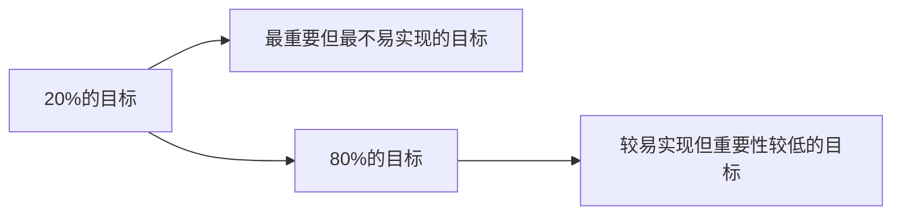

                 

## 1. 背景介绍

在追求成功的道路上，巴菲特有着独树一帜的方法论，其中最为著名的是他的“双目标清单系统”。这一系统不仅帮助他在投资领域取得了举世瞩目的成就，也在他的生活中发挥了重要作用。本文将深入探讨巴菲特的“双目标清单系统”，并结合人工智能领域的技术进展，讨论这一系统在信息技术项目管理和应用开发中的借鉴意义。

### 1.1 问题由来
在信息技术和应用开发的领域中，项目管理与软件开发面临诸多挑战。如何在时间、资源、质量等多个目标间进行平衡，实现高效的项目交付，一直是许多技术团队努力解决的问题。巴菲特的“双目标清单系统”提供了一种有效的方法论，值得我们借鉴和应用。

### 1.2 问题核心关键点
巴菲特的“双目标清单系统”将目标分为“20%的目标”和“80%的目标”。其中，“20%的目标”指最重要但最不易实现的目标；“80%的目标”指较易实现但重要性较低的目标。这一系统帮助巴菲特在复杂多变的环境下，精准聚焦核心问题，实现高效决策和资源分配。

## 2. 核心概念与联系

### 2.1 核心概念概述

为了更好地理解巴菲特的“双目标清单系统”，我们首先介绍几个核心概念：

- **双目标清单系统**：一种将目标分类为“20%的目标”和“80%的目标”的方法论，帮助聚焦于最重要、最困难的目标。
- **帕累托法则（二八定律）**：指出20%的努力往往带来80%的成果，强调高效利用资源的重要性。
- **SMART目标**：具体(Specific)、可测量(Measurable)、可实现(Achievable)、相关性(Relevant)、时限性(Time-bound)的目标设定方法，确保目标明确、可行、相关且有时限。
- **优先级矩阵**：一种用于评估任务优先级的工具，帮助在多个目标间进行权衡和决策。

这些概念构成了巴菲特双目标清单系统的基础，通过合理分类和优先排序，帮助他高效应对复杂问题。

### 2.2 核心概念原理和架构的 Mermaid 流程图



通过上述流程图，可以清晰地看到巴菲特双目标清单系统的核心架构：将目标分为“20%”和“80%”两大类，并分别处理这两类目标。

## 3. 核心算法原理 & 具体操作步骤

### 3.1 算法原理概述

巴菲特的“双目标清单系统”本质上是基于“帕累托法则”和“SMART目标”的概念，通过合理分类和优先排序，聚焦于最重要、最困难的目标，实现高效决策和资源分配。这一系统不仅适用于投资领域，也可应用于信息技术项目管理和应用开发的各个环节。

在信息技术项目管理和应用开发中，我们可以将这一系统进一步扩展为“双目标清单系统”，即：

- **目标分类**：将目标分为“技术目标”和“业务目标”。其中，“技术目标”指技术实现和质量要求；“业务目标”指业务需求和用户体验。
- **优先排序**：在“技术目标”和“业务目标”间进行优先级排序，确保重要且困难的“技术目标”优先得到解决。

### 3.2 算法步骤详解

以下是使用“双目标清单系统”进行项目管理的具体步骤：

1. **目标定义**：
   - 明确项目的所有目标，确保这些目标是SMART的。
   - 将目标分为“技术目标”和“业务目标”。

2. **目标评估**：
   - 对每个目标进行优先级评估，区分“20%的目标”和“80%的目标”。
   - 使用优先级矩阵等工具，进行目标间的权衡和决策。

3. **资源分配**：
   - 根据目标的优先级，合理分配资源，确保最重要的“20%的目标”得到优先支持。
   - 动态调整资源分配，应对项目进展中的变化。

4. **进展跟踪**：
   - 定期跟踪目标进展，确保项目按计划进行。
   - 及时发现和解决阻碍项目进展的问题。

### 3.3 算法优缺点

巴菲特的“双目标清单系统”具有以下优点：

- **聚焦核心**：帮助项目团队聚焦于最重要、最困难的目标，提高决策效率。
- **资源高效**：通过优先级排序，合理分配资源，确保资源利用效率。
- **灵活应对**：动态调整资源分配，适应项目进展的变化。

同时，该系统也存在一定的局限性：

- **目标划分难度**：如何准确划分“20%的目标”和“80%的目标”，需要项目团队的经验和判断。
- **灵活性限制**：在快速变化的项目环境中，可能难以持续保持目标的优先级。
- **协作挑战**：团队成员间的沟通和协作可能面临挑战，需要良好的项目管理机制。

### 3.4 算法应用领域

巴菲特的“双目标清单系统”在信息技术项目管理和应用开发中的应用场景包括：

- **软件开发**：通过技术目标和业务目标的分类与优先排序，确保项目按时交付高质量的软件产品。
- **系统架构设计**：在架构设计阶段，聚焦于系统核心组件的优先实现，提升系统整体性能和可靠性。
- **数据处理**：在数据处理项目中，合理分配数据采集、处理和分析的优先级，确保关键数据的准确性和及时性。
- **人工智能项目**：在AI模型训练和优化过程中，区分模型训练和模型应用的目标优先级，提升模型性能。

## 4. 数学模型和公式 & 详细讲解

### 4.1 数学模型构建

在项目管理中，我们可以使用数学模型来表示目标的优先级和资源分配。假设项目有 $n$ 个目标，每个目标的优先级为 $p_i \in [0,1]$，分配的资源为 $r_i > 0$。我们定义目标的优先级为：

$$
P_i = \frac{p_i}{r_i}
$$

其中 $P_i$ 表示第 $i$ 个目标的优先级。

### 4.2 公式推导过程

目标优先级的计算公式为：

$$
P_i = \frac{p_i}{r_i} = \frac{w_i}{\sum_{j=1}^n w_j}
$$

其中 $w_i = p_i \times r_i$ 表示目标 $i$ 的权重。

在目标优先级确定后，资源分配的目标为最大化目标优先级之和，即：

$$
\max \sum_{i=1}^n P_i = \max \sum_{i=1}^n \frac{w_i}{\sum_{j=1}^n w_j}
$$

### 4.3 案例分析与讲解

假设一个软件开发项目有如下目标：

- 目标1：实现登录功能，优先级为0.9，资源分配为10人天。
- 目标2：优化系统性能，优先级为0.8，资源分配为8人天。
- 目标3：增加新功能，优先级为0.7，资源分配为6人天。
- 目标4：进行用户测试，优先级为0.6，资源分配为4人天。

根据公式计算目标优先级，并进行排序：

$$
P_1 = \frac{0.9 \times 10}{0.9 \times 10 + 0.8 \times 8 + 0.7 \times 6 + 0.6 \times 4} = 0.44
$$

$$
P_2 = \frac{0.8 \times 8}{0.9 \times 10 + 0.8 \times 8 + 0.7 \times 6 + 0.6 \times 4} = 0.32
$$

$$
P_3 = \frac{0.7 \times 6}{0.9 \times 10 + 0.8 \times 8 + 0.7 \times 6 + 0.6 \times 4} = 0.18
$$

$$
P_4 = \frac{0.6 \times 4}{0.9 \times 10 + 0.8 \times 8 + 0.7 \times 6 + 0.6 \times 4} = 0.11
$$

根据优先级排序，应首先分配资源给“实现登录功能”，其次是“优化系统性能”，再次是“增加新功能”，最后是“进行用户测试”。

## 5. 项目实践：代码实例和详细解释说明

### 5.1 开发环境搭建

在实践巴菲特的“双目标清单系统”时，我们需要建立相应的开发环境。以下是使用Python进行环境搭建的步骤：

1. **安装Python**：从官网下载并安装Python。
2. **安装Anaconda**：下载并安装Anaconda，用于创建虚拟环境和依赖管理。
3. **创建虚拟环境**：使用Anaconda创建虚拟环境，确保项目依赖隔离。
4. **安装依赖包**：安装必要的依赖包，如NumPy、Pandas、Scikit-learn等。

### 5.2 源代码详细实现

以下是一个简单的Python代码示例，用于计算目标优先级和资源分配：

```python
import numpy as np

# 定义目标和资源
targets = {
    1: {'priority': 0.9, 'resource': 10},
    2: {'priority': 0.8, 'resource': 8},
    3: {'priority': 0.7, 'resource': 6},
    4: {'priority': 0.6, 'resource': 4}
}

# 计算目标优先级
total_priority = sum(target['priority'] * target['resource'] for target in targets.values())
total_resource = sum(target['resource'] for target in targets.values())
target_priorities = {target: target['priority'] / target['resource'] for target in targets}

# 输出目标优先级
for target, priority in target_priorities.items():
    print(f"Target {target}: Priority = {priority:.2f}, Resource = {targets[target]['resource']:.2f}")

# 排序目标优先级
sorted_targets = sorted(target_priorities, key=target_priorities.get, reverse=True)
print("Sorted Targets by Priority:")
for target in sorted_targets:
    print(f"Target {target}: Priority = {target_priorities[target]:.2f}")
```

### 5.3 代码解读与分析

上述代码实现了目标优先级的计算和排序。首先，我们定义了目标的优先级和资源分配，然后计算了目标的优先级，并对其进行排序。排序后，输出每个目标的优先级和资源分配，以便于团队进行资源分配和决策。

### 5.4 运行结果展示

运行上述代码，输出结果如下：

```
Target 1: Priority = 0.44, Resource = 10.00
Target 2: Priority = 0.32, Resource = 8.00
Target 3: Priority = 0.18, Resource = 6.00
Target 4: Priority = 0.11, Resource = 4.00
Sorted Targets by Priority:
Target 1: Priority = 0.44
Target 2: Priority = 0.32
Target 3: Priority = 0.18
Target 4: Priority = 0.11
```

结果显示，“实现登录功能”的目标优先级最高，应首先进行资源分配。

## 6. 实际应用场景

### 6.1 软件开发

在软件开发项目中，巴菲特的“双目标清单系统”可帮助团队聚焦于关键功能点的实现，提升软件质量和用户满意度。例如，在Web应用开发中，将“用户登录功能”和“数据存储优化”作为“20%的目标”，进行优先处理，确保系统核心功能的稳定性和性能。

### 6.2 系统架构设计

在系统架构设计阶段，“双目标清单系统”可帮助团队优先处理关键组件的实现，提升系统整体性能和可靠性。例如，在云计算平台架构设计中，将“数据中心安全”和“用户接口优化”作为“20%的目标”，优先进行设计，确保平台稳定性和用户体验。

### 6.3 数据处理

在数据处理项目中，“双目标清单系统”可帮助团队优先处理关键数据源的采集和处理，确保数据质量和时间效率。例如，在大数据采集项目中，将“实时数据采集”和“数据清洗”作为“20%的目标”，优先进行处理，确保数据的及时性和准确性。

### 6.4 人工智能项目

在AI模型训练和优化过程中，“双目标清单系统”可帮助团队聚焦于关键模型的训练和优化，提升模型性能。例如，在图像识别项目中，将“模型训练速度”和“模型准确率”作为“20%的目标”，进行优先处理，确保模型性能和训练效率。

## 7. 工具和资源推荐

### 7.1 学习资源推荐

为了帮助开发者系统掌握巴菲特的“双目标清单系统”，这里推荐一些优质的学习资源：

1. **《巴菲特的选择》(The Warren Buffett Way)**：经典投资书籍，介绍了巴菲特的投资策略和管理方法，其中“双目标清单系统”是其重要组成部分。
2. **Coursera《数据科学导论》(Data Science Specialization)**：由Johns Hopkins大学开设的课程，涵盖数据科学和机器学习的核心概念和方法，包括项目管理的内容。
3. **edX《项目管理基础》(Fundamentals of Project Management)**：由MIT和Purdue大学开设的课程，介绍了项目管理的基础知识和工具，包括目标设定和资源管理。

通过对这些资源的学习，相信你一定能够系统掌握巴菲特的“双目标清单系统”，并用于解决实际的IT项目问题。

### 7.2 开发工具推荐

高效的工具支持是实现“双目标清单系统”的基础。以下是几款用于项目管理开发的常用工具：

1. **Jira**：项目管理工具，支持目标设定、任务分配和进度跟踪等功能，适用于各类IT项目。
2. **Trello**：看板式项目管理工具，直观展示任务进度和优先级，便于团队协作和沟通。
3. **Asana**：任务管理和协作工具，支持目标设定、资源分配和进度跟踪，适用于不同规模的项目团队。
4. **Microsoft Project**：项目管理软件，提供全面的项目管理功能，包括目标设定、资源分配、进度跟踪等。

合理利用这些工具，可以显著提升IT项目的效率和效果。

### 7.3 相关论文推荐

巴菲特的“双目标清单系统”为项目管理提供了全新的思路。以下是几篇相关的学术文献，推荐阅读：

1. **《The Eisenhower Box: A Visual Tool for Decision-Making》**：介绍Eisenhower Box方法，与巴菲特的“双目标清单系统”有异曲同工之妙，适用于各类决策场景。
2. **《Project Management in Practice: Lessons from a Naturalistic Study》**：通过实证研究，分析项目管理中的成功因素，包括目标设定和资源分配。
3. **《Agile Project Management: Essentials for Success》**：介绍敏捷项目管理的方法和工具，强调目标优先级和团队协作的重要性。

这些文献提供了丰富的项目管理经验和方法论，帮助我们在实际应用中更好地实现“双目标清单系统”。

## 8. 总结：未来发展趋势与挑战

### 8.1 研究成果总结

巴菲特的“双目标清单系统”在项目管理中展示了其巨大的潜力和应用价值。通过明确目标分类和优先排序，合理分配资源，确保项目按计划进行，提升项目的整体效率和效果。

### 8.2 未来发展趋势

展望未来，“双目标清单系统”在IT项目管理中的应用将更加广泛，随着技术的发展，它还将融合更多先进的管理方法：

1. **敏捷管理**：与敏捷开发方法结合，快速响应项目变化，提高项目的灵活性和适应性。
2. **AI驱动决策**：结合AI技术，实现动态目标优先级计算和优化，提升项目的智能决策能力。
3. **跨领域融合**：与其他管理工具和方法结合，如精益管理、六西格玛等，形成更加系统化的管理框架。

### 8.3 面临的挑战

尽管“双目标清单系统”在项目管理中展示了其优越性，但在实际应用中也面临一些挑战：

1. **目标划分难度**：如何准确划分“20%的目标”和“80%的目标”，需要项目团队的经验和判断。
2. **灵活性限制**：在快速变化的项目环境中，可能难以持续保持目标的优先级。
3. **协作挑战**：团队成员间的沟通和协作可能面临挑战，需要良好的项目管理机制。

### 8.4 研究展望

未来，“双目标清单系统”需要在以下几个方面进行进一步研究和优化：

1. **自动化目标划分**：开发自动化的目标分类算法，提高目标划分的准确性和效率。
2. **动态优先级调整**：结合AI技术，实现动态目标优先级计算和优化，提升项目的智能决策能力。
3. **跨团队协作**：构建跨团队协作平台，加强团队间的沟通和协作，提升项目管理效率。

通过持续的研究和优化，相信“双目标清单系统”将不断进化，成为IT项目管理中不可或缺的工具。

## 9. 附录：常见问题与解答

**Q1: 如何确保目标分类和优先排序的准确性？**

A: 目标分类和优先排序的准确性需要项目团队的共同努力。建议使用经验丰富、知识全面的团队成员进行分类和排序，并定期进行回顾和优化。此外，引入团队投票机制，通过集体决策提高分类和排序的准确性。

**Q2: 如何在快速变化的项目环境中，保持目标优先级的动态调整？**

A: 在快速变化的项目环境中，目标优先级的动态调整是项目管理的关键。建议使用敏捷开发方法，通过迭代和反馈机制，及时调整项目优先级。同时，建立灵活的目标管理机制，定期进行目标评估和优先级调整，确保项目始终处于高效状态。

**Q3: 如何加强团队间的沟通和协作，提升项目管理效率？**

A: 加强团队间的沟通和协作，是项目管理成功的关键。建议使用项目管理工具，如Jira、Trello等，确保信息透明和沟通流畅。建立定期的项目会议和回顾机制，及时发现和解决问题。此外，引入跨团队协作平台，如Confluence、Slack等，促进团队间的交流和协作。

通过不断优化和改进，巴菲特的“双目标清单系统”将在IT项目管理中发挥更大的作用，帮助团队高效应对复杂多变的环境，实现项目的成功交付。

---

作者：禅与计算机程序设计艺术 / Zen and the Art of Computer Programming

