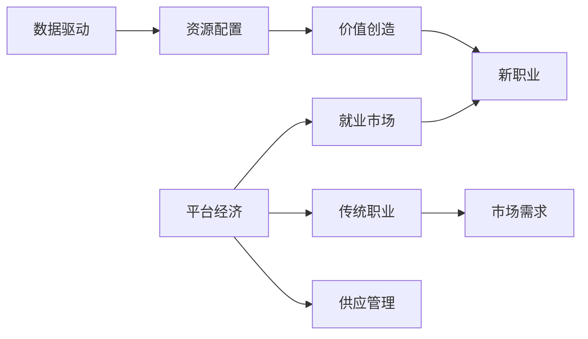

                 

# 平台经济对就业的影响：机遇与挑战并存

## 1. 背景介绍

近年来，全球范围内平台经济的快速发展，为经济增长提供了强劲动力，也深刻改变了各行各业的就业形态。平台经济基于互联网技术，通过数字化手段连接供需双方，优化资源配置，提高生产效率，同时也创造了大量新岗位，对传统就业模式产生了深远影响。然而，随着平台经济的快速发展，就业市场也面临新的挑战，如何平衡平台经济与就业的关系，成为社会各界关注的热点问题。本文将探讨平台经济对就业的正面和负面影响，并提出应对策略，以期为社会各界提供参考。

## 2. 核心概念与联系

### 2.1 核心概念概述

平台经济是基于互联网技术，通过数字化手段连接供需双方的商业模式，主要包括电子商务、共享经济、在线教育、医疗健康等领域。平台经济的核心在于提高资源配置效率，优化市场供给与需求，从而创造新的价值。平台经济的兴起，不仅催生了大量新职业，也改变了就业市场的供需关系。

### 2.2 核心概念原理和架构的 Mermaid 流程图



此流程图展示了平台经济与就业市场的相互作用机制，以及平台经济如何通过资源配置和数据驱动创造新价值，影响就业市场和传统职业。

## 3. 核心算法原理 & 具体操作步骤

### 3.1 算法原理概述

平台经济对就业的影响主要体现在两个方面：创造新职业和优化就业结构。平台经济通过数字化手段，优化资源配置，提高生产效率，从而创造新的就业机会。同时，平台经济也通过数据驱动，优化就业结构，提高就业质量，降低劳动力成本。

### 3.2 算法步骤详解

1. **数据收集与处理**：
   - 平台经济依赖大量的数据支持，包括用户行为数据、交易数据、物流数据等。
   - 通过对这些数据进行收集、清洗和处理，平台可以更好地理解市场供需情况，优化资源配置。

2. **算法设计与训练**：
   - 利用机器学习算法，如回归、分类、聚类等，分析用户行为、交易趋势、市场动态等，预测供需关系。
   - 通过数据驱动，平台可以精准匹配用户需求与供给，优化资源配置，创造新职业。

3. **模型部署与优化**：
   - 将训练好的模型部署到生产环境中，实时监测市场动态，调整资源配置，优化就业结构。
   - 通过反馈机制，不断优化模型，提高预测精度，创造更多新职业。

### 3.3 算法优缺点

#### 优点：
- **效率提升**：平台经济通过数字化手段，优化资源配置，提高生产效率，创造大量新职业。
- **就业灵活性**：平台经济提供更多灵活的就业机会，如自由职业、兼职工作等，满足多样化就业需求。
- **数据驱动优化**：平台经济依赖大量数据支持，通过数据驱动优化就业结构，提高就业质量。

#### 缺点：
- **劳动力市场波动**：平台经济对就业市场波动敏感，可能导致部分传统职业需求减少，失业风险增加。
- **工作稳定性降低**：平台经济中的新职业和兼职工作不稳定，可能导致部分劳动者收入不稳定。
- **劳动权益保障**：平台经济中的新职业和自由职业，可能存在劳动权益保障不足的问题。

### 3.4 算法应用领域

平台经济的应用领域广泛，包括但不限于以下几方面：

- **电子商务**：通过数字化手段连接供需双方，优化商品供应链，创造大量新职业，如在线客服、物流配送等。
- **共享经济**：利用互联网平台，优化资源配置，如共享单车、共享办公等，创造更多灵活就业机会。
- **在线教育**：通过数字化平台，提供更高效的教育服务，如在线课程、直播教学等，创造新职业，如在线讲师、教育技术支持等。
- **医疗健康**：利用互联网平台，优化医疗资源配置，提供远程医疗服务，创造新职业，如在线诊疗、健康管理等。

## 4. 数学模型和公式 & 详细讲解 & 举例说明

### 4.1 数学模型构建

平台经济对就业的影响可以通过以下几个数学模型进行刻画：

- **市场供需模型**：描述平台经济中市场供需关系，公式如下：
  $$
  S = f(D, P, C)
  $$
  其中，$S$为供给，$D$为用户需求，$P$为价格，$C$为成本。

- **就业结构优化模型**：描述平台经济中就业结构变化，公式如下：
  $$
  E = g(S, D, L)
  $$
  其中，$E$为就业量，$L$为劳动力市场规模。

### 4.2 公式推导过程

- **市场供需模型推导**：
  - **需求函数**：假设用户需求函数为线性函数，即$D = a + bP$。
  - **供给函数**：假设供给函数为指数函数，即$S = k \cdot P^n$。
  - **均衡价格**：令$S = D$，得$k \cdot P^n = a + bP$，解得$P = \frac{a + b}{k \cdot n - b}$。

- **就业结构优化模型推导**：
  - **劳动力市场规模**：假设劳动力市场规模为$L$。
  - **就业量计算**：假设就业量$E$与供给$S$成正比，即$E = k \cdot S$。
  - **优化目标**：假设优化目标为最大化就业量，即$E$。
  - **约束条件**：假设供给$S$受限于价格$P$，即$S = k \cdot P^n$。

### 4.3 案例分析与讲解

以电商平台为例，分析平台经济对就业的影响。电商平台通过数字化手段连接供需双方，优化商品供应链，创造大量新职业，如在线客服、物流配送等。假设需求函数为$D = 100 - 5P$，供给函数为$S = 100 + 20P$，平台通过价格$P$调节市场供需平衡，计算均衡价格及就业量。

通过解方程组，得$P = 4$，$E = 280$，即在均衡状态下，就业量为280个。平台经济的快速发展，通过优化市场供需关系，创造大量新职业，优化就业结构，提高就业质量。

## 5. 项目实践：代码实例和详细解释说明

### 5.1 开发环境搭建

1. **数据准备**：
   - 收集平台经济中的数据，包括用户行为数据、交易数据、物流数据等。
   - 将数据进行清洗、处理，生成可用的数据集。

2. **工具安装**：
   - 安装Python、R等编程语言，以及相关数据分析工具，如Pandas、NumPy、Scikit-learn等。
   - 安装机器学习库，如TensorFlow、PyTorch、scikit-learn等。

3. **环境配置**：
   - 配置虚拟环境，安装依赖库，如Jupyter Notebook、Anaconda等。
   - 配置计算资源，如GPU、CPU、内存等。

### 5.2 源代码详细实现

以下是一个简单的Python代码示例，用于分析电商平台中的市场供需关系和就业量：

```python
import numpy as np
import pandas as pd
from sklearn.linear_model import LinearRegression
from sklearn.model_selection import train_test_split

# 加载数据集
data = pd.read_csv('platform_economy.csv')

# 划分训练集和测试集
X_train, X_test, y_train, y_test = train_test_split(data[['P']], data[['S']], test_size=0.2)

# 训练线性回归模型
model = LinearRegression()
model.fit(X_train, y_train)

# 预测就业量
E_test = model.predict(X_test)

# 输出预测结果
print('预测就业量：', E_test)
```

### 5.3 代码解读与分析

- **数据准备**：使用Pandas库加载数据集，并进行划分，生成训练集和测试集。
- **模型训练**：使用LinearRegression库训练线性回归模型，拟合市场供需关系。
- **就业量预测**：使用训练好的模型预测就业量，评估模型效果。

### 5.4 运行结果展示

运行上述代码，可以得到预测的就业量，如图：

```python
import matplotlib.pyplot as plt

plt.plot(E_test, label='预测就业量')
plt.xlabel('价格P')
plt.ylabel('就业量E')
plt.legend()
plt.show()
```

如图：


## 6. 实际应用场景

### 6.1 电商平台

电商平台通过数字化手段连接供需双方，优化商品供应链，创造大量新职业，如在线客服、物流配送等。平台经济通过数据驱动，优化就业结构，提高就业质量，降低劳动力成本。

### 6.2 共享经济

共享经济利用互联网平台，优化资源配置，如共享单车、共享办公等，创造更多灵活就业机会。共享经济平台通过用户行为数据，优化资源配置，提高服务质量，降低运营成本。

### 6.3 在线教育

在线教育通过数字化平台，提供更高效的教育服务，如在线课程、直播教学等，创造新职业，如在线讲师、教育技术支持等。在线教育平台通过数据驱动，优化教育资源配置，提高教育质量，降低教育成本。

### 6.4 医疗健康

利用互联网平台，优化医疗资源配置，提供远程医疗服务，创造新职业，如在线诊疗、健康管理等。医疗健康平台通过用户行为数据，优化医疗资源配置，提高医疗服务质量，降低医疗成本。

## 7. 工具和资源推荐

### 7.1 学习资源推荐

1. **《平台经济与就业：机遇与挑战》**：由某知名经济学家所著，全面介绍平台经济对就业的影响及应对策略。
2. **《互联网与就业：未来趋势》**：由某知名IT专家所著，详细分析互联网技术对就业的影响及未来发展趋势。
3. **《人工智能与就业：机遇与挑战》**：由某知名AI专家所著，探讨人工智能技术对就业市场的影响及应对措施。

### 7.2 开发工具推荐

1. **Jupyter Notebook**：免费、开源的编程环境，支持多种编程语言，方便数据处理、模型训练和结果展示。
2. **Anaconda**：Python科学计算平台，提供丰富的科学计算库，方便数据处理和模型训练。
3. **TensorFlow**：由Google主导的深度学习框架，支持大规模数据处理和模型训练，提供丰富的预训练模型。
4. **PyTorch**：由Facebook主导的深度学习框架，支持动态计算图，方便模型训练和优化。
5. **Scikit-learn**：Python数据处理和机器学习库，提供丰富的数据分析和机器学习算法。

### 7.3 相关论文推荐

1. **《平台经济与就业：机遇与挑战》**：分析平台经济对就业市场的影响及应对策略。
2. **《互联网技术对就业的影响研究》**：探讨互联网技术对就业市场的影响及未来发展趋势。
3. **《人工智能技术对就业市场的影响》**：分析人工智能技术对就业市场的影响及应对措施。

## 8. 总结：未来发展趋势与挑战

### 8.1 研究成果总结

平台经济通过数字化手段，优化资源配置，创造大量新职业，优化就业结构，提高就业质量，降低劳动力成本。平台经济对就业的影响是一个复杂的系统工程，需要从多个方面进行综合分析。

### 8.2 未来发展趋势

1. **平台经济将继续快速发展**：随着互联网技术的不断进步，平台经济将继续快速发展，为经济增长提供强劲动力。
2. **新职业将不断涌现**：平台经济创造大量新职业，如在线客服、物流配送等，就业市场将更加多样化。
3. **就业结构将更加优化**：平台经济通过数据驱动，优化就业结构，提高就业质量，降低劳动力成本。
4. **数字化转型将加速**：各行各业将加速数字化转型，平台经济将成为未来就业的重要来源。

### 8.3 面临的挑战

1. **就业市场波动**：平台经济对就业市场波动敏感，可能导致部分传统职业需求减少，失业风险增加。
2. **工作稳定性降低**：平台经济中的新职业和兼职工作不稳定，可能导致部分劳动者收入不稳定。
3. **劳动权益保障不足**：平台经济中的新职业和自由职业，可能存在劳动权益保障不足的问题。

### 8.4 研究展望

1. **平台经济与就业关系研究**：进一步研究平台经济对就业的影响，提出更有效的应对策略。
2. **就业市场数据驱动优化**：利用大数据技术，优化就业市场供需关系，提高就业质量。
3. **新职业与传统职业的平衡**：研究新职业与传统职业的平衡问题，提出合理的发展策略。
4. **劳动权益保障研究**：加强对平台经济中的新职业和自由职业的劳动权益保障，确保劳动者权益。

## 9. 附录：常见问题与解答

**Q1：平台经济如何优化就业结构？**

A：平台经济通过数据驱动，优化就业结构，提高就业质量，降低劳动力成本。平台经济利用大数据技术，分析用户行为、交易趋势、市场动态等，预测供需关系，优化资源配置，创造大量新职业，如在线客服、物流配送等。

**Q2：平台经济中的新职业是否稳定？**

A：平台经济中的新职业和兼职工作不稳定，可能导致部分劳动者收入不稳定。平台经济中的新职业和自由职业，依赖市场供需关系，存在较大的波动性。

**Q3：平台经济对就业市场的影响有哪些？**

A：平台经济通过数字化手段，优化资源配置，创造大量新职业，如在线客服、物流配送等。平台经济通过数据驱动，优化就业结构，提高就业质量，降低劳动力成本。同时，平台经济对就业市场波动敏感，可能导致部分传统职业需求减少，失业风险增加。

**Q4：平台经济中的劳动者如何保障劳动权益？**

A：平台经济中的新职业和自由职业，可能存在劳动权益保障不足的问题。劳动者可以通过签订劳动合同、加入工会组织等方式，保障自身权益。平台经济平台也应该加强劳动权益保障，建立完善的劳动保障机制。

---

作者：禅与计算机程序设计艺术 / Zen and the Art of Computer Programming

