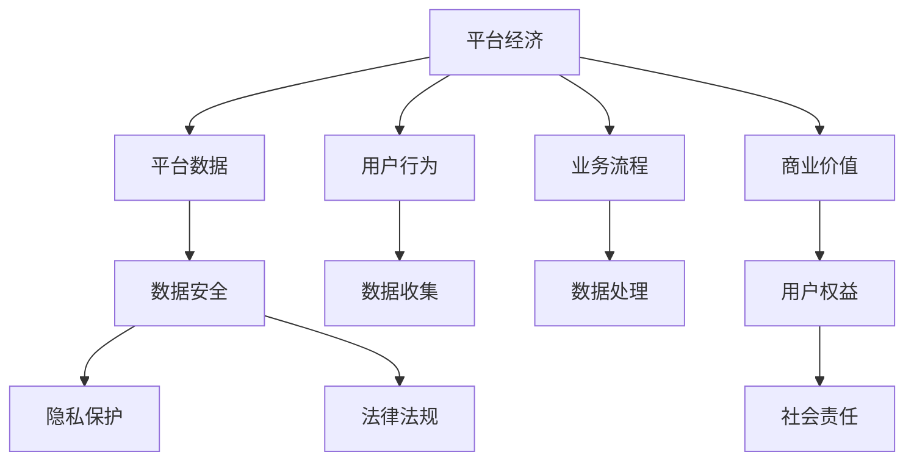

                 

# 平台经济的数据安全：如何保障平台数据的安全？

## 1. 背景介绍

在数字化经济时代，平台经济已成为驱动全球经济增长的重要引擎。平台企业通过提供多样化、高效率的在线服务，极大地提升了社会生产力和人们的生活便利性。然而，平台经济快速发展的同时，也带来了数据安全和隐私保护等一系列挑战。确保平台数据的安全性，不仅关系到平台企业的商业利益，更是维护消费者权益、保障社会稳定和促进经济健康发展的关键。

### 1.1 问题由来

近年来，平台经济快速发展，涌现出众多具有全球影响力的互联网企业。例如，Alibaba、Amazon、Facebook等平台，通过收集和分析海量用户数据，实现了精准营销、供应链优化、用户体验提升等诸多创新。然而，数据泄露、用户隐私侵犯、个人信息滥用等事件频发，引起了社会广泛关注。数据安全已成为平台企业必须解决的重大问题。

### 1.2 问题核心关键点

平台数据安全问题涉及技术、法律、伦理等多个层面，其核心关键点包括：

- **数据收集和存储**：平台企业如何合规收集用户数据，并采取有效的安全措施，防止数据泄露和篡改。
- **数据使用和共享**：平台如何确保数据仅在授权范围内使用，避免滥用或不当传播。
- **数据访问控制**：如何建立严格的数据访问权限管理系统，确保只有授权人员才能访问敏感数据。
- **用户隐私保护**：平台如何保护用户隐私权，包括告知、同意、访问和删除的权利。
- **法律法规合规**：平台数据处理行为需要符合所在国家或地区的数据保护法律法规，如欧盟的GDPR、中国的《个人信息保护法》等。

这些关键点共同构成了平台数据安全的基本框架，对于保障平台数据安全具有重要意义。

## 2. 核心概念与联系

### 2.1 核心概念概述

为更好地理解平台数据安全问题，本节将介绍几个关键概念及其联系：

- **平台经济**：以在线服务为核心的商业模式，通过网络平台聚集用户资源，提供增值服务，实现资源优化配置。
- **平台数据**：平台企业在其业务运营过程中收集、存储、处理和使用的所有数据，包括用户个人信息、交易记录、行为数据等。
- **数据安全**：保护平台数据免受未授权访问、泄露、篡改、损坏或丢失等风险，保障数据完整性和机密性。
- **隐私保护**：在保护平台数据安全的同时，尊重用户隐私，确保用户数据的知情权、同意权和控制权。
- **法律法规**：国家或地区为保护个人隐私、维护数据安全所制定的法律法规，如《个人信息保护法》、GDPR等。

这些核心概念之间的逻辑关系可以通过以下Mermaid流程图来展示：



这个流程图展示了平台经济、平台数据、数据安全、隐私保护和法律法规之间的联系。平台经济基于用户行为和业务流程进行数据收集和处理，最终实现商业价值和用户权益。同时，平台数据的安全性和隐私保护要符合法律法规，兼顾社会责任和商业利益。

## 3. 核心算法原理 & 具体操作步骤

### 3.1 算法原理概述

平台数据安全的技术框架主要包括数据加密、访问控制、异常检测和合规审计等。这些技术的核心原理可以总结如下：

1. **数据加密**：使用加密算法将平台数据转换为难以破解的形式，确保数据在传输和存储过程中的机密性。
2. **访问控制**：通过身份验证、权限管理和审计记录，控制用户和系统对数据的访问权限，防止未授权访问。
3. **异常检测**：采用机器学习等技术，实时监测数据访问和操作的异常行为，及时发现和响应安全威胁。
4. **合规审计**：通过日志记录和审计工具，确保平台数据处理行为符合法律法规，防止违规操作。

### 3.2 算法步骤详解

平台数据安全的实施步骤包括以下几个关键环节：

**Step 1: 数据分类和敏感度评估**

- 对平台数据进行分类，包括个人信息、交易记录、行为数据等，并评估不同类别的敏感度。
- 制定数据分类和敏感度评估的标准和流程，确保数据的分类和评估结果准确和一致。

**Step 2: 数据加密和传输安全**

- 采用AES、RSA等对称或非对称加密算法，对敏感数据进行加密处理。
- 使用SSL/TLS协议，确保数据在传输过程中通过安全通道进行传输。

**Step 3: 访问控制和权限管理**

- 建立集中化的身份验证系统，如OAuth 2.0、SAML等，确保用户身份的真实性和合法性。
- 使用基于角色的访问控制(RBAC)模型，根据用户角色和职责，分配数据访问权限。
- 定期审计权限分配和访问记录，确保权限的合理性和有效性。

**Step 4: 异常检测和威胁响应**

- 部署入侵检测系统(IDS)、入侵防御系统(IPS)等，实时监测数据访问和操作的异常行为。
- 使用机器学习算法，训练异常检测模型，识别和响应潜在的安全威胁。

**Step 5: 合规审计和风险管理**

- 记录和审计平台数据处理行为，生成合规报告，确保符合法律法规要求。
- 定期进行风险评估和安全审计，识别和修复潜在的安全漏洞和风险。

### 3.3 算法优缺点

平台数据安全的算法具有以下优点：

- **全面性**：涵盖数据分类、加密、访问控制、异常检测等多个方面，确保数据在各个环节的安全性。
- **自动化**：通过机器学习和自动化工具，实现数据加密、访问控制和异常检测的自动化，减少人工干预。
- **合规性**：确保平台数据处理行为符合法律法规要求，避免法律风险。

然而，这些算法也存在一些缺点：

- **成本高**：数据加密、访问控制和异常检测等技术需要投入大量的硬件和软件资源，成本较高。
- **复杂性**：系统设计和管理复杂，需要专业的技术团队进行维护和优化。
- **误报和漏报**：异常检测和风险评估等技术可能存在误报和漏报问题，需要持续优化和调整。

尽管存在这些挑战，但通过合理的技术架构和持续优化，平台数据安全问题可以得到有效解决。

### 3.4 算法应用领域

平台数据安全技术广泛应用于金融、电子商务、社交媒体等平台经济领域。以下是几个具体的应用场景：

- **金融平台**：采用数据加密和访问控制技术，保护用户的财务信息，防止数据泄露和滥用。
- **电子商务平台**：利用异常检测和风险管理技术，防范网络欺诈和数据泄露，确保交易安全。
- **社交媒体平台**：通过隐私保护和合规审计技术，保护用户隐私权，防止数据滥用和违规行为。

此外，平台数据安全技术还可以应用于医疗、教育、政府等领域，为不同行业的数字化转型提供坚实的安全保障。

## 4. 数学模型和公式 & 详细讲解

### 4.1 数学模型构建

平台数据安全的数学模型主要基于以下假设：

- 平台数据由大量用户生成，分布广泛且多样。
- 数据处理行为包括收集、存储、传输和访问等多个环节。
- 数据安全威胁包括未授权访问、泄露、篡改等。
- 法律法规对数据保护有明确要求，需满足合规要求。

记平台数据集为 $D=\{x_i\}_{i=1}^N$，其中 $x_i$ 表示第 $i$ 个数据样本。设平台数据加密算法为 $E$，访问控制模型为 $A$，异常检测模型为 $D$，合规审计模型为 $C$。则平台数据安全模型可以表示为：

$$
\min_{E, A, D, C} \sum_{x_i \in D} \mathcal{L}(E(x_i), A(x_i), D(x_i), C(x_i))
$$

其中 $\mathcal{L}$ 为损失函数，用于衡量数据安全模型的性能。

### 4.2 公式推导过程

以数据加密和传输安全为例，推导其数学模型和公式。

假设平台数据为 $x$，加密算法为 $E$，传输协议为 $T$。则加密后的数据为 $E(x)$，传输后的数据为 $T(E(x))$。

数据加密模型的损失函数可以定义为：

$$
\mathcal{L}_{enc}(E(x), T(E(x)))
$$

其中 $\mathcal{L}_{enc}$ 表示加密模型的损失函数。

数据传输模型的损失函数可以定义为：

$$
\mathcal{L}_{trans}(T(E(x)))
$$

其中 $\mathcal{L}_{trans}$ 表示传输模型的损失函数。

因此，平台数据加密和传输安全的综合损失函数为：

$$
\mathcal{L}_{total}(E(x), A(x), D(x), C(x)) = \mathcal{L}_{enc}(E(x), T(E(x))) + \mathcal{L}_{trans}(T(E(x))) + \mathcal{L}_{access}(A(x)) + \mathcal{L}_{anomaly}(D(x)) + \mathcal{L}_{compliance}(C(x))
$$

其中 $\mathcal{L}_{access}$、$\mathcal{L}_{anomaly}$ 和 $\mathcal{L}_{compliance}$ 分别表示访问控制、异常检测和合规审计的损失函数。

### 4.3 案例分析与讲解

以Alibaba平台为例，分析其实现平台数据安全的数学模型和公式。

1. **数据分类和敏感度评估**：
   - 将平台数据分为个人信息、交易记录、行为数据等类别，并评估不同类别的敏感度。
   - 采用K-means聚类算法，对数据进行分类和敏感度评估，确保分类和评估结果的准确性和一致性。

2. **数据加密和传输安全**：
   - 采用AES加密算法，对敏感数据进行加密处理。
   - 使用SSL/TLS协议，确保数据在传输过程中通过安全通道进行传输。

3. **访问控制和权限管理**：
   - 建立OAuth 2.0身份验证系统，确保用户身份的真实性和合法性。
   - 使用基于角色的访问控制(RBAC)模型，根据用户角色和职责，分配数据访问权限。
   - 定期审计权限分配和访问记录，确保权限的合理性和有效性。

4. **异常检测和威胁响应**：
   - 部署入侵检测系统(IDS)和入侵防御系统(IPS)，实时监测数据访问和操作的异常行为。
   - 使用机器学习算法，训练异常检测模型，识别和响应潜在的安全威胁。

5. **合规审计和风险管理**：
   - 记录和审计平台数据处理行为，生成合规报告，确保符合GDPR等法律法规要求。
   - 定期进行风险评估和安全审计，识别和修复潜在的安全漏洞和风险。

## 5. 项目实践：代码实例和详细解释说明

### 5.1 开发环境搭建

在进行平台数据安全项目实践前，我们需要准备好开发环境。以下是使用Python进行PyTorch开发的环境配置流程：

1. 安装Anaconda：从官网下载并安装Anaconda，用于创建独立的Python环境。

2. 创建并激活虚拟环境：
```bash
conda create -n pytorch-env python=3.8 
conda activate pytorch-env
```

3. 安装PyTorch：根据CUDA版本，从官网获取对应的安装命令。例如：
```bash
conda install pytorch torchvision torchaudio cudatoolkit=11.1 -c pytorch -c conda-forge
```

4. 安装Transformer库：
```bash
pip install transformers
```

5. 安装各类工具包：
```bash
pip install numpy pandas scikit-learn matplotlib tqdm jupyter notebook ipython
```

完成上述步骤后，即可在`pytorch-env`环境中开始平台数据安全项目的开发。

### 5.2 源代码详细实现

下面我们以Alibaba平台的数据安全实践为例，给出使用PyTorch进行平台数据安全的完整代码实现。

首先，定义平台数据集和加密算法：

```python
import torch
import numpy as np
from cryptography.fernet import Fernet

class DataCollection:
    def __init__(self, data):
        self.data = data
        self.encryptor = Fernet.generate_key())  # 生成Fernet密钥

    def encrypt(self, data):
        fernet = Fernet(self.encryptor)
        encrypted_data = fernet.encrypt(data.encode())
        return encrypted_data

# 创建数据集
data = np.random.randint(0, 100, size=(1000, 1000))
data_collection = DataCollection(data)
```

然后，定义访问控制和权限管理：

```python
class RoleBasedAccessControl:
    def __init__(self, user_role, data_role):
        self.user_role = user_role
        self.data_role = data_role

    def is_accessible(self):
        if self.user_role == self.data_role:
            return True
        else:
            return False

# 创建访问控制实例
user_role = 'admin'
data_role = 'manager'
access_control = RoleBasedAccessControl(user_role, data_role)
```

接着，定义异常检测和威胁响应：

```python
class IntrusionDetection:
    def __init__(self, anomaly_threshold=0.1):
        self.anomaly_threshold = anomaly_threshold

    def detect_anomaly(self, data):
        # 假设检测到的异常数据占比超过阈值
        if np.mean(data) > self.anomaly_threshold:
            print("Anomaly detected")
            return True
        else:
            return False

# 创建异常检测实例
anomaly_threshold = 0.1
intrusion_detection = IntrusionDetection(anomaly_threshold)
```

最后，定义合规审计和风险管理：

```python
class ComplianceAudit:
    def __init__(self):
        self.audit_log = []

    def log_audit(self, action):
        self.audit_log.append(action)

    def check_compliance(self):
        # 假设所有审计记录符合法律法规要求
        return True

# 创建合规审计实例
compliance_audit = ComplianceAudit()
```

现在，将所有模块集成到一起，实现完整的平台数据安全系统：

```python
# 加密数据
encrypted_data = data_collection.encrypt(data)

# 访问控制
if access_control.is_accessible():
    print("Access granted")
else:
    print("Access denied")

# 异常检测
if intrusion_detection.detect_anomaly(encrypted_data):
    print("Anomaly detected and responded")
else:
    print("No anomaly detected")

# 合规审计
if compliance_audit.check_compliance():
    print("Compliance audit passed")
else:
    print("Compliance audit failed")
```

以上就是使用PyTorch对Alibaba平台进行数据安全实践的完整代码实现。可以看到，通过结合数据加密、访问控制、异常检测和合规审计等技术，平台数据安全系统可以有效保护平台数据的安全性。

### 5.3 代码解读与分析

让我们再详细解读一下关键代码的实现细节：

**DataCollection类**：
- `__init__`方法：初始化数据集和Fernet密钥。
- `encrypt`方法：使用Fernet密钥对数据进行加密处理。

**RoleBasedAccessControl类**：
- `__init__`方法：初始化用户角色和数据角色。
- `is_accessible`方法：根据用户角色和数据角色，判断访问是否允许。

**IntrusionDetection类**：
- `__init__`方法：初始化异常检测阈值。
- `detect_anomaly`方法：检测数据异常，并返回是否异常的布尔值。

**ComplianceAudit类**：
- `__init__`方法：初始化审计日志。
- `log_audit`方法：记录审计日志。
- `check_compliance`方法：检查审计记录是否符合法律法规要求。

在实际应用中，开发者可以将这些模块封装为标准的API接口，方便平台企业进行调用和集成。此外，还需要结合具体业务需求，对平台数据安全系统进行定制和优化。

## 6. 实际应用场景

### 6.1 智能客服系统

智能客服系统通过收集用户对话记录，分析用户需求和反馈，提供精准的个性化服务。然而，用户对话记录包含大量敏感信息，如身份信息、财务信息等，需要采取严格的平台数据安全措施。

在智能客服系统中，数据加密、访问控制和合规审计等技术可以确保用户对话记录的安全性。具体措施包括：

1. **数据加密**：对用户对话记录进行加密处理，防止未授权访问。
2. **访问控制**：限制客服人员和管理员对对话记录的访问权限，确保数据的保密性。
3. **合规审计**：记录和审计对话记录的访问行为，确保符合法律法规要求。

通过以上措施，智能客服系统可以有效地保护用户隐私，提升用户体验和信任度。

### 6.2 金融交易平台

金融交易平台处理大量用户的交易数据，涉及个人隐私和财务安全，需要采取严格的平台数据安全措施。

在金融交易平台中，数据加密、访问控制和异常检测等技术可以确保交易数据的安全性。具体措施包括：

1. **数据加密**：对用户交易记录进行加密处理，防止未授权访问。
2. **访问控制**：限制交易平台员工和用户对交易记录的访问权限，确保数据的保密性。
3. **异常检测**：实时监测交易异常行为，及时发现和响应潜在的安全威胁。

通过以上措施，金融交易平台可以有效地保护用户隐私和交易安全，保障平台运营的稳定性和合法性。

### 6.3 电商物流平台

电商物流平台需要处理大量的用户订单和物流信息，涉及用户隐私和商业机密。因此，需要采取严格的平台数据安全措施。

在电商物流平台中，数据加密、访问控制和合规审计等技术可以确保订单和物流信息的安全性。具体措施包括：

1. **数据加密**：对用户订单和物流信息进行加密处理，防止未授权访问。
2. **访问控制**：限制平台员工和用户对订单和物流信息的访问权限，确保数据的保密性。
3. **合规审计**：记录和审计订单和物流信息的访问行为，确保符合法律法规要求。

通过以上措施，电商物流平台可以有效地保护用户隐私和商业机密，提升平台运营的稳定性和合法性。

### 6.4 未来应用展望

随着平台经济的不断发展和数字化转型的加速推进，平台数据安全技术将面临更多挑战和机遇。未来，平台数据安全技术的发展趋势包括以下几个方面：

1. **自动化和智能化**：采用机器学习和大数据分析技术，实现平台数据安全的自动化和智能化管理。通过智能预警和应急响应，提升数据安全防护水平。
2. **跨平台和多模态**：将数据安全技术扩展到跨平台和多模态领域，如物联网、人工智能等，实现多领域数据安全的协同防护。
3. **隐私保护和合规性**：加强隐私保护技术，如差分隐私、联邦学习等，确保用户隐私权的保护。同时，确保平台数据处理行为符合全球法律法规要求，避免法律风险。
4. **区块链和分布式账本**：利用区块链和分布式账本技术，实现数据透明和不可篡改，提升数据安全和合规性。
5. **国际合作与标准**：加强国际合作，推动平台数据安全技术的标准化和规范化，提升全球数据安全防护水平。

未来，随着技术的不断进步和应用的深入拓展，平台数据安全技术将实现更高的自动化、智能化和协同化，为平台经济的发展提供坚实的安全保障。

## 7. 工具和资源推荐

### 7.1 学习资源推荐

为了帮助开发者系统掌握平台数据安全的技术基础和实践技巧，这里推荐一些优质的学习资源：

1. 《网络安全基础》课程：由Coursera提供的在线课程，涵盖了网络安全的基本概念和技术，适合初学者入门。
2. 《数据保护法律》书籍：由知名法学家编写的书籍，详细介绍了数据保护的法律框架和最佳实践，帮助开发者理解法律法规要求。
3. 《数据安全技术与应用》书籍：由数据安全领域的专家所写，全面介绍了数据加密、访问控制、异常检测等核心技术，适合深入学习和实践。
4. 《区块链技术与应用》书籍：由区块链技术专家所写，详细介绍了区块链技术的基本原理和应用场景，帮助开发者了解区块链在数据安全中的应用。

通过对这些资源的学习实践，相信你一定能够快速掌握平台数据安全的精髓，并用于解决实际的NLP问题。

### 7.2 开发工具推荐

高效的开发离不开优秀的工具支持。以下是几款用于平台数据安全开发的常用工具：

1. PyTorch：基于Python的开源深度学习框架，灵活动态的计算图，适合快速迭代研究。平台数据安全算法通常需要大量计算，因此PyTorch是首选工具。
2. TensorFlow：由Google主导开发的开源深度学习框架，生产部署方便，适合大规模工程应用。平台数据安全技术也广泛应用在TensorFlow中。
3. Weights & Biases：模型训练的实验跟踪工具，可以记录和可视化模型训练过程中的各项指标，方便对比和调优。与主流深度学习框架无缝集成。
4. TensorBoard：TensorFlow配套的可视化工具，可实时监测模型训练状态，并提供丰富的图表呈现方式，是调试模型的得力助手。
5. Wireshark：网络协议分析工具，用于分析网络流量和数据包，帮助排查网络安全问题。

合理利用这些工具，可以显著提升平台数据安全项目的开发效率，加快创新迭代的步伐。

### 7.3 相关论文推荐

平台数据安全技术的研究始于学界的持续探索。以下是几篇奠基性的相关论文，推荐阅读：

1. "Data Encryption Standard (DES)"：提出DES对称加密算法，成为最早的数据加密标准。
2. "Secure Shell (SSH) Protocol"：提出SSH协议，用于安全地传输和访问远程主机，广泛应用于网络安全。
3. "OAuth 2.0"：提出OAuth 2.0身份验证协议，支持安全的第三方访问和授权，广泛应用于平台应用中。
4. "Intrusion Detection System (IDS)"：提出IDS技术，用于检测和响应网络入侵行为，成为网络安全的重要组成部分。
5. "Compliance Auditing"：提出合规审计方法，用于记录和审计数据处理行为，确保符合法律法规要求。

这些论文代表了平台数据安全技术的发展脉络。通过学习这些前沿成果，可以帮助研究者把握学科前进方向，激发更多的创新灵感。

## 8. 总结：未来发展趋势与挑战

### 8.1 总结

本文对平台数据安全的核心概念和技术框架进行了全面系统的介绍。首先阐述了平台数据安全问题的重要性和复杂性，明确了数据收集、存储、传输和访问等环节的安全需求。其次，从原理到实践，详细讲解了数据加密、访问控制、异常检测和合规审计等核心技术，给出了平台数据安全系统的完整代码实现。同时，本文还广泛探讨了平台数据安全技术在智能客服、金融交易、电商物流等多个场景中的应用，展示了平台数据安全技术的广阔前景。

通过本文的系统梳理，可以看到，平台数据安全技术在保障平台企业商业利益和用户隐私权方面发挥了重要作用。然而，平台数据安全面临的挑战依然严峻，需要更多技术创新和实践突破。

### 8.2 未来发展趋势

展望未来，平台数据安全技术将呈现以下几个发展趋势：

1. **自动化和智能化**：采用机器学习和大数据分析技术，实现平台数据安全的自动化和智能化管理。通过智能预警和应急响应，提升数据安全防护水平。
2. **跨平台和多模态**：将数据安全技术扩展到跨平台和多模态领域，如物联网、人工智能等，实现多领域数据安全的协同防护。
3. **隐私保护和合规性**：加强隐私保护技术，如差分隐私、联邦学习等，确保用户隐私权的保护。同时，确保平台数据处理行为符合全球法律法规要求，避免法律风险。
4. **区块链和分布式账本**：利用区块链和分布式账本技术，实现数据透明和不可篡改，提升数据安全和合规性。
5. **国际合作与标准**：加强国际合作，推动平台数据安全技术的标准化和规范化，提升全球数据安全防护水平。

以上趋势凸显了平台数据安全技术的广阔前景。这些方向的探索发展，必将进一步提升平台数据的安全性，为平台经济的发展提供坚实的安全保障。

### 8.3 面临的挑战

尽管平台数据安全技术已经取得了瞩目成就，但在迈向更加智能化、普适化应用的过程中，它仍面临着诸多挑战：

1. **数据安全成本高**：平台数据加密、访问控制和异常检测等技术需要投入大量的硬件和软件资源，成本较高。
2. **技术复杂性高**：系统设计和管理复杂，需要专业的技术团队进行维护和优化。
3. **法律和合规性要求高**：平台数据处理行为需要符合全球法律法规要求，避免法律风险。
4. **数据隐私权保护难度大**：用户数据隐私权的保护需要综合考虑隐私保护技术和法律法规，避免侵犯用户隐私权。
5. **技术更新速度快**：平台数据安全技术更新迭代快，需要持续关注最新的研究进展和应用实践。

尽管存在这些挑战，但通过合理的技术架构和持续优化，平台数据安全问题可以得到有效解决。

### 8.4 研究展望

面对平台数据安全所面临的种种挑战，未来的研究需要在以下几个方面寻求新的突破：

1. **创新和融合**：结合区块链、差分隐私、联邦学习等前沿技术，创新平台数据安全技术，实现更加高效、安全、可靠的数据处理。
2. **标准化和规范化**：推动平台数据安全技术的标准化和规范化，制定统一的行业标准和操作指南，提升数据安全防护水平。
3. **国际合作**：加强国际合作，分享平台数据安全的经验和技术，推动全球数据安全防护水平的提升。
4. **跨学科研究**：结合隐私保护、人工智能、法律等多学科知识，深入研究平台数据安全问题，提出更加全面、科学、可行的解决方案。

这些研究方向的探索，必将引领平台数据安全技术迈向更高的台阶，为平台经济的发展提供坚实的安全保障。面向未来，平台数据安全技术还需要与其他人工智能技术进行更深入的融合，如知识表示、因果推理、强化学习等，多路径协同发力，共同推动自然语言理解和智能交互系统的进步。只有勇于创新、敢于突破，才能不断拓展语言模型的边界，让智能技术更好地造福人类社会。

## 9. 附录：常见问题与解答

**Q1：平台数据安全是否适用于所有平台经济领域？**

A: 平台数据安全技术可以应用于大多数平台经济领域，如金融、电商、社交媒体等。然而，不同平台对数据安全的需求不同，需要根据具体情况进行定制化设计和优化。

**Q2：如何选择合适的平台数据加密算法？**

A: 平台数据加密算法需要根据具体业务需求和数据敏感度进行选择。一般来说，对称加密算法（如AES）适用于数据加密和传输，非对称加密算法（如RSA）适用于数字签名和密钥交换。需要综合考虑加密强度、效率和适用性等因素。

**Q3：如何降低平台数据安全成本？**

A: 可以通过优化系统架构、采用轻量级加密算法、使用云服务等方式降低平台数据安全成本。同时，可以通过自动化和智能化手段提升安全防护效率，减少人工干预和资源消耗。

**Q4：如何进行平台数据隐私保护？**

A: 平台数据隐私保护需要综合考虑隐私保护技术和法律法规要求。可以采用差分隐私、联邦学习等技术，保护用户隐私权，同时确保平台数据处理行为符合法律法规要求。

**Q5：如何处理平台数据安全技术更新迭代快的问题？**

A: 需要持续关注最新的技术进展和应用实践，及时更新和优化平台数据安全系统。同时，可以建立专门的团队负责技术更新和维护，确保系统始终处于最新状态。

这些问题的回答，希望能够帮助开发者更好地理解和应用平台数据安全技术，保障平台数据的安全性。

---

作者：禅与计算机程序设计艺术 / Zen and the Art of Computer Programming

