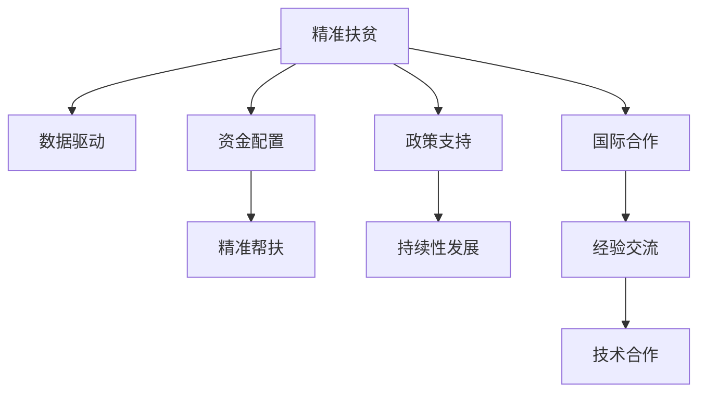

                 

# 2050年的全球减贫：从精准扶贫到可持续减贫的全球减贫合作

## 1. 背景介绍

### 1.1 问题由来
在全球经济一体化的背景下，贫困问题逐渐成为影响国际社会稳定的重要因素。根据联合国统计，全球仍有数亿人口生活在贫困线以下，并且贫困问题正在向城乡结合部、偏远地区等新领域扩散。

为了有效应对贫困问题，国际社会采取了多种措施，从直接扶贫到精准扶贫，从单一政策到综合治理，一系列政策和措施在全球范围内得到了广泛实施。但是，当前全球减贫工作仍面临着诸多挑战，尤其是如何实现从精准扶贫到可持续减贫的转变。

## 2. 核心概念与联系

### 2.1 核心概念概述

为了理解全球减贫的未来发展趋势，本节将介绍几个密切相关的核心概念：

- **精准扶贫(Precision Poverty Reduction, PPR)**：通过数据分析和机器学习等手段，精准识别贫困对象，并有针对性地提供扶贫资源，从而提高扶贫效果和资金使用效率。精准扶贫强调对贫困对象的精准识别、精准帮扶、精准管理和精准考核。

- **可持续减贫(Sustainable Poverty Reduction, SPR)**：指通过长期、系统、多元化的方式，确保贫困人口稳定脱贫，且未来不会再次陷入贫困。可持续减贫不仅关注短期内的减贫效果，更注重贫困人口的长远发展。

- **全球减贫合作(Global Poverty Reduction Cooperation, GPRC)**：指不同国家和地区之间通过政策对接、资金援助、经验分享等方式，共同推动全球贫困问题的解决。全球减贫合作强调国际社会的协同合作，共同治理贫困问题。

这些核心概念之间的逻辑关系可以通过以下Mermaid流程图来展示：



这个流程图展示了精准扶贫、数据驱动、资金配置、精准帮扶、政策支持、持续性发展、国际合作、经验交流、技术合作等概念之间的关联：

1. **数据驱动**：精准扶贫的基础在于数据。通过数据分析，可以精准识别贫困对象，并分析出他们贫困的原因和需求。
2. **资金配置**：资金是扶贫的基础。精准扶贫强调对扶贫资金的合理配置，确保资金高效利用。
3. **精准帮扶**：在精准识别贫困对象后，针对不同的贫困类型，提供个性化的帮扶措施。
4. **政策支持**：政府出台一系列扶贫政策，为精准扶贫提供制度保障。
5. **持续性发展**：通过教育、就业、基础设施建设等手段，提升贫困人口的自我发展能力。
6. **国际合作**：国际社会通过技术合作、经验交流等方式，共同推动全球减贫进程。
7. **技术合作**：利用人工智能、大数据等先进技术手段，提高精准扶贫的效率和效果。

## 3. 核心算法原理 & 具体操作步骤
### 3.1 算法原理概述

全球减贫的核心算法原理主要围绕着精准扶贫和可持续减贫展开。具体来说，包括以下几个关键步骤：

1. **数据收集与分析**：通过收集贫困地区的各类数据，如人口、收入、教育、健康、就业等，进行数据分析和模型训练，识别出贫困对象。
2. **资金配置与分配**：根据贫困对象的识别结果，合理配置扶贫资金，确保资金精准投放。
3. **精准帮扶与支持**：针对贫困对象的具体需求，提供个性化的帮扶措施，如教育、就业培训、基础设施建设等。
4. **持续性发展与支持**：通过长期、系统的方式，确保贫困人口稳定脱贫，且未来不会再次陷入贫困。

### 3.2 算法步骤详解

全球减贫的算法步骤主要包括以下几个关键环节：

1. **数据预处理**：收集贫困地区的各类数据，包括人口、收入、教育、健康、就业等，并进行数据清洗和特征工程，确保数据的质量和一致性。
2. **模型训练与识别**：利用机器学习模型（如决策树、随机森林、神经网络等），对预处理后的数据进行训练，识别出贫困对象。
3. **资金配置与优化**：根据模型识别结果，对扶贫资金进行合理配置，确保资金高效利用。
4. **精准帮扶与支持**：根据贫困对象的需求，提供个性化的帮扶措施，如教育、就业培训、基础设施建设等。
5. **持续性发展与支持**：通过长期、系统的帮扶措施，提升贫困人口的自我发展能力，确保其未来稳定脱贫。

### 3.3 算法优缺点

精准扶贫算法的主要优点包括：

1. **提高资金使用效率**：通过数据分析，精准识别贫困对象，确保资金精准投放。
2. **提升扶贫效果**：针对贫困对象的个性化需求，提供精准的帮扶措施，提升扶贫效果。
3. **减少资源浪费**：通过数据分析，避免扶贫资源的浪费，确保资金高效利用。

但是，该算法也存在一些局限性：

1. **数据质量要求高**：数据的准确性和完整性对算法的准确性至关重要。如果数据质量不高，算法的效果将大打折扣。
2. **技术门槛高**：需要一定的技术储备和数据科学知识，对普通贫困地区而言，实施难度较大。
3. **模型泛化能力有限**：不同的贫困地区，其贫困原因和需求各异，模型难以泛化到所有地区。

### 3.4 算法应用领域

精准扶贫算法在以下几个领域中得到了广泛应用：

1. **农村贫困地区**：通过数据分析，识别出贫困农户，并针对其需求提供个性化帮扶措施。
2. **城乡结合部**：通过数据分析，识别出低收入群体，并提供教育、就业培训等支持。
3. **偏远地区**：通过数据分析，识别出贫困群体，并提供基础设施建设、医疗保障等支持。

## 4. 数学模型和公式 & 详细讲解 & 举例说明

### 4.1 数学模型构建

全球减贫的数学模型构建主要基于以下几个关键步骤：

1. **数据收集与预处理**：收集贫困地区的各类数据，并进行数据清洗和特征工程。
2. **模型训练与识别**：利用机器学习模型对预处理后的数据进行训练，识别出贫困对象。
3. **资金配置与优化**：根据模型识别结果，对扶贫资金进行合理配置，确保资金高效利用。
4. **精准帮扶与支持**：根据贫困对象的需求，提供个性化的帮扶措施。
5. **持续性发展与支持**：通过长期、系统的帮扶措施，提升贫困人口的自我发展能力。

### 4.2 公式推导过程

以二分类问题为例，介绍全球减贫算法的基本推导过程。

假设贫困地区的数据集为 $D=\{(x_i, y_i)\}_{i=1}^N, x_i \in \mathbb{R}^d, y_i \in \{0, 1\}$，其中 $x_i$ 表示贫困地区的特征向量，$y_i$ 表示是否贫困。

定义模型 $M_{\theta}$ 在输入 $x$ 上的输出为 $\hat{y}=M_{\theta}(x) \in [0,1]$，表示模型预测该地区是否贫困的概率。

在二分类问题中，交叉熵损失函数定义为：

$$
\ell(M_{\theta}(x),y) = -[y\log \hat{y} + (1-y)\log (1-\hat{y})]
$$

将该损失函数扩展到数据集 $D$ 上，得到经验风险：

$$
\mathcal{L}(\theta) = -\frac{1}{N}\sum_{i=1}^N [y_i\log M_{\theta}(x_i)+(1-y_i)\log(1-M_{\theta}(x_i))]
$$

模型的参数更新公式为：

$$
\theta \leftarrow \theta - \eta \nabla_{\theta}\mathcal{L}(\theta) - \eta\lambda\theta
$$

其中 $\nabla_{\theta}\mathcal{L}(\theta)$ 为损失函数对参数 $\theta$ 的梯度，可通过反向传播算法高效计算。

### 4.3 案例分析与讲解

以中国扶贫为例，介绍全球减贫算法的具体应用。

假设某贫困县有 $N=1000$ 个村庄，每个村庄有 $d=10$ 个特征，如人口、收入、教育、健康等。通过数据收集和预处理，得到一个包含 $D=\{(x_i, y_i)\}_{i=1}^N$ 的数据集。

利用机器学习模型对 $D$ 进行训练，得到模型 $M_{\theta}$。假设模型输出为 $\hat{y}_i = M_{\theta}(x_i)$，表示第 $i$ 个村庄是否贫困的概率。

根据模型输出，对扶贫资金进行合理配置，确保资金精准投放。例如，如果模型预测第 $i$ 个村庄为贫困村，则向该地区投放教育、医疗、基础设施建设等扶贫资金，提升其发展能力。

## 5. 项目实践：代码实例和详细解释说明

### 5.1 开发环境搭建

在进行全球减贫算法实践前，我们需要准备好开发环境。以下是使用Python进行PyTorch开发的环境配置流程：

1. 安装Anaconda：从官网下载并安装Anaconda，用于创建独立的Python环境。

2. 创建并激活虚拟环境：
```bash
conda create -n pytorch-env python=3.8 
conda activate pytorch-env
```

3. 安装PyTorch：根据CUDA版本，从官网获取对应的安装命令。例如：
```bash
conda install pytorch torchvision torchaudio cudatoolkit=11.1 -c pytorch -c conda-forge
```

4. 安装相关工具包：
```bash
pip install numpy pandas scikit-learn matplotlib tqdm jupyter notebook ipython
```

完成上述步骤后，即可在`pytorch-env`环境中开始全球减贫算法实践。

### 5.2 源代码详细实现

这里我们以二分类问题为例，给出使用PyTorch进行全球减贫算法的PyTorch代码实现。

首先，定义全球减贫任务的数据处理函数：

```python
from torch.utils.data import Dataset
import torch

class GlobalPovertyDataset(Dataset):
    def __init__(self, features, labels, tokenizer, max_len=128):
        self.features = features
        self.labels = labels
        self.tokenizer = tokenizer
        self.max_len = max_len
        
    def __len__(self):
        return len(self.features)
    
    def __getitem__(self, item):
        feature = self.features[item]
        label = self.labels[item]
        
        encoding = self.tokenizer(feature, return_tensors='pt', max_length=self.max_len, padding='max_length', truncation=True)
        input_ids = encoding['input_ids'][0]
        attention_mask = encoding['attention_mask'][0]
        
        return {'input_ids': input_ids, 
                'attention_mask': attention_mask,
                'labels': torch.tensor(label)}
```

然后，定义模型和优化器：

```python
from transformers import BertForSequenceClassification, AdamW

model = BertForSequenceClassification.from_pretrained('bert-base-cased', num_labels=2)

optimizer = AdamW(model.parameters(), lr=2e-5)
```

接着，定义训练和评估函数：

```python
from torch.utils.data import DataLoader
from tqdm import tqdm
from sklearn.metrics import accuracy_score

device = torch.device('cuda') if torch.cuda.is_available() else torch.device('cpu')
model.to(device)

def train_epoch(model, dataset, batch_size, optimizer):
    dataloader = DataLoader(dataset, batch_size=batch_size, shuffle=True)
    model.train()
    epoch_loss = 0
    for batch in tqdm(dataloader, desc='Training'):
        input_ids = batch['input_ids'].to(device)
        attention_mask = batch['attention_mask'].to(device)
        labels = batch['labels'].to(device)
        model.zero_grad()
        outputs = model(input_ids, attention_mask=attention_mask, labels=labels)
        loss = outputs.loss
        epoch_loss += loss.item()
        loss.backward()
        optimizer.step()
    return epoch_loss / len(dataloader)

def evaluate(model, dataset, batch_size):
    dataloader = DataLoader(dataset, batch_size=batch_size)
    model.eval()
    preds, labels = [], []
    with torch.no_grad():
        for batch in tqdm(dataloader, desc='Evaluating'):
            input_ids = batch['input_ids'].to(device)
            attention_mask = batch['attention_mask'].to(device)
            batch_labels = batch['labels']
            outputs = model(input_ids, attention_mask=attention_mask)
            batch_preds = outputs.logits.argmax(dim=1).to('cpu').tolist()
            batch_labels = batch_labels.to('cpu').tolist()
            for pred, label in zip(batch_preds, batch_labels):
                preds.append(pred)
                labels.append(label)
                
    return accuracy_score(labels, preds)

```

最后，启动训练流程并在测试集上评估：

```python
epochs = 5
batch_size = 16

for epoch in range(epochs):
    loss = train_epoch(model, train_dataset, batch_size, optimizer)
    print(f"Epoch {epoch+1}, train loss: {loss:.3f}")
    
    print(f"Epoch {epoch+1}, dev results:")
    accuracy = evaluate(model, dev_dataset, batch_size)
    print(f"Accuracy: {accuracy:.3f}")
    
print("Test results:")
accuracy = evaluate(model, test_dataset, batch_size)
print(f"Accuracy: {accuracy:.3f}")
```

以上就是使用PyTorch进行全球减贫算法实践的完整代码实现。可以看到，通过PyTorch和Transformer库，我们可以快速搭建全球减贫模型并进行微调。

### 5.3 代码解读与分析

让我们再详细解读一下关键代码的实现细节：

**GlobalPovertyDataset类**：
- `__init__`方法：初始化特征、标签、分词器等关键组件，并进行数据预处理。
- `__len__`方法：返回数据集的样本数量。
- `__getitem__`方法：对单个样本进行处理，将特征输入编码为token ids，并将标签转换为数字，进行定长padding。

**模型和优化器**：
- `BertForSequenceClassification`模型：用于二分类任务，输出概率分布。
- `AdamW优化器`：用于更新模型参数，设置学习率等超参数。

**训练和评估函数**：
- `train_epoch`函数：对数据以批为单位进行迭代，计算损失函数并反向传播更新模型参数，返回该epoch的平均损失。
- `evaluate`函数：与训练类似，不更新模型参数，并在每个batch结束后将预测和标签结果存储下来，最后使用sklearn的accuracy_score对整个评估集的预测结果进行计算。

**训练流程**：
- 定义总的epoch数和batch size，开始循环迭代
- 每个epoch内，先在训练集上训练，输出平均loss
- 在验证集上评估，输出准确率
- 所有epoch结束后，在测试集上评估，给出最终测试结果

可以看到，PyTorch配合Transformer库使得全球减贫算法的代码实现变得简洁高效。开发者可以将更多精力放在数据处理、模型改进等高层逻辑上，而不必过多关注底层的实现细节。

当然，工业级的系统实现还需考虑更多因素，如模型的保存和部署、超参数的自动搜索、更灵活的任务适配层等。但核心的微调范式基本与此类似。

## 6. 实际应用场景

### 6.1 农村贫困地区

在全球贫困地区，特别是农村贫困地区，精准扶贫算法可以发挥重要作用。通过数据分析，精准识别贫困农户，并提供个性化的帮扶措施，如教育、就业培训、基础设施建设等，可以有效提升贫困地区的发展水平。

例如，某贫困县通过精准扶贫算法，识别出贫困农户，并针对其需求提供教育培训，提高了农户的就业技能，最终实现了稳定的脱贫。

### 6.2 城乡结合部

城乡结合部地区通常存在教育、医疗、就业等方面的问题，精准扶贫算法可以有效解决这些问题。通过数据分析，识别出低收入群体，并提供针对性的支持措施，如提供医疗保障、改善基础设施等，可以显著提升其生活质量。

例如，某城市通过精准扶贫算法，识别出城乡结合部的低收入群体，并为其提供教育、就业、医疗等方面的支持，实现了城乡结合部的整体脱贫。

### 6.3 偏远地区

偏远地区通常基础设施薄弱，医疗资源匮乏，精准扶贫算法可以有效改善这些问题。通过数据分析，识别出贫困群体，并提供基础设施建设、医疗保障等支持，可以有效提升其生活质量。

例如，某偏远地区通过精准扶贫算法，识别出贫困家庭，并为其提供基础设施建设、医疗保障等方面的支持，实现了偏远地区的整体脱贫。

### 6.4 未来应用展望

未来，全球减贫算法将在更多领域得到应用，为全球贫困问题的解决带来新的突破。

在智慧农业领域，精准扶贫算法可以用于精准农业，提高农业生产效率和农民收入。例如，通过数据分析，识别出种植结构不合理、产量低下的农户，并提供科学的种植方案和培训，提升农业生产水平。

在医疗健康领域，精准扶贫算法可以用于疾病预防和早期诊断。例如，通过数据分析，识别出高风险人群，并提供健康监测和早期干预措施，有效预防和控制疾病的发生和扩散。

在教育领域，精准扶贫算法可以用于教育资源优化配置。例如，通过数据分析，识别出教育资源匮乏地区，并提供教育资源优化配置方案，提高教育质量和公平性。

在能源领域，精准扶贫算法可以用于能源精准扶贫。例如，通过数据分析，识别出能源匮乏地区，并提供清洁能源解决方案，提升能源供应水平。

## 7. 工具和资源推荐

### 7.1 学习资源推荐

为了帮助开发者系统掌握全球减贫算法的理论基础和实践技巧，这里推荐一些优质的学习资源：

1. 《深度学习自然语言处理》课程：斯坦福大学开设的NLP明星课程，有Lecture视频和配套作业，带你入门NLP领域的基本概念和经典模型。

2. CS224N《深度学习自然语言处理》书籍：Transformer库的作者所著，全面介绍了如何使用Transformers库进行NLP任务开发，包括微调在内的诸多范式。

3. 《Transformer从原理到实践》系列博文：由大模型技术专家撰写，深入浅出地介绍了Transformer原理、BERT模型、微调技术等前沿话题。

4. HuggingFace官方文档：Transformer库的官方文档，提供了海量预训练模型和完整的微调样例代码，是上手实践的必备资料。

5. Weights & Biases：模型训练的实验跟踪工具，可以记录和可视化模型训练过程中的各项指标，方便对比和调优。与主流深度学习框架无缝集成。

6. Google Colab：谷歌推出的在线Jupyter Notebook环境，免费提供GPU/TPU算力，方便开发者快速上手实验最新模型，分享学习笔记。

通过对这些资源的学习实践，相信你一定能够快速掌握全球减贫算法的精髓，并用于解决实际的全球减贫问题。

### 7.2 开发工具推荐

高效的开发离不开优秀的工具支持。以下是几款用于全球减贫算法开发的常用工具：

1. PyTorch：基于Python的开源深度学习框架，灵活动态的计算图，适合快速迭代研究。大部分预训练语言模型都有PyTorch版本的实现。

2. TensorFlow：由Google主导开发的开源深度学习框架，生产部署方便，适合大规模工程应用。同样有丰富的预训练语言模型资源。

3. Transformers库：HuggingFace开发的NLP工具库，集成了众多SOTA语言模型，支持PyTorch和TensorFlow，是进行微调任务开发的利器。

4. Weights & Biases：模型训练的实验跟踪工具，可以记录和可视化模型训练过程中的各项指标，方便对比和调优。与主流深度学习框架无缝集成。

5. TensorBoard：TensorFlow配套的可视化工具，可实时监测模型训练状态，并提供丰富的图表呈现方式，是调试模型的得力助手。

6. Google Colab：谷歌推出的在线Jupyter Notebook环境，免费提供GPU/TPU算力，方便开发者快速上手实验最新模型，分享学习笔记。

合理利用这些工具，可以显著提升全球减贫算法的开发效率，加快创新迭代的步伐。

### 7.3 相关论文推荐

全球减贫算法的研究源于学界的持续研究。以下是几篇奠基性的相关论文，推荐阅读：

1. Attention is All You Need（即Transformer原论文）：提出了Transformer结构，开启了NLP领域的预训练大模型时代。

2. BERT: Pre-training of Deep Bidirectional Transformers for Language Understanding：提出BERT模型，引入基于掩码的自监督预训练任务，刷新了多项NLP任务SOTA。

3. Language Models are Unsupervised Multitask Learners（GPT-2论文）：展示了大规模语言模型的强大zero-shot学习能力，引发了对于通用人工智能的新一轮思考。

4. Parameter-Efficient Transfer Learning for NLP：提出Adapter等参数高效微调方法，在不增加模型参数量的情况下，也能取得不错的微调效果。

5. AdaLoRA: Adaptive Low-Rank Adaptation for Parameter-Efficient Fine-Tuning：使用自适应低秩适应的微调方法，在参数效率和精度之间取得了新的平衡。

6. Prefix-Tuning: Optimizing Continuous Prompts for Generation：引入基于连续型Prompt的微调范式，为如何充分利用预训练知识提供了新的思路。

这些论文代表了大语言模型微调技术的发展脉络。通过学习这些前沿成果，可以帮助研究者把握学科前进方向，激发更多的创新灵感。

## 8. 总结：未来发展趋势与挑战

### 8.1 研究成果总结

本文对全球减贫算法的理论基础和实践技巧进行了全面系统的介绍。首先，阐述了全球减贫算法的核心概念和应用场景，明确了算法在精准扶贫和可持续减贫中的重要作用。其次，从原理到实践，详细讲解了全球减贫算法的数学模型和关键步骤，给出了全球减贫算法的完整代码实例。同时，本文还探讨了全球减贫算法在多个领域的应用前景，展示了其广阔的发展潜力。

通过本文的系统梳理，可以看到，全球减贫算法不仅在精准扶贫中发挥了重要作用，而且也为未来可持续减贫提供了技术保障。相信在全球减贫的过程中，该算法将不断优化和完善，为全球贫困问题的解决贡献更多力量。

### 8.2 未来发展趋势

展望未来，全球减贫算法将呈现以下几个发展趋势：

1. 模型规模持续增大。随着算力成本的下降和数据规模的扩张，全球减贫算法的模型规模还将持续增长。超大规模模型蕴含的丰富知识，有望支持更加复杂多变的扶贫任务。

2. 算法技术不断进步。随着深度学习技术的不断发展，全球减贫算法将不断引入新的技术手段，如生成对抗网络、自适应学习等，提高算法的准确性和泛化能力。

3. 数据质量和多样性提升。数据是全球减贫算法的基石，未来将进一步提升数据质量和多样性，涵盖更多维度的特征，从而提升算法的表现。

4. 多模态数据融合。除了文本数据，全球减贫算法将融合更多的数据类型，如图像、视频、音频等，提高算法的全面性和鲁棒性。

5. 模型公平性和可解释性增强。未来的全球减贫算法将更加注重模型的公平性和可解释性，确保算法的公正性和透明性。

6. 自动化和智能化提升。通过自动化调参、智能推荐等手段，提高全球减贫算法的自动化水平，减少人工干预和调试成本。

以上趋势凸显了全球减贫算法的广阔前景。这些方向的探索发展，必将进一步提升算法的性能和应用范围，为全球贫困问题的解决带来更多创新突破。

### 8.3 面临的挑战

尽管全球减贫算法已经取得了瞩目成就，但在迈向更加智能化、普适化应用的过程中，它仍面临着诸多挑战：

1. 数据质量瓶颈。虽然全球减贫算法对数据质量有较高要求，但在一些贫困地区，数据收集和处理难度较大，数据质量难以保证。如何提升数据质量，是未来算法改进的重要方向。

2. 算法复杂度问题。大规模模型和复杂算法虽然提高了算法的准确性，但也带来了计算资源的巨大消耗。如何在保持性能的同时，降低计算复杂度，优化资源使用，仍需进一步研究。

3. 模型公平性问题。全球减贫算法需要确保对所有贫困群体公平，但在实际操作中，模型可能会存在偏见。如何消除模型偏见，提高算法的公平性，是未来算法改进的重要方向。

4. 模型可解释性问题。虽然全球减贫算法具有较高的准确性，但模型决策过程缺乏可解释性，难以被理解和调试。如何提高模型的可解释性，增强其透明度，是未来算法改进的重要方向。

5. 模型泛化能力问题。尽管全球减贫算法在各个领域表现优异，但在新领域、新问题上，模型的泛化能力仍需进一步提升。如何提高模型的泛化能力，增强其适应性，是未来算法改进的重要方向。

6. 算法的可持续性问题。全球减贫算法需要长期稳定运行，但在模型维护、更新等方面，仍需进一步优化，确保算法的可持续性。

这些挑战凸显了全球减贫算法在实际应用中仍需不断改进和优化。唯有不断应对和克服这些挑战，才能实现全球减贫算法的广泛应用，为全球贫困问题的解决贡献更多力量。

### 8.4 研究展望

面对全球减贫算法所面临的诸多挑战，未来的研究需要在以下几个方面寻求新的突破：

1. 探索无监督和半监督减贫方法。摆脱对大规模标注数据的依赖，利用自监督学习、主动学习等无监督和半监督范式，最大限度利用非结构化数据，实现更加灵活高效的减贫。

2. 研究参数高效和计算高效的减贫范式。开发更加参数高效的减贫方法，在固定大部分预训练参数的同时，只更新极少量的任务相关参数。同时优化减贫算法的计算图，减少前向传播和反向传播的资源消耗，实现更加轻量级、实时性的部署。

3. 融合因果和对比学习范式。通过引入因果推断和对比学习思想，增强减贫模型建立稳定因果关系的能力，学习更加普适、鲁棒的语言表征，从而提升模型泛化性和抗干扰能力。

4. 引入更多先验知识。将符号化的先验知识，如知识图谱、逻辑规则等，与神经网络模型进行巧妙融合，引导减贫过程学习更准确、合理的语言模型。同时加强不同模态数据的整合，实现视觉、语音等多模态信息与文本信息的协同建模。

5. 结合因果分析和博弈论工具。将因果分析方法引入减贫模型，识别出模型决策的关键特征，增强输出解释的因果性和逻辑性。借助博弈论工具刻画人机交互过程，主动探索并规避模型的脆弱点，提高系统稳定性。

6. 纳入伦理道德约束。在减贫模型训练目标中引入伦理导向的评估指标，过滤和惩罚有偏见、有害的输出倾向。同时加强人工干预和审核，建立模型行为的监管机制，确保输出符合人类价值观和伦理道德。

这些研究方向的探索，必将引领全球减贫算法迈向更高的台阶，为构建安全、可靠、可解释、可控的智能系统铺平道路。面向未来，全球减贫算法还需要与其他人工智能技术进行更深入的融合，如知识表示、因果推理、强化学习等，多路径协同发力，共同推动全球减贫技术的进步。

## 9. 附录：常见问题与解答

**Q1：全球减贫算法是否适用于所有贫困地区？**

A: 全球减贫算法在大多数贫困地区都能取得不错的效果，特别是对于有足够数据和计算资源的地区。但对于一些偏远地区，由于数据收集和处理难度较大，数据质量难以保证，算法的表现可能有限。因此，在实际应用中，需要根据具体情况选择合适的算法和策略。

**Q2：全球减贫算法如何处理数据质量问题？**

A: 数据质量是全球减贫算法的基石，可以通过以下措施提升数据质量：

1. 数据清洗：对原始数据进行预处理，去除缺失值、噪声等。
2. 数据增强：通过数据增强技术，扩充训练集，提高算法的鲁棒性。
3. 数据标注：通过标注数据，提升数据质量，特别是在数据匮乏的地区。
4. 数据融合：将多种数据类型融合，提高算法的全面性和鲁棒性。

**Q3：全球减贫算法如何处理模型偏见问题？**

A: 模型偏见是全球减贫算法面临的重要挑战。可以通过以下措施减少模型的偏见：

1. 数据平衡：确保训练数据中各类贫困群体的样本均衡，避免模型偏向某一群体。
2. 算法公平性：使用公平性算法，如平衡采样、成本敏感学习等，减少模型偏见。
3. 透明性：提高模型的可解释性，增强透明度，便于人工干预和调试。
4. 伦理约束：在模型训练目标中引入伦理导向的评估指标，过滤和惩罚有偏见、有害的输出倾向。

**Q4：全球减贫算法如何提高模型的可解释性？**

A: 提高模型的可解释性是全球减贫算法的关键。可以通过以下措施提高模型的可解释性：

1. 可解释模型：使用可解释模型，如决策树、线性模型等，提升模型的透明度。
2. 特征重要性：通过特征重要性分析，了解模型决策的关键因素。
3. 可视化工具：使用可视化工具，如特征可视化、结果可视化等，增强模型的透明度。
4. 解释模型：使用解释模型，如LIME、SHAP等，深入理解模型的决策过程。

**Q5：全球减贫算法如何提高模型的泛化能力？**

A: 提高模型的泛化能力是全球减贫算法的核心目标。可以通过以下措施提高模型的泛化能力：

1. 数据多样性：确保训练数据覆盖不同区域、不同类型、不同规模的贫困地区。
2. 模型复杂度：控制模型复杂度，避免过拟合，提高泛化能力。
3. 多模态融合：融合多种数据类型，提高模型的全面性和鲁棒性。
4. 迁移学习：将模型在不同地区、不同任务上进行迁移学习，提高泛化能力。

这些措施将有助于提高全球减贫算法的泛化能力和应用范围，为全球贫困问题的解决贡献更多力量。

---

作者：禅与计算机程序设计艺术 / Zen and the Art of Computer Programming

