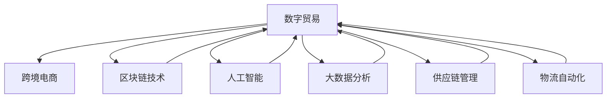

                 

# 2050年的全球贸易：从跨境电商到数字贸易的贸易数字化转型

> 关键词：
    - 数字贸易
    - 跨境电商
    - 供应链管理
    - 区块链技术
    - 人工智能
    - 大数据分析
    - 物流自动化

## 1. 背景介绍

随着数字经济和互联网技术的飞速发展，全球贸易方式正在经历一场深刻的变革。传统的跨境电商正在逐步演进为数字贸易，这不仅改变了企业经营模式，也为全球经济的可持续发展提供了新的机遇与挑战。本文旨在探索2050年全球贸易的数字化转型路径，从跨境电商到数字贸易，并分析其中关键技术的应用。

### 1.1 数字化转型的必要性

数字化转型不仅是应对全球化和技术进步的必然选择，更是提升企业竞争力、实现可持续发展的重要手段。随着互联网、物联网、人工智能、大数据等技术的成熟和普及，全球贸易正从依赖线下实体店铺和物流运输的跨境电商，向基于数字平台和数据驱动的数字贸易转型。这不仅提高了交易效率，还降低了运营成本，优化了供应链管理，为全球经济注入了新的活力。

### 1.2 数字化转型的关键因素

要实现全球贸易的数字化转型，关键在于以下三个方面：

1. **数字平台建设**：构建强大的数字平台，提供智能化的交易和物流服务。
2. **数据驱动决策**：利用大数据分析优化供应链管理和客户服务。
3. **技术融合应用**：将区块链、人工智能等新兴技术融入贸易流程中，提高交易透明度和安全性。

## 2. 核心概念与联系

### 2.1 核心概念概述

要全面理解数字化转型的过程，首先需要理解一些核心概念及其相互联系。

- **数字贸易**：指基于互联网和数字技术的国际贸易，包括在线交易、数字化物流、数字支付等。
- **跨境电商**：指在互联网上进行的跨国商品和服务的交易活动，是数字贸易的早期形态。
- **区块链技术**：一种去中心化的分布式账本技术，为数字贸易提供了透明、安全的交易环境。
- **人工智能**：通过机器学习和大数据分析，帮助企业优化决策和提高运营效率。
- **大数据分析**：利用先进的数据处理技术，从海量数据中提取有价值的信息，为数字化决策提供依据。
- **供应链管理**：通过数字化手段优化供应链流程，提高供应链的透明度和效率。
- **物流自动化**：利用机器人、自动化仓库等技术，实现物流的智能化和自动化。

这些概念共同构成了全球贸易数字化转型的基础框架，通过合理应用这些技术，可以大幅提升贸易效率，降低成本，推动全球经济的可持续发展。

### 2.2 核心概念之间的联系

核心概念之间的关系可以通过以下Mermaid流程图来展示：



这个流程图展示了数字贸易与其他核心概念之间的相互依赖关系：

1. 数字贸易由跨境电商演化而来，而区块链、人工智能、大数据分析、供应链管理和物流自动化等技术为其提供了支撑。
2. 区块链技术保证了交易的透明和不可篡改，人工智能和大数据分析帮助企业做出更智能的决策，供应链管理优化了交易流程，物流自动化提高了物流效率。

## 3. 核心算法原理 & 具体操作步骤

### 3.1 算法原理概述

数字贸易的数字化转型过程可以通过以下算法原理进行概述：

1. **数据收集与整合**：从全球各地的供应商、客户、物流和支付系统等渠道收集数据，整合到一个统一的数字化平台上。
2. **数据清洗与处理**：对收集到的数据进行清洗和处理，去除噪音和错误，提取有用信息。
3. **分析与建模**：利用人工智能和大数据分析技术，建立预测模型，优化供应链和库存管理。
4. **区块链技术应用**：将交易信息记录在区块链上，确保交易的透明和不可篡改。
5. **智能决策与执行**：基于分析结果，智能决策并执行，实现交易和物流的自动化。

### 3.2 算法步骤详解

以下是数字贸易数字化转型过程中具体的算法步骤：

#### Step 1: 数据收集与整合

**数据来源**：
- **供应商数据**：包含商品信息、价格、库存量等。
- **客户数据**：包括订单信息、评价、反馈等。
- **物流数据**：涉及运输、仓储、配送等信息。
- **支付数据**：包括支付记录、支付渠道、支付成功率等。

**整合流程**：
1. 通过API接口和数据交换协议，从各个数据源收集数据。
2. 使用数据清洗工具，去除重复、不准确和无关的数据。
3. 将清洗后的数据导入统一的数字化平台，实现数据整合。

#### Step 2: 数据清洗与处理

**数据清洗**：
- **去重**：去除重复记录，确保数据的唯一性。
- **校正**：纠正数据中的错误，如错别字、格式不一致等。
- **标准化**：统一数据格式，方便后续分析。

**数据处理**：
- **集成**：将不同数据源的数据进行集成，形成一个统一的数据集。
- **归档**：将历史数据归档，方便后续查询和分析。

#### Step 3: 分析与建模

**数据分析**：
- **描述性分析**：对数据进行基本统计分析，如均值、方差、分布等。
- **探索性分析**：发现数据中的趋势和模式，如时间序列分析、聚类分析等。

**建立模型**：
- **预测模型**：使用机器学习算法，建立商品需求预测模型、库存优化模型等。
- **优化模型**：利用最优化算法，优化供应链流程和物流调度。

#### Step 4: 区块链技术应用

**数据上链**：
- **交易记录上链**：将每次交易的详细信息记录在区块链上。
- **智能合约**：利用智能合约自动执行交易，无需第三方干预。

**数据查询**：
- **透明性**：所有交易记录公开可查，提高透明度。
- **安全性**：数据上链后不可篡改，保障交易安全。

#### Step 5: 智能决策与执行

**决策支持**：
- **数据可视化**：将分析结果通过图表形式展示，支持智能决策。
- **实时分析**：利用实时数据，进行动态调整和优化。

**执行自动化**：
- **智能调度**：基于预测模型和实时数据，智能调度物流和库存。
- **自动交易**：智能合约自动执行交易，提高效率。

### 3.3 算法优缺点

数字贸易的数字化转型算法具有以下优点：

1. **高效性**：通过数据整合和自动化执行，显著提高了交易和物流的效率。
2. **透明性**：区块链技术保证了交易的透明和不可篡改，提升了信任度。
3. **准确性**：利用大数据分析和人工智能，提高了决策的准确性和科学性。

同时，该算法也存在一些局限性：

1. **数据质量依赖**：算法的准确性和效率高度依赖于数据的完整性和准确性。
2. **技术成本高**：区块链和人工智能等技术的实施成本较高，初期投入较大。
3. **安全性问题**：区块链虽然提升了数据安全性，但仍有被攻击的风险。
4. **技术依赖**：对数字化平台和技术的依赖程度较高，技术维护成本高。

### 3.4 算法应用领域

数字贸易的数字化转型算法主要应用于以下几个领域：

1. **跨境电商**：通过数字平台和物流自动化，实现跨境商品的在线销售。
2. **供应链管理**：优化供应链流程，提升供应链效率和透明度。
3. **物流配送**：利用自动化和智能调度，提高物流配送效率和准确性。
4. **金融支付**：通过区块链技术，保障支付的安全和透明。
5. **客户服务**：利用大数据分析，提升客户满意度和忠诚度。

## 4. 数学模型和公式 & 详细讲解 & 举例说明

### 4.1 数学模型构建

数字贸易的数字化转型过程可以通过以下数学模型进行建模：

$$
\begin{aligned}
& \min \limits_{x} \mathcal{L}(x) = \mathbb{E}[\ell(x, y)] + \lambda \|w\|^2 \\
& \text{s.t.} \quad y = f(x) + \epsilon
\end{aligned}
$$

其中，$\mathcal{L}(x)$ 为损失函数，$\ell(x, y)$ 为单个样本的损失，$y$ 为真实标签，$f(x)$ 为预测函数，$\epsilon$ 为噪声，$w$ 为模型参数，$\lambda$ 为正则化系数。

### 4.2 公式推导过程

假设有一个线性回归模型，其预测函数为 $y = wx + b$，其中 $w$ 为模型参数，$x$ 为输入特征，$b$ 为截距。利用最小二乘法，求解模型参数 $w$，使得预测误差最小化。

根据最小二乘法，目标函数为：

$$
\min \limits_{w, b} \sum_{i=1}^n (y_i - (wx_i + b))^2
$$

为了简化计算，引入均方误差损失函数：

$$
\ell(w, b, x_i, y_i) = (y_i - (wx_i + b))^2
$$

总体损失函数为：

$$
\mathcal{L}(w, b) = \frac{1}{2n} \sum_{i=1}^n (y_i - (wx_i + b))^2 + \frac{\lambda}{2} \|w\|^2
$$

其中，$\lambda$ 为正则化系数，控制模型复杂度。

求解该最小化问题，可以得到最优参数 $w$ 和 $b$。利用梯度下降法，每次迭代更新模型参数：

$$
w \leftarrow w - \eta \nabla \mathcal{L}(w, b)
$$

其中，$\eta$ 为学习率，$\nabla \mathcal{L}(w, b)$ 为损失函数对模型参数的梯度。

### 4.3 案例分析与讲解

**案例分析**：假设有一个在线零售平台，需要优化商品库存和物流配送。通过分析历史销售数据，建立预测模型，优化库存水平。利用实时数据，智能调度物流，提高配送效率。

**讲解**：
1. **数据收集**：从订单、销售、库存、物流等渠道收集数据。
2. **数据清洗**：去除重复记录，校正错误，标准化数据格式。
3. **模型建立**：利用历史销售数据，建立商品需求预测模型，优化库存水平。
4. **区块链应用**：将每次交易记录在区块链上，确保透明度和安全性。
5. **智能调度**：利用预测模型和实时数据，智能调度物流和库存。

## 5. 项目实践：代码实例和详细解释说明

### 5.1 开发环境搭建

在进行项目实践前，需要搭建合适的开发环境。以下是使用Python进行项目开发的环境配置流程：

1. 安装Anaconda：从官网下载并安装Anaconda，用于创建独立的Python环境。
2. 创建并激活虚拟环境：
```bash
conda create -n digital-trade python=3.8 
conda activate digital-trade
```

3. 安装PyTorch、Pandas、NumPy等必要库：
```bash
pip install torch pandas numpy
```

4. 安装相关框架：
```bash
pip install flask dask
```

5. 安装区块链开发工具：
```bash
pip install web3 pysha3
```

完成上述步骤后，即可在`digital-trade`环境中开始项目实践。

### 5.2 源代码详细实现

以下是一个简单的基于区块链的数字贸易平台示例代码实现。

```python
from flask import Flask, request, jsonify
from web3 import Web3
from pysha3 import keccak_256

app = Flask(__name__)

# 区块链连接
web3 = Web3(Web3.HTTPProvider('http://127.0.0.1:8545'))

# 智能合约地址
contract_address = '0x1234567890abcdef'

@app.route('/transaction', methods=['POST'])
def handle_transaction():
    # 获取请求参数
    data = request.json
    sender = data['sender']
    recipient = data['recipient']
    amount = data['amount']
    
    # 生成交易哈希
    tx_hash = keccak_256((str(sender) + str(recipient) + str(amount)).encode('utf-8')).hexdigest()
    
    # 构造交易
    tx_data = {
        'to': recipient,
        'value': amount,
        'gas': 200000,
        'gasPrice': 10,
        'nonce': web3.eth.getTransactionCount(sender)
    }
    
    # 发送交易
    tx = web3.eth.account.signTransaction(tx_data, sender)
    tx_hash = web3.eth.sendRawTransaction(tx.rawTransaction)
    
    # 返回交易哈希
    return jsonify({'tx_hash': tx_hash.hex()})

if __name__ == '__main__':
    app.run(host='0.0.0.0', port=5000)
```

### 5.3 代码解读与分析

让我们详细解读一下关键代码的实现细节：

**Flask框架**：
- **应用初始化**：使用Flask创建Web应用程序，设置路由。
- **区块链连接**：通过Web3库连接本地区块链，获取交易相关接口。

**交易处理**：
- **请求获取**：通过API接口接收交易请求。
- **哈希生成**：将交易数据转换为二进制形式，生成哈希值。
- **交易构造**：将交易参数构造成交易数据。
- **交易发送**：使用Web3库发送交易，获取交易哈希。

**响应返回**：
- **交易哈希**：将交易哈希转换为十六进制字符串，返回给客户端。

## 6. 实际应用场景

### 6.1 智能供应链管理

数字贸易的数字化转型技术在智能供应链管理中得到了广泛应用。通过区块链和人工智能技术，可以实现供应链的透明度和自动化管理。

**案例**：某全球制造企业，利用区块链技术记录物流信息，使用AI预测供应链需求，优化库存和物流调度，提高供应链效率和响应速度。

**实施步骤**：
1. **数据收集**：从供应商、物流、库存等系统收集数据，整合到统一平台。
2. **区块链应用**：将每次物流和库存变化记录在区块链上，确保透明和不可篡改。
3. **AI预测**：利用历史数据和实时数据，建立需求预测模型，优化库存。
4. **智能调度**：根据预测结果，智能调度物流和库存，提高效率。

### 6.2 跨境电商平台

跨境电商是数字贸易的重要应用场景之一，通过数字化转型，可以实现更加高效、便捷的在线交易和物流服务。

**案例**：某跨境电商平台，利用区块链技术保障交易安全，使用AI和大数据分析优化商品推荐和库存管理，提升用户体验和销售转化率。

**实施步骤**：
1. **数据收集**：从订单、评价、反馈等渠道收集数据。
2. **区块链应用**：将每次交易记录在区块链上，确保透明和不可篡改。
3. **AI推荐**：利用历史数据和实时数据，建立商品推荐模型，优化商品展示和推荐。
4. **库存管理**：利用预测模型和实时数据，优化库存水平，提升用户满意度。

### 6.3 数字金融支付

数字贸易的数字化转型技术也在金融支付领域得到广泛应用，通过区块链技术保障支付安全，提升支付效率。

**案例**：某金融科技公司，利用区块链技术记录交易信息，使用AI和大数据分析优化支付流程，提升支付成功率和用户满意度。

**实施步骤**：
1. **数据收集**：从支付记录、支付渠道等渠道收集数据。
2. **区块链应用**：将每次交易记录在区块链上，确保透明和不可篡改。
3. **AI优化**：利用历史数据和实时数据，优化支付流程，提升支付成功率。
4. **智能合约**：利用智能合约自动执行交易，提高支付效率。

### 6.4 未来应用展望

未来，随着技术的不断进步，数字贸易的数字化转型将更加深入和广泛。以下是几个可能的应用方向：

1. **全球贸易标准化**：通过区块链技术，建立全球统一的贸易标准和规则，提升国际贸易效率。
2. **智能合约普及**：利用智能合约技术，实现自动化的交易执行，减少中间环节，提高交易效率。
3. **跨领域融合**：结合物联网、云计算、5G等技术，实现跨领域的数字化转型，推动全球经济的全面智能化。
4. **可持续发展**：利用大数据和AI技术，优化资源配置，实现绿色生产和贸易，促进全球可持续发展。

## 7. 工具和资源推荐

### 7.1 学习资源推荐

为了帮助开发者系统掌握数字贸易的数字化转型技术，以下是一些优质的学习资源：

1. **《区块链基础》**：一本详细介绍区块链技术的书籍，适合入门学习。
2. **《人工智能基础》**：一本详细介绍人工智能技术的书籍，涵盖机器学习、深度学习等内容。
3. **《大数据技术与应用》**：一本详细介绍大数据技术的书籍，涵盖数据收集、处理、分析等内容。
4. **《Python编程与数据分析》**：一本详细介绍Python编程和数据分析的书籍，适合实践应用。
5. **Kaggle平台**：一个提供数据集和竞赛的平台，可以用于实践数据科学和机器学习技术。

通过对这些资源的学习实践，相信你一定能够快速掌握数字贸易的数字化转型技术，并用于解决实际的贸易问题。

### 7.2 开发工具推荐

高效的开发离不开优秀的工具支持。以下是几款用于数字贸易数字化转型开发的常用工具：

1. **Python编程语言**：一种通用性强、功能丰富的编程语言，适合开发各种应用。
2. **Flask框架**：一个轻量级的Web框架，适合构建数字贸易平台和API接口。
3. **Dask框架**：一个分布式计算框架，适合处理大数据集和复杂计算。
4. **Web3库**：一个与以太坊网络交互的库，适合开发区块链应用。
5. **Jupyter Notebook**：一个交互式笔记本，适合进行数据科学和机器学习实践。

合理利用这些工具，可以显著提升数字贸易数字化转型的开发效率，加快创新迭代的步伐。

### 7.3 相关论文推荐

数字贸易的数字化转型技术发展迅速，以下是几篇奠基性的相关论文，推荐阅读：

1. **《区块链技术在供应链中的应用》**：介绍区块链技术在供应链中的应用，提高供应链的透明度和效率。
2. **《人工智能在智能合约中的应用》**：介绍人工智能技术在智能合约中的应用，提高合约执行的准确性和自动化程度。
3. **《大数据分析在数字贸易中的应用》**：介绍大数据分析在数字贸易中的应用，优化供应链和客户服务。
4. **《区块链与跨境电商的融合》**：介绍区块链技术在跨境电商中的应用，提高交易安全性和透明度。

这些论文代表了大数字贸易数字化转型的发展脉络。通过学习这些前沿成果，可以帮助研究者把握学科前进方向，激发更多的创新灵感。

## 8. 总结：未来发展趋势与挑战

### 8.1 研究成果总结

数字贸易的数字化转型技术已经在多个领域得到了广泛应用，取得了显著的成效。以下是一些关键的研究成果：

1. **区块链技术的应用**：通过区块链技术，提高了交易的透明度和安全性，提升了供应链和金融支付的效率。
2. **人工智能和大数据分析**：利用AI和大数据分析技术，优化供应链管理和客户服务，提高了运营效率和客户满意度。
3. **物流自动化和智能调度**：通过物流自动化和智能调度，提高了物流配送的效率和准确性，降低了运营成本。
4. **跨领域融合**：结合物联网、云计算、5G等技术，推动了数字贸易的全面智能化。

### 8.2 未来发展趋势

展望未来，数字贸易的数字化转型技术将呈现以下几个发展趋势：

1. **技术融合深化**：区块链、人工智能、大数据等技术的深度融合，将进一步提升数字贸易的智能化水平。
2. **生态系统完善**：构建完整的数字贸易生态系统，涵盖供应链、金融、物流等多个环节，实现全面数字化。
3. **全球标准化**：建立全球统一的贸易标准和规则，推动国际贸易的标准化和高效化。
4. **可持续发展**：利用数字化转型技术，优化资源配置，推动绿色生产和贸易，促进全球可持续发展。

### 8.3 面临的挑战

尽管数字贸易的数字化转型技术已经取得了瞩目成就，但在迈向更加智能化、普适化应用的过程中，它仍面临着诸多挑战：

1. **数据隐私和安全**：在数字贸易中，数据隐私和安全问题尤为突出，需要采取严格的数据保护措施。
2. **技术标准化**：数字贸易的数字化转型技术需要全球标准化，以确保不同平台和系统之间的兼容性和互操作性。
3. **成本问题**：数字化转型的初始投入较高，中小型企业难以承受，需要探索低成本的解决方案。
4. **技术复杂性**：数字贸易的数字化转型涉及多种技术和工具，需要综合运用，增加了技术的复杂性。
5. **人才短缺**：数字化转型需要具备多种技术和知识的复合型人才，但目前市场上相关人才较为稀缺。

### 8.4 研究展望

未来，数字贸易的数字化转型技术还需要在以下几个方面寻求新的突破：

1. **技术创新**：进一步优化区块链、人工智能和大数据分析技术，提升数字贸易的智能化水平。
2. **降低成本**：探索低成本的数字化转型解决方案，使得更多企业能够参与其中。
3. **标准化建设**：推动数字贸易技术的全球标准化，促进全球经济的互联互通。
4. **人才培养**：加强数字化转型技术的人才培养，提升全球技术水平。

通过技术创新和标准化的推进，数字贸易的数字化转型技术必将迎来更加广阔的发展前景，为全球经济的可持续发展注入新的动力。

## 9. 附录：常见问题与解答

**Q1：数字贸易的数字化转型如何提高贸易效率？**

A: 数字贸易的数字化转型主要通过以下几个方面提高贸易效率：

1. **数据整合**：通过数据整合，统一交易和物流信息，提高数据的准确性和可访问性。
2. **自动化处理**：利用人工智能和大数据分析技术，自动化处理订单、库存和物流等事务，减少人工干预。
3. **实时监测**：通过实时数据监测，动态调整交易和物流流程，优化资源配置。
4. **智能决策**：利用智能算法和决策支持系统，提高决策的准确性和效率。

这些措施的综合应用，显著提高了数字贸易的运营效率和客户满意度。

**Q2：数字贸易的数字化转型技术有哪些？**

A: 数字贸易的数字化转型技术主要包括以下几个方面：

1. **区块链技术**：通过去中心化的分布式账本，提升交易的透明性和安全性。
2. **人工智能**：利用机器学习和数据分析技术，优化供应链和客户服务。
3. **大数据分析**：利用先进的数据处理技术，提取有价值的信息，支持智能决策。
4. **物流自动化**：利用自动化和智能调度，提高物流效率和准确性。
5. **智能合约**：利用区块链和AI技术，实现自动化的交易执行。

这些技术共同构成了数字贸易数字化转型的基础框架。

**Q3：数字贸易的数字化转型技术存在哪些局限性？**

A: 数字贸易的数字化转型技术虽然带来了诸多优势，但也存在一些局限性：

1. **数据隐私和安全**：在数据收集和处理过程中，存在隐私泄露和数据安全问题，需要严格的数据保护措施。
2. **技术标准化**：不同的平台和系统之间可能存在兼容性问题，需要建立全球标准。
3. **成本问题**：数字化转型的初始投入较高，中小企业难以承受，需要探索低成本的解决方案。
4. **技术复杂性**：涉及多种技术和工具，增加了技术的复杂性和学习难度。
5. **人才短缺**：数字化转型需要具备多种技术和知识的复合型人才，但市场上相关人才较为稀缺。

这些局限性需要通过技术创新和标准化的推进，逐步解决。

**Q4：数字贸易的数字化转型技术如何应对未来挑战？**

A: 数字贸易的数字化转型技术应对未来挑战的主要方向包括：

1. **技术创新**：进一步优化区块链、人工智能和大数据分析技术，提升数字贸易的智能化水平。
2. **降低成本**：探索低成本的数字化转型解决方案，使得更多企业能够参与其中。
3. **标准化建设**：推动数字贸易技术的全球标准化，促进全球经济的互联互通。
4. **人才培养**：加强数字化转型技术的人才培养，提升全球技术水平。

这些方向将为数字贸易的数字化转型提供持续动力，推动全球经济的可持续发展。

---

作者：禅与计算机程序设计艺术 / Zen and the Art of Computer Programming

