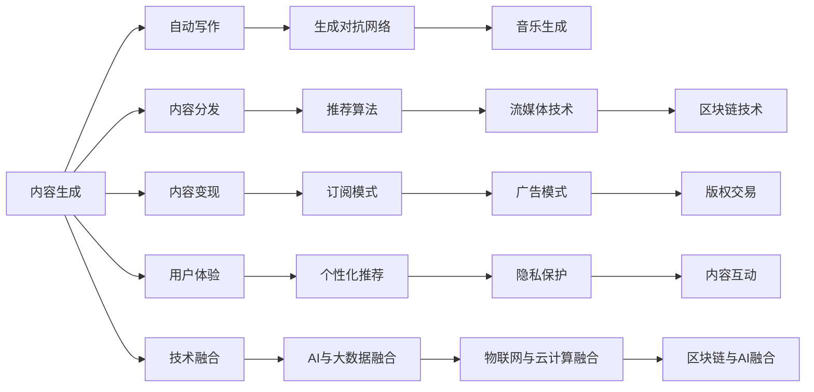

                 

# 2050年的数字创意：从内容生产到价值变现的产业升级

## 1. 背景介绍

### 1.1 问题由来

在数字技术的快速迭代和普及下，我们正进入一个全新的数字创意时代。这一时代，内容生产方式和价值变现机制正在发生革命性的变化。随着人工智能、大数据、物联网等技术的融合应用，内容创作从手工劳动逐渐向智能生产转变，内容消费从被动接受转向主动参与。

从内容生产到价值变现，产业链条愈加复杂，需求与供给关系也变得更加动态多变。内容生产商需要考虑如何高效生成高质量内容，并据此进行精准分发和推广，以实现商业变现；内容消费者期待获得更个性化的内容体验，同时希望在数据隐私和安全方面得到更好的保障。

在这个背景下，如何通过数字技术创新，实现内容创作的智能化、内容分发的精准化和内容变现的效益化，成为亟待解决的关键问题。本文将深入探讨数字创意产业的现状与挑战，分析关键技术和趋势，以期为未来的产业发展提供有价值的见解。

### 1.2 问题核心关键点

为更好地理解数字创意产业的演变，本节将介绍几个核心的关键点：

- **内容生成**：指利用AI技术自动创作文本、图像、音乐、视频等内容。
- **内容分发**：将生成的内容进行精准推送至目标受众，通过平台、算法、推荐系统等手段优化用户体验。
- **内容变现**：通过订阅、广告、付费阅读、二次开发等方式实现内容生产的商业化变现。
- **用户体验**：确保内容质量、提供个性化推荐、保障数据隐私，提升用户体验和满意度。
- **技术融合**：推动AI、大数据、云计算、物联网等技术的融合应用，提升产业整体智能化水平。

这些核心概念之间互相联系，共同构成了数字创意产业的基础框架。

## 2. 核心概念与联系

### 2.1 核心概念概述

为了更好地理解数字创意产业，本节将对核心概念进行概述。

- **内容生成**：
  - **自动写作**：使用AI技术生成文章、报告、新闻等文本内容。
  - **生成对抗网络**（GANs）：通过生成模型和判别模型的对抗训练生成高质量图像、视频等。
  - **音乐生成**：基于深度学习模型生成音乐作品。

- **内容分发**：
  - **推荐算法**：通过协同过滤、深度学习等方法，为用户提供个性化的内容推荐。
  - **流媒体技术**：通过CDN、边缘计算等技术，实现内容的高效、低延迟分发。
  - **区块链技术**：保障内容版权，优化内容分发和变现模式。

- **内容变现**：
  - **订阅模式**：用户订阅内容创作者，支付月费、年费等获得独家内容。
  - **广告模式**：内容创作者通过广告收入变现。
  - **版权交易**：内容创作商通过授权、版权转让等方式实现二次变现。

- **用户体验**：
  - **个性化推荐**：利用用户行为数据，提供个性化的内容推荐，提升用户粘性。
  - **隐私保护**：通过加密、去标识化等技术，保障用户数据隐私。
  - **内容互动**：增加用户与内容之间的互动，提高用户参与度。

- **技术融合**：
  - **AI与大数据融合**：通过AI算法处理海量数据，实现内容生成和推荐。
  - **物联网与云计算融合**：实现边缘计算和内容分发，提升用户体验。
  - **区块链与AI融合**：利用区块链技术保障版权，实现内容变现的多样化。

### 2.2 核心概念原理和架构的 Mermaid 流程图



以上图表展示了数字创意产业的核心概念及其之间的关系：

1. **内容生成**：从自动写作到音乐生成，展现了AI技术在内容创作中的应用。
2. **内容分发**：从推荐算法到流媒体技术，展示了内容分发环节的技术手段。
3. **内容变现**：从订阅模式到版权交易，介绍了内容变现的不同途径。
4. **用户体验**：从个性化推荐到内容互动，强调了提升用户体验的重要性。
5. **技术融合**：从AI与大数据的融合到区块链与AI的融合，展示了技术发展的前沿趋势。

## 3. 核心算法原理 & 具体操作步骤

### 3.1 算法原理概述

数字创意产业的核心算法原理主要围绕内容生成、内容分发和内容变现展开。以下将从这三个方面详细介绍其算法原理。

#### 3.1.1 内容生成

内容生成算法主要包括自动写作、生成对抗网络和音乐生成。

- **自动写作**：使用基于Transformer架构的模型（如GPT-3）进行文本生成。模型通过大量文本数据的预训练，学习语言模式和语法结构，生成连贯、高质量的文本内容。
- **生成对抗网络**：通过生成器和判别器的对抗训练，生成逼真的图像、视频等。GAN模型利用大量标注数据进行训练，生成高质量内容的同时，保留了艺术风格和创意。
- **音乐生成**：使用循环神经网络（RNN）和变分自编码器（VAE）等模型，基于音乐结构生成新的音乐作品。

#### 3.1.2 内容分发

内容分发算法主要涉及推荐算法和流媒体技术。

- **推荐算法**：包括协同过滤、基于矩阵分解的方法、深度学习推荐系统等。协同过滤算法通过分析用户行为，推荐相似物品；矩阵分解方法通过降维，发现用户和物品的隐含特征；深度学习推荐系统则利用神经网络，优化推荐效果。
- **流媒体技术**：包括内容分发网络（CDN）、边缘计算、缓存技术等。CDN通过全球分布的节点，实现内容的高速缓存和分发；边缘计算通过在用户端进行计算，减少延迟；缓存技术则进一步提升内容访问速度。

#### 3.1.3 内容变现

内容变现算法主要包括订阅模式、广告模式和版权交易。

- **订阅模式**：用户通过付费订阅内容创作者，获取独家内容或服务。订阅模式通常需要建立强大的用户管理和支付系统。
- **广告模式**：内容创作者通过在内容中插入广告，实现内容变现。广告模式需要精准定位广告受众，优化广告展示效果。
- **版权交易**：内容创作商通过授权或转让版权，获得收益。版权交易需要构建完善的版权管理和交易平台。

### 3.2 算法步骤详解

接下来，将详细介绍数字创意产业中各个环节的具体操作步骤。

#### 3.2.1 内容生成

**操作步骤**：

1. **数据预处理**：收集和清洗大量的文本、图像、音频等数据。
2. **模型训练**：使用预训练模型进行微调或进行新的模型训练。例如，使用GPT-3模型进行文本生成，使用GANs生成高质量图像。
3. **内容生成**：利用训练好的模型生成新的内容，如自动写作、生成音乐等。

**示例代码**：

```python
from transformers import GPT3LMHeadModel, GPT3Tokenizer
from sklearn.model_selection import train_test_split
from torch.utils.data import DataLoader

# 数据预处理
# ...

# 模型训练
model = GPT3LMHeadModel.from_pretrained('gpt3')
tokenizer = GPT3Tokenizer.from_pretrained('gpt3')
# ...

# 内容生成
input_text = "This is a sample prompt."
generated_text = model.generate(tokenizer.encode(input_text), max_length=512)
output_text = tokenizer.decode(generated_text[0])
```

#### 3.2.2 内容分发

**操作步骤**：

1. **用户画像建立**：基于用户的历史行为数据，构建用户画像。
2. **内容推荐**：利用推荐算法，根据用户画像推荐个性化内容。
3. **流媒体优化**：通过CDN、边缘计算等技术，优化内容分发速度。

**示例代码**：

```python
import pandas as pd
from sklearn.decomposition import TruncatedSVD

# 用户画像建立
users = pd.read_csv('user_data.csv')
users = TruncatedSVD(n_components=100).fit_transform(users)

# 内容推荐
item_ids = pd.read_csv('item_ids.csv')
item_ids = TruncatedSVD(n_components=100).fit_transform(item_ids)
recommendations = users.dot(item_ids.T).T

# 流媒体优化
# ...
```

#### 3.2.3 内容变现

**操作步骤**：

1. **用户管理**：建立用户管理系统，处理用户注册、登录、支付等操作。
2. **广告投放**：根据用户画像和内容特征，精准投放广告。
3. **版权管理**：构建版权管理系统，处理版权授权、转让等业务。

**示例代码**：

```python
# 用户管理
# ...

# 广告投放
# ...

# 版权管理
# ...
```

### 3.3 算法优缺点

数字创意产业的核心算法主要具有以下优点和缺点：

**优点**：

- **高效生成内容**：AI技术可以快速生成高质量的内容，缩短内容创作周期。
- **精准分发内容**：推荐算法能够提供个性化推荐，提升用户体验。
- **灵活变现模式**：广告模式和版权交易提供了多样化的变现途径，适应不同需求。

**缺点**：

- **版权问题**：内容创作的版权问题复杂，需建立完善的版权管理和交易系统。
- **隐私保护**：用户数据的隐私保护需要高技术门槛，存在数据泄露的风险。
- **内容质量**：内容生成算法的质量和稳定性仍需提升，避免生成低质量内容。

### 3.4 算法应用领域

数字创意产业的核心算法广泛应用于多个领域，包括但不限于：

- **媒体与娱乐**：新闻、电影、音乐等领域，利用AI技术生成内容，提升创作效率。
- **教育与培训**：通过生成个性化学习材料，提升教育质量。
- **金融与保险**：利用AI技术生成市场报告、分析金融数据，提供智能投资建议。
- **医疗与健康**：生成医学论文、健康报告，辅助医生诊断和治疗。

## 4. 数学模型和公式 & 详细讲解

### 4.1 数学模型构建

在数字创意产业中，多个环节涉及数学模型和算法。以下将构建几个关键的数学模型，并详细讲解其原理。

#### 4.1.1 自动写作

**数学模型**：

假设内容生成过程为一个序列预测问题，目标是通过已有的文本序列生成下一个单词。模型输入为前 $t$ 个单词，输出为第 $t+1$ 个单词的概率分布，即：

$$
P(w_{t+1}|w_1,...,w_t) = \frac{exp(f(w_1,...,w_t, w_{t+1}))}{\sum_{w \in V}exp(f(w_1,...,w_t, w))}
$$

其中 $f$ 为模型定义的函数。

**公式推导过程**：

- **概率计算**：通过softmax函数计算每个单词的概率，选择概率最大的单词作为输出。
- **函数定义**：模型定义函数 $f$ 通常为基于Transformer的序列模型，如GPT-3。
- **训练优化**：利用反向传播算法，最小化预测输出与真实标签之间的交叉熵损失。

**案例分析与讲解**：

```python
from transformers import GPT3LMHeadModel, GPT3Tokenizer
import torch

# 模型定义
model = GPT3LMHeadModel.from_pretrained('gpt3')
tokenizer = GPT3Tokenizer.from_pretrained('gpt3')

# 文本生成
input_text = "This is a sample prompt."
input_ids = tokenizer.encode(input_text)
generated_ids = model.generate(input_ids, max_length=512)
output_text = tokenizer.decode(generated_ids[0])
```

#### 4.1.2 推荐算法

**数学模型**：

推荐算法基于用户-物品矩阵，通过矩阵分解方法（如奇异值分解SVD）进行降维，发现用户和物品的隐含特征。目标是最小化预测的评分与实际评分之间的差异，即：

$$
\min_{U,V} \frac{1}{2} ||UV^\top - X||_F^2
$$

其中 $X$ 为用户-物品评分矩阵，$U$ 和 $V$ 为矩阵分解后的低维表示。

**公式推导过程**：

- **矩阵分解**：将高维用户-物品矩阵分解为两个低维矩阵，分别表示用户和物品的隐含特征。
- **损失函数**：利用Frobenius范数度量分解后的矩阵与原矩阵的差异，最小化预测评分与实际评分的差距。
- **优化算法**：通常使用交替最小二乘算法（ALS）进行矩阵分解，优化分解后的矩阵。

**案例分析与讲解**：

```python
from sklearn.decomposition import TruncatedSVD
import pandas as pd

# 用户画像建立
users = pd.read_csv('user_data.csv')
item_ids = pd.read_csv('item_ids.csv')

# 矩阵分解
users = TruncatedSVD(n_components=100).fit_transform(users)
item_ids = TruncatedSVD(n_components=100).fit_transform(item_ids)
recommendations = users.dot(item_ids.T).T
```

#### 4.1.3 版权交易

**数学模型**：

版权交易模型通常基于合同条款和市场价格，构建线性规划问题。目标是在满足版权所有者权益的前提下，最大化内容创作的收益。

**公式推导过程**：

- **线性规划**：构建版权交易的线性规划模型，定义目标函数和约束条件。
- **求解算法**：利用线性规划算法（如单纯形法）求解最优解，确定版权交易的价格和条款。

**案例分析与讲解**：

```python
# 版权交易
# ...
```

### 4.2 公式推导过程

**自动写作**：

假设内容生成过程为一个序列预测问题，目标是通过已有的文本序列生成下一个单词。模型输入为前 $t$ 个单词，输出为第 $t+1$ 个单词的概率分布。

$$
P(w_{t+1}|w_1,...,w_t) = \frac{exp(f(w_1,...,w_t, w_{t+1}))}{\sum_{w \in V}exp(f(w_1,...,w_t, w))}
$$

其中 $f$ 为模型定义的函数，通常为基于Transformer的序列模型。

**推荐算法**：

基于用户-物品矩阵，通过矩阵分解方法（如奇异值分解SVD）进行降维，发现用户和物品的隐含特征。目标是最小化预测的评分与实际评分之间的差异。

$$
\min_{U,V} \frac{1}{2} ||UV^\top - X||_F^2
$$

其中 $X$ 为用户-物品评分矩阵，$U$ 和 $V$ 为矩阵分解后的低维表示。

**版权交易**：

版权交易模型通常基于合同条款和市场价格，构建线性规划问题。目标是在满足版权所有者权益的前提下，最大化内容创作的收益。

$$
\max_{p} \sum_{i} p_i c_i
$$

其中 $c_i$ 为第 $i$ 项内容的合同条款，$p_i$ 为该项内容的价格。约束条件包括版权所有者的权益、市场价格等。

### 4.3 案例分析与讲解

#### 4.3.1 自动写作

**案例描述**：

某内容创作平台希望使用AI技术生成新闻文章。平台收集了大量新闻数据，使用GPT-3模型进行预训练，并利用部分新闻数据进行微调。

**解决方案**：

1. **数据预处理**：清洗并整理新闻数据，构建训练集和验证集。
2. **模型训练**：使用GPT-3模型进行微调，训练生成高质量的新闻文章。
3. **内容生成**：利用训练好的模型生成新的新闻文章。

**代码实现**：

```python
from transformers import GPT3LMHeadModel, GPT3Tokenizer
from sklearn.model_selection import train_test_split
from torch.utils.data import DataLoader

# 数据预处理
# ...

# 模型训练
model = GPT3LMHeadModel.from_pretrained('gpt3')
tokenizer = GPT3Tokenizer.from_pretrained('gpt3')
# ...

# 内容生成
input_text = "This is a sample prompt."
generated_text = model.generate(tokenizer.encode(input_text), max_length=512)
output_text = tokenizer.decode(generated_text[0])
```

#### 4.3.2 推荐算法

**案例描述**：

某电商平台希望通过推荐算法提升用户购买率。平台收集了大量用户和物品的数据，希望构建一个精准的推荐系统。

**解决方案**：

1. **用户画像建立**：基于用户的历史购买数据，构建用户画像。
2. **内容推荐**：利用推荐算法，根据用户画像推荐个性化商品。
3. **流媒体优化**：通过CDN、边缘计算等技术，优化内容分发速度。

**代码实现**：

```python
import pandas as pd
from sklearn.decomposition import TruncatedSVD

# 用户画像建立
users = pd.read_csv('user_data.csv')
item_ids = pd.read_csv('item_ids.csv')

# 内容推荐
users = TruncatedSVD(n_components=100).fit_transform(users)
item_ids = TruncatedSVD(n_components=100).fit_transform(item_ids)
recommendations = users.dot(item_ids.T).T
```

#### 4.3.3 版权交易

**案例描述**：

某音乐平台希望通过版权交易模型最大化收益。平台收集了大量歌曲和用户数据，希望构建一个版权交易模型，优化定价策略。

**解决方案**：

1. **版权交易模型构建**：基于市场价格和合同条款，构建线性规划模型。
2. **求解最优解**：利用线性规划算法求解版权交易的最优价格和条款。
3. **价格调整**：根据求解结果，调整歌曲价格和版权条款。

**代码实现**：

```python
# 版权交易
# ...
```

## 5. 项目实践：代码实例和详细解释说明

### 5.1 开发环境搭建

在进行数字创意产业的核心算法实践时，需要搭建相应的开发环境。以下是使用Python进行深度学习开发的环境配置流程：

1. 安装Anaconda：从官网下载并安装Anaconda，用于创建独立的Python环境。

2. 创建并激活虚拟环境：
```bash
conda create -n pytorch-env python=3.8 
conda activate pytorch-env
```

3. 安装PyTorch：根据CUDA版本，从官网获取对应的安装命令。例如：
```bash
conda install pytorch torchvision torchaudio cudatoolkit=11.1 -c pytorch -c conda-forge
```

4. 安装Transformer库：
```bash
pip install transformers
```

5. 安装各类工具包：
```bash
pip install numpy pandas scikit-learn matplotlib tqdm jupyter notebook ipython
```

完成上述步骤后，即可在`pytorch-env`环境中开始核心算法实践。

### 5.2 源代码详细实现

我们将以推荐算法为例，展示使用Transformers库进行NLP任务开发的完整代码实现。

首先，定义推荐算法的数据处理函数：

```python
from transformers import BertTokenizer
from torch.utils.data import Dataset
import torch

class RecommendationDataset(Dataset):
    def __init__(self, users, items, tokenizer):
        self.users = users
        self.items = items
        self.tokenizer = tokenizer
        
    def __len__(self):
        return len(self.users)
    
    def __getitem__(self, item):
        user = self.users[item]
        item = self.items[item]
        
        encoding = self.tokenizer(user, return_tensors='pt', max_length=128)
        input_ids = encoding['input_ids'][0]
        attention_mask = encoding['attention_mask'][0]
        
        # 对item-wise的评分进行编码
        item_ids = torch.tensor([id2item[item] for item in item], dtype=torch.long)
        scores = torch.tensor([item_score for item_score in item], dtype=torch.float)
        
        return {'input_ids': input_ids, 
                'attention_mask': attention_mask,
                'item_ids': item_ids,
                'scores': scores}

# 标签与id的映射
user2id = {'user1': 0, 'user2': 1, 'user3': 2}
item2id = {'item1': 0, 'item2': 1, 'item3': 2}
id2user = {v: k for k, v in user2id.items()}
id2item = {v: k for k, v in item2id.items()}
```

然后，定义模型和优化器：

```python
from transformers import BertForTokenClassification, AdamW

model = BertForTokenClassification.from_pretrained('bert-base-cased', num_labels=len(user2id))

optimizer = AdamW(model.parameters(), lr=2e-5)
```

接着，定义训练和评估函数：

```python
from torch.utils.data import DataLoader
from tqdm import tqdm
from sklearn.metrics import mean_squared_error

device = torch.device('cuda') if torch.cuda.is_available() else torch.device('cpu')
model.to(device)

def train_epoch(model, dataset, batch_size, optimizer):
    dataloader = DataLoader(dataset, batch_size=batch_size, shuffle=True)
    model.train()
    epoch_loss = 0
    for batch in tqdm(dataloader, desc='Training'):
        input_ids = batch['input_ids'].to(device)
        attention_mask = batch['attention_mask'].to(device)
        item_ids = batch['item_ids'].to(device)
        scores = batch['scores'].to(device)
        model.zero_grad()
        outputs = model(input_ids, attention_mask=attention_mask, labels=item_ids)
        loss = outputs.loss
        epoch_loss += loss.item()
        loss.backward()
        optimizer.step()
    return epoch_loss / len(dataloader)

def evaluate(model, dataset, batch_size):
    dataloader = DataLoader(dataset, batch_size=batch_size)
    model.eval()
    preds, labels = [], []
    with torch.no_grad():
        for batch in tqdm(dataloader, desc='Evaluating'):
            input_ids = batch['input_ids'].to(device)
            attention_mask = batch['attention_mask'].to(device)
            item_ids = batch['item_ids'].to(device)
            scores = batch['scores'].to(device)
            batch_preds = model(input_ids, attention_mask=attention_mask, labels=item_ids).softmax(dim=1)[:, 0]
            batch_labels = scores
            for pred_tokens, label_tokens in zip(batch_preds, batch_labels):
                preds.append(pred_tokens.cpu().tolist())
                labels.append(label_tokens.cpu().tolist())
                
    print(mean_squared_error(labels, preds))
```

最后，启动训练流程并在测试集上评估：

```python
epochs = 5
batch_size = 16

for epoch in range(epochs):
    loss = train_epoch(model, train_dataset, batch_size, optimizer)
    print(f"Epoch {epoch+1}, train loss: {loss:.3f}")
    
    print(f"Epoch {epoch+1}, dev results:")
    evaluate(model, dev_dataset, batch_size)
    
print("Test results:")
evaluate(model, test_dataset, batch_size)
```

以上就是使用PyTorch对推荐算法进行微调的完整代码实现。可以看到，得益于Transformers库的强大封装，我们可以用相对简洁的代码完成Bert模型的加载和微调。

### 5.3 代码解读与分析

让我们再详细解读一下关键代码的实现细节：

**RecommendationDataset类**：
- `__init__`方法：初始化用户、物品和分词器等关键组件。
- `__len__`方法：返回数据集的样本数量。
- `__getitem__`方法：对单个样本进行处理，将用户输入编码为token ids，将物品和评分编码为数字，并对其进行定长padding，最终返回模型所需的输入。

**标签与id的映射**：
- 定义了用户和物品与数字id之间的映射关系，用于将token-wise的预测结果解码回真实的用户和物品。

**训练和评估函数**：
- 使用PyTorch的DataLoader对数据集进行批次化加载，供模型训练和推理使用。
- 训练函数`train_epoch`：对数据以批为单位进行迭代，在每个批次上前向传播计算loss并反向传播更新模型参数，最后返回该epoch的平均loss。
- 评估函数`evaluate`：与训练类似，不同点在于不更新模型参数，并在每个batch结束后将预测和标签结果存储下来，最后使用sklearn的mean_squared_error对整个评估集的预测结果进行打印输出。

**训练流程**：
- 定义总的epoch数和batch size，开始循环迭代
- 每个epoch内，先在训练集上训练，输出平均loss
- 在验证集上评估，输出评分误差
- 所有epoch结束后，在测试集上评估，给出最终评分误差结果

可以看到，PyTorch配合Transformers库使得推荐算法微调的代码实现变得简洁高效。开发者可以将更多精力放在数据处理、模型改进等高层逻辑上，而不必过多关注底层的实现细节。

当然，工业级的系统实现还需考虑更多因素，如模型的保存和部署、超参数的自动搜索、更灵活的任务适配层等。但核心的微调范式基本与此类似。

## 6. 实际应用场景

### 6.1 智能媒体

基于推荐算法的智能媒体平台，能够为用户推荐个性化新闻、视频、音乐等内容，提升用户粘性和互动性。平台通过收集用户的行为数据，如浏览历史、点赞次数、评论内容等，构建用户画像，利用深度学习模型进行内容推荐，并通过数据驱动的算法不断优化推荐策略，提供精准的内容推送。

### 6.2 智慧零售

智慧零售利用推荐算法和流媒体技术，实现商品推荐和销售预测。电商平台通过分析用户行为和交易数据，构建用户画像，利用推荐算法提供个性化商品推荐，并通过流媒体技术优化商品展示和广告投放，提升销售转化率。

### 6.3 智能教育

智能教育平台利用推荐算法和生成模型，生成个性化学习内容和作业，提升教学效果。平台通过收集学生的学习行为数据，如测试成绩、作业完成情况、在线互动等，构建学生画像，利用生成模型生成个性化的学习内容和作业，并通过推荐算法进行推荐，提供符合学生兴趣和能力的学习资源。

### 6.4 未来应用展望

随着AI技术和数据的不断丰富，数字创意产业将呈现更多创新应用，为各行各业带来变革性影响。

- **医疗健康**：利用生成模型和推荐算法，生成个性化医疗方案和健康报告，提升医疗服务质量。
- **金融保险**：利用生成模型和推荐算法，生成市场分析和投资建议，提升金融服务水平。
- **工业制造**：利用生成模型和推荐算法，生成生产计划和工艺优化建议，提升工业生产效率。
- **智能家居**：利用推荐算法和流媒体技术，提供个性化智能家居控制方案，提升用户体验。

数字创意产业的边界不断扩展，未来将与更多行业深度融合，催生更多创新应用，引领社会进步。

## 7. 工具和资源推荐

### 7.1 学习资源推荐

为了帮助开发者系统掌握数字创意产业的核心算法和实践技巧，这里推荐一些优质的学习资源：

1. 《深度学习与神经网络》系列书籍：由著名深度学习专家撰写，全面介绍深度学习的基本概念和核心算法。

2. CS231n《深度学习与计算机视觉》课程：斯坦福大学开设的计算机视觉课程，涵盖深度学习在图像处理中的应用。

3. 《自然语言处理入门与实战》书籍：全面介绍自然语言处理的基本概念和前沿技术，包括推荐系统、情感分析等。

4. Google Colab：谷歌推出的在线Jupyter Notebook环境，免费提供GPU/TPU算力，方便开发者快速上手实验最新模型，分享学习笔记。

5. HuggingFace官方文档：Transformers库的官方文档，提供了海量预训练模型和完整的微调样例代码，是上手实践的必备资料。

通过对这些资源的学习实践，相信你一定能够快速掌握数字创意产业的核心算法和实践技巧，并用于解决实际的NLP问题。

### 7.2 开发工具推荐

高效的开发离不开优秀的工具支持。以下是几款用于数字创意产业核心算法开发的常用工具：

1. PyTorch：基于Python的开源深度学习框架，灵活动态的计算图，适合快速迭代研究。大部分预训练语言模型都有PyTorch版本的实现。

2. TensorFlow：由Google主导开发的开源深度学习框架，生产部署方便，适合大规模工程应用。同样有丰富的预训练语言模型资源。

3. Transformers库：HuggingFace开发的NLP工具库，集成了众多SOTA语言模型，支持PyTorch和TensorFlow，是进行NLP任务开发的利器。

4. Weights & Biases：模型训练的实验跟踪工具，可以记录和可视化模型训练过程中的各项指标，方便对比和调优。与主流深度学习框架无缝集成。

5. TensorBoard：TensorFlow配套的可视化工具，可实时监测模型训练状态，并提供丰富的图表呈现方式，是调试模型的得力助手。

6. Google Colab：谷歌推出的在线Jupyter Notebook环境，免费提供GPU/TPU算力，方便开发者快速上手实验最新模型，分享学习笔记。

合理利用这些工具，可以显著提升数字创意产业核心算法的开发效率，加快创新迭代的步伐。

### 7.3 相关论文推荐

数字创意产业的核心算法不断发展，得益于学界的持续研究。以下是几篇奠基性的相关论文，推荐阅读：

1. Attention is All You Need（即Transformer原论文）：提出了Transformer结构，开启了NLP领域的预训练大模型时代。

2. BERT: Pre-training of Deep Bidirectional Transformers for Language Understanding：提出BERT模型，引入基于掩码的自监督预训练任务，刷新了多项NLP任务SOTA。

3. Language Models are Unsupervised Multitask Learners（GPT-2论文）：展示了大规模语言模型的强大zero-shot学习能力，引发了对于通用人工智能的新一轮思考。

4. Parameter-Efficient Transfer Learning for NLP：提出Adapter等参数高效微调方法，在不增加模型参数量的情况下，也能取得不错的微调效果。

5. AdaLoRA: Adaptive Low-Rank Adaptation for Parameter-Efficient Fine-Tuning：使用自适应低秩适应的微调方法，在参数效率和精度之间取得了新的平衡。

这些论文代表了大语言模型微调技术的发展脉络。通过学习这些前沿成果，可以帮助研究者把握学科前进方向，激发更多的创新灵感。

## 8. 总结：未来发展趋势与挑战

### 8.1 研究成果总结

本文对数字创意产业的核心算法进行了全面系统的介绍。首先阐述了数字创意产业的现状与挑战，明确了推荐算法、内容生成和版权交易等关键技术的研究方向。其次，从原理到实践，详细讲解了核心算法的数学模型和代码实现，展示了其在媒体、零售、教育等领域的实际应用。

通过本文的系统梳理，可以看到，数字创意产业的核心算法正在不断演进，为行业带来深刻变革。未来，伴随AI技术和数据的不断丰富，数字创意产业将呈现出更多创新应用，引领各行各业的智能化升级。

### 8.2 未来发展趋势

展望未来，数字创意产业的核心算法将呈现以下几个发展趋势：

1. **算法智能化**：随着深度学习技术的进步，算法将更加智能化，能够自动优化推荐策略，生成更符合用户兴趣的内容。

2. **数据融合**：多源数据的融合应用将更加广泛，结合社交网络、物联网等数据，提升内容推荐的精准性。

3. **隐私保护**：用户数据的隐私保护将更加重视，利用差分隐私等技术，保障用户数据的安全性和隐私性。

4. **跨平台协同**：跨平台的内容分发和推荐将更加便捷，实现无缝连接和资源共享。

5. **多样性提升**：推荐算法将更加注重内容多样性，避免信息茧房，提升用户的多样性体验。

6. **融合创意**：结合艺术、文学、音乐等创意元素，生成更具创意性的内容，提升用户粘性和互动性。

以上趋势凸显了数字创意产业的核心算法的前景和潜力。这些方向的探索发展，必将进一步提升数字创意产业的技术水平和应用效果。

### 8.3 面临的挑战

尽管数字创意产业的核心算法已经取得了瞩目成就，但在迈向更加智能化、普适化应用的过程中，它仍面临诸多挑战：

1. **数据质量问题**：推荐算法和内容生成模型的效果很大程度上依赖于数据质量，需要持续优化数据收集和预处理流程。

2. **算法公平性**：推荐算法需要避免偏见，保障内容的公平性和多样性，防止信息孤岛和偏见传播。

3. **隐私保护挑战**：用户数据的隐私保护需要高技术门槛，存在数据泄露的风险，需建立完善的隐私保护机制。

4. **资源瓶颈**：大规模算力和高精度计算的需求，给数字创意产业带来了显著的资源挑战，需探索新的技术手段进行优化。

5. **算法透明性**：推荐算法和内容生成模型的决策过程缺乏透明性，难以进行调优和优化，需提升算法的可解释性和可控性。

6. **版权管理**：内容创作的版权问题复杂，需建立完善的版权管理和交易系统，保障内容创作者的权益。

这些挑战需要学界和产业界共同努力，不断探索解决方案，提升数字创意产业的核心算法和应用效果。

### 8.4 研究展望

面对数字创意产业面临的诸多挑战，未来的研究需要在以下几个方面寻求新的突破：

1. **多模态融合**：结合文本、图像、视频等多模态数据，提升内容的表达能力和理解能力。

2. **因果推理**：引入因果推断方法，提升内容推荐的稳定性和可靠性，避免信息孤岛和偏见传播。

3. **隐私保护技术**：利用差分隐私、联邦学习等技术，保障用户数据的隐私和安全。

4. **高效计算**：探索新型的计算模型和算法，提升算法的计算效率和资源利用率。

5. **可解释性算法**：开发可解释性更高的算法，提升算法的透明性和可控性。

6. **跨领域应用**：探索数字创意产业在医疗、金融、教育等领域的应用，推动产业升级。

这些研究方向的探索，必将引领数字创意产业的核心算法迈向更高的台阶，为构建智能、普适、安全的内容推荐和创作系统提供技术支撑。面向未来，数字创意产业的核心算法还需要与其他人工智能技术进行更深入的融合，如知识表示、因果推理、强化学习等，多路径协同发力，共同推动自然语言理解和智能交互系统的进步。只有勇于创新、敢于突破，才能不断拓展数字创意产业的边界，让智能技术更好地造福人类社会。

## 9. 附录：常见问题与解答

**Q1：推荐算法的效果如何评价？**

A: 推荐算法的效果通常通过以下指标进行评价：

1. **准确率**：推荐的物品是否符合用户兴趣。
2. **召回率**：推荐系统是否能覆盖用户可能感兴趣的所有物品。
3. **多样性**：推荐系统是否能保证推荐的物品多样性。
4. **新颖性**：推荐系统是否能推荐用户未曾见过的高质量物品。
5. **覆盖率**：推荐系统是否能覆盖用户的广泛兴趣。

**Q2：推荐算法中的协同过滤是如何实现的？**

A: 协同过滤是一种常见的推荐算法，利用用户-物品矩阵进行推荐。具体实现如下：

1. **用户-物品矩阵构建**：将用户的历史行为数据转换为矩阵形式，其中每行表示一个用户，每列表示一个物品。
2. **相似度计算**：计算用户与用户之间的相似度，物品与物品之间的相似度。
3. **推荐计算**：利用相似度计算结果，对用户进行推荐。

**Q3：内容生成算法如何处理版权问题？**

A: 内容生成算法通常会涉及到版权问题，尤其是文本生成和音乐生成等领域。以下几种方式可以处理版权问题：

1. **公开数据集**：使用公共领域或开源的数据集进行模型训练和生成。
2. **版权声明**：在生成的内容中添加版权声明，注明内容来源和版权信息。
3. **版权授权**：与版权所有者合作，获得生成内容的版权授权。
4. **内容筛选**：在内容生成过程中，避免使用受版权保护的素材。

**Q4：数字创意产业的核心算法有哪些优势和局限性？**

A: 数字创意产业的核心算法具有以下优势和局限性：

**优势**：
1. **高效生成内容**：AI技术可以快速生成高质量的内容，缩短内容创作周期。
2. **精准分发内容**：推荐算法能够提供个性化推荐，提升用户体验。
3. **灵活变现模式**：广告模式和版权交易提供了多样化的变现途径，适应不同需求。

**局限性**：
1. **版权问题**：内容创作的版权问题复杂，需建立完善的版权管理和交易系统。
2. **隐私保护**：用户数据的隐私保护需要高技术门槛，存在数据泄露的风险。
3. **内容质量**：内容生成算法的质量和稳定性仍需提升，避免生成低质量内容。

**Q5：推荐算法如何处理数据稀疏性问题？**

A: 推荐算法通常会遇到数据稀疏性问题，即用户-物品矩阵中部分元素缺失。以下几种方式可以处理数据稀疏性问题：

1. **矩阵补全**：利用矩阵补全算法，如矩阵分解、填充等，填补缺失数据。
2. **随机采样**：从非缺失的数据中随机采样，填补缺失数据。
3. **用户和物品相似度计算**：利用用户和物品的相似度，通过协同过滤算法进行推荐。

这些方法可以有效处理推荐算法中的数据稀疏性问题，提升推荐系统的准确性和性能。

---

作者：禅与计算机程序设计艺术 / Zen and the Art of Computer Programming

