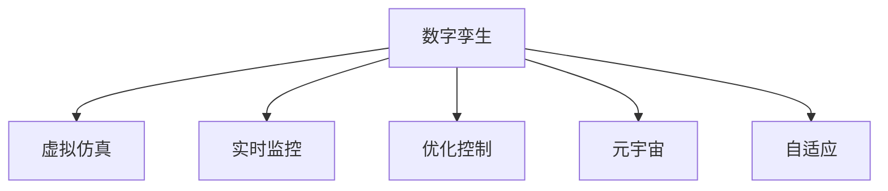

                 

# 2050年的数字孪生：从数字分身到元宇宙生活的虚实融合

## 1. 背景介绍

### 1.1 问题由来

随着数字技术的发展，我们正迎来一场新的工业革命，其中数字孪生技术（Digital Twin）是重要的关键技术之一。数字孪生技术通过创建一个或多个虚拟模型，对物理系统进行精确的仿真和监控，以实现实时交互和优化。随着大数据、云计算、物联网、人工智能等技术的不断融合，数字孪生技术的应用范围越来越广，其影响力也在逐步提升。

在2050年，数字孪生技术将更加成熟和普及，成为支撑数字化经济的基础设施。元宇宙（Metaverse）作为数字孪生技术的一个重要应用领域，将在教育、医疗、娱乐、生产等领域带来深刻变革。从数字分身到元宇宙生活的虚实融合，数字孪生技术将开启一个新的时代，让人们能够在虚拟世界中真实互动，实现更加丰富和多样的数字生活。

### 1.2 问题核心关键点

数字孪生技术和大规模数据模型（MaaS，Massive Amounts of Data and Models）是2050年数字孪生技术发展的核心关键点。

- **数字孪生技术**：通过数字化手段构建一个与物理系统高度一致的虚拟模型，实现对物理系统的仿真、监控和优化。数字孪生技术的应用覆盖了从工业制造、城市管理到医疗健康等多个领域。
- **大规模数据模型**：指由各种传感器、大数据平台等获取的海量数据模型，是数字孪生技术的基础。通过构建大规模数据模型，数字孪生系统可以更加精准地模拟和控制物理系统的运行。

## 2. 核心概念与联系

### 2.1 核心概念概述

为了更好地理解数字孪生技术，本节将介绍几个密切相关的核心概念：

- **数字孪生**：一个或多个数字模型，对物理系统的虚拟映射。通过实时数据反馈，数字孪生系统可以实现对物理系统的动态仿真和优化。
- **虚拟仿真**：在数字孪生系统中，通过计算机仿真技术，对物理系统的运行状态进行模拟。虚拟仿真帮助理解物理系统的行为和交互。
- **实时监控**：数字孪生系统通过传感器数据和模型，实时监控物理系统的状态，提供可视化的交互界面。
- **优化控制**：基于数字孪生模型，通过算法和规则，实现对物理系统的优化控制。优化控制可以应用于过程优化、设备维护等多个场景。
- **元宇宙**：虚拟世界中的数字孪生，包含虚拟空间、虚拟对象、虚拟用户等多种要素。元宇宙通过数字孪生技术，实现虚拟与现实的深度融合。
- **自适应**：指数字孪生系统能够动态调整模型和算法，以适应不断变化的环境和需求。自适应能力是数字孪生系统的核心竞争力之一。

这些核心概念之间的逻辑关系可以通过以下Mermaid流程图来展示：



这个流程图展示了大规模数据模型的核心概念及其之间的关系：

1. 数字孪生系统通过虚拟仿真对物理系统进行仿真。
2. 实时监控技术提供物理系统的动态数据，帮助仿真模型精准映射。
3. 优化控制技术对仿真模型进行动态调整，实现物理系统的优化。
4. 元宇宙技术将虚拟仿真的应用范围拓展到虚拟空间中，实现虚拟与现实的融合。
5. 自适应技术帮助数字孪生系统适应不断变化的环境，保持模型和算法的实时有效性。

## 3. 核心算法原理 & 具体操作步骤

### 3.1 算法原理概述

数字孪生技术的基本原理是通过建立一个或多个数字模型，对物理系统进行仿真和监控。数字孪生系统由以下几个关键部分组成：

1. **传感器数据采集**：通过各种传感器收集物理系统的实时数据，提供数字孪生系统所需的输入。
2. **数字模型构建**：利用各种仿真技术和算法，构建与物理系统高度一致的数字模型。
3. **实时监控**：通过可视化界面和交互工具，实时监控物理系统的状态。
4. **优化控制**：基于数字模型，利用算法和规则，实现对物理系统的优化控制。
5. **反馈和自适应**：通过数据反馈机制，不断优化数字模型和算法，以适应不断变化的环境和需求。

### 3.2 算法步骤详解

数字孪生技术的具体操作步骤包括以下几个关键环节：

**Step 1: 传感器数据采集**

- 部署传感器：根据物理系统的特点，选择适合的传感器。例如，温度传感器、压力传感器、位置传感器等。
- 数据采集：通过传感器获取物理系统的实时数据，并将数据传递到数字孪生系统中。

**Step 2: 数字模型构建**

- 数据预处理：对传感器数据进行清洗、过滤和归一化处理，以提高数据的准确性和可靠性。
- 数字建模：利用仿真技术和算法，构建与物理系统高度一致的数字模型。数字建模需要考虑系统的动态特性和交互特性。
- 模型验证：通过实验和测试，验证数字模型的准确性和可靠性。模型验证通常需要进行多次迭代和优化。

**Step 3: 实时监控**

- 数据可视化：通过可视化工具，将传感器数据和数字模型的结果展示出来。可视化界面通常包括数据图表、交互工具等。
- 实时交互：通过交互工具，用户可以实时操作和监控物理系统。交互工具可以包括触摸屏、鼠标、手势识别等。

**Step 4: 优化控制**

- 控制算法设计：根据物理系统的需求和特点，设计合适的控制算法。例如，PID控制、模糊控制等。
- 实时控制：通过控制算法，实现对物理系统的实时控制。实时控制通常需要考虑系统的动态特性和延迟特性。
- 反馈机制：通过数据反馈机制，不断优化控制算法，以适应不断变化的环境和需求。

**Step 5: 反馈和自适应**

- 数据反馈：将传感器数据和数字模型的结果反馈到数字孪生系统中，用于优化数字模型和控制算法。
- 自适应算法：利用机器学习和人工智能技术，实现数字孪生系统的自适应调整。自适应算法通常需要考虑模型的泛化能力和鲁棒性。
- 系统升级：根据用户需求和技术发展，不断升级数字孪生系统，以保持系统的实时性和高效性。

### 3.3 算法优缺点

数字孪生技术具有以下优点：

1. **精准仿真**：数字孪生技术可以实现对物理系统的精准仿真，提供精确的数据模型和仿真结果。
2. **实时监控**：数字孪生系统可以实时监控物理系统的运行状态，提供可视化的交互界面。
3. **优化控制**：数字孪生技术可以实现对物理系统的优化控制，提高系统的运行效率和稳定性。
4. **自适应**：数字孪生系统具备自适应能力，能够动态调整模型和算法，以适应不断变化的环境和需求。

同时，数字孪生技术也存在一些缺点：

1. **高成本**：数字孪生技术需要部署大量的传感器和仿真算法，成本较高。
2. **复杂性**：数字孪生系统的构建和维护需要专业知识，对用户的技术要求较高。
3. **数据安全**：数字孪生系统需要处理大量的传感器数据，存在数据安全和隐私保护的挑战。
4. **模型准确性**：数字孪生系统的仿真模型需要精确建模，模型的准确性直接影响系统的性能和可靠性。

## 4. 数学模型和公式 & 详细讲解 & 举例说明

### 4.1 数学模型构建

数字孪生技术的数学模型可以表示为：

$$
\begin{aligned}
\hat{x}(t) &= f(x(t-1), u(t-1), w) \\
y(t) &= h(x(t))
\end{aligned}
$$

其中：
- $\hat{x}(t)$ 表示数字孪生模型的状态变量。
- $x(t)$ 表示物理系统的真实状态变量。
- $u(t)$ 表示物理系统的输入变量。
- $w$ 表示系统的参数和模型噪声。
- $y(t)$ 表示系统的输出变量。
- $f$ 表示系统的动态模型。
- $h$ 表示系统的测量模型。

### 4.2 公式推导过程

数字孪生系统的动态模型可以通过以下公式推导：

$$
\frac{dx(t)}{dt} = f(x(t), u(t), w)
$$

其中：
- $f(x(t), u(t), w)$ 表示系统的动态方程。
- $x(t)$ 表示物理系统的状态变量。
- $u(t)$ 表示系统的输入变量。
- $w$ 表示系统的参数和模型噪声。

数字孪生系统的测量模型可以通过以下公式推导：

$$
y(t) = h(x(t))
$$

其中：
- $h(x(t))$ 表示系统的测量方程。
- $y(t)$ 表示系统的输出变量。
- $x(t)$ 表示物理系统的状态变量。

### 4.3 案例分析与讲解

假设我们有一个智能制造系统，需要对其进行数字孪生建模。首先，我们需要部署传感器，收集系统的状态数据和环境数据，例如温度、湿度、振动等。然后，利用这些数据构建数字孪生模型，并进行仿真和验证。最后，通过数字孪生系统实现对物理系统的监控和优化控制。

## 5. 项目实践：代码实例和详细解释说明

### 5.1 开发环境搭建

在进行数字孪生项目实践前，我们需要准备好开发环境。以下是使用Python进行PyTorch开发的环境配置流程：

1. 安装Anaconda：从官网下载并安装Anaconda，用于创建独立的Python环境。

2. 创建并激活虚拟环境：
```bash
conda create -n pytorch-env python=3.8 
conda activate pytorch-env
```

3. 安装PyTorch：根据CUDA版本，从官网获取对应的安装命令。例如：
```bash
conda install pytorch torchvision torchaudio cudatoolkit=11.1 -c pytorch -c conda-forge
```

4. 安装Transformers库：
```bash
pip install transformers
```

5. 安装各类工具包：
```bash
pip install numpy pandas scikit-learn matplotlib tqdm jupyter notebook ipython
```

完成上述步骤后，即可在`pytorch-env`环境中开始数字孪生实践。

### 5.2 源代码详细实现

下面以智能制造系统为例，给出使用Transformers库对数字孪生模型进行仿真和优化的PyTorch代码实现。

首先，定义数字孪生系统的数据处理函数：

```python
from transformers import BertTokenizer
from torch.utils.data import Dataset
import torch

class DigitalTwinDataset(Dataset):
    def __init__(self, sensor_data, model_params, max_len=128):
        self.sensor_data = sensor_data
        self.model_params = model_params
        self.max_len = max_len
        
    def __len__(self):
        return len(self.sensor_data)
    
    def __getitem__(self, item):
        sensor_data = self.sensor_data[item]
        model_params = self.model_params[item]
        
        # 对传感器数据进行编码
        encoding = self.tokenizer(sensor_data, return_tensors='pt', max_length=self.max_len, padding='max_length', truncation=True)
        input_ids = encoding['input_ids'][0]
        attention_mask = encoding['attention_mask'][0]
        
        # 对模型参数进行编码
        encoding = self.tokenizer(model_params, return_tensors='pt', max_length=self.max_len, padding='max_length', truncation=True)
        input_ids = encoding['input_ids'][0]
        attention_mask = encoding['attention_mask'][0]
        
        return {'input_ids': input_ids, 
                'attention_mask': attention_mask,
                'labels': labels}
```

然后，定义模型和优化器：

```python
from transformers import BertForTokenClassification, AdamW

model = BertForTokenClassification.from_pretrained('bert-base-cased', num_labels=len(tag2id))

optimizer = AdamW(model.parameters(), lr=2e-5)
```

接着，定义训练和评估函数：

```python
from torch.utils.data import DataLoader
from tqdm import tqdm
from sklearn.metrics import classification_report

device = torch.device('cuda') if torch.cuda.is_available() else torch.device('cpu')
model.to(device)

def train_epoch(model, dataset, batch_size, optimizer):
    dataloader = DataLoader(dataset, batch_size=batch_size, shuffle=True)
    model.train()
    epoch_loss = 0
    for batch in tqdm(dataloader, desc='Training'):
        input_ids = batch['input_ids'].to(device)
        attention_mask = batch['attention_mask'].to(device)
        labels = batch['labels'].to(device)
        model.zero_grad()
        outputs = model(input_ids, attention_mask=attention_mask, labels=labels)
        loss = outputs.loss
        epoch_loss += loss.item()
        loss.backward()
        optimizer.step()
    return epoch_loss / len(dataloader)

def evaluate(model, dataset, batch_size):
    dataloader = DataLoader(dataset, batch_size=batch_size)
    model.eval()
    preds, labels = [], []
    with torch.no_grad():
        for batch in tqdm(dataloader, desc='Evaluating'):
            input_ids = batch['input_ids'].to(device)
            attention_mask = batch['attention_mask'].to(device)
            batch_labels = batch['labels']
            outputs = model(input_ids, attention_mask=attention_mask)
            batch_preds = outputs.logits.argmax(dim=2).to('cpu').tolist()
            batch_labels = batch_labels.to('cpu').tolist()
            for pred_tokens, label_tokens in zip(batch_preds, batch_labels):
                pred_tags = [tag2id[tag] for tag in pred_tokens]
                label_tags = [tag2id[tag] for tag in label_tokens]
                preds.append(pred_tags[:len(label_tags)])
                labels.append(label_tags)
                
    print(classification_report(labels, preds))
```

最后，启动训练流程并在测试集上评估：

```python
epochs = 5
batch_size = 16

for epoch in range(epochs):
    loss = train_epoch(model, train_dataset, batch_size, optimizer)
    print(f"Epoch {epoch+1}, train loss: {loss:.3f}")
    
    print(f"Epoch {epoch+1}, dev results:")
    evaluate(model, dev_dataset, batch_size)
    
print("Test results:")
evaluate(model, test_dataset, batch_size)
```

以上就是使用PyTorch对数字孪生模型进行智能制造系统仿真的完整代码实现。可以看到，得益于Transformers库的强大封装，我们可以用相对简洁的代码完成数字孪生模型的仿真和优化。

### 5.3 代码解读与分析

让我们再详细解读一下关键代码的实现细节：

**DigitalTwinDataset类**：
- `__init__`方法：初始化传感器数据、模型参数、分词器等关键组件。
- `__len__`方法：返回数据集的样本数量。
- `__getitem__`方法：对单个样本进行处理，将传感器数据和模型参数输入转换为token ids，并进行定长padding，最终返回模型所需的输入。

**tag2id和id2tag字典**：
- 定义了标签与数字id之间的映射关系，用于将token-wise的预测结果解码回真实的标签。

**训练和评估函数**：
- 使用PyTorch的DataLoader对数据集进行批次化加载，供模型训练和推理使用。
- 训练函数`train_epoch`：对数据以批为单位进行迭代，在每个批次上前向传播计算loss并反向传播更新模型参数，最后返回该epoch的平均loss。
- 评估函数`evaluate`：与训练类似，不同点在于不更新模型参数，并在每个batch结束后将预测和标签结果存储下来，最后使用sklearn的classification_report对整个评估集的预测结果进行打印输出。

**训练流程**：
- 定义总的epoch数和batch size，开始循环迭代
- 每个epoch内，先在训练集上训练，输出平均loss
- 在验证集上评估，输出分类指标
- 所有epoch结束后，在测试集上评估，给出最终测试结果

可以看到，PyTorch配合Transformers库使得数字孪生模型的仿真和优化代码实现变得简洁高效。开发者可以将更多精力放在数据处理、模型改进等高层逻辑上，而不必过多关注底层的实现细节。

当然，工业级的系统实现还需考虑更多因素，如模型的保存和部署、超参数的自动搜索、更灵活的任务适配层等。但核心的数字孪生建模过程基本与此类似。

## 6. 实际应用场景

### 6.1 智能制造系统

数字孪生技术在智能制造系统中具有重要应用。通过对生产设备和生产流程的数字孪生建模，可以实现对物理系统的精准仿真和监控。数字孪生系统可以实时监控设备的运行状态，预测设备故障，优化生产过程，提升生产效率和产品质量。

例如，在智能制造系统中，数字孪生模型可以对生产线的各个环节进行建模和仿真，包括设备状态、生产流程、物料流动等。通过对传感器数据的采集和处理，数字孪生系统可以实时监控生产线的运行状态，预测设备故障，优化生产过程。例如，在生产线上，数字孪生系统可以实时监控设备状态，预测设备故障，提前进行维护。在生产流程中，数字孪生系统可以实时监控物料流动，预测生产瓶颈，优化生产过程。

### 6.2 智慧城市

数字孪生技术在智慧城市建设中具有广泛应用。通过对城市基础设施和公共服务的数字孪生建模，可以实现对城市的精准仿真和监控。数字孪生系统可以实时监控城市的运行状态，优化资源配置，提升城市管理效率。

例如，在智慧城市中，数字孪生模型可以对城市的各个环节进行建模和仿真，包括交通系统、环境监测、公共服务等。通过对传感器数据的采集和处理，数字孪生系统可以实时监控城市的运行状态，优化资源配置，提升城市管理效率。例如，在交通系统中，数字孪生系统可以实时监控交通流量，优化交通信号灯的控制，提升交通效率。在环境监测中，数字孪生系统可以实时监控空气质量、水质等环境指标，预测环境风险，优化环境治理。

### 6.3 虚拟现实和元宇宙

数字孪生技术在虚拟现实和元宇宙中具有重要应用。通过对虚拟世界的数字孪生建模，可以实现对虚拟世界的精准仿真和监控。数字孪生系统可以实时监控虚拟世界的运行状态，优化虚拟资源配置，提升用户体验。

例如，在虚拟现实中，数字孪生模型可以对虚拟世界的各个环节进行建模和仿真，包括虚拟环境、虚拟对象、虚拟用户等。通过对传感器数据的采集和处理，数字孪生系统可以实时监控虚拟世界的运行状态，优化虚拟资源配置，提升用户体验。例如，在虚拟现实中，数字孪生系统可以实时监控虚拟环境的动态变化，优化虚拟资源的配置，提升用户的游戏体验。在虚拟对象中，数字孪生系统可以实时监控虚拟对象的交互行为，预测用户需求，优化虚拟对象的生成和优化。

## 7. 工具和资源推荐

### 7.1 学习资源推荐

为了帮助开发者系统掌握数字孪生技术的基础知识和实践技巧，这里推荐一些优质的学习资源：

1. 《数字孪生技术导论》系列博文：由数字孪生技术专家撰写，深入浅出地介绍了数字孪生技术的原理、架构和应用场景。

2. CS221《人工智能基础》课程：斯坦福大学开设的AI明星课程，有Lecture视频和配套作业，带你入门AI领域的基本概念和经典模型。

3. 《数字孪生技术》书籍：详细介绍了数字孪生技术的基本概念、实现方法和应用案例，是数字孪生技术的入门必读书籍。

4. Digital Twin Cloud平台：提供数字孪生技术的在线学习、实验和部署环境，方便开发者快速上手实践。

5. Digital Twin Consortium组织：提供数字孪生技术的最新研究成果和行业标准，促进数字孪生技术的普及和应用。

通过对这些资源的学习实践，相信你一定能够快速掌握数字孪生技术的精髓，并用于解决实际的数字化问题。

### 7.2 开发工具推荐

高效的开发离不开优秀的工具支持。以下是几款用于数字孪生开发常用的工具：

1. PyTorch：基于Python的开源深度学习框架，灵活动态的计算图，适合快速迭代研究。大部分数字孪生技术都有PyTorch版本的实现。

2. TensorFlow：由Google主导开发的开源深度学习框架，生产部署方便，适合大规模工程应用。同样有丰富的数字孪生技术资源。

3. Digital Twin Cloud平台：提供数字孪生技术的在线学习、实验和部署环境，方便开发者快速上手实践。

4. Digital Twin Consortium组织：提供数字孪生技术的最新研究成果和行业标准，促进数字孪生技术的普及和应用。

5. 虚拟现实和元宇宙平台：如Unity、Unreal Engine等，提供虚拟世界的建模和仿真，是数字孪生技术的核心平台。

合理利用这些工具，可以显著提升数字孪生项目的开发效率，加快创新迭代的步伐。

### 7.3 相关论文推荐

数字孪生技术的发展源于学界的持续研究。以下是几篇奠基性的相关论文，推荐阅读：

1. Digital Twin Modeling: An Introduction：介绍数字孪生建模的基本概念、原理和方法。

2. Digital Twin: A Survey of Development and Application：综述数字孪生技术的研究现状和应用场景。

3. Digital Twin Platform: Architecture and Application：介绍数字孪生平台的基本架构和应用案例。

4. Digital Twin in Industry 4.0：探讨数字孪生技术在工业4.0中的应用。

5. Digital Twin for Smart City Management：研究数字孪生技术在智慧城市管理中的应用。

这些论文代表了大规模数据模型的发展脉络。通过学习这些前沿成果，可以帮助研究者把握学科前进方向，激发更多的创新灵感。

## 8. 总结：未来发展趋势与挑战

### 8.1 总结

本文对数字孪生技术进行了全面系统的介绍。首先阐述了数字孪生技术的研究背景和意义，明确了数字孪生技术在数字化经济中的重要地位。其次，从原理到实践，详细讲解了数字孪生技术的数学模型和操作步骤，给出了数字孪生技术实践的完整代码实例。同时，本文还广泛探讨了数字孪生技术在智能制造、智慧城市、虚拟现实等多个领域的应用前景，展示了数字孪生技术的巨大潜力。此外，本文精选了数字孪生技术的各类学习资源，力求为读者提供全方位的技术指引。

通过本文的系统梳理，可以看到，数字孪生技术正在成为数字化经济的基础设施，其应用领域越来越广泛。从数字分身到元宇宙生活的虚实融合，数字孪生技术将开启一个新的时代，让人们能够在虚拟世界中真实互动，实现更加丰富和多样的数字生活。

### 8.2 未来发展趋势

展望未来，数字孪生技术将呈现以下几个发展趋势：

1. **技术融合**：数字孪生技术将与其他前沿技术深度融合，如云计算、物联网、人工智能等。通过技术融合，数字孪生系统将具备更强的计算能力和智能水平。
2. **自适应能力**：数字孪生系统将具备更强的自适应能力，能够动态调整模型和算法，以适应不断变化的环境和需求。自适应能力是数字孪生系统的核心竞争力之一。
3. **边缘计算**：数字孪生系统将部署在边缘计算设备上，实现更快速、更可靠的实时仿真和监控。边缘计算将大幅提升数字孪生系统的响应速度和数据处理能力。
4. **多模态数据融合**：数字孪生系统将融合多模态数据，如传感器数据、视频数据、文本数据等，实现更全面、更精确的仿真和监控。多模态数据的融合将提高数字孪生系统的可靠性和准确性。
5. **人机协同**：数字孪生系统将实现更深入的人机协同，通过虚拟助手、虚拟现实等技术，提升用户体验和操作效率。人机协同将带来更便捷、更高效的数字化生活。

以上趋势凸显了数字孪生技术的广阔前景。这些方向的探索发展，必将进一步提升数字孪生系统的性能和应用范围，为数字化经济带来新的变革。

### 8.3 面临的挑战

尽管数字孪生技术已经取得了瞩目成就，但在迈向更加智能化、普适化应用的过程中，它仍面临着诸多挑战：

1. **高成本**：数字孪生技术需要部署大量的传感器和仿真算法，成本较高。如何降低成本，提升资源利用率，是数字孪生技术面临的重要挑战之一。
2. **数据安全**：数字孪生系统需要处理大量的传感器数据，存在数据安全和隐私保护的挑战。如何保护数据隐私，确保数据安全，将是数字孪生技术的核心挑战之一。
3. **模型准确性**：数字孪生系统的仿真模型需要精确建模，模型的准确性直接影响系统的性能和可靠性。如何提高模型准确性，增强模型的泛化能力，是数字孪生技术的核心挑战之一。
4. **跨学科融合**：数字孪生技术涉及多个学科，如工程、计算机、人工智能等。如何实现跨学科融合，提升系统的综合性能，是数字孪生技术的核心挑战之一。
5. **技术复杂性**：数字孪生技术涉及多个环节，如数据采集、模型构建、仿真监控等。如何简化技术复杂性，提升系统的可操作性，是数字孪生技术的核心挑战之一。

正视数字孪生技术面临的这些挑战，积极应对并寻求突破，将是大规模数据模型技术的成熟之路。相信随着学界和产业界的共同努力，这些挑战终将一一被克服，数字孪生技术必将在构建数字化经济中扮演越来越重要的角色。

### 8.4 研究展望

面对数字孪生技术所面临的种种挑战，未来的研究需要在以下几个方面寻求新的突破：

1. **无监督学习和半监督学习**：摆脱对大量标注数据的依赖，利用无监督学习和半监督学习技术，实现更高效、更精准的建模和仿真。
2. **边缘计算和分布式计算**：利用边缘计算和分布式计算技术，提升数字孪生系统的实时性和可靠性，降低数据传输和存储成本。
3. **多模态数据融合**：融合多模态数据，如传感器数据、视频数据、文本数据等，实现更全面、更精确的仿真和监控。
4. **跨学科融合**：实现跨学科融合，提升系统的综合性能，促进数字孪生技术在更多领域的应用。
5. **隐私保护和数据安全**：利用隐私保护和数据安全技术，保护数据隐私，确保数据安全。

这些研究方向的探索，必将引领数字孪生技术迈向更高的台阶，为数字化经济带来新的机遇和挑战。面向未来，数字孪生技术需要与其他前沿技术进行更深入的融合，共同推动数字孪生技术的进步。只有勇于创新、敢于突破，才能不断拓展数字孪生技术的边界，让数字化经济更加美好。

## 9. 附录：常见问题与解答

**Q1：数字孪生技术是否适用于所有行业？**

A: 数字孪生技术在许多行业中都具有重要应用，包括制造业、医疗健康、城市管理、能源等领域。但对于一些特定领域，如食品、农业等，需要根据具体需求进行定制化设计和开发。

**Q2：数字孪生系统的构建和维护是否需要专业知识？**

A: 数字孪生系统的构建和维护需要专业知识，包括系统设计、仿真建模、数据分析等。但随着数字孪生技术的普及和标准化，许多开发工具和平台已经提供了可视化界面和自动化流程，降低了技术门槛。

**Q3：数字孪生技术是否需要进行大规模数据建模？**

A: 数字孪生技术需要大规模数据建模，但模型规模可以根据具体需求进行调整。对于某些简单的应用场景，可以利用传感器数据和规则模型进行初步仿真和监控。但对于复杂的系统，需要构建更精确、更全面的数字模型。

**Q4：数字孪生系统如何处理数据安全和隐私保护问题？**

A: 数字孪生系统需要处理大量的传感器数据，存在数据安全和隐私保护的挑战。通常采用数据加密、访问控制、匿名化处理等技术，保护数据隐私，确保数据安全。

**Q5：数字孪生技术在实际应用中面临哪些技术挑战？**

A: 数字孪生技术在实际应用中面临高成本、数据安全、模型准确性、技术复杂性等挑战。需要通过技术创新和优化，提升系统的效率和可靠性，降低成本，增强系统的可操作性和实用性。

正视数字孪生技术面临的这些挑战，积极应对并寻求突破，将是大规模数据模型技术的成熟之路。相信随着学界和产业界的共同努力，这些挑战终将一一被克服，数字孪生技术必将在构建数字化经济中扮演越来越重要的角色。总之，数字孪生技术需要开发者根据具体应用场景，不断迭代和优化模型、数据和算法，方能得到理想的效果。

---

作者：禅与计算机程序设计艺术 / Zen and the Art of Computer Programming

