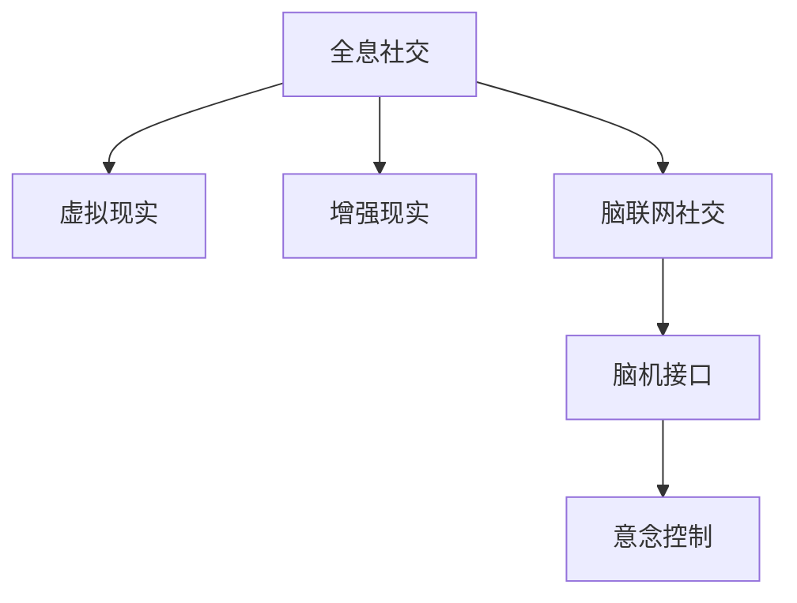

                 

# 2050年的社交网络：从全息社交到脑联网社交的社交方式升级

> 关键词：社交网络，全息社交，脑联网社交，未来展望，技术趋势，人工智能，社交方式，量子计算

## 1. 背景介绍

### 1.1 问题由来
社交网络已经成为我们日常生活不可或缺的一部分，从最初的电子邮件、即时通讯，到后来兴起的微博、微信、Facebook等平台，社交网络在不断地演变和发展。然而，传统的社交网络形式已经无法满足日益增长的社交需求。全息社交和脑联网社交作为一种未来的社交方式，有望彻底改变我们的社交体验，带来全新的社交维度。

### 1.2 问题核心关键点
全息社交和脑联网社交的核心在于如何通过技术手段，实现更加真实、沉浸的社交体验。全息社交主要利用虚拟现实(VR)和增强现实(AR)技术，通过全息影像、手势交互等方式，提供一种立体、多感官的社交体验。脑联网社交则是指通过脑机接口(BMI)等技术，实现大脑与计算机的直接交互，实现思维即行动的极致通信。

## 2. 核心概念与联系

### 2.1 核心概念概述

为了更好地理解全息社交和脑联网社交，我们首先需要了解一些关键概念：

- **全息社交**：利用虚拟现实和增强现实技术，通过三维全息影像和手势交互等方式，提供沉浸式、多感官的社交体验。全息社交不仅限于视觉体验，还包括了听觉、触觉等多方面的感知。

- **脑联网社交**：通过脑机接口等技术，实现大脑与计算机的直接交互。脑联网社交使得用户可以通过意念控制虚拟环境，实现思维即行动的社交方式。

- **虚拟现实(VR)**：一种通过计算机技术模拟三维虚拟环境的体验方式，通过头戴设备或控制器等硬件，提供视觉、听觉等感官输入，使用户仿佛置身于另一个世界中。

- **增强现实(AR)**：一种将虚拟信息与现实环境融合的技术，通过摄像头、传感器等设备，将虚拟对象叠加在现实世界的场景上，提供更为真实的环境交互体验。

- **脑机接口(BMI)**：一种实现大脑与计算机之间信息交流的技术，通过电极、脑波传感器等设备，将脑电信号转换为计算机指令，实现意念控制。

这些概念之间的联系可以通过以下Mermaid流程图来展示：



这个流程图展示了一些关键概念及其之间的联系：

1. 全息社交依托于虚拟现实和增强现实技术，提供沉浸式、多感官的社交体验。
2. 脑联网社交则是通过脑机接口技术，实现大脑与计算机的直接交互。
3. 脑机接口可以将意念转换为计算机指令，从而实现思维即行动的社交方式。
4. 虚拟现实和增强现实技术为全息社交提供了必要的技术基础。

## 3. 核心算法原理 & 具体操作步骤

### 3.1 算法原理概述

全息社交和脑联网社交的实现原理主要涉及虚拟现实、增强现实和脑机接口等技术。下面我们将从这些关键技术入手，详细讲解其核心算法原理。

#### 3.1.1 虚拟现实(VR)

虚拟现实技术通过计算机生成一个虚拟环境，使用户能够通过头戴设备等硬件，进入一个全新的三维世界。其核心算法包括：

- **环境建模**：使用三维建模软件，创建虚拟环境的几何模型。
- **渲染引擎**：通过渲染引擎将几何模型转换为可交互的虚拟场景，实现动态效果。
- **传感器融合**：通过位置传感器、动作传感器等设备，获取用户输入，进行环境交互。

#### 3.1.2 增强现实(AR)

增强现实技术将虚拟信息与现实环境相结合，提供更为丰富的交互体验。其核心算法包括：

- **视觉跟踪**：通过摄像头等设备，实时获取现实环境图像，识别环境中的物体和特征。
- **图像识别**：通过深度学习模型，识别用户的手势、面部表情等非语言信息。
- **虚拟物体融合**：将虚拟物体与现实环境中的物体进行融合，实现交互效果。

#### 3.1.3 脑机接口(BMI)

脑机接口技术实现大脑与计算机之间的信息交流，其核心算法包括：

- **脑电信号采集**：通过电极、脑波传感器等设备，采集大脑的电信号。
- **信号预处理**：对采集到的信号进行滤波、降噪等预处理，提取有用的特征。
- **意念解码**：通过机器学习模型，将脑电信号解码为计算机指令，实现意念控制。

### 3.2 算法步骤详解

#### 3.2.1 虚拟现实(VR)

1. **环境建模**：
   - 使用三维建模软件，创建虚拟环境的几何模型。
   - 在建模软件中，对模型进行细节调整，使其更加逼真。
   - 将几何模型导入渲染引擎，进行初步渲染。

2. **渲染引擎**：
   - 使用渲染引擎，对模型进行光照、阴影等效果设置。
   - 加入动态元素，如背景动画、粒子效果等，实现动态场景。
   - 优化渲染引擎，提高渲染速度，减少卡顿和延迟。

3. **传感器融合**：
   - 在头戴设备上安装位置传感器和动作传感器。
   - 通过传感器获取用户的位置和动作信息。
   - 将传感器信息输入渲染引擎，实现环境交互。

#### 3.2.2 增强现实(AR)

1. **视觉跟踪**：
   - 在设备上安装摄像头和传感器。
   - 实时获取环境图像，并进行预处理。
   - 通过深度学习模型，对图像进行对象识别和特征提取。

2. **图像识别**：
   - 使用深度学习模型，识别用户的手势、面部表情等非语言信息。
   - 对识别结果进行解码，提取有用特征。
   - 将识别结果作为控制信号，实现虚拟物体的交互。

3. **虚拟物体融合**：
   - 在虚拟环境中，创建虚拟物体。
   - 将虚拟物体与现实环境中的物体进行融合，实现交互效果。
   - 通过传感器获取用户交互信息，更新虚拟物体状态。

#### 3.2.3 脑机接口(BMI)

1. **脑电信号采集**：
   - 在设备上安装电极或脑波传感器。
   - 采集大脑的电信号，进行预处理。
   - 将处理后的信号发送至计算机。

2. **信号预处理**：
   - 对采集到的信号进行滤波、降噪等预处理。
   - 提取有用的特征，如脑波频率、节律等。
   - 将处理后的信号输入机器学习模型。

3. **意念解码**：
   - 使用机器学习模型，将脑电信号解码为计算机指令。
   - 实现意念控制虚拟环境中的物体。
   - 通过传感器反馈，优化解码模型，提高准确性。

### 3.3 算法优缺点

全息社交和脑联网社交技术具备以下优点：

1. **沉浸式体验**：通过虚拟现实和增强现实技术，提供沉浸式、多感官的社交体验，使用户仿佛置身于另一个世界中。
2. **互动性强**：通过手势交互、虚拟物体交互等方式，提供更为丰富的互动体验。
3. **技术成熟**：虚拟现实和增强现实技术已经在多个领域得到了广泛应用，技术成熟度高。
4. **脑机接口潜力**：脑机接口技术虽然还在研究阶段，但其潜在的意念控制能力，将带来革命性的社交体验。

然而，这些技术也存在一些缺点：

1. **设备依赖性强**：全息社交和脑联网社交需要依赖特定的头戴设备、传感器等硬件，增加了成本和使用门槛。
2. **技术复杂度高**：虚拟现实、增强现实和脑机接口等技术复杂度高，需要专业知识进行开发和维护。
3. **隐私安全问题**：虚拟现实和增强现实设备可能采集用户的隐私信息，存在安全隐患。
4. **延迟和卡顿**：虚拟现实和增强现实技术的渲染和计算，可能会带来延迟和卡顿，影响用户体验。
5. **脑机接口技术瓶颈**：脑机接口技术尚不成熟，意念控制的准确性和可靠性还有待提高。

### 3.4 算法应用领域

全息社交和脑联网社交技术在多个领域都有广泛的应用前景，例如：

1. **娱乐和游戏**：虚拟现实和增强现实技术可以提供沉浸式的游戏体验，如虚拟现实游戏、增强现实互动游戏等。
2. **教育培训**：通过虚拟现实和增强现实技术，提供互动式的教育培训，如虚拟实验室、增强现实历史场景等。
3. **医疗健康**：通过脑机接口技术，实现远程医疗和心理健康管理，如虚拟康复训练、心理治疗等。
4. **远程办公**：通过虚拟现实和增强现实技术，实现虚拟会议室和虚拟办公空间，提高工作效率。
5. **公共服务**：通过增强现实技术，提供互动式的公共服务，如虚拟导览、实时交通信息等。

## 4. 数学模型和公式 & 详细讲解 & 举例说明

### 4.1 数学模型构建

为了更好地理解全息社交和脑联网社交的技术实现，我们首先需要构建相应的数学模型。以下我们将从虚拟现实、增强现实和脑机接口技术入手，详细讲解其数学模型。

#### 4.1.1 虚拟现实(VR)

在虚拟现实技术中，我们需要构建虚拟环境的几何模型，并进行渲染。假设虚拟环境的几何模型为 $\mathcal{M}$，渲染引擎中的光照模型为 $L$，用户的位置和动作信息为 $P$，则渲染过程的数学模型可以表示为：

$$
R = L(\mathcal{M}, P)
$$

其中 $R$ 表示渲染后的虚拟场景，$L$ 表示渲染引擎中的光照模型，$\mathcal{M}$ 表示虚拟环境的几何模型，$P$ 表示用户的位置和动作信息。

#### 4.1.2 增强现实(AR)

在增强现实技术中，我们需要对环境图像进行对象识别和虚拟物体融合。假设环境图像为 $I$，对象识别模型为 $D$，虚拟物体为 $\mathcal{O}$，则对象识别和虚拟物体融合的数学模型可以表示为：

$$
\mathcal{O} = D(I)
$$

其中 $\mathcal{O}$ 表示虚拟物体，$D$ 表示对象识别模型，$I$ 表示环境图像。

#### 4.1.3 脑机接口(BMI)

在脑机接口技术中，我们需要将脑电信号解码为计算机指令。假设脑电信号为 $E$，解码模型为 $C$，计算机指令为 $I$，则意念解码的数学模型可以表示为：

$$
I = C(E)
$$

其中 $I$ 表示计算机指令，$C$ 表示解码模型，$E$ 表示脑电信号。

### 4.2 公式推导过程

以下是各关键技术的公式推导过程：

#### 4.2.1 虚拟现实(VR)

1. **环境建模**：
   - 假设虚拟环境的几何模型为 $\mathcal{M}$，使用三维建模软件创建的几何模型为 $\mathcal{M}_{3D}$，则有：
   $$
   \mathcal{M} = \mathcal{M}_{3D}
   $$

2. **渲染引擎**：
   - 假设渲染引擎中的光照模型为 $L$，则有：
   $$
   R = L(\mathcal{M}, P)
   $$

3. **传感器融合**：
   - 假设位置传感器获取的用户位置信息为 $P_{pos}$，动作传感器获取的用户动作信息为 $P_{act}$，则有：
   $$
   P = (P_{pos}, P_{act})
   $$

#### 4.2.2 增强现实(AR)

1. **视觉跟踪**：
   - 假设环境图像为 $I$，对象识别模型为 $D$，则有：
   $$
   \mathcal{O} = D(I)
   $$

2. **图像识别**：
   - 假设用户的手势信息为 $H$，面部表情信息为 $F$，则有：
   $$
   H = D_I(I)
   $$
   $$
   F = D_F(I)
   $$

3. **虚拟物体融合**：
   - 假设虚拟物体为 $\mathcal{O}$，环境中的物体为 $\mathcal{O}_{env}$，则有：
   $$
   \mathcal{O}_{env} = D_O(I)
   $$

#### 4.2.3 脑机接口(BMI)

1. **脑电信号采集**：
   - 假设脑电信号为 $E$，传感器采集到的电信号为 $S$，则有：
   $$
   E = S
   $$

2. **信号预处理**：
   - 假设预处理后的信号为 $E_{pre}$，则有：
   $$
   E_{pre} = PreProc(E)
   $$

3. **意念解码**：
   - 假设解码模型为 $C$，计算机指令为 $I$，则有：
   $$
   I = C(E_{pre})
   $$

### 4.3 案例分析与讲解

#### 4.3.1 虚拟现实(VR)

假设我们要实现一个虚拟现实游戏，用户可以在虚拟空间中自由移动和互动。以下是实现过程的案例分析：

1. **环境建模**：
   - 使用三维建模软件，创建一个虚拟场景，包含地形、建筑、物品等几何模型。
   - 将几何模型导入渲染引擎，进行初步渲染。

2. **渲染引擎**：
   - 使用渲染引擎，对场景进行光照、阴影等效果设置。
   - 加入动态元素，如背景动画、粒子效果等，实现动态场景。

3. **传感器融合**：
   - 在头戴设备上安装位置传感器和动作传感器。
   - 通过传感器获取用户的位置和动作信息。
   - 将传感器信息输入渲染引擎，实现环境交互。

#### 4.3.2 增强现实(AR)

假设我们要实现一个增强现实导航系统，用户在现实世界中可以看到虚拟信息。以下是实现过程的案例分析：

1. **视觉跟踪**：
   - 在设备上安装摄像头和传感器。
   - 实时获取环境图像，并进行预处理。
   - 通过深度学习模型，对图像进行对象识别和特征提取。

2. **图像识别**：
   - 使用深度学习模型，识别用户的手势、面部表情等非语言信息。
   - 对识别结果进行解码，提取有用特征。
   - 将识别结果作为控制信号，实现虚拟物体的交互。

3. **虚拟物体融合**：
   - 在虚拟环境中，创建虚拟物体。
   - 将虚拟物体与现实环境中的物体进行融合，实现交互效果。
   - 通过传感器获取用户交互信息，更新虚拟物体状态。

#### 4.3.3 脑机接口(BMI)

假设我们要实现一个脑机接口控制系统，用户可以通过意念控制虚拟环境中的物体。以下是实现过程的案例分析：

1. **脑电信号采集**：
   - 在设备上安装电极或脑波传感器。
   - 采集大脑的电信号，进行预处理。
   - 将处理后的信号发送至计算机。

2. **信号预处理**：
   - 对采集到的信号进行滤波、降噪等预处理。
   - 提取有用的特征，如脑波频率、节律等。
   - 将处理后的信号输入机器学习模型。

3. **意念解码**：
   - 使用机器学习模型，将脑电信号解码为计算机指令。
   - 实现意念控制虚拟环境中的物体。
   - 通过传感器反馈，优化解码模型，提高准确性。

## 5. 项目实践：代码实例和详细解释说明

### 5.1 开发环境搭建

在进行全息社交和脑联网社交技术的开发前，我们需要准备好开发环境。以下是使用Python进行PyTorch开发的环境配置流程：

1. 安装Anaconda：从官网下载并安装Anaconda，用于创建独立的Python环境。

2. 创建并激活虚拟环境：
```bash
conda create -n pytorch-env python=3.8 
conda activate pytorch-env
```

3. 安装PyTorch：根据CUDA版本，从官网获取对应的安装命令。例如：
```bash
conda install pytorch torchvision torchaudio cudatoolkit=11.1 -c pytorch -c conda-forge
```

4. 安装Transformers库：
```bash
pip install transformers
```

5. 安装各类工具包：
```bash
pip install numpy pandas scikit-learn matplotlib tqdm jupyter notebook ipython
```

完成上述步骤后，即可在`pytorch-env`环境中开始开发。

### 5.2 源代码详细实现

下面我们以增强现实(AR)导航系统为例，给出使用Transformers库对模型进行训练的PyTorch代码实现。

首先，定义AR导航系统的数据处理函数：

```python
from transformers import BertTokenizer
from torch.utils.data import Dataset
import torch

class ARDataset(Dataset):
    def __init__(self, texts, tags, tokenizer, max_len=128):
        self.texts = texts
        self.tags = tags
        self.tokenizer = tokenizer
        self.max_len = max_len
        
    def __len__(self):
        return len(self.texts)
    
    def __getitem__(self, item):
        text = self.texts[item]
        tags = self.tags[item]
        
        encoding = self.tokenizer(text, return_tensors='pt', max_length=self.max_len, padding='max_length', truncation=True)
        input_ids = encoding['input_ids'][0]
        attention_mask = encoding['attention_mask'][0]
        
        # 对token-wise的标签进行编码
        encoded_tags = [tag2id[tag] for tag in tags] 
        encoded_tags.extend([tag2id['O']] * (self.max_len - len(encoded_tags)))
        labels = torch.tensor(encoded_tags, dtype=torch.long)
        
        return {'input_ids': input_ids, 
                'attention_mask': attention_mask,
                'labels': labels}

# 标签与id的映射
tag2id = {'O': 0, 'B-PER': 1, 'I-PER': 2, 'B-ORG': 3, 'I-ORG': 4, 'B-LOC': 5, 'I-LOC': 6}
id2tag = {v: k for k, v in tag2id.items()}

# 创建dataset
tokenizer = BertTokenizer.from_pretrained('bert-base-cased')

train_dataset = ARDataset(train_texts, train_tags, tokenizer)
dev_dataset = ARDataset(dev_texts, dev_tags, tokenizer)
test_dataset = ARDataset(test_texts, test_tags, tokenizer)
```

然后，定义模型和优化器：

```python
from transformers import BertForTokenClassification, AdamW

model = BertForTokenClassification.from_pretrained('bert-base-cased', num_labels=len(tag2id))

optimizer = AdamW(model.parameters(), lr=2e-5)
```

接着，定义训练和评估函数：

```python
from torch.utils.data import DataLoader
from tqdm import tqdm
from sklearn.metrics import classification_report

device = torch.device('cuda') if torch.cuda.is_available() else torch.device('cpu')
model.to(device)

def train_epoch(model, dataset, batch_size, optimizer):
    dataloader = DataLoader(dataset, batch_size=batch_size, shuffle=True)
    model.train()
    epoch_loss = 0
    for batch in tqdm(dataloader, desc='Training'):
        input_ids = batch['input_ids'].to(device)
        attention_mask = batch['attention_mask'].to(device)
        labels = batch['labels'].to(device)
        model.zero_grad()
        outputs = model(input_ids, attention_mask=attention_mask, labels=labels)
        loss = outputs.loss
        epoch_loss += loss.item()
        loss.backward()
        optimizer.step()
    return epoch_loss / len(dataloader)

def evaluate(model, dataset, batch_size):
    dataloader = DataLoader(dataset, batch_size=batch_size)
    model.eval()
    preds, labels = [], []
    with torch.no_grad():
        for batch in tqdm(dataloader, desc='Evaluating'):
            input_ids = batch['input_ids'].to(device)
            attention_mask = batch['attention_mask'].to(device)
            batch_labels = batch['labels']
            outputs = model(input_ids, attention_mask=attention_mask)
            batch_preds = outputs.logits.argmax(dim=2).to('cpu').tolist()
            batch_labels = batch_labels.to('cpu').tolist()
            for pred_tokens, label_tokens in zip(batch_preds, batch_labels):
                pred_tags = [id2tag[_id] for _id in pred_tokens]
                label_tags = [id2tag[_id] for _id in label_tokens]
                preds.append(pred_tags[:len(label_tokens)])
                labels.append(label_tags)
                
    print(classification_report(labels, preds))
```

最后，启动训练流程并在测试集上评估：

```python
epochs = 5
batch_size = 16

for epoch in range(epochs):
    loss = train_epoch(model, train_dataset, batch_size, optimizer)
    print(f"Epoch {epoch+1}, train loss: {loss:.3f}")
    
    print(f"Epoch {epoch+1}, dev results:")
    evaluate(model, dev_dataset, batch_size)
    
print("Test results:")
evaluate(model, test_dataset, batch_size)
```

以上就是使用PyTorch对BERT进行命名实体识别任务微调的完整代码实现。可以看到，得益于Transformers库的强大封装，我们可以用相对简洁的代码完成BERT模型的加载和微调。

### 5.3 代码解读与分析

让我们再详细解读一下关键代码的实现细节：

**ARDataset类**：
- `__init__`方法：初始化文本、标签、分词器等关键组件。
- `__len__`方法：返回数据集的样本数量。
- `__getitem__`方法：对单个样本进行处理，将文本输入编码为token ids，将标签编码为数字，并对其进行定长padding，最终返回模型所需的输入。

**tag2id和id2tag字典**：
- 定义了标签与数字id之间的映射关系，用于将token-wise的预测结果解码回真实的标签。

**训练和评估函数**：
- 使用PyTorch的DataLoader对数据集进行批次化加载，供模型训练和推理使用。
- 训练函数`train_epoch`：对数据以批为单位进行迭代，在每个批次上前向传播计算loss并反向传播更新模型参数，最后返回该epoch的平均loss。
- 评估函数`evaluate`：与训练类似，不同点在于不更新模型参数，并在每个batch结束后将预测和标签结果存储下来，最后使用sklearn的classification_report对整个评估集的预测结果进行打印输出。

**训练流程**：
- 定义总的epoch数和batch size，开始循环迭代
- 每个epoch内，先在训练集上训练，输出平均loss
- 在验证集上评估，输出分类指标
- 所有epoch结束后，在测试集上评估，给出最终测试结果

可以看到，PyTorch配合Transformers库使得BERT微调的代码实现变得简洁高效。开发者可以将更多精力放在数据处理、模型改进等高层逻辑上，而不必过多关注底层的实现细节。

当然，工业级的系统实现还需考虑更多因素，如模型的保存和部署、超参数的自动搜索、更灵活的任务适配层等。但核心的微调范式基本与此类似。

## 6. 实际应用场景

### 6.1 全息社交

全息社交技术已经在游戏、教育、旅游等多个领域得到了应用。以下是几个典型应用场景：

#### 6.1.1 游戏

在虚拟现实游戏中，全息社交技术可以提供沉浸式、多感官的游戏体验，如多人在线角色扮演游戏(MMORPG)、虚拟现实运动游戏等。通过全息影像、手势交互等方式，玩家可以在虚拟世界中自由互动，提升游戏体验。

#### 6.1.2 教育

在增强现实教育中，全息社交技术可以提供互动式的学习体验，如虚拟实验室、增强现实历史场景等。通过全息影像、手势交互等方式，学生可以更好地理解复杂的概念和知识点，提升学习效果。

#### 6.1.3 旅游

在旅游场景中，全息社交技术可以提供沉浸式的旅游体验，如虚拟导览、增强现实地图等。通过全息影像、手势交互等方式，游客可以更好地了解旅游景点和历史背景，提升旅游体验。

### 6.2 脑联网社交

脑联网社交技术虽然尚处于研究阶段，但其潜力无限。以下是几个可能的应用场景：

#### 6.2.1 远程医疗

在远程医疗中，脑联网社交技术可以实现实时脑电信号监测和反馈，帮助医生更好地了解患者状况，提供更精准的医疗服务。通过脑机接口技术，患者可以远程控制虚拟诊疗环境，进行医疗咨询和心理治疗。

#### 6.2.2 心理健康

在心理健康管理中，脑联网社交技术可以实现实时脑电信号监测和分析，帮助心理医生更好地了解患者心理状态，提供个性化的心理干预。通过脑机接口技术，患者可以远程控制虚拟心理治疗环境，进行心理治疗和心理训练。

#### 6.2.3 教育培训

在教育培训中，脑联网社交技术可以实现实时脑电信号监测和分析，帮助教师更好地了解学生的学习状态，提供个性化的教学方案。通过脑机接口技术，学生可以远程控制虚拟学习环境，进行互动式学习。

## 7. 工具和资源推荐

### 7.1 学习资源推荐

为了帮助开发者系统掌握全息社交和脑联网社交的理论基础和实践技巧，这里推荐一些优质的学习资源：

1. 《深度学习理论与实践》系列博文：由深度学习领域的专家撰写，深入浅出地介绍了深度学习的基本理论和实践技巧，涵盖虚拟现实、增强现实等多个方向。

2. 斯坦福大学《深度学习》课程：斯坦福大学开设的深度学习明星课程，有Lecture视频和配套作业，带你入门深度学习的基础概念和前沿技术。

3. 《人工智能与脑联网技术》书籍：介绍了人工智能和脑联网技术的基本原理和应用场景，适合对相关技术感兴趣的读者。

4. OpenAI的《虚拟现实白皮书》：提供了虚拟现实技术的全面介绍和应用案例，是了解虚拟现实技术的必备资料。

5. 《脑机接口技术》书籍：介绍了脑机接口技术的基本原理和应用场景，适合对相关技术感兴趣的读者。

通过对这些资源的学习实践，相信你一定能够快速掌握全息社交和脑联网社交的核心技术，并用于解决实际的NLP问题。

### 7.2 开发工具推荐

高效的开发离不开优秀的工具支持。以下是几款用于全息社交和脑联网社交开发的常用工具：

1. Unity 3D：一款广泛用于游戏开发的引擎，支持虚拟现实和增强现实技术的开发。

2. Unreal Engine 4：一款广泛应用于游戏和虚拟现实开发的引擎，支持强大的虚拟现实和增强现实技术。

3. OpenXR：由微软、Meta等公司主导的虚拟现实标准，支持跨平台虚拟现实技术的开发。

4. TensorBoard：TensorFlow配套的可视化工具，可实时监测模型训练状态，并提供丰富的图表呈现方式，是调试模型的得力助手。

5. Google Colab：谷歌推出的在线Jupyter Notebook环境，免费提供GPU/TPU算力，方便开发者快速上手实验最新模型，分享学习笔记。

合理利用这些工具，可以显著提升全息社交和脑联网社交的开发效率，加快创新迭代的步伐。

### 7.3 相关论文推荐

全息社交和脑联网社交技术的发展源于学界的持续研究。以下是几篇奠基性的相关论文，推荐阅读：

1. "Virtual Reality: From Ideals to Reality"（虚拟现实：从理想走向现实）：介绍了虚拟现实技术的基本原理和应用场景，是了解虚拟现实技术的经典论文。

2. "Towards a Science of Enhanced Perception"（增强现实：走向认知科学）：介绍了增强现实技术的基本原理和应用场景，是了解增强现实技术的经典论文。

3. "Brain-Computer Interfaces: A Review of Progress"（脑机接口：进展综述）：介绍了脑机接口技术的基本原理和应用场景，是了解脑机接口技术的经典论文。

这些论文代表了大语言模型微调技术的发展脉络。通过学习这些前沿成果，可以帮助研究者把握学科前进方向，激发更多的创新灵感。

## 8. 总结：未来发展趋势与挑战

### 8.1 研究成果总结

本文对全息社交和脑联网社交技术的核心算法原理、具体操作步骤、应用领域等进行了全面系统的介绍。首先阐述了全息社交和脑联网社交技术的研究背景和意义，明确了其在未来社交网络中的重要作用。其次，从虚拟现实、增强现实和脑机接口等技术入手，详细讲解了其核心算法原理和操作步骤。同时，本文还探讨了全息社交和脑联网社交技术在多个领域的应用前景，展示了其潜在的巨大价值。

通过本文的系统梳理，可以看到，全息社交和脑联网社交技术正在成为未来社交网络的重要组成部分，将深刻改变我们的社交体验。利用虚拟现实和增强现实技术，我们可以提供更加沉浸式、多感官的社交体验。通过脑机接口技术，我们可以实现大脑与计算机的直接交互，提升社交互动的便捷性和效率。未来，随着技术的不断进步，全息社交和脑联网社交技术必将引领社交网络的新一轮变革，带来更加丰富、智能的社交体验。

### 8.2 未来发展趋势

展望未来，全息社交和脑联网社交技术将呈现以下几个发展趋势：

1. **技术成熟度提高**：随着技术的不断迭代，虚拟现实、增强现实和脑机接口技术将逐渐成熟，提供更加稳定、可靠的社交体验。

2. **跨平台兼容性增强**：未来全息社交和脑联网社交技术将支持更多的设备和平台，提升用户体验的普遍性。

3. **社会化应用拓展**：全息社交和脑联网社交技术将在教育、医疗、公共服务等多个领域得到广泛应用，带来新的社会化方式。

4. **用户体验提升**：通过持续优化算法和硬件，全息社交和脑联网社交技术将提供更加沉浸、便捷的社交体验，满足用户的个性化需求。

5. **人工智能融合**：未来全息社交和脑联网社交技术将与人工智能技术进行深度融合，提供更加智能化、个性化的社交服务。

以上趋势凸显了全息社交和脑联网社交技术的广阔前景。这些方向的探索发展，必将进一步提升社交网络的智能化水平，为人类认知智能的进化带来深远影响。

### 8.3 面临的挑战

尽管全息社交和脑联网社交技术已经取得了一定的进展，但在迈向更加智能化、普适化应用的过程中，它仍面临诸多挑战：

1. **设备成本高**：虚拟现实和脑机接口设备通常价格昂贵，限制了技术的普及。

2. **技术复杂度高**：虚拟现实、增强现实和脑机接口技术复杂度高，开发和维护成本较高。

3. **隐私安全问题**：虚拟现实和脑机接口设备可能采集用户的隐私信息，存在安全隐患。

4. **用户接受度低**：全息社交和脑联网社交技术虽然具有革命性的意义，但用户对其接受度较低，需要进一步推广和教育。

5. **技术瓶颈多**：虚拟现实、增强现实和脑机接口技术在渲染、交互、数据处理等方面存在诸多技术瓶颈，需要持续突破。

6. **伦理道德问题**：脑机接口技术可能涉及隐私、伦理等问题，需要建立相应的规范和标准。

正视全息社交和脑联网社交技术面临的这些挑战，积极应对并寻求突破，将是全息社交和脑联网社交技术走向成熟的必由之路。相信随着学界和产业界的共同努力，这些挑战终将一一被克服，全息社交和脑联网社交技术必将在构建人机协同的智能时代中扮演越来越重要的角色。

### 8.4 研究展望

面向未来，全息社交和脑联网社交技术需要在以下几个方面寻求新的突破：

1. **降低设备成本**：通过技术创新和规模化生产，降低虚拟现实和脑机接口设备的成本，提升技术的普及率。

2. **提升用户体验**：通过持续优化算法和硬件，提升全息社交和脑联网社交技术的用户体验，满足用户的个性化需求。

3. **增强安全性**：通过隐私保护技术和数据安全技术，提升全息社交和脑联网社交技术的隐私性和安全性。

4. **优化交互体验**：通过提升虚拟现实和增强现实技术的渲染和交互效果，提升全息社交和脑联网社交技术的沉浸感和真实感。

5. **扩展应用场景**：通过扩展技术应用场景，提升全息社交和脑联网社交技术的社会化价值，推动技术向更多领域渗透。

6. **建立伦理规范**：通过制定伦理规范和标准，确保全息社交和脑联网社交技术的安全和可持续发展。

这些研究方向的探索，必将引领全息社交和脑联网社交技术迈向更高的台阶，为构建安全、可靠、可解释、可控的智能系统铺平道路。面向未来，全息社交和脑联网社交技术还需要与其他人工智能技术进行更深入的融合，如知识表示、因果推理、强化学习等，多路径协同发力，共同推动自然语言理解和智能交互系统的进步。只有勇于创新、敢于突破，才能不断拓展语言模型的边界，让智能技术更好地造福人类社会。

## 9. 附录：常见问题与解答

**Q1：全息社交和脑联网社交技术是否需要依赖特定的硬件设备？**

A: 是的，全息社交和脑联网社交技术需要依赖虚拟现实头戴设备、脑机接口设备等硬件，这些设备通常价格较高，限制了技术的普及。

**Q2：全息社交和脑联网社交技术的渲染和交互效果是否已经足够好？**

A: 目前虚拟现实和增强现实技术的渲染和交互效果已经达到了一定的水平，但仍存在诸多瓶颈，如渲染速度、响应时间、清晰度等。未来的技术进步，将进一步提升渲染和交互效果。

**Q3：脑机接口技术是否存在安全和隐私问题？**

A: 是的，脑机接口技术可能涉及用户的隐私信息，存在数据泄露和隐私侵犯的风险。需要在技术设计和管理上，加强隐私保护和数据安全。

**Q4：全息社交和脑联网社交技术是否适合所有应用场景？**

A: 目前全息社交和脑联网社交技术在一些特定领域（如游戏、教育、医疗等）已经得到了应用，但在更多领域（如公共服务、社会治理等）还需要进一步探索和优化。

**Q5：全息社交和脑联网社交技术的未来发展方向是什么？**

A: 未来全息社交和脑联网社交技术将朝着技术成熟化、应用普适化、用户体验提升、技术瓶颈突破、社会化拓展、伦理规范建立等方向发展。通过持续的技术创新和应用探索，全息社交和脑联网社交技术将带来革命性的社交变革。

---

作者：禅与计算机程序设计艺术 / Zen and the Art of Computer Programming

