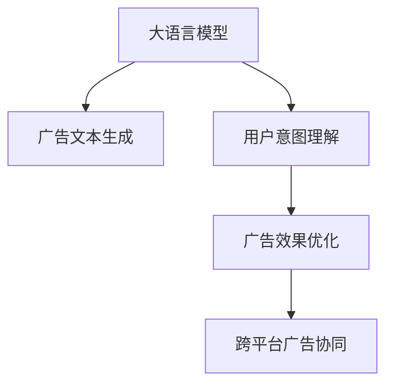

                 

## 1. 背景介绍

在数字化时代，广告已经从传统的电视、广播、报纸等媒体转向以互联网为基础的数字广告。相比于传统的广告形式，数字广告更加精准、可衡量、可优化。互联网广告通过数据分析，可以更精准地定位用户，实现广告的个性化投放。近年来，利用人工智能技术，特别是大语言模型(Large Language Model, LLM)，进一步提升了广告的个性化和效果。

### 1.1 问题由来

目前，基于大语言模型的广告技术已经广泛应用于搜索引擎广告、社交媒体广告、推荐系统等多个领域。这些技术通过训练大语言模型，使其能够理解用户查询意图、偏好、上下文等，从而进行精准的营销定位和广告推荐。然而，传统的大语言模型虽然在通用语言理解方面取得了巨大进展，但在广告领域的针对性营销能力还有待提升。本文将从原理和实践两方面，深入探讨大语言模型在广告中的应用，并提出一些新的优化方法和思路。

### 1.2 问题核心关键点

基于大语言模型的广告技术主要包括以下几个关键点：

- **广告文本生成**：利用大语言模型生成具有吸引力的广告文本，提升用户点击率。
- **用户意图理解**：通过理解用户查询意图，进行精准的定向广告投放。
- **广告效果优化**：通过数据分析，对广告投放策略进行优化，提升广告的ROI。
- **跨平台广告协同**：不同平台之间的广告数据整合和协同优化，提升广告效果。

这些关键点构成了一个完整的基于大语言模型的广告投放生态，下面将详细展开讨论。

## 2. 核心概念与联系

### 2.1 核心概念概述

为了更好地理解基于大语言模型的广告技术，本节将介绍几个密切相关的核心概念：

- **大语言模型**：如GPT、BERT等，通过大规模无监督学习，学习到丰富的语言知识，可以用于广告文本生成、用户意图理解等多个场景。
- **广告文本生成**：利用大语言模型生成具有吸引力和针对性的广告文本，提高点击率和转化率。
- **用户意图理解**：通过自然语言理解技术，理解用户查询意图和需求，进行精准的定向广告投放。
- **广告效果优化**：通过数据分析和机器学习技术，优化广告投放策略，提升广告效果。
- **跨平台广告协同**：不同平台之间的广告数据整合和协同优化，提升广告效果。

这些概念之间的逻辑关系可以通过以下Mermaid流程图来展示：



这个流程图展示了从大语言模型到广告文本生成、用户意图理解、广告效果优化和跨平台广告协同的核心概念及其之间的关系：

1. 大语言模型通过预训练获得基础能力。
2. 广告文本生成和大用户意图理解将大语言模型的知识应用于具体场景。
3. 广告效果优化进一步提升广告投放策略的精准性和效率。
4. 跨平台广告协同实现不同平台之间的广告数据整合和协同优化，提升广告效果。

## 3. 核心算法原理 & 具体操作步骤

### 3.1 算法原理概述

基于大语言模型的广告投放技术，本质上是一种有监督的细粒度迁移学习过程。其核心思想是：将大语言模型视作一个强大的"特征提取器"，通过在广告投放数据上进行有监督的微调，使得模型输出能够匹配广告投放的目标。

形式化地，假设大语言模型为 $M_{\theta}$，其中 $\theta$ 为模型参数。给定广告投放数据集 $D=\{(x_i, y_i)\}_{i=1}^N$，其中 $x_i$ 为广告文本，$y_i$ 为点击率或其他广告效果指标。微调的目标是找到新的模型参数 $\hat{\theta}$，使得模型能够根据用户输入的查询文本 $q$ 生成最优的广告文本 $a$，并预测用户点击率 $c$：

$$
\hat{\theta}=\mathop{\arg\min}_{\theta} \mathcal{L}(M_{\theta},D)
$$

其中 $\mathcal{L}$ 为针对广告投放任务的损失函数，用于衡量模型预测输出与真实标签之间的差异。常见的损失函数包括交叉熵损失、均方误差损失等。

### 3.2 算法步骤详解

基于大语言模型的广告投放，一般包括以下几个关键步骤：

**Step 1: 准备广告文本和标注数据**
- 收集用户查询文本 $q$ 和对应的广告文本 $a$，同时收集广告点击率 $c$ 等效果数据，构建标注数据集 $D$。
- 对标注数据进行预处理，去除噪声和无关信息，构建干净、高质量的训练集。

**Step 2: 添加任务适配层**
- 根据广告投放任务，在预训练语言模型顶层设计合适的输出层和损失函数。
- 对于点击率预测任务，通常在顶层添加回归层和均方误差损失函数。
- 对于广告文本生成任务，可以设计GAN框架，让模型同时学习生成器和判别器。

**Step 3: 设置微调超参数**
- 选择合适的优化算法及其参数，如 AdamW、SGD 等，设置学习率、批大小、迭代轮数等。
- 设置正则化技术及强度，包括权重衰减、Dropout、Early Stopping等。
- 确定冻结预训练参数的策略，如仅微调顶层，或全部参数都参与微调。

**Step 4: 执行梯度训练**
- 将训练集数据分批次输入模型，前向传播计算损失函数。
- 反向传播计算参数梯度，根据设定的优化算法和学习率更新模型参数。
- 周期性在验证集上评估模型性能，根据性能指标决定是否触发 Early Stopping。
- 重复上述步骤直到满足预设的迭代轮数或 Early Stopping 条件。

**Step 5: 测试和部署**
- 在测试集上评估微调后模型 $M_{\hat{\theta}}$ 的性能，对比微调前后的效果提升。
- 使用微调后的模型对新样本进行推理预测，集成到实际的广告投放系统中。
- 持续收集新的数据，定期重新微调模型，以适应数据分布的变化。

以上是基于大语言模型的广告投放的一般流程。在实际应用中，还需要针对具体广告投放任务的特点，对微调过程的各个环节进行优化设计，如改进训练目标函数，引入更多的正则化技术，搜索最优的超参数组合等，以进一步提升模型性能。

### 3.3 算法优缺点

基于大语言模型的广告投放方法具有以下优点：

1. **个性化强**：利用大语言模型能够生成具有针对性的广告文本，提升用户点击率。
2. **效果显著**：在学术界和工业界的诸多广告投放任务上，基于大语言模型的方法已经刷新了最先进的性能指标。
3. **高效可控**：通过微调，可以快速适配不同广告投放场景，提升广告投放效果。
4. **易于优化**：利用数据增强、对抗训练等技术，可以进一步提升广告投放的鲁棒性和效果。

同时，该方法也存在一定的局限性：

1. **数据依赖性强**：微调的效果很大程度上取决于广告投放数据的数量和质量，获取高质量广告投放数据往往成本较高。
2. **泛化能力有限**：当广告投放数据与预训练数据的分布差异较大时，微调的性能提升有限。
3. **可解释性不足**：微调模型缺乏可解释性，难以对其决策过程进行分析和调试。
4. **资源消耗大**：大语言模型通常参数量较大，训练和推理所需的计算资源和内存较大，对硬件资源有较高要求。

尽管存在这些局限性，但就目前而言，基于大语言模型的广告投放方法仍然是大规模广告投放的重要手段。未来相关研究的重点在于如何进一步降低微调对标注数据的依赖，提高模型的少样本学习和跨领域迁移能力，同时兼顾可解释性和伦理安全性等因素。

### 3.4 算法应用领域

基于大语言模型的广告投放技术，已经在搜索引擎广告、社交媒体广告、推荐系统等多个领域取得了广泛应用，覆盖了几乎所有常见广告投放场景，例如：

- **搜索引擎广告**：通过分析用户查询意图，生成具有针对性的广告文本，提高点击率和转化率。
- **社交媒体广告**：通过分析用户行为数据，生成具有吸引力的广告内容，提高用户参与度。
- **推荐系统**：通过广告数据和其他用户行为数据，预测用户可能感兴趣的商品或服务，生成个性化广告。
- **跨平台广告协同**：整合不同平台之间的广告数据，进行协同优化，提升广告效果。

除了上述这些经典场景外，大语言模型广告投放技术还被创新性地应用于更多的创新场景中，如可控文本生成、智能投放策略优化等，为广告技术带来了新的突破。随着预训练模型和广告投放方法的不断进步，相信广告技术将在更广阔的应用领域大放异彩。

## 4. 数学模型和公式 & 详细讲解

### 4.1 数学模型构建

假设广告投放数据集 $D=\{(x_i, y_i)\}_{i=1}^N$，其中 $x_i$ 为广告文本，$y_i$ 为点击率或其他广告效果指标。利用大语言模型 $M_{\theta}$ 进行微调，其优化目标是最小化经验风险，即找到最优参数：

$$
\theta^* = \mathop{\arg\min}_{\theta} \mathcal{L}(\theta)
$$

其中 $\mathcal{L}$ 为针对广告投放任务的损失函数，用于衡量模型预测输出与真实标签之间的差异。常见的损失函数包括交叉熵损失、均方误差损失等。假设广告文本生成任务的目标是生成一个广告文本 $a$，使得用户点击率最大化。则点击率预测任务的损失函数可以表示为：

$$
\mathcal{L}(\theta) = \sum_{i=1}^N \ell(M_{\theta}(x_i), y_i)
$$

其中 $\ell$ 为交叉熵损失函数，用于衡量模型预测值和真实标签之间的差异。

### 4.2 公式推导过程

假设广告文本生成任务的目标是生成一个广告文本 $a$，使得用户点击率最大化。则广告文本生成任务的损失函数可以表示为：

$$
\mathcal{L}(\theta) = -\frac{1}{N} \sum_{i=1}^N c_i \log P_{\theta}(a|x_i)
$$

其中 $P_{\theta}(a|x_i)$ 为模型在广告文本 $x_i$ 条件下的生成概率，$c_i$ 为广告点击率。

通过链式法则，可以得到损失函数对参数 $\theta$ 的梯度为：

$$
\frac{\partial \mathcal{L}(\theta)}{\partial \theta} = -\frac{1}{N} \sum_{i=1}^N c_i \frac{\partial P_{\theta}(a|x_i)}{\partial \theta}
$$

其中 $\frac{\partial P_{\theta}(a|x_i)}{\partial \theta}$ 可以通过反向传播算法计算得到。

在得到损失函数的梯度后，即可带入参数更新公式，完成模型的迭代优化。重复上述过程直至收敛，最终得到适应广告投放任务的最优模型参数 $\theta^*$。

## 5. 项目实践：代码实例和详细解释说明

### 5.1 开发环境搭建

在进行广告投放微调实践前，我们需要准备好开发环境。以下是使用Python进行PyTorch开发的环境配置流程：

1. 安装Anaconda：从官网下载并安装Anaconda，用于创建独立的Python环境。

2. 创建并激活虚拟环境：
```bash
conda create -n pytorch-env python=3.8 
conda activate pytorch-env
```

3. 安装PyTorch：根据CUDA版本，从官网获取对应的安装命令。例如：
```bash
conda install pytorch torchvision torchaudio cudatoolkit=11.1 -c pytorch -c conda-forge
```

4. 安装Transformers库：
```bash
pip install transformers
```

5. 安装各类工具包：
```bash
pip install numpy pandas scikit-learn matplotlib tqdm jupyter notebook ipython
```

完成上述步骤后，即可在`pytorch-env`环境中开始微调实践。

### 5.2 源代码详细实现

这里我们以点击率预测任务为例，给出使用Transformers库对BERT模型进行微调的PyTorch代码实现。

首先，定义广告文本数据集处理函数：

```python
from transformers import BertTokenizer
from torch.utils.data import Dataset
import torch

class AdDataset(Dataset):
    def __init__(self, texts, clicks, tokenizer, max_len=128):
        self.texts = texts
        self.clicks = clicks
        self.tokenizer = tokenizer
        self.max_len = max_len
        
    def __len__(self):
        return len(self.texts)
    
    def __getitem__(self, item):
        text = self.texts[item]
        click = self.clicks[item]
        
        encoding = self.tokenizer(text, return_tensors='pt', max_length=self.max_len, padding='max_length', truncation=True)
        input_ids = encoding['input_ids'][0]
        attention_mask = encoding['attention_mask'][0]
        
        # 将点击率转化为回归标签
        click = torch.tensor([click], dtype=torch.float32)
        
        return {'input_ids': input_ids, 
                'attention_mask': attention_mask,
                'clicks': click}
```

然后，定义模型和优化器：

```python
from transformers import BertForRegression, AdamW

model = BertForRegression.from_pretrained('bert-base-cased')

optimizer = AdamW(model.parameters(), lr=2e-5)
```

接着，定义训练和评估函数：

```python
from torch.utils.data import DataLoader
from tqdm import tqdm
from sklearn.metrics import mean_squared_error

device = torch.device('cuda') if torch.cuda.is_available() else torch.device('cpu')
model.to(device)

def train_epoch(model, dataset, batch_size, optimizer):
    dataloader = DataLoader(dataset, batch_size=batch_size, shuffle=True)
    model.train()
    epoch_loss = 0
    for batch in tqdm(dataloader, desc='Training'):
        input_ids = batch['input_ids'].to(device)
        attention_mask = batch['attention_mask'].to(device)
        clicks = batch['clicks'].to(device)
        model.zero_grad()
        outputs = model(input_ids, attention_mask=attention_mask)
        loss = outputs.loss
        epoch_loss += loss.item()
        loss.backward()
        optimizer.step()
    return epoch_loss / len(dataloader)

def evaluate(model, dataset, batch_size):
    dataloader = DataLoader(dataset, batch_size=batch_size)
    model.eval()
    mse = 0
    with torch.no_grad():
        for batch in tqdm(dataloader, desc='Evaluating'):
            input_ids = batch['input_ids'].to(device)
            attention_mask = batch['attention_mask'].to(device)
            clicks = batch['clicks'].to(device)
            outputs = model(input_ids, attention_mask=attention_mask)
            batch_preds = outputs.logits.sigmoid().to('cpu').tolist()
            batch_clicks = clicks.to('cpu').tolist()
            for pred, click in zip(batch_preds, batch_clicks):
                mse += (pred - click)**2
    return mse / len(dataloader)

```

最后，启动训练流程并在测试集上评估：

```python
epochs = 5
batch_size = 16

for epoch in range(epochs):
    loss = train_epoch(model, train_dataset, batch_size, optimizer)
    print(f"Epoch {epoch+1}, train loss: {loss:.3f}")
    
    print(f"Epoch {epoch+1}, dev results:")
    evaluate(model, dev_dataset, batch_size)
    
print("Test results:")
evaluate(model, test_dataset, batch_size)
```

以上就是使用PyTorch对BERT进行点击率预测任务微调的完整代码实现。可以看到，得益于Transformers库的强大封装，我们可以用相对简洁的代码完成BERT模型的加载和微调。

### 5.3 代码解读与分析

让我们再详细解读一下关键代码的实现细节：

**AdDataset类**：
- `__init__`方法：初始化广告文本、点击率、分词器等关键组件。
- `__len__`方法：返回数据集的样本数量。
- `__getitem__`方法：对单个样本进行处理，将文本输入编码为token ids，将点击率转化为回归标签，并对其进行定长padding，最终返回模型所需的输入。

**数据处理步骤**：
- 使用BertTokenizer将广告文本进行分词，并编码成模型所需的token ids。
- 将点击率转化为回归标签，方便模型预测。
- 对token ids进行定长padding，保证所有样本的序列长度一致。

**模型和优化器**：
- 使用BertForRegression模型，用于回归任务。
- 使用AdamW优化器，设置合适的学习率。

**训练和评估函数**：
- 使用PyTorch的DataLoader对数据集进行批次化加载，供模型训练和推理使用。
- 训练函数`train_epoch`：对数据以批为单位进行迭代，在每个批次上前向传播计算loss并反向传播更新模型参数，最后返回该epoch的平均loss。
- 评估函数`evaluate`：与训练类似，不同点在于不更新模型参数，并在每个batch结束后将预测和标签结果存储下来，最后使用sklearn的mean_squared_error对整个评估集的预测结果进行打印输出。

**训练流程**：
- 定义总的epoch数和batch size，开始循环迭代
- 每个epoch内，先在训练集上训练，输出平均loss
- 在验证集上评估，输出点击率预测误差
- 所有epoch结束后，在测试集上评估，给出最终测试结果

可以看到，PyTorch配合Transformers库使得BERT微调的代码实现变得简洁高效。开发者可以将更多精力放在数据处理、模型改进等高层逻辑上，而不必过多关注底层的实现细节。

当然，工业级的系统实现还需考虑更多因素，如模型的保存和部署、超参数的自动搜索、更灵活的任务适配层等。但核心的微调范式基本与此类似。

## 6. 实际应用场景

### 6.1 智能广告投放

基于大语言模型的广告投放技术，可以应用于智能广告投放系统，实现广告的精准投放和效果优化。智能广告投放系统通过分析用户行为数据，结合预训练语言模型，生成具有针对性的广告内容，并进行精准的广告投放，提升广告点击率和转化率。

在技术实现上，可以收集用户的历史行为数据，如浏览记录、点击行为、购买记录等，并将这些数据转化为广告投放的监督信号。在此基础上对预训练语言模型进行微调，使其能够生成具有针对性的广告文本，并进行点击率预测。优化广告投放策略，实现广告的精准投放和效果优化。

### 6.2 跨平台广告协同

在实际应用中，不同平台之间的广告投放往往需要协同优化，才能最大化广告效果。基于大语言模型的跨平台广告协同技术，可以整合不同平台之间的广告数据，进行协同优化，提升广告效果。

具体而言，可以收集不同平台上的广告点击率、广告效果等数据，构建跨平台的广告投放数据集。在此基础上对预训练语言模型进行微调，使其能够根据跨平台的广告数据生成具有针对性的广告文本，并进行点击率预测。优化广告投放策略，实现跨平台广告的协同优化，提升广告效果。

### 6.3 推荐系统

推荐系统是广告投放的重要应用之一。利用大语言模型可以进一步提升推荐系统的精准性和效果。在推荐系统中，可以利用广告投放数据和用户行为数据，构建推荐任务的数据集。在此基础上对预训练语言模型进行微调，使其能够生成具有针对性的推荐内容，并进行点击率预测。优化推荐策略，实现个性化推荐和效果优化。

### 6.4 未来应用展望

随着大语言模型和广告投放技术的不断发展，基于大语言模型的广告投放方法将在更广阔的应用领域大放异彩。

在智慧零售领域，基于大语言模型的广告投放技术可以帮助零售商实现精准的营销定位，提升销售转化率。在智慧城市领域，利用大语言模型可以实现更高效的城市管理，提升市民的参与度和满意度。在智能制造领域，利用大语言模型可以实现更精准的广告投放，提升企业的市场竞争力。

此外，在娱乐、教育、健康等更多领域，基于大语言模型的广告投放技术也将不断涌现，为各行各业带来新的商业模式和用户体验。相信随着技术的日益成熟，基于大语言模型的广告投放方法必将成为数字营销的重要手段，推动数字经济的进一步发展。

## 7. 工具和资源推荐

### 7.1 学习资源推荐

为了帮助开发者系统掌握大语言模型广告投放的理论基础和实践技巧，这里推荐一些优质的学习资源：

1. 《Transformer从原理到实践》系列博文：由大模型技术专家撰写，深入浅出地介绍了Transformer原理、BERT模型、广告投放技术等前沿话题。

2. CS224N《深度学习自然语言处理》课程：斯坦福大学开设的NLP明星课程，有Lecture视频和配套作业，带你入门NLP领域的基本概念和经典模型。

3. 《Natural Language Processing with Transformers》书籍：Transformers库的作者所著，全面介绍了如何使用Transformers库进行NLP任务开发，包括广告投放在内的诸多范式。

4. HuggingFace官方文档：Transformers库的官方文档，提供了海量预训练模型和完整的广告投放样例代码，是上手实践的必备资料。

5. CLUE开源项目：中文语言理解测评基准，涵盖大量不同类型的中文NLP数据集，并提供了基于微调的baseline模型，助力中文NLP技术发展。

通过对这些资源的学习实践，相信你一定能够快速掌握大语言模型广告投放的精髓，并用于解决实际的广告投放问题。

### 7.2 开发工具推荐

高效的开发离不开优秀的工具支持。以下是几款用于大语言模型广告投放开发的常用工具：

1. PyTorch：基于Python的开源深度学习框架，灵活动态的计算图，适合快速迭代研究。大部分预训练语言模型都有PyTorch版本的实现。

2. TensorFlow：由Google主导开发的开源深度学习框架，生产部署方便，适合大规模工程应用。同样有丰富的预训练语言模型资源。

3. Transformers库：HuggingFace开发的NLP工具库，集成了众多SOTA语言模型，支持PyTorch和TensorFlow，是进行广告投放任务开发的利器。

4. Weights & Biases：模型训练的实验跟踪工具，可以记录和可视化模型训练过程中的各项指标，方便对比和调优。与主流深度学习框架无缝集成。

5. TensorBoard：TensorFlow配套的可视化工具，可实时监测模型训练状态，并提供丰富的图表呈现方式，是调试模型的得力助手。

6. Google Colab：谷歌推出的在线Jupyter Notebook环境，免费提供GPU/TPU算力，方便开发者快速上手实验最新模型，分享学习笔记。

合理利用这些工具，可以显著提升大语言模型广告投放任务的开发效率，加快创新迭代的步伐。

### 7.3 相关论文推荐

大语言模型和广告投放技术的发展源于学界的持续研究。以下是几篇奠基性的相关论文，推荐阅读：

1. Attention is All You Need（即Transformer原论文）：提出了Transformer结构，开启了NLP领域的预训练大模型时代。

2. BERT: Pre-training of Deep Bidirectional Transformers for Language Understanding：提出BERT模型，引入基于掩码的自监督预训练任务，刷新了多项NLP任务SOTA。

3. Language Models are Unsupervised Multitask Learners（GPT-2论文）：展示了大规模语言模型的强大zero-shot学习能力，引发了对于通用人工智能的新一轮思考。

4. Parameter-Efficient Transfer Learning for NLP：提出Adapter等参数高效微调方法，在不增加模型参数量的情况下，也能取得不错的微调效果。

5. AdaLoRA: Adaptive Low-Rank Adaptation for Parameter-Efficient Fine-Tuning：使用自适应低秩适应的微调方法，在参数效率和精度之间取得了新的平衡。

6. Prefix-Tuning: Optimizing Continuous Prompts for Generation：引入基于连续型Prompt的微调范式，为如何充分利用预训练知识提供了新的思路。

这些论文代表了大语言模型广告投放技术的发展脉络。通过学习这些前沿成果，可以帮助研究者把握学科前进方向，激发更多的创新灵感。

## 8. 总结：未来发展趋势与挑战

### 8.1 总结

本文对基于大语言模型的广告投放方法进行了全面系统的介绍。首先阐述了大语言模型和广告投放技术的研究背景和意义，明确了广告投放技术在数字营销中的重要性。其次，从原理到实践，详细讲解了大语言模型在广告文本生成、用户意图理解、广告效果优化等场景中的应用，给出了广告投放任务微调的具体步骤和代码实现。同时，本文还探讨了广告投放技术在智能广告投放、跨平台广告协同、推荐系统等场景中的应用前景，展示了广告投放技术的广阔前景。

通过本文的系统梳理，可以看到，基于大语言模型的广告投放技术正在成为数字营销的重要手段，极大地提升了广告投放的精准性和效果。未来，随着大语言模型和广告投放技术的不断进步，基于大语言模型的广告投放方法必将在更广阔的应用领域大放异彩，推动数字经济的进一步发展。

### 8.2 未来发展趋势

展望未来，大语言模型广告投放技术将呈现以下几个发展趋势：

1. **多模态广告投放**：结合视觉、听觉等多模态数据，进行更全面、精准的广告投放。利用大语言模型对多模态数据进行融合，生成具有吸引力的广告内容。
2. **跨领域迁移学习**：利用大语言模型在不同领域之间的迁移学习能力，进行跨领域的广告投放优化，提升广告效果。
3. **个性化推荐**：结合用户行为数据，进行更精准的个性化推荐，提升广告投放的精准性。
4. **实时广告投放优化**：利用大数据分析技术，进行实时的广告投放优化，提高广告投放效果。
5. **隐私保护**：在大数据时代，用户隐私保护成为重要课题。利用联邦学习等技术，进行隐私保护下的广告投放优化，保障用户隐私。

以上趋势凸显了大语言模型广告投放技术的广阔前景。这些方向的探索发展，必将进一步提升广告投放的精准性和效果，推动数字营销的进一步发展。

### 8.3 面临的挑战

尽管大语言模型广告投放技术已经取得了显著成效，但在迈向更加智能化、普适化应用的过程中，它仍面临一些挑战：

1. **数据依赖性强**：广告投放的效果很大程度上取决于广告投放数据的数量和质量，获取高质量广告投放数据往往成本较高。如何进一步降低广告投放对标注数据的依赖，是未来研究的重点。
2. **跨平台协同难度大**：不同平台之间的广告数据格式和广告投放策略不同，跨平台广告协同难度较大。需要研究跨平台的广告数据整合和协同优化方法。
3. **广告效果评估难**：广告效果评估指标复杂多样，难以进行全面评估。需要研究更加科学、客观的广告效果评估方法。
4. **广告投放风险高**：广告投放涉及大量资金和资源投入，一旦决策失误，损失巨大。需要研究更加稳健的广告投放策略和风险控制机制。
5. **隐私保护问题**：广告投放过程中涉及大量用户行为数据，隐私保护问题成为重要课题。需要研究隐私保护下的广告投放优化方法。

尽管面临这些挑战，但随着学界和产业界的共同努力，这些问题终将得到解决，大语言模型广告投放技术必将迈向新的高度，为数字营销带来新的突破。

### 8.4 研究展望

面向未来，大语言模型广告投放技术需要在以下几个方向进行深入研究：

1. **多模态广告投放**：结合视觉、听觉等多模态数据，进行更全面、精准的广告投放。利用大语言模型对多模态数据进行融合，生成具有吸引力的广告内容。
2. **跨领域迁移学习**：利用大语言模型在不同领域之间的迁移学习能力，进行跨领域的广告投放优化，提升广告效果。
3. **个性化推荐**：结合用户行为数据，进行更精准的个性化推荐，提升广告投放的精准性。
4. **实时广告投放优化**：利用大数据分析技术，进行实时的广告投放优化，提高广告投放效果。
5. **隐私保护**：在大数据时代，用户隐私保护成为重要课题。利用联邦学习等技术，进行隐私保护下的广告投放优化，保障用户隐私。

这些研究方向将推动大语言模型广告投放技术的进一步发展，为数字营销带来新的突破。相信随着技术的不断进步，大语言模型广告投放技术必将在更广阔的应用领域大放异彩，推动数字经济的进一步发展。

## 9. 附录：常见问题与解答

**Q1：广告文本生成的原理是什么？**

A: 广告文本生成是一种基于大语言模型的生成任务，利用大语言模型生成具有吸引力和针对性的广告文本，提高用户点击率。具体来说，广告文本生成可以采用GAN框架，让模型同时学习生成器和判别器。生成器利用大语言模型生成广告文本，判别器则通过分析用户行为数据，判断生成的广告文本是否具有吸引力。通过对抗训练的方式，生成器逐渐生成更加优质的广告文本。

**Q2：如何优化广告投放策略？**

A: 广告投放策略的优化可以通过数据分析和机器学习技术实现。具体而言，可以收集用户的历史行为数据，如浏览记录、点击行为、购买记录等，构建广告投放的数据集。利用大语言模型对广告文本进行生成和点击率预测，优化广告投放策略，提升广告效果。此外，可以利用交叉验证、梯度增强等技术，进行广告投放策略的优化。

**Q3：如何保障用户隐私？**

A: 用户隐私保护在大数据时代成为重要课题。在广告投放过程中，可以采用联邦学习等技术，对用户数据进行隐私保护。联邦学习通过分布式训练的方式，保护用户数据的隐私。在广告投放过程中，可以利用联邦学习技术，进行隐私保护下的广告投放优化，保障用户隐私。

**Q4：广告投放的效果如何评估？**

A: 广告投放的效果评估指标复杂多样，需要综合考虑点击率、转化率、ROI等多个指标。可以采用交叉验证、A/B测试等技术，进行广告投放效果的评估。此外，可以利用大语言模型对广告文本进行生成和点击率预测，优化广告投放效果。

通过本文的系统梳理，可以看到，基于大语言模型的广告投放技术正在成为数字营销的重要手段，极大地提升了广告投放的精准性和效果。未来，随着大语言模型和广告投放技术的不断进步，基于大语言模型的广告投放方法必将在更广阔的应用领域大放异彩，推动数字经济的进一步发展。

