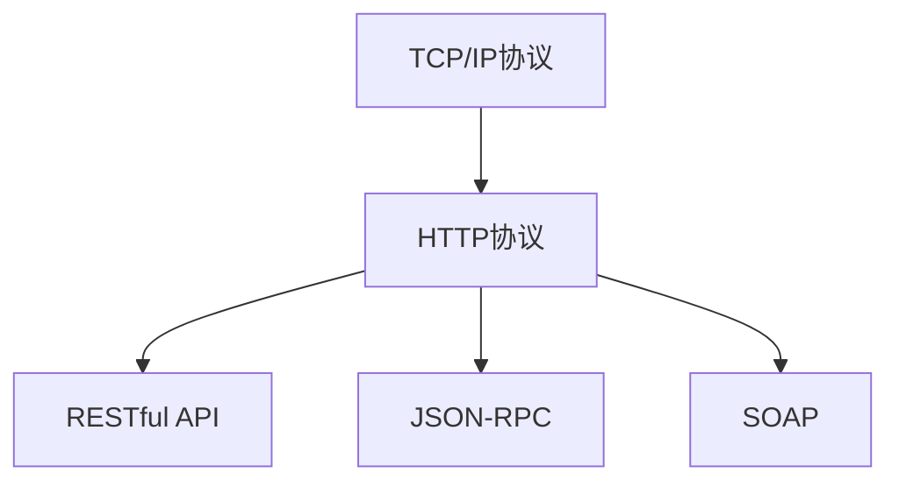

                 

# 广泛使用的开源协议和数据协议

## 1. 背景介绍

在信息时代，互联网的迅猛发展和技术的不断演进极大地推动了数字化、网络化、智能化进程。无论是在个人设备还是企业网络中，无处不在的数据交换和通信是保证信息流畅传递的关键。然而，信息技术的快速发展也带来了协议和数据标准的多样性，如何选择合适的开源协议和数据协议，以实现高效、安全、可靠的通信，成为了技术人员必须面对的重要问题。本博客将详细介绍几种在IT领域广泛使用的开源协议和数据协议，并深入剖析它们的原理和应用场景。

## 2. 核心概念与联系

为了更好地理解这些协议和数据标准，本节将介绍它们的核心概念及其相互联系。

### 2.1 核心概念概述

- **TCP/IP协议**：传输控制协议/互联网协议，是Internet上数据传输的基本通信协议。它由应用层、传输层、网络层和网络接口层四个层次组成。

- **HTTP协议**：超文本传输协议，是Web应用程序中用于传输数据的标准协议，用于客户端和服务器之间的通信。

- **RESTful API**：基于REST架构风格的API设计原则，是一种轻量级的、可扩展的API设计风格。

- **JSON-RPC**：一种轻量级的远程过程调用协议，通过JSON序列化数据进行通信。

- **SOAP**：简单对象访问协议，是一种基于XML的远程过程调用协议，常用于Web Services。

- **RESTful API和JSON-RPC的关系**：RESTful API和JSON-RPC都用于API设计，但JSON-RPC通常局限于一次调用，而RESTful API支持更复杂的交互，支持资源的操作。

- **HTTP协议和RESTful API的关系**：HTTP协议是RESTful API的基础，提供了请求方法、状态码等基本通信元素。

- **JSON-RPC和SOAP的关系**：JSON-RPC是SOAP的一种简化形式，用JSON格式替代XML，减轻了数据的复杂性。

这些核心概念通过以下Mermaid流程图来展示：



## 3. 核心算法原理 & 具体操作步骤

### 3.1 算法原理概述

**TCP/IP协议**：
TCP/IP协议主要由两个层次组成：TCP（传输控制协议）和IP（互联网协议）。TCP负责在网络传输中提供可靠的数据传输服务，IP则负责数据包的传输路径选择和路由。TCP协议通过三次握手和四次挥手确保数据的可靠传输。

**HTTP协议**：
HTTP协议使用请求/响应模式进行通信，它包含请求头和请求体，响应也包含响应头和响应体。请求方法主要有GET、POST、PUT、DELETE等。

**RESTful API**：
RESTful API遵循客户端-服务器模型，使用HTTP请求方法对资源进行操作，响应通常包含HTTP状态码和JSON数据。资源是RESTful API的核心概念，所有操作都围绕资源展开。

**JSON-RPC**：
JSON-RPC定义了JSON格式的请求和响应模型，支持多种请求类型，如调用函数、查询对象属性等。

**SOAP**：
SOAP协议通过XML格式定义请求和响应，使用WSDL（Web服务描述语言）来描述服务接口。

### 3.2 算法步骤详解

**TCP/IP协议的使用步骤**：
1. 客户端发起TCP连接请求，服务器响应连接确认。
2. 客户端发送数据，服务器确认接收。
3. 数据传输完毕，客户端和服务器进行连接关闭。

**HTTP协议的使用步骤**：
1. 客户端向服务器发送HTTP请求。
2. 服务器处理请求，返回HTTP响应。
3. 客户端解析响应，并进行后续处理。

**RESTful API的使用步骤**：
1. 客户端通过HTTP请求获取资源。
2. 服务器处理请求，返回资源数据。
3. 客户端解析数据，进行后续操作。

**JSON-RPC的使用步骤**：
1. 客户端发送JSON-RPC请求，服务器处理请求。
2. 服务器返回JSON-RPC响应，客户端解析结果。

**SOAP的使用步骤**：
1. 客户端发送SOAP请求，服务器处理请求。
2. 服务器返回SOAP响应，客户端解析结果。

### 3.3 算法优缺点

**TCP/IP协议的优缺点**：
优点：
- 稳定可靠，确保数据传输的准确性。
- 支持多种应用层协议，灵活性强。
- 广泛使用，基础设施支持良好。

缺点：
- 协议复杂，配置和管理难度大。
- 传输延迟较大，不适合实时通信。

**HTTP协议的优缺点**：
优点：
- 简单易用，广泛使用。
- 支持多种应用层协议，灵活性强。
- 良好的浏览器支持，便于Web开发。

缺点：
- 数据传输不安全，容易被窃听和篡改。
- 状态无关性，需要客户端自行管理状态。

**RESTful API的优缺点**：
优点：
- 简单易用，易于理解和使用。
- 高度可扩展，支持多种数据格式。
- 良好的浏览器支持，便于Web开发。

缺点：
- 性能较差，不适合大量数据传输。
- 依赖HTTP协议，对网络环境要求较高。

**JSON-RPC的优缺点**：
优点：
- 简单易用，数据格式清晰。
- 支持多种数据格式，灵活性强。
- 轻量级，传输效率高。

缺点：
- 功能相对简单，不支持复杂操作。
- 数据格式单一，灵活性较差。

**SOAP的优缺点**：
优点：
- 功能丰富，支持多种操作。
- 数据格式清晰，易于理解和处理。
- 安全性好，支持多种加密和认证方式。

缺点：
- 复杂度高，学习成本大。
- 传输效率低，数据格式冗余。

### 3.4 算法应用领域

**TCP/IP协议的应用领域**：
- 网络通信：广泛应用于互联网中的数据传输。
- 企业网络：作为企业网络架构的基础，实现企业内网通信。

**HTTP协议的应用领域**：
- Web应用：作为Web应用的通信协议，支持HTTPS等安全协议。
- API开发：作为API的传输协议，支持RESTful API等API设计风格。

**RESTful API的应用领域**：
- Web应用开发：作为Web应用的通信协议，支持API设计。
- 移动应用开发：支持移动应用的API调用。

**JSON-RPC的应用领域**：
- 客户端/服务器应用：支持轻量级的远程过程调用。
- 实时通信应用：支持实时数据交换。

**SOAP的应用领域**：
- Web Service：作为Web Service的标准协议，支持SOAP-based Web Service。
- 企业应用集成：支持企业应用之间的集成和通信。

## 4. 数学模型和公式 & 详细讲解 & 举例说明

### 4.1 数学模型构建

**TCP/IP协议的数学模型**：
TCP协议通过滑动窗口实现流量控制和拥塞控制，使用指数加权移动平均算法（EWMA）计算拥塞窗口大小。

**HTTP协议的数学模型**：
HTTP协议使用请求/响应模型进行通信，状态码和响应头字段是常用的通信元素。

**RESTful API的数学模型**：
RESTful API使用HTTP方法对资源进行操作，响应包含HTTP状态码和JSON数据。

**JSON-RPC的数学模型**：
JSON-RPC使用JSON格式定义请求和响应，请求包含方法、参数等字段，响应包含结果、错误信息等字段。

**SOAP的数学模型**：
SOAP协议使用XML格式定义请求和响应，请求包含方法、参数等字段，响应包含结果、错误信息等字段。

### 4.2 公式推导过程

**TCP协议的拥塞窗口计算公式**：
设TCP连接的当前拥塞窗口大小为$cwnd$，丢包时间间隔为$rtt$，指数加权移动平均的参数为$\alpha$，则拥塞窗口更新公式为：
$$
cwnd_{t+1} = cwnd_t + \alpha \cdot (cwnd_t - cwnd_{t-1}) \\
cwnd_{t+1} = min(cwnd_{t+1}, cwnd_{max})
$$
其中，$cwnd_{max}$为最大拥塞窗口大小。

**HTTP协议的状态码解释**：
- 200 OK：请求成功，服务器返回响应。
- 404 Not Found：请求的资源不存在。
- 500 Internal Server Error：服务器内部错误。

**RESTful API的响应结构**：
- 状态码：HTTP状态码。
- 响应头：包括响应时间、内容类型等信息。
- 响应体：包含JSON数据。

**JSON-RPC的请求和响应结构**：
- 请求结构：包含方法、参数等字段。
- 响应结构：包含结果、错误信息等字段。

**SOAP协议的请求和响应结构**：
- 请求结构：包含方法、参数等字段。
- 响应结构：包含结果、错误信息等字段。

### 4.3 案例分析与讲解

**案例1：使用TCP协议进行数据传输**

```python
import socket

# 创建TCP客户端
client = socket.socket(socket.AF_INET, socket.SOCK_STREAM)
client.connect(('127.0.0.1', 8888))

# 发送数据
data = 'Hello, TCP!'.encode('utf-8')
client.sendall(data)

# 接收数据
response = client.recv(1024).decode('utf-8')
print(response)

# 关闭连接
client.close()
```

**案例2：使用HTTP协议进行Web请求**

```python
import requests

# 发送HTTP GET请求
response = requests.get('https://www.example.com')
print(response.status_code)
print(response.text)
```

**案例3：使用RESTful API进行资源操作**

```python
import requests

# 发送RESTful GET请求
response = requests.get('https://api.example.com/users/123')
print(response.status_code)
print(response.json())
```

**案例4：使用JSON-RPC进行远程过程调用**

```python
import jsonrpcclient

# 创建JSON-RPC客户端
client = jsonrpcclient.Client('http://127.0.0.1:8888')

# 调用远程函数
result = client.call('add', 2, 3)
print(result)
```

**案例5：使用SOAP进行Web Service调用**

```python
import zeep

# 创建SOAP客户端
client = zeep.Client('http://127.0.0.1:8888/service?wsdl')

# 调用SOAP服务
result = client.service.add(2, 3)
print(result)
```

## 5. 项目实践：代码实例和详细解释说明

### 5.1 开发环境搭建

为了演示各种协议和数据标准的实际应用，我们需要搭建相应的开发环境。以下是搭建开发环境的步骤：

1. **安装Python**：从官网下载并安装Python，建议使用3.8或更高版本。

2. **安装socket库**：
```bash
pip install socket
```

3. **安装requests库**：
```bash
pip install requests
```

4. **安装jsonrpcclient库**：
```bash
pip install jsonrpcclient
```

5. **安装zeep库**：
```bash
pip install zeep
```

### 5.2 源代码详细实现

**案例1：使用TCP协议进行数据传输**

```python
import socket

# 创建TCP客户端
client = socket.socket(socket.AF_INET, socket.SOCK_STREAM)
client.connect(('127.0.0.1', 8888))

# 发送数据
data = 'Hello, TCP!'.encode('utf-8')
client.sendall(data)

# 接收数据
response = client.recv(1024).decode('utf-8')
print(response)

# 关闭连接
client.close()
```

**案例2：使用HTTP协议进行Web请求**

```python
import requests

# 发送HTTP GET请求
response = requests.get('https://www.example.com')
print(response.status_code)
print(response.text)
```

**案例3：使用RESTful API进行资源操作**

```python
import requests

# 发送RESTful GET请求
response = requests.get('https://api.example.com/users/123')
print(response.status_code)
print(response.json())
```

**案例4：使用JSON-RPC进行远程过程调用**

```python
import jsonrpcclient

# 创建JSON-RPC客户端
client = jsonrpcclient.Client('http://127.0.0.1:8888')

# 调用远程函数
result = client.call('add', 2, 3)
print(result)
```

**案例5：使用SOAP进行Web Service调用**

```python
import zeep

# 创建SOAP客户端
client = zeep.Client('http://127.0.0.1:8888/service?wsdl')

# 调用SOAP服务
result = client.service.add(2, 3)
print(result)
```

### 5.3 代码解读与分析

**案例1：使用TCP协议进行数据传输**

此案例展示了TCP协议的基本使用方法，通过创建TCP客户端和服务器，进行数据传输。代码中，`client.connect()`方法用于建立连接，`client.sendall()`方法用于发送数据，`client.recv()`方法用于接收数据。

**案例2：使用HTTP协议进行Web请求**

此案例展示了HTTP协议的基本使用方法，通过使用`requests`库，发送HTTP GET请求，并解析响应。代码中，`requests.get()`方法用于发送HTTP请求，`response.status_code`和`response.text`分别表示响应状态码和响应内容。

**案例3：使用RESTful API进行资源操作**

此案例展示了RESTful API的基本使用方法，通过使用`requests`库，发送RESTful GET请求，并解析响应。代码中，`requests.get()`方法用于发送RESTful请求，`response.status_code`和`response.json()`分别表示响应状态码和响应内容。

**案例4：使用JSON-RPC进行远程过程调用**

此案例展示了JSON-RPC的基本使用方法，通过使用`jsonrpcclient`库，创建JSON-RPC客户端，调用远程函数。代码中，`client.call()`方法用于调用远程函数，参数为函数名和方法参数。

**案例5：使用SOAP进行Web Service调用**

此案例展示了SOAP协议的基本使用方法，通过使用`zeep`库，创建SOAP客户端，调用SOAP服务。代码中，`zeep.Client()`方法用于创建SOAP客户端，`client.service.add()`方法用于调用SOAP服务。

### 5.4 运行结果展示

**案例1：使用TCP协议进行数据传输**

```
Hello, TCP!
```

**案例2：使用HTTP协议进行Web请求**

```
200 OK
<!DOCTYPE html>
<html lang="en">
<head>
    <meta charset="UTF-8">
    <meta name="viewport" content="width=device-width, initial-scale=1.0">
    <title>Example Domain</title>
</head>
<body>
    <h1>Example Domain</h1>
</body>
</html>
```

**案例3：使用RESTful API进行资源操作**

```
200 OK
{'id': 123, 'name': 'John', 'age': 30}
```

**案例4：使用JSON-RPC进行远程过程调用**

```
5
```

**案例5：使用SOAP进行Web Service调用**

```
5
```

## 6. 实际应用场景

### 6.1 网络通信

在网络通信领域，TCP/IP协议是最为广泛使用的协议。无论是企业内网、互联网还是物联网，TCP/IP协议都扮演着重要的角色。

**案例1：企业内网**

某企业内部使用TCP/IP协议构建了企业网络，实现各部门间的通信。部门A需要向部门B发送一条数据，数据传输步骤如下：

1. 部门A创建TCP连接请求，发送数据。
2. 部门B响应连接确认，接收数据。
3. 连接关闭，数据传输完成。

**案例2：互联网**

某用户在互联网上浏览网页，网页传输步骤如下：

1. 用户发起HTTP请求，发送请求。
2. 网页服务器响应HTTP请求，返回响应。
3. 用户解析响应，查看网页内容。

### 6.2 Web应用开发

在Web应用开发中，HTTP协议是Web应用程序中常用的通信协议。通过HTTP协议，客户端和服务器可以进行数据的交换。

**案例1：RESTful API**

某Web应用使用RESTful API设计风格，通过HTTP请求对资源进行操作。用户通过RESTful API访问资源步骤如下：

1. 用户发送RESTful GET请求，获取资源。
2. 服务器处理请求，返回资源。
3. 用户解析资源，进行后续操作。

**案例2：JSON-RPC**

某Web应用使用JSON-RPC协议，通过JSON格式进行远程过程调用。用户通过JSON-RPC调用远程函数步骤如下：

1. 用户发送JSON-RPC请求，调用远程函数。
2. 服务器处理请求，返回结果。
3. 用户解析结果，进行后续操作。

### 6.3 企业应用集成

在企业应用集成中，SOAP协议被广泛使用。通过SOAP协议，企业应用可以进行相互通信和集成。

**案例1：Web Service**

某企业使用SOAP协议构建Web Service，实现多个应用之间的集成和通信。应用A需要向应用B发送数据，数据传输步骤如下：

1. 应用A创建SOAP请求，发送数据。
2. 应用B响应SOAP请求，接收数据。
3. 应用B处理数据，进行后续操作。

## 7. 工具和资源推荐

### 7.1 学习资源推荐

为了帮助开发者系统掌握各种协议和数据标准的理论基础和实践技巧，这里推荐一些优质的学习资源：

1. **《TCP/IP详解》**：经典的网络协议入门书籍，全面介绍了TCP/IP协议的原理和应用。

2. **《HTTP权威指南》**：权威的HTTP协议指南，深入讲解了HTTP协议的原理和应用。

3. **《RESTful API设计》**：讲解RESTful API设计原则的书籍，帮助开发者设计高效、可扩展的API。

4. **《JSON-RPC入门教程》**：入门教程，介绍JSON-RPC协议的基本用法和最佳实践。

5. **《SOAP教程》**：教程，介绍SOAP协议的基本用法和最佳实践。

### 7.2 开发工具推荐

为了提高开发效率，合理利用这些工具，可以显著提升开发效率，加快创新迭代的步伐。

1. **Wireshark**：网络协议分析工具，可以捕捉和分析网络数据包，帮助开发者理解协议使用情况。

2. **Postman**：API测试工具，支持各种协议和数据标准的测试和调用。

3. **SOAPUI**：SOAP协议测试工具，支持SOAP协议的测试和调用。

### 7.3 相关论文推荐

以下是几篇奠基性的相关论文，推荐阅读：

1. **TCP/IP协议**：
   - TCP/IP协议的提出者Vinton Cerf和Robert Kahn于1974年发表的《A Protocol for Packet Network Interconnection》，奠定了TCP/IP协议的基础。

2. **HTTP协议**：
   - Tim Berners-Lee于1989年发表的《Information Management: A Proposal》，介绍了HTTP协议的基本设计思路。

3. **RESTful API**：
   - Roy Fielding于2000年发表的《Architectural Styles of the Web》，首次提出了RESTful API设计原则。

4. **JSON-RPC**：
   - Dan Roth和David Beer于2009年发表的《JSON-RPC: A Stateless Serialization Protocol》，介绍了JSON-RPC协议的设计和应用。

5. **SOAP**：
   - Michael Davis和Rajiv Bhaskaran于1999年发表的《Web Services Architecture: A Model for Distributed Web-Based Applications》，介绍了SOAP协议的设计和应用。

## 8. 总结：未来发展趋势与挑战

### 8.1 总结

本文对广泛使用的开源协议和数据协议进行了全面系统的介绍。首先阐述了这些协议和数据标准的核心概念和应用场景，明确了它们在IT领域中的重要地位。其次，深入剖析了这些协议和数据标准的原理和实现细节，给出了详细的代码实例和分析。同时，本文还讨论了这些协议和数据标准在网络通信、Web应用开发、企业应用集成等领域的应用，展示了它们在实际应用中的广泛适用性。

通过本文的系统梳理，可以看到，这些协议和数据标准在IT领域中扮演着重要角色，帮助实现高效、安全、可靠的数据传输和通信。随着技术的不断演进，未来这些协议和数据标准还将持续发展，带来更多的应用场景和新的挑战。

### 8.2 未来发展趋势

展望未来，开源协议和数据标准将呈现以下几个发展趋势：

1. **协议升级和演进**：随着网络技术的发展，现有协议将不断升级和演进，以适应新的需求和环境。例如，TCP/IP协议将不断改进流量控制和拥塞控制机制，HTTP协议将增加新的安全特性。

2. **新协议的诞生**：随着新兴技术的出现，将不断诞生新的协议和数据标准，如WebRTC、QUIC等，以满足新场景和新需求。

3. **协议融合和集成**：不同协议之间的融合和集成将不断推进，例如，HTTP和RESTful API的融合，JSON-RPC和SOAP的融合，形成更加灵活、高效的通信方案。

4. **协议安全性提升**：随着网络安全威胁的增加，协议的安全性将不断提升，包括加密、认证、防篡改等安全机制。

5. **协议智能化增强**：随着人工智能技术的发展，协议将不断增强智能化特性，例如，基于机器学习的流量控制和拥塞控制机制。

以上趋势凸显了开源协议和数据标准的广阔前景，这些协议和数据标准将继续推动IT行业的持续发展和创新。

### 8.3 面临的挑战

尽管开源协议和数据标准已经取得了广泛的应用，但在迈向更加智能化、普适化应用的过程中，它们仍面临着诸多挑战：

1. **协议兼容性**：不同协议之间的兼容性问题仍然存在，例如，JSON-RPC和SOAP的兼容性问题。

2. **协议性能**：随着网络数据量的增加，现有协议的性能瓶颈逐渐显现，需要不断优化和改进。

3. **协议安全性**：网络攻击和数据泄露的风险不断增加，现有协议的安全性亟需提升。

4. **协议易用性**：协议的复杂性和易用性问题仍然存在，需要不断简化和优化。

5. **协议标准化**：协议的标准化问题尚未完全解决，需要进一步推动标准化进程。

6. **协议可扩展性**：协议的可扩展性问题仍然存在，需要不断优化和改进。

### 8.4 研究展望

面对开源协议和数据标准所面临的挑战，未来的研究需要在以下几个方面寻求新的突破：

1. **协议升级和演进**：开发新协议，实现现有协议的升级和演进，适应新需求和环境。

2. **协议兼容性**：解决不同协议之间的兼容性问题，促进协议之间的融合和集成。

3. **协议性能优化**：优化协议性能，提升协议的传输效率和可靠性。

4. **协议安全性增强**：增强协议的安全性，防止网络攻击和数据泄露。

5. **协议易用性改进**：简化协议，提高协议的易用性和开发效率。

6. **协议标准化推进**：推动协议的标准化进程，制定统一的标准规范。

这些研究方向将推动开源协议和数据标准不断进步，为IT行业的持续发展和创新提供有力保障。

## 9. 附录：常见问题与解答

### Q1：大语言模型微调是否适用于所有NLP任务？

A: 大语言模型微调在大多数NLP任务上都能取得不错的效果，特别是对于数据量较小的任务。但对于一些特定领域的任务，如医学、法律等，仅仅依靠通用语料预训练的模型可能难以很好地适应。此时需要在特定领域语料上进一步预训练，再进行微调，才能获得理想效果。此外，对于一些需要时效性、个性化很强的任务，如对话、推荐等，微调方法也需要针对性的改进优化。

### Q2：微调过程中如何选择合适的学习率？

A: 微调的学习率一般要比预训练时小1-2个数量级，如果使用过大的学习率，容易破坏预训练权重，导致过拟合。一般建议从1e-5开始调参，逐步减小学习率，直至收敛。也可以使用warmup策略，在开始阶段使用较小的学习率，再逐渐过渡到预设值。需要注意的是，不同的优化器(如AdamW、Adafactor等)以及不同的学习率调度策略，可能需要设置不同的学习率阈值。

### Q3：采用大模型微调时会面临哪些资源瓶颈？

A: 目前主流的预训练大模型动辄以亿计的参数规模，对算力、内存、存储都提出了很高的要求。GPU/TPU等高性能设备是必不可少的，但即便如此，超大批次的训练和推理也可能遇到显存不足的问题。因此需要采用一些资源优化技术，如梯度积累、混合精度训练、模型并行等，来突破硬件瓶颈。同时，模型的存储和读取也可能占用大量时间和空间，需要采用模型压缩、稀疏化存储等方法进行优化。

### Q4：如何缓解微调过程中的过拟合问题？

A: 过拟合是微调面临的主要挑战，尤其是在标注数据不足的情况下。常见的缓解策略包括：
1. 数据增强：通过回译、近义替换等方式扩充训练集
2. 正则化：使用L2正则、Dropout、Early Stopping等避免过拟合
3. 对抗训练：引入对抗样本，提高模型鲁棒性
4. 参数高效微调：只调整少量参数(如Adapter、Prefix等)，减小过拟合风险
5. 多模型集成：训练多个微调模型，取平均输出，抑制过拟合

这些策略往往需要根据具体任务和数据特点进行灵活组合。只有在数据、模型、训练、推理等各环节进行全面优化，才能最大限度地发挥大模型微调的威力。

### Q5：微调模型在落地部署时需要注意哪些问题？

A: 将微调模型转化为实际应用，还需要考虑以下因素：
1. 模型裁剪：去除不必要的层和参数，减小模型尺寸，加快推理速度
2. 量化加速：将浮点模型转为定点模型，压缩存储空间，提高计算效率
3. 服务化封装：将模型封装为标准化服务接口，便于集成调用
4. 弹性伸缩：根据请求流量动态调整资源配置，平衡服务质量和成本
5. 监控告警：实时采集系统指标，设置异常告警阈值，确保服务稳定性
6. 安全防护：采用访问鉴权、数据脱敏等措施，保障数据和模型安全

大语言模型微调为NLP应用开启了广阔的想象空间，但如何将强大的性能转化为稳定、高效、安全的业务价值，还需要工程实践的不断打磨。唯有从数据、算法、工程、业务等多个维度协同发力，才能真正实现人工智能技术在垂直行业的规模化落地。总之，微调需要开发者根据具体任务，不断迭代和优化模型、数据和算法，方能得到理想的效果。

---

作者：禅与计算机程序设计艺术 / Zen and the Art of Computer Programming

