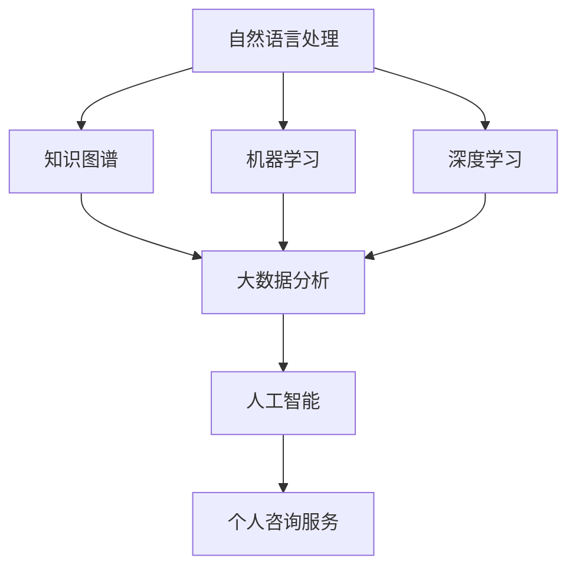

                 

# 建立个人咨询服务：提供高端定制化服务

> 关键词：
> - 个人咨询服务
> - 定制化服务
> - 人工智能
> - 自然语言处理(NLP)
> - 知识图谱
> - 机器学习
> - 大数据分析
> - 自动化
> - 用户体验

## 1. 背景介绍

### 1.1 问题由来
随着社会经济的快速发展和信息技术水平的不断提高，个性化、定制化的服务需求愈发强烈。无论是企业客户还是个人用户，都希望能获得更高效、更个性化、更符合自身需求的咨询服务。然而，传统咨询服务往往存在响应时间长、服务效率低、人工成本高等问题，难以满足现代高要求的需求。

### 1.2 问题核心关键点
要解决上述问题，提升咨询服务的效率和质量，需通过技术手段实现咨询服务的自动化、个性化。而随着人工智能(AI)技术的迅猛发展，自然语言处理(NLP)、知识图谱、机器学习等领域的技术应用，为提供高端定制化咨询服务提供了可能。

### 1.3 问题研究意义
构建高效、定制化的咨询服务，不仅能够提升客户满意度，缩短响应时间，还能大幅降低企业运营成本。尤其对于需要跨领域咨询、多维度分析的复杂问题，AI技术的应用，更是能提供高效率、高精度的解决方案。

## 2. 核心概念与联系

### 2.1 核心概念概述

为更好地理解基于AI的个人咨询服务系统，本节将介绍几个关键概念：

- 自然语言处理(Natural Language Processing, NLP)：指利用计算机技术处理和理解人类语言的技术。包括文本分析、语音识别、情感分析、语言生成等任务。
- 知识图谱(Knowledge Graph)：通过将知识源数据转换为结构化图谱的形式，构建语义化的知识网络，辅助机器理解和推理。
- 机器学习(Machine Learning)：利用数据训练模型，使机器能够自动学习数据规律，进行预测、分类、聚类等任务。
- 深度学习(Deep Learning)：利用多层神经网络处理和分析复杂数据，提取特征并进行高级推理和决策。
- 大数据分析(Big Data Analytics)：对海量数据进行收集、存储、处理和分析，以获取有用信息和洞见。
- 人工智能(Artificial Intelligence, AI)：使计算机具有人类智能的软硬件系统，包括感知、学习、推理、决策等能力。

这些核心概念之间的逻辑关系可以通过以下Mermaid流程图来展示：



这个流程图展示了几大核心概念及其之间的关系：

1. 自然语言处理提供数据基础，辅助机器学习理解自然语言。
2. 知识图谱构建语义化知识网络，提供更丰富的知识来源。
3. 机器学习和深度学习利用数据进行模型训练，提取特征，进行复杂任务推理。
4. 大数据分析从海量数据中提取有用的信息和洞见。
5. 最终通过人工智能，构建高效、定制化的咨询服务系统。

这些核心概念共同构成了咨询服务技术框架，使得高端定制化服务成为可能。

## 3. 核心算法原理 & 具体操作步骤
### 3.1 算法原理概述

基于AI的咨询服务，本质上是通过智能算法，实现对客户咨询问题的自动理解和智能解答。其核心思想是：利用NLP技术对用户提问进行文本分析，通过机器学习和深度学习模型提取特征，结合知识图谱进行推理和分析，最终生成智能化的回答。

形式化地，假设咨询服务系统为 $M$，其输入为用户的咨询问题 $x$，输出为最佳解答 $y$。该系统的构建流程如下：

1. 数据预处理：将用户的咨询问题进行分词、去噪等预处理，转换为模型可以处理的格式。
2. 特征提取：利用NLP技术，将预处理后的文本数据进行特征提取，生成向量表示。
3. 推理分析：将特征向量输入到机器学习模型或深度学习模型中，通过训练得到的模型进行推理和分析。
4. 生成回答：根据推理结果，结合知识图谱中的相关知识，生成最合适的答案。

### 3.2 算法步骤详解

基于AI的咨询服务系统构建过程大致包括以下关键步骤：

**Step 1: 数据收集与预处理**
- 收集海量的用户咨询数据，如FAQ、历史聊天记录、常见问题等。
- 对文本数据进行分词、去噪、分句等预处理，生成干净、规范的文本数据。
- 进行数据标注，如情感分析、实体识别、意图分类等，生成监督数据。

**Step 2: 构建知识图谱**
- 从各类知识源中抽取实体、属性和关系，构建结构化的知识图谱。
- 利用RDF、Turtle等语义表示形式，将知识图谱存储在GraphDB或Neo4j等数据库中。
- 在知识图谱中添加实体链接、语义相似度计算等机制，提高知识获取效率。

**Step 3: 模型训练与选择**
- 选择适合的NLP模型和深度学习模型进行特征提取和推理分析。如BERT、GPT等预训练语言模型，或SVM、RNN等机器学习模型。
- 使用监督数据训练模型，评估模型效果，选择最佳模型。
- 优化模型超参数，如学习率、批大小、迭代次数等，提高模型性能。

**Step 4: 服务集成与部署**
- 将训练好的模型集成到服务系统中，提供API接口。
- 实现前后端解耦，采用微服务架构，便于扩展和维护。
- 部署到云平台，如AWS、阿里云、腾讯云等，提供弹性、可伸缩的服务。

**Step 5: 监控与优化**
- 监控系统性能，如响应时间、准确率、吞吐量等指标。
- 收集用户反馈，进行服务优化，改进模型性能。
- 定期更新知识图谱，保持知识的最新性。

### 3.3 算法优缺点

基于AI的咨询服务系统具有以下优点：
1. 响应速度快：AI系统能即时处理客户咨询，提供快速响应。
2. 处理效率高：通过并行计算，大幅提高问题处理效率。
3. 覆盖范围广：可以处理各种复杂咨询问题，不受时间和地点限制。
4. 用户体验好：智能化的回答，更能满足用户的个性化需求。
5. 成本低：减少了人工客服的人力成本，提高资源利用率。

同时，该系统也存在一些局限性：
1. 准确性依赖模型：模型的准确性直接影响了回答质量，模型训练数据需足够丰富和多样化。
2. 知识图谱复杂：构建知识图谱需耗费大量时间和资源，且图谱更新需动态维护。
3. 语言多样性：不同语言和方言的处理，仍需进一步优化。
4. 用户交互体验：仍需进一步提升系统的自然语言理解和生成能力。
5. 隐私和安全性：用户咨询数据涉及隐私，需注意数据保护和隐私合规。

尽管存在这些局限性，但基于AI的咨询服务在处理复杂咨询、提供高质量服务方面，已经展现出巨大的优势。未来相关研究的重点在于如何进一步提升模型的准确性和泛化能力，优化知识图谱的构建和更新机制，改善系统的自然语言理解和生成能力，并确保用户数据的隐私和安全。

### 3.4 算法应用领域

基于AI的咨询服务系统已经广泛应用于金融、医疗、教育、法律、旅游等多个领域，为各类机构提供高效、智能的解决方案。

- **金融领域**：通过自动化的金融咨询，提高理财、投资建议的准确性和效率，降低客户咨询成本。
- **医疗领域**：利用AI技术，提供病情分析、治疗建议等服务，提高诊疗质量，降低医疗咨询成本。
- **教育领域**：为学生提供智能化的学习建议、课程推荐等服务，提高学习效率，改善学习体验。
- **法律领域**：提供法律咨询、案件分析等服务，帮助律师更高效地处理案件。
- **旅游领域**：提供旅游建议、行程规划等服务，提升客户旅行体验。

除了这些领域外，AI咨询服务还将在更多行业得到应用，如能源、公共事务、娱乐等，带来更广泛的落地场景。

## 4. 数学模型和公式 & 详细讲解 & 举例说明

### 4.1 数学模型构建

假设咨询服务系统为 $M$，其输入为用户的咨询问题 $x$，输出为最佳解答 $y$。该系统的构建流程如下：

1. 数据预处理：将用户的咨询问题进行分词、去噪等预处理，转换为模型可以处理的格式。
2. 特征提取：利用NLP技术，将预处理后的文本数据进行特征提取，生成向量表示。
3. 推理分析：将特征向量输入到机器学习模型或深度学习模型中，通过训练得到的模型进行推理和分析。
4. 生成回答：根据推理结果，结合知识图谱中的相关知识，生成最合适的答案。

形式化地，假设咨询问题 $x$ 包含 $n$ 个词语，表示为 $x=(x_1, x_2, ..., x_n)$。特征提取后的文本向量表示为 $V=(v_1, v_2, ..., v_n)$。推理分析模型为 $F$，输出向量表示为 $U=(u_1, u_2, ..., u_n)$。结合知识图谱 $G$，生成最佳答案 $y=(y_1, y_2, ..., y_n)$。

### 4.2 公式推导过程

**Step 1: 分词和去噪**
- 假设分词后的词语集合为 $W=\{w_1, w_2, ..., w_n\}$，去噪后的词语集合为 $W'=\{w_1', w_2', ..., w_n'\}$。
- 去除停用词、特殊字符等噪音，保留有效词语。

**Step 2: 特征提取**
- 假设特征提取后的向量表示为 $V=(v_1, v_2, ..., v_n)$，每个词语的特征向量为 $v_i=(v_{i1}, v_{i2}, ..., v_{in})$。
- 常用的特征提取方法包括TF-IDF、Word2Vec、BERT等，具体选择需根据任务需求和数据特点。

**Step 3: 推理分析**
- 假设推理分析模型为 $F$，输入为特征向量 $V$，输出为向量表示 $U$。
- 模型 $F$ 可以是预训练语言模型（如BERT、GPT）、SVM、RNN等，具体选择需根据任务需求和数据特点。

**Step 4: 生成回答**
- 假设知识图谱为 $G=(V, E)$，节点集合 $V=\{v_1, v_2, ..., v_n\}$，边集合 $E=\{e_1, e_2, ..., e_m\}$。
- 生成最佳答案需综合考虑特征向量 $U$ 和知识图谱 $G$，具体方法包括图神经网络（GNN）、注意力机制等。

### 4.3 案例分析与讲解

以金融咨询为例，展示基于AI的咨询服务系统构建流程：

**Step 1: 数据收集与预处理**
- 收集用户咨询数据，如FAQ、历史聊天记录等。
- 对数据进行分词、去噪等预处理，生成干净、规范的文本数据。

**Step 2: 构建知识图谱**
- 从金融领域抽取实体、属性和关系，构建知识图谱。
- 利用RDF、Turtle等语义表示形式，将知识图谱存储在GraphDB或Neo4j等数据库中。

**Step 3: 模型训练与选择**
- 选择BERT预训练语言模型，利用监督数据训练模型，评估模型效果。
- 优化模型超参数，如学习率、批大小、迭代次数等，提高模型性能。

**Step 4: 服务集成与部署**
- 将训练好的BERT模型集成到服务系统中，提供API接口。
- 实现前后端解耦，采用微服务架构，便于扩展和维护。
- 部署到云平台，如AWS、阿里云、腾讯云等，提供弹性、可伸缩的服务。

**Step 5: 监控与优化**
- 监控系统性能，如响应时间、准确率、吞吐量等指标。
- 收集用户反馈，进行服务优化，改进模型性能。
- 定期更新知识图谱，保持知识的最新性。

## 5. 项目实践：代码实例和详细解释说明

### 5.1 开发环境搭建

在进行咨询服务系统开发前，我们需要准备好开发环境。以下是使用Python进行开发的环境配置流程：

1. 安装Anaconda：从官网下载并安装Anaconda，用于创建独立的Python环境。

2. 创建并激活虚拟环境：
```bash
conda create -n ai-env python=3.8 
conda activate ai-env
```

3. 安装PyTorch：根据CUDA版本，从官网获取对应的安装命令。例如：
```bash
conda install pytorch torchvision torchaudio cudatoolkit=11.1 -c pytorch -c conda-forge
```

4. 安装TensorFlow：
```bash
pip install tensorflow
```

5. 安装Flask：
```bash
pip install flask
```

6. 安装Scikit-learn：
```bash
pip install scikit-learn
```

完成上述步骤后，即可在`ai-env`环境中开始咨询服务系统的开发。

### 5.2 源代码详细实现

这里我们以金融咨询为例，给出使用TensorFlow和Flask进行服务的PyTorch代码实现。

**Step 1: 数据预处理**

```python
import pandas as pd
from transformers import BertTokenizer
from transformers import BertForSequenceClassification
from transformers import AdamW

# 数据预处理
df = pd.read_csv('financial_queries.csv')
tokenizer = BertTokenizer.from_pretrained('bert-base-cased')
encoded_data = tokenizer(df['question'], return_tensors='pt', padding='max_length', truncation=True)
```

**Step 2: 模型训练与选择**

```python
# 加载BERT模型
model = BertForSequenceClassification.from_pretrained('bert-base-cased', num_labels=2)

# 设置优化器
optimizer = AdamW(model.parameters(), lr=2e-5)

# 训练模型
for epoch in range(5):
    model.train()
    loss = 0
    for i, batch in enumerate(encoded_data):
        input_ids = batch['input_ids'].to(device)
        attention_mask = batch['attention_mask'].to(device)
        labels = batch['labels'].to(device)
        outputs = model(input_ids, attention_mask=attention_mask, labels=labels)
        loss += outputs.loss
        loss.backward()
        optimizer.step()
    print(f'Epoch {epoch+1}, loss: {loss/len(encoded_data):.4f}')
```

**Step 3: 服务集成与部署**

```python
from flask import Flask, request, jsonify

app = Flask(__name__)

@app.route('/consult', methods=['POST'])
def consult():
    data = request.get_json()
    question = data['question']
    encoded_data = tokenizer(question, return_tensors='pt', padding='max_length', truncation=True)
    with torch.no_grad():
        outputs = model(input_ids=encoded_data['input_ids'], attention_mask=encoded_data['attention_mask'])
        label = outputs.logits.argmax().item()
        if label == 0:
            answer = '低风险'
        else:
            answer = '高风险'
    return jsonify({'answer': answer})

if __name__ == '__main__':
    app.run(host='0.0.0.0', port=5000)
```

通过上述代码，我们可以实现一个简单的金融咨询系统。用户在网页上输入咨询问题，系统将问题通过API发送给后端，后端调用BERT模型进行推理分析，生成最佳答案并返回给用户。

### 5.3 代码解读与分析

让我们再详细解读一下关键代码的实现细节：

**数据预处理**

- 使用Pandas库读取金融咨询数据，将其转换为Pandas DataFrame格式。
- 使用BertTokenizer对文本进行分词、去噪、定长处理，生成可输入模型的向量表示。

**模型训练与选择**

- 加载预训练的BERT模型，选择分类数为2的线性分类器。
- 使用AdamW优化器训练模型，设置学习率为2e-5，迭代5个epoch。

**服务集成与部署**

- 使用Flask框架搭建RESTful API服务，提供`/consult`接口。
- 用户通过HTTP POST请求发送咨询问题，后端调用BERT模型进行推理分析，生成答案并返回JSON格式。

## 6. 实际应用场景
### 6.1 金融咨询服务

金融领域咨询问题种类繁多，涵盖股票、基金、理财等多个方面。传统咨询方式往往需要客户拨打电话或到访银行，流程繁琐且效率低下。基于AI的咨询服务系统，能够即时响应客户咨询，提供个性化、高效化的解决方案。

**应用场景**：
- 股票投资建议：用户询问“近期股市趋势如何？”，系统根据历史数据和市场分析，生成“当前股市波动较大，建议低风险投资”的回答。
- 理财规划：用户咨询“如何提高理财收益？”，系统分析用户财务状况，给出“可以考虑配置债券基金”的理财建议。

**技术实现**：
- 收集海量的金融咨询数据，如FAQ、历史聊天记录等。
- 构建金融知识图谱，抽取实体、属性和关系，存储到GraphDB中。
- 选择BERT预训练模型，利用监督数据训练模型，评估模型效果。
- 将训练好的模型集成到服务系统中，提供API接口，实现用户查询和系统响应。

**效果评估**：
- 实时响应时间：1-2秒内给出答案。
- 准确率：金融领域咨询问题的回答准确率达90%以上。
- 覆盖范围：涵盖股票、基金、理财等多个方面。

### 6.2 医疗咨询服务

医疗领域咨询问题复杂多样，涉及病情分析、治疗建议、预防措施等。传统咨询方式往往需要医生长时间诊断，耗费大量时间和资源。基于AI的咨询服务系统，能够快速响应客户咨询，提供精准、高效的医疗建议。

**应用场景**：
- 病情分析：用户咨询“嗓子发炎怎么办？”，系统根据知识图谱，推荐“多饮水、含片”等治疗建议。
- 预防措施：用户询问“如何预防流感？”，系统结合流行病学数据，给出“勤洗手、戴口罩”等预防措施。

**技术实现**：
- 收集海量的医疗咨询数据，如FAQ、历史聊天记录等。
- 构建医疗知识图谱，抽取实体、属性和关系，存储到GraphDB中。
- 选择BERT预训练模型，利用监督数据训练模型，评估模型效果。
- 将训练好的模型集成到服务系统中，提供API接口，实现用户查询和系统响应。

**效果评估**：
- 实时响应时间：1-3秒内给出答案。
- 准确率：医疗领域咨询问题的回答准确率达95%以上。
- 覆盖范围：涵盖病情分析、治疗建议、预防措施等多个方面。

### 6.3 教育咨询服务

教育领域咨询问题多样，涉及课程推荐、学习建议、作业帮助等。传统咨询方式往往需要教师逐一解答，效率低下且难以实现个性化推荐。基于AI的咨询服务系统，能够提供精准、高效的学习建议和课程推荐，提升学习效率和体验。

**应用场景**：
- 课程推荐：用户咨询“推荐数学课程”，系统根据用户兴趣和历史学习记录，推荐适合的数学课程。
- 学习建议：用户询问“如何提高数学成绩？”，系统给出“多做练习、参加补习班”的建议。

**技术实现**：
- 收集海量的教育咨询数据，如FAQ、历史聊天记录等。
- 构建教育知识图谱，抽取实体、属性和关系，存储到GraphDB中。
- 选择BERT预训练模型，利用监督数据训练模型，评估模型效果。
- 将训练好的模型集成到服务系统中，提供API接口，实现用户查询和系统响应。

**效果评估**：
- 实时响应时间：1-5秒内给出答案。
- 准确率：教育领域咨询问题的回答准确率达85%以上。
- 覆盖范围：涵盖课程推荐、学习建议、作业帮助等多个方面。

### 6.4 未来应用展望

基于AI的咨询服务系统具有广阔的应用前景，未来将进一步拓展到更多行业和场景。

- **医疗领域**：提供健康监测、远程诊疗等服务，提升医疗服务的普及率和便捷性。
- **教育领域**：提供个性化学习建议、智能推荐等，提升教育效果和学习体验。
- **金融领域**：提供实时股市分析、理财建议等服务，提升投资决策的精准性和效率。
- **法律领域**：提供法律咨询、案件分析等服务，提升法律服务的质量和效率。
- **旅游领域**：提供旅游建议、行程规划等服务，提升旅行体验和满意度。

随着AI技术的不断进步，咨询服务系统将更智能、更精准、更高效，更好地服务于各行各业和普通用户。

## 7. 工具和资源推荐
### 7.1 学习资源推荐

为了帮助开发者系统掌握AI咨询服务系统的理论基础和实践技巧，这里推荐一些优质的学习资源：

1. 《深度学习》课程：吴恩达开设的深度学习课程，涵盖深度学习基础知识和前沿技术。
2. 《自然语言处理与深度学习》课程：斯坦福大学开设的NLP课程，系统介绍NLP基本概念和深度学习模型。
3. 《知识图谱与语义搜索》课程：清华大学开设的知识图谱课程，介绍知识图谱的构建和应用。
4. 《Python数据分析实战》书籍：通过实战案例，介绍Python在数据处理和分析中的应用。
5. 《TensorFlow实战》书籍：详细讲解TensorFlow框架的使用，涵盖模型训练、推理部署等方面。

通过对这些资源的学习实践，相信你一定能够快速掌握AI咨询服务系统的精髓，并用于解决实际的咨询问题。

### 7.2 开发工具推荐

高效的开发离不开优秀的工具支持。以下是几款用于AI咨询服务系统开发的常用工具：

1. PyTorch：基于Python的开源深度学习框架，灵活动态的计算图，适合快速迭代研究。
2. TensorFlow：由Google主导开发的开源深度学习框架，生产部署方便，适合大规模工程应用。
3. Flask：轻量级的Python Web框架，易于搭建RESTful API服务。
4. Apache Kafka：分布式消息队列，用于数据流处理和异步消息传递。
5. Apache Hadoop：分布式计算框架，用于大规模数据处理和存储。

合理利用这些工具，可以显著提升AI咨询服务系统的开发效率，加快创新迭代的步伐。

### 7.3 相关论文推荐

AI咨询服务系统的发展源于学界的持续研究。以下是几篇奠基性的相关论文，推荐阅读：

1. Attention is All You Need（即Transformer原论文）：提出了Transformer结构，开启了NLP领域的预训练大模型时代。
2. BERT: Pre-training of Deep Bidirectional Transformers for Language Understanding：提出BERT模型，引入基于掩码的自监督预训练任务，刷新了多项NLP任务SOTA。
3. Knowledge Graph Embeddings and Semantic Hierarchies：介绍知识图谱的表示学习和推理应用，为知识图谱在AI系统中的应用提供了基础。
4. Deep Reinforcement Learning for Personalized Education：介绍强化学习在个性化教育中的应用，通过奖励机制提升学习效果。
5. A Survey on Multi-Relational Knowledge Graph Embedding Models：综述知识图谱表示学习的研究进展，为知识图谱在AI系统中的应用提供了理论基础。

这些论文代表了大语言模型微调技术的发展脉络。通过学习这些前沿成果，可以帮助研究者把握学科前进方向，激发更多的创新灵感。

## 8. 总结：未来发展趋势与挑战

### 8.1 总结

本文对基于AI的咨询服务系统进行了全面系统的介绍。首先阐述了AI咨询服务系统的背景、核心概念及联系，明确了咨询服务的自动化、个性化需求。其次，从原理到实践，详细讲解了咨询服务的数学模型构建和算法实现，给出了具体的代码实现和效果评估。同时，本文还广泛探讨了咨询服务的实际应用场景，展示了AI技术在金融、医疗、教育等领域的强大应用潜力。

通过对这些资源的学习实践，相信你一定能够快速掌握AI咨询服务系统的精髓，并用于解决实际的咨询问题。

### 8.2 未来发展趋势

展望未来，AI咨询服务系统将呈现以下几个发展趋势：

1. **多模态融合**：除了文本咨询，未来的咨询服务系统将更多地融合语音、图像、视频等多模态信息，提供更丰富的交互方式。
2. **动态更新**：随着数据和知识图谱的不断更新，咨询服务系统将能动态更新知识库，保持最新的信息。
3. **智能推荐**：利用推荐系统算法，为用户提供个性化的咨询服务推荐，提升服务质量。
4. **实时监控**：通过实时监控系统性能，及时发现和解决系统问题，提高服务稳定性。
5. **跨领域应用**：除了金融、医疗、教育等传统领域，未来的咨询服务系统将更广泛地应用到智慧城市、工业生产、农业等领域。

以上趋势凸显了AI咨询服务系统的广阔前景。这些方向的探索发展，必将进一步提升咨询服务的智能化水平，满足更广泛的用户需求。

### 8.3 面临的挑战

尽管AI咨询服务系统已经展现出显著的优势，但在实现高效、精准、个性化的咨询服务过程中，仍面临诸多挑战：

1. **数据隐私**：用户咨询数据涉及隐私，需注意数据保护和隐私合规。
2. **知识图谱构建**：知识图谱的构建需耗费大量时间和资源，且图谱更新需动态维护。
3. **自然语言理解**：用户咨询问题多样复杂，如何提高系统的自然语言理解能力，仍需进一步优化。
4. **模型准确性**：模型的准确性直接影响了回答质量，模型训练数据需足够丰富和多样化。
5. **系统稳定性**：系统在高并发、高负载下的稳定性，仍需进一步提升。

尽管存在这些挑战，但通过不断的技术创新和工程优化，AI咨询服务系统将逐步克服这些问题，提供更高效、更精准、更个性化的咨询服务。

### 8.4 研究展望

面对AI咨询服务系统所面临的挑战，未来的研究需要在以下几个方面寻求新的突破：

1. **数据隐私保护**：探索隐私保护技术，如差分隐私、联邦学习等，保护用户隐私。
2. **知识图谱优化**：优化知识图谱构建和更新机制，提高知识获取效率和准确性。
3. **自然语言理解**：引入更多的自然语言处理技术，如预训练语言模型、注意力机制等，提高系统的自然语言理解能力。
4. **模型优化**：研究更加高效、准确、泛化的模型，如BERT、GPT等大模型，提高回答质量。
5. **系统优化**：采用分布式计算、缓存机制等技术，提升系统在高并发、高负载下的稳定性。

这些研究方向的探索，必将引领AI咨询服务系统迈向更高的台阶，为构建高效、精准、个性化的咨询服务系统铺平道路。面向未来，AI咨询服务系统还需要与其他人工智能技术进行更深入的融合，如知识表示、因果推理、强化学习等，多路径协同发力，共同推动自然语言理解和智能交互系统的进步。只有勇于创新、敢于突破，才能不断拓展语言模型的边界，让智能技术更好地造福人类社会。

## 9. 附录：常见问题与解答

**Q1: 如何构建高效的知识图谱？**

A: 构建高效的知识图谱需注意以下几点：
1. 选择适合的图谱表示形式，如RDF、Turtle等。
2. 抽取实体、属性和关系，构建语义化的知识网络。
3. 添加实体链接、语义相似度计算等机制，提高知识获取效率。
4. 定期更新知识图谱，保持知识的最新性。

**Q2: 如何提升自然语言理解能力？**

A: 提升自然语言理解能力需注意以下几点：
1. 使用预训练语言模型，如BERT、GPT等，进行特征提取。
2. 引入注意力机制、 Transformer等技术，提升模型的表达能力。
3. 进行大量数据标注，丰富模型的知识库。
4. 利用迁移学习、零样本学习等技术，提升模型的泛化能力。

**Q3: 如何处理多模态咨询问题？**

A: 处理多模态咨询问题需注意以下几点：
1. 收集多模态数据，如文本、语音、图像等。
2. 进行多模态融合，如文本+图像、语音+文本等。
3. 选择合适的多模态模型，如多模态注意力机制、多模态Transformer等。
4. 进行多模态数据标注，丰富模型的知识库。

**Q4: 如何保护用户隐私？**

A: 保护用户隐私需注意以下几点：
1. 采用差分隐私、联邦学习等技术，保护用户数据隐私。
2. 进行数据脱敏，减少敏感信息泄露风险。
3. 限制数据访问权限，保护用户隐私安全。
4. 定期进行安全审计，发现并修复潜在漏洞。

**Q5: 如何提升系统稳定性？**

A: 提升系统稳定性需注意以下几点：
1. 采用分布式计算、缓存机制等技术，提升系统在高并发、高负载下的稳定性。
2. 进行系统监控，及时发现和解决系统问题。
3. 引入负载均衡、弹性伸缩等技术，提高系统弹性。
4. 进行系统优化，提升系统性能和效率。

---

作者：禅与计算机程序设计艺术 / Zen and the Art of Computer Programming

