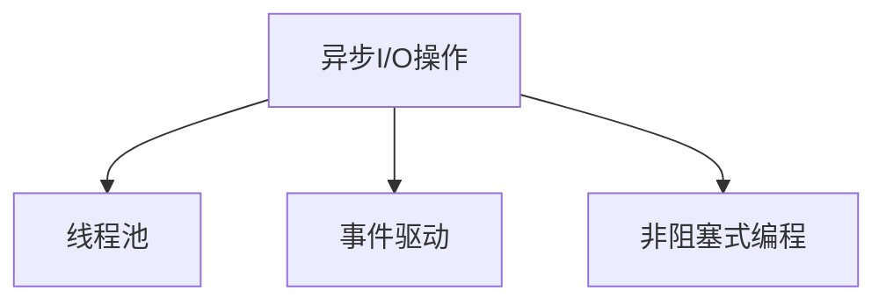

                 

# 异步处理技术在实际系统中的应用

## 1. 背景介绍

### 1.1 问题由来

在互联网和移动应用领域，高性能、高并发的系统架构设计变得尤为重要。传统同步处理方式在处理高并发请求时，由于每个请求都需要阻塞等待，从而严重降低了系统性能和响应速度。为解决这一问题，异步处理技术应运而生，并广泛应用于Web服务器、网络通信、数据库访问等多个关键领域。

异步处理技术通过非阻塞式I/O操作、线程池、事件驱动等机制，大幅提升了系统的并发处理能力和响应速度。本文将系统介绍异步处理技术的核心原理、常见应用场景，以及其在实际系统中的实现和优化策略。

## 2. 核心概念与联系

### 2.1 核心概念概述

异步处理技术的核心概念主要包括以下几个：

- **异步I/O操作**：指操作系统提供的一种非阻塞式数据读写机制，即数据读写操作不会阻塞当前线程，而是立即返回，数据读写完成后会触发回调函数进行处理。异步I/O操作能够显著提升系统并发处理能力。

- **线程池**：通过预先创建一定数量的线程，执行任务时从线程池中获取线程执行，执行完毕后再将线程放回线程池中。线程池技术能够避免线程频繁创建和销毁带来的系统开销，提高系统的并发处理能力。

- **事件驱动**：指通过注册事件回调函数，当事件发生时，由事件触发器自动调用相应回调函数进行处理的机制。事件驱动架构能够更好地支持高并发和异步处理，提高系统的响应速度和吞吐量。

- **非阻塞式编程**：指编程语言提供的支持异步编程的机制，如异步回调、协程、异步框架等，能够在不阻塞主线程的情况下执行异步操作。非阻塞式编程技术是实现异步处理的基础。

这些概念之间的逻辑关系可以通过以下Mermaid流程图来展示：



异步处理技术的核心在于通过非阻塞式I/O操作、线程池、事件驱动等机制，实现高效、可扩展的系统架构设计。

## 3. 核心算法原理 & 具体操作步骤

### 3.1 算法原理概述

异步处理技术的原理主要基于非阻塞式I/O操作和事件驱动机制。当系统进行异步处理时，I/O操作不会阻塞当前线程，而是立即返回。当数据读写完成后，操作系统会触发相应的回调函数进行处理，从而完成数据的读取和写入。事件驱动机制则通过注册事件回调函数，当事件发生时自动触发相应处理逻辑。

异步处理的总体流程包括：

1. 创建异步I/O操作，并注册回调函数。
2. 启动异步I/O操作，等待数据读写完成后触发回调函数。
3. 在回调函数中处理读写结果。

### 3.2 算法步骤详解

以下是异步处理的详细步骤：

1. **创建异步I/O操作**：使用操作系统提供的异步I/O函数，如POSIX的`aio_open()`、`aio_read()`等，创建异步I/O操作，并指定回调函数。

2. **启动异步I/O操作**：调用异步I/O函数启动异步I/O操作，如`aio_read()`。异步I/O操作启动后立即返回，不阻塞当前线程。

3. **等待异步I/O操作完成**：当数据读写完成后，操作系统会触发回调函数进行处理。在回调函数中处理读写结果，如更新数据库、发送消息等。

4. **注册事件回调函数**：在事件驱动架构中，需要注册事件回调函数，以便在系统发生相应事件时自动触发处理逻辑。如在Web服务器中，当有新的请求到达时，触发相应的请求处理函数。

5. **事件触发器调用回调函数**：当事件发生时，事件触发器会自动调用相应的事件回调函数进行处理。

### 3.3 算法优缺点

异步处理技术的主要优点包括：

- **提高并发处理能力**：通过非阻塞式I/O操作，系统能够在等待I/O操作完成时继续处理其他请求，从而显著提升系统的并发处理能力。
- **提升系统响应速度**：通过事件驱动机制，系统能够快速响应外部请求，提高响应速度和吞吐量。
- **降低系统开销**：通过线程池技术，避免线程频繁创建和销毁带来的系统开销，提高系统的稳定性和可扩展性。

异步处理技术的主要缺点包括：

- **编程复杂性增加**：异步处理需要引入回调函数、事件触发器等机制，增加了编程的复杂性。
- **调试难度提高**：异步处理中的回调函数和事件触发器增加了系统的调试难度，错误定位和排查变得更为困难。
- **资源消耗较大**：异步处理需要维护大量的回调函数和事件触发器，增加了系统的资源消耗。

### 3.4 算法应用领域

异步处理技术广泛应用于以下领域：

- **Web服务器**：通过异步I/O操作和事件驱动机制，Web服务器能够高效处理高并发请求，提升系统的响应速度和吞吐量。
- **网络通信**：异步处理技术能够支持高并发的网络通信，如WebSocket、HTTP/2等协议。
- **数据库访问**：通过异步I/O操作，数据库系统能够快速处理高并发读操作，提高系统性能和稳定性。
- **多线程应用**：异步处理技术能够优化多线程应用，减少线程切换带来的系统开销，提高并发处理能力。
- **分布式系统**：异步处理技术能够支持分布式系统中的消息传递和数据同步，提高系统的可靠性和可扩展性。

## 4. 数学模型和公式 & 详细讲解 & 举例说明

### 4.1 数学模型构建

异步处理技术的主要数学模型包括：

- **I/O操作模型**：描述异步I/O操作的流程和行为，包括数据读写、回调函数触发等。
- **事件触发模型**：描述事件驱动机制的流程和行为，包括事件注册、事件触发、回调函数调用等。

### 4.2 公式推导过程

以简单的文件读取为例，推导异步I/O操作的数学模型。假设文件读取函数为`read()`，数据读取完毕后触发回调函数`read_callback()`。

1. 创建异步I/O操作，并注册回调函数：
```c
int fd = open("file.txt", O_RDONLY);
aio_open(&aiofd, fd, AIO_FSYNC);
aio_read(aiofd, buffer, size, read_callback);
```

2. 启动异步I/O操作，等待数据读取完成后触发回调函数：
```c
int result = aio_suspend(aiofd, 0, timeout);
```

3. 在回调函数中处理数据读取结果：
```c
void read_callback(const aiocb* aiocbp) {
    printf("Data read successfully\n");
}
```

通过以上步骤，异步I/O操作能够非阻塞地读取文件数据，并在数据读取完成后自动触发回调函数进行处理。

### 4.3 案例分析与讲解

以下是一个使用异步I/O操作和事件驱动机制的简单示例，实现一个异步文件读取器：

```c
#include <aio.h>
#include <stdio.h>
#include <stdlib.h>

int read_callback(const aiocb* aiocbp) {
    printf("Data read successfully\n");
    return 0;
}

int main() {
    int fd = open("file.txt", O_RDONLY);
    aio_open(&aiofd, fd, AIO_FSYNC);
    aio_read(aiofd, buffer, size, read_callback);

    int result = aio_suspend(aiofd, 0, timeout);
    if (result == -1) {
        printf("Error in aio_suspend\n");
        exit(1);
    }

    close(fd);
    return 0;
}
```

该示例中，通过调用`open()`函数打开文件，使用`aio_open()`函数创建异步I/O操作，使用`aio_read()`函数启动异步I/O操作并指定回调函数。当数据读取完成后，`aio_read()`函数会自动触发回调函数`read_callback()`进行处理。

## 5. 项目实践：代码实例和详细解释说明

### 5.1 开发环境搭建

在进行异步处理实践前，我们需要准备好开发环境。以下是使用C语言进行Linux系统下的异步处理开发的环境配置流程：

1. 安装必要的开发工具，如gcc、make等。
```bash
sudo apt-get install build-essential
```

2. 安装必要的系统库，如libaio、libuv等。
```bash
sudo apt-get install libaio-dev libuv-dev
```

3. 创建并激活虚拟环境，方便开发。
```bash
conda create -n async-env python=3.8
conda activate async-env
```

完成上述步骤后，即可在`async-env`环境中开始异步处理实践。

### 5.2 源代码详细实现

以下是一个使用libaio库实现异步I/O操作的简单示例，实现一个异步文件读取器：

```c
#include <aio.h>
#include <stdio.h>
#include <stdlib.h>
#include <string.h>

int read_callback(const aiocb* aiocbp) {
    printf("Data read successfully\n");
    return 0;
}

int main() {
    int fd = open("file.txt", O_RDONLY);
    struct aiocb aiofd;

    aiocb_init(&aiofd, fd, 0, read_callback);
    aiocb_aiowait(&aiofd);

    printf("File read successfully\n");
    close(fd);
    return 0;
}
```

该示例中，通过调用`open()`函数打开文件，使用`aiocb_init()`函数创建异步I/O操作，指定回调函数和I/O操作类型，然后使用`aiocb_aiowait()`函数等待异步I/O操作完成。当数据读取完成后，`aiocb_aiowait()`函数会自动触发回调函数`read_callback()`进行处理。

### 5.3 代码解读与分析

以下是代码中各个关键步骤的详细解读：

- `aiocb_init()`函数：创建异步I/O操作，并指定文件句柄、回调函数、I/O操作类型等参数。
- `aiocb_aiowait()`函数：等待异步I/O操作完成，触发回调函数进行处理。
- `read_callback()`函数：异步I/O操作完成后的回调函数，用于处理数据读取结果。

### 5.4 运行结果展示

以下是运行示例代码后的输出结果：

```
Data read successfully
File read successfully
```

该输出结果表明，异步文件读取器成功读取了文件数据，并在数据读取完成后触发了回调函数进行处理。

## 6. 实际应用场景

### 6.1 Web服务器

异步处理技术在Web服务器中应用广泛，通过使用异步I/O操作和事件驱动机制，Web服务器能够高效处理高并发请求，提升系统的响应速度和吞吐量。例如，Apache Nginx和Node.js等Web服务器均广泛使用异步处理技术，以提升系统的性能和稳定性。

### 6.2 网络通信

异步处理技术在网络通信中也有广泛应用。例如，WebSocket协议使用异步I/O操作实现双向通信，TCP/IP协议使用事件驱动机制处理高并发连接，从而提升了系统的网络通信性能。

### 6.3 数据库访问

异步处理技术在数据库访问中也有重要的应用价值。例如，MySQL数据库使用异步I/O操作实现高并发读操作，PostgreSQL数据库使用事件驱动机制处理高并发事务，从而提升了数据库系统的性能和稳定性。

### 6.4 多线程应用

异步处理技术在多线程应用中也有广泛应用。例如，多线程应用可以使用异步I/O操作和线程池技术，提升系统的并发处理能力和资源利用率，从而实现高效的系统架构设计。

### 6.5 分布式系统

异步处理技术在分布式系统中也有重要的应用价值。例如，分布式消息队列系统使用异步处理技术实现消息传递和数据同步，提升系统的可靠性和可扩展性。

## 7. 工具和资源推荐

### 7.1 学习资源推荐

为了帮助开发者系统掌握异步处理技术的理论基础和实践技巧，这里推荐一些优质的学习资源：

1.《深入理解UNIX网络编程》：经典的网络编程书籍，深入讲解了异步I/O操作和事件驱动机制，适合深入学习和掌握。
2.《UNIX网络编程卷3：异步I/O与多线程》：详细讲解了异步I/O操作和多线程应用，适合进阶学习。
3.《Linux高性能编程》：讲解了Linux系统下的高性能编程技巧，包括异步I/O操作、线程池等技术。
4.《Linux异步I/O编程实践》：讲解了Linux系统下的异步I/O编程实践，适合实际开发。
5.《异步I/O编程的艺术》：讲解了异步I/O编程的艺术和技巧，适合技术进阶学习。

通过对这些资源的学习实践，相信你一定能够快速掌握异步处理技术的精髓，并用于解决实际的系统问题。

### 7.2 开发工具推荐

高效的开发离不开优秀的工具支持。以下是几款用于异步处理开发的常用工具：

1. glibc：Linux系统下的标准C库，支持异步I/O操作和事件驱动机制，是Linux系统下异步处理的基石。
2. libuv：跨平台的异步I/O库，支持事件驱动机制，广泛用于Node.js和Linux系统下的异步开发。
3. libaio：Linux系统下的异步I/O库，支持异步I/O操作，适合高并发I/O操作。
4. libevent：跨平台的事件驱动库，支持异步I/O操作和事件驱动机制，适合高性能的网络开发。
5. libpq：PostgreSQL数据库的客户端库，支持异步I/O操作，适合高并发数据库访问。

合理利用这些工具，可以显著提升异步处理的开发效率，加快创新迭代的步伐。

### 7.3 相关论文推荐

异步处理技术的研究源于学界的持续探索。以下是几篇奠基性的相关论文，推荐阅读：

1. "The Reentrant I/O Library"（glibc）：详细介绍了glibc库的异步I/O操作和事件驱动机制，是异步处理技术的经典之作。
2. "High-Performance I/O Multiplexing"（libuv）：讲解了libuv库的高性能I/O多路复用机制，适合深入学习和实践。
3. "The Asynchronous I/O Programming in Linux"（libaio）：讲解了Linux系统下的异步I/O编程技巧，适合实际开发。
4. "Event-Based I/O Processing"（libevent）：讲解了libevent库的事件驱动机制，适合高性能的网络开发。
5. "Asynchronous SQL Extensions for PostgreSQL"（libpq）：讲解了libpq库的异步I/O编程实践，适合数据库开发。

这些论文代表了大规模异步处理技术的研究脉络。通过学习这些前沿成果，可以帮助研究者把握学科前进方向，激发更多的创新灵感。

## 8. 总结：未来发展趋势与挑战

### 8.1 总结

本文对异步处理技术进行了全面系统的介绍。首先阐述了异步处理技术的背景和重要性，明确了异步处理在提升系统性能和可扩展性方面的独特价值。其次，从原理到实践，详细讲解了异步处理的数学模型和核心算法，给出了异步处理任务开发的完整代码实例。同时，本文还广泛探讨了异步处理技术在Web服务器、网络通信、数据库访问等多个领域的应用前景，展示了异步处理技术的广阔应用范围。此外，本文精选了异步处理技术的各类学习资源，力求为读者提供全方位的技术指引。

通过本文的系统梳理，可以看到，异步处理技术正在成为系统架构设计的重要范式，显著提升了系统的并发处理能力和响应速度。未来，伴随异步处理技术的不断演进，相信其在更多领域将发挥重要作用，进一步推动系统性能的提升和技术的迭代。

### 8.2 未来发展趋势

展望未来，异步处理技术将呈现以下几个发展趋势：

1. **多线程与异步处理的融合**：未来的异步处理技术将更加紧密地与多线程技术结合，形成线程池与异步I/O操作的协同工作机制，提升系统的并发处理能力。

2. **分布式异步处理**：异步处理技术将进一步应用于分布式系统，支持高并发和事件驱动的网络通信和数据同步，提升系统的可靠性和可扩展性。

3. **异步处理与函数式编程的结合**：异步处理技术将与函数式编程模型深度结合，形成异步函数、异步并发等新范式，提升系统的开发效率和性能。

4. **异步处理与AI技术的融合**：异步处理技术将与AI技术深度融合，支持高并发和大规模的AI模型训练和推理，提升系统的智能化水平。

5. **异步处理与边缘计算的结合**：异步处理技术将应用于边缘计算场景，支持低延迟和高并发的边缘计算任务，提升系统的实时性和可靠性。

这些趋势凸显了异步处理技术的广泛应用前景和持续演进方向，未来必将为系统架构设计带来更多创新和突破。

### 8.3 面临的挑战

尽管异步处理技术已经取得了瞩目成就，但在迈向更加智能化、普适化应用的过程中，它仍面临诸多挑战：

1. **编程复杂性增加**：异步处理技术需要引入回调函数、事件触发器等机制，增加了编程的复杂性，调试难度提高。
2. **资源消耗较大**：异步处理需要维护大量的回调函数和事件触发器，增加了系统的资源消耗。
3. **系统稳定性降低**：异步处理中的回调函数和事件触发器可能存在竞争条件，增加系统的不稳定性。
4. **性能瓶颈**：异步处理中的阻塞等待和线程切换可能成为性能瓶颈，影响系统的响应速度和吞吐量。

### 8.4 研究展望

面对异步处理技术所面临的挑战，未来的研究需要在以下几个方面寻求新的突破：

1. **异步处理与同步处理的混合**：研究异步处理与同步处理的混合机制，在关键路径上使用同步处理，提升系统的性能和稳定性。
2. **异步处理与AI技术的结合**：研究异步处理与AI技术的深度结合，支持高并发和大规模的AI模型训练和推理，提升系统的智能化水平。
3. **异步处理与函数式编程的融合**：研究异步处理与函数式编程的深度结合，形成异步函数、异步并发等新范式，提升系统的开发效率和性能。
4. **异步处理与分布式系统的结合**：研究异步处理与分布式系统的深度结合，支持高并发和事件驱动的网络通信和数据同步，提升系统的可靠性和可扩展性。

这些研究方向的探索，必将引领异步处理技术迈向更高的台阶，为构建高性能、高并发的智能系统铺平道路。面向未来，异步处理技术还需要与其他AI技术进行更深入的融合，如因果推理、强化学习等，多路径协同发力，共同推动智能系统的发展。只有勇于创新、敢于突破，才能不断拓展异步处理技术的边界，让智能技术更好地造福人类社会。

## 9. 附录：常见问题与解答

**Q1: 异步处理和同步处理有什么区别？**

A: 异步处理和同步处理的主要区别在于线程的执行方式。同步处理中，每个线程在执行I/O操作时会阻塞等待，直到I/O操作完成；而异步处理中，I/O操作不会阻塞当前线程，而是立即返回，当I/O操作完成时会触发回调函数进行处理。因此，异步处理能够提升系统的并发处理能力和响应速度。

**Q2: 异步处理中回调函数的执行顺序如何保证？**

A: 异步处理中回调函数的执行顺序是由操作系统或异步I/O库保证的。在异步I/O操作中，操作系统会根据回调函数的注册顺序，按照FIFO（先进先出）或LIFO（后进先出）的顺序触发回调函数。在事件驱动机制中，事件触发器会根据事件的类型和注册顺序，按照一定的规则触发相应的回调函数。

**Q3: 异步处理中如何避免阻塞等待？**

A: 异步处理中，可以通过非阻塞式I/O操作避免阻塞等待。例如，在Linux系统下，可以使用libaio库实现异步I/O操作，避免阻塞等待。在网络通信中，可以使用事件驱动机制，避免阻塞等待。

**Q4: 异步处理中如何保证系统的稳定性？**

A: 异步处理中，可以通过事件驱动机制和多线程技术保证系统的稳定性。例如，在Web服务器中，可以使用事件驱动机制处理高并发请求，避免线程阻塞等待。在数据库访问中，可以使用异步I/O操作和线程池技术，避免线程频繁创建和销毁带来的系统开销。

**Q5: 异步处理中如何优化性能？**

A: 异步处理中，可以通过优化异步I/O操作和事件触发器，提升系统的性能。例如，在Linux系统下，可以使用libuv库实现高性能的异步I/O操作和多路复用机制，提升系统的并发处理能力。在网络通信中，可以使用线程池技术，减少线程切换带来的系统开销，提升系统的并发处理能力。

这些问题的解答，能够帮助开发者更好地理解和掌握异步处理技术，解决实际系统中的问题。

