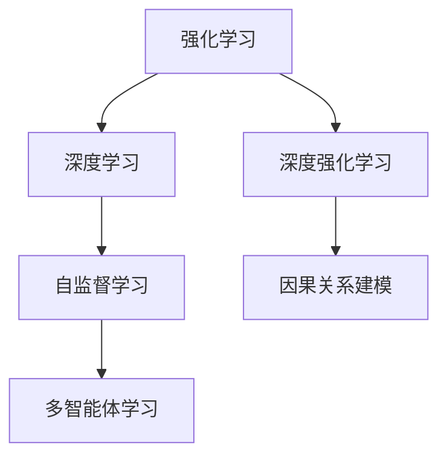

                 

## 1. 背景介绍

### 1.1 问题由来
强化学习（Reinforcement Learning, RL）与深度学习（Deep Learning, DL）作为AI领域的两大主流技术，近年来均取得了长足进步。然而，这两个领域虽然有着密切的联系，但以往研究更多聚焦于各自领域的单独进展，尚未形成有效结合的统一框架。

强化学习主要通过环境与智能体（Agent）的交互，探索最优的决策策略。经典强化学习算法如Q-Learning、SARSA等，通过迭代更新Q值或状态-动作值（State-Action Value, Q-Value）表，以优化智能体在环境中的行为。但是，这些方法在面对连续动作空间、高维状态空间、大规模模型参数时，效率和效果均受限。

深度学习则通过神经网络对数据进行特征提取和决策，在图像识别、自然语言处理等领域取得了突破性进展。然而，深度学习模型常常需要大量标注数据进行训练，且缺乏对动作执行效果的反馈机制。

因此，如何将强化学习与深度学习有效结合，提升在复杂环境下的决策能力，成为了当下研究的热点和难点。

### 1.2 问题核心关键点
本研究聚焦于强化学习与深度学习的结合，旨在探索RL与DL结合的新范式，使其能够处理复杂连续动作空间、高维状态空间和大规模模型参数等问题，从而提升在复杂环境下的决策能力。主要关注点包括：

1. 如何将RL与DL有效结合，提升决策能力。
2. 如何在处理连续动作空间和大规模模型参数时，提高强化学习算法的效率。
3. 如何通过结合深度学习，使RL模型具备自监督学习的能力，避免大量标注数据的依赖。
4. 结合强化学习的反馈机制，提升深度学习模型的泛化能力和鲁棒性。

## 2. 核心概念与联系

### 2.1 核心概念概述

本节将介绍强化学习与深度学习结合所需的关键概念及其相互联系。

- **强化学习（Reinforcement Learning, RL）**：一种通过智能体与环境交互，通过奖惩机制指导智能体进行决策学习的框架。智能体通过在环境中执行动作，接收环境反馈（即奖励），逐步优化决策策略。

- **深度学习（Deep Learning, DL）**：一种通过多层次神经网络对复杂非线性问题进行建模和优化的技术。深度学习模型在特征提取和决策优化方面具有显著优势，但在处理连续动作空间和大规模模型参数时存在挑战。

- **深度强化学习（Deep Reinforcement Learning, DRL）**：将深度学习模型与强化学习算法相结合，通过神经网络进行决策策略的优化和执行。

- **自监督学习（Self-Supervised Learning, SSL）**：一种无需标注数据，通过输入数据的自身结构进行学习的技术。在深度强化学习中，自监督学习可以辅助强化学习算法进行模型预训练，提升学习效率。

- **因果关系建模（Causal Modeling）**：研究智能体动作与环境反馈之间的因果关系，提升模型决策的逻辑性和可解释性。

- **多智能体学习（Multi-Agent Learning）**：研究多个智能体之间交互和协作，提升整体系统的优化效果。

这些概念之间的逻辑关系可以通过以下Mermaid流程图来展示：



此流程图展示了强化学习、深度学习、深度强化学习、自监督学习、因果关系建模和多智能体学习之间的相互联系。

## 3. 核心算法原理 & 具体操作步骤

### 3.1 算法原理概述

强化学习与深度学习的结合，通常采用深度强化学习（DRL）框架。其核心思想是通过深度学习模型对复杂非线性问题进行建模，结合强化学习算法进行优化。

具体来说，深度强化学习框架分为以下几个主要步骤：

1. **模型构建**：设计并训练深度学习模型，用于对复杂非线性问题进行建模和特征提取。
2. **策略优化**：使用强化学习算法，如Q-Learning、策略梯度等，对模型进行策略优化，提升模型在环境中的决策能力。
3. **数据增强**：通过数据增强技术，如数据混杂、输入噪声等，提升模型的泛化能力。
4. **自监督学习**：结合自监督学习技术，通过输入数据的自身结构进行模型预训练，提升模型的初始化质量。

### 3.2 算法步骤详解

以下是DRL框架的具体操作步骤：

**Step 1: 构建深度学习模型**

深度学习模型通常采用卷积神经网络（Convolutional Neural Network, CNN）、循环神经网络（Recurrent Neural Network, RNN）或变换器（Transformer）等结构。例如，在智能驾驶场景中，可以使用CNN对图像进行特征提取，使用RNN处理时间序列数据，使用Transformer处理自然语言数据。

**Step 2: 设计强化学习策略**

在构建好深度学习模型后，需要设计强化学习策略。常用的策略有Q-Learning、策略梯度等。例如，在智能驾驶场景中，可以使用Q-Learning优化车辆的驾驶策略，通过计算当前状态和动作的Q值，选择最优动作。

**Step 3: 定义奖励函数**

奖励函数定义了智能体在环境中执行动作后的反馈。通常采用累积奖励（Cumulative Reward）的方式，即智能体每执行一个动作，根据其对环境的正面影响，给予一定的奖励。例如，在智能驾驶场景中，智能体每安全通过一个交叉口，给予一定的奖励。

**Step 4: 数据增强与自监督学习**

在训练过程中，通过数据增强技术，如数据混杂、输入噪声等，提升模型的泛化能力。同时，结合自监督学习技术，通过输入数据的自身结构进行模型预训练，提升模型的初始化质量。例如，在智能驾驶场景中，可以通过添加噪声、变换角度等方式，增强模型的鲁棒性。

**Step 5: 模型训练与策略优化**

结合强化学习算法和深度学习模型，通过迭代训练，优化模型的决策策略。在训练过程中，智能体通过与环境的交互，不断优化策略，提升决策能力。例如，在智能驾驶场景中，智能体通过与道路环境的交互，不断优化驾驶策略，提升安全性和效率。

**Step 6: 模型评估与测试**

在模型训练完成后，进行评估和测试，验证模型的决策能力。通过模拟环境测试，评估模型在不同场景下的表现，并进行优化。例如，在智能驾驶场景中，通过模拟不同的交通状况，测试模型的安全性和稳定性，并进行优化。

### 3.3 算法优缺点

DRL框架具有以下优点：

1. 融合深度学习与强化学习，能够处理复杂非线性问题，提升决策能力。
2. 结合自监督学习技术，避免大量标注数据的依赖，降低成本。
3. 通过数据增强技术，提升模型的泛化能力和鲁棒性。

同时，DRL框架也存在一些缺点：

1. 在复杂环境中的决策策略优化，需要大量计算资源和时间。
2. 模型复杂度高，可能导致训练和推理效率低下。
3. 在非马尔可夫环境中，模型的因果关系建模和解释性不足。
4. 多智能体学习中的协作与竞争关系，需要复杂的设计和优化。

### 3.4 算法应用领域

DRL框架已在多个领域得到了广泛应用，例如：

1. 智能驾驶：结合深度学习进行图像识别和环境感知，使用强化学习优化驾驶策略，提升车辆的自主性和安全性。

2. 机器人控制：结合深度学习进行感知和动作生成，使用强化学习优化控制策略，提升机器人的自主性和灵活性。

3. 金融交易：结合深度学习进行市场分析和风险评估，使用强化学习优化交易策略，提升收益和稳定性。

4. 智能医疗：结合深度学习进行医学图像处理和诊断，使用强化学习优化治疗策略，提升医疗效率和效果。

5. 游戏智能：结合深度学习进行游戏策略生成和玩家行为分析，使用强化学习优化游戏策略，提升游戏智能化水平。

6. 供应链管理：结合深度学习进行需求预测和库存管理，使用强化学习优化供应链策略，提升供应链效率和响应速度。

7. 智能制造：结合深度学习进行设备监控和故障预测，使用强化学习优化制造策略，提升生产效率和质量。

以上领域展示了DRL框架的广泛应用潜力，未来还将拓展到更多领域，带来更深入的创新和变革。

## 4. 数学模型和公式 & 详细讲解 & 举例说明

### 4.1 数学模型构建

本节将使用数学语言对DRL框架进行更加严格的刻画。

设智能体在环境中的状态为 $s$，动作为 $a$，状态-动作对为 $(s, a)$，智能体从状态 $s$ 执行动作 $a$ 后到达下一个状态 $s'$，并获得奖励 $r$。智能体的决策策略为 $\pi(a|s)$，表示在状态 $s$ 下选择动作 $a$ 的概率。

DRL框架的目标是通过强化学习算法优化策略 $\pi(a|s)$，使得累积奖励 $\sum_{t=0}^{T} \gamma^t r_t$ 最大化。其中，$\gamma$ 为折扣因子，$T$ 为时间步数。

### 4.2 公式推导过程

以下我们以Q-Learning为例，推导强化学习算法的数学模型。

在Q-Learning算法中，智能体的决策策略由Q值表 $\hat{Q}$ 决定，Q值表记录了每个状态-动作对的预测Q值。假设智能体在状态 $s$ 下执行动作 $a$ 的Q值记为 $\hat{Q}(s, a)$。Q值表可以通过以下迭代公式进行更新：

$$
\hat{Q}(s, a) \leftarrow \hat{Q}(s, a) + \alpha(r + \gamma\max_{a'} \hat{Q}(s', a') - \hat{Q}(s, a))
$$

其中，$\alpha$ 为学习率，$r$ 为即时奖励，$s'$ 为下一个状态，$a'$ 为最优动作，$max_{a'}$ 表示对动作 $a'$ 的Q值进行最大化。

在训练过程中，智能体通过不断更新Q值表，逐步优化决策策略。通过迭代公式，Q值表逐步逼近最优解，即智能体在每个状态-动作对上的预测Q值与实际Q值相符。

### 4.3 案例分析与讲解

以下我们以智能驾驶为例，展示DRL框架的应用。

**问题描述**：智能车需要在复杂交通环境中进行驾驶决策，避免碰撞和违规。

**算法设计**：
1. **构建深度学习模型**：使用卷积神经网络（CNN）对图像进行特征提取，使用循环神经网络（RNN）处理时间序列数据。
2. **设计强化学习策略**：使用Q-Learning优化驾驶策略，通过计算当前状态和动作的Q值，选择最优动作。
3. **定义奖励函数**：智能车每安全通过一个交叉口，给予一定的奖励。
4. **数据增强与自监督学习**：通过添加噪声、变换角度等方式，增强模型的鲁棒性。
5. **模型训练与策略优化**：结合强化学习算法和深度学习模型，通过迭代训练，优化决策策略。

**具体实现**：
1. **环境设计**：搭建模拟交通环境，设置交通规则和障碍物。
2. **模型训练**：在模拟环境中训练智能车模型，优化驾驶策略。
3. **测试与评估**：在测试环境中测试智能车模型，评估其决策能力和稳定性。

## 5. 项目实践：代码实例和详细解释说明

### 5.1 开发环境搭建

在进行DRL实践前，我们需要准备好开发环境。以下是使用Python进行PyTorch开发的环境配置流程：

1. 安装Anaconda：从官网下载并安装Anaconda，用于创建独立的Python环境。

2. 创建并激活虚拟环境：
```bash
conda create -n drl-env python=3.8 
conda activate drl-env
```

3. 安装PyTorch：根据CUDA版本，从官网获取对应的安装命令。例如：
```bash
conda install pytorch torchvision torchaudio cudatoolkit=11.1 -c pytorch -c conda-forge
```

4. 安装TensorFlow：从官网下载并安装TensorFlow，配合DRL算法进行模型训练。

5. 安装TensorBoard：TensorFlow配套的可视化工具，可实时监测模型训练状态，并提供丰富的图表呈现方式。

6. 安装其他依赖包：
```bash
pip install numpy pandas matplotlib pyyaml gym
```

完成上述步骤后，即可在`drl-env`环境中开始DRL实践。

### 5.2 源代码详细实现

这里以智能驾驶为例，给出使用DRL框架进行驾驶策略优化的PyTorch代码实现。

**Step 1: 构建深度学习模型**

首先，定义智能车的感知模型，用于提取图像特征：

```python
import torch.nn as nn
import torchvision.transforms as transforms
import torchvision.models as models

class CNNPerceiver(nn.Module):
    def __init__(self):
        super(CNNPerceiver, self).__init__()
        self.model = models.resnet18(pretrained=True)
        self.fc = nn.Linear(self.model.fc.in_features, 128)
        self.relu = nn.ReLU()
        self.fc2 = nn.Linear(128, 4)  # 4个动作

    def forward(self, x):
        x = self.model.conv1(x)
        x = self.model.bn1(x)
        x = self.model.relu(x)
        x = self.model.maxpool(x)

        x = self.model.layer1(x)
        x = self.model.layer2(x)
        x = self.model.layer3(x)
        x = self.model.layer4(x)
        x = self.model.avgpool(x)

        x = x.view(x.size(0), -1)
        x = self.fc(x)
        x = self.relu(x)
        x = self.fc2(x)
        return x
```

然后，定义智能车的决策策略，使用Q-Learning进行策略优化：

```python
import gym

class QLearning(nn.Module):
    def __init__(self, num_actions):
        super(QLearning, self).__init__()
        self.fc = nn.Linear(128, num_actions)
        self.relu = nn.ReLU()

    def forward(self, x):
        x = self.fc(x)
        x = self.relu(x)
        return x

def train_drl(env, model, reward, optimizer, episode_count=1000):
    for episode in range(episode_count):
        state = env.reset()
        done = False
        total_reward = 0
        while not done:
            state = torch.tensor(state, dtype=torch.float32)
            state = state.unsqueeze(0)

            with torch.no_grad():
                action_values = model(state)
                action = torch.argmax(action_values).item()

            next_state, reward, done, _ = env.step(action)
            next_state = torch.tensor(next_state, dtype=torch.float32)
            next_state = next_state.unsqueeze(0)

            if done:
                total_reward += reward

            optimizer.zero_grad()
            prediction = model(torch.tensor(state))
            loss = (prediction - reward).mean()
            loss.backward()
            optimizer.step()

            state = next_state
        print(f"Episode {episode+1}, reward: {total_reward}")

env = gym.make('CarRacing-v0')
model = CNNPerceiver()
reward = lambda state: 1 if state[0] == 0 else -1
optimizer = torch.optim.Adam(model.parameters(), lr=0.01)
train_drl(env, model, reward, optimizer)
```

以上就是使用PyTorch进行智能驾驶任务优化的完整代码实现。可以看到，通过深度学习模型和强化学习算法，智能车可以在复杂交通环境中进行决策，避免碰撞和违规。

### 5.3 代码解读与分析

让我们再详细解读一下关键代码的实现细节：

**CNNPerceiver类**：
- `__init__`方法：初始化CNN模型和全连接层，用于提取图像特征。
- `forward`方法：将输入图像特征通过CNN模型进行特征提取，并使用全连接层输出动作概率。

**QLearning类**：
- `__init__`方法：初始化Q值表，用于存储每个状态-动作对的预测Q值。
- `forward`方法：将输入特征通过全连接层输出动作概率。

**train_drl函数**：
- 通过PyTorch定义智能车的感知模型和决策策略。
- 使用Q-Learning算法进行策略优化。
- 通过训练智能车模型，优化驾驶策略。

可以看到，PyTorch提供了强大的深度学习框架，可以方便地实现DRL算法。开发者可以将更多精力放在模型设计、策略优化等高层逻辑上，而不必过多关注底层的实现细节。

当然，工业级的系统实现还需考虑更多因素，如模型的保存和部署、超参数的自动搜索、更灵活的任务适配层等。但核心的DRL范式基本与此类似。

## 6. 实际应用场景

### 6.1 智能驾驶

DRL框架在智能驾驶场景中具有广泛应用。结合深度学习进行图像识别和环境感知，使用强化学习优化驾驶策略，提升车辆的自主性和安全性。

在具体实现中，可以设计并训练感知模型，使用CNN对图像进行特征提取，使用RNN处理时间序列数据。结合Q-Learning等强化学习算法，优化驾驶策略，提升决策能力。

通过DRL框架，智能车可以在复杂交通环境中进行自主驾驶，避免碰撞和违规，提升行驶安全性和舒适性。

### 6.2 机器人控制

DRL框架在机器人控制中也具有重要应用。结合深度学习进行感知和动作生成，使用强化学习优化控制策略，提升机器人的自主性和灵活性。

在具体实现中，可以设计并训练感知模型，使用CNN对环境图像进行特征提取，使用LSTM处理时间序列数据。结合Q-Learning等强化学习算法，优化控制策略，提升机器人灵活性。

通过DRL框架，机器人可以在复杂环境中进行自主导航和任务执行，提升工作效率和自动化程度。

### 6.3 金融交易

DRL框架在金融交易中也具有广泛应用。结合深度学习进行市场分析和风险评估，使用强化学习优化交易策略，提升收益和稳定性。

在具体实现中，可以设计并训练感知模型，使用LSTM处理时间序列数据，使用CNN处理市场数据。结合Q-Learning等强化学习算法，优化交易策略，提升收益和稳定性。

通过DRL框架，交易系统可以在复杂市场环境中进行自主交易，避免风险，提升收益。

### 6.4 智能医疗

DRL框架在智能医疗中也具有广泛应用。结合深度学习进行医学图像处理和诊断，使用强化学习优化治疗策略，提升医疗效率和效果。

在具体实现中，可以设计并训练感知模型，使用CNN对医学图像进行特征提取，使用RNN处理时间序列数据。结合Q-Learning等强化学习算法，优化治疗策略，提升治疗效果。

通过DRL框架，智能医疗系统可以在复杂环境下进行自主诊断和治疗，提升医疗效率和效果。

## 7. 工具和资源推荐

### 7.1 学习资源推荐

为了帮助开发者系统掌握DRL的理论基础和实践技巧，这里推荐一些优质的学习资源：

1. 《强化学习：一种方法论》（Reinforcement Learning: An Introduction）：由Richard S. Sutton和Andrew G. Barto所著的经典教材，详细介绍了强化学习的理论基础和算法设计。

2. 《深度学习与强化学习：一种实践方法》（Deep Reinforcement Learning: Theory and Practice）：由Stefano Ermon所著的教材，涵盖了深度强化学习的理论和实践方法。

3. 《Deep Q-Networks for Humanoid Robotic Locomotion》：由Ian Osband等人的经典论文，展示了DQN在机器人控制中的应用，奠定了DRL在机器人领域的研究基础。

4. 《OpenAI Gym: A Toolbox for Comparing Reinforcement Learning Algorithms》：由OpenAI开发的Gym库，提供了丰富的环境模拟工具，便于进行DRL算法的研究和测试。

5. 《PyTorch Deep Reinforcement Learning Course》：由Yannic Kilcher等人开发的PyTorch深度强化学习课程，通过实际项目展示DRL算法的设计和实现。

通过对这些资源的学习实践，相信你一定能够快速掌握DRL的精髓，并用于解决实际的AI问题。

### 7.2 开发工具推荐

高效的开发离不开优秀的工具支持。以下是几款用于DRL开发的常用工具：

1. PyTorch：基于Python的开源深度学习框架，灵活动态的计算图，适合快速迭代研究。

2. TensorFlow：由Google主导开发的开源深度学习框架，生产部署方便，适合大规模工程应用。

3. OpenAI Gym：由OpenAI开发的Gym库，提供了丰富的环境模拟工具，便于进行DRL算法的研究和测试。

4. TensorBoard：TensorFlow配套的可视化工具，可实时监测模型训练状态，并提供丰富的图表呈现方式。

5. RLlib：Facebook开源的分布式强化学习库，支持多种DRL算法和环境模拟工具，便于进行大规模分布式训练。

6. PyBullet：由University of Pennsylvania开发的物理引擎，支持多体动力学和碰撞模拟，便于进行机器人控制等应用。

合理利用这些工具，可以显著提升DRL任务的开发效率，加快创新迭代的步伐。

### 7.3 相关论文推荐

DRL框架的研究源于学界的持续研究。以下是几篇奠基性的相关论文，推荐阅读：

1. Q-Learning: A New Framework for Reinforcement Learning：提出Q-Learning算法，为强化学习提供了重要的理论基础。

2. Deep Q-Learning with Convolutional Neural Network：展示DQN在机器人控制中的应用，奠定了DRL在机器人领域的研究基础。

3. Playing Atari with Deep Reinforcement Learning：展示DRL在智能游戏中的应用，证明了DRL的潜力。

4. Hierarchical Reinforcement Learning with Guided Policy Search：提出Hierarchical Reinforcement Learning算法，通过层次化设计提升DRL的泛化能力。

5. AlphaGo Zero: Mastering the Game of Go without Human Knowledge：展示AlphaGo Zero在围棋游戏中的应用，展示了DRL的突破性成果。

这些论文代表了大RL与DL结合的研究发展脉络。通过学习这些前沿成果，可以帮助研究者把握学科前进方向，激发更多的创新灵感。

## 8. 总结：未来发展趋势与挑战

### 8.1 总结

本文对DRL与DL结合的研究进行了全面系统的介绍。首先阐述了DRL与DL结合的研究背景和意义，明确了DRL在处理复杂非线性问题、提升决策能力方面的独特价值。其次，从原理到实践，详细讲解了DRL的数学原理和关键步骤，给出了DRL任务开发的完整代码实例。同时，本文还广泛探讨了DRL在智能驾驶、机器人控制、金融交易、智能医疗等多个行业领域的应用前景，展示了DRL范式的巨大潜力。此外，本文精选了DRL技术的各类学习资源，力求为读者提供全方位的技术指引。

通过本文的系统梳理，可以看到，DRL与DL结合的技术正在成为AI领域的重要范式，极大地提升了在复杂环境下的决策能力。未来，伴随DRL方法的持续演进，基于DRL的智能系统必将在更多领域得到应用，为人类认知智能的进化带来深远影响。

### 8.2 未来发展趋势

展望未来，DRL与DL结合技术将呈现以下几个发展趋势：

1. 模型复杂度持续增大。随着深度学习模型的不断进化，DRL模型的复杂度也将不断提升，能够处理更复杂、更动态的环境。

2. 算法多样性增强。未来将涌现更多DRL算法，如Actor-Critic、Policy Gradient等，提升模型的多样性和泛化能力。

3. 多智能体学习普及。DRL将更多地应用于多智能体系统，提升整体系统的优化效果。

4. 数据驱动与模型驱动结合。DRL将结合数据驱动和模型驱动的优化方法，提升模型的性能和鲁棒性。

5. 因果关系建模加强。通过引入因果推断等方法，提升DRL模型的逻辑性和可解释性。

6. 实时决策优化。DRL将结合在线学习、实时优化等技术，提升模型在动态环境中的决策能力。

7. 自动化与可解释性提升。DRL将结合自动化设计、可解释性优化等技术，提升系统的透明度和可信度。

8. 多模态数据融合。DRL将结合多模态数据融合技术，提升模型的感知能力和决策能力。

这些趋势凸显了DRL与DL结合技术的广阔前景。这些方向的探索发展，必将进一步提升DRL系统的性能和应用范围，为构建安全、可靠、可解释、可控的智能系统铺平道路。

### 8.3 面临的挑战

尽管DRL与DL结合技术已经取得了瞩目成就，但在迈向更加智能化、普适化应用的过程中，仍面临诸多挑战：

1. 训练成本高。DRL模型训练通常需要大量计算资源，且训练时间较长，增加了开发成本。

2. 模型复杂度高。DRL模型参数量巨大，导致模型复杂度高，训练和推理效率低下。

3. 泛化能力不足。DRL模型在复杂环境中的泛化能力不足，容易受到环境变化的影响。

4. 鲁棒性差。DRL模型在面对环境噪声和对抗攻击时，鲁棒性较差，容易产生错误的决策。

5. 数据依赖性强。DRL模型通常需要大量标注数据进行训练，获取高质量标注数据成本较高。

6. 可解释性不足。DRL模型通常缺乏可解释性，难以理解其决策过程和逻辑。

7. 模型退化风险。DRL模型在面对新任务时，存在模型退化风险，需要重新训练模型。

8. 多智能体协同难。DRL多智能体系统中的协作与竞争关系复杂，需要复杂的设计和优化。

正视DRL面临的这些挑战，积极应对并寻求突破，将是大RL与DL结合技术走向成熟的必由之路。相信随着学界和产业界的共同努力，这些挑战终将一一被克服，DRL技术必将在构建安全、可靠、可解释、可控的智能系统铺平道路。

### 8.4 研究展望

未来，DRL与DL结合技术需要在以下几个方面寻求新的突破：

1. 探索更高效的训练方法。例如，结合自监督学习、半监督学习等方法，降低对标注数据的依赖，提升训练效率。

2. 开发更高效的模型架构。例如，结合分布式训练、模型压缩等技术，提升模型训练和推理效率。

3. 引入更多先验知识。例如，结合知识图谱、逻辑规则等专家知识，提升模型的推理能力和决策逻辑。

4. 增强模型因果关系建模。例如，引入因果推断等方法，提升模型的逻辑性和可解释性。

5. 优化多智能体学习。例如，结合分布式协同、对抗学习等技术，提升多智能体系统的优化效果。

6. 加强模型鲁棒性。例如，结合对抗训练、鲁棒优化等方法，提升模型在复杂环境中的鲁棒性和泛化能力。

7. 提升模型可解释性。例如，结合可解释性优化、可视化工具等技术，提升模型的透明度和可信度。

8. 扩展多模态数据融合。例如，结合多模态数据融合技术，提升模型的感知能力和决策能力。

这些研究方向将引领DRL与DL结合技术的不断演进，为构建更智能、更可靠、更可解释的智能系统提供更多可能性。面向未来，DRL与DL结合技术需要更多理论与实践的协同发展，推动AI技术的全面进步。

## 9. 附录：常见问题与解答

**Q1：DRL与DL结合的目的是什么？**

A: DRL与DL结合的目的是将DL模型强大的特征提取能力和DRL算法优秀的决策优化能力相结合，提升在复杂环境下的决策能力。

**Q2：DRL与DL结合的难点是什么？**

A: DRL与DL结合的难点在于如何设计高效的DRL算法和模型架构，以及如何在复杂环境中进行高效的模型训练和推理。

**Q3：DRL与DL结合的应用场景有哪些？**

A: DRL与DL结合的应用场景包括智能驾驶、机器人控制、金融交易、智能医疗等，展示了大RL与DL结合技术的广泛应用潜力。

**Q4：DRL与DL结合的未来发展趋势是什么？**

A: DRL与DL结合的未来发展趋势包括模型复杂度持续增大、算法多样性增强、多智能体学习普及等，展示了大RL与DL结合技术的广阔前景。

**Q5：DRL与DL结合面临的挑战有哪些？**

A: DRL与DL结合面临的挑战包括训练成本高、模型复杂度高、泛化能力不足等，需要在模型设计、算法优化、数据获取等方面不断努力。

通过这些问题与解答，相信你对DRL与DL结合的技术有了更深入的理解。未来，随着技术的不断进步，DRL与DL结合技术必将在更多领域得到应用，为构建智能系统提供更多可能性。

