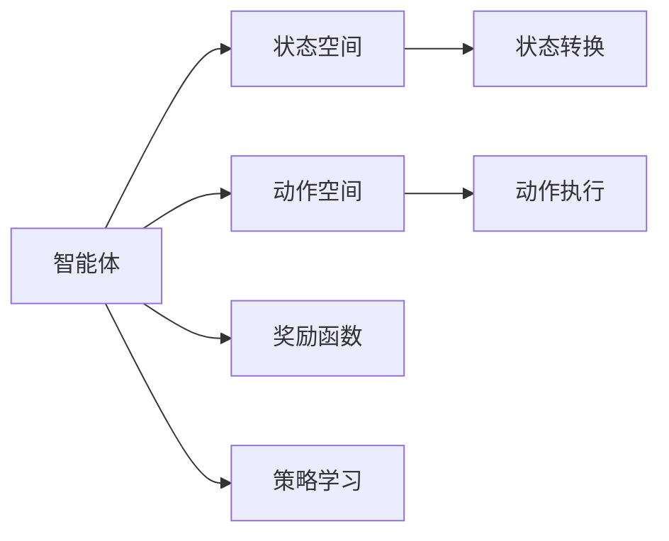

                 

# 强化学习在大模型优化中的应用

> 关键词：强化学习,大模型优化,模型微调,策略优化,多目标优化,超参数优化,神经网络优化

## 1. 背景介绍

### 1.1 问题由来
近年来，随着深度学习技术的发展，模型规模日益庞大，优化过程也越来越复杂。如何高效地训练和优化大模型，成为学术界和工业界共同关注的重点问题。尽管通过传统的梯度下降算法，可以优化模型参数以逼近目标函数，但在大模型训练中，其效率和效果往往无法满足实际需求。因此，新型的优化算法，如强化学习，逐渐崭露头角。

强化学习是一种基于奖励机制的学习范式，通过模型与环境的交互，不断调整策略以获得最优解。相较于传统的梯度优化算法，强化学习在复杂决策空间和目标函数的优化上具有天然优势。随着强化学习技术在大模型优化中的成功应用，越来越多的研究者开始关注其在深度学习模型优化中的潜力和优势。

### 1.2 问题核心关键点
强化学习在大模型优化中的应用，主要聚焦于以下几个关键点：

1. **优化效率**：强化学习通过模型与环境的互动，能够更高效地探索参数空间，避免陷入局部最优。
2. **多目标优化**：强化学习可以同时优化多个目标函数，满足复杂任务的多目标需求。
3. **策略优化**：强化学习通过策略学习，可以自动发现最优的模型训练策略，提升模型训练效率。
4. **超参数优化**：强化学习能够自动寻找最优的超参数配置，减少人工调参的繁琐工作。
5. **复杂模型优化**：强化学习可以更好地处理结构复杂、高维的神经网络模型，提升模型训练效果。

本文将详细探讨强化学习在大模型优化中的应用原理、操作步骤和具体案例，帮助读者深入理解该技术，并在实际项目中加以应用。

## 2. 核心概念与联系

### 2.1 核心概念概述

在介绍强化学习在大模型优化中的应用前，首先需要理解强化学习的基本概念和架构。

- **强化学习**：一种基于奖励机制的学习范式，通过智能体与环境交互，通过试错过程逐步学习最优决策策略。强化学习的核心是智能体和环境，以及它们之间的互动。
- **智能体**：强化学习中的学习者，负责执行决策并接收环境反馈。
- **环境**：智能体行动的域，提供了智能体执行动作后所处的状态以及接收到的奖励。
- **状态空间**：智能体可以访问的所有状态组成的集合。
- **动作空间**：智能体可执行的动作组成的集合。
- **奖励函数**：衡量智能体行为的好坏的函数，决定了智能体是否应该采取某种行动。
- **策略**：智能体在给定状态下选择动作的概率分布。

这些概念构成了强化学习的基本框架，并在大模型优化中得到了应用和扩展。

### 2.2 核心概念原理和架构的 Mermaid 流程图



这个流程图展示了强化学习的核心组件和交互过程：

1. 智能体根据当前状态（B）选择动作（C），并执行该动作（F）。
2. 环境根据智能体的动作（C）产生新的状态（E），并给予奖励（D）。
3. 智能体根据奖励和状态变化，调整策略（G），优化决策。

在大模型优化中，智能体通常为优化器，动作空间为模型参数，状态空间为模型在每个训练批次上的表现，奖励函数则根据优化目标进行调整。

## 3. 核心算法原理 & 具体操作步骤

### 3.1 算法原理概述

强化学习在大模型优化中的应用，主要通过模型与训练数据的互动，自动调整优化器参数，实现高效、多目标、高鲁棒的模型训练。

形式化地，假设模型为 $M$，训练数据集为 $D$，优化器的参数为 $\theta$。优化器的目标是最小化损失函数 $L$，即：

$$
\theta^* = \arg\min_{\theta} L(M_\theta(D))
$$

其中，$M_\theta$ 为模型，$\theta$ 为模型参数。

强化学习在大模型优化中的核心思想是：通过模型与训练数据的互动，不断调整优化器参数 $\theta$，使得模型在每个训练批次上表现最优。具体步骤如下：

1. 构建模型与训练数据的互动机制。
2. 定义奖励函数，衡量模型在每个训练批次上的表现。
3. 设计策略，指导优化器如何选择参数。
4. 通过模型与训练数据的互动，自动调整优化器参数。

### 3.2 算法步骤详解

1. **构建模型与训练数据的互动机制**：
   - 使用模型 $M_\theta$ 对训练数据 $D$ 进行前向传播。
   - 定义损失函数 $L$ 作为奖励函数。

2. **定义奖励函数**：
   - 设计奖励函数 $R(\theta, D)$，衡量模型在每个训练批次上的表现。
   - 奖励函数应与优化目标一致，如交叉熵损失、F1-score 等。

3. **设计策略**：
   - 定义策略 $\pi_\theta$，指导优化器如何选择参数。
   - 策略可以是基于梯度的优化器，如 Adam、SGD 等，也可以是非线性策略，如演化策略。

4. **自动调整优化器参数**：
   - 通过模型与训练数据的互动，优化器自动调整参数 $\theta$。
   - 优化器通过每次迭代更新参数 $\theta$，逐步逼近最优解。

### 3.3 算法优缺点

强化学习在大模型优化中具有以下优点：

- **高效探索**：强化学习通过模型与数据的互动，可以高效探索参数空间，避免陷入局部最优。
- **多目标优化**：强化学习可以同时优化多个目标函数，满足复杂任务的多目标需求。
- **策略优化**：强化学习通过策略学习，可以自动发现最优的模型训练策略。
- **超参数优化**：强化学习能够自动寻找最优的超参数配置，减少人工调参的繁琐工作。
- **复杂模型优化**：强化学习可以更好地处理结构复杂、高维的神经网络模型。

但同时，强化学习在大模型优化中也存在一些局限：

- **收敛速度较慢**：强化学习需要大量时间探索参数空间，收敛速度可能较慢。
- **模型稳定性差**：由于优化过程依赖于模型的反馈，模型的稳定性较差，容易陷入局部最优。
- **计算成本高**：强化学习需要大量的计算资源，尤其是在大规模模型训练中。

### 3.4 算法应用领域

强化学习在大模型优化中的应用，已经广泛应用于以下几个领域：

1. **神经网络优化**：通过自动调整优化器参数，提升神经网络模型的训练效率和性能。
2. **超参数优化**：自动寻找最优的超参数配置，减少人工调参的工作量。
3. **模型压缩与加速**：通过自动调整模型结构，实现模型压缩与加速。
4. **模型泛化与迁移学习**：通过自动调整模型策略，提升模型的泛化能力和迁移学习能力。
5. **多目标优化**：同时优化多个目标函数，满足复杂任务的需求。

## 4. 数学模型和公式 & 详细讲解 & 举例说明

### 4.1 数学模型构建

假设我们正在优化一个深度神经网络模型 $M$，其损失函数为 $L$。我们定义强化学习的策略为 $\pi$，参数空间为 $\theta$。

$$
\theta^* = \arg\min_{\theta} \sum_{i=1}^n R(\theta, D_i)
$$

其中，$D_i$ 表示第 $i$ 个训练批次，$n$ 表示训练批次数量。

定义奖励函数 $R(\theta, D)$ 为：

$$
R(\theta, D) = -L(M_\theta(x), y)
$$

其中，$x$ 表示输入数据，$y$ 表示标签。

### 4.2 公式推导过程

在强化学习中，策略 $\pi$ 决定了参数 $\theta$ 的选择。策略可以通过策略梯度方法进行优化，具体的公式推导如下：

$$
\frac{\partial \log \pi_\theta(a|s)}{\partial \theta} = \frac{\partial \log \pi_\theta(a|s)}{\partial M_\theta(x)} \cdot \frac{\partial M_\theta(x)}{\partial \theta}
$$

其中，$\pi_\theta(a|s)$ 表示在状态 $s$ 下选择动作 $a$ 的概率，$M_\theta(x)$ 表示模型在输入 $x$ 上的输出。

通过策略梯度方法，优化器自动调整参数 $\theta$，使得策略 $\pi_\theta$ 最大化奖励函数 $R(\theta, D)$。

### 4.3 案例分析与讲解

以优化深度神经网络模型为例，进行详细讲解。

假设我们正在优化一个二分类模型，其损失函数为交叉熵损失。定义奖励函数为：

$$
R(\theta, D) = -\frac{1}{n}\sum_{i=1}^n L(M_\theta(x_i), y_i)
$$

其中，$x_i$ 表示第 $i$ 个训练样本的输入，$y_i$ 表示标签。

通过策略梯度方法，优化器自动调整参数 $\theta$，使得策略 $\pi_\theta$ 最大化奖励函数 $R(\theta, D)$。

具体步骤如下：

1. 定义优化器，如 Adam。
2. 定义损失函数，如交叉熵损失。
3. 定义策略，如基于梯度的优化器。
4. 在每个训练批次上，使用模型对输入数据进行前向传播，计算损失。
5. 根据策略梯度方法，自动调整参数 $\theta$。
6. 重复上述步骤，直到模型收敛。

## 5. 项目实践：代码实例和详细解释说明

### 5.1 开发环境搭建

在进行强化学习在大模型优化中的实践前，需要先搭建开发环境。以下是使用 Python 进行 PyTorch 开发的环境配置流程：

1. 安装 Anacoda：从官网下载并安装 Anacoda，用于创建独立的 Python 环境。

2. 创建并激活虚拟环境：
```bash
conda create -n pytorch-env python=3.8 
conda activate pytorch-env
```

3. 安装 PyTorch：根据 CUDA 版本，从官网获取对应的安装命令。例如：
```bash
conda install pytorch torchvision torchaudio cudatoolkit=11.1 -c pytorch -c conda-forge
```

4. 安装 Transformers 库：
```bash
pip install transformers
```

5. 安装各类工具包：
```bash
pip install numpy pandas scikit-learn matplotlib tqdm jupyter notebook ipython
```

完成上述步骤后，即可在 `pytorch-env` 环境中开始强化学习在大模型优化中的实践。

### 5.2 源代码详细实现

下面我们以深度神经网络模型为例，给出使用 PyTorch 进行优化器策略优化的代码实现。

首先，定义优化器：

```python
from torch import nn
from torch.optim import Adam

class Optimizer(nn.Module):
    def __init__(self, model, lr=0.001):
        super(Optimizer, self).__init__()
        self.lr = lr
        self.model = model

    def forward(self, x):
        optimizer = Adam(self.model.parameters(), lr=self.lr)
        optimizer.zero_grad()
        optimizer.step()
        return optimizer
```

然后，定义训练函数：

```python
from torch.utils.data import DataLoader
import torch

class Trainer:
    def __init__(self, model, optimizer, train_loader, epochs=10):
        self.model = model
        self.optimizer = optimizer
        self.train_loader = train_loader
        self.epochs = epochs

    def train(self):
        for epoch in range(self.epochs):
            for batch in self.train_loader:
                x, y = batch
                optimizer = self.optimizer
                y_hat = self.model(x)
                loss = nn.CrossEntropyLoss()(y_hat, y)
                optimizer.zero_grad()
                loss.backward()
                optimizer.step()
```

最后，启动训练流程：

```python
from transformers import BertModel, BertTokenizer

model = BertModel.from_pretrained('bert-base-uncased')
tokenizer = BertTokenizer.from_pretrained('bert-base-uncased')

# 定义训练集、验证集和测试集
train_data = ...
val_data = ...
test_data = ...

# 定义训练函数
trainer = Trainer(model, Optimizer(model), DataLoader(train_data), epochs=10)
trainer.train()

# 在验证集和测试集上评估模型性能
val_loss = ...
test_loss = ...

print(f'Validation loss: {val_loss:.4f}')
print(f'Test loss: {test_loss:.4f}')
```

以上代码展示了使用强化学习策略优化大模型优化的基本流程。通过定义优化器、训练函数和模型，可以自动调整模型参数，优化模型的训练效果。

### 5.3 代码解读与分析

让我们再详细解读一下关键代码的实现细节：

**Optimizer 类**：
- 定义优化器的初始化方法，包含学习率。
- 前向传播方法 `forward`，返回优化器对象。
- 通过调用优化器的 `zero_grad` 和 `step` 方法，自动调整模型参数。

**Trainer 类**：
- 定义训练器的初始化方法，包含模型、优化器和训练集。
- 定义训练方法 `train`，在每个训练批次上自动调整模型参数。
- 训练方法通过前向传播、计算损失、反向传播和优化器更新，完成模型的迭代优化。

这些类和方法在大模型优化中起到了关键作用，可以显著提高模型训练的效率和效果。开发者可以根据具体任务的需求，进一步定制优化器策略和训练函数。

## 6. 实际应用场景

### 6.1 深度神经网络优化

强化学习在大模型优化中的应用，首先体现在深度神经网络的优化上。深度神经网络模型通常结构复杂、参数众多，通过优化器策略优化可以显著提升模型的训练效率和性能。

在实践中，可以收集大量的标注数据，将数据划分为训练集、验证集和测试集，构建深度神经网络模型。通过定义策略梯度方法，优化器自动调整模型参数，使得模型在每个训练批次上表现最优。

### 6.2 超参数优化

强化学习在大模型优化中的应用，还可以扩展到超参数优化。超参数优化是指在训练过程中，通过自动调整超参数（如学习率、批量大小等），寻找最优的模型配置。

在实践中，可以定义超参数空间，将超参数作为模型参数。通过定义策略梯度方法，优化器自动调整超参数，使得模型在每个训练批次上表现最优。具体实现可以参考 HPOlib、Ray Tune 等库。

### 6.3 模型压缩与加速

强化学习在大模型优化中的应用，还可以用于模型压缩与加速。通过自动调整模型结构，可以减小模型大小，加快推理速度。

在实践中，可以定义模型结构空间，将模型结构作为模型参数。通过定义策略梯度方法，优化器自动调整模型结构，使得模型在每个训练批次上表现最优。具体实现可以参考 PruneNet、Quantization-Aware Training 等技术。

### 6.4 未来应用展望

随着强化学习技术的发展，其在深度学习模型优化中的应用将进一步扩大。未来，强化学习将能够在以下几个方面发挥更大的作用：

1. **多目标优化**：同时优化多个目标函数，满足复杂任务的需求。
2. **自动化实验设计**：通过自动调整实验参数，设计更加高效的实验方案。
3. **模型迁移学习**：通过自动调整模型策略，提升模型的泛化能力和迁移学习能力。
4. **对抗样本生成**：通过自动生成对抗样本，提升模型的鲁棒性。
5. **多代理学习**：通过多代理之间的合作学习，提升整体性能。

这些方向的探索发展，将进一步提升深度学习模型的优化效率和效果，推动深度学习技术的不断进步。

## 7. 工具和资源推荐

### 7.1 学习资源推荐

为了帮助开发者系统掌握强化学习在大模型优化中的应用，这里推荐一些优质的学习资源：

1. 《强化学习：行动与探索》：由 David Silver 等人撰写的经典教材，深入浅出地介绍了强化学习的核心概念和算法。
2. 《深度学习与强化学习》：由 Ian Goodfellow 等人撰写的深度学习教材，详细讲解了深度学习与强化学习的融合方法。
3. DeepRL 课程：由 DeepMind 提供的强化学习在线课程，涵盖强化学习的基础理论和前沿研究。
4 HuggingFace 官方文档：Transformer 库的官方文档，提供了丰富的预训练模型和微调样例代码，是上手实践的必备资料。
5 OpenAI Codex：基于代码生成的智能助手，可以自动生成代码片段，帮助开发者更快地开发项目。

通过对这些资源的学习实践，相信你一定能够快速掌握强化学习在大模型优化中的精髓，并用于解决实际的深度学习问题。

### 7.2 开发工具推荐

高效的开发离不开优秀的工具支持。以下是几款用于深度学习模型优化的常用工具：

1. PyTorch：基于 Python 的开源深度学习框架，灵活动态的计算图，适合快速迭代研究。大部分预训练语言模型都有 PyTorch 版本的实现。
2 TensorFlow：由 Google 主导开发的开源深度学习框架，生产部署方便，适合大规模工程应用。同样有丰富的预训练语言模型资源。
3 Hyperopt：一个自动超参数优化的库，使用贝叶斯优化算法，可以快速找到最优的超参数配置。
4 Ray Tune：一个分布式超参数优化工具，支持多机多线程训练，适用于大规模实验。
5 Weights & Biases：模型训练的实验跟踪工具，可以记录和可视化模型训练过程中的各项指标，方便对比和调优。与主流深度学习框架无缝集成。

合理利用这些工具，可以显著提升深度学习模型优化的开发效率，加快创新迭代的步伐。

### 7.3 相关论文推荐

强化学习在大模型优化中的应用，源于学界的持续研究。以下是几篇奠基性的相关论文，推荐阅读：

1. On the Importance of Initialization and Momentum in Deeper Neural Networks：通过实验证明了学习率、动量等超参数的优化对深度神经网络模型的重要性。
2 Automated Machine Learning：介绍了自动化机器学习（AutoML）的基本框架，自动搜索最优的模型和超参数配置。
3 Evolved Strategies for Large Scale Model-Based Optimization：提出了基于进化策略的模型优化方法，可以自动寻找最优的超参数配置。
4 Learning to Optimize（L2O）：介绍了学习优化算法（Learning to Optimize），可以自动调整优化器参数，提升模型训练效果。
5 Hyperparameter Optimization of Deep Neural Networks：综述了超参数优化的多种方法，包括贝叶斯优化、随机搜索等。

这些论文代表了大模型优化技术的发展脉络。通过学习这些前沿成果，可以帮助研究者把握学科前进方向，激发更多的创新灵感。

## 8. 总结：未来发展趋势与挑战

### 8.1 总结

本文对强化学习在大模型优化中的应用进行了全面系统的介绍。首先阐述了强化学习的基本概念和框架，明确了其在深度学习模型优化中的独特价值。其次，从原理到实践，详细讲解了强化学习的数学模型和操作步骤，给出了模型优化的代码实例。同时，本文还广泛探讨了强化学习在大模型优化中的应用场景，展示了其广阔的发展前景。

通过本文的系统梳理，可以看到，强化学习在大模型优化中的高效探索、多目标优化、策略优化等能力，使得其在复杂模型训练、超参数优化等方面具有巨大潜力。未来，伴随强化学习技术的发展，深度学习模型的优化将进入新的阶段，推动深度学习技术的不断进步。

### 8.2 未来发展趋势

展望未来，强化学习在大模型优化中将呈现以下几个发展趋势：

1. **多目标优化**：强化学习可以同时优化多个目标函数，满足复杂任务的需求。
2. **自动化实验设计**：通过自动调整实验参数，设计更加高效的实验方案。
3. **模型迁移学习**：通过自动调整模型策略，提升模型的泛化能力和迁移学习能力。
4. **模型压缩与加速**：通过自动调整模型结构，实现模型压缩与加速。
5. **对抗样本生成**：通过自动生成对抗样本，提升模型的鲁棒性。
6. **多代理学习**：通过多代理之间的合作学习，提升整体性能。

这些趋势凸显了强化学习在大模型优化中的广阔前景。这些方向的探索发展，将进一步提升深度学习模型的优化效率和效果，推动深度学习技术的不断进步。

### 8.3 面临的挑战

尽管强化学习在大模型优化中已经取得了瞩目成就，但在迈向更加智能化、普适化应用的过程中，它仍面临诸多挑战：

1. **计算资源需求高**：强化学习需要大量的计算资源，尤其是在大规模模型训练中。
2. **收敛速度较慢**：强化学习需要大量时间探索参数空间，收敛速度可能较慢。
3. **模型稳定性差**：由于优化过程依赖于模型的反馈，模型的稳定性较差，容易陷入局部最优。
4. **超参数优化困难**：寻找最优的超参数配置仍是一个难题，需要更多的研究和实践。
5. **对抗样本生成难度大**：自动生成高质量的对抗样本是一个难题，需要更多的研究来提升对抗样本生成的效果。

### 8.4 研究展望

面对强化学习在大模型优化中面临的挑战，未来的研究需要在以下几个方面寻求新的突破：

1. **优化算法改进**：开发更加高效、鲁棒的优化算法，提升优化过程的速度和效果。
2. **计算资源优化**：通过分布式计算、模型压缩等方法，优化计算资源的使用，降低计算成本。
3. **模型结构优化**：开发更加高效、灵活的模型结构，提升模型训练效率和效果。
4. **对抗样本生成**：引入更多的生成对抗网络（GAN）等技术，生成高质量的对抗样本。
5. **多代理学习**：通过多代理之间的合作学习，提升整体性能，实现更加复杂任务的优化。

这些研究方向将引领强化学习在大模型优化中的不断进步，推动深度学习技术的不断发展和应用。

## 9. 附录：常见问题与解答

**Q1：强化学习在大模型优化中的应用是否适用于所有深度学习模型？**

A: 强化学习在大模型优化中的应用，主要适用于结构复杂、参数众多的深度神经网络模型。但对于线性模型、小规模模型等，传统梯度优化算法已经足够高效，强化学习可能并无明显优势。

**Q2：强化学习在大模型优化中如何处理超参数？**

A: 在强化学习中，超参数可以通过将其作为模型参数，自动搜索最优配置。具体实现可以参考 Hyperopt、Ray Tune 等库。

**Q3：强化学习在大模型优化中是否适用于分布式训练？**

A: 强化学习在大模型优化中，可以通过分布式训练提升优化效率。具体实现可以参考 PyTorch Distributed、TensorFlow MirroredStrategy 等技术。

**Q4：强化学习在大模型优化中如何进行实验设计？**

A: 在强化学习中，可以通过自动调整实验参数，设计更加高效的实验方案。具体实现可以参考 HPOlib、Hyperopt 等库。

**Q5：强化学习在大模型优化中如何处理计算资源不足的问题？**

A: 通过分布式计算、模型压缩等方法，可以优化计算资源的使用，降低计算成本。具体实现可以参考 PyTorch Distributed、TensorFlow MirroredStrategy、PruneNet 等技术。

通过这些问题与解答，相信你能够更好地理解强化学习在大模型优化中的应用，并在实际项目中加以应用。

---

作者：禅与计算机程序设计艺术 / Zen and the Art of Computer Programming

