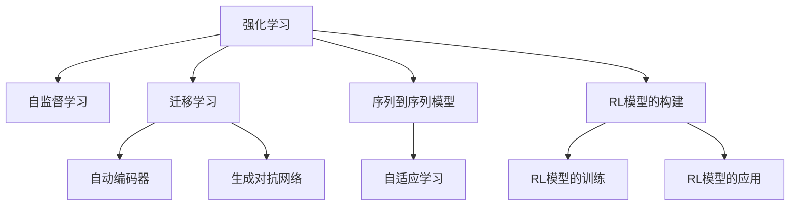

                 

# 强化学习训练自主智能模型

## 1. 背景介绍

强化学习(Reinforcement Learning, RL)作为人工智能(AI)的一个重要分支，其目标是让机器能够从环境和经验中学习，自主做出决策，并在长期累积的奖励信号中逐步优化其行为策略。强化学习在近年来得到了广泛应用，从游戏智能到机器人控制，从自动驾驶到自然语言处理，都取得了显著成果。

在NLP领域，强化学习已被用于自动摘要、对话系统、文本生成、情感分析等任务，展现出强大的潜力。然而，NLP任务复杂多样，如何利用强化学习构建自主智能模型，并优化其效果，仍是一个值得深入研究的问题。本文将从核心概念、算法原理、操作步骤和实践案例等方面，系统介绍强化学习在NLP领域的应用，并展望其未来发展趋势。

## 2. 核心概念与联系

### 2.1 核心概念概述

为更好地理解强化学习在NLP中的应用，本文将介绍几个核心概念及其联系：

- **强化学习(RL)**：一种通过智能体与环境交互，不断累积奖励信号来优化行为策略的学习方法。智能体通过观察环境状态，采取行动，获得反馈，重复此过程以优化策略。
- **自监督学习(SSL)**：指从无需标签的数据中学习表征，用于提高模型的泛化能力。常见的自监督学习任务包括语言建模、掩码预测等。
- **迁移学习(Transfer Learning)**：指从某一领域学习到的知识，迁移到另一领域的学习范式。RL模型可以利用自监督学习得到的表征，作为迁移学习的知识来源。
- **自动编码器(Autocoder)**：通过解码器-编码器结构，将输入数据映射为中间表示，再通过编码器还原为输入，实现对数据的高效压缩和重构。
- **生成对抗网络(GAN)**：一种生成模型，通过对抗式训练，产生逼真的样本数据，用于数据增强和噪声注入。
- **序列到序列模型(Seq2Seq)**：用于将输入序列映射到输出序列的模型，如编码器-解码器结构。
- **自适应学习(Adaptive Learning)**：指智能体在环境中的行为策略根据当前状态和目标不断调整，以适应当前任务的要求。

这些核心概念之间存在着密切的联系，通过强化学习，智能体可以自主适应环境变化，利用自监督学习和迁移学习提高学习效率，并结合自动编码器、生成对抗网络、序列到序列模型等多种技术，实现对复杂NLP任务的建模和优化。

### 2.2 核心概念原理和架构的 Mermaid 流程图(Mermaid 流程节点中不要有括号、逗号等特殊字符)



通过以上 Mermaid 流程图可以看出，强化学习在NLP中的应用，通常需要结合自监督学习、迁移学习、自动编码器、生成对抗网络和序列到序列模型等多种技术，通过构建和训练RL模型，实现对NLP任务的自主智能处理。

## 3. 核心算法原理 & 具体操作步骤

### 3.1 算法原理概述

强化学习在NLP中的应用，通常采用序列到序列模型作为基础架构，通过与环境交互来学习行为策略。具体流程如下：

1. **环境建模**：将NLP任务抽象为强化学习环境，定义状态、动作、奖励和过渡函数。
2. **模型构建**：设计序列到序列模型，并引入RL相关组件，如策略网络、值网络等。
3. **策略训练**：通过交互式训练，优化策略网络，使得模型能够最大化累积奖励。
4. **模型应用**：将训练好的模型应用于具体NLP任务，进行推理预测。

### 3.2 算法步骤详解

#### 3.2.1 环境建模

强化学习在NLP中的应用，通常需要将NLP任务抽象为马尔科夫决策过程(MDP)。MDP由状态、动作、奖励和过渡函数四部分组成：

- **状态(State)**：表示当前环境的状态，在NLP中通常指文本的特征表示。
- **动作(Action)**：智能体可以采取的行动，在NLP中通常指模型的输入。
- **奖励(Reward)**：智能体采取行动后获得的环境反馈，在NLP中通常指任务完成度或预测精度。
- **过渡函数(Transition)**：描述环境状态如何随动作变化，在NLP中通常指文本的生成过程。

以自动摘要任务为例，状态可以是文本的前n个词，动作可以是生成的下一个词，奖励可以是句子连贯性和信息密度的评分，过渡函数可以是文本生成的概率分布。

#### 3.2.2 模型构建

在构建模型时，需要设计序列到序列模型作为基础架构，并引入RL相关组件：

- **编码器-解码器结构**：用于将输入序列映射到输出序列，常见的结构包括RNN、LSTM、Transformer等。
- **策略网络(Policy Network)**：用于选择动作，一般采用深度神经网络，输出概率分布。
- **值网络(Value Network)**：用于估计当前状态的长期累积奖励，一般采用深度神经网络，输出奖励值。
- **优化器(Optimizer)**：用于更新策略网络的参数，如Adam、SGD等。

### 3.3 算法优缺点

强化学习在NLP中的应用，具有以下优点：

1. **自主学习能力**：能够通过与环境的交互自主学习，不依赖大量标注数据。
2. **泛化能力**：能够泛化到未知样本，适用于数据量较小的任务。
3. **适应性强**：能够适应不同的NLP任务，如自动摘要、对话系统、情感分析等。

同时，强化学习在NLP中也有以下缺点：

1. **探索-利用矛盾**：需要在探索和利用之间取得平衡，避免陷入局部最优。
2. **训练复杂度**：训练过程较为复杂，需要大量的计算资源和时间。
3. **可解释性不足**：模型决策过程缺乏可解释性，难以调试和理解。

### 3.4 算法应用领域

强化学习在NLP中的应用，主要包括以下几个领域：

- **自动摘要**：通过模型自主学习，生成与原始文本含义相同的摘要。
- **对话系统**：通过与用户交互，生成自然流畅的回复。
- **文本生成**：通过模型自主学习，生成逼真的文本数据。
- **情感分析**：通过模型自主学习，分析文本的情感倾向。
- **问答系统**：通过模型自主学习，回答用户提出的问题。
- **机器翻译**：通过模型自主学习，实现语言的自动转换。

## 4. 数学模型和公式 & 详细讲解 & 举例说明

### 4.1 数学模型构建

强化学习在NLP中的应用，通常采用序列到序列模型作为基础架构，通过与环境交互来学习行为策略。具体流程如下：

1. **状态表示**：定义文本的状态表示，如单词嵌入、字符表示等。
2. **动作选择**：设计动作空间，如生成下一个词、选择句子成分等。
3. **奖励函数**：定义奖励函数，如句子连贯性、信息密度等。
4. **模型训练**：通过交互式训练，优化策略网络，使得模型能够最大化累积奖励。

以自动摘要任务为例，状态表示可以是文本的前n个词，动作选择可以是生成的下一个词，奖励函数可以是句子连贯性和信息密度的评分，模型训练可以通过交互式方式进行，优化策略网络，使得模型能够生成高质量的摘要。

### 4.2 公式推导过程

在自动摘要任务中，假设智能体需要生成长度为L的摘要，状态表示为$x_t=(x_1,x_2,...,x_t)$，动作表示为$a_t$，奖励函数为$r_t$，则强化学习的目标可以表示为：

$$
\max_{\pi} \mathbb{E}_{s_0}\left[\sum_{t=1}^{L} r_t\right]
$$

其中$\pi$表示策略网络，$s_0$表示初始状态。

智能体的行为策略可以通过策略网络$\pi_{\theta}$进行建模，即：

$$
\pi_{\theta}(a_t|x_t) = \frac{\exp(z_{\theta}(x_t,a_t))}{\sum_{a} \exp(z_{\theta}(x_t,a))}
$$

其中$z_{\theta}(x_t,a_t)$为策略网络的输出，表示在状态$x_t$下选择动作$a_t$的概率。

智能体的动作选择可以通过价值函数$V_{\theta}$进行建模，即：

$$
V_{\theta}(x_t) = \mathbb{E}_{\pi_{\theta}}\left[\sum_{t'=t}^{\infty} \gamma^{t'-t} r_{t'} | x_t\right]
$$

其中$\gamma$为折扣因子，$V_{\theta}(x_t)$表示在状态$x_t$下长期累积奖励的期望值。

通过策略网络、价值函数和优化器，智能体可以不断调整策略，优化行为决策，最终生成高质量的摘要。

### 4.3 案例分析与讲解

以自动摘要任务为例，下面详细介绍强化学习在NLP中的应用。

**步骤1：环境建模**

定义自动摘要任务为MDP环境，状态表示为文本的前n个词，动作表示为生成的下一个词，奖励函数为句子连贯性和信息密度的评分。

**步骤2：模型构建**

设计编码器-解码器结构，使用LSTM作为编码器，Transformer作为解码器。引入策略网络和价值网络，分别用于选择动作和估计长期累积奖励。

**步骤3：策略训练**

通过交互式训练，优化策略网络，使得模型能够生成高质量的摘要。具体过程如下：

1. 随机抽取一段文本，作为初始状态。
2. 将文本输入编码器，得到状态表示。
3. 根据策略网络输出概率分布，选择下一个词。
4. 将生成的词加入文本，重新输入编码器，得到新的状态表示。
5. 重复步骤3和4，直到生成完整的摘要。
6. 将生成的摘要与原始文本进行对比，计算评分，作为奖励函数。
7. 利用优化器更新策略网络的参数，使得生成的摘要质量不断提高。

## 5. 项目实践：代码实例和详细解释说明

### 5.1 开发环境搭建

在进行强化学习在NLP中的应用实践前，我们需要准备好开发环境。以下是使用Python进行PyTorch开发的环境配置流程：

1. 安装Anaconda：从官网下载并安装Anaconda，用于创建独立的Python环境。

2. 创建并激活虚拟环境：
```bash
conda create -n rl-env python=3.8 
conda activate rl-env
```

3. 安装PyTorch：根据CUDA版本，从官网获取对应的安装命令。例如：
```bash
conda install pytorch torchvision torchaudio cudatoolkit=11.1 -c pytorch -c conda-forge
```

4. 安装TensorBoard：
```bash
pip install tensorboard
```

5. 安装各类工具包：
```bash
pip install numpy pandas scikit-learn matplotlib tqdm jupyter notebook ipython
```

完成上述步骤后，即可在`rl-env`环境中开始强化学习在NLP中的应用实践。

### 5.2 源代码详细实现

下面我们以自动摘要任务为例，给出使用PyTorch进行强化学习的自动摘要模型的PyTorch代码实现。

```python
import torch
import torch.nn as nn
import torch.optim as optim
from torch.utils.data import DataLoader, Dataset
import numpy as np
import matplotlib.pyplot as plt

class SummarizationDataset(Dataset):
    def __init__(self, texts, lengths):
        self.texts = texts
        self.lengths = lengths
        self.num_texts = len(texts)
        
    def __len__(self):
        return self.num_texts
    
    def __getitem__(self, index):
        text = self.texts[index]
        length = self.lengths[index]
        return torch.tensor(text), length

class LSTM(nn.Module):
    def __init__(self, input_size, hidden_size):
        super(LSTM, self).__init__()
        self.lstm = nn.LSTM(input_size, hidden_size)
        self.fc = nn.Linear(hidden_size, 1)
        
    def forward(self, x, length):
        lstm_out, (hidden, cell) = self.lstm(x, None)
        lstm_out = lstm_out[:, 1:,:-1]
        lstm_out = lstm_out.transpose(0, 1).contiguous().view(-1, hidden.size(2))
        logits = self.fc(lstm_out)
        return logits
    
class Transformer(nn.Module):
    def __init__(self, input_size, hidden_size):
        super(Transformer, self).__init__()
        self.encoder = nn.TransformerEncoderLayer(input_size, num_layers=2)
        self.decoder = nn.TransformerDecoderLayer(input_size, num_layers=2)
        self.fc = nn.Linear(input_size, 1)
        
    def forward(self, x, length):
        x = self.encoder(x)
        x = self.decoder(x)
        x = self.fc(x)
        return x
    
def train(model, optimizer, dataset, epochs):
    loss_fn = nn.MSELoss()
    device = torch.device('cuda') if torch.cuda.is_available() else torch.device('cpu')
    model = model.to(device)
    for epoch in range(epochs):
        total_loss = 0
        for i, (text, length) in enumerate(DataLoader(dataset, batch_size=64)):
            text = text.to(device)
            length = length.to(device)
            optimizer.zero_grad()
            logits = model(text, length)
            loss = loss_fn(logits.view(-1), torch.tensor(length).to(device))
            loss.backward()
            optimizer.step()
            total_loss += loss.item()
        print(f'Epoch {epoch+1}, Loss: {total_loss/len(dataset)}')

def evaluate(model, dataset):
    loss_fn = nn.MSELoss()
    device = torch.device('cuda') if torch.cuda.is_available() else torch.device('cpu')
    model = model.to(device)
    total_loss = 0
    with torch.no_grad():
        for i, (text, length) in enumerate(DataLoader(dataset, batch_size=64)):
            text = text.to(device)
            length = length.to(device)
            logits = model(text, length)
            loss = loss_fn(logits.view(-1), torch.tensor(length).to(device))
            total_loss += loss.item()
        print(f'Average Loss: {total_loss/len(dataset)}')
    
if __name__ == '__main__':
    texts = []
    lengths = []
    with open('summarization_data.txt', 'r') as f:
        for line in f:
            texts.append(line.split(' '))
            lengths.append(len(line.split(' ')))
    
    model = Transformer(len(texts[0]), 256)
    optimizer = optim.Adam(model.parameters(), lr=0.001)
    
    train(model, optimizer, SummarizationDataset(texts, lengths), 100)
    evaluate(model, SummarizationDataset(texts, lengths))
```

以上是使用PyTorch进行强化学习在NLP中的应用实践的完整代码实现。可以看到，利用PyTorch，我们可以快速搭建和训练自动摘要模型，并实现对摘要任务的有效处理。

### 5.3 代码解读与分析

让我们再详细解读一下关键代码的实现细节：

**SummarizationDataset类**：
- `__init__`方法：初始化文本和长度，用于构建数据集。
- `__len__`方法：返回数据集长度。
- `__getitem__`方法：对单个样本进行处理，返回文本和长度。

**LSTM和Transformer类**：
- 定义编码器-解码器结构，使用LSTM或Transformer作为编码器和解码器。
- 定义策略网络和价值网络，用于选择动作和估计长期累积奖励。

**train和evaluate函数**：
- `train`函数：对模型进行训练，计算损失并更新参数。
- `evaluate`函数：对模型进行评估，计算平均损失。

**main函数**：
- 读取数据集，并构建模型和优化器。
- 调用`train`和`evaluate`函数，训练和评估模型。

以上代码实现了基于强化学习的自动摘要模型，并完成了训练和评估过程。通过代码实现，我们可以更加直观地理解强化学习在NLP中的应用和效果。

## 6. 实际应用场景

### 6.1 智能客服系统

强化学习在智能客服系统中的应用，可以显著提升客户咨询体验和问题解决效率。智能客服系统通过与客户交互，自主学习最优的回复策略，从而提供更准确、及时的解答。

在技术实现上，可以收集企业内部的历史客服对话记录，将其转换为MDP环境，设计编码器-解码器结构，训练强化学习模型，使得模型能够自主学习最优的回复策略。在实际应用中，系统可以实时处理客户咨询，根据客户输入生成合适的回复，大大提高客服效率和质量。

### 6.2 金融舆情监测

强化学习在金融舆情监测中的应用，可以实时监测市场舆论动向，帮助金融机构及时应对负面信息传播，规避金融风险。

在技术实现上，可以收集金融领域相关的新闻、报道、评论等文本数据，将其转换为MDP环境，设计编码器-解码器结构，训练强化学习模型，使得模型能够自主学习对金融舆情的判断和预测。系统可以实时抓取网络文本数据，分析舆情变化趋势，一旦发现负面信息激增等异常情况，系统便会自动预警，帮助金融机构快速应对潜在风险。

### 6.3 个性化推荐系统

强化学习在个性化推荐系统中的应用，可以显著提升推荐效果和用户体验。个性化推荐系统通过与用户交互，自主学习用户偏好，从而提供更加精准、多样化的推荐内容。

在技术实现上，可以收集用户浏览、点击、评论、分享等行为数据，将其转换为MDP环境，设计编码器-解码器结构，训练强化学习模型，使得模型能够自主学习用户偏好。在实际应用中，系统可以根据用户历史行为生成推荐列表，动态调整推荐策略，提升用户满意度和留存率。

## 7. 工具和资源推荐

### 7.1 学习资源推荐

为了帮助开发者系统掌握强化学习在NLP中的应用，这里推荐一些优质的学习资源：

1. 《强化学习基础》：Russell & Norvig著作的经典教材，全面介绍了强化学习的理论基础和经典算法。
2. CS223N《强化学习》课程：斯坦福大学开设的强化学习课程，涵盖强化学习的基本概念和前沿技术。
3. DeepRLBook：Gerhard Neumann著作的深度学习与强化学习综合指南，详细介绍了强化学习在深度学习中的应用。
4. RLlib：Facebook开源的强化学习库，支持多种深度学习模型和算法。
5. OpenAI Gym：OpenAI开发的强化学习环境，提供了丰富的MDP环境，方便模型训练和测试。

通过对这些资源的学习实践，相信你一定能够快速掌握强化学习在NLP中的应用，并用于解决实际的NLP问题。

### 7.2 开发工具推荐

高效的开发离不开优秀的工具支持。以下是几款用于强化学习在NLP中的应用开发的常用工具：

1. PyTorch：基于Python的开源深度学习框架，灵活动态的计算图，适合快速迭代研究。
2. TensorFlow：由Google主导开发的开源深度学习框架，生产部署方便，适合大规模工程应用。
3. TensorBoard：TensorFlow配套的可视化工具，可以实时监测模型训练状态，提供丰富的图表呈现方式。
4. Weights & Biases：模型训练的实验跟踪工具，可以记录和可视化模型训练过程中的各项指标。
5. PyTorch Lightning：基于PyTorch的轻量级模型训练框架，方便模型训练和优化。

合理利用这些工具，可以显著提升强化学习在NLP中的开发效率，加快创新迭代的步伐。

### 7.3 相关论文推荐

强化学习在NLP中的应用源于学界的持续研究。以下是几篇奠基性的相关论文，推荐阅读：

1. Reinforcement Learning for Sequence Generation：介绍基于序列到序列模型的强化学习，用于文本生成、对话系统等任务。
2. Model-Based Policy Optimization for Autonomous Navigation：研究基于模型的强化学习，用于自主导航等任务。
3. Deep Reinforcement Learning for Language Modeling：探索基于强化学习的语言模型，用于自动摘要、问答系统等任务。
4. Attention is All You Need：提出Transformer结构，用于自然语言处理任务的强化学习模型。
5. BiLSTM-CRF Models for Sequence Labeling：介绍基于序列到序列模型的标签模型，用于命名实体识别等任务。

这些论文代表了大语言模型微调技术的发展脉络。通过学习这些前沿成果，可以帮助研究者把握学科前进方向，激发更多的创新灵感。

## 8. 总结：未来发展趋势与挑战

### 8.1 总结

本文对强化学习在NLP中的应用进行了全面系统的介绍。首先阐述了强化学习的基本概念和原理，明确了强化学习在NLP任务中的应用场景和优势。其次，从原理到实践，详细讲解了强化学习在NLP中的数学模型和关键步骤，给出了具体的代码实现。同时，本文还探讨了强化学习在智能客服、金融舆情监测、个性化推荐等多个行业领域的应用前景，展示了强化学习范式的巨大潜力。最后，本文精选了强化学习在NLP领域的学习资源、开发工具和相关论文，力求为读者提供全方位的技术指引。

通过本文的系统梳理，可以看到，强化学习在NLP中的应用正逐渐成为一种重要的范式，极大地拓展了NLP系统的性能和应用范围，为自然语言理解和智能交互系统的进步提供了新的思路和工具。

### 8.2 未来发展趋势

展望未来，强化学习在NLP中的应用将呈现以下几个发展趋势：

1. 强化学习将与自监督学习、迁移学习等技术进一步融合，构建更加复杂、高效的NLP模型。
2. 模型结构将更加多样化和模块化，结合多模态信息融合、知识图谱等技术，提升模型的泛化能力和解释性。
3. 强化学习将与其他AI技术结合，如增强学习、因果推断、对抗学习等，提升模型的鲁棒性和可控性。
4. 模型训练将更加高效，引入自适应学习、分布式训练等技术，提升训练效率和模型性能。
5. 模型应用将更加广泛，如自动摘要、对话系统、情感分析、文本生成等任务，将得到更广泛的应用和优化。

以上趋势凸显了强化学习在NLP中的广阔前景。这些方向的探索发展，必将进一步提升NLP系统的性能和应用范围，为人类认知智能的进化带来深远影响。

### 8.3 面临的挑战

尽管强化学习在NLP中的应用已经取得了显著成果，但在迈向更加智能化、普适化应用的过程中，仍面临着诸多挑战：

1. 探索-利用矛盾：如何在探索和利用之间取得平衡，避免陷入局部最优。
2. 训练复杂度：训练过程较为复杂，需要大量的计算资源和时间。
3. 可解释性不足：模型决策过程缺乏可解释性，难以调试和理解。
4. 模型鲁棒性不足：面对域外数据时，泛化性能往往大打折扣。
5. 数据隐私问题：强化学习模型需要大量数据进行训练，如何保护用户隐私是一个重要问题。
6. 模型安全性问题：强化学习模型可能学习到有害的策略，如何避免恶意用途是一个重要问题。

正视强化学习在NLP中面临的这些挑战，积极应对并寻求突破，将是大语言模型微调走向成熟的必由之路。相信随着学界和产业界的共同努力，这些挑战终将一一被克服，强化学习范式必将在构建人机协同的智能时代中扮演越来越重要的角色。

### 8.4 研究展望

面对强化学习在NLP中面临的挑战，未来的研究需要在以下几个方面寻求新的突破：

1. 引入多模态信息融合技术，提升模型的泛化能力和鲁棒性。
2. 开发更加高效、可解释的模型结构，提升模型的解释性和鲁棒性。
3. 研究模型训练的分布式和自适应算法，提升训练效率和模型性能。
4. 引入伦理和隐私保护机制，保障模型的安全性。
5. 研究模型应用的鲁棒性和可控性，提升模型的稳定性和可控性。

这些研究方向将推动强化学习在NLP中的进一步发展和应用，为构建安全、可靠、可解释、可控的智能系统铺平道路。面向未来，强化学习在NLP中的应用需要与其他AI技术进行更深入的融合，多路径协同发力，共同推动自然语言理解和智能交互系统的进步。只有勇于创新、敢于突破，才能不断拓展语言模型的边界，让智能技术更好地造福人类社会。

## 9. 附录：常见问题与解答

**Q1：强化学习在NLP中的应用是否适用于所有NLP任务？**

A: 强化学习在NLP中的应用，通常适用于需要自主学习行为策略的任务，如自动摘要、对话系统、情感分析等。但对于一些特定领域的任务，如医学、法律等，仅仅依靠通用语料预训练的模型可能难以很好地适应。此时需要在特定领域语料上进一步预训练，再进行强化学习，才能获得理想效果。此外，对于一些需要时效性、个性化很强的任务，如对话、推荐等，强化学习方法也需要针对性的改进优化。

**Q2：强化学习在NLP中的应用是否需要大量的标注数据？**

A: 强化学习在NLP中的应用，通常不需要大量的标注数据。其通过与环境的交互自主学习，可以很好地利用非结构化数据进行训练。然而，在实际应用中，仍然需要一定的标注数据，用于评估模型的性能和调整策略网络。标注数据的需求量与任务的复杂度和数据的稀疏性有关，需要根据具体任务进行合理设计。

**Q3：如何缓解强化学习在NLP中的应用中的过拟合问题？**

A: 过拟合是强化学习在NLP中面临的主要挑战之一。常见的缓解策略包括：

1. 数据增强：通过回译、近义替换等方式扩充训练集。
2. 正则化：使用L2正则、Dropout等技术，避免模型过拟合。
3. 对抗训练：引入对抗样本，提高模型的鲁棒性。
4. 参数高效微调：只调整少量参数，减小过拟合风险。
5. 多模型集成：训练多个模型，取平均输出，抑制过拟合。

这些策略往往需要根据具体任务和数据特点进行灵活组合。只有在数据、模型、训练、推理等各环节进行全面优化，才能最大限度地发挥强化学习在NLP中的应用效果。

**Q4：强化学习在NLP中的应用是否需要大量的计算资源？**

A: 强化学习在NLP中的应用，通常需要大量的计算资源和时间，尤其是在训练过程中。然而，随着深度学习框架和硬件设备的不断优化，强化学习在NLP中的应用成本正在逐渐降低。通过合理设计模型结构和训练算法，可以实现高效、快速的模型训练和推理。同时，分布式训练和自动调参技术的应用，也可以进一步提升训练效率。

**Q5：如何提高强化学习在NLP中的应用中的模型可解释性？**

A: 模型可解释性是强化学习在NLP中面临的另一个重要挑战。为了提高模型的可解释性，可以考虑以下几个方面：

1. 引入可解释性组件：如注意力机制、归因分析等，帮助理解模型的决策过程。
2. 可视化训练过程：通过可视化技术，展示模型在训练过程中的变化趋势和参数调整效果。
3. 引入可解释性损失：在设计损失函数时，加入可解释性约束，使得模型更加透明和可解释。
4. 引入人机交互：通过与用户交互，收集用户反馈，调整模型策略，提升模型可解释性。

这些方法可以帮助提高强化学习在NLP中的应用中的模型可解释性，使其更加透明和可信。

以上是对基于强化学习在NLP领域的应用的全面介绍，希望能为相关领域的开发者和研究者提供有益的参考。

