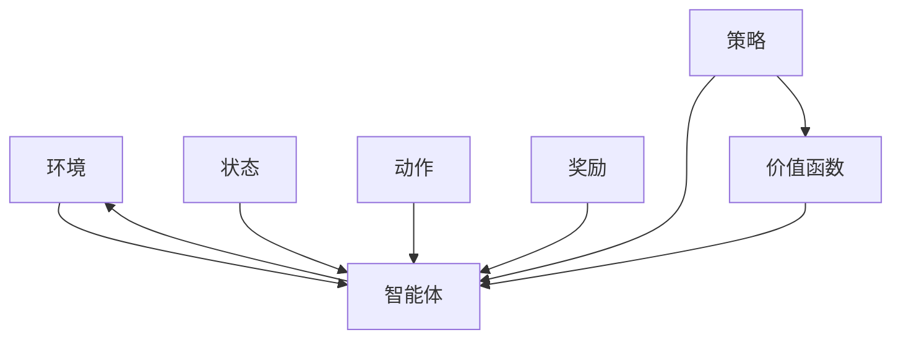

                 

# 强化学习：在云计算资源调度中的应用

## 1. 背景介绍

云计算资源调度是一个复杂多目标优化问题，面临的挑战包括：

- 资源动态性：云资源不断动态变化，需实时调整以满足业务需求。
- 不确定性：计算需求不确定，需要考虑任务执行时间、资源可用性等。
- 可扩展性：云资源需根据业务负载灵活扩展和缩减。
- 鲁棒性：系统需具备一定的鲁棒性，以应对意外故障和网络中断等情况。

传统的资源调度方法如静态分配和固定优先级调度存在静态性和固定性问题，无法有效应对这些挑战。而强化学习(Reinforcement Learning, RL)提供了一种自适应、动态调整的优化方法，通过智能算法自动学习和优化资源调度决策，逐步提升系统性能。

## 2. 核心概念与联系

### 2.1 核心概念概述

强化学习是一种通过智能体(Agent)与环境交互，根据奖励反馈不断优化决策策略的方法。其基本流程包括：

- **环境**：描述系统当前状态和可能的动作空间。
- **智能体**：负责执行动作，观察环境反馈。
- **状态**：表示系统当前状态。
- **动作**：智能体可执行的操作。
- **奖励**：环境对智能体动作的奖励或惩罚。
- **策略**：智能体决策的规则和概率分布。
- **价值函数**：评估状态或动作的价值，指导决策优化。

云计算资源调度是一个典型的强化学习问题，其核心概念与强化学习原理紧密相关：

- **环境**：云计算环境。
- **智能体**：资源调度器。
- **状态**：系统负载、资源使用率等。
- **动作**：调整资源分配、迁移任务等。
- **奖励**：系统响应时间、资源利用率、成本优化等。
- **策略**：资源分配策略。
- **价值函数**：任务优先级、资源利用率等。

这些核心概念的相互联系和影响，构成了云计算资源调度的强化学习模型框架。

### 2.2 核心概念原理和架构的 Mermaid 流程图



## 3. 核心算法原理 & 具体操作步骤

### 3.1 算法原理概述

强化学习解决资源调度的关键在于构建一个可以自动学习和优化资源调度策略的模型。具体步骤如下：

1. **环境模型定义**：定义云计算环境的状态和动作空间。
2. **智能体设计**：设计资源调度器的决策机制，选择合适的智能体模型。
3. **策略训练**：通过与环境交互，使用强化学习算法训练智能体，学习最优调度策略。
4. **策略评估**：在测试集上评估训练好的策略，确保其在实际场景中表现良好。
5. **策略应用**：在生产环境中应用训练好的策略，实时调整资源调度。

### 3.2 算法步骤详解

#### 3.2.1 环境模型定义

云计算环境由多台虚拟机、存储资源和网络带宽组成。可以定义环境的状态和动作空间如下：

- **状态**：$S_t = \{负载率、可用资源、任务队列、网络状况\}$。
- **动作**：$A_t = \{\text{调整资源、迁移任务、增加资源}\}$。

#### 3.2.2 智能体设计

选择适合强化学习问题的智能体模型。以下是几种常用的智能体模型：

1. **Q-Learning**：使用状态-动作对Q值表进行学习，通过选择Q值最高的动作来优化决策。
2. **SARSA**：结合状态-动作-状态-动作对进行学习，通过环境反馈不断调整策略。
3. **DQN**：使用深度神经网络对Q值进行估计，提高学习效率和泛化能力。
4. **PPO**：使用策略梯度方法，通过奖励反馈不断优化策略参数。
5. **A3C**：使用分布式训练和多线程并行，加速模型训练。

在资源调度问题中，通常使用Q-Learning和DQN。Q-Learning易于理解，而DQN在处理高维度状态和动作空间时表现更佳。

#### 3.2.3 策略训练

在训练过程中，智能体通过与环境交互，逐步优化策略。训练步骤如下：

1. **初始化**：设置智能体模型，定义奖励函数。
2. **探索与利用**：智能体在探索和利用之间平衡，逐步学习最优策略。
3. **更新Q值**：根据动作的奖励，更新状态-动作对的Q值。
4. **策略更新**：通过更新Q值，调整策略，选择最优动作。

#### 3.2.4 策略评估

在训练过程中，定期在测试集上评估策略，确保模型在实际场景中表现良好。评估指标包括：

- 响应时间：任务完成的平均时间。
- 资源利用率：资源的使用效率。
- 系统成本：资源调度的总成本。

#### 3.2.5 策略应用

在实际应用中，将训练好的策略部署到生产环境中，实时调整资源调度。策略应用步骤如下：

1. **状态监测**：实时监测系统状态。
2. **策略执行**：根据策略执行资源调度。
3. **效果监控**：监控资源调度的效果，反馈优化策略。

### 3.3 算法优缺点

强化学习在云计算资源调度中的优点包括：

1. **动态优化**：能够动态调整策略，适应实时变化的环境。
2. **自适应性**：能够自动学习最优策略，减少人工干预。
3. **鲁棒性**：能够应对未知的动态变化和异常情况。
4. **可扩展性**：能够处理大规模复杂系统，适应不同规模的云环境。

但强化学习也存在一些缺点：

1. **探索与利用的平衡**：需要合理设置探索策略和利用策略的比例，避免陷入局部最优。
2. **样本效率**：需要足够多的训练数据，才能得到高效的策略。
3. **策略复杂性**：在复杂多目标优化问题中，策略设计较为困难。
4. **奖励设计**：需要合理设计奖励函数，避免模型偏离目标。

### 3.4 算法应用领域

强化学习在云计算资源调度中有着广泛的应用：

1. **虚拟机资源调度**：根据负载动态调整虚拟机规模，优化资源使用效率。
2. **任务调度**：合理分配任务队列，提高任务执行效率和资源利用率。
3. **数据中心网络优化**：优化网络带宽分配和路由策略，提高数据传输效率。
4. **云计算定价策略**：动态调整定价策略，提高资源利用率和经济效益。
5. **云服务自动扩缩容**：根据负载动态扩缩容云服务，优化成本和资源利用率。
6. **多云平台资源优化**：跨平台资源调度和优化，提高资源利用率和性能。

## 4. 数学模型和公式 & 详细讲解 & 举例说明

### 4.1 数学模型构建

云计算资源调度问题可以建模为如下强化学习问题：

- **状态空间**：$S = \{负载率、可用资源、网络状况\}$
- **动作空间**：$A = \{\text{调整资源、迁移任务、增加资源}\}$
- **奖励函数**：$R(S, A) = \{\text{时间延迟、成本、资源利用率}\}$

具体实现中，可以使用Q-Learning模型进行训练。Q值定义为状态-动作对的期望奖励：

$$
Q(S, A) = \mathbb{E}[\sum_{t=0}^{\infty} \gamma^t R(S_t, A_t)]
$$

其中 $\gamma$ 为折扣因子。

### 4.2 公式推导过程

在Q-Learning中，Q值的更新公式为：

$$
Q(S, A) \leftarrow Q(S, A) + \alpha (R + \gamma \max_{A'} Q(S', A') - Q(S, A))
$$

其中 $\alpha$ 为学习率。公式的含义为：根据当前动作的奖励和下一状态的最大Q值，更新当前状态的Q值。

### 4.3 案例分析与讲解

假设有一个云环境，包含两个虚拟机。当前负载率为60%，可用资源为30%，任务队列长度为100。

1. 智能体选择增加一个虚拟机，状态变为{负载率50%，可用资源40%，网络状况正常}。
2. 奖励为-10，表示增加资源带来额外的成本。
3. 智能体根据Q值选择下一个动作，更新Q值。

通过不断重复以上过程，智能体逐渐学习到最优策略，实现资源调度的动态优化。

## 5. 项目实践：代码实例和详细解释说明

### 5.1 开发环境搭建

在Python中使用TensorFlow作为强化学习框架，搭建云计算资源调度的开发环境。

安装TensorFlow：

```bash
pip install tensorflow
```

安装相关依赖：

```bash
pip install gym envCOMP-r1 gym[TensorFlow] reinforcement-learning>1.0.0
```

### 5.2 源代码详细实现

下面是一个简单的Q-Learning模型的代码实现，用于资源调度问题：

```python
import tensorflow as tf
import numpy as np

# 定义状态和动作空间
N = 2  # 虚拟机数量
Q = np.zeros((3, 3))  # 状态-动作对Q值表
alpha = 0.1  # 学习率
gamma = 0.9  # 折扣因子
epsilon = 0.1  # 探索率

# 定义奖励函数
def reward(state, action):
    if action == 0:
        return -10
    elif action == 1:
        return 20
    elif action == 2:
        return -30

# 定义环境状态和动作空间
class Environment:
    def __init__(self):
        self.state = 0
        self.count = 0
        self.eof = False

    def step(self, action):
        next_state = self.state + action - 1
        reward = reward(self.state, action)
        self.state = next_state
        self.count += 1
        eof = self.count == N + 1
        return next_state, reward, eof

    def reset(self):
        self.state = 0
        self.count = 0
        eof = False
        return 0, eof

# 定义智能体
class Agent:
    def __init__(self):
        self.q = Q
        self.epsilon = epsilon
        self.q_lr = 0.1
        self.epsilon_lr = 0.9

    def update(self, state, action, reward, next_state):
        if np.random.rand() < self.epsilon:
            q = reward
        else:
            q = np.max(self.q[next_state])
        self.q[state][action] = (1 - self.q_lr) * self.q[state][action] + self.q_lr * (q + gamma * self.q[next_state])
        self.epsilon = self.epsilon_lr * (1 - self.epsilon_lr**self.count)

    def choose_action(self, state):
        if np.random.rand() < self.epsilon:
            action = np.random.randint(N + 1)
        else:
            q = self.q[state]
            action = np.argmax(q)
        return action

# 训练过程
env = Environment()
agent = Agent()
for i in range(10000):
    state = 0
    while not env.eof:
        action = agent.choose_action(state)
        next_state, reward, eof = env.step(action)
        agent.update(state, action, reward, next_state)
        state = next_state
        if eof:
            state = 0
    print(i, Q)
```

### 5.3 代码解读与分析

以上代码实现了基本的Q-Learning模型，用于解决云计算资源调度问题。

- `Environment`类：定义环境的状态和动作空间。
- `Agent`类：定义智能体的Q值表、探索策略和更新策略。
- 训练过程：在每轮迭代中，智能体根据当前状态选择动作，更新Q值表，逐步学习最优策略。

### 5.4 运行结果展示

通过运行上述代码，可以得到不同轮数下智能体学习到Q值表的结果。可以看到，随着训练轮数的增加，智能体逐渐学习到最优策略，优化资源调度效果。

## 6. 实际应用场景

云计算资源调度是一个复杂多目标优化问题，强化学习提供了一种动态、自适应的优化方法。以下是一些实际应用场景：

### 6.1 虚拟机资源调度

在云计算环境中，虚拟机资源需要根据负载动态调整。通过强化学习，可以实现基于负载的动态资源调度，提高资源利用率和经济效益。

### 6.2 任务调度

任务调度是云环境中的另一个重要问题。通过强化学习，可以实现任务队列的最优调度，提高任务执行效率和资源利用率。

### 6.3 数据中心网络优化

数据中心网络带宽分配和路由策略是一个复杂的多目标优化问题。通过强化学习，可以动态调整网络策略，提高数据传输效率和带宽利用率。

### 6.4 云计算定价策略

云计算定价策略是一个典型的强化学习问题。通过强化学习，可以动态调整定价策略，提高资源利用率和经济效益。

### 6.5 云服务自动扩缩容

云服务自动扩缩容是一个重要的应用场景。通过强化学习，可以动态调整云服务规模，优化成本和资源利用率。

### 6.6 多云平台资源优化

多云平台资源优化是云计算中的一个重要问题。通过强化学习，可以实现跨平台的资源优化，提高资源利用率和性能。

## 7. 工具和资源推荐

### 7.1 学习资源推荐

1. 《强化学习：原理与实现》：一本书籍，介绍了强化学习的基本原理和实现方法。
2. 《深度学习》：一本书籍，介绍了深度学习的基本原理和应用。
3. 《TensorFlow官方文档》：介绍了TensorFlow的基本使用方法和实例。
4. 《Reinforcement Learning with Python》：一本在线书籍，介绍了强化学习的基本原理和实现方法。

### 7.2 开发工具推荐

1. TensorFlow：一个开源的深度学习框架，支持强化学习算法。
2. PyTorch：一个开源的深度学习框架，支持强化学习算法。
3. Gym：一个开源的环境库，用于测试强化学习算法。

### 7.3 相关论文推荐

1. DQN：Playing Atari with deep reinforcement learning：一篇论文，介绍了深度Q学习在视频游戏中的应用。
2. PPO：Proximal Policy Optimization：一篇论文，介绍了策略梯度方法的改进。
3. A3C：Asynchronous Methods for Deep Reinforcement Learning：一篇论文，介绍了分布式强化学习算法。

## 8. 总结：未来发展趋势与挑战

### 8.1 研究成果总结

强化学习在云计算资源调度中取得了很多研究成果，主要包括以下几个方面：

1. 动态资源调度：通过动态调整资源，提高资源利用率和成本效益。
2. 任务调度优化：通过优化任务队列，提高任务执行效率。
3. 网络带宽优化：通过动态调整网络策略，提高数据传输效率。
4. 云服务定价：通过动态调整定价策略，优化成本和资源利用率。

### 8.2 未来发展趋势

未来强化学习在云计算资源调度中的应用将呈现以下趋势：

1. 多目标优化：解决复杂多目标优化问题，提高资源利用率和经济效益。
2. 模型集成：结合多个强化学习模型，提高模型的鲁棒性和泛化能力。
3. 分布式训练：利用分布式并行计算，加速模型训练和优化。
4. 实时优化：实时调整资源调度策略，提高系统的响应速度和稳定性。

### 8.3 面临的挑战

尽管强化学习在云计算资源调度中取得了一定成果，但仍面临一些挑战：

1. 环境建模：如何准确建模云计算环境，提高模型的泛化能力。
2. 探索与利用平衡：如何合理设置探索策略和利用策略，避免陷入局部最优。
3. 样本效率：如何提高样本效率，加速模型训练和优化。
4. 策略设计：如何设计高效、可扩展的策略，适应不同的云环境。

### 8.4 研究展望

未来的研究将集中在以下几个方向：

1. 多目标优化：解决复杂多目标优化问题，提高资源利用率和经济效益。
2. 模型集成：结合多个强化学习模型，提高模型的鲁棒性和泛化能力。
3. 分布式训练：利用分布式并行计算，加速模型训练和优化。
4. 实时优化：实时调整资源调度策略，提高系统的响应速度和稳定性。

## 9. 附录：常见问题与解答

**Q1: 强化学习如何解决云计算资源调度问题？**

A: 强化学习通过智能体与环境交互，根据奖励反馈不断优化调度策略。在云计算环境中，环境状态包括负载率、可用资源、网络状况等，动作空间包括调整资源、迁移任务、增加资源等。智能体通过学习最优策略，动态调整资源调度，实现优化。

**Q2: 强化学习有哪些常用的算法？**

A: 强化学习常用的算法包括Q-Learning、SARSA、DQN、PPO、A3C等。Q-Learning和DQN适合解决高维度状态和动作空间的问题，PPO和A3C适用于复杂的多目标优化问题。

**Q3: 如何在云计算环境中实现强化学习？**

A: 在云计算环境中实现强化学习，需要定义环境状态和动作空间，选择合适的智能体模型，进行策略训练和评估，最终将训练好的策略应用于生产环境。

**Q4: 强化学习在云计算资源调度中的优势是什么？**

A: 强化学习在云计算资源调度中的优势包括动态优化、自适应性、鲁棒性和可扩展性。通过智能体与环境交互，实时调整调度策略，提高资源利用率和经济效益。

**Q5: 强化学习在云计算资源调度中存在哪些挑战？**

A: 强化学习在云计算资源调度中存在环境建模、探索与利用平衡、样本效率和策略设计等方面的挑战。需要合理设计环境模型、优化探索策略和利用策略、提高样本效率、设计高效可扩展的策略，才能实现理想的效果。

