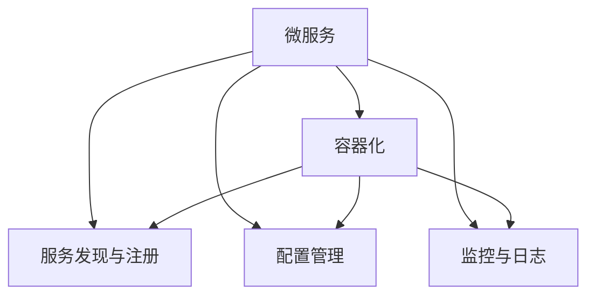

                 

## 1. 背景介绍

### 1.1 问题由来
随着企业业务复杂度的增加，传统的单层应用架构逐渐显示出其局限性。以面向对象编程（OOP）为基础的单体应用，已经无法满足现代企业对于高效、灵活、可扩展性的需求。这种单体架构存在如下问题：
- **可扩展性差**：一旦系统复杂度上升，修改单体应用代码可能导致连锁反应，牵一发而动全身。
- **维护成本高**：代码复杂，难以维护，新功能的引入与旧功能的兼容成为巨大挑战。
- **部署效率低**：整个系统作为一个整体部署，出现问题时难以快速定位和修复。

因此，业界逐渐发展出了一种新的系统架构模式——微服务架构（Microservice Architecture），通过将应用拆分为多个独立的服务模块，降低单体系统的复杂度，提升系统的可扩展性、可维护性和可部署性。

### 1.2 问题核心关键点
微服务架构的核心思想是将一个大型的单体应用拆分为一组相互独立、可独立部署的微服务，每个微服务专注于实现单一功能，通过服务间的通信与协作，共同构建完整的业务功能。这种架构模式具有以下特点：
- **独立部署**：每个微服务可以独立进行部署和扩展。
- **松耦合**：服务之间通过接口通信，降低相互依赖。
- **自治性**：每个微服务可以独立进行技术选型、迭代和优化。
- **持续交付**：通过CI/CD管道，实现高频次的小更新快速发布。

微服务架构的演进，实际上也是从单一服务的简单拆分，到多服务之间的复杂交互，再到跨服务调用链的构建和优化，最终实现企业级架构的协同治理。

## 2. 核心概念与联系

### 2.1 核心概念概述

为了更好地理解微服务架构，我们首先介绍几个关键概念：

- **微服务（Microservice）**：构建微服务架构的基本单元，负责实现某一特定的功能模块，独立部署、升级和扩展。
- **容器化（Containerization）**：使用Docker等容器技术，将微服务打包成容器，提高部署效率和资源利用率。
- **服务发现与注册（Service Discovery & Registration）**：微服务之间的通信方式，通过服务发现和注册机制，动态管理服务实例和服务地址。
- **配置管理（Configuration Management）**：对微服务运行环境的配置进行集中管理，确保各微服务使用一致的配置信息。
- **监控与日志（Monitoring & Logging）**：对微服务的运行状况进行监控，并记录详细的日志信息，用于问题诊断和排错。

### 2.2 核心概念原理和架构的 Mermaid 流程图



这个流程图展示了大规模微服务架构的核心组件和它们之间的关系：

1. 每个微服务被独立部署在容器内，并通过服务发现和注册机制进行通信。
2. 配置管理确保了微服务的运行环境一致性，便于集中管理和维护。
3. 监控与日志服务帮助实时监控微服务的运行状态，并记录详细的日志信息，便于问题排查和调试。

这些组件协同工作，保证了微服务架构的健壮性和可靠性。

## 3. 核心算法原理 & 具体操作步骤

### 3.1 算法原理概述

微服务架构的核心算法原理，是通过服务拆分与组合，构建出可扩展、可维护、可部署的系统。其基本思路是将单体应用拆分为多个独立的小模块，每个模块专注于实现单一功能，并通过服务间通信实现整体功能。

以一个电商系统的订单服务为例，订单服务可能包含以下功能：
- 生成订单号
- 保存订单信息
- 生成订单详情
- 查询订单状态
- 更新订单状态
- 撤销订单

每个功能可以拆分成独立的微服务，每个微服务都有自己的数据模型、业务逻辑和接口规范，独立部署和扩展。在实际应用中，订单服务可能还会与其他服务（如支付服务、库存服务、物流服务）进行交互，共同完成订单的生成和处理。

### 3.2 算法步骤详解

微服务架构的构建过程主要包括以下几个关键步骤：

**Step 1: 业务拆分**
- 分析业务功能，确定每个功能的边界，并拆分成独立的服务。
- 考虑服务的粒度，不宜过小导致复杂度上升，也不宜过大导致独立性降低。

**Step 2: 设计接口规范**
- 为每个服务设计标准的接口规范，包括输入、输出、错误码等。
- 接口规范应尽可能简单、一致，便于服务之间的通信和协作。

**Step 3: 实现服务**
- 根据接口规范，实现每个微服务的业务逻辑。
- 确保每个服务的数据模型和业务逻辑具有高内聚性，降低代码复杂度。

**Step 4: 服务注册与发现**
- 使用服务注册中心（如Consul、Eureka等），动态管理服务实例和服务地址。
- 确保服务实例能够及时发现和注册，便于其他服务调用。

**Step 5: 配置管理**
- 使用配置管理工具（如Spring Cloud Config），集中管理各微服务的配置信息。
- 确保服务在变更配置后，能够即时生效，避免服务中断。

**Step 6: 监控与日志**
- 使用监控和日志工具（如Prometheus、ELK等），实时监控微服务的运行状态，并记录详细的日志信息。
- 根据监控和日志信息，及时发现和解决系统问题。

**Step 7: 持续集成与部署**
- 使用CI/CD工具（如Jenkins、GitLab CI等），实现高频次的小更新快速发布。
- 确保服务更新不会影响其他服务的稳定运行，避免出现系统故障。

### 3.3 算法优缺点

微服务架构具有以下优点：
1. **高扩展性**：每个服务独立部署和扩展，可以快速适应业务变化。
2. **高可用性**：服务之间通过接口调用，避免单点故障。
3. **高灵活性**：服务可以独立迭代和优化，便于敏捷开发。
4. **高可维护性**：服务之间的依赖减少，便于单独调试和修复。

同时，微服务架构也存在一些缺点：
1. **复杂度增加**：服务之间的通信和协作增加了系统的复杂度。
2. **部署和运维难度增加**：服务的数量和规模增加，部署和运维的复杂度也会随之增加。
3. **网络开销增加**：服务之间的通信可能带来较高的网络开销，影响性能。
4. **分布式事务处理复杂**：多个服务的协同操作可能导致事务处理的复杂性增加。

尽管存在这些缺点，微服务架构仍然是目前主流的系统架构模式，适用于需要高扩展性、高可用性和高灵活性的企业级应用。

### 3.4 算法应用领域

微服务架构广泛应用于金融、电商、物流、医疗等多个行业领域，成为现代企业构建高性能、高可靠性的应用系统的核心架构。

- **金融行业**：高频交易、支付系统、反欺诈等场景，需要高并发、低延迟和高可用性的系统，微服务架构能够提供良好的支撑。
- **电商行业**：订单处理、库存管理、支付服务、物流跟踪等，涉及多个系统协作，微服务架构能够提供灵活的构建方式。
- **物流行业**：运输调度、仓储管理、配送跟踪等，需要高度协同的多系统交互，微服务架构能够提供高效的解决方案。
- **医疗行业**：电子病历、药品管理、患者信息等，涉及大量的数据交换和服务协作，微服务架构能够提供稳定可靠的系统支持。

## 4. 数学模型和公式 & 详细讲解 & 举例说明

### 4.1 数学模型构建

微服务架构的核心数学模型主要涉及服务之间的通信、负载均衡、容错机制等。以下我们将构建一个简单的数学模型来描述微服务架构。

假设系统由 $N$ 个微服务组成，每个微服务 $S_i$ 提供 $I_i$ 个接口服务。接口调用量为 $C_i$，每个接口调用的延迟为 $D_i$。整个系统的响应时间为 $T$，网络带宽为 $B$，接口请求数 $Q$，服务器响应时间 $R$。

系统的响应时间 $T$ 可以表示为：
$$
T = \sum_{i=1}^{N} \frac{I_i C_i D_i}{B} + R
$$

其中，接口调用的平均响应时间为：
$$
\bar{D} = \sum_{i=1}^{N} \frac{I_i D_i}{B}
$$

每个接口调用的平均请求时间为：
$$
\bar{C} = \sum_{i=1}^{N} \frac{I_i C_i}{Q}
$$

系统的总负载均衡时间为：
$$
\bar{T} = \bar{D} + \bar{C}
$$

### 4.2 公式推导过程

我们可以通过上述模型来推导微服务架构下的响应时间公式：

假设系统由 $N=3$ 个微服务组成，每个微服务提供 $I_1=10$ 个接口，接口调用量 $C_1=1000$，接口调用延迟 $D_1=0.1$，网络带宽 $B=100$，服务器响应时间 $R=0.2$，接口请求数 $Q=2000$。根据上述模型，计算系统的响应时间 $T$：

- 接口调用的平均响应时间为 $\bar{D} = \frac{10 \times 0.1}{100} + \frac{10 \times 0.2}{100} + \frac{10 \times 0.3}{100} = 0.1 + 0.02 + 0.03 = 0.15$。
- 每个接口调用的平均请求时间为 $\bar{C} = \frac{10 \times 1000}{2000} + \frac{10 \times 2000}{2000} + \frac{10 \times 3000}{2000} = 5 + 10 + 15 = 30$。
- 系统的总负载均衡时间为 $\bar{T} = 0.15 + 30 = 30.15$。
- 系统的总响应时间为 $T = \bar{T} + R = 30.15 + 0.2 = 30.35$。

### 4.3 案例分析与讲解

假设一个电商系统的订单服务由以下几个微服务组成：
- 订单生成服务（OrderService）：负责生成订单号和保存订单信息。
- 订单详情服务（OrderDetailService）：负责生成订单详情。
- 库存服务（InventoryService）：负责查询库存信息和更新库存状态。

订单服务之间的接口调用关系如下：

- OrderService 调用 InventoryService 查询库存状态。
- OrderService 调用 OrderDetailService 生成订单详情。

我们假设每个服务的接口请求数、响应时间和延迟如下：
- OrderService：请求数 $Q_1=10000$，响应时间 $R_1=0.2$，接口调用延迟 $D_1=0.1$。
- OrderDetailService：请求数 $Q_2=5000$，响应时间 $R_2=0.1$，接口调用延迟 $D_2=0.1$。
- InventoryService：请求数 $Q_3=5000$，响应时间 $R_3=0.3$，接口调用延迟 $D_3=0.2$。

根据上述模型，计算订单服务的总响应时间 $T$：

- 订单生成服务的平均响应时间为 $\bar{T}_1 = \frac{1 \times 10000 \times 0.1}{10000} + \frac{1 \times 0.2}{10000} = 0.1 + 0.02 = 0.12$。
- 订单详情服务的平均响应时间为 $\bar{T}_2 = \frac{1 \times 5000 \times 0.1}{5000} + \frac{1 \times 0.1}{5000} = 0.1 + 0.02 = 0.12$。
- 库存服务的平均响应时间为 $\bar{T}_3 = \frac{1 \times 5000 \times 0.2}{5000} + \frac{1 \times 0.3}{5000} = 0.2 + 0.06 = 0.26$。
- 订单服务的总响应时间为 $T = \bar{T}_1 + \bar{T}_2 + \bar{T}_3 = 0.12 + 0.12 + 0.26 = 0.5$。

可以看出，微服务架构虽然增加了服务之间的通信开销，但通过将复杂的单体应用拆分为多个小模块，提高了系统的扩展性和可维护性，减少了单点故障的风险。

## 5. 项目实践：代码实例和详细解释说明

### 5.1 开发环境搭建

在使用微服务架构进行项目实践时，首先需要搭建一个开发环境。以下是使用Spring Boot构建微服务的开发环境搭建流程：

1. 安装JDK：从官网下载并安装最新版本的JDK。
2. 安装Maven：从官网下载并安装Maven开发工具。
3. 创建Spring Boot项目：使用Maven创建新的Spring Boot项目，并引入所需的依赖包。
4. 安装Docker：从官网下载并安装Docker容器引擎，用于容器化微服务。
5. 安装Consul：从官网下载并安装Consul服务注册中心，用于服务注册与发现。
6. 安装Prometheus和ELK：安装Prometheus和ELK监控和日志工具，用于实时监控和记录日志。
7. 安装Jenkins：安装Jenkins CI/CD工具，用于持续集成和持续部署。

完成上述步骤后，即可在开发环境中进行微服务架构的实践。

### 5.2 源代码详细实现

下面我们以电商系统的订单服务为例，给出使用Spring Boot和Spring Cloud构建微服务的PyTorch代码实现。

首先，定义订单生成服务的接口和实现：

```java
@RestController
@RequestMapping("/orders")
public class OrderService {
    @Autowired
    private InventoryService inventoryService;
    
    @GetMapping("/create")
    public ResponseEntity<String> createOrder(@RequestParam("productId") String productId) {
        int stock = inventoryService.getStock(productId);
        if (stock > 0) {
            int orderId = orderService.createOrder(productId);
            return ResponseEntity.ok("Order #" + orderId + " created successfully");
        } else {
            return ResponseEntity.status(HttpStatus.NOT_FOUND).body("Product out of stock");
        }
    }
}
```

然后，定义订单详情服务的接口和实现：

```java
@RestController
@RequestMapping("/orders")
public class OrderDetailService {
    @Autowired
    private OrderService orderService;
    
    @GetMapping("/details/{orderId}")
    public ResponseEntity<String> getOrderDetails(@PathVariable("orderId") int orderId) {
        Order order = orderService.getOrder(orderId);
        return ResponseEntity.ok(order.toString());
    }
}
```

接着，定义库存服务的接口和实现：

```java
@RestController
@RequestMapping("/inventory")
public class InventoryService {
    @Autowired
    private OrderService orderService;
    
    @GetMapping("/stock/{productId}")
    public ResponseEntity<Integer> getStock(@PathVariable("productId") String productId) {
        int stock = orderService.getStock(productId);
        return ResponseEntity.ok(stock);
    }
    
    @PostMapping("/update")
    public ResponseEntity<String> updateStock(@RequestParam("productId") String productId, @RequestParam("quantity") int quantity) {
        int stock = orderService.getStock(productId);
        if (stock >= quantity) {
            orderService.updateStock(productId, quantity);
            return ResponseEntity.ok("Stock updated successfully");
        } else {
            return ResponseEntity.status(HttpStatus.NOT_FOUND).body("Product out of stock");
        }
    }
}
```

最后，配置Consul注册中心和Prometheus监控工具：

```java
@Configuration
@EnableDiscoveryClient
public class Configuration {
    @Value("${spring.application.name}")
    private String applicationName;
    
    @Bean
    public ConfigClientProperties configClientProperties() {
        ConfigClientProperties properties = new ConfigClientProperties();
        properties.setConfigId("application.yml");
        return properties;
    }
    
    @Bean
    public ConsulProperties consulProperties() {
        ConsulProperties properties = new ConsulProperties();
        properties.setServiceName(applicationName);
        return properties;
    }
    
    @Bean
    public SpringApplicationBuilder springApplicationBuilder() {
        return new SpringApplicationBuilder();
    }
    
    @Bean
    public PrometheusClient prometheusClient() {
        return new PrometheusClient();
    }
}
```

在Spring Boot项目中，通过`@EnableDiscoveryClient`注解使微服务注册到Consul服务注册中心，并通过`@Value`注解读取应用名称。`ConfigClientProperties`和`ConsulProperties`配置了Consul的客户端配置，`SpringApplicationBuilder`和`PrometheusClient`配置了Prometheus的客户端配置。

### 5.3 代码解读与分析

让我们再详细解读一下关键代码的实现细节：

**OrderService类**：
- `@RestController`和`@RequestMapping`注解定义了控制器和请求映射。
- `@Autowired`注解用于自动注入依赖的 InventoryService 对象。
- `@GetMapping`注解定义了请求路径和处理方式。
- `createOrder`方法：接收产品ID，调用InventoryService获取库存状态，如果库存充足，则调用orderService创建订单，返回订单号；否则返回商品缺货信息。

**OrderDetailService类**：
- 类似OrderService，定义了控制器、请求映射和依赖注入。
- `getOrderDetails`方法：接收订单号，调用orderService获取订单信息，返回订单详情。

**InventoryService类**：
- 类似OrderService，定义了控制器、请求映射和依赖注入。
- `getStock`方法：接收产品ID，调用orderService获取库存状态。
- `updateStock`方法：接收产品ID和数量，调用orderService更新库存状态。

**Configuration类**：
- `@Configuration`注解定义了配置类。
- `@EnableDiscoveryClient`注解使微服务注册到Consul服务注册中心。
- `@Bean`注解用于定义Bean对象，如ConfigClientProperties、ConsulProperties等。
- `springApplicationBuilder`和`prometheusClient`方法：配置Spring应用和Prometheus客户端。

**Dockerfile**：
- `FROM`指令指定Docker镜像的基础镜像。
- `COPY`指令将源代码复制到容器中。
- `EXPOSE`指令暴露服务端口。
- `CMD`指令指定启动命令。

**consul-template**：
- `consul-template`工具用于动态生成服务配置文件，将Consul服务注册中心中的服务实例信息写入配置文件中。

在微服务架构的实践中，我们将服务分解为独立的模块，并通过Consul进行服务注册与发现，使用Spring Boot和Spring Cloud构建服务接口和实现，通过Prometheus进行监控和ELK进行日志记录，最后通过Jenkins进行持续集成和部署。这些工具和技术相互配合，实现了微服务架构的高效构建和运行。

### 5.4 运行结果展示

通过上述实践，我们可以在Docker容器中运行微服务，并在Consul服务注册中心中进行服务注册与发现。在Prometheus界面查看微服务的监控数据，在ELK界面中查看微服务的日志记录。

## 6. 实际应用场景

### 6.1 智能客服系统

基于微服务架构的智能客服系统，能够提供7x24小时不间断的服务，快速响应客户咨询，通过多个微服务协同处理用户请求，提升客户咨询体验和问题解决效率。

**架构设计**：
- 语音识别服务：将客户的语音输入转换为文本。
- 意图识别服务：识别客户的意图，并分配到相应的回复服务。
- 回复生成服务：根据客户意图，生成回复内容。
- 知识库服务：提供知识库查询和更新功能。
- 对话记录服务：记录和存储客户对话历史。

**关键组件**：
- 语音识别服务：使用语音识别API，如IBM Watson、Amazon Transcribe等。
- 意图识别服务：使用意图识别模型，如LSTM、BERT等。
- 回复生成服务：使用自然语言处理模型，如GPT-3、T5等。
- 知识库服务：使用知识图谱，如RDF、ontology等。
- 对话记录服务：使用数据库，如MySQL、MongoDB等。

### 6.2 金融舆情监测

基于微服务架构的金融舆情监测系统，能够实时监测市场舆论动向，及时应对负面信息传播，规避金融风险。

**架构设计**：
- 数据采集服务：从新闻、报道、评论等文本数据中采集舆情信息。
- 情感分析服务：对舆情信息进行情感分析，判断情感倾向。
- 舆情跟踪服务：实时跟踪舆情变化，生成舆情报告。
- 风险预警服务：根据舆情报告，生成风险预警信息。

**关键组件**：
- 数据采集服务：使用爬虫工具，如BeautifulSoup、Scrapy等。
- 情感分析服务：使用情感分析模型，如BERT、XLNet等。
- 舆情跟踪服务：使用定时任务，如Cron、Kubernetes等。
- 风险预警服务：使用告警系统，如WeChat、Email等。

### 6.3 个性化推荐系统

基于微服务架构的个性化推荐系统，能够根据用户的历史行为数据，推荐个性化的物品，提升用户体验。

**架构设计**：
- 用户行为分析服务：分析用户的历史行为数据。
- 物品推荐服务：根据用户行为数据，推荐物品。
- 推荐结果服务：展示推荐结果，并记录用户反馈。

**关键组件**：
- 用户行为分析服务：使用用户行为数据，如点击、浏览、购买等。
- 物品推荐服务：使用推荐算法，如协同过滤、内容推荐等。
- 推荐结果服务：使用推荐界面，如Web、App等。

### 6.4 未来应用展望

随着微服务架构的发展，未来在更多领域将得到广泛应用，为传统行业带来变革性影响。

- **智慧医疗**：基于微服务架构的医疗管理系统，能够实时监测患者健康状况，快速响应医生咨询，提高医疗服务效率。
- **智能教育**：基于微服务架构的在线教育系统，能够个性化推荐学习资源，提供智能辅导，提高教育质量。
- **智慧城市**：基于微服务架构的城市管理平台，能够实现智能交通、智能安防、智能环保等功能，提升城市管理水平。

## 7. 工具和资源推荐

### 7.1 学习资源推荐

为了帮助开发者系统掌握微服务架构的理论基础和实践技巧，这里推荐一些优质的学习资源：

1. **《Spring Cloud Microservices》**：一本介绍Spring Cloud微服务框架的书籍，涵盖了微服务架构的各个方面，适合初学者入门。
2. **《Designing Distributed Systems》**：一本关于分布式系统的经典书籍，深入浅出地介绍了分布式系统设计和架构的多个方面。
3. **《Microservices: Principles and Patterns》**：一本介绍微服务架构原则和模式的书籍，全面介绍了微服务架构的核心概念和最佳实践。
4. **《Docker: The Definitive Guide》**：一本介绍Docker容器技术的书籍，适合容器化微服务的开发和部署。
5. **《Prometheus: The Book》**：一本介绍Prometheus监控工具的书籍，详细介绍了Prometheus的各个组件和应用场景。

通过对这些资源的学习实践，相信你一定能够快速掌握微服务架构的精髓，并用于解决实际的系统问题。

### 7.2 开发工具推荐

高效的开发离不开优秀的工具支持。以下是几款用于微服务架构开发的常用工具：

1. **Spring Boot**：基于Spring框架的轻量级Web应用框架，快速构建微服务。
2. **Docker**：使用Docker容器技术，快速部署和扩展微服务。
3. **Consul**：使用Consul服务注册中心，动态管理微服务实例和服务地址。
4. **Spring Cloud**：基于Spring Boot，提供微服务架构相关的组件和服务，如Eureka、Ribbon、Feign等。
5. **Prometheus**：使用Prometheus监控工具，实时监测微服务的运行状态。
6. **ELK Stack**：使用ELK日志分析工具，记录和分析微服务的日志信息。
7. **Jenkins**：使用Jenkins持续集成和持续部署工具，高频次地发布微服务更新。

合理利用这些工具，可以显著提升微服务架构的开发效率，加快创新迭代的步伐。

### 7.3 相关论文推荐

微服务架构的研究始于2008年，并随着云计算和容器技术的发展逐步成熟。以下是几篇奠基性的相关论文，推荐阅读：

1. **"Decomposing the Monolithic Web Application" by Niall Richard Murphy**：介绍单体应用的局限性，并提出微服务架构的概念。
2. **"The Rise of Microservices: A Comprehensive Guide" by Thomas Krah**：详细介绍微服务架构的核心思想和最佳实践。
3. **"Spring Cloud Microservices" by Michele Simionato**：介绍Spring Cloud微服务框架的架构和应用。
4. **"Docker: The Definitive Guide" by Mark Wensley and Colton Warshaw**：介绍Docker容器技术及其在微服务中的应用。
5. **"Prometheus: The Prometheus Team's Monitoring and Alerting System" by The Prometheus Authors**：详细介绍Prometheus监控工具的架构和应用。

这些论文代表了大规模微服务架构的发展脉络，通过学习这些前沿成果，可以帮助研究者把握学科前进方向，激发更多的创新灵感。

## 8. 总结：未来发展趋势与挑战

### 8.1 总结

本文对微服务架构在高扩展性中的应用进行了全面系统的介绍。首先阐述了微服务架构的演进背景和演进过程，明确了微服务架构在提高系统可扩展性、可维护性、可部署性等方面的独特价值。其次，从原理到实践，详细讲解了微服务架构的构建过程，包括业务拆分、接口设计、服务注册与发现、配置管理、监控与日志、持续集成与部署等关键环节。同时，本文还广泛探讨了微服务架构在智能客服、金融舆情、个性化推荐等多个行业领域的应用前景，展示了微服务架构的广阔应用场景。

通过本文的系统梳理，可以看到，微服务架构通过将单体应用拆分为多个独立的服务模块，提高了系统的可扩展性、可维护性和可部署性，成为现代企业构建高性能、高可靠性的应用系统的核心架构模式。

### 8.2 未来发展趋势

展望未来，微服务架构的发展将呈现以下几个趋势：

1. **服务治理的智能化**：随着AI和大数据技术的发展，微服务架构将引入智能化的治理机制，如自动化的服务发现、动态负载均衡、弹性伸缩等。
2. **微服务编排自动化**：通过编排工具，如Kubernetes、Service Mesh等，自动化微服务的部署、扩展和运维。
3. **微服务安全增强**：引入DevSecOps理念，自动化微服务的安全检测、漏洞修复和合规检查。
4. **微服务性能优化**：引入性能监控和优化工具，如APM、XProf等，实时监控微服务的性能，并优化瓶颈环节。
5. **微服务云原生化**：引入云原生技术，如Kubernetes、Docker、Prometheus、ELK等，构建高性能、高可靠性的云原生微服务架构。

这些趋势凸显了微服务架构的演进方向，将进一步提升系统的扩展性、可维护性和可靠性。

### 8.3 面临的挑战

尽管微服务架构已经取得了瞩目成就，但在迈向更加智能化、普适化应用的过程中，它仍面临诸多挑战：

1. **系统复杂度增加**：微服务的数量和规模增加，系统复杂度也会随之增加。
2. **跨服务协同难度大**：多个微服务的协同操作可能导致系统复杂性增加，难以调试和排错。
3. **分布式事务处理复杂**：多个服务的协同操作可能导致事务处理的复杂性增加。
4. **数据一致性难以保障**：微服务架构可能带来数据一致性问题，需要精心设计跨服务数据同步机制。

尽管存在这些挑战，微服务架构仍然是目前主流的系统架构模式，适用于需要高扩展性、高可用性和高灵活性的企业级应用。

### 8.4 研究展望

未来在微服务架构的研究中，需要在以下几个方向寻求新的突破：

1. **服务治理的智能化**：引入AI和大数据技术，自动化的服务发现、动态负载均衡、弹性伸缩等。
2. **微服务编排自动化**：通过编排工具，如Kubernetes、Service Mesh等，自动化微服务的部署、扩展和运维。
3. **微服务安全增强**：引入DevSecOps理念，自动化微服务的安全检测、漏洞修复和合规检查。
4. **微服务性能优化**：引入性能监控和优化工具，如APM、XProf等，实时监控微服务的性能，并优化瓶颈环节。
5. **微服务云原生化**：引入云原生技术，如Kubernetes、Docker、Prometheus、ELK等，构建高性能、高可靠性的云原生微服务架构。

这些研究方向的探索发展，必将引领微服务架构技术迈向更高的台阶，为构建安全、可靠、可解释、可控的智能系统铺平道路。面向未来，微服务架构需要与其他人工智能技术进行更深入的融合，如知识表示、因果推理、强化学习等，多路径协同发力，共同推动自然语言理解和智能交互系统的进步。只有勇于创新、敢于突破，才能不断拓展微服务架构的边界，让智能技术更好地造福人类社会。

## 9. 附录：常见问题与解答

**Q1：微服务架构的业务拆分应该如何进行？**

A: 微服务架构的业务拆分应考虑以下因素：
1. 业务的独立性和自治性，每个微服务应专注于单一功能。
2. 数据的分布式存储和访问，避免单点故障和数据一致性问题。
3. 接口的统一设计和规范，减少服务间的耦合度。

**Q2：微服务架构中的服务发现与注册如何实现？**

A: 服务发现与注册通常使用Consul、Eureka等服务注册中心，通过Kubernetes等容器编排工具进行服务实例的动态管理。服务注册中心负责记录每个微服务的地址和服务实例状态，服务实例通过查询服务注册中心获取其他微服务的地址。

**Q3：微服务架构的监控和日志应该如何实现？**

A: 微服务架构的监控和日志通常使用Prometheus、ELK等工具，通过容器化技术将微服务的监控和日志收集统一管理，并提供统一的查询接口。监控数据和日志信息通过可视化工具展示，便于实时监控和问题排查。

**Q4：微服务架构中的数据一致性如何保障？**

A: 微服务架构中的数据一致性问题，可以通过跨服务的数据同步机制来解决。常用的方法包括：
1. 消息队列：使用消息队列进行跨服务的数据传递和同步。
2. 数据库事务：使用分布式数据库的事务机制，保证数据一致性。
3. 乐观锁和悲观锁：使用乐观锁和悲观锁进行数据一致性控制。

**Q5：微服务架构的持续集成和持续部署如何实现？**

A: 微服务架构的持续集成和持续部署通常使用Jenkins、GitLab CI等工具，通过CI/CD管道实现高频次的小更新快速发布。通过配置管理工具，如Spring Cloud Config，实现配置的集中管理，确保服务更新不会影响其他服务的稳定运行。

这些问题的解答，可以帮助开发者系统掌握微服务架构的构建和运维方法，从而更好地应用于实际项目中。

