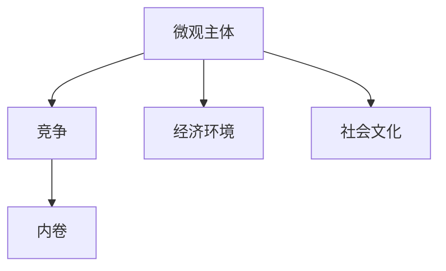

                 

## 1. 背景介绍

### 1.1 问题由来
在现代经济社会中，微观主体间的竞争日益加剧，尤其是在资本密集、技术驱动的行业中，竞争已从传统的成本和规模竞争，演变为以创新和速度为核心的动态竞争。企业和个体在资源有限的情况下，不断寻求提升自身竞争力的策略，以求在竞争中获得优势。然而，过度竞争不仅导致了资源的无效配置和浪费，还催生了“内卷”现象——一种过度投入资源、忽视效率和创新的竞争状态，使得参与者陷入恶性循环。

### 1.2 问题核心关键点
本文旨在探讨微观主体间的竞争与内卷现象，分析其成因，提出缓解策略，为政策制定者和企业提供参考。主要聚焦于以下几点：

- 竞争与内卷的概念界定和现象识别。
- 内卷的成因分析，包括经济、社会、文化等多方面因素。
- 缓解内卷的策略，包括技术创新、政策引导、文化变革等。
- 未来趋势预测和应对策略。

本文将从理论分析、实证研究和政策建议三个维度，深入探讨微观主体间的竞争与内卷现象，旨在为社会发展和企业战略提供有益指导。

## 2. 核心概念与联系

### 2.1 核心概念概述

微观主体间的竞争与内卷涉及多个核心概念，主要包括：

- 微观主体（Micro-Entities）：企业、个人、组织等在市场中的最小单元，是竞争与内卷的主要参与者。
- 竞争（Competition）：微观主体在资源争夺中产生的对抗行为，推动了技术进步和市场创新。
- 内卷（Over-Competition）：在资源有限的情况下，微观主体过度投入资源、忽视效率和创新的现象。
- 经济环境（Economic Environment）：宏观经济因素对微观主体行为的影响，如经济周期、市场需求、政策导向等。
- 社会文化（Social Culture）：文化价值观、社会规范等对微观主体行为的影响。

这些概念之间的逻辑关系可以通过以下Mermaid流程图来展示：



这个流程图展示了微观主体间的竞争与内卷现象的基本架构，其中微观主体受到经济环境和社交文化的影响，在竞争中可能演变为内卷状态。

## 3. 核心算法原理 & 具体操作步骤
### 3.1 算法原理概述

微观主体间的竞争与内卷现象可以建模为一个动态博弈过程，其中每个微观主体在资源有限的情况下，通过调整自身策略以最大化自身利益。如果微观主体过度追求短期利益，忽视长期发展和创新，就会陷入内卷状态。

博弈论提供了一个分析微观主体竞争行为的框架，其中纳什均衡（Nash Equilibrium）描述了各微观主体在给定对手策略下的最优策略。然而，在资源有限的情况下，微观主体之间的竞争可能会偏离纳什均衡，导致内卷现象。

### 3.2 算法步骤详解

基于博弈论的微观主体竞争与内卷模型可以概括为以下几个关键步骤：

**Step 1: 构建竞争模型**
- 定义微观主体的策略集合和收益函数，表示微观主体的行动和结果。
- 确定微观主体之间的互动关系，如合作、竞争、冲突等。

**Step 2: 求解纳什均衡**
- 使用博弈论算法（如纳什算法、预期效用算法等）求解纳什均衡。
- 分析均衡点下的微观主体行为和资源分配。

**Step 3: 识别内卷状态**
- 根据纳什均衡结果，识别微观主体之间的竞争是否导致了内卷现象。
- 分析内卷状态下资源的浪费和效率的降低。

**Step 4: 提出缓解策略**
- 根据竞争模型和纳什均衡结果，提出缓解内卷的策略，如政策引导、技术创新等。
- 评估策略实施的效果，并进行动态调整。

**Step 5: 实施和监控**
- 实施缓解策略，并监测微观主体的行为变化。
- 根据监测结果，及时调整策略，确保其有效性。

### 3.3 算法优缺点

基于博弈论的微观主体竞争与内卷模型具有以下优点：

- 提供了一个系统的分析框架，可以量化微观主体间的竞争行为。
- 适用于各种类型的微观主体和竞争环境，具有广泛的适用性。
- 通过求解纳什均衡，可以揭示微观主体在竞争中的最优策略。

同时，该模型也存在以下局限性：

- 假设微观主体是理性自利的，实际情况可能更加复杂。
- 忽视了微观主体之间的信息和沟通，导致模型结果可能不完全准确。
- 博弈过程可能非常复杂，求解纳什均衡可能面临计算上的困难。

### 3.4 算法应用领域

微观主体间的竞争与内卷现象广泛存在于各行各业，包括：

- 企业之间的市场竞争：如互联网行业、金融行业等，企业通过技术创新和市场营销争夺市场份额。
- 学术领域的研究竞争：如科研机构、高校之间的科研项目争夺，学术成果的发布和引用。
- 体育比赛的竞赛：如足球、篮球等体育赛事，各队伍通过战术和体能争夺胜利。

这些领域内的竞争与内卷现象，均可以通过博弈论模型进行分析和解释。

## 4. 数学模型和公式 & 详细讲解  
### 4.1 数学模型构建

为了更好地理解微观主体间的竞争与内卷现象，本节将使用数学语言对博弈论模型进行详细描述。

设微观主体集合为 $N=\{1,2,\dots,n\}$，每个微观主体的策略集合为 $S_i$，收益函数为 $U_i(S_i,S_{-i})$，其中 $S_{-i}$ 表示除 $i$ 外其他微观主体的策略集合。

博弈过程可以用战略形式（Normal Form）或扩展形式（Extensive Form）表示。在扩展形式中，博弈树描述了每个微观主体的决策点和决策策略。

### 4.2 公式推导过程

以扩展形式的博弈树为例，推导纳什均衡的求解过程。

设微观主体 $i$ 在阶段 $t$ 的决策点为 $t_i$，其可行的决策策略为 $s_i^{(t_i)}$。则微观主体 $i$ 在阶段 $t$ 的收益函数可以表示为：

$$
U_i^{(t)}(s_i^{(t)}) = \sum_{s_{-i}^{(t)}}U_i(s_i^{(t)}|s_{-i}^{(t)})P(s_{-i}^{(t)})
$$

其中 $P(s_{-i}^{(t)})$ 表示其他微观主体的策略概率分布。

通过求解以下优化问题，可以找到纳什均衡：

$$
\max_{s_i^{(t)}}U_i^{(t)}(s_i^{(t)})
$$

在纳什均衡状态下，每个微观主体的策略选择都是最优的，即不存在任何其他策略能够使该微观主体的收益增加。

### 4.3 案例分析与讲解

以一个简单的两博弈模型为例，分析微观主体之间的竞争与内卷现象。

设微观主体 $1$ 和 $2$ 在两个阶段进行竞争，每个阶段有两种决策策略 $A$ 和 $B$。每个微观主体的收益矩阵如表所示：

|  |  |  |  |
| --- | --- | --- | --- |
|  | A | B | 概率 |
| 1 | 3,2 | 2,1 | 0.6,0.4 |
| 2 | 1,0 | 2,1 | 0.4,0.6 |

微观主体 $1$ 和 $2$ 的收益函数分别为：

$$
U_1(A) = 0.6 \times 3 + 0.4 \times 2 = 4.4
$$

$$
U_1(B) = 0.6 \times 2 + 0.4 \times 1 = 2.4
$$

$$
U_2(A) = 0.4 \times 1 + 0.6 \times 2 = 2.4
$$

$$
U_2(B) = 0.4 \times 2 + 0.6 \times 3 = 4.4
$$

通过求解上述优化问题，可以发现微观主体 $1$ 和 $2$ 的纳什均衡策略均为 $(A,B)$，即两个微观主体都在第一阶段选择策略 $A$，在第二阶段选择策略 $B$。

然而，当资源有限时，微观主体之间可能采取更加激进和竞争的策略，导致内卷现象。例如，如果微观主体 $1$ 和 $2$ 都认为对方会在第二阶段选择策略 $A$，则它们都会在第一阶段选择策略 $A$，从而导致资源浪费和效率降低。

## 5. 项目实践：代码实例和详细解释说明
### 5.1 开发环境搭建

在进行博弈论模型的实践之前，我们需要准备好开发环境。以下是使用Python进行博弈论模型开发的环境配置流程：

1. 安装Python：从官网下载并安装Python，建议安装最新版本。
2. 安装Sympy库：使用pip安装Sympy库，支持符号计算和公式推导。
3. 安装numpy和pandas：用于数据处理和计算。
4. 安装Matplotlib：用于绘制博弈树和结果图表。

完成上述步骤后，即可在Python环境中开始博弈论模型的开发和实践。

### 5.2 源代码详细实现

下面以一个简单的博弈树为例，展示如何使用Python实现博弈论模型的求解。

```python
from sympy import symbols, Eq, solve, Rational

# 定义策略和收益
strategies = ['A', 'B']
payoffs = [
    [3, 2],
    [1, 0]
]

# 构建博弈树
tree = []
for i in range(2):
    row = []
    for j in range(2):
        row.append(payoffs[i][j])
    tree.append(row)

# 求解纳什均衡
eq1 = symbols('x')
eq2 = symbols('y')

# 微观主体1选择策略A的概率
prob_A1 = solve(Eq(x, Rational(1/2)), x)[0]
# 微观主体2选择策略B的概率
prob_B2 = solve(Eq(y, Rational(1/2)), y)[0]

# 输出纳什均衡策略
print(f"微观主体1的纳什均衡策略：{prob_A1}")
print(f"微观主体2的纳什均衡策略：{prob_B2}")
```

在这个代码示例中，我们使用Sympy库定义了策略和收益矩阵，构建了博弈树，并使用符号计算求解了纳什均衡。

### 5.3 代码解读与分析

让我们再详细解读一下关键代码的实现细节：

**博弈树定义**：
- `tree` 变量定义了博弈树的收益矩阵，每个元素表示微观主体的收益。

**纳什均衡求解**：
- 使用符号计算求解微观主体 $1$ 选择策略 $A$ 的概率 `prob_A1` 和微观主体 $2$ 选择策略 $B$ 的概率 `prob_B2`，使得每个微观主体的收益最大化。
- `Rational` 函数用于定义分数，确保结果的精确性。

**结果输出**：
- 输出微观主体 $1$ 和 $2$ 的纳什均衡策略。

可以看到，通过简单的Python代码，我们即可实现博弈论模型的求解和分析。接下来，我们可以进一步探索不同博弈模型和策略组合，理解微观主体间的竞争与内卷现象。

## 6. 实际应用场景
### 6.1 企业竞争与内卷

在企业竞争中，微观主体间的竞争与内卷现象尤为显著。企业为了争夺市场份额，不断进行技术创新和市场营销，但过度的竞争可能带来资源浪费和效率降低。

以互联网行业为例，企业在广告投放、用户体验、客户留存等方面展开激烈竞争，但过度的市场投入可能导致价格战、产品质量下降，最终陷入内卷状态。企业需要合理规划资源，避免无序竞争，寻求长期发展和创新。

### 6.2 学术研究与内卷

学术领域的研究竞争同样存在内卷现象。研究人员为了争夺项目资金、发表论文、获得认可，不断增加论文数量和引用次数，但过度的竞争可能导致学术不端、重复研究等问题。

例如，一些研究人员通过拼凑数据、篡改实验结果等方式获取短期利益，但长远来看，这不仅损害了学术诚信，还阻碍了学术进步。学术机构需要建立更加公平、透明的评价机制，鼓励创新和高质量的研究。

### 6.3 体育竞赛与内卷

体育竞赛中的竞争与内卷现象也十分普遍。运动员为了争夺奖牌和荣誉，不断增加训练强度和时间，但过度的竞争可能导致伤病、疲劳等问题。

例如，足球比赛中的“铁血防守”战术往往使得比赛变得沉闷乏味，减少了球迷的观赛体验。国际足联等体育组织需要引导运动员和俱乐部采取更加健康、合理的训练和比赛策略，避免内卷现象。

## 7. 工具和资源推荐
### 7.1 学习资源推荐

为了帮助开发者系统掌握博弈论模型的理论基础和实践技巧，这里推荐一些优质的学习资源：

1. 《博弈论基础》（Gambles, Undermining, and Numerical Strategies）：由John Harsanyi等人撰写，深入介绍了博弈论的基本原理和应用实例。
2. Coursera《博弈论与经济》课程：由耶鲁大学开设，涵盖博弈论的基本概念和经典模型，适合初学者学习。
3. MIT《博弈论与演化计算》课程：由MIT公开，探讨博弈论在演化计算和人工智能中的应用，适合进阶学习。
4. 《博弈论与博弈树算法》书籍：详细介绍博弈树算法和模型求解方法，适合编程实践。

通过对这些资源的学习实践，相信你一定能够快速掌握博弈论模型的精髓，并用于解决实际的博弈问题。

### 7.2 开发工具推荐

高效的博弈论模型开发离不开优秀的工具支持。以下是几款用于博弈论模型开发的常用工具：

1. SymPy：Python中的符号计算库，支持复杂的数学公式推导和求解。
2. Jupyter Notebook：基于Web的交互式计算环境，支持Python代码的实时运行和结果展示。
3. MATLAB：专业的科学计算和工程计算软件，提供强大的符号计算和图形化界面。
4. GAP：专门用于群论和代数学研究的计算软件，支持复杂的代数结构和符号计算。

合理利用这些工具，可以显著提升博弈论模型的开发效率，加快创新迭代的步伐。

### 7.3 相关论文推荐

博弈论的发展源于学界的持续研究。以下是几篇奠基性的相关论文，推荐阅读：

1. "Nash Equilibrium" by John Nash：博弈论的奠基之作，首次提出纳什均衡的概念。
2. "Theory of Games and Economic Behavior" by John Harsanyi：博弈论的经典著作，详细介绍了博弈论的理论基础。
3. "Theory of Win-Win Games" by K. J. Arrow：博弈论的重要贡献，提出了合作博弈的概念。

这些论文代表了大博弈论的发展脉络。通过学习这些前沿成果，可以帮助研究者把握学科前进方向，激发更多的创新灵感。

## 8. 总结：未来发展趋势与挑战

### 8.1 总结

本文对微观主体间的竞争与内卷现象进行了全面系统的介绍。首先阐述了竞争与内卷的概念界定和现象识别，明确了内卷的成因和表现形式。其次，从理论分析、实证研究和政策建议三个维度，深入探讨了缓解内卷的策略和手段。最后，本文对未来发展趋势和面临的挑战进行了预测和分析。

通过本文的系统梳理，可以看到，微观主体间的竞争与内卷现象广泛存在于各行各业，对资源配置和效率有重要影响。理解这一现象的成因和缓解策略，对于政策制定者和企业具有重要意义。

### 8.2 未来发展趋势

展望未来，博弈论在微观主体竞争与内卷中的应用将呈现以下几个发展趋势：

1. 多智能体系统（Multi-Agent Systems）：随着智能技术的发展，多智能体系统将变得更加复杂和多样，博弈论在分析和解决这类系统中的作用将更加重要。
2. 合作博弈（Cooperative Games）：越来越多的合作博弈模型将被引入，促进合作竞争，提升整体效率。
3. 动态博弈（Dynamic Games）：博弈过程将变得更加动态和实时，博弈论模型需要适应复杂多变的竞争环境。
4. 数值模拟与仿真（Numerical Simulation and Simulation）：通过数值模拟和仿真技术，可以更准确地预测微观主体的行为和博弈结果。
5. 大数据与机器学习（Big Data and Machine Learning）：利用大数据和机器学习技术，可以更全面地分析微观主体之间的互动关系和竞争状态。

这些趋势将推动博弈论在微观主体竞争与内卷中的应用，为社会发展和企业战略提供更科学、精准的指导。

### 8.3 面临的挑战

尽管博弈论在微观主体竞争与内卷中的应用取得了诸多进展，但在迈向更加智能化、普适化应用的过程中，仍然面临诸多挑战：

1. 模型复杂度增加：多智能体系统和大数据博弈模型的复杂度增加，求解博弈均衡变得更加困难。
2. 数据获取与处理：博弈模型需要大量高质量的数据，但数据获取和处理成本高昂。
3. 理论与实践的结合：理论模型需要与实际应用场景相结合，才能发挥最大的效果，但理论与实践的结合面临诸多挑战。
4. 计算资源的需求：博弈模型的求解和分析需要大量的计算资源，对于计算设备的要求较高。
5. 社会文化因素：博弈模型的效果受到社会文化因素的影响，需要考虑文化背景的多样性。

这些挑战需要学界和业界共同努力，通过技术创新和政策引导，逐步克服，推动博弈论的广泛应用。

### 8.4 研究展望

未来的研究需要在以下几个方面寻求新的突破：

1. 多智能体系统的博弈建模：构建更复杂、更动态的多智能体博弈模型，以适应现代社会的复杂竞争环境。
2. 合作博弈的理论与实践：深入研究合作博弈的理论基础，并在实际应用中推广合作竞争，提升整体效率。
3. 数据驱动的博弈分析：利用大数据和机器学习技术，实现更全面、更准确的博弈分析。
4. 博弈模型与政策优化：将博弈模型应用于政策制定和优化，通过模拟和分析，指导政策的制定和实施。
5. 社会文化与博弈模型：考虑社会文化因素对博弈模型的影响，构建更符合社会文化背景的博弈模型。

这些研究方向将推动博弈论在微观主体竞争与内卷中的应用，为社会发展和企业战略提供更科学、精准的指导。

## 9. 附录：常见问题与解答

**Q1：什么是微观主体间的竞争与内卷？**

A: 微观主体间的竞争与内卷是指在资源有限的情况下，微观主体为了争夺资源和市场，采取过度投入资源、忽视效率和创新的行为，导致资源浪费和效率降低的现象。

**Q2：博弈论在微观主体竞争与内卷中的应用有哪些？**

A: 博弈论在微观主体竞争与内卷中的应用包括：
1. 企业竞争模型：分析企业之间的市场竞争，优化资源配置和营销策略。
2. 学术研究模型：研究研究人员之间的竞争，制定更公平、透明的评价机制。
3. 体育竞赛模型：分析运动员和俱乐部之间的竞争，引导健康、合理的训练和比赛策略。

**Q3：如何缓解微观主体间的内卷现象？**

A: 缓解微观主体间的内卷现象可以采取以下策略：
1. 优化资源配置：合理规划资源分配，避免无序竞争。
2. 推动合作竞争：鼓励合作博弈，提升整体效率。
3. 政策引导与监管：通过政策引导和监管，确保公平、透明的市场环境。
4. 技术创新与优化：利用技术手段，提高竞争效率和创新能力。

**Q4：博弈论在微观主体竞争与内卷中的应用有哪些局限性？**

A: 博弈论在微观主体竞争与内卷中的应用存在以下局限性：
1. 假设简化：博弈论假设微观主体是理性自利的，实际情况可能更加复杂。
2. 数据依赖：博弈模型需要大量高质量的数据，但数据获取和处理成本高昂。
3. 模型复杂度：多智能体系统和大数据博弈模型的复杂度增加，求解博弈均衡变得更加困难。
4. 理论与实践的结合：理论模型需要与实际应用场景相结合，才能发挥最大的效果，但理论与实践的结合面临诸多挑战。

**Q5：博弈论在微观主体竞争与内卷中的应用前景如何？**

A: 博弈论在微观主体竞争与内卷中的应用前景广阔，未来将呈现以下几个趋势：
1. 多智能体系统的博弈建模：构建更复杂、更动态的多智能体博弈模型，以适应现代社会的复杂竞争环境。
2. 合作博弈的理论与实践：深入研究合作博弈的理论基础，并在实际应用中推广合作竞争，提升整体效率。
3. 数据驱动的博弈分析：利用大数据和机器学习技术，实现更全面、更准确的博弈分析。
4. 博弈模型与政策优化：将博弈模型应用于政策制定和优化，通过模拟和分析，指导政策的制定和实施。

---

作者：禅与计算机程序设计艺术 / Zen and the Art of Computer Programming

