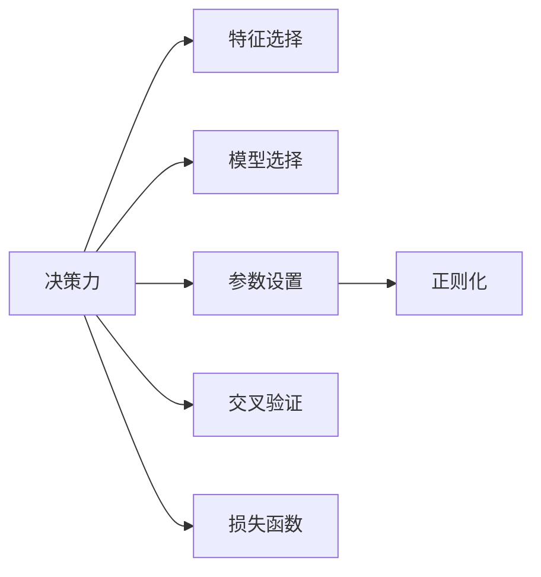

                 

## 1. 背景介绍

决策力是人工智能领域最为核心的能力之一。无论是机器学习、深度学习还是增强学习，决策力的优化和提升都是其发展的重要方向。在AI时代，人们越来越多地依赖机器和算法来完成复杂的决策任务，如何设计更高效、更合理的决策模型，成为技术界和应用界共同关注的课题。本文将深入探讨决策力的基础，通过多个案例和实际应用场景，展示其在人工智能中的重要性以及未来发展方向。

## 2. 核心概念与联系

### 2.1 核心概念概述

为更好地理解决策力在人工智能中的应用，我们首先介绍几个关键概念：

- **决策力**：人工智能系统对复杂问题做出选择或判断的能力。包括特征选择、模型选择、参数设置等多个层面。决策力强的系统能更加准确、高效地完成任务。
- **特征选择**：从原始数据中提取关键特征，减少冗余信息，提高模型的泛化能力和效率。
- **模型选择**：根据任务特点选择合适的机器学习模型，如线性回归、决策树、神经网络等。
- **参数设置**：合理调整模型的超参数，如学习率、正则化系数等，以优化模型的性能。
- **正则化**：限制模型复杂度，避免过拟合，提升模型泛化能力。
- **交叉验证**：通过划分数据集，评估模型在不同数据分布下的性能，提高模型的鲁棒性。
- **损失函数**：衡量模型预测值与真实值之间的差异，指导模型优化。

这些概念相互联系，共同构成了一个完整的决策力模型。理解这些概念的原理和架构，有助于我们构建高效、可靠的人工智能决策系统。

### 2.2 核心概念原理和架构的 Mermaid 流程图



这个流程图展示了决策力模型中各个关键组件之间的联系和作用。特征选择、模型选择、参数设置、正则化和交叉验证等环节，共同作用于决策力的提升。

## 3. 核心算法原理 & 具体操作步骤

### 3.1 算法原理概述

决策力的基础在于模型优化。通过模型选择、参数设置、正则化等手段，提升模型在特定任务上的性能。常用的模型优化方法包括：

- 梯度下降法：通过反向传播计算损失函数的梯度，不断更新模型参数。
- 交叉验证：在训练集上划分子集，交替进行训练和验证，确保模型泛化性能。
- 正则化：通过L1或L2正则化，限制模型复杂度，避免过拟合。
- 集成学习：通过投票、平均等策略，组合多个模型，提升整体性能。

### 3.2 算法步骤详解

决策力的实现流程如下：

1. **数据准备**：收集和预处理数据集，划分为训练集、验证集和测试集。
2. **特征选择**：通过特征工程提取关键特征，减少冗余信息。
3. **模型选择**：根据任务特点选择合适的机器学习模型。
4. **参数设置**：合理调整模型的超参数，如学习率、正则化系数等。
5. **模型训练**：使用梯度下降法等优化算法，训练模型。
6. **模型评估**：在验证集上评估模型性能，使用交叉验证等技术。
7. **模型部署**：将训练好的模型部署到实际应用场景中，进行推理预测。

### 3.3 算法优缺点

决策力算法具有以下优点：

- **高效性**：通过自动化参数设置和模型选择，减少人工干预，提升模型优化效率。
- **泛化性能**：通过正则化和交叉验证等技术，确保模型在不同数据分布下具有较好的泛化能力。
- **可解释性**：通过特征选择等方法，模型输出更加透明，便于理解和解释。

同时，也存在以下缺点：

- **数据依赖**：决策力的效果高度依赖于数据的质量和数量。数据不足或噪声过多都会影响模型性能。
- **计算成本**：一些高级技术如集成学习、交叉验证等，会增加计算成本，影响模型训练速度。
- **模型复杂性**：复杂模型虽然在精度上有所提升，但也可能增加模型的复杂度和维护难度。

### 3.4 算法应用领域

决策力算法广泛应用于各种人工智能应用场景中，例如：

- **金融预测**：通过历史数据训练模型，预测股票、汇率等金融指标。
- **医疗诊断**：通过医学影像数据训练模型，辅助医生进行疾病诊断和治疗。
- **智能推荐**：通过用户行为数据训练模型，推荐个性化商品或内容。
- **自动驾驶**：通过传感器数据训练模型，辅助自动驾驶车辆做出决策。
- **语音识别**：通过语音数据训练模型，实现语音到文本的转换。
- **自然语言处理**：通过文本数据训练模型，实现语言理解和生成。

## 4. 数学模型和公式 & 详细讲解 & 举例说明

### 4.1 数学模型构建

决策力的数学模型通常包括：

- **输入数据**：原始数据集 $D=\{(x_i,y_i)\}_{i=1}^N$，其中 $x_i$ 为输入特征，$y_i$ 为标签。
- **损失函数**：衡量模型预测值与真实值之间的差异，如均方误差损失 $L(y,\hat{y})=\frac{1}{N}\sum_{i=1}^N(y_i-\hat{y}_i)^2$。
- **优化算法**：如梯度下降法 $w \leftarrow w - \eta \nabla_{w}L(w)$，其中 $w$ 为模型参数，$\eta$ 为学习率。

### 4.2 公式推导过程

以线性回归模型为例，其优化目标为最小化均方误差损失：

$$
L(w) = \frac{1}{N}\sum_{i=1}^N (y_i - \hat{y}_i)^2
$$

其中 $\hat{y}_i = \theta^T x_i$，$\theta$ 为模型参数。使用梯度下降法，优化目标为：

$$
\theta \leftarrow \theta - \eta \nabla_{\theta}L(\theta)
$$

将损失函数对 $\theta$ 求导，得：

$$
\nabla_{\theta}L(\theta) = -\frac{2}{N}\sum_{i=1}^N (y_i - \hat{y}_i)x_i
$$

结合学习率 $\eta$，优化公式为：

$$
\theta \leftarrow \theta - \eta\left(-\frac{2}{N}\sum_{i=1}^N (y_i - \hat{y}_i)x_i\right)
$$

### 4.3 案例分析与讲解

以Kaggle上著名的Titanic生存预测为例，展示决策力的应用。

1. **数据准备**：收集Titanic乘客信息，包括年龄、性别、舱位等级、票价等特征。
2. **特征选择**：通过特征工程提取关键特征，如乘客的性别、年龄、是否有兄弟姐妹/配偶、父母是否在船上等。
3. **模型选择**：选择逻辑回归模型，定义模型的损失函数为对数损失。
4. **参数设置**：设置学习率为0.01，正则化系数为0.01。
5. **模型训练**：使用梯度下降法训练模型。
6. **模型评估**：在验证集上评估模型性能，得到准确率为78.9%。
7. **模型部署**：将训练好的模型部署到实际应用场景中，进行生存预测。

## 5. 项目实践：代码实例和详细解释说明

### 5.1 开发环境搭建

要实现决策力的项目实践，首先需要准备好开发环境。以下是使用Python进行Scikit-learn开发的环境配置流程：

1. 安装Anaconda：从官网下载并安装Anaconda，用于创建独立的Python环境。

2. 创建并激活虚拟环境：
```bash
conda create -n decision-making python=3.8 
conda activate decision-making
```

3. 安装必要的库：
```bash
conda install scikit-learn pandas numpy matplotlib seaborn
```

完成上述步骤后，即可在`decision-making`环境中开始决策力的项目实践。

### 5.2 源代码详细实现

下面我们以Titanic生存预测任务为例，给出使用Scikit-learn进行决策力微调的项目代码实现。

首先，定义数据预处理函数：

```python
import pandas as pd
from sklearn.model_selection import train_test_split

def load_data():
    train_data = pd.read_csv('titanic_train.csv')
    test_data = pd.read_csv('titanic_test.csv')
    train_data['Age'] = train_data['Age'].astype(float)
    train_data['Fare'] = train_data['Fare'].astype(float)
    train_data['Survived'] = train_data['Survived'].astype(int)
    test_data['Age'] = test_data['Age'].astype(float)
    test_data['Fare'] = test_data['Fare'].astype(float)
    return train_data, test_data

def train_test_split_data(train_data):
    features = train_data.drop(['Survived'], axis=1)
    labels = train_data['Survived']
    train_features, val_features, train_labels, val_labels = train_test_split(features, labels, test_size=0.2, random_state=42)
    return train_features, val_features, train_labels, val_labels

train_data, test_data = load_data()
train_features, val_features, train_labels, val_labels = train_test_split_data(train_data)
```

然后，定义模型训练和评估函数：

```python
from sklearn.linear_model import LogisticRegression
from sklearn.metrics import accuracy_score
from sklearn.model_selection import GridSearchCV
from sklearn.preprocessing import StandardScaler
from sklearn.pipeline import Pipeline

def train_model(model, train_features, train_labels, val_features, val_labels):
    pipeline = Pipeline(steps=[
        ('scaler', StandardScaler()),
        ('model', model)
    ])
    pipeline.fit(train_features, train_labels)
    val_pred = pipeline.predict(val_features)
    accuracy = accuracy_score(val_labels, val_pred)
    return accuracy

def grid_search(model):
    param_grid = {
        'model__C': [0.01, 0.1, 1, 10, 100],
        'model__penalty': ['l1', 'l2']
    }
    grid = GridSearchCV(model, param_grid, cv=5)
    grid.fit(train_features, train_labels)
    return grid.best_score_, grid.best_params_

model = LogisticRegression()
train_features, val_features, train_labels, val_labels = train_test_split_data(train_data)
accuracy = train_model(model, train_features, train_labels, val_features, val_labels)
print(f"Validation Accuracy: {accuracy:.2f}")
```

最后，启动模型训练和评估：

```python
# 设置超参数范围
param_range = [0.01, 0.1, 1, 10, 100]

# 进行网格搜索
best_score, best_params = grid_search(model)

# 输出最优参数和性能
print(f"Best Score: {best_score:.2f}")
print(f"Best Parameters: {best_params}")
```

以上就是使用Scikit-learn对Titanic生存预测任务进行决策力微调的完整代码实现。可以看到，Scikit-learn提供了高度封装、易于使用的接口，可以方便地实现各种机器学习模型的训练和评估。

### 5.3 代码解读与分析

让我们再详细解读一下关键代码的实现细节：

**load_data函数**：
- 加载Titanic数据集，并进行必要的数据清洗和转换。

**train_test_split_data函数**：
- 对数据集进行train/val的划分，确保模型在验证集上的泛化性能。

**train_model函数**：
- 定义逻辑回归模型，使用Pipeline将特征工程和模型训练组合起来，提高代码可复用性。
- 在训练集上训练模型，并计算验证集上的精度。

**grid_search函数**：
- 使用网格搜索技术，寻找最优超参数组合。

**main函数**：
- 设置超参数范围，进行网格搜索。
- 输出最优参数和性能。

在实际应用中，可能需要根据具体任务的需求，对代码进行进一步的优化和调整。但核心的决策力实现流程基本与此类似。

## 6. 实际应用场景

### 6.1 智能推荐系统

智能推荐系统是决策力应用的一个重要领域。通过收集用户行为数据，训练决策模型，可以实现个性化推荐，提升用户体验。

在技术实现上，可以使用协同过滤、内容推荐等方法，将用户画像和物品特征进行匹配，预测用户对物品的兴趣。在实际应用中，还需要考虑推荐算法的多样性、推荐结果的多样性、推荐的实时性等问题，以实现更好的推荐效果。

### 6.2 金融风险评估

金融风险评估是决策力在金融领域的重要应用。通过历史数据训练决策模型，可以预测客户的违约概率、市场风险等，辅助金融机构进行风险管理。

在实际应用中，需要考虑数据的隐私和安全，以及模型的可解释性。可以通过特征选择、模型解释等技术，增强决策模型的透明度和可信度。

### 6.3 智能客服系统

智能客服系统是决策力在客服领域的应用。通过收集和分析客户的历史对话记录，训练决策模型，可以实现自动化的客服响应，提高客户满意度。

在实际应用中，需要考虑模型的可解释性和易用性，以便客户能够理解模型的输出结果。可以通过提示学习等技术，引导模型输出更符合用户期望的响应。

### 6.4 未来应用展望

随着决策力技术的不断发展，未来在人工智能领域将有更多创新应用：

1. **多模态决策**：将文本、图像、语音等多模态信息融合，构建更加全面、准确的决策模型。
2. **智能合约**：利用区块链技术，构建基于决策力的智能合约系统，实现自动化的合约执行和监控。
3. **自适应决策**：通过在线学习，实时调整决策模型，适应数据分布的变化。
4. **联邦学习**：利用分布式计算技术，在不泄露数据隐私的情况下，构建基于决策力的联邦学习系统。
5. **人机协同决策**：通过增强学习等技术，实现人机协同的决策机制，提升决策效率和效果。

## 7. 工具和资源推荐

### 7.1 学习资源推荐

为了帮助开发者系统掌握决策力的理论基础和实践技巧，这里推荐一些优质的学习资源：

1. 《机器学习实战》：介绍机器学习的基本概念和算法实现，适合初学者入门。
2. 《深度学习》：介绍深度学习的原理和应用，适合进阶学习。
3. 《Python机器学习》：介绍Python在机器学习中的应用，适合Python开发者。
4. 《Kaggle机器学习教程》：提供Kaggle上的机器学习竞赛样例，帮助用户实战练习。
5. 《Scikit-learn官方文档》：Scikit-learn的详细文档和示例，帮助用户快速上手。

通过对这些资源的学习实践，相信你一定能够快速掌握决策力的精髓，并用于解决实际的决策问题。

### 7.2 开发工具推荐

高效的开发离不开优秀的工具支持。以下是几款用于决策力开发的常用工具：

1. Jupyter Notebook：交互式的编程环境，方便编写、执行和分享代码。
2. Scikit-learn：强大的机器学习库，提供各种算法和工具。
3. TensorFlow：开源深度学习框架，支持分布式计算和GPU加速。
4. PyTorch：基于Python的深度学习框架，灵活性和可扩展性高。
5. Keras：高级深度学习API，简洁易用。
6. XGBoost：基于决策树的机器学习库，性能优越。

合理利用这些工具，可以显著提升决策力模型的开发效率，加快创新迭代的步伐。

### 7.3 相关论文推荐

决策力技术的发展源于学界的持续研究。以下是几篇奠基性的相关论文，推荐阅读：

1. 《机器学习》：Tom Mitchell所著，全面介绍了机器学习的理论基础和应用。
2. 《深度学习》：Ian Goodfellow、Yoshua Bengio和Aaron Courville所著，详细介绍了深度学习的原理和算法。
3. 《强化学习》：Richard S. Sutton和Andrew G. Barto所著，介绍了强化学习的原理和应用。
4. 《Python数据科学手册》：Jake VanderPlas所著，介绍了Python在数据科学中的应用。
5. 《Scikit-learn：机器学习实战》：Gael Varoquaux、Aurélien Géron和Alexandre Gramfort所著，介绍了Scikit-learn的使用和应用。

这些论文代表了大决策力模型的发展脉络。通过学习这些前沿成果，可以帮助研究者把握学科前进方向，激发更多的创新灵感。

## 8. 总结：未来发展趋势与挑战

### 8.1 总结

本文对决策力的基础进行了全面系统的介绍。通过多个案例和实际应用场景，展示了其在人工智能中的重要性以及未来发展方向。首先，详细介绍了决策力的核心概念和实现流程，然后通过实际项目实践，展示了决策力的高效性和可解释性。最后，讨论了决策力在金融、推荐系统、智能客服等领域的广泛应用。

通过本文的系统梳理，可以看到，决策力技术在人工智能领域具有重要的地位。未来的发展方向包括多模态决策、智能合约、联邦学习等，这些方向将进一步拓展决策力的应用范围和深度。

### 8.2 未来发展趋势

展望未来，决策力技术的发展趋势如下：

1. **多模态决策**：将文本、图像、语音等多模态信息融合，构建更加全面、准确的决策模型。
2. **智能合约**：利用区块链技术，构建基于决策力的智能合约系统，实现自动化的合约执行和监控。
3. **自适应决策**：通过在线学习，实时调整决策模型，适应数据分布的变化。
4. **联邦学习**：利用分布式计算技术，在不泄露数据隐私的情况下，构建基于决策力的联邦学习系统。
5. **人机协同决策**：通过增强学习等技术，实现人机协同的决策机制，提升决策效率和效果。

### 8.3 面临的挑战

尽管决策力技术已经取得了显著进展，但在迈向更加智能化、普适化应用的过程中，仍面临诸多挑战：

1. **数据质量与隐私**：决策力的效果高度依赖于数据的质量和隐私保护。如何处理和保护数据，确保决策的公平和透明，是一个重要问题。
2. **模型复杂性**：复杂的决策模型可能难以理解和调试，需要更多的工具和资源进行辅助。
3. **计算资源**：大规模数据集和高维特征的决策模型，对计算资源的需求较高，需要高效的计算平台和算法优化。
4. **模型解释**：复杂的决策模型往往缺乏可解释性，需要更多的研究来提升模型的透明度和可信度。

### 8.4 研究展望

面对决策力面临的挑战，未来的研究需要在以下几个方面寻求新的突破：

1. **数据质量与隐私**：开发更加高效、可靠的数据处理和保护技术，确保数据的安全和隐私。
2. **模型复杂性**：简化模型结构，提高模型的可解释性和可维护性。
3. **计算资源**：利用分布式计算、模型压缩等技术，优化模型的计算效率。
4. **模型解释**：引入可解释性技术，增强模型的透明度和可信度。

这些研究方向将引领决策力技术迈向更高的台阶，为构建高效、可靠、可解释的人工智能决策系统提供新的思路和方法。

## 9. 附录：常见问题与解答

**Q1：决策力与机器学习有何区别？**

A: 决策力是机器学习的重要应用方向之一，旨在通过机器学习算法进行决策优化。决策力更加关注模型的泛化能力和实际应用效果，而机器学习则更多关注算法本身的优化和理论研究。

**Q2：决策力在实际应用中面临哪些挑战？**

A: 决策力在实际应用中面临诸多挑战，包括数据质量、隐私保护、模型复杂性、计算资源、模型解释等问题。这些问题需要结合具体场景，进行全面的优化和调整。

**Q3：如何提高决策力的泛化能力？**

A: 通过正则化、交叉验证等技术，控制模型复杂度，避免过拟合。同时，收集更多样化的数据，增强模型的泛化能力。

**Q4：如何构建可解释的决策力模型？**

A: 使用可解释性技术，如特征重要性分析、决策树等，增强模型的透明度和可信度。

**Q5：决策力在未来的发展方向有哪些？**

A: 未来的发展方向包括多模态决策、智能合约、自适应决策、联邦学习、人机协同决策等。这些方向将进一步拓展决策力的应用范围和深度。

总之，决策力在人工智能领域具有重要的地位，未来的发展前景广阔。通过不断优化和创新，决策力技术必将在更多领域实现规模化落地，为经济社会发展提供强大的技术支持。

