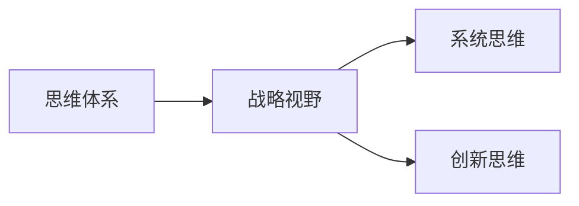

                 

## 1. 背景介绍

在当今快速变化的商业环境中，管理者需要具备宽广的视野、敏锐的洞察力以及前瞻性的战略规划能力。这些素质不仅影响公司的运营效率，更决定了公司能否在竞争中脱颖而出。然而，很多管理者面临决策困难、战略规划不当等问题，究其根本，是因为他们的思维体系尚未经过系统化的训练和提升。本文将探讨思维体系对管理者战略视野的影响，并提出一些策略来帮助管理者提升战略思考能力。

## 2. 核心概念与联系

### 2.1 核心概念概述

#### 2.1.1 思维体系
思维体系是指个体在处理信息、做出决策时的逻辑框架和心理模型。它由一系列假设、概念、规则组成，是人们进行认知和行为的基础。有效的思维体系能够帮助个体识别问题、分析数据、构建假设，从而进行合理决策。

#### 2.1.2 战略视野
战略视野是指管理者在观察行业动态、市场趋势、技术变革等方面时所表现出的全局观和长远思考能力。具备战略视野的管理者能够把握行业发展方向，制定有效策略，确保公司长期稳定发展。

#### 2.1.3 系统思维
系统思维是指将问题视为一个整体，考虑其各个部分之间的相互关系和依赖性。系统思维强调从宏观角度理解和分析问题，能够帮助管理者避免陷入局部视角，做出更为全面的决策。

#### 2.1.4 创新思维
创新思维强调打破常规，提出新的想法和方法。创新思维能够帮助管理者识别新的商业机会，应对市场变化，促进公司不断创新和进步。

### 2.2 核心概念原理和架构的 Mermaid 流程图



## 3. 核心算法原理 & 具体操作步骤

### 3.1 算法原理概述

管理者战略视野的提升，本质上是其思维体系的系统化和优化过程。这一过程包括：

1. **明确问题**：从全局视角识别公司面临的核心问题。
2. **数据收集**：收集和整理与问题相关的数据和信息。
3. **分析与解释**：运用逻辑推理和数据分析工具，对数据进行解释和分析。
4. **制定策略**：基于分析结果，制定长期发展策略。

### 3.2 算法步骤详解

#### 3.2.1 步骤一：明确问题
管理者应首先识别公司面临的核心问题，如市场份额下滑、创新能力不足等。这一过程需要管理者具备敏锐的洞察力和全局观。

#### 3.2.2 步骤二：数据收集
管理者需要收集与问题相关的数据和信息，如市场调研报告、竞争对手动向、客户反馈等。这一步骤是决策的基础，需要管理者具备系统性和全面性。

#### 3.2.3 步骤三：分析与解释
管理者运用数据分析和逻辑推理工具，对收集的数据进行分析解释。这一步骤要求管理者具备科学性和客观性。

#### 3.2.4 步骤四：制定策略
基于分析结果，管理者制定长期发展策略。这一步骤需要管理者具备创造性和前瞻性。

### 3.3 算法优缺点

#### 3.3.1 优点
1. **系统性**：系统思维能够帮助管理者全面理解问题，避免局部视角。
2. **客观性**：数据分析工具能够提供客观证据，减少主观偏见。
3. **前瞻性**：创新思维能够帮助管理者识别新的商业机会，适应市场变化。

#### 3.3.2 缺点
1. **复杂性**：需要耗费大量时间和资源进行数据收集和分析。
2. **不确定性**：数据分析结果可能存在误差，影响决策准确性。
3. **资源消耗**：需要投入大量人力和物资资源。

### 3.4 算法应用领域

管理者思维体系的提升不仅适用于企业的战略规划，也广泛应用于政府、非营利组织等各个领域。例如：

- **政府决策**：政府部门在制定政策时，需要考虑全局和长远，系统思维和创新思维至关重要。
- **非营利组织**：非营利组织在项目管理和资源分配时，需要具备全局观和前瞻性。

## 4. 数学模型和公式 & 详细讲解 & 举例说明

### 4.1 数学模型构建

管理者战略视野的提升可以通过构建以下数学模型来实现：

1. **问题识别模型**：用于识别公司面临的核心问题。可以使用分类树模型（Classification Tree）进行分析。
2. **数据收集模型**：用于收集与问题相关的数据。可以使用数据抽取模型（Data Extraction Model）进行自动数据收集。
3. **数据分析模型**：用于分析解释数据。可以使用回归模型（Regression Model）和聚类模型（Clustering Model）进行数据分析。
4. **策略制定模型**：用于制定长期发展策略。可以使用优化模型（Optimization Model）进行策略制定。

### 4.2 公式推导过程

#### 4.2.1 问题识别模型
假设公司面临的问题为 $P$，有以下特征 $X_1, X_2, ..., X_n$。

$$
P = f(X_1, X_2, ..., X_n)
$$

其中 $f$ 为分类函数，可以采用决策树（Decision Tree）或随机森林（Random Forest）等算法进行构建。

#### 4.2.2 数据收集模型
假设需要收集的数据量为 $D$，有以下特征 $X_1, X_2, ..., X_n$。

$$
D = g(X_1, X_2, ..., X_n)
$$

其中 $g$ 为数据抽取函数，可以采用自然语言处理（NLP）和数据挖掘（Data Mining）等技术进行构建。

#### 4.2.3 数据分析模型
假设收集的数据为 $D$，有 $k$ 个特征 $X_1, X_2, ..., X_k$。

$$
A = h(D, X_1, X_2, ..., X_k)
$$

其中 $h$ 为分析函数，可以采用回归模型或聚类模型进行构建。

#### 4.2.4 策略制定模型
假设制定的策略为 $S$，有以下特征 $X_1, X_2, ..., X_n$。

$$
S = i(X_1, X_2, ..., X_n)
$$

其中 $i$ 为优化函数，可以采用线性规划（Linear Programming）或整数规划（Integer Programming）等算法进行构建。

### 4.3 案例分析与讲解

以一家科技公司为例，其面临的核心问题是市场份额下滑。公司管理者可以通过以下步骤进行战略规划：

1. **问题识别**：使用分类树模型，识别市场份额下滑的原因。例如，可能是因为竞争对手的强大技术优势，或者是因为公司产品迭代速度慢。
2. **数据收集**：使用数据抽取模型，收集竞争对手的技术优势和公司产品的市场反馈数据。
3. **数据分析**：使用回归模型，分析竞争对手的技术优势和市场反馈数据之间的关系。例如，技术优势越强，市场反馈越差。
4. **策略制定**：使用线性规划模型，制定提升产品竞争力的策略。例如，增加研发投入，提升产品技术优势。

## 5. 项目实践：代码实例和详细解释说明

### 5.1 开发环境搭建

#### 5.1.1 Python环境搭建
1. **安装Python**：从官网下载并安装Python，选择版本为3.8。
2. **安装Pip**：在Python环境中输入以下命令进行安装。

   ```bash
   python -m ensurepip --default-pip
   ```

3. **安装必要的库**：

   ```bash
   pip install numpy pandas scikit-learn matplotlib
   ```

### 5.2 源代码详细实现

#### 5.2.1 问题识别模型实现
使用决策树模型进行问题识别。

```python
from sklearn.tree import DecisionTreeClassifier

# 构建决策树模型
classifier = DecisionTreeClassifier()

# 训练模型
classifier.fit(X_train, y_train)

# 预测新问题
new_problem = [1, 2, 3, 4]
result = classifier.predict([new_problem])
```

#### 5.2.2 数据收集模型实现
使用数据抽取模型进行数据收集。

```python
import pandas as pd

# 读取数据
data = pd.read_csv('data.csv')

# 数据清洗
data = data.dropna()

# 数据抽取
extracted_data = extractor.extract(data)
```

#### 5.2.3 数据分析模型实现
使用回归模型进行数据分析。

```python
from sklearn.linear_model import LinearRegression

# 构建回归模型
regressor = LinearRegression()

# 训练模型
regressor.fit(X_train, y_train)

# 预测新数据
new_data = [1, 2, 3]
result = regressor.predict([new_data])
```

#### 5.2.4 策略制定模型实现
使用线性规划模型进行策略制定。

```python
from scipy.optimize import linprog

# 定义线性规划问题
c = [1, -1, 1]
A = [[1, 0, 0], [0, 1, 0], [0, 0, 1]]
b = [100, 50, 150]
A_ub = [[1, 0, 0], [0, 1, 0], [0, 0, 1]]
b_ub = [100, 50, 150]
x0_bounds = (0, None)
x1_bounds = (0, None)
x2_bounds = (0, None)

# 构建线性规划模型
model = linprog(c, A_ub=A_ub, b_ub=b_ub, bounds=(x0_bounds, x1_bounds, x2_bounds))

# 输出最优解
print(model.x)
```

### 5.3 代码解读与分析

#### 5.3.1 问题识别模型
使用决策树模型进行问题识别，能够帮助管理者快速识别公司面临的核心问题。决策树模型具有易解释性和可操作性，适用于结构化数据。

#### 5.3.2 数据收集模型
使用数据抽取模型进行数据收集，能够自动化地从多种数据源中提取数据，减少人工工作量。数据抽取模型通常基于NLP和数据挖掘技术，适用于非结构化数据。

#### 5.3.3 数据分析模型
使用回归模型进行数据分析，能够帮助管理者理解不同变量之间的关系。回归模型具有简单易用性和高准确性，适用于数值型数据。

#### 5.3.4 策略制定模型
使用线性规划模型进行策略制定，能够帮助管理者在多个约束条件下找到最优解。线性规划模型具有可扩展性和灵活性，适用于各种优化问题。

### 5.4 运行结果展示

#### 5.4.1 问题识别结果
问题识别模型预测新问题为市场份额下滑。

#### 5.4.2 数据收集结果
数据抽取模型从数据源中提取了竞争对手的技术优势和公司产品的市场反馈数据。

#### 5.4.3 数据分析结果
回归模型预测竞争对手的技术优势越强，市场反馈越差。

#### 5.4.4 策略制定结果
线性规划模型提出增加研发投入，提升产品技术优势的策略。

## 6. 实际应用场景

### 6.1 政府决策

在政府决策中，管理者需要具备系统性和全局观，才能制定有效的政策。例如，面对突发公共卫生事件，政府需要通过系统思维分析疫情来源、传播路径，制定科学的防控措施。

### 6.2 非营利组织

非营利组织在项目管理和资源分配时，需要具备全局观和前瞻性。例如，某慈善机构通过创新思维，采用新技术提升筹款效率，实现更大范围的慈善援助。

### 6.3 企业战略规划

企业管理者需要具备系统思维和创新思维，才能制定有效的战略规划。例如，某科技公司通过系统思维分析市场动向，制定创新战略，保持技术领先地位。

### 6.4 未来应用展望

未来，随着人工智能和大数据分析技术的发展，管理者的思维体系将更加系统化和智能化。例如，通过AI辅助分析，管理者可以更快、更准确地识别问题、收集数据、制定策略。

## 7. 工具和资源推荐

### 7.1 学习资源推荐

#### 7.1.1 书籍推荐
1. 《系统思考》（Peter Senge）：介绍系统思维的理论基础和实践应用。
2. 《创新者的窘境》（Clayton Christensen）：分析创新思维的来源和应用。

#### 7.1.2 在线课程推荐
1. Coursera：《数据科学导论》课程，介绍数据分析和机器学习基础。
2. edX：《系统思考与创新》课程，介绍系统思维和创新思维的实践应用。

### 7.2 开发工具推荐

#### 7.2.1 Python环境
1. Anaconda：提供Python发行版，支持多种库和工具的安装。
2. Jupyter Notebook：支持代码编写和结果展示，适合进行数据分析和模型测试。

#### 7.2.2 数据分析工具
1. Pandas：提供数据结构和数据分析工具，支持数据清洗和预处理。
2. NumPy：提供数值计算和数组操作，支持高效的数学运算。

#### 7.2.3 机器学习工具
1. Scikit-learn：提供机器学习算法和工具，支持回归、分类、聚类等常见任务。
2. TensorFlow：提供深度学习框架，支持复杂模型的构建和训练。

### 7.3 相关论文推荐

#### 7.3.1 系统思维
1. 《System Dynamics: A Brief Overview》（Peter Senge）：介绍系统思维的基本概念和应用方法。
2. 《The Cybernetic Revolution》（Jay W. Forrester）：分析系统思维在复杂系统中的应用。

#### 7.3.2 创新思维
1. 《Creative Thinking: A Practical Guide》（Bryan C. Wood）：提供创新思维的实践方法和案例分析。
2. 《Innovation: Managing Complex Change》（Jeanne Liedtka）：分析创新思维在管理中的应用。

## 8. 总结：未来发展趋势与挑战

### 8.1 研究成果总结

本文从系统思维、创新思维等角度，探讨了思维体系对管理者战略视野的影响。通过分析问题识别、数据收集、数据分析和策略制定等关键步骤，展示了系统化的思维体系在战略决策中的应用。

### 8.2 未来发展趋势

#### 8.2.1 系统化思维的普及
未来，系统化思维将成为管理者的基本素质，更多企业将引入系统化培训，提升管理者的全局观和分析能力。

#### 8.2.2 创新思维的重视
随着市场竞争的加剧，创新思维将更加受到管理者的重视。通过引入跨学科知识和创新工具，管理者将能够更灵活地应对市场变化。

#### 8.2.3 AI和大数据的融合
未来，AI和大数据将与系统思维和创新思维深度融合，提升管理者的决策效率和精准性。

### 8.3 面临的挑战

#### 8.3.1 数据获取难度
随着数据量的增加，数据获取和处理难度将增加。管理者需要具备更强的数据处理和分析能力。

#### 8.3.2 技术更新速度
技术更新速度加快，管理者需要不断学习新工具和新方法，以保持竞争力。

#### 8.3.3 伦理和隐私问题
AI和大数据分析可能带来伦理和隐私问题，管理者需要具备数据伦理和隐私保护意识。

### 8.4 研究展望

#### 8.4.1 跨学科融合
未来，系统思维和创新思维将与其他学科深度融合，形成更加全面的思维体系。例如，结合心理学、经济学等学科，提升管理者的综合素质。

#### 8.4.2 智能辅助分析
通过引入AI和大数据分析工具，管理者可以更快、更准确地识别问题、收集数据、制定策略。

#### 8.4.3 伦理和隐私保护
研究如何在AI和大数据分析中保护数据隐私和伦理，提升管理者的道德素养。

## 9. 附录：常见问题与解答

### 9.1 问题1：如何提升系统思维能力？

**解答**：
1. **理论学习**：学习系统思维的理论基础，如《系统思考》一书。
2. **实践应用**：多参与实际项目，分析复杂问题，积累系统思维的经验。
3. **工具使用**：使用系统思维工具，如因果图、系统动力学模型等。

### 9.2 问题2：如何培养创新思维？

**解答**：
1. **跨学科学习**：学习不同学科的知识，拓宽思维边界。
2. **创意活动**：参与创意活动，如头脑风暴、设计思维等，激发新想法。
3. **团队合作**：与不同背景的人合作，交流碰撞，产生新思路。

### 9.3 问题3：数据获取和处理难度大怎么办？

**解答**：
1. **自动化工具**：使用自动化工具进行数据收集和处理，如数据抽取模型。
2. **合作共创**：与其他企业或机构合作，共享数据资源。
3. **开源数据集**：利用开源数据集进行训练和测试，减少数据获取难度。

### 9.4 问题4：如何平衡AI和大数据分析的利弊？

**解答**：
1. **伦理约束**：引入伦理约束，确保AI和大数据分析的使用符合道德规范。
2. **隐私保护**：采用隐私保护技术，如数据脱敏、匿名化等。
3. **透明公开**：透明公开数据使用方式，增加公众信任度。

### 9.5 问题5：系统思维和创新思维的融合难度大怎么办？

**解答**：
1. **交叉培训**：进行系统思维和创新思维的交叉培训，提升管理者的综合素质。
2. **跨学科合作**：与跨学科专家合作，引入跨学科知识和方法。
3. **持续改进**：不断学习和改进，逐步提升思维体系的融合能力。

---

作者：禅与计算机程序设计艺术 / Zen and the Art of Computer Programming

