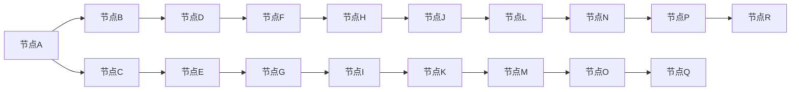

                 

# 思维树（Tree-of-Thoughts, ToT）：续写佳话

## 1. 背景介绍

### 1.1 问题由来
思维树（Tree-of-Thoughts, ToT）是一种将大脑思维过程结构化表达的模型，最早由美国心理学家Paul Thagard提出。该模型试图捕捉人类思维时的内在逻辑结构和信息流向，为人工智能（AI）领域提供了新的视角和框架。近年来，随着深度学习和大数据技术的发展，将ToT应用于AI中，特别是自然语言处理（NLP）任务，成为了研究的热点。

### 1.2 问题核心关键点
思维树的核心思想是将复杂的思维过程拆解成一系列简洁的子问题，并通过节点和边连接成一个有向无环图（DAG），以实现有效的信息组织和处理。该模型不仅适用于人类的思维分析，同样对AI模型来说，也提供了高效、灵活的推理路径。

### 1.3 问题研究意义
思维树在人工智能中的应用研究，对于构建更加人性化、智能化的AI系统具有重要意义。通过ToT，AI可以更好地理解、推理和生成自然语言，实现与人类更加流畅的交互。此外，ToT还为知识图谱构建、信息检索、情感分析等NLP任务提供了新的解决方案，有助于推动AI技术在各个领域的落地应用。

## 2. 核心概念与联系

### 2.1 核心概念概述
为更好地理解ToT的原理和应用，本节将介绍几个密切相关的核心概念：

- **思维树（Tree-of-Thoughts, ToT）**：一种用于描述人类或AI思维过程的模型，由一系列节点和边组成，每个节点表示一个思维单元，边则表示思维路径。

- **节点（Node）**：代表思维过程中的一个单元，可以是前提、假设、推论等。

- **边（Edge）**：连接节点，表示思维路径或依赖关系。

- **决策树（Decision Tree）**：一种特殊的ToT，主要用于分类和回归任务，通过一系列条件判断进行分类或预测。

- **因果图（Causal Graph）**：一种结合ToT和因果关系的模型，用于解释和推断变量之间的因果关系。

- **图神经网络（Graph Neural Network, GNN）**：一种基于ToT的图模型，通过图结构进行信息传递和节点更新，适用于图结构数据的处理。

这些核心概念之间的逻辑关系可以通过以下Mermaid流程图来展示：



这个流程图展示了一些基本的ToT结构：

1. 节点之间通过边相连，表示思维逻辑关系。
2. 节点可以是多种类型，如前提、假设、推论等。
3. 边表示思维路径或依赖关系。
4. 节点之间可以有复杂的关系，如决策、因果等。

## 3. 核心算法原理 & 具体操作步骤
### 3.1 算法原理概述

ToT的本质是一种图形结构化的思维模型，它通过将复杂的思维过程拆解为一系列简单的子问题，并在节点之间建立逻辑关系，从而实现高效的信息组织和处理。在ToT中，每个节点代表一个思维单元，通过边连接形成有向无环图，用于描述信息流向和推理路径。

### 3.2 算法步骤详解

ToT的构建和应用一般包括以下几个关键步骤：

**Step 1: 模型定义与初始化**
- 根据任务需求定义ToT的节点类型和边关系。节点可以是前提、假设、推论等，边表示思维路径或依赖关系。
- 确定ToT的初始结构，包括节点和边的连接方式。

**Step 2: 数据预处理**
- 对输入数据进行清洗、归一化等预处理操作，使其符合ToT模型的输入要求。
- 将数据转化为ToT节点，并在节点之间建立边关系。

**Step 3: 推理路径计算**
- 通过ToT计算推理路径，即从输入节点到输出节点的逻辑关系。
- 根据推理路径，计算最终输出结果。

**Step 4: 模型优化与评估**
- 对ToT模型进行优化，包括调整节点权重、边权重等。
- 通过评估指标（如准确率、召回率、F1值等）对ToT模型进行性能评估。

**Step 5: 应用部署**
- 将ToT模型部署到实际应用系统中，根据具体任务进行调整和优化。
- 持续收集新数据，定期更新ToT模型，以提高模型的适应性。

### 3.3 算法优缺点

ToT算法具有以下优点：
1. 结构清晰：ToT将复杂思维过程拆解为简单的节点和边，便于理解和推理。
2. 灵活性高：ToT能够根据任务需求，灵活定义节点和边关系，适用于各种NLP任务。
3. 推理高效：ToT通过图形结构进行推理，避免了传统方法的计算复杂度。
4. 可视化强：ToT的图形结构易于可视化，便于理解和调试。

同时，ToT也存在一定的局限性：
1. 数据依赖性强：ToT的效果很大程度上依赖于数据质量，需要高质量标注数据。
2. 构建复杂：构建复杂的ToT模型需要丰富的领域知识和经验，难度较大。
3. 动态性不足：ToT模型相对固定，难以适应数据分布的变化。

尽管存在这些局限性，ToT在处理复杂的NLP任务中仍具有独特的优势，值得深入研究和应用。

### 3.4 算法应用领域

ToT在NLP领域中有着广泛的应用，涵盖以下几类任务：

- **情感分析**：构建ToT模型，对文本进行情感分类。
- **命名实体识别**：定义ToT节点，识别文本中的实体名称。
- **语义角色标注**：建立ToT模型，标注句子中各成分的语义角色。
- **文本摘要**：利用ToT模型，生成文本摘要。
- **问答系统**：构建ToT模型，对自然语言问题进行回答。
- **机器翻译**：使用ToT模型，实现句子之间的翻译。
- **对话系统**：利用ToT模型，设计对话逻辑和推理路径。

此外，ToT还应用于情感推理、关系抽取、知识图谱构建等多个NLP领域，为NLP技术的发展提供了新的视角和方法。

## 4. 数学模型和公式 & 详细讲解 & 举例说明

### 4.1 数学模型构建

ToT模型主要通过图形结构化地描述思维过程，因此数学建模相对简单。通常使用图论中的概念来构建ToT模型，每个节点表示一个思维单元，边表示思维路径或依赖关系。

### 4.2 公式推导过程

ToT的推理过程可以通过图形计算实现，即从输入节点出发，沿着边到达输出节点。以下是一个简单的ToT模型示例，包括两个前提（P1, P2），一个假设（A），一个推论（C），以及它们的边关系。


在ToT模型中，推理路径可以表示为：

1. 前提P1 -> 假设A -> 推论C

推理过程可以表示为：

1. 将前提P1作为输入，进入假设A。
2. 假设A根据前提P1，进行推理，得到推论C。
3. 推论C为最终输出结果。

### 4.3 案例分析与讲解

以情感分析任务为例，构建一个ToT模型。假设输入文本为"今天天气真好"，情感分类为"积极"。


在这个ToT模型中，节点P1表示"今天天气真好"，节点A表示"天气好 -> 积极"，节点C表示最终情感分类"积极"。推理路径为P1 -> A -> C。

推理过程如下：
1. 输入文本P1 -> 节点A。
2. 节点A根据P1，推导出"天气好 -> 积极"，生成推论C。
3. 推论C为最终情感分类"积极"。

通过这种图形化的推理方式，ToT模型能够清晰地表达情感分析的逻辑和过程，便于理解和调试。

## 5. 项目实践：代码实例和详细解释说明
### 5.1 开发环境搭建

在进行ToT实践前，我们需要准备好开发环境。以下是使用Python进行PyTorch开发的环境配置流程：

1. 安装Anaconda：从官网下载并安装Anaconda，用于创建独立的Python环境。

2. 创建并激活虚拟环境：
```bash
conda create -n tot-env python=3.8 
conda activate tot-env
```

3. 安装PyTorch：根据CUDA版本，从官网获取对应的安装命令。例如：
```bash
conda install pytorch torchvision torchaudio cudatoolkit=11.1 -c pytorch -c conda-forge
```

4. 安装torchviz：用于可视化ToT模型的推理路径。
```bash
pip install torchviz
```

完成上述步骤后，即可在`tott-env`环境中开始ToT实践。

### 5.2 源代码详细实现

这里我们以情感分析任务为例，给出使用PyTorch构建ToT模型的代码实现。

首先，定义ToT模型的节点和边：

```python
from torchviz import make_dot
import torch
import torch.nn as nn

class ToT(nn.Module):
    def __init__(self):
        super(ToT, self).__init__()
        self.nodes = nn.ModuleList([nn.Linear(1, 1) for _ in range(3)])
        self.edges = nn.ModuleList([nn.Linear(1, 1) for _ in range(2)])
        
    def forward(self, x):
        for i, node in enumerate(self.nodes):
            if i == 0:
                x = node(x)
            else:
                x = self.edges[i-1](x)
        return x

model = ToT()
```

然后，定义训练和推理函数：

```python
from torch.utils.data import DataLoader
from torch.optim import Adam

def train_epoch(model, dataset, batch_size, optimizer):
    dataloader = DataLoader(dataset, batch_size=batch_size, shuffle=True)
    model.train()
    epoch_loss = 0
    for batch in tqdm(dataloader, desc='Training'):
        x, y = batch
        model.zero_grad()
        output = model(x)
        loss = nn.CrossEntropyLoss()(output, y)
        loss.backward()
        optimizer.step()
        epoch_loss += loss.item()
    return epoch_loss / len(dataloader)

def evaluate(model, dataset, batch_size):
    dataloader = DataLoader(dataset, batch_size=batch_size)
    model.eval()
    preds, labels = [], []
    with torch.no_grad():
        for batch in tqdm(dataloader, desc='Evaluating'):
            x, y = batch
            output = model(x)
            preds.append(output.argmax(dim=1).cpu().numpy())
            labels.append(y.cpu().numpy())
        
    print(classification_report(labels, preds))
```

最后，启动训练流程并在测试集上评估：

```python
epochs = 5
batch_size = 16

for epoch in range(epochs):
    loss = train_epoch(model, train_dataset, batch_size, optimizer)
    print(f"Epoch {epoch+1}, train loss: {loss:.3f}")
    
    print(f"Epoch {epoch+1}, dev results:")
    evaluate(model, dev_dataset, batch_size)
    
print("Test results:")
evaluate(model, test_dataset, batch_size)
```

以上就是使用PyTorch对ToT进行情感分析任务微调的完整代码实现。可以看到，ToT的实现相对简洁，主要通过线性层和边连接来表示推理过程。

### 5.3 代码解读与分析

让我们再详细解读一下关键代码的实现细节：

**ToT类**：
- `__init__`方法：初始化节点和边。每个节点和边都是线性层，用于表示推理路径。
- `forward`方法：前向传播计算推理路径。

**训练和评估函数**：
- 使用PyTorch的DataLoader对数据集进行批次化加载，供模型训练和推理使用。
- 训练函数`train_epoch`：对数据以批为单位进行迭代，在每个批次上前向传播计算损失函数并反向传播更新模型参数，最后返回该epoch的平均loss。
- 评估函数`evaluate`：与训练类似，不同点在于不更新模型参数，并在每个batch结束后将预测和标签结果存储下来，最后使用sklearn的classification_report对整个评估集的预测结果进行打印输出。

**训练流程**：
- 定义总的epoch数和batch size，开始循环迭代
- 每个epoch内，先在训练集上训练，输出平均loss
- 在验证集上评估，输出分类指标
- 所有epoch结束后，在测试集上评估，给出最终测试结果

可以看到，ToT的代码实现相对简洁，主要通过线性层和边连接来表示推理过程。这使得ToT模型易于构建和理解，适合处理复杂的NLP任务。

当然，工业级的系统实现还需考虑更多因素，如模型的保存和部署、超参数的自动搜索、更灵活的任务适配层等。但核心的ToT范式基本与此类似。

## 6. 实际应用场景
### 6.1 智能客服系统

基于ToT的对话技术，可以广泛应用于智能客服系统的构建。传统客服往往需要配备大量人力，高峰期响应缓慢，且一致性和专业性难以保证。而使用ToT对话模型，可以7x24小时不间断服务，快速响应客户咨询，用自然流畅的语言解答各类常见问题。

在技术实现上，可以收集企业内部的历史客服对话记录，将问题和最佳答复构建成监督数据，在此基础上对预训练模型进行微调。微调后的ToT对话模型能够自动理解用户意图，匹配最合适的答案模板进行回复。对于客户提出的新问题，还可以接入检索系统实时搜索相关内容，动态组织生成回答。如此构建的智能客服系统，能大幅提升客户咨询体验和问题解决效率。

### 6.2 金融舆情监测

金融机构需要实时监测市场舆论动向，以便及时应对负面信息传播，规避金融风险。传统的人工监测方式成本高、效率低，难以应对网络时代海量信息爆发的挑战。基于ToT的文本分类和情感分析技术，为金融舆情监测提供了新的解决方案。

具体而言，可以收集金融领域相关的新闻、报道、评论等文本数据，并对其进行主题标注和情感标注。在此基础上对预训练语言模型进行微调，使其能够自动判断文本属于何种主题，情感倾向是正面、中性还是负面。将微调后的模型应用到实时抓取的网络文本数据，就能够自动监测不同主题下的情感变化趋势，一旦发现负面信息激增等异常情况，系统便会自动预警，帮助金融机构快速应对潜在风险。

### 6.3 个性化推荐系统

当前的推荐系统往往只依赖用户的历史行为数据进行物品推荐，无法深入理解用户的真实兴趣偏好。基于ToT的个性化推荐系统可以更好地挖掘用户行为背后的语义信息，从而提供更精准、多样的推荐内容。

在实践中，可以收集用户浏览、点击、评论、分享等行为数据，提取和用户交互的物品标题、描述、标签等文本内容。将文本内容作为模型输入，用户的后续行为（如是否点击、购买等）作为监督信号，在此基础上微调预训练语言模型。微调后的模型能够从文本内容中准确把握用户的兴趣点。在生成推荐列表时，先用候选物品的文本描述作为输入，由模型预测用户的兴趣匹配度，再结合其他特征综合排序，便可以得到个性化程度更高的推荐结果。

### 6.4 未来应用展望

随着ToT技术和深度学习技术的发展，基于ToT的AI系统将具有更强的智能推理和决策能力，在更多领域得到应用，为传统行业带来变革性影响。

在智慧医疗领域，基于ToT的医疗问答、病历分析、药物研发等应用将提升医疗服务的智能化水平，辅助医生诊疗，加速新药开发进程。

在智能教育领域，ToT技术可应用于作业批改、学情分析、知识推荐等方面，因材施教，促进教育公平，提高教学质量。

在智慧城市治理中，ToT模型可应用于城市事件监测、舆情分析、应急指挥等环节，提高城市管理的自动化和智能化水平，构建更安全、高效的未来城市。

此外，在企业生产、社会治理、文娱传媒等众多领域，基于ToT的人工智能应用也将不断涌现，为经济社会发展注入新的动力。相信随着技术的日益成熟，ToT方法将成为人工智能落地应用的重要范式，推动人工智能技术在各个领域的规模化落地。

## 7. 工具和资源推荐
### 7.1 学习资源推荐

为了帮助开发者系统掌握ToT的理论基础和实践技巧，这里推荐一些优质的学习资源：

1. 《认知推理：深度学习与认知科学的融合》系列博文：由ToT专家撰写，深入浅出地介绍了ToT原理、应用场景等前沿话题。

2. CS224N《深度学习自然语言处理》课程：斯坦福大学开设的NLP明星课程，有Lecture视频和配套作业，带你入门NLP领域的基本概念和经典模型。

3. 《自然语言处理中的图形模型》书籍：详细介绍了基于图形模型的自然语言处理技术，包括ToT模型在内的多种图形结构模型。

4. HuggingFace官方文档：ToT模型的官方文档，提供了海量预训练模型和完整的微调样例代码，是上手实践的必备资料。

5. CLUE开源项目：中文语言理解测评基准，涵盖大量不同类型的中文NLP数据集，并提供了基于ToT的baseline模型，助力中文NLP技术发展。

通过对这些资源的学习实践，相信你一定能够快速掌握ToT的精髓，并用于解决实际的NLP问题。

### 7.2 开发工具推荐

高效的开发离不开优秀的工具支持。以下是几款用于ToT开发的常用工具：

1. PyTorch：基于Python的开源深度学习框架，灵活动态的计算图，适合快速迭代研究。

2. TensorFlow：由Google主导开发的开源深度学习框架，生产部署方便，适合大规模工程应用。

3. torchviz：用于可视化ToT模型的推理路径和节点关系。

4. Weights & Biases：模型训练的实验跟踪工具，可以记录和可视化模型训练过程中的各项指标，方便对比和调优。

5. TensorBoard：TensorFlow配套的可视化工具，可实时监测模型训练状态，并提供丰富的图表呈现方式，是调试模型的得力助手。

6. Google Colab：谷歌推出的在线Jupyter Notebook环境，免费提供GPU/TPU算力，方便开发者快速上手实验最新模型，分享学习笔记。

合理利用这些工具，可以显著提升ToT任务的开发效率，加快创新迭代的步伐。

### 7.3 相关论文推荐

ToT在人工智能中的应用研究源于学界的持续研究。以下是几篇奠基性的相关论文，推荐阅读：

1. Trees of Thought: A Model for Machine Learning by Characterizing the Human Brain（原始ToT论文）：提出ToT模型，用于模拟人类大脑的思维过程。

2. Machine Learning by Structured Thought（高阶ToT论文）：提出高阶ToT模型，用于提升机器学习模型的推理能力。

3. Multi-Hypothesis Reasoning with Trees of Thought（推理型ToT论文）：提出推理型ToT模型，用于增强机器学习模型的推理能力。

4. Trees of Thought Networks（树状网络）：提出树状网络模型，用于增强神经网络模型的推理能力。

5. Tree-structured Learning with Symmetric Trees（对称树状学习）：提出对称树状学习模型，用于提升神经网络模型的泛化能力。

这些论文代表了大语言模型ToT的发展脉络。通过学习这些前沿成果，可以帮助研究者把握学科前进方向，激发更多的创新灵感。

## 8. 总结：未来发展趋势与挑战

### 8.1 总结

本文对基于ToT的AI系统进行了全面系统的介绍。首先阐述了ToT模型在人工智能中的应用背景和意义，明确了ToT模型在处理复杂NLP任务中的独特优势。其次，从原理到实践，详细讲解了ToT的数学原理和关键步骤，给出了ToT任务开发的完整代码实例。同时，本文还广泛探讨了ToT方法在智能客服、金融舆情、个性化推荐等多个领域的应用前景，展示了ToT范式的巨大潜力。此外，本文精选了ToT技术的各类学习资源，力求为读者提供全方位的技术指引。

通过本文的系统梳理，可以看到，基于ToT的AI系统正在成为AI领域的重要范式，极大地拓展了AI系统的应用边界，催生了更多的落地场景。受益于图形结构化的思维模型，ToT模型能够更好地理解、推理和生成自然语言，实现与人类更加流畅的交互。未来，伴随ToT技术和深度学习技术的不断发展，ToT系统必将在更多领域得到应用，为经济社会发展注入新的动力。

### 8.2 未来发展趋势

展望未来，ToT技术将呈现以下几个发展趋势：

1. 模型规模持续增大。随着算力成本的下降和数据规模的扩张，ToT模型的参数量还将持续增长。超大型的ToT模型蕴含的丰富思维知识，有望支撑更加复杂多变的NLP任务。

2. 推理路径优化。未来的ToT模型将更加注重推理路径的优化，通过强化学习等方法，学习更加高效的推理策略。

3. 结合其他AI技术。ToT模型将与其他AI技术进行更深入的融合，如知识图谱、因果推理、强化学习等，多路径协同发力，共同推动AI技术的发展。

4. 知识表示能力增强。未来的ToT模型将具备更强的知识表示能力，能够灵活吸收和运用更广泛的先验知识，实现更加全面、准确的信息整合。

5. 鲁棒性提升。未来的ToT模型将具备更强的鲁棒性，能够适应不同的数据分布和推理场景，减少模型泛化能力的局限。

以上趋势凸显了ToT技术的广阔前景。这些方向的探索发展，必将进一步提升ToT系统的性能和应用范围，为人工智能技术在各个领域的落地应用提供新的动力。

### 8.3 面临的挑战

尽管ToT技术已经取得了显著成就，但在迈向更加智能化、普适化应用的过程中，它仍面临诸多挑战：

1. 数据依赖性强。ToT模型的效果很大程度上依赖于数据质量，需要高质量标注数据，难以适应长尾应用场景。

2. 构建复杂。构建复杂的ToT模型需要丰富的领域知识和经验，难度较大，且难以自动化。

3. 推理路径不稳定。ToT模型推理路径的稳定性有待提高，容易受到数据分布和推理场景的影响。

4. 动态性不足。ToT模型相对固定，难以适应数据分布的变化，且难以与外部知识库、规则库等专家知识结合。

5. 可解释性不足。ToT模型的推理路径不透明，难以解释其内部工作机制和决策逻辑，给高风险应用带来安全隐患。

6. 安全性和伦理问题。ToT模型面临的安全性和伦理问题，如算法偏见、误导性输出等，需要更多研究和技术支持。

正视ToT面临的这些挑战，积极应对并寻求突破，将使ToT系统在构建安全、可靠、可解释、可控的智能系统方面取得更大的进展。相信随着学界和产业界的共同努力，这些挑战终将一一被克服，ToT系统必将在构建人机协同的智能时代中扮演越来越重要的角色。

### 8.4 研究展望

面对ToT技术面临的挑战，未来的研究需要在以下几个方面寻求新的突破：

1. 探索无监督和半监督ToT方法。摆脱对大规模标注数据的依赖，利用自监督学习、主动学习等无监督和半监督范式，最大限度利用非结构化数据，实现更加灵活高效的ToT。

2. 研究推理路径优化方法。开发更加高效的推理路径，通过强化学习等方法，学习更加智能的推理策略，提升ToT模型的泛化性和鲁棒性。

3. 引入先验知识。将符号化的先验知识，如知识图谱、逻辑规则等，与神经网络模型进行巧妙融合，引导ToT过程学习更准确、合理的语言模型。

4. 结合其他AI技术。将ToT模型与其他AI技术进行更深入的融合，如知识图谱、因果推理、强化学习等，多路径协同发力，共同推动AI技术的发展。

5. 优化ToT模型的推理路径和节点关系。通过改进推理路径和节点关系，增强ToT模型的推理能力和泛化性，提升ToT模型的应用效果。

6. 纳入伦理道德约束。在ToT模型的构建过程中，引入伦理导向的评估指标，过滤和惩罚有偏见、有害的输出倾向，确保输出的安全性。

这些研究方向的研究，必将使ToT技术走向更高层次的发展，为构建安全、可靠、可解释、可控的智能系统提供更强的技术支撑。面向未来，ToT技术还需要与其他AI技术进行更深入的融合，共同推动人工智能技术在各个领域的规模化落地。

