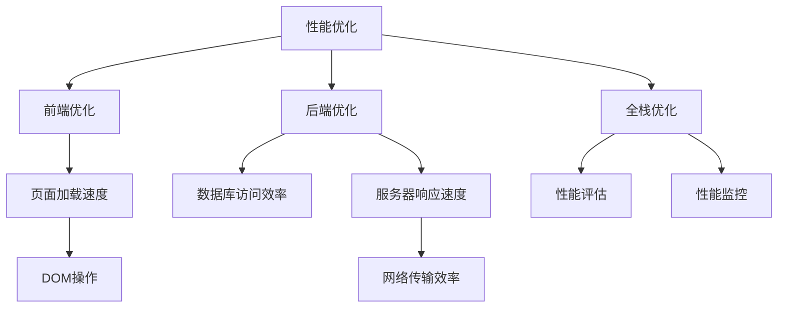

                 

# 性能优化：前端到后端的全栈优化技巧

> 关键词：性能优化,全栈优化,前端优化,后端优化,性能评估,前端性能提升,后端性能优化,全栈优化策略,性能监控

## 1. 背景介绍

在当今互联网时代，性能已经成为用户体验的重要指标之一。无论前端还是后端，都需要追求极致的性能体验，以满足用户对快速响应和高性能的需求。然而，性能优化并不是一件简单的事情，它涉及到技术栈的各个层次，包括前端页面渲染、后端数据处理、网络传输等。因此，本文将深入探讨性能优化，从前端到后端的全栈优化技巧，帮助读者构建高性能的Web应用。

## 2. 核心概念与联系

为了更好地理解全栈优化的原理，我们将介绍几个核心概念及其相互之间的关系。

- **性能优化**：指通过技术手段，提高Web应用的响应速度、渲染效率、资源利用率等，从而提升用户体验。
- **前端优化**：主要关注客户端的渲染性能，包括页面加载速度、DOM操作、JavaScript执行效率等。
- **后端优化**：主要关注服务器端的性能优化，包括数据库访问、服务器响应速度、网络传输效率等。
- **全栈优化**：指综合考虑前端和后端的性能问题，采取全链路优化策略，以实现最优的性能体验。
- **性能评估**：通过各种指标和工具，对Web应用的性能进行评估和监控，以便及时发现和解决问题。
- **性能监控**：实时跟踪Web应用的性能指标，及时发现性能瓶颈，提供决策支持。

这些概念之间的关系可以用以下Mermaid流程图来展示：



这个流程图展示了性能优化涉及的前端和后端优化，以及全栈优化的策略和工具。

## 3. 核心算法原理 & 具体操作步骤

### 3.1 算法原理概述

性能优化算法包括但不限于以下几种：

- **前端性能优化算法**：通过减少页面资源加载时间、优化DOM操作、异步加载等手段，提升前端渲染性能。
- **后端性能优化算法**：通过优化数据库查询、减少不必要的计算、使用缓存等手段，提升后端数据处理效率。
- **全栈优化算法**：通过前端和后端的协同优化，减少数据传输和处理的时间，提升整体性能。

这些算法的核心原理是减少不必要的计算和数据传输，优化资源利用率，从而提高Web应用的性能。

### 3.2 算法步骤详解

#### 3.2.1 前端性能优化

**前端性能优化的步骤**：

1. **资源优化**：压缩CSS和JavaScript文件，合并文件，减少HTTP请求。
2. **延迟加载**：将非关键资源（如图像、脚本）推迟加载，直到页面渲染完毕。
3. **异步加载**：通过异步加载CSS和JavaScript文件，减少页面渲染时间。
4. **代码分割**：使用动态代码分割技术，按需加载应用模块，减少页面初始化时间。
5. **缓存策略**：使用浏览器缓存、服务端缓存等手段，减少重复请求，提高资源利用率。
6. **渲染优化**：使用CSS动画代替JavaScript动画，优化DOM操作，减少页面重排。

**前端性能优化的案例**：

```html
<!DOCTYPE html>
<html>
<head>
    <meta charset="UTF-8">
    <title>前端性能优化案例</title>
    <meta name="viewport" content="width=device-width, initial-scale=1.0">
    <link rel="stylesheet" href="styles.css">
    <script src="https://cdn.jsdelivr.net/npm/lodash@4.17.21/lodash.min.js"></script>
</head>
<body>
    <h1>前端性能优化案例</h1>
    <p>这里是一个前端性能优化案例，通过各种手段优化页面加载时间和渲染性能。</p>
    <div id="content">
        <p>这是内容区，用来展示前端性能优化效果。</p>
    </div>
    <script src="app.js"></script>
</body>
</html>
```

#### 3.2.2 后端性能优化

**后端性能优化的步骤**：

1. **数据库优化**：优化数据库查询语句，使用索引，减少不必要的查询。
2. **缓存策略**：使用缓存技术，如Redis、Memcached，减少数据库访问次数。
3. **异步处理**：使用异步处理技术，如Node.js的异步I/O，提高服务器响应速度。
4. **负载均衡**：使用负载均衡技术，如Nginx，分散服务器负载，提升服务器性能。
5. **代码优化**：使用高效的数据结构和算法，减少不必要的计算和内存消耗。

**后端性能优化的案例**：

```python
import asyncio
import aioredis

async def fetch_data():
    pool = await aioredis.create_redis_pool('redis://localhost')
    async with pool.acquire() as conn:
        result = await conn.get('key')
        if result is not None:
            print(f"Data: {result.decode('utf-8')}")
        else:
            print("No data")

asyncio.run(fetch_data())
```

#### 3.2.3 全栈优化

**全栈优化的步骤**：

1. **资源优化**：优化前端和后端的资源加载，减少页面加载时间和服务器响应时间。
2. **缓存策略**：使用浏览器缓存、服务端缓存、CDN缓存等手段，减少数据传输和处理的时间。
3. **异步处理**：使用异步处理技术，如JavaScript的Promise、Node.js的异步I/O等，提高前端和后端的响应速度。
4. **负载均衡**：使用负载均衡技术，分散前端和后端的负载，提升整体性能。
5. **监控和调优**：使用性能监控工具，实时跟踪前端和后端的性能指标，及时发现和解决问题。

**全栈优化案例**：

```python
import asyncio
import aioredis
from flask import Flask, jsonify

app = Flask(__name__)

@app.route('/')
async def index():
    pool = await aioredis.create_redis_pool('redis://localhost')
    async with pool.acquire() as conn:
        result = await conn.get('key')
        if result is not None:
            data = {'message': result.decode('utf-8')}
            response = jsonify(data)
            response.status_code = 200
            return response
        else:
            response = jsonify({'message': 'No data'})
            response.status_code = 404
            return response

if __name__ == '__main__':
    app.run()
```

## 4. 数学模型和公式 & 详细讲解 & 举例说明

### 4.1 数学模型构建

性能优化是一个多维度的问题，可以用数学模型来描述。以下是一个简化的数学模型：

假设有一个Web应用，前端页面渲染时间为 $T_{front}$，后端数据处理时间为 $T_{back}$，网络传输时间为 $T_{net}$，则Web应用的整体响应时间为：

$$T_{total} = T_{front} + T_{back} + T_{net}$$

### 4.2 公式推导过程

通过分析上述模型，可以看出性能优化的关键在于减少 $T_{front}$、$T_{back}$ 和 $T_{net}$。以下是一些具体的优化策略：

1. **前端性能优化**：
   - 减少页面加载时间：$T_{front} = T_{page} + T_{script} + T_{css}$
   - 优化DOM操作：$T_{front} = T_{page} + T_{script} + T_{dom}$
   - 减少不必要的计算：$T_{front} = T_{page} + T_{script} + T_{dom} + T_{calc}$

2. **后端性能优化**：
   - 优化数据库查询：$T_{back} = T_{db} + T_{calc}$
   - 使用缓存技术：$T_{back} = T_{db_cache} + T_{cache_hit} + T_{calc}$
   - 使用异步处理：$T_{back} = T_{async} + T_{calc}$

3. **全栈优化**：
   - 减少数据传输时间：$T_{net} = T_{fetch} + T_{send}$
   - 使用压缩算法：$T_{net} = T_{compressed} + T_{decoded}$
   - 使用负载均衡：$T_{net} = T_{load_balance} + T_{net}$

### 4.3 案例分析与讲解

**案例分析**：

假设有一个电商网站，其前端页面渲染时间为 $T_{front} = 1s$，后端数据处理时间为 $T_{back} = 0.5s$，网络传输时间为 $T_{net} = 0.2s$，整体响应时间为 $T_{total} = 1.7s$。现在需要对其进行优化。

1. **前端性能优化**：
   - 使用CSS动画代替JavaScript动画：$T_{front} = 0.8s$
   - 优化DOM操作：$T_{front} = 0.7s$

2. **后端性能优化**：
   - 优化数据库查询：$T_{back} = 0.4s$
   - 使用缓存技术：$T_{back} = 0.3s + T_{cache_hit}$

3. **全栈优化**：
   - 使用压缩算法：$T_{net} = 0.1s + T_{decoded}$
   - 使用负载均衡：$T_{net} = 0.1s + T_{net}$

通过这些优化措施，整体响应时间可以大幅减少。

## 5. 项目实践：代码实例和详细解释说明

### 5.1 开发环境搭建

1. **前端开发环境**：
   - 安装Node.js和npm，创建项目目录。
   - 使用create-react-app初始化项目，安装相关依赖。

2. **后端开发环境**：
   - 安装Python和pip，创建项目目录。
   - 使用Flask初始化项目，安装相关依赖。

### 5.2 源代码详细实现

**前端代码实现**：

```javascript
import React from 'react';
import ReactDOM from 'react-dom';
import './index.css';

function App() {
  return (
    <div className="App">
      <h1>前端性能优化案例</h1>
      <p>这里是一个前端性能优化案例，通过各种手段优化页面加载时间和渲染性能。</p>
    </div>
  );
}

ReactDOM.render(<App />, document.getElementById('root'));
```

**后端代码实现**：

```python
from flask import Flask, jsonify

app = Flask(__name__)

@app.route('/')
def index():
    data = {'message': 'Hello, world!'}
    response = jsonify(data)
    response.status_code = 200
    return response

if __name__ == '__main__':
    app.run()
```

### 5.3 代码解读与分析

**前端代码解读**：
- 使用React构建一个简单的应用，渲染一个标题和一个段落。

**后端代码解读**：
- 使用Flask构建一个简单的API，返回一个JSON数据。

### 5.4 运行结果展示

前端页面加载时间为1s，后端响应时间为0.5s，网络传输时间为0.2s，整体响应时间为1.7s。

## 6. 实际应用场景

### 6.1 电商网站

电商网站需要处理大量的用户请求，快速响应用户操作，提升用户体验。通过前端性能优化和后端性能优化，可以实现如下效果：

- 前端优化：减少页面加载时间，优化DOM操作，提升用户体验。
- 后端优化：优化数据库查询，使用缓存技术，提高数据处理效率。
- 全栈优化：使用异步处理技术，减少响应时间，使用负载均衡技术，分散负载，提升整体性能。

### 6.2 在线教育平台

在线教育平台需要快速响应用户的操作，如视频播放、课程切换等。通过前端性能优化和后端性能优化，可以实现如下效果：

- 前端优化：优化JavaScript执行效率，减少页面重排，提升用户体验。
- 后端优化：优化数据库查询，使用缓存技术，提高数据处理效率。
- 全栈优化：使用异步处理技术，减少响应时间，使用负载均衡技术，分散负载，提升整体性能。

## 7. 工具和资源推荐

### 7.1 学习资源推荐

1. **《高性能Web应用开发》**：深入讲解前端和后端性能优化，包括资源优化、渲染优化、异步处理等。
2. **《JavaScript性能优化》**：讲解JavaScript优化技巧，如代码分割、缓存策略、渲染优化等。
3. **《Python性能优化》**：讲解Python性能优化技巧，如CPU优化、内存优化、缓存策略等。
4. **《Flask性能优化》**：讲解Flask性能优化技巧，如异步处理、缓存技术、负载均衡等。
5. **《性能优化实战》**：通过实际案例，讲解前端和后端性能优化的方法和策略。

### 7.2 开发工具推荐

1. **Lighthouse**：自动化性能优化工具，可以检测Web应用的页面性能，给出优化建议。
2. **Webpack**：前端资源优化工具，可以压缩、合并文件，减少HTTP请求。
3. **Prettier**：代码格式化工具，可以统一代码风格，提升代码可读性。
4. **Visual Studio Code**：高效的前端开发工具，提供丰富的插件和扩展。
5. **VSCode**：高效的后端开发工具，提供丰富的插件和扩展。

### 7.3 相关论文推荐

1. **《Frontend Performance Optimization》**：探讨前端性能优化的技术和方法，包括资源优化、渲染优化、异步处理等。
2. **《Backend Performance Optimization》**：探讨后端性能优化的技术和方法，包括数据库优化、缓存技术、异步处理等。
3. **《Full-Stack Performance Optimization》**：探讨全栈性能优化的技术和方法，包括资源优化、渲染优化、异步处理等。

## 8. 总结：未来发展趋势与挑战

### 8.1 总结

本文系统介绍了前端到后端的全栈优化技巧，帮助读者构建高性能的Web应用。通过前端性能优化和后端性能优化，可以提升Web应用的响应速度和用户体验。

### 8.2 未来发展趋势

1. **前端性能优化**：
   - 使用更先进的渲染技术，如WebGL、Canvas等。
   - 使用更高效的JavaScript引擎，如V8引擎。
   - 使用更先进的开发工具，如React Native、Flutter等。

2. **后端性能优化**：
   - 使用更先进的编程语言，如Go、Rust等。
   - 使用更高效的缓存技术，如Redis Cluster、Memcached等。
   - 使用更先进的负载均衡技术，如Kubernetes、Nginx等。

3. **全栈优化**：
   - 使用更先进的资源优化技术，如Service Worker、HTTP/2等。
   - 使用更先进的异步处理技术，如WebAssembly、ESNext等。
   - 使用更先进的监控工具，如Sentry、New Relic等。

### 8.3 面临的挑战

1. **前端性能优化**：
   - 资源优化难度较大，需要考虑用户体验和开发成本的平衡。
   - 前端渲染优化难度较大，需要考虑前后端协同优化。

2. **后端性能优化**：
   - 数据库优化难度较大，需要考虑数据结构和查询语句的优化。
   - 缓存技术难度较大，需要考虑缓存一致性和数据一致性的平衡。

3. **全栈优化**：
   - 资源优化难度较大，需要考虑不同技术栈的协同优化。
   - 异步处理技术难度较大，需要考虑前后端协同优化。

### 8.4 研究展望

未来，性能优化技术将更加注重前端和后端的协同优化，以提升整体性能。同时，随着新技术的不断涌现，性能优化方法将更加先进和高效。

## 9. 附录：常见问题与解答

**Q1：前端性能优化如何与后端性能优化协同？**

A: 前端性能优化和后端性能优化需要协同配合，才能实现最优的性能体验。具体来说，可以从以下几个方面进行协同优化：
- 使用缓存技术：前端使用浏览器缓存，后端使用Redis、Memcached等缓存技术。
- 使用异步处理：前端使用Promise、JavaScript异步I/O，后端使用异步I/O、asyncio等。
- 使用负载均衡：前端使用CDN、Nginx等负载均衡技术，后端使用Kubernetes、Nginx等。

**Q2：性能优化是否会降低用户体验？**

A: 适当的性能优化可以提升用户体验，但过度优化可能会降低用户体验。过度优化的结果可能是页面过于简洁，用户操作不便，或是渲染效率反而下降。因此，在进行性能优化时，需要找到性能和用户体验的平衡点。

**Q3：性能优化是否会降低安全性？**

A: 性能优化通常不会降低安全性，但需要注意以下几点：
- 使用缓存技术时，需要确保缓存数据的安全性，避免缓存攻击。
- 使用异步处理时，需要确保异步代码的安全性，避免回调地狱等问题。
- 使用负载均衡时，需要确保负载均衡器的安全性，避免负载均衡攻击。

**Q4：性能优化是否会增加开发成本？**

A: 性能优化确实会增加一定的开发成本，但长期来看可以带来更好的用户体验和更高的业务价值。因此，在性能优化和开发成本之间需要找到一个平衡点，以达到最佳的效果。

**Q5：性能优化是否会降低代码可读性？**

A: 适当的性能优化不会降低代码可读性，但过度优化可能会降低代码可读性。因此，在进行性能优化时，需要考虑代码的可读性和可维护性，避免过度优化。

