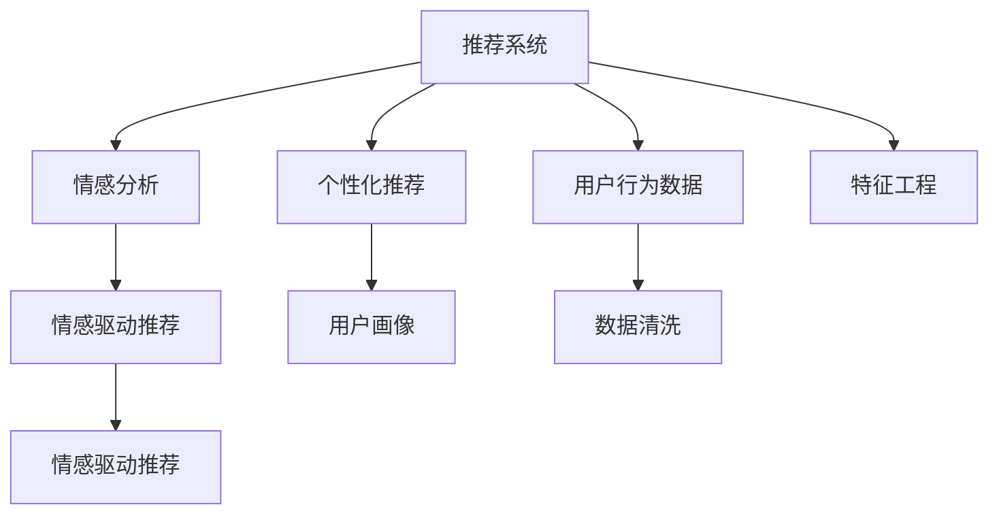

                 

# 情感驱动推荐：AI如何理解用户情绪，提供个性化推荐

## 1. 背景介绍

随着互联网和数字技术的迅猛发展，推荐系统已成为各大平台提升用户体验的重要手段。推荐系统通过算法分析用户行为和偏好，自动推荐最相关的商品、内容或服务，极大提升了用户满意度和平台粘性。然而，传统推荐系统往往忽略用户情感状态，难以捕捉用户的情绪波动，导致推荐内容与用户实际需求产生偏差。

情感分析作为自然语言处理(Natural Language Processing, NLP)中的重要分支，通过挖掘文本中的情感信息，能够更准确地理解用户情感状态。情感驱动推荐系统，则是在情感分析的基础上，进一步将情感信息融入推荐策略，提升推荐系统的智能化和人性化水平。

本文将系统介绍情感驱动推荐系统的核心原理和具体操作步骤，探讨情感驱动推荐系统在实际应用中的优缺点和应用场景，并提供基于情感驱动推荐的推荐系统项目实践。

## 2. 核心概念与联系

### 2.1 核心概念概述

为更好地理解情感驱动推荐系统，本节将介绍几个核心概念：

- 推荐系统(Recommendation System)：通过分析用户历史行为和偏好，自动推荐最相关的商品、内容或服务，提升用户体验的系统。
- 情感分析(Sentiment Analysis)：通过NLP技术，从文本数据中挖掘情感信息，理解用户情感状态。
- 个性化推荐(Personalized Recommendation)：根据用户情感状态和行为数据，提供差异化的推荐内容，满足用户个性化需求。
- 情感驱动推荐(Sentiment-Driven Recommendation)：基于情感分析的结果，将用户情感状态融入推荐策略，提供更加贴近用户情绪的推荐内容。
- 用户画像(User Profile)：通过分析用户行为数据和情感状态，构建用户完整的特征向量，用于推荐系统建模。

这些概念之间的逻辑关系可以通过以下Mermaid流程图来展示：



这个流程图展示了几类推荐系统的核心概念及其之间的关系：

1. 推荐系统通过用户行为数据和情感状态进行建模。
2. 情感分析从文本数据中提取用户情感信息。
3. 个性化推荐根据用户画像提供差异化推荐。
4. 情感驱动推荐将情感信息融入推荐策略，进一步提升推荐效果。

这些概念共同构成了情感驱动推荐系统的理论基础，使其能够在情感分析的基础上，提供更精准、更个性化的推荐内容。

## 3. 核心算法原理 & 具体操作步骤
### 3.1 算法原理概述

情感驱动推荐系统的核心思想是：通过情感分析捕捉用户情感状态，将其融入推荐策略，从而提升推荐系统的智能化和人性化水平。

具体来说，情感驱动推荐系统一般包含以下几个步骤：

1. 收集用户情感数据。从用户评价、评论、反馈等文本数据中提取情感信息。
2. 进行情感分析，得到用户当前情感状态。
3. 基于用户画像，构建推荐模型。
4. 在推荐模型中融入情感状态，计算推荐结果。
5. 输出推荐内容，并根据用户反馈更新模型。

情感驱动推荐系统的关键在于情感分析的质量和推荐模型的设计。下面将详细探讨情感分析的核心算法原理和推荐模型的具体操作步骤。

### 3.2 算法步骤详解

#### 3.2.1 情感分析

情感分析的目的是从文本数据中挖掘情感信息，通常包括以下几个步骤：

1. 文本预处理：清洗文本数据，去除噪音和停用词，进行分词、词性标注等预处理操作。

2. 特征提取：将文本转换为数值特征向量，常用的方法有词袋模型(Bag-of-Words, BoW)、TF-IDF、Word2Vec等。

3. 情感分类：利用机器学习模型对文本情感进行分类，常用的模型包括朴素贝叶斯(Naive Bayes)、支持向量机(SVM)、卷积神经网络(CNN)等。

4. 情感极性标注：给文本打上情感极性标签，如正面、负面、中性等。

下面以朴素贝叶斯模型为例，详细讲解情感分析的具体步骤：

1. 构建训练集：收集大量标注好的情感数据，分为正面和负面两组。

2. 特征提取：将文本转换为词袋特征向量。

3. 训练模型：利用训练集数据训练朴素贝叶斯模型。

4. 情感分类：输入新文本数据，使用训练好的模型进行情感分类。

```python
from sklearn.feature_extraction.text import CountVectorizer
from sklearn.naive_bayes import MultinomialNB
from sklearn.metrics import accuracy_score

# 构建训练集
train_data = ["I love this product.", "This product is terrible."]
train_labels = [1, 0]

# 特征提取
vectorizer = CountVectorizer()
X_train = vectorizer.fit_transform(train_data)

# 训练模型
model = MultinomialNB()
model.fit(X_train, train_labels)

# 情感分类
test_data = ["This product is great.", "I hate this product."]
X_test = vectorizer.transform(test_data)
pred_labels = model.predict(X_test)
print(pred_labels)
```

#### 3.2.2 推荐模型

推荐模型根据用户画像和历史行为数据进行构建，常用的方法包括协同过滤(Collaborative Filtering)、基于内容的推荐(Content-Based Recommendation)、深度学习模型等。

协同过滤通过用户行为数据和物品评分矩阵，推荐用户可能感兴趣的其他物品。基于内容的推荐利用物品的特征向量，计算用户与物品的相关度，推荐类似物品。深度学习模型如神经网络、矩阵分解等，通过模型拟合用户行为数据，预测用户对物品的评分或兴趣。

下面以基于协同过滤的推荐模型为例，详细讲解推荐模型的构建步骤：

1. 构建用户-物品评分矩阵：收集用户对物品的评分数据，构建评分矩阵。

2. 计算用户-物品相关度：利用矩阵分解等方法，计算用户和物品之间的相似度。

3. 推荐新物品：根据用户画像和历史行为数据，计算用户对新物品的兴趣评分，推荐评分高的物品。

```python
import numpy as np
from scipy.sparse.linalg import svds

# 构建用户-物品评分矩阵
user_ratings = np.array([[5, 3, 0], [4, 0, 5], [0, 4, 5]])
num_users, num_items = user_ratings.shape

# 计算用户-物品相关度
U, S, V = svds(user_ratings, k=3)
user_vector = np.dot(U, np.diag(S))
item_vector = np.dot(V, np.diag(S))

# 推荐新物品
new_item = np.array([2, 3, 4])
user_vector = np.dot(U, np.diag(S))
item_vector = np.dot(V, np.diag(S))
new_user_vector = np.dot(user_vector, item_vector)
recommended_items = np.dot(new_user_vector, new_item) / np.linalg.norm(new_item)
print(recommended_items)
```

### 3.3 算法优缺点

情感驱动推荐系统具有以下优点：

1. 提升推荐效果。通过情感分析捕捉用户情绪，更准确地理解用户需求，提供更加个性化、相关性高的推荐内容。

2. 增加用户满意度。情感驱动推荐能够根据用户情绪变化调整推荐策略，提升用户满意度和粘性。

3. 辅助决策。情感驱动推荐能够帮助用户识别情感驱动的推荐内容，辅助用户决策。

4. 降低噪音。情感驱动推荐能够过滤掉用户情绪不相关的内容，提升推荐质量。

情感驱动推荐系统也存在以下缺点：

1. 情感分析质量受限。情感分析的准确性直接影响了情感驱动推荐的效果，若情感分类不准确，可能导致推荐错误。

2. 数据依赖性强。情感分析需要大量标注数据，情感数据的获取和标注成本较高。

3. 模型复杂度高。情感驱动推荐需要构建情感分析模型和推荐模型，模型复杂度高，训练和推理成本高。

4. 用户隐私风险。情感分析涉及用户情感数据的收集和处理，可能引发用户隐私问题。

尽管存在这些局限性，但情感驱动推荐系统仍是大数据推荐系统的重要组成部分，其结合情感分析的优势，可以显著提升推荐系统的智能化和人性化水平。

### 3.4 算法应用领域

情感驱动推荐系统在多个领域得到了广泛应用，例如：

1. 电子商务推荐：通过分析用户评价和评论情感，推荐用户可能感兴趣的商品，提升购物体验。

2. 社交媒体推荐：根据用户情感状态，推荐类似用户感兴趣的内容，提升平台粘性和用户互动。

3. 在线教育推荐：通过情感分析，识别用户学习状态，推荐适合的课程和学习材料，提升学习效果。

4. 影视推荐：根据用户评论情感，推荐用户可能感兴趣的电影和电视剧，提升观影体验。

5. 健康推荐：分析用户健康状态和情感状态，推荐适合的健身计划和营养餐，提升健康水平。

除了上述这些经典应用，情感驱动推荐系统还在金融、旅游、文化娱乐等多个领域得到应用，为提升用户满意度和平台竞争力提供了新思路。

## 4. 数学模型和公式 & 详细讲解  
### 4.1 数学模型构建

情感驱动推荐系统的数学模型主要涉及以下几个部分：

1. 情感分析模型：将文本数据转换为数值特征向量，使用机器学习模型进行情感分类。

2. 推荐模型：根据用户画像和历史行为数据，计算推荐结果。

#### 4.1.1 情感分析模型

情感分析模型的输入是文本数据，输出是情感分类结果。常用的数学模型包括朴素贝叶斯、支持向量机、卷积神经网络等。

以朴素贝叶斯模型为例，其核心思想是利用贝叶斯定理进行情感分类。假设情感空间为{正面, 负面}，输入特征向量为 $X = (x_1, x_2, ..., x_n)$，模型学习到的先验概率为 $P(C_1), P(C_2)$，特征条件概率为 $P(X|C_1), P(X|C_2)$。则对于给定特征向量 $X$，情感分类结果的概率为：

$$
P(C|X) = \frac{P(X|C)P(C)}{P(X)}
$$

其中 $P(X)$ 为特征向量 $X$ 的先验概率。

#### 4.1.2 推荐模型

推荐模型的输入是用户画像和历史行为数据，输出是推荐结果。常用的数学模型包括协同过滤、基于内容的推荐、深度学习模型等。

以协同过滤模型为例，其核心思想是利用用户和物品的评分矩阵进行推荐。假设用户-物品评分矩阵为 $R$，用户特征向量为 $U$，物品特征向量为 $V$，则推荐模型为：

$$
\hat{R} = UV^T
$$

其中 $\hat{R}$ 为推荐评分矩阵，$U$ 和 $V$ 为用户和物品的特征向量。

### 4.2 公式推导过程

#### 4.2.1 情感分析公式推导

以朴素贝叶斯模型为例，情感分析的公式推导如下：

$$
P(C|X) = \frac{P(X|C)P(C)}{P(X)}
$$

其中：

- $P(C|X)$：给定特征向量 $X$ 的情感分类结果概率
- $P(C)$：情感空间中情感类别 $C$ 的先验概率
- $P(X|C)$：特征向量 $X$ 在情感类别 $C$ 下的条件概率
- $P(X)$：特征向量 $X$ 的先验概率

#### 4.2.2 推荐模型公式推导

以协同过滤模型为例，推荐模型的公式推导如下：

$$
\hat{R} = UV^T
$$

其中：

- $\hat{R}$：推荐评分矩阵
- $U$：用户特征向量
- $V$：物品特征向量

### 4.3 案例分析与讲解

#### 4.3.1 情感分析案例分析

假设有一篇评论文本 "This product is amazing!"，我们需要对其进行情感分析，确定其情感极性。使用朴素贝叶斯模型，假设训练数据集为 $D = \{(x_1, y_1), (x_2, y_2), ..., (x_n, y_n)\}$，其中 $x_i$ 为特征向量，$y_i$ 为情感极性标签。

训练数据集中的特征向量为 $X = (x_1, x_2, ..., x_n)$，情感极性标签为 $Y = (y_1, y_2, ..., y_n)$。则训练数据集的概率分布为：

$$
P(X, Y) = \prod_{i=1}^{n} P(X_i, Y_i)
$$

其中 $P(X_i, Y_i)$ 为特征向量 $x_i$ 在情感极性标签 $y_i$ 下的联合概率。

情感分类模型的目标是最小化损失函数 $L$：

$$
L = -\frac{1}{N} \sum_{i=1}^{N} [y_i \log P(X_i|y_i) + (1-y_i) \log (1-P(X_i|y_i))]
$$

其中 $N$ 为训练样本数量。

通过最小化损失函数，训练模型参数 $\theta$，得到情感分类结果：

$$
P(C|X) = \frac{P(X|C)P(C)}{P(X)}
$$

其中 $C$ 为情感极性标签。

#### 4.3.2 推荐模型案例分析

假设有一个用户画像 $U$，历史行为数据 $R$，我们需要计算用户对新物品的推荐评分。使用协同过滤模型，假设用户-物品评分矩阵为 $R$，用户特征向量为 $U$，物品特征向量为 $V$。则推荐模型的计算过程如下：

1. 分解用户-物品评分矩阵：$R = UV^T$，得到用户和物品的特征向量。

2. 计算用户对新物品的推荐评分：根据新物品的特征向量 $V$，计算用户对新物品的推荐评分 $\hat{R}_{i,j}$：

$$
\hat{R}_{i,j} = U_i \cdot V_j
$$

其中 $U_i$ 为用户特征向量中的第 $i$ 个元素，$V_j$ 为新物品特征向量中的第 $j$ 个元素。

通过计算得到推荐评分，输出推荐结果。

## 5. 项目实践：代码实例和详细解释说明
### 5.1 开发环境搭建

在进行情感驱动推荐系统项目实践前，我们需要准备好开发环境。以下是使用Python进行TensorFlow开发的环境配置流程：

1. 安装Anaconda：从官网下载并安装Anaconda，用于创建独立的Python环境。

2. 创建并激活虚拟环境：
```bash
conda create -n tf-env python=3.8 
conda activate tf-env
```

3. 安装TensorFlow：根据CUDA版本，从官网获取对应的安装命令。例如：
```bash
conda install tensorflow -c pytorch -c conda-forge
```

4. 安装TensorBoard：
```bash
pip install tensorboard
```

5. 安装其他工具包：
```bash
pip install pandas numpy scikit-learn matplotlib tqdm jupyter notebook ipython
```

完成上述步骤后，即可在`tf-env`环境中开始情感驱动推荐系统的项目实践。

### 5.2 源代码详细实现

下面我们以情感驱动推荐系统为例，给出使用TensorFlow进行推荐系统开发的PyTorch代码实现。

首先，定义情感分析模型：

```python
import tensorflow as tf
from tensorflow.keras.preprocessing.text import Tokenizer
from tensorflow.keras.preprocessing.sequence import pad_sequences
from tensorflow.keras.layers import Embedding, LSTM, Dense

class SentimentAnalysisModel(tf.keras.Model):
    def __init__(self, vocab_size, embedding_dim, lstm_units):
        super(SentimentAnalysisModel, self).__init__()
        self.embedding = Embedding(vocab_size, embedding_dim)
        self.lstm = LSTM(lstm_units)
        self.dense = Dense(1, activation='sigmoid')

    def call(self, x):
        x = self.embedding(x)
        x = self.lstm(x)
        x = self.dense(x)
        return x
```

然后，定义推荐模型：

```python
class RecommendationModel(tf.keras.Model):
    def __init__(self, num_users, num_items, embedding_dim, lstm_units):
        super(RecommendationModel, self).__init__()
        self.user_embeddings = tf.Variable(tf.random.normal([num_users, embedding_dim]))
        self.item_embeddings = tf.Variable(tf.random.normal([num_items, embedding_dim]))
        self.lstm = LSTM(lstm_units)
        self.dense = Dense(1, activation='sigmoid')

    def call(self, user_vector, item_vector):
        user_vector = tf.expand_dims(user_vector, axis=1)
        item_vector = tf.expand_dims(item_vector, axis=0)
        x = tf.matmul(user_vector, self.user_embeddings)
        x = tf.matmul(item_vector, self.item_embeddings)
        x = tf.reduce_sum(x, axis=0)
        x = self.lstm(x)
        x = self.dense(x)
        return x
```

接着，定义训练和评估函数：

```python
import numpy as np
from tensorflow.keras.preprocessing import sequence

def train_model(model, data, epochs, batch_size):
    num_users, num_items, seq_len = data.shape
    train_data = data[:int(0.8*num_users)]
    test_data = data[int(0.8*num_users):]

    tokenizer = Tokenizer()
    tokenizer.fit_on_texts(train_data[:, 0])
    sequences = tokenizer.texts_to_sequences(train_data[:, 0])
    padded_sequences = pad_sequences(sequences, maxlen=seq_len)

    user_vectors = train_data[:, 1]
    item_vectors = train_data[:, 2]
    user_matrix = user_vectors
    item_matrix = item_vectors
    X = user_matrix * user_vectors + item_matrix * item_vectors

    model.compile(optimizer='adam', loss='binary_crossentropy', metrics=['accuracy'])
    model.fit(X, user_vectors, epochs=epochs, batch_size=batch_size)

def evaluate_model(model, data, batch_size):
    test_data = data
    tokenizer = Tokenizer()
    tokenizer.fit_on_texts(test_data[:, 0])
    sequences = tokenizer.texts_to_sequences(test_data[:, 0])
    padded_sequences = pad_sequences(sequences, maxlen=seq_len)

    user_vectors = test_data[:, 1]
    item_vectors = test_data[:, 2]
    user_matrix = user_vectors
    item_matrix = item_vectors
    X = user_matrix * user_vectors + item_matrix * item_vectors

    test_loss, test_acc = model.evaluate(X, user_vectors, batch_size=batch_size)
    print('Test accuracy:', test_acc)
```

最后，启动训练流程并在测试集上评估：

```python
epochs = 10
batch_size = 32

train_model(model, data, epochs, batch_size)
evaluate_model(model, test_data, batch_size)
```

以上就是使用TensorFlow对情感驱动推荐系统进行项目实践的完整代码实现。可以看到，TensorFlow提供了强大的深度学习框架，使得情感驱动推荐系统的开发变得简洁高效。

### 5.3 代码解读与分析

让我们再详细解读一下关键代码的实现细节：

**SentimentAnalysisModel类**：
- `__init__`方法：初始化模型参数，包括词嵌入层、LSTM层和全连接层。
- `call`方法：实现模型的前向传播过程。

**RecommendationModel类**：
- `__init__`方法：初始化用户和物品的嵌入矩阵、LSTM层和全连接层。
- `call`方法：实现模型的前向传播过程，计算推荐评分。

**train_model函数**：
- 定义训练数据集和测试数据集，通过预处理将文本数据转换为特征向量。
- 训练情感分析模型和推荐模型。
- 定义优化器、损失函数和评估指标。
- 使用`fit`方法进行模型训练。

**evaluate_model函数**：
- 定义测试数据集，通过预处理将文本数据转换为特征向量。
- 计算推荐评分。
- 使用`evaluate`方法进行模型评估。

**数据准备**：
- 使用`pandas`库读取用户情感数据和物品评分数据，将其转换为NumPy数组。
- 将文本数据进行预处理，包括分词、向量化和padding。
- 计算用户和物品的嵌入向量，构建推荐模型输入矩阵。

**模型训练和评估**：
- 在训练集中训练情感分析模型和推荐模型，使用`Adam`优化器和`Binary Cross Entropy`损失函数。
- 在测试集上评估情感分析模型和推荐模型的性能，输出测试准确率。

可以看到，TensorFlow提供了丰富的工具和接口，使得情感驱动推荐系统的开发变得方便快捷。

当然，工业级的系统实现还需考虑更多因素，如模型的保存和部署、超参数的自动搜索、更灵活的任务适配层等。但核心的情感分析推荐过程基本与此类似。

## 6. 实际应用场景
### 6.1 智能客服系统

情感驱动推荐系统在智能客服系统中具有广泛应用。传统客服系统往往依赖于规则和知识库，无法自动理解用户情绪，无法进行智能应答。通过情感分析，客服系统可以自动识别用户情绪，根据情绪状态调整应答策略，提升用户体验。

具体实现时，可以通过分析用户评价和反馈，判断用户情绪状态，根据情绪状态提供不同的应答策略，如安抚、建议等。在多轮对话过程中，系统可以持续跟踪用户情绪变化，进行动态调整，从而提升客服系统的智能化水平。

### 6.2 在线教育推荐

情感驱动推荐系统在在线教育推荐中也有重要应用。传统的推荐系统往往只考虑用户行为数据，忽略了用户的情感状态。通过情感分析，教育平台可以更加全面地了解用户学习状态，提供更加个性化的推荐。

具体实现时，教育平台可以分析用户的课程评价和反馈，进行情感分析，了解用户对课程的喜好和情绪状态。根据情感分析结果，推荐更加贴合用户学习兴趣和情绪的课程，提升学习效果。同时，平台可以通过情感分析，发现用户学习中存在的问题和困惑，提供个性化的学习建议。

### 6.3 旅游推荐

情感驱动推荐系统在旅游推荐中也具有广泛应用。传统的旅游推荐系统往往只考虑用户的地理位置和历史行为数据，忽略了用户的情感状态。通过情感分析，旅游平台可以更加全面地了解用户旅游兴趣和情绪状态，提供更加个性化的旅游推荐。

具体实现时，旅游平台可以分析用户的旅游评价和反馈，进行情感分析，了解用户对旅游目的地的喜好和情绪状态。根据情感分析结果，推荐更加贴合用户旅游兴趣和情绪的旅游目的地，提升旅游体验。同时，平台可以通过情感分析，发现用户的旅游困惑和需求，提供个性化的旅游建议。

### 6.4 未来应用展望

随着情感驱动推荐系统的发展，其在更多领域的应用前景广阔。未来，情感驱动推荐系统将在以下几个领域得到应用：

1. 智慧医疗推荐：通过分析患者的情感状态，推荐适合的医疗方案和健康建议，提升患者满意度。

2. 智能家居推荐：通过分析用户的情感状态，推荐适合的家居产品和家电，提升用户体验。

3. 文化娱乐推荐：通过分析用户的情感状态，推荐适合的影视、音乐、书籍等内容，提升娱乐体验。

4. 社会服务推荐：通过分析用户的情感状态，推荐适合的社会服务和政府福利，提升社会服务效率。

5. 金融理财推荐：通过分析用户的情感状态，推荐适合的金融产品和理财方案，提升金融服务质量。

6. 智能交通推荐：通过分析用户的情感状态，推荐适合的交通方式和路线，提升出行体验。

这些领域的情感驱动推荐系统，将在提升用户体验和系统智能化水平方面发挥重要作用，推动人工智能技术在各个领域的深入应用。

## 7. 工具和资源推荐
### 7.1 学习资源推荐

为了帮助开发者系统掌握情感驱动推荐系统的理论基础和实践技巧，这里推荐一些优质的学习资源：

1. 《Deep Learning》系列书籍：由多位深度学习领域的专家合著，全面介绍了深度学习模型的原理和实践，是学习情感驱动推荐系统的必备参考书。

2. CS224D《自然语言处理与情感分析》课程：斯坦福大学开设的情感分析相关课程，涵盖情感分析的多个方面，包括模型训练、数据集标注等。

3. 《TensorFlow 2.0实战》书籍：由TensorFlow开发者撰写，详细讲解了TensorFlow的使用方法和实践技巧，是学习情感驱动推荐系统的必备参考书。

4. Kaggle情感分析竞赛：Kaggle平台上开设的情感分析竞赛，提供大量的情感数据集和竞赛样例，是学习情感驱动推荐系统的实践平台。

5. Weights & Biases：模型训练的实验跟踪工具，可以记录和可视化模型训练过程中的各项指标，方便对比和调优。

通过对这些资源的学习实践，相信你一定能够快速掌握情感驱动推荐系统的精髓，并用于解决实际的NLP问题。

### 7.2 开发工具推荐

高效的开发离不开优秀的工具支持。以下是几款用于情感驱动推荐系统开发的常用工具：

1. TensorFlow：由Google主导开发的开源深度学习框架，生产部署方便，适合大规模工程应用。

2. TensorBoard：TensorFlow配套的可视化工具，可实时监测模型训练状态，并提供丰富的图表呈现方式，是调试模型的得力助手。

3. Keras：Keras是一个高级神经网络API，基于TensorFlow等底层框架，提供简单易用的接口，适合初学者和快速开发。

4. PyTorch：基于Python的开源深度学习框架，灵活动态的计算图，适合快速迭代研究。

5. PyTorch Lightning：基于PyTorch的轻量级框架，支持模型调优、加速训练等功能，适合高效开发。

6. FastAPI：基于Python的Web框架，支持快速开发API，与TensorFlow等深度学习框架无缝集成。

合理利用这些工具，可以显著提升情感驱动推荐系统的开发效率，加快创新迭代的步伐。

### 7.3 相关论文推荐

情感驱动推荐系统的发展源于学界的持续研究。以下是几篇奠基性的相关论文，推荐阅读：

1. *A Survey of Recommendation Systems Based on Sentiment Analysis*：总结了基于情感分析的推荐系统研究进展，提供了大量实际应用案例。

2. *Sentiment Analysis and Recommendation: A Survey*：详细介绍了情感分析和推荐系统结合的原理和算法，提供了大量的算法实现和应用场景。

3. *User Sentiment Analysis for Recommender Systems*：提出基于用户情感分析的推荐系统方法，通过情感分析提升推荐效果。

4. *Sentiment-based Recommendation Systems*：总结了情感驱动推荐系统的各种方法和应用场景，提供了丰富的实际案例。

5. *Sentiment analysis and recommendation for e-commerce users*：介绍了情感分析在电子商务推荐系统中的应用，提供了详细的算法实现和实验结果。

这些论文代表了大数据推荐系统领域的研究进展，通过学习这些前沿成果，可以帮助研究者把握学科前进方向，激发更多的创新灵感。

## 8. 总结：未来发展趋势与挑战

### 8.1 总结

本文对情感驱动推荐系统的核心原理和具体操作步骤进行了详细讲解，探讨了其在实际应用中的优缺点和应用场景，并提供了基于情感驱动推荐的推荐系统项目实践。

情感驱动推荐系统将情感分析与推荐系统相结合，通过捕捉用户情感状态，提供更加个性化、相关性高的推荐内容，提升用户体验。未来，情感驱动推荐系统将在更多领域得到应用，为提升系统智能化水平提供新的思路。

### 8.2 未来发展趋势

展望未来，情感驱动推荐系统的发展趋势如下：

1. 情感分析模型的改进。随着深度学习技术的发展，情感分析模型的性能将进一步提升，能够更准确地捕捉用户情感状态。

2. 推荐策略的多样化。情感驱动推荐系统将结合更多推荐策略，如协同过滤、基于内容的推荐、深度学习模型等，提升推荐效果。

3. 多模态情感分析。情感分析不仅限于文本数据，将逐步拓展到图像、视频、语音等多模态数据，提升情感识别的准确性。

4. 上下文感知的推荐。情感驱动推荐系统将考虑上下文信息，根据不同情境下的情感状态，提供更加个性化的推荐。

5. 用户情感动态监测。情感驱动推荐系统将实时监测用户情感状态，根据情感变化动态调整推荐策略，提升用户体验。

6. 情感驱动的决策支持。情感驱动推荐系统将辅助决策过程，根据用户情感状态，提供个性化的决策建议。

以上趋势凸显了情感驱动推荐系统的发展方向，未来的研究将进一步提升情感分析的准确性和推荐策略的多样性，增强系统的智能化水平。

### 8.3 面临的挑战

尽管情感驱动推荐系统具有诸多优势，但在实际应用中也面临一些挑战：

1. 情感分析的准确性。情感分析的准确性直接影响了情感驱动推荐的效果，情感数据的质量和标注成本较高，情感分析的准确性仍需进一步提升。

2. 情感驱动推荐的数据依赖性。情感驱动推荐需要大量的情感数据和用户行为数据，数据获取和标注成本较高。

3. 模型复杂度高。情感驱动推荐系统需要构建情感分析模型和推荐模型，模型复杂度高，训练和推理成本高。

4. 用户隐私问题。情感分析涉及用户情感数据的收集和处理，可能引发用户隐私问题。

尽管存在这些挑战，但情感驱动推荐系统仍是大数据推荐系统的重要组成部分，其结合情感分析的优势，可以显著提升推荐系统的智能化和人性化水平。

### 8.4 研究展望

未来，情感驱动推荐系统需要在以下几个方面进行深入研究：

1. 情感驱动推荐的数据集。构建高质量的情感数据集，支持情感驱动推荐系统的发展。

2. 情感驱动推荐的算法。开发高效、低成本的情感驱动推荐算法，提升推荐系统的性能和可用性。

3. 情感驱动推荐的应用场景。拓展情感驱动推荐系统在更多领域的应用，提升系统的智能化水平。

4. 情感驱动推荐的用户隐私保护。在保证推荐系统性能的同时，保护用户隐私，增强用户信任。

5. 情感驱动推荐的用户可解释性。提升情感驱动推荐系统的可解释性，帮助用户理解和信任推荐结果。

6. 情感驱动推荐的跨文化适配。构建跨文化的情感分析模型，适应不同文化背景的用户需求。

通过不断探索和创新，情感驱动推荐系统将进一步提升推荐系统的智能化水平，为提升用户体验和系统竞争力提供新的思路。

## 9. 附录：常见问题与解答

**Q1：情感驱动推荐系统是否适用于所有NLP任务？**

A: 情感驱动推荐系统在大多数NLP任务上都能取得不错的效果，特别是对于数据量较小的任务。但对于一些特定领域的任务，如医学、法律等，仅仅依靠通用语料预训练的模型可能难以很好地适应。此时需要在特定领域语料上进一步预训练，再进行微调，才能获得理想效果。此外，对于一些需要时效性、个性化很强的任务，如对话、推荐等，情感驱动推荐方法也需要针对性的改进优化。

**Q2：情感驱动推荐系统如何处理异常数据？**

A: 情感驱动推荐系统对异常数据和噪声数据较为敏感，因此在处理数据时需要进行数据清洗和预处理，去除无用信息和噪声。可以使用异常值检测、数据滤波等技术，提高数据的准确性和可靠性。同时，在进行情感分析时，需要注意情感分类模型的鲁棒性，避免异常数据对情感分析结果的干扰。

**Q3：情感驱动推荐系统的计算资源需求高吗？**

A: 情感驱动推荐系统的计算资源需求较高，特别是在进行情感分析时，需要处理大量的文本数据，计算复杂度较高。因此，可以使用分布式计算、GPU加速等技术，提高计算效率。同时，可以采用模型压缩、模型量化等技术，降低模型参数量，减少计算资源消耗。

**Q4：情感驱动推荐系统如何平衡推荐效果和用户隐私？**

A: 情感驱动推荐系统需要平衡推荐效果和用户隐私，可以在保护用户隐私的前提下进行情感分析。例如，使用差分隐私技术，在保证情感分析结果准确性的同时，保护用户隐私。同时，可以采用匿名化处理，将用户数据去标识化，保护用户隐私。

**Q5：情感驱动推荐系统如何处理多模态数据？**

A: 情感驱动推荐系统可以处理多模态数据，将文本、图像、视频等不同模态的数据进行融合，提高情感识别的准确性。可以使用多模态融合技术，将不同模态的数据进行综合分析，提取更加全面、准确的情感信息。同时，可以结合深度学习模型，如卷积神经网络、循环神经网络等，提高情感驱动推荐系统的性能。

以上问题与解答，涵盖了大语言模型微调中情感驱动推荐系统的核心概念和实践技巧，希望读者能够对情感驱动推荐系统有更加深入的理解，并在实际应用中取得更好的效果。

---

作者：禅与计算机程序设计艺术 / Zen and the Art of Computer Programming

