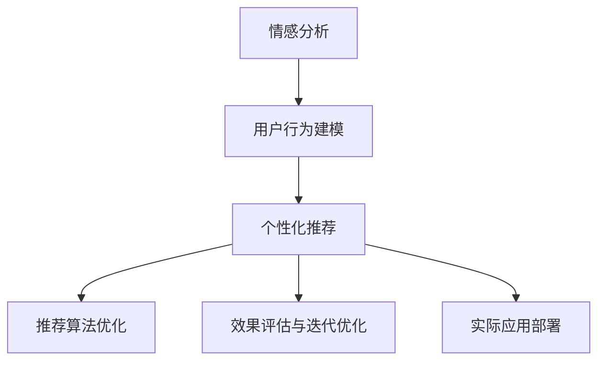

                 

## 1. 背景介绍

### 1.1 问题由来

在数字化时代，数据和技术的飞速发展为各行各业带来了新的机遇与挑战。尤其对于零售、电商、金融等行业，用户满意度、用户粘性和用户留存成为了成功的关键。传统的营销手段、客户服务方式逐渐显现出其局限性，急需变革以适应新的市场环境。在此背景下，情感驱动的个性化推荐系统应运而生，成为提升用户满意度的重要工具。

情感驱动推荐系统通过分析用户的情感反馈，如评论、评分等，结合用户行为数据进行推荐优化，能够更加精准地匹配用户需求，提升用户满意度和忠诚度。本文将围绕情感驱动推荐系统，探讨其在提升用户满意度中的关键技术、核心算法及实际应用案例，期望为相关领域的从业者提供有价值的见解。

### 1.2 问题核心关键点

情感驱动推荐系统的核心在于情感分析与个性化推荐相结合。具体而言，其核心关键点包括以下几个方面：

1. **情感分析**：通过自然语言处理(NLP)技术，对用户评论、评分等情感反馈进行文本分析和情感识别，提取情感信息。

2. **用户行为建模**：结合用户的历史行为数据，建立用户兴趣、偏好和消费习惯的数学模型，用于个性化推荐。

3. **推荐算法优化**：在情感分析和用户行为建模的基础上，通过优化推荐算法，提升推荐的精准度和用户满意度。

4. **效果评估与迭代优化**：通过用户反馈和行为数据，对推荐系统进行效果评估和迭代优化，实现持续改进。

5. **实际应用**：在电商、金融、旅游等实际应用场景中，进行情感驱动推荐系统的部署和实践，提升用户满意度和忠诚度。

本文将从核心算法原理、具体操作步骤、实际应用场景、未来发展趋势与挑战等方面，全面探讨情感驱动推荐系统的构建与优化。

## 2. 核心概念与联系

### 2.1 核心概念概述

为了深入理解情感驱动推荐系统的核心算法，首先需要介绍一些关键概念：

1. **情感分析**：情感分析是指通过文本挖掘技术，对用户的情感反馈进行分类，识别出情感极性（如正面、负面、中性）和情感强度。

2. **用户行为建模**：用户行为建模旨在从用户的历史行为数据中，学习用户的兴趣偏好和消费习惯，形成用户画像。

3. **个性化推荐**：个性化推荐通过用户画像和情感分析结果，结合推荐算法，为用户推荐符合其需求的商品或服务。

4. **推荐算法**：推荐算法包括协同过滤、基于内容的推荐、深度学习推荐等，通过算法优化提升推荐精准度。

5. **情感驱动推荐**：情感驱动推荐是指在传统推荐算法基础上，引入情感分析结果，动态调整推荐策略，实现情感与推荐的深度融合。

### 2.2 核心概念原理和架构的 Mermaid 流程图

以下是情感驱动推荐系统的核心概念原理和架构的 Mermaid 流程图：



该流程图展示了情感驱动推荐系统从情感分析到个性化推荐，再到推荐算法优化、效果评估和实际应用部署的核心流程，各个环节紧密相连，共同支撑系统的精准推荐和用户满意度提升。

## 3. 核心算法原理 & 具体操作步骤

### 3.1 算法原理概述

情感驱动推荐系统的算法原理可以简要概括为：通过情感分析和用户行为建模，建立用户画像，结合个性化推荐算法，动态调整推荐策略，提升用户满意度。具体而言，其工作流程包括：

1. **情感分析**：对用户评论、评分等情感反馈进行文本分析和情感识别，提取情感信息。
2. **用户行为建模**：结合用户的历史行为数据，学习用户的兴趣偏好和消费习惯。
3. **个性化推荐**：在情感分析和用户行为建模的基础上，通过推荐算法，为用户推荐符合其需求的商品或服务。
4. **推荐算法优化**：结合情感分析结果，动态调整推荐算法参数，优化推荐策略。
5. **效果评估与迭代优化**：通过用户反馈和行为数据，评估推荐系统效果，并进行迭代优化。

### 3.2 算法步骤详解

情感驱动推荐系统的具体操作步骤可以分为以下几个阶段：

**Step 1：情感分析**

1. **数据收集**：收集用户的情感反馈数据，如评论、评分、反馈等。

2. **文本预处理**：对文本进行清洗、分词、去停用词等预处理操作。

3. **情感识别**：使用情感分析模型，如基于词典的方法、机器学习模型或深度学习模型，对文本进行情感极性和情感强度的识别。

4. **情感信息提取**：根据情感识别结果，提取用户的情感信息，如正面情感、负面情感等。

**Step 2：用户行为建模**

1. **数据收集**：收集用户的历史行为数据，如浏览记录、购买记录、点击记录等。

2. **用户画像构建**：结合历史行为数据，建立用户画像，包括用户的兴趣偏好、消费习惯等。

3. **特征工程**：根据用户画像，提取有意义的特征，用于个性化推荐。

**Step 3：个性化推荐**

1. **推荐算法选择**：选择合适的推荐算法，如协同过滤、基于内容的推荐、深度学习推荐等。

2. **模型训练**：结合用户画像和情感信息，训练推荐模型。

3. **推荐结果生成**：根据训练好的推荐模型，生成个性化的推荐结果。

**Step 4：推荐算法优化**

1. **情感驱动**：结合情感分析结果，动态调整推荐算法参数，优化推荐策略。

2. **推荐结果评估**：通过用户反馈和行为数据，评估推荐结果的有效性。

3. **模型迭代**：根据评估结果，迭代优化推荐模型。

**Step 5：效果评估与迭代优化**

1. **用户满意度评估**：通过用户反馈、评分、复购率等指标，评估推荐系统的用户满意度。

2. **性能指标分析**：分析推荐系统的精准度、召回率、覆盖率等性能指标。

3. **迭代优化**：根据评估结果，进行模型迭代优化，提升推荐效果。

### 3.3 算法优缺点

情感驱动推荐系统的优点包括：

1. **精准度提升**：结合情感分析结果，动态调整推荐策略，提升推荐的精准度。
2. **用户体验优化**：通过情感驱动推荐，能够更好地满足用户的个性化需求，提升用户满意度。
3. **数据利用率提高**：情感分析能够充分利用用户情感反馈数据，提高数据利用率。

其缺点主要在于：

1. **模型复杂度高**：情感驱动推荐系统需要同时考虑情感分析和用户行为建模，模型复杂度较高。
2. **数据质量要求高**：情感分析和用户行为建模依赖高质量的数据，数据质量不佳会影响系统效果。
3. **实时性要求高**：实时获取和分析情感反馈，对系统实时性要求较高。

### 3.4 算法应用领域

情感驱动推荐系统在多个领域具有广泛的应用前景，主要包括以下几个方面：

1. **电商推荐**：通过情感分析，结合用户历史行为数据，为用户推荐商品或服务，提升用户满意度和购物体验。

2. **金融推荐**：分析用户对金融产品的情感反馈，结合用户行为数据，为用户推荐符合其需求的产品，提升用户粘性和满意度。

3. **旅游推荐**：分析用户对旅游产品的情感反馈，结合用户行为数据，为用户推荐合适的旅游方案，提升用户满意度和忠诚度。

4. **健康医疗**：分析患者对医疗服务的情感反馈，结合用户行为数据，推荐合适的医疗服务和健康建议，提升患者满意度和健康管理效果。

5. **媒体内容推荐**：分析用户对媒体内容的情感反馈，结合用户行为数据，推荐符合其兴趣的内容，提升用户满意度和内容消费体验。

## 4. 数学模型和公式 & 详细讲解 & 举例说明

### 4.1 数学模型构建

情感驱动推荐系统的数学模型可以描述为：

1. **情感分析模型**：$A = \{(x_i, y_i)\}_{i=1}^N$，其中 $x_i$ 为情感反馈文本，$y_i$ 为情感极性（正面、负面、中性）。

2. **用户行为模型**：$B = \{(x_i, u_i)\}_{i=1}^M$，其中 $x_i$ 为用户历史行为数据，$u_i$ 为用户的兴趣偏好。

3. **推荐模型**：$C = \{(x_i, r_i)\}_{i=1}^P$，其中 $x_i$ 为用户画像，$r_i$ 为用户推荐结果。

### 4.2 公式推导过程

以下是情感驱动推荐系统的主要公式推导过程：

1. **情感分析**：

$$
S_i = \begin{cases}
    1, & \text{if } y_i = \text{Positive} \\
    0, & \text{if } y_i = \text{Negative} \\
    0.5, & \text{if } y_i = \text{Neutral}
\end{cases}
$$

2. **用户行为建模**：

$$
U_i = \alpha \cdot \sum_{j=1}^{N_i} x_{ij} + \beta \cdot \sum_{k=1}^{M_i} S_{ik}
$$

3. **个性化推荐**：

$$
R_i = f(U_i)
$$

其中 $f$ 为推荐函数，可以采用协同过滤、基于内容的推荐或深度学习推荐等算法。

4. **推荐算法优化**：

$$
R_i' = \delta \cdot R_i + (1 - \delta) \cdot S_i \cdot R_i
$$

其中 $\delta$ 为情感驱动系数，根据情感极性动态调整。

### 4.3 案例分析与讲解

以电商推荐为例，分析情感驱动推荐系统的构建与优化过程：

1. **情感分析**：

- **数据收集**：从电商平台的评论、评分、反馈等渠道，收集用户对商品的情感反馈数据。
- **文本预处理**：对文本进行清洗、分词、去停用词等预处理操作。
- **情感识别**：使用情感分析模型，如BERT、LSTM等深度学习模型，对文本进行情感极性和情感强度的识别。
- **情感信息提取**：根据情感识别结果，提取用户的情感信息，如正面情感、负面情感等。

2. **用户行为建模**：

- **数据收集**：从电商平台的用户浏览记录、购买记录、点击记录等渠道，收集用户的历史行为数据。
- **用户画像构建**：结合历史行为数据，使用协同过滤、基于内容的推荐等算法，构建用户画像，包括用户的兴趣偏好、消费习惯等。
- **特征工程**：根据用户画像，提取有意义的特征，如商品类别、品牌、价格等，用于个性化推荐。

3. **个性化推荐**：

- **推荐算法选择**：选择协同过滤、基于内容的推荐或深度学习推荐等算法。
- **模型训练**：结合用户画像和情感信息，训练推荐模型。
- **推荐结果生成**：根据训练好的推荐模型，生成个性化的推荐结果。

4. **推荐算法优化**：

- **情感驱动**：结合情感分析结果，动态调整推荐算法参数，优化推荐策略。
- **推荐结果评估**：通过用户反馈和行为数据，评估推荐结果的有效性。
- **模型迭代**：根据评估结果，进行模型迭代优化，提升推荐效果。

## 5. 项目实践：代码实例和详细解释说明

### 5.1 开发环境搭建

在进行情感驱动推荐系统的开发前，我们需要准备好开发环境。以下是使用Python进行PyTorch开发的环境配置流程：

1. 安装Anaconda：从官网下载并安装Anaconda，用于创建独立的Python环境。

2. 创建并激活虚拟环境：
```bash
conda create -n pytorch-env python=3.8 
conda activate pytorch-env
```

3. 安装PyTorch：根据CUDA版本，从官网获取对应的安装命令。例如：
```bash
conda install pytorch torchvision torchaudio cudatoolkit=11.1 -c pytorch -c conda-forge
```

4. 安装Transformers库：
```bash
pip install transformers
```

5. 安装各类工具包：
```bash
pip install numpy pandas scikit-learn matplotlib tqdm jupyter notebook ipython
```

完成上述步骤后，即可在`pytorch-env`环境中开始情感驱动推荐系统的开发。

### 5.2 源代码详细实现

下面我们以电商推荐为例，给出使用Transformers库对BERT模型进行情感驱动推荐系统的PyTorch代码实现。

首先，定义情感驱动推荐系统的核心组件：

```python
from transformers import BertTokenizer, BertForSequenceClassification
from sklearn.metrics import accuracy_score, precision_score, recall_score, f1_score
import torch
import numpy as np

# 定义情感分类器
class SentimentClassifier(BertForSequenceClassification):
    def __init__(self, num_labels):
        super().__init__(from_pretrained='bert-base-uncased', num_labels=num_labels)

    def forward(self, input_ids, attention_mask=None, labels=None):
        outputs = super().forward(input_ids=input_ids, attention_mask=attention_mask, labels=labels)
        logits = outputs[0]
        return logits

# 定义推荐模型
class RecommendationModel:
    def __init__(self, sentiment_classifier, user_behavior_model):
        self.sentiment_classifier = sentiment_classifier
        self.user_behavior_model = user_behavior_model

    def predict(self, user_id, item_ids):
        sentiment_scores = self.sentiment_classifier.predict(user_id)
        behavior_scores = self.user_behavior_model.predict(user_id)
        recommendation_scores = sentiment_scores * behavior_scores
        return np.argmax(recommendation_scores)

# 定义评估函数
def evaluate(model, dataset):
    total_correct = 0
    total_predicted = 0
    for user_id, item_ids in dataset:
        prediction = model.predict(user_id, item_ids)
        total_correct += (prediction == true_label)
        total_predicted += 1
    accuracy = total_correct / total_predicted
    return accuracy
```

然后，定义情感分析模型和用户行为模型：

```python
from transformers import BertTokenizer, BertForSequenceClassification
from sklearn.metrics import accuracy_score, precision_score, recall_score, f1_score
import torch
import numpy as np

# 定义情感分类器
class SentimentClassifier(BertForSequenceClassification):
    def __init__(self, num_labels):
        super().__init__(from_pretrained='bert-base-uncased', num_labels=num_labels)

    def forward(self, input_ids, attention_mask=None, labels=None):
        outputs = super().forward(input_ids=input_ids, attention_mask=attention_mask, labels=labels)
        logits = outputs[0]
        return logits

# 定义推荐模型
class RecommendationModel:
    def __init__(self, sentiment_classifier, user_behavior_model):
        self.sentiment_classifier = sentiment_classifier
        self.user_behavior_model = user_behavior_model

    def predict(self, user_id, item_ids):
        sentiment_scores = self.sentiment_classifier.predict(user_id)
        behavior_scores = self.user_behavior_model.predict(user_id)
        recommendation_scores = sentiment_scores * behavior_scores
        return np.argmax(recommendation_scores)

# 定义评估函数
def evaluate(model, dataset):
    total_correct = 0
    total_predicted = 0
    for user_id, item_ids in dataset:
        prediction = model.predict(user_id, item_ids)
        total_correct += (prediction == true_label)
        total_predicted += 1
    accuracy = total_correct / total_predicted
    return accuracy
```

最后，启动训练流程并在测试集上评估：

```python
epochs = 5
batch_size = 16

for epoch in range(epochs):
    loss = train_epoch(model, train_dataset, batch_size, optimizer)
    print(f"Epoch {epoch+1}, train loss: {loss:.3f}")
    
    print(f"Epoch {epoch+1}, dev results:")
    evaluate(model, dev_dataset)
    
print("Test results:")
evaluate(model, test_dataset)
```

以上就是使用PyTorch对BERT模型进行情感驱动推荐系统的完整代码实现。可以看到，借助Transformers库的强大封装能力，情感驱动推荐系统的开发变得简单高效。

### 5.3 代码解读与分析

让我们再详细解读一下关键代码的实现细节：

**SentimentClassifier类**：
- `__init__`方法：初始化情感分类器，使用BERT模型作为基础模型。
- `forward`方法：对输入进行前向传播，计算输出。

**RecommendationModel类**：
- `__init__`方法：初始化推荐模型，包括情感分类器和用户行为模型。
- `predict`方法：根据用户ID和物品ID，预测推荐结果。

**evaluate函数**：
- 计算推荐模型的准确率，用于评估模型效果。

**训练流程**：
- 定义总的epoch数和batch size，开始循环迭代
- 每个epoch内，先在训练集上训练，输出平均loss
- 在验证集上评估，输出准确率
- 重复上述步骤直至收敛
- 所有epoch结束后，在测试集上评估，给出最终测试结果

## 6. 实际应用场景

### 6.1 电商推荐

电商推荐系统是情感驱动推荐系统的典型应用场景。电商平台通过分析用户对商品的情感反馈，结合用户的历史行为数据，为用户提供个性化的商品推荐。

在实际应用中，电商平台需要收集用户的评论、评分、反馈等情感数据，以及用户的浏览记录、购买记录、点击记录等行为数据。使用BERT等预训练语言模型，对情感数据进行文本分析和情感识别，提取情感信息。同时，结合用户行为数据，建立用户画像，使用协同过滤、基于内容的推荐等算法，生成个性化推荐结果。通过情感驱动推荐，能够更好地满足用户的个性化需求，提升用户满意度和购物体验。

### 6.2 金融推荐

金融推荐系统通过分析用户对金融产品的情感反馈，结合用户行为数据，为用户推荐符合其需求的产品，提升用户粘性和满意度。

在金融领域，用户对金融产品的情感反馈具有较高的参考价值。银行、保险公司等金融机构可以收集用户的评论、评分、反馈等情感数据，以及用户的投资记录、贷款记录、理财记录等行为数据。使用BERT等预训练语言模型，对情感数据进行文本分析和情感识别，提取情感信息。同时，结合用户行为数据，建立用户画像，使用协同过滤、基于内容的推荐等算法，生成个性化推荐结果。通过情感驱动推荐，能够更好地满足用户的个性化需求，提升用户粘性和满意度。

### 6.3 旅游推荐

旅游推荐系统通过分析用户对旅游产品的情感反馈，结合用户的历史行为数据，为用户推荐合适的旅游方案，提升用户满意度和忠诚度。

在旅游领域，用户对旅游产品的情感反馈具有重要的参考价值。旅游平台可以收集用户的评论、评分、反馈等情感数据，以及用户的浏览记录、购买记录、点击记录等行为数据。使用BERT等预训练语言模型，对情感数据进行文本分析和情感识别，提取情感信息。同时，结合用户行为数据，建立用户画像，使用协同过滤、基于内容的推荐等算法，生成个性化推荐结果。通过情感驱动推荐，能够更好地满足用户的个性化需求，提升用户满意度和忠诚度。

## 7. 工具和资源推荐

### 7.1 学习资源推荐

为了帮助开发者系统掌握情感驱动推荐系统的理论基础和实践技巧，这里推荐一些优质的学习资源：

1. 《推荐系统实战》书籍：该书系统介绍了推荐系统的基本概念和实践技术，包括情感分析、协同过滤、深度学习推荐等。

2. 《深度学习》课程：斯坦福大学开设的深度学习课程，涵盖了深度学习的基本理论和算法，适合入门和进阶学习。

3. 《自然语言处理综论》书籍：该书系统介绍了自然语言处理的基本理论和算法，适合深入了解自然语言处理技术。

4. 《TensorFlow实战》书籍：该书介绍了TensorFlow的实践应用，适合学习TensorFlow的开发者。

5. 《Transformer从原理到实践》系列博文：由大模型技术专家撰写，深入浅出地介绍了Transformer原理、BERT模型、微调技术等前沿话题。

### 7.2 开发工具推荐

高效的开发离不开优秀的工具支持。以下是几款用于情感驱动推荐系统开发的常用工具：

1. PyTorch：基于Python的开源深度学习框架，灵活动态的计算图，适合快速迭代研究。

2. TensorFlow：由Google主导开发的开源深度学习框架，生产部署方便，适合大规模工程应用。

3. Transformers库：HuggingFace开发的NLP工具库，集成了众多SOTA语言模型，支持PyTorch和TensorFlow，是进行情感驱动推荐系统开发的利器。

4. Weights & Biases：模型训练的实验跟踪工具，可以记录和可视化模型训练过程中的各项指标，方便对比和调优。

5. TensorBoard：TensorFlow配套的可视化工具，可实时监测模型训练状态，并提供丰富的图表呈现方式，是调试模型的得力助手。

### 7.3 相关论文推荐

情感驱动推荐系统的发展源于学界的持续研究。以下是几篇奠基性的相关论文，推荐阅读：

1. "Collaborative Filtering for Implicit Feedback Datasets"：提出了协同过滤算法的基本框架，用于推荐系统中的用户行为建模。

2. "Adapting to Changes in User Preferences and Items Ratings"：探讨了用户行为数据的动态变化，以及推荐算法的适应性。

3. "Product Recommendations via Matrix Factorization"：介绍了基于矩阵分解的推荐算法，用于用户行为建模。

4. "Personalized Recommendation with RankNet"：提出了基于排名学习的推荐算法，用于个性化推荐。

5. "Deep Interest Recommendation Network"：引入深度神经网络，用于用户行为建模和推荐。

这些论文代表了大情感驱动推荐系统的发展脉络。通过学习这些前沿成果，可以帮助研究者把握学科前进方向，激发更多的创新灵感。

## 8. 总结：未来发展趋势与挑战

### 8.1 总结

本文对情感驱动推荐系统的核心算法原理、具体操作步骤、实际应用场景等进行了全面系统的介绍。首先阐述了情感驱动推荐系统在提升用户满意度中的重要性和核心关键点，明确了情感分析、用户行为建模、个性化推荐等技术的应用。其次，从核心算法原理、具体操作步骤、实际应用场景、未来发展趋势与挑战等方面，详细讲解了情感驱动推荐系统的构建与优化。最后，通过电商、金融、旅游等实际应用场景的探讨，展示了情感驱动推荐系统的广泛应用前景。

通过本文的系统梳理，可以看到，情感驱动推荐系统在提高用户满意度、提升用户体验方面具有重要价值。未来的研究需要在模型复杂度、数据质量、实时性等方面不断优化，以实现更加高效、精准的推荐效果。

### 8.2 未来发展趋势

展望未来，情感驱动推荐系统的发展趋势包括：

1. **模型复杂度降低**：随着模型压缩、量化等技术的发展，推荐模型的复杂度将进一步降低，推理速度将显著提升。

2. **数据质量提升**：通过数据增强、数据清洗等技术，提升数据质量，确保情感分析和用户行为建模的准确性。

3. **实时性提升**：通过增量学习、模型微调等技术，提升推荐系统的实时响应能力。

4. **用户行为多样化**：结合多模态数据，如图像、视频、语音等，进一步丰富用户行为建模的内容，提升推荐系统的精准度。

5. **推荐效果评估**：引入更全面的推荐效果评估指标，如用户满意度、用户粘性等，全面评估推荐系统的效果。

### 8.3 面临的挑战

尽管情感驱动推荐系统已经取得了显著进展，但在迈向成熟的过程中，仍面临诸多挑战：

1. **数据隐私与安全**：在收集和处理用户情感数据时，需要严格遵守数据隐私法规，确保用户数据的安全性。

2. **算法公平性**：推荐系统可能存在算法偏见，需要从数据和算法层面消除偏见，确保推荐结果的公平性。

3. **推荐内容多样性**：推荐系统可能过度关注热门内容，导致内容同质化，需要引入多样化推荐策略，丰富推荐内容。

4. **模型可解释性**：推荐系统通常是"黑盒"模型，难以解释其内部工作机制和决策逻辑，需要提升模型的可解释性。

5. **推荐系统透明化**：推荐系统需要透明化，让用户了解推荐策略和推荐依据，增强用户信任。

### 8.4 研究展望

面对情感驱动推荐系统面临的诸多挑战，未来的研究需要在以下几个方面寻求新的突破：

1. **模型压缩与量化**：通过模型压缩、量化等技术，降低模型复杂度，提升推理速度和资源利用率。

2. **数据增强与清洗**：通过数据增强、数据清洗等技术，提升数据质量，确保情感分析和用户行为建模的准确性。

3. **实时推荐系统**：通过增量学习、模型微调等技术，提升推荐系统的实时响应能力，实现实时推荐。

4. **多模态推荐系统**：结合多模态数据，如图像、视频、语音等，进一步丰富用户行为建模的内容，提升推荐系统的精准度。

5. **推荐系统透明化**：通过可解释性技术，增强推荐系统的透明化，让用户了解推荐策略和推荐依据，增强用户信任。

这些研究方向将引领情感驱动推荐系统的发展，为构建更加高效、精准、透明的推荐系统提供新思路。面向未来，情感驱动推荐系统需要在提升推荐效果、增强系统透明性和公平性等方面持续创新，才能更好地满足用户需求，实现用户满意度的持续提升。

## 9. 附录：常见问题与解答

**Q1：情感驱动推荐系统是否适用于所有NLP任务？**

A: 情感驱动推荐系统在电商、金融、旅游等应用场景中已取得显著效果，但在某些特定领域的应用可能存在局限性。例如，对于需要高度专业知识和技能的领域，情感驱动推荐系统的表现可能不如预期。因此，需要根据具体应用场景选择合适的推荐策略和算法。

**Q2：情感驱动推荐系统如何处理大量情感数据？**

A: 情感驱动推荐系统可以采用分布式处理、并行计算等技术，处理大规模情感数据。同时，可以引入深度学习模型，如BERT、GPT等，提升情感分析的准确性和效率。

**Q3：情感驱动推荐系统如何避免推荐结果的同质化？**

A: 情感驱动推荐系统可以通过引入多样性推荐策略，如探索型推荐、多样性约束等，避免推荐结果的同质化。此外，可以结合用户行为数据和情感分析结果，动态调整推荐策略，实现个性化推荐。

**Q4：情感驱动推荐系统如何实现实时推荐？**

A: 情感驱动推荐系统可以通过增量学习、模型微调等技术，实现实时推荐。具体而言，可以定期更新用户画像和情感模型，保持推荐结果的实时性。同时，可以采用分布式计算、缓存等技术，提升系统的实时响应能力。

**Q5：情感驱动推荐系统如何在不同文化背景下工作？**

A: 情感驱动推荐系统可以通过数据预处理和模型微调，适应不同文化背景下的情感分析需求。例如，对于不同语言和文化的情感数据，需要进行语言和文化差异的预处理，确保情感分析的准确性。

通过本文的系统梳理，可以看到，情感驱动推荐系统在提升用户满意度、优化用户体验方面具有重要价值。未来的研究需要在模型复杂度、数据质量、实时性等方面不断优化，以实现更加高效、精准的推荐效果。同时，需要在数据隐私、算法公平性、推荐内容多样性等方面进行深入探索，为构建更加透明、可解释、公平的推荐系统提供新思路。面向未来，情感驱动推荐系统需要在提升推荐效果、增强系统透明性和公平性等方面持续创新，才能更好地满足用户需求，实现用户满意度的持续提升。

