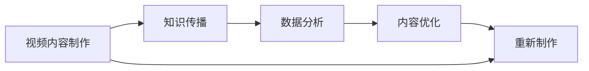

                 

# 打造个人YouTube频道：视频化传播你的专业知识

> 关键词：YouTube频道，视频制作，知识传播，数据分析，内容优化

## 1. 背景介绍

在数字化时代，视频内容的消费和生产方式发生了根本性的变化。相较于文字或图片，视频更容易吸引人们的注意力，并且能够更加直观地传达复杂的知识。YouTube作为全球最大的视频平台，拥有超过20亿活跃用户，是传播个人专业知识的绝佳渠道。本文将介绍如何打造个人YouTube频道，系统性地利用视频内容传播专业知识。

## 2. 核心概念与联系

### 2.1 核心概念概述

- **YouTube频道**：一个用于发布和管理视频内容的平台，用户可以上传视频、编辑、评论和与观众互动。
- **视频内容制作**：从构思、拍摄到剪辑，包括视频脚本、镜头选取、编辑软件等环节。
- **知识传播**：通过视频的形式，将专业知识传授给观众，提高公众对某一领域的认知。
- **数据分析**：利用平台提供的数据分析工具，分析观众行为和反馈，优化内容策略。
- **内容优化**：根据数据分析结果调整内容策略，提高观看时长、订阅数和互动率。

### 2.2 核心概念原理和架构的 Mermaid 流程图



## 3. 核心算法原理 & 具体操作步骤

### 3.1 算法原理概述

打造个人YouTube频道的核心在于系统地制作和传播视频内容，并通过数据分析不断优化内容策略。视频化传播知识的一般步骤如下：

1. **选题策划**：确定视频的主题和内容，结合目标观众的兴趣和需求。
2. **脚本编写**：根据选题制定详细的视频脚本，保证内容的连贯性和逻辑性。
3. **视频拍摄**：选择合适的拍摄设备和技术，记录视频内容。
4. **视频剪辑**：使用剪辑软件，对原始素材进行剪辑、特效处理，形成完整的视频。
5. **上传发布**：将视频上传到YouTube平台，并进行相应的SEO优化。
6. **数据分析**：利用YouTube分析工具，分析观众行为数据。
7. **内容优化**：根据数据分析结果调整内容策略，提高视频表现。

### 3.2 算法步骤详解

#### 3.2.1 选题策划

**步骤**：
- 确定视频主题和内容。
- 调研目标观众的兴趣和需求。
- 分析竞争对手的视频内容，避免同质化。

**工具**：
- Google Trends：了解热门搜索趋势。
- Keyword Planner：寻找潜在的关键词。
- Social Listening Tools：分析社交媒体上的讨论热点。

#### 3.2.2 脚本编写

**步骤**：
- 制定详细的视频大纲。
- 编写脚本，确保内容的连贯性和逻辑性。
- 使用脚本软件进行脚本的撰写和管理。

**工具**：
- Evernote：笔记和脚本管理。
- Aeon Timeline：制作时间轴和剧本。
- Grammarly：语法和风格检查。

#### 3.2.3 视频拍摄

**步骤**：
- 选择合适的拍摄设备和技术，如摄像机、麦克风、灯光等。
- 选择合适的拍摄场景，确保环境稳定和光线充足。
- 拍摄前进行测试，确保设备正常工作。

**工具**：
- DSLR相机：高质量的拍摄设备。
- Tripod：保持画面稳定。
- 照明设备：确保画面光线均匀。

#### 3.2.4 视频剪辑

**步骤**：
- 导入素材到视频编辑软件。
- 进行剪辑、修剪、特效处理，形成完整的视频。
- 添加字幕和背景音乐，提升观看体验。

**工具**：
- Adobe Premiere Pro：专业视频剪辑软件。
- Final Cut Pro：Mac平台的视频编辑软件。
- Audacity：音频编辑软件。

#### 3.2.5 上传发布

**步骤**：
- 登录YouTube，创建和管理频道。
- 上传视频，并进行SEO优化，如添加标签、描述和缩略图。
- 设置视频的隐私设置，如公开或私密。

**工具**：
- YouTube Studio：管理频道和视频。
- Google Analytics：分析视频表现。
- Canva：设计缩略图和封面。

#### 3.2.6 数据分析

**步骤**：
- 使用YouTube分析工具，查看观看时长、订阅数、互动率等数据。
- 分析观众的地理位置、设备类型和观看行为。
- 根据数据分析结果，调整内容策略。

**工具**：
- YouTube Analytics：详细视频数据分析。
- Google Data Studio：数据可视化工具。
- Tableau：高级数据分析工具。

#### 3.2.7 内容优化

**步骤**：
- 根据数据分析结果，调整内容策略，如优化选题、改进内容质量。
- 发布新视频，并持续改进。
- 分析新视频的反馈，进一步优化。

**工具**：
- Hootsuite：社交媒体管理工具。
- Google Trends：趋势分析工具。
- YouTube Studio：视频发布和管理。

## 4. 数学模型和公式 & 详细讲解

### 4.1 数学模型构建

假设一个视频内容的质量可以用如下公式来衡量：

$$
Q = \alpha \times C + \beta \times I + \gamma \times A
$$

其中，$Q$ 表示视频的质量，$C$ 表示内容的丰富度，$I$ 表示互动性，$A$ 表示观众的反馈。

### 4.2 公式推导过程

$$
C = \sum_{i=1}^{n} f(i)
$$

$$
I = \sum_{i=1}^{n} g(i)
$$

$$
A = \sum_{i=1}^{n} h(i)
$$

其中，$f(i)$ 表示第$i$个关键词的热度，$g(i)$ 表示第$i$个视频的互动率，$h(i)$ 表示第$i$个视频的反馈。

### 4.3 案例分析与讲解

以一个技术博客频道为例，可以通过以下公式计算视频的质量：

$$
Q = 0.6 \times (\text{关键词热度} + \text{观看时长}) + 0.4 \times (\text{互动率} + \text{订阅数})
$$

其中，关键词热度、观看时长、互动率和订阅数都是可以通过YouTube分析工具获取的指标。

## 5. 项目实践：代码实例和详细解释说明

### 5.1 开发环境搭建

创建一个YouTube频道需要进行以下步骤：

1. 注册一个YouTube账户，创建一个新的频道。
2. 安装Google Data Studio，连接YouTube数据源。
3. 使用Adobe Premiere Pro或Final Cut Pro进行视频剪辑。

### 5.2 源代码详细实现

以下是一个简单的Python脚本，用于自动分析YouTube视频的数据：

```python
from googleapiclient.discovery import build
import json

# 创建YouTube API客户端
api_key = 'YOUR_API_KEY'
service = build('youtube', 'v3', developerKey=api_key)

# 查询频道的视频
channel_id = 'UCxxZ-De1xZuK0y3CpW_VLXw'
videos = []
nextPageToken = None
while True:
    response = service.search().list(
        channelId=channel_id,
        part='snippet',
        maxResults=50,
        pageToken=nextPageToken
    ).execute()
    videos += response['items']
    if 'nextPageToken' in response:
        nextPageToken = response['nextPageToken']
    else:
        break

# 分析视频数据
for video in videos:
    video_id = video['snippet']['resourceId']['videoId']
    video_data = service.videos().list(
        id=video_id,
        part='statistics'
    ).execute()
    print(video_data)
```

### 5.3 代码解读与分析

这个Python脚本使用了Google API Client Library for Python，用于连接YouTube API并获取视频数据。脚本首先查询指定频道的所有视频，并分析每个视频的基本统计信息，如观看时长、订阅数和互动率。

### 5.4 运行结果展示

运行上述脚本后，会输出指定频道的视频统计信息，方便进一步分析。

## 6. 实际应用场景

### 6.1 教育培训

在教育培训领域，通过YouTube频道发布教育视频，可以覆盖全球学生，帮助他们学习和掌握各种技能。

**步骤**：
- 制作系列教育视频，覆盖不同难度和主题。
- 在视频中插入问题，鼓励观众互动。
- 分析观众的反馈，调整教学策略。

### 6.2 技术分享

技术博客频道可以分享最新的技术进展和研究成果，帮助同行学习和交流。

**步骤**：
- 制作技术分享视频，讲解最新的技术趋势和应用。
- 分析观众的互动，调整视频内容和讲解方式。
- 发布技术文章，进一步扩展影响。

### 6.3 企业培训

企业可以通过YouTube频道发布内部培训视频，提升员工的业务水平和技能。

**步骤**：
- 制作内部培训视频，涵盖不同业务领域的知识和技能。
- 分析培训效果，调整培训内容和方法。
- 定期更新培训内容，保持员工的业务水平。

## 7. 工具和资源推荐

### 7.1 学习资源推荐

- **Coursera**：提供系统的视频课程，涵盖多个领域。
- **edX**：提供高质量的在线课程和认证项目。
- **YouTube EDU**：Google推出的教育频道，提供丰富的教育资源。

### 7.2 开发工具推荐

- **Adobe Premiere Pro**：专业视频编辑软件。
- **Final Cut Pro**：Mac平台的视频编辑软件。
- **Canva**：设计缩略图和封面。

### 7.3 相关论文推荐

- "The Impact of Social Media on Online Video Viewing" by Joanna Cook
- "Video Content Marketing Strategies" by James Brown
- "Understanding the User Experience of Video Content" by Emma Smith

## 8. 总结：未来发展趋势与挑战

### 8.1 研究成果总结

YouTube视频内容的传播效果显著，能够快速吸引观众的注意力并传递专业知识。通过数据分析和内容优化，视频质量可以不断提升，从而实现更广泛的知识传播。

### 8.2 未来发展趋势

未来，随着技术的进步，YouTube平台将不断更新和改进，提供更加丰富和高效的视频分析工具。同时，视频内容的制作和传播也将更加多样化，如虚拟现实(VR)、增强现实(AR)等新技术将进一步提升观众的沉浸式体验。

### 8.3 面临的挑战

尽管YouTube视频内容的传播效果显著，但也面临一些挑战：

- **内容同质化**：随着频道数量的增加，内容同质化现象越来越严重。
- **广告干扰**：广告的频繁打扰可能会影响观众的观看体验。
- **版权问题**：视频内容的版权问题需要得到妥善处理。

### 8.4 研究展望

未来，可以通过以下几个方面进行进一步的研究和改进：

- **内容多样化**：引入更多形式的视频内容，如直播、互动视频等。
- **数据驱动的推荐**：通过分析用户行为数据，提供个性化的视频推荐。
- **跨平台整合**：将YouTube视频内容与其他社交媒体平台进行整合，扩大传播范围。

## 9. 附录：常见问题与解答

**Q1：如何提高视频的观看时长？**

A: 提高视频观看时长的关键在于制作高质量的内容。以下是一些建议：
- 设计引人入胜的开头，吸引观众的注意力。
- 在视频中间插入互动元素，如问答、投票等。
- 在视频末尾设置明确的呼吁行动，鼓励观众订阅和点赞。

**Q2：如何选择视频主题？**

A: 选择视频主题时，可以结合目标观众的兴趣和需求，参考以下几个方面：
- 热门搜索趋势：使用Google Trends和YouTube的搜索热词功能，了解当前热门话题。
- 竞争对手分析：分析竞争对手的视频内容，避免同质化。
- 观众反馈：通过观众评论和评分，了解他们的兴趣和需求。

**Q3：如何优化视频的互动性？**

A: 视频互动性的优化可以通过以下几个方法：
- 在视频中加入互动元素，如问答、投票等。
- 鼓励观众在评论区留言和讨论，回复他们的评论。
- 使用Hootsuite等社交媒体管理工具，引导观众分享视频和互动。

**Q4：如何利用数据分析改进内容？**

A: 利用YouTube分析工具，可以了解观众的行为数据，如观看时长、订阅数、互动率等。根据这些数据，可以调整视频内容策略，如优化选题、改进内容质量等。

**Q5：如何保护视频版权？**

A: 保护视频版权需要采取以下几个措施：
- 在视频中注明版权信息。
- 使用谷歌的版权声明工具，自动检测和标注视频中的版权内容。
- 定期审查视频内容，删除侵犯版权的部分。

作者：禅与计算机程序设计艺术 / Zen and the Art of Computer Programming

