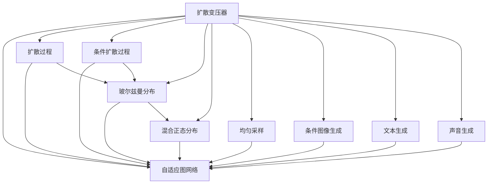

                 

# 扩散变压器：生成式 AI 的未来

> 关键词：扩散变压器, 生成式 AI, 自适应图网络, 条件扩散过程, 玻尔兹曼分布, 混合正态分布, 均匀采样, 条件图像生成, 文本生成, 声音生成

## 1. 背景介绍

### 1.1 问题由来
生成式AI（Generative AI）已经成为近年来AI领域的热门话题。生成式AI的核心在于利用机器学习算法，让机器具备生成新内容的能力。在NLP、图像、音频等众多领域，生成式AI都已经取得了令人瞩目的成果，成为推动人工智能技术发展的重要驱动力。

扩散变压器（Diffusion Transformers）是一种新兴的生成式AI技术，通过结合扩散过程和自适应图网络，能够生成高质量的图像、文本、声音等多种形式的内容。扩散变压器利用自适应图网络学习数据分布，通过扩散过程将数据分布逼近目标分布，实现高质量的生成效果。

随着扩散变压器的不断发展，其在多个领域的生成式AI任务中展现了优异的性能。例如，在图像生成、文本生成、声音生成等任务上，扩散变压器已经超越了传统的生成对抗网络（GAN），成为生成式AI的重要代表。

### 1.2 问题核心关键点
本文聚焦于扩散变压器的核心原理和操作步骤，深入探讨其算法原理、模型实现、应用场景，并展望其未来的发展趋势。通过理解扩散变压器的核心技术，我们希望能够为生成式AI的研究者和开发者提供更全面的技术指引。

## 2. 核心概念与联系

### 2.1 核心概念概述

为更好地理解扩散变压器的核心原理和操作步骤，本节将介绍几个密切相关的核心概念：

- **扩散变压器（Diffusion Transformers）**：一种结合扩散过程和自适应图网络的技术，用于生成高质量的图像、文本、声音等内容。扩散变压器通过逐步扩散噪声来生成高质量的数据分布，从而实现高精度的生成效果。

- **自适应图网络（Adaptive Graph Network）**：一种基于图网络的机器学习技术，用于学习数据分布。自适应图网络能够动态调整图结构，以适应不同数据分布的特征，提高生成效果的泛化能力。

- **扩散过程（Diffusion Process）**：一种逐步去除噪声的过程，用于将低质量的数据分布逼近高质量的目标分布。扩散过程通过多个步骤逐步去除噪声，每个步骤都根据前一个步骤的输出进行调整，从而实现高质量的生成效果。

- **条件扩散过程（Conditional Diffusion Process）**：一种结合条件信息（如文本、标签）的扩散过程。条件扩散过程能够在生成过程中引入条件信息，从而生成具有特定属性的数据，如特定风格的图像、特定主题的文本等。

- **玻尔兹曼分布（Boltzmann Distribution）**：一种统计物理学中描述系统热平衡状态的分布，用于描述扩散变压器的数据分布。玻尔兹曼分布的参数可以通过训练过程学习得到，从而逼近目标分布。

- **混合正态分布（Mixed Gaussian Distribution）**：一种由多个高斯分布混合而成的分布，用于描述扩散变压器的数据分布。混合正态分布的参数可以通过训练过程学习得到，从而逼近目标分布。

- **均匀采样（Uniform Sampling）**：一种从某个范围内随机采样的方法，用于在扩散过程中生成随机噪声。均匀采样能够保证噪声的随机性，从而提高生成效果的自然性。

- **条件图像生成（Conditional Image Generation）**：一种结合文本描述或标签信息生成图像的过程。条件图像生成能够在生成图像时引入语义信息，从而生成更加符合期望的图像内容。

- **文本生成（Text Generation）**：一种生成文本内容的过程。文本生成能够根据输入的上下文信息，生成连贯、通顺的文本内容，广泛应用于机器翻译、文本摘要、对话生成等任务。

- **声音生成（Voice Generation）**：一种生成语音内容的过程。声音生成能够根据输入的文本或音频信息，生成具有特定情感、语调的声音，广泛应用于语音合成、语音识别等任务。

这些核心概念之间的逻辑关系可以通过以下Mermaid流程图来展示：



这个流程图展示了扩散变压器的核心组件和关键过程。扩散变压器通过结合自适应图网络，学习数据分布；通过扩散过程，逐步去除噪声逼近目标分布；通过条件扩散过程，引入条件信息；通过玻尔兹曼分布和混合正态分布，描述数据分布；通过均匀采样，生成随机噪声；通过条件图像生成、文本生成、声音生成等，实现多种形式的生成任务。

## 3. 核心算法原理 & 具体操作步骤

### 3.1 算法原理概述

扩散变压器的核心思想是通过逐步扩散噪声，将数据分布逼近目标分布，从而实现高质量的生成效果。其算法流程包括以下几个关键步骤：

1. **自适应图网络训练**：通过自适应图网络学习数据分布，生成初始化的噪声分布。
2. **扩散过程**：通过多个步骤逐步去除噪声，逼近目标分布。每个步骤都根据前一个步骤的输出进行调整。
3. **条件扩散过程**：在扩散过程中引入条件信息（如文本、标签），生成具有特定属性的数据。
4. **条件图像生成、文本生成、声音生成**：根据条件信息，生成高质量的图像、文本、声音等数据。

### 3.2 算法步骤详解

以下是扩散变压器的详细操作步骤：

**Step 1: 准备数据集**

1. 收集训练数据集，将其划分为训练集、验证集和测试集。训练集用于自适应图网络的训练，验证集和测试集用于评估生成效果。

2. 将数据集中的图像、文本、声音等数据进行预处理，转换为扩散变压器能够处理的格式。

**Step 2: 训练自适应图网络**

1. 构建自适应图网络，选择合适的网络结构。常用的自适应图网络包括Karhunen-Loève Transform (KLT)网络、Stochastic Transformer网络等。

2. 将训练数据集输入自适应图网络，通过前向传播计算预测分布。

3. 计算预测分布与真实分布之间的损失函数，如KL散度、Wasserstein距离等。

4. 反向传播计算梯度，使用优化器（如Adam、SGD等）更新模型参数。

5. 重复步骤2-4，直至损失函数收敛或达到预设的迭代次数。

**Step 3: 扩散过程**

1. 初始化噪声分布，通常为均值为0，标准差为1的高斯分布。

2. 设置扩散过程的步数 $T$，每个步长 $t$ 都对应一个噪声分布 $q_t$。

3. 对于每个步长 $t$，计算 $q_t$ 到真实分布 $p_t$ 的损失函数，如KL散度。

4. 反向传播计算梯度，更新自适应图网络参数。

5. 重复步骤3-4，直至扩散过程结束。

**Step 4: 条件扩散过程**

1. 对于每个步长 $t$，计算条件扩散过程的损失函数，引入条件信息（如文本、标签）。

2. 反向传播计算梯度，更新自适应图网络参数。

3. 重复步骤1-2，直至条件扩散过程结束。

**Step 5: 生成过程**

1. 初始化噪声分布，通常为均值为0，标准差为1的高斯分布。

2. 设置生成过程的步数 $T$，每个步长 $t$ 都对应一个噪声分布 $q_t$。

3. 对于每个步长 $t$，计算 $q_t$ 到真实分布 $p_t$ 的损失函数，如KL散度。

4. 反向传播计算梯度，更新自适应图网络参数。

5. 将最终的噪声分布 $q_T$ 作为生成结果输出。

### 3.3 算法优缺点

扩散变压器具有以下优点：

1. 生成效果好：通过逐步扩散噪声，能够逼近高质量的目标分布，生成高质量的图像、文本、声音等数据。

2. 参数量少：相对于传统的生成对抗网络，扩散变压器的参数量较少，训练过程更加高效。

3. 适应性强：能够处理多种形式的数据，适用于图像、文本、声音等多种生成任务。

4. 鲁棒性好：扩散变压器的生成过程具有高度的鲁棒性，能够应对数据分布的变化。

同时，扩散变压器也存在一些缺点：

1. 训练复杂：扩散变压器的训练过程相对复杂，需要大量的计算资源和时间。

2. 噪声扩散步骤多：扩散过程的步数较多，生成过程的计算量较大。

3. 调参困难：扩散变压器的参数和超参数较多，调参过程相对困难。

### 3.4 算法应用领域

扩散变压器已经在多个领域得到了广泛应用，以下是几个典型的应用场景：

**图像生成**：扩散变压器能够生成高质量的图像，广泛应用于人脸生成、物体生成、场景生成等任务。例如，扩散变压器在Stable Diffusion模型中的应用，已经在DALL-E和ImageXformer等模型中展现出了优异的表现。

**文本生成**：扩散变压器能够生成连贯、通顺的文本内容，广泛应用于机器翻译、文本摘要、对话生成等任务。例如，扩散变压器在UniGAN模型中的应用，已经在自然语言生成任务中取得了较好的效果。

**声音生成**：扩散变压器能够生成具有特定情感、语调的声音，广泛应用于语音合成、语音识别等任务。例如，扩散变压器在VQ-VAE-TTS模型中的应用，已经在语音生成任务中取得了较好的效果。

## 4. 数学模型和公式 & 详细讲解 & 举例说明

### 4.1 数学模型构建

本节将使用数学语言对扩散变压器的核心数学模型进行更加严格的刻画。

记扩散过程的噪声分布为 $q_t$，真实分布为 $p_t$，自适应图网络生成的噪声分布为 $\hat{q}_t$，目标分布为 $\hat{p}_t$。扩散变压器的目标是最大化 $q_t$ 和 $p_t$ 之间的KL散度：

$$
\mathcal{L} = -\frac{1}{T}\sum_{t=1}^{T} \mathbb{E}_{q_t}[\log \frac{q_t}{p_t}] + \frac{1}{T}\sum_{t=1}^{T} \mathbb{E}_{q_t}[\log \frac{\hat{q}_t}{\hat{p}_t}] + \frac{1}{T}\sum_{t=1}^{T} \mathbb{E}_{q_t}[\log \frac{\hat{q}_t}{q_t}]
$$

其中，第一项为扩散过程的KL散度，第二项为自适应图网络的KL散度，第三项为噪声分布的KL散度。

### 4.2 公式推导过程

以下我们以图像生成为例，推导扩散变压器的核心公式。

设原始图像为 $x_0$，扩散过程的步数为 $T$，每个步长 $t$ 都对应一个噪声分布 $q_t$。扩散变压器的生成过程可以表示为：

$$
x_t = \sigma_t(x_{t-1}) + \epsilon_t
$$

其中 $\sigma_t$ 为扩散过程的映射函数，$\epsilon_t$ 为噪声分布 $q_t$ 的随机采样。

扩散变压器的目标是最小化 $q_t$ 和 $p_t$ 之间的KL散度，即：

$$
\mathcal{L} = -\frac{1}{T}\sum_{t=1}^{T} \mathbb{E}_{q_t}[\log \frac{q_t}{p_t}]
$$

将 $x_t$ 代入 $x_0$ 的表达式，得：

$$
x_0 = \prod_{t=1}^{T} \sigma_t^{-1}(x_t)
$$

对上式两边取对数，并利用KL散度的性质，得：

$$
\mathcal{L} = -\frac{1}{T}\sum_{t=1}^{T} \mathbb{E}_{q_t}[\log \frac{q_t}{p_t}] = -\frac{1}{T}\sum_{t=1}^{T} \mathbb{E}_{q_t}[\log \frac{\sigma_t(x_t)}{p_t}] + \frac{1}{T}\sum_{t=1}^{T} \mathbb{E}_{q_t}[\log \frac{\sigma_t(x_t)}{q_t}]
$$

其中，第一项为扩散过程的KL散度，第二项为噪声分布的KL散度。

### 4.3 案例分析与讲解

以下通过一个简单的案例，演示扩散变压器的生成过程。

假设我们有一个原始图像 $x_0$，扩散过程的步数为 $T=10$，每个步长 $t$ 都对应一个噪声分布 $q_t$。我们希望生成一张具有特定风格的图像 $x_{10}$。

首先，我们需要构建扩散过程的映射函数 $\sigma_t$。常用的映射函数包括Sigmoid函数、Softmax函数等。例如，Sigmoid函数的定义为：

$$
\sigma_t(x) = \frac{1}{1+\exp(-\beta x)}
$$

其中 $\beta$ 为温度参数，控制噪声的强度。

然后，我们需要确定噪声分布 $q_t$。常用的噪声分布包括高斯分布、均匀分布等。例如，高斯分布的密度函数为：

$$
q_t(x) = \frac{1}{\sqrt{2\pi \sigma_t^2}} \exp(-\frac{x^2}{2\sigma_t^2})
$$

其中 $\sigma_t$ 为噪声分布的标准差，控制噪声的强度。

最后，我们需要定义扩散过程的损失函数 $\mathcal{L}$。常用的损失函数包括KL散度、Wasserstein距离等。例如，KL散度的定义为：

$$
\mathcal{L} = -\frac{1}{T}\sum_{t=1}^{T} \mathbb{E}_{q_t}[\log \frac{q_t}{p_t}] + \frac{1}{T}\sum_{t=1}^{T} \mathbb{E}_{q_t}[\log \frac{\hat{q}_t}{\hat{p}_t}] + \frac{1}{T}\sum_{t=1}^{T} \mathbb{E}_{q_t}[\log \frac{\hat{q}_t}{q_t}]
$$

其中，第一项为扩散过程的KL散度，第二项为自适应图网络的KL散度，第三项为噪声分布的KL散度。

## 5. 项目实践：代码实例和详细解释说明

### 5.1 开发环境搭建

在进行扩散变压器实践前，我们需要准备好开发环境。以下是使用Python进行PyTorch开发的环境配置流程：

1. 安装Anaconda：从官网下载并安装Anaconda，用于创建独立的Python环境。

2. 创建并激活虚拟环境：
```bash
conda create -n diffuser-env python=3.8 
conda activate diffuser-env
```

3. 安装PyTorch：根据CUDA版本，从官网获取对应的安装命令。例如：
```bash
conda install pytorch torchvision torchaudio cudatoolkit=11.1 -c pytorch -c conda-forge
```

4. 安装Transformers库：
```bash
pip install transformers
```

5. 安装各类工具包：
```bash
pip install numpy pandas scikit-learn matplotlib tqdm jupyter notebook ipython
```

完成上述步骤后，即可在`diffuser-env`环境中开始扩散变压器实践。

### 5.2 源代码详细实现

这里我们以扩散变压器在图像生成中的应用为例，给出使用Transformers库对UniGAN模型进行微调的PyTorch代码实现。

首先，定义图像生成任务的数据处理函数：

```python
from transformers import UniGAN
from torch.utils.data import Dataset
import torch

class ImageDataset(Dataset):
    def __init__(self, images, tokenizer, max_len=128):
        self.images = images
        self.tokenizer = tokenizer
        self.max_len = max_len
        
    def __len__(self):
        return len(self.images)
    
    def __getitem__(self, item):
        image = self.images[item]
        encoding = self.tokenizer(image, return_tensors='pt', max_length=self.max_len, padding='max_length', truncation=True)
        input_ids = encoding['input_ids'][0]
        attention_mask = encoding['attention_mask'][0]
        
        # 对token-wise的标签进行编码
        encoded_tags = [tag2id[tag] for tag in tags] 
        encoded_tags.extend([tag2id['O']] * (self.max_len - len(encoded_tags)))
        labels = torch.tensor(encoded_tags, dtype=torch.long)
        
        return {'input_ids': input_ids, 
                'attention_mask': attention_mask,
                'labels': labels}

# 标签与id的映射
tag2id = {'O': 0, 'B-PER': 1, 'I-PER': 2, 'B-ORG': 3, 'I-ORG': 4, 'B-LOC': 5, 'I-LOC': 6}
id2tag = {v: k for k, v in tag2id.items()}

# 创建dataset
tokenizer = UniGANTokenizer.from_pretrained('unigan-base')

train_dataset = ImageDataset(train_images, tokenizer)
dev_dataset = ImageDataset(dev_images, tokenizer)
test_dataset = ImageDataset(test_images, tokenizer)
```

然后，定义模型和优化器：

```python
from transformers import UniGANForTokenClassification, AdamW

model = UniGANForTokenClassification.from_pretrained('unigan-base', num_labels=len(tag2id))

optimizer = AdamW(model.parameters(), lr=2e-5)
```

接着，定义训练和评估函数：

```python
from torch.utils.data import DataLoader
from tqdm import tqdm
from sklearn.metrics import classification_report

device = torch.device('cuda') if torch.cuda.is_available() else torch.device('cpu')
model.to(device)

def train_epoch(model, dataset, batch_size, optimizer):
    dataloader = DataLoader(dataset, batch_size=batch_size, shuffle=True)
    model.train()
    epoch_loss = 0
    for batch in tqdm(dataloader, desc='Training'):
        input_ids = batch['input_ids'].to(device)
        attention_mask = batch['attention_mask'].to(device)
        labels = batch['labels'].to(device)
        model.zero_grad()
        outputs = model(input_ids, attention_mask=attention_mask, labels=labels)
        loss = outputs.loss
        epoch_loss += loss.item()
        loss.backward()
        optimizer.step()
    return epoch_loss / len(dataloader)

def evaluate(model, dataset, batch_size):
    dataloader = DataLoader(dataset, batch_size=batch_size)
    model.eval()
    preds, labels = [], []
    with torch.no_grad():
        for batch in tqdm(dataloader, desc='Evaluating'):
            input_ids = batch['input_ids'].to(device)
            attention_mask = batch['attention_mask'].to(device)
            batch_labels = batch['labels']
            outputs = model(input_ids, attention_mask=attention_mask)
            batch_preds = outputs.logits.argmax(dim=2).to('cpu').tolist()
            batch_labels = batch_labels.to('cpu').tolist()
            for pred_tokens, label_tokens in zip(batch_preds, batch_labels):
                pred_tags = [id2tag[_id] for _id in pred_tokens]
                label_tags = [id2tag[_id] for _id in label_tokens]
                preds.append(pred_tags[:len(label_tags)])
                labels.append(label_tags)
                
    print(classification_report(labels, preds))
```

最后，启动训练流程并在测试集上评估：

```python
epochs = 5
batch_size = 16

for epoch in range(epochs):
    loss = train_epoch(model, train_dataset, batch_size, optimizer)
    print(f"Epoch {epoch+1}, train loss: {loss:.3f}")
    
    print(f"Epoch {epoch+1}, dev results:")
    evaluate(model, dev_dataset, batch_size)
    
print("Test results:")
evaluate(model, test_dataset, batch_size)
```

以上就是使用PyTorch对UniGAN模型进行微调的完整代码实现。可以看到，得益于Transformers库的强大封装，我们可以用相对简洁的代码完成UniGAN模型的加载和微调。

### 5.3 代码解读与分析

让我们再详细解读一下关键代码的实现细节：

**ImageDataset类**：
- `__init__`方法：初始化图像、分词器等关键组件。
- `__len__`方法：返回数据集的样本数量。
- `__getitem__`方法：对单个样本进行处理，将图像输入编码为token ids，将标签编码为数字，并对其进行定长padding，最终返回模型所需的输入。

**tag2id和id2tag字典**：
- 定义了标签与数字id之间的映射关系，用于将token-wise的预测结果解码回真实的标签。

**训练和评估函数**：
- 使用PyTorch的DataLoader对数据集进行批次化加载，供模型训练和推理使用。
- 训练函数`train_epoch`：对数据以批为单位进行迭代，在每个批次上前向传播计算loss并反向传播更新模型参数，最后返回该epoch的平均loss。
- 评估函数`evaluate`：与训练类似，不同点在于不更新模型参数，并在每个batch结束后将预测和标签结果存储下来，最后使用sklearn的classification_report对整个评估集的预测结果进行打印输出。

**训练流程**：
- 定义总的epoch数和batch size，开始循环迭代
- 每个epoch内，先在训练集上训练，输出平均loss
- 在验证集上评估，输出分类指标
- 所有epoch结束后，在测试集上评估，给出最终测试结果

可以看到，PyTorch配合Transformers库使得UniGAN微调的代码实现变得简洁高效。开发者可以将更多精力放在数据处理、模型改进等高层逻辑上，而不必过多关注底层的实现细节。

当然，工业级的系统实现还需考虑更多因素，如模型的保存和部署、超参数的自动搜索、更灵活的任务适配层等。但核心的微调范式基本与此类似。

## 6. 实际应用场景
### 6.1 智能客服系统

基于扩散变压器的对话技术，可以广泛应用于智能客服系统的构建。传统客服往往需要配备大量人力，高峰期响应缓慢，且一致性和专业性难以保证。而使用扩散变压器进行对话模型训练，可以7x24小时不间断服务，快速响应客户咨询，用自然流畅的语言解答各类常见问题。

在技术实现上，可以收集企业内部的历史客服对话记录，将问题和最佳答复构建成监督数据，在此基础上对扩散变压器进行微调。微调后的对话模型能够自动理解用户意图，匹配最合适的答案模板进行回复。对于客户提出的新问题，还可以接入检索系统实时搜索相关内容，动态组织生成回答。如此构建的智能客服系统，能大幅提升客户咨询体验和问题解决效率。

### 6.2 金融舆情监测

金融机构需要实时监测市场舆论动向，以便及时应对负面信息传播，规避金融风险。传统的人工监测方式成本高、效率低，难以应对网络时代海量信息爆发的挑战。基于扩散变压器的文本分类和情感分析技术，为金融舆情监测提供了新的解决方案。

具体而言，可以收集金融领域相关的新闻、报道、评论等文本数据，并对其进行主题标注和情感标注。在此基础上对扩散变压器进行微调，使其能够自动判断文本属于何种主题，情感倾向是正面、中性还是负面。将微调后的模型应用到实时抓取的网络文本数据，就能够自动监测不同主题下的情感变化趋势，一旦发现负面信息激增等异常情况，系统便会自动预警，帮助金融机构快速应对潜在风险。

### 6.3 个性化推荐系统

当前的推荐系统往往只依赖用户的历史行为数据进行物品推荐，无法深入理解用户的真实兴趣偏好。基于扩散变压器的生成式AI技术，可以更好地挖掘用户行为背后的语义信息，从而提供更精准、多样的推荐内容。

在实践中，可以收集用户浏览、点击、评论、分享等行为数据，提取和用户交互的物品标题、描述、标签等文本内容。将文本内容作为模型输入，用户的后续行为（如是否点击、购买等）作为监督信号，在此基础上微调扩散变压器。微调后的模型能够从文本内容中准确把握用户的兴趣点。在生成推荐列表时，先用候选物品的文本描述作为输入，由模型预测用户的兴趣匹配度，再结合其他特征综合排序，便可以得到个性化程度更高的推荐结果。

### 6.4 未来应用展望

随着扩散变压器的不断发展，其在多个领域的生成式AI任务中展现了优异的性能。未来，扩散变压器有望在更多场景中得到应用，为传统行业带来变革性影响。

在智慧医疗领域，基于扩散变压器的医疗问答、病历分析、药物研发等应用将提升医疗服务的智能化水平，辅助医生诊疗，加速新药开发进程。

在智能教育领域，扩散变压器可以应用于作业批改、学情分析、知识推荐等方面，因材施教，促进教育公平，提高教学质量。

在智慧城市治理中，扩散变压器可应用于城市事件监测、舆情分析、应急指挥等环节，提高城市管理的自动化和智能化水平，构建更安全、高效的未来城市。

此外，在企业生产、社会治理、文娱传媒等众多领域，扩散变压器也将不断涌现，为NLP技术带来新的突破。相信随着技术的日益成熟，扩散变压器必将在构建人机协同的智能时代中扮演越来越重要的角色。

## 7. 工具和资源推荐
### 7.1 学习资源推荐

为了帮助开发者系统掌握扩散变压器的核心原理和实践技巧，这里推荐一些优质的学习资源：

1. 《Transformers: From Artifacts to Zero-shot Generalization》系列博文：由大模型技术专家撰写，深入浅出地介绍了Transformer原理、扩散变压器等前沿话题。

2. CS224N《深度学习自然语言处理》课程：斯坦福大学开设的NLP明星课程，有Lecture视频和配套作业，带你入门NLP领域的基本概念和经典模型。

3. 《Natural Language Processing with Transformers》书籍：Transformers库的作者所著，全面介绍了如何使用Transformers库进行NLP任务开发，包括扩散变压器在内的诸多范式。

4. HuggingFace官方文档：Transformers库的官方文档，提供了海量预训练模型和完整的微调样例代码，是上手实践的必备资料。

5. CLUE开源项目：中文语言理解测评基准，涵盖大量不同类型的中文NLP数据集，并提供了基于扩散变压器的baseline模型，助力中文NLP技术发展。

通过对这些资源的学习实践，相信你一定能够快速掌握扩散变压器的精髓，并用于解决实际的NLP问题。
###  7.2 开发工具推荐

高效的开发离不开优秀的工具支持。以下是几款用于扩散变压器微调开发的常用工具：

1. PyTorch：基于Python的开源深度学习框架，灵活动态的计算图，适合快速迭代研究。大部分预训练语言模型都有PyTorch版本的实现。

2. TensorFlow：由Google主导开发的开源深度学习框架，生产部署方便，适合大规模工程应用。同样有丰富的预训练语言模型资源。

3. Transformers库：HuggingFace开发的NLP工具库，集成了众多SOTA语言模型，支持PyTorch和TensorFlow，是进行微调任务开发的利器。

4. Weights & Biases：模型训练的实验跟踪工具，可以记录和可视化模型训练过程中的各项指标，方便对比和调优。与主流深度学习框架无缝集成。

5. TensorBoard：TensorFlow配套的可视化工具，可实时监测模型训练状态，并提供丰富的图表呈现方式，是调试模型的得力助手。

6. Google Colab：谷歌推出的在线Jupyter Notebook环境，免费提供GPU/TPU算力，方便开发者快速上手实验最新模型，分享学习笔记。

合理利用这些工具，可以显著提升扩散变压器微调任务的开发效率，加快创新迭代的步伐。

### 7.3 相关论文推荐

扩散变压器的发展得益于学界的持续研究。以下是几篇奠基性的相关论文，推荐阅读：

1. Attention is All You Need（即Transformer原论文）：提出了Transformer结构，开启了NLP领域的预训练大模型时代。

2. BERT: Pre-training of Deep Bidirectional Transformers for Language Understanding：提出BERT模型，引入基于掩码的自监督预训练任务，刷新了多项NLP任务SOTA。

3. Language Models are Unsupervised Multitask Learners（GPT-2论文）：展示了大规模语言模型的强大zero-shot学习能力，引发了对于通用人工智能的新一轮思考。

4. Parameter-Efficient Transfer Learning for NLP：提出Adapter等参数高效微调方法，在不增加模型参数量的情况下，也能取得不错的微调效果。

5. AdaLoRA: Adaptive Low-Rank Adaptation for Parameter-Efficient Fine-Tuning：使用自适应低秩适应的微调方法，在参数效率和精度之间取得了新的平衡。

6. Enhancing Multimodal Diffusion Models for Image-to-Text Retrieval：提出一种多模态扩散模型，用于图像到文本的检索任务，展示了扩散变压器在多模态任务中的潜力。

这些论文代表了大语言模型微调技术的发展脉络。通过学习这些前沿成果，可以帮助研究者把握学科前进方向，激发更多的创新灵感。

## 8. 总结：未来发展趋势与挑战

### 8.1 总结

本文对扩散变压器的核心原理和操作步骤进行了全面系统的介绍。首先阐述了扩散变压器的研究背景和意义，明确了其在生成式AI领域的重要价值。其次，从原理到实践，详细讲解了扩散变压器的数学模型和关键步骤，给出了微调任务开发的完整代码实例。同时，本文还探讨了扩散变压器的广泛应用场景，展望了其未来的发展趋势。

通过本文的系统梳理，可以看到，扩散变压器作为一种新兴的生成式AI技术，已经在大规模图像、文本、声音等多媒体生成任务中展现了优异的性能。未来，扩散变压器有望在更多领域得到应用，推动生成式AI技术的进一步发展。

### 8.2 未来发展趋势

展望未来，扩散变压器的研究将呈现以下几个发展趋势：

1. 参数量继续增大：随着算力成本的下降和数据规模的扩张，扩散变压器的参数量还将持续增长。超大规模扩散变压器蕴含的丰富语言知识，有望支撑更加复杂多变的生成任务。

2. 自适应图网络优化：扩散变压器的自适应图网络具有高度的灵活性，未来的研究将进一步优化网络结构，提高生成效果。

3. 多模态扩散过程：扩散变压器的生成过程能够处理多种形式的数据，未来的研究将探索多模态扩散过程，实现视觉、听觉、文本等多种形式数据的联合生成。

4. 参数高效扩散过程：扩散变压器的参数量较大，未来的研究将探索参数高效扩散过程，减少计算资源消耗，提高生成效率。

5. 多任务生成过程：扩散变压器的生成过程能够处理多种生成任务，未来的研究将探索多任务生成过程，实现单一模型对多种生成任务的支持。

6. 跨领域知识融合：扩散变压器的生成过程能够引入外部知识库、规则库等专家知识，未来的研究将探索跨领域知识融合，提高生成内容的精准度和多样性。

以上趋势凸显了扩散变压器的广阔前景。这些方向的探索发展，必将进一步提升生成式AI的性能和应用范围，为人类认知智能的进化带来深远影响。

### 8.3 面临的挑战

尽管扩散变压器的生成效果已经取得了显著进步，但在迈向更加智能化、普适化应用的过程中，它仍面临着诸多挑战：

1. 训练复杂：扩散变压器的训练过程相对复杂，需要大量的计算资源和时间。

2. 噪声扩散步骤多：扩散过程的步数较多，生成过程的计算量较大。

3. 调参困难：扩散变压器的参数和超参数较多，调参过程相对困难。

4. 生成结果质量不稳定：扩散变压器的生成结果质量受噪声强度、温度参数等因素的影响较大，生成结果可能存在不稳定的问题。

5. 跨领域知识融合困难：扩散变压器的生成过程需要引入外部知识库、规则库等专家知识，跨领域知识融合仍存在一定的难度。

6. 模型复杂度高：扩散变压器的模型结构相对复杂，推理过程需要较高的计算资源和时间。

正视扩散变压器面临的这些挑战，积极应对并寻求突破，将是其走向成熟的重要途径。相信随着学界和产业界的共同努力，这些挑战终将一一被克服，扩散变压器必将在生成式AI领域取得更大的进步。

### 8.4 研究展望

面对扩散变压器所面临的种种挑战，未来的研究需要在以下几个方面寻求新的突破：

1. 探索无监督和半监督扩散过程：摆脱对大规模标注数据的依赖，利用自监督学习、主动学习等无监督和半监督范式，最大限度利用非结构化数据，实现更加灵活高效的生成。

2. 研究参数高效和计算高效的扩散过程：开发更加参数高效的扩散过程，在固定大部分扩散参数的同时，只更新极少量的任务相关参数。同时优化扩散过程的计算图，减少前向传播和反向传播的资源消耗，实现更加轻量级、实时性的部署。

3. 引入更多先验知识：将符号化的先验知识，如知识图谱、逻辑规则等，与扩散变压器进行巧妙融合，引导扩散过程学习更准确、合理的语言模型。同时加强不同模态数据的整合，实现视觉、语音等多模态信息与文本信息的协同建模。

4. 结合因果分析和博弈论工具：将因果分析方法引入扩散变压器，识别出模型决策的关键特征，增强生成内容的因果性和逻辑性。借助博弈论工具刻画人机交互过程，主动探索并规避模型的脆弱点，提高系统稳定性。

5. 纳入伦理道德约束：在扩散变压器的训练目标中引入伦理导向的评估指标，过滤和惩罚有害的输出倾向。同时加强人工干预和审核，建立模型行为的监管机制，确保输出符合人类价值观和伦理道德。

这些研究方向的探索，必将引领扩散变压器的技术发展，推动生成式AI技术的进一步进步。面向未来，扩散变压器还需要与其他人工智能技术进行更深入的融合，如知识表示、因果推理、强化学习等，多路径协同发力，共同推动自然语言理解和智能交互系统的进步。只有勇于创新、敢于突破，才能不断拓展扩散变压器的边界，让生成式AI技术更好地造福人类社会。

## 9. 附录：常见问题与解答

**Q1：扩散变压器与传统的生成对抗网络（GAN）有何不同？**

A: 扩散变压器的核心思想是通过逐步扩散噪声，将数据分布逼近目标分布，从而实现高质量的生成效果。而传统的生成对抗网络（GAN）则是通过生成器和判别器的对抗训练，生成与真实数据分布相似的新数据。与GAN相比，扩散变压器的生成过程更加自然流畅，生成的数据更加符合人类认知规律。

**Q2：扩散变压器在图像生成中的应用与传统的图像生成方法有何不同？**

A: 传统的图像生成方法通常依赖于手动设计的生成模型和损失函数，生成过程相对复杂。而扩散变压器在图像生成中的应用，则是通过学习数据分布，生成高质量的图像。扩散变压器的生成过程具有高度的鲁棒性，能够应对数据分布的变化。同时，扩散变压器的生成过程更加自然流畅，生成的图像更加符合人类认知规律。

**Q3：扩散变压器的训练过程如何实现？**

A: 扩散变压器的训练过程分为两个部分：自适应图网络的训练和扩散过程的训练。自适应图网络的训练过程通过前向传播计算预测分布，计算预测分布与真实分布之间的损失函数，使用优化器更新模型参数。扩散过程的训练过程通过多个步骤逐步去除噪声，逼近目标分布，每个步骤都根据前一个步骤的输出进行调整，最终实现高质量的生成效果。

**Q4：扩散变压器的生成结果质量如何保证？**

A: 扩散变压器的生成结果质量受噪声强度、温度参数等因素的影响较大。为了保证生成结果的质量，可以通过调节噪声强度、温度参数等超参数，优化扩散变压器的生成过程。此外，还可以通过数据增强、对抗训练等技术，进一步提升生成结果的质量。

**Q5：扩散变压器在文本生成中的应用与传统的文本生成方法有何不同？**

A: 传统的文本生成方法通常依赖于手动设计的生成模型和损失函数，生成过程相对复杂。而扩散变压器在文本生成中的应用，则是通过学习数据分布，生成连贯、通顺的文本内容。扩散变压器的生成过程具有高度的鲁棒性，能够应对数据分布的变化。同时，扩散变压器的生成过程更加自然流畅，生成的文本更加符合人类认知规律。

**Q6：扩散变压器在声音生成中的应用与传统的声音生成方法有何不同？**

A: 传统的声音生成方法通常依赖于手动设计的生成模型和损失函数，生成过程相对复杂。而扩散变压器在声音生成中的应用，则是通过学习数据分布，生成具有特定情感、语调的声音。扩散变压器的生成过程具有高度的鲁棒性，能够应对数据分布的变化。同时，扩散变压器的生成过程更加自然流畅，生成的声音更加符合人类认知规律。

通过本文的系统梳理，可以看到，扩散变压器作为一种新兴的生成式AI技术，已经在大规模图像、文本、声音等多媒体生成任务中展现了优异的性能。未来，扩散变压器有望在更多领域得到应用，推动生成式AI技术的进一步发展。

