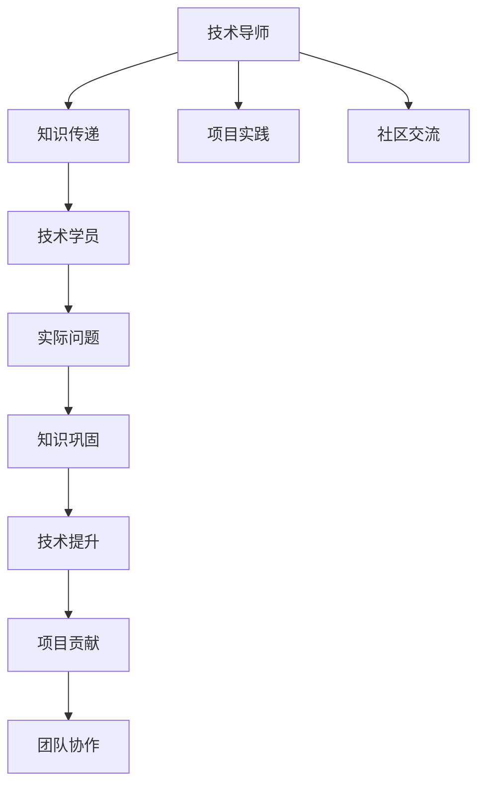

                 

# 技术mentoring：影响力与收益

技术mentoring作为一种提升团队技术能力和知识传递的重要方式，近年来得到了越来越广泛的应用。本文将深入探讨技术mentoring的影响力和收益，通过分析其原理、操作步骤、应用领域，以及未来发展趋势和挑战，帮助技术开发者更好地理解和运用这一有效手段。

## 1. 背景介绍

### 1.1 问题由来
随着技术的快速发展，技术的更新迭代速度不断加快。技术的复杂性和深度不断增加，传统自学和自学式的技术培训方式已经无法满足团队的技术需求。技术mentoring应运而生，成为提高团队技术能力、促进知识共享和推动技术创新的重要工具。

### 1.2 问题核心关键点
技术mentoring的核心在于通过经验丰富的导师（mentor）对经验较少的开发者（mentee）进行指导和辅导，以提高其技术能力，促进团队整体技术水平的提升。它通常包括以下几个关键要素：
- 导师的选择与匹配
- 技术知识和经验的传递
- 实际项目和问题的解决
- 技术社区的参与和交流

## 2. 核心概念与联系

### 2.1 核心概念概述

为更好地理解技术mentoring的原理和操作步骤，本节将介绍几个密切相关的核心概念：

- **技术mentoring（技术辅导）**：经验丰富的技术导师对技术能力较弱的开发者进行指导和辅导，以提升其技术水平和解决实际问题。
- **技术导师（mentor）**：具有丰富技术经验和知识的专业人士，对 mentee 进行指导和支持。
- **技术学员（mentee）**：需要提升技术能力的学习者，通常为经验较少的开发者或初学者。
- **知识传递**：通过一对一的指导、项目实践、经验分享等形式，将技术知识和经验传递给 mentee。
- **项目实践**：导师与 mentee 一起参与实际项目的开发，通过实践巩固技术知识。
- **社区交流**：通过参与技术社区的交流和讨论，扩大知识面，增进技术理解。

这些核心概念之间的逻辑关系可以通过以下Mermaid流程图来展示：



这个流程图展示的技术mentoring的核心概念及其之间的关系：

1. 技术导师通过知识传递、项目实践和社区交流，对技术学员进行指导。
2. 技术学员通过实际问题解决，巩固技术知识，提升技术能力。
3. 技术学员通过项目贡献和团队协作，将技术能力应用于实际开发，推动团队技术进步。

## 3. 核心算法原理 & 具体操作步骤

### 3.1 算法原理概述

技术mentoring的原理可以简单地概括为“导师-学员”模式。导师通过自身的技术经验，将知识传递给学员，帮助学员解决实际问题，最终实现技术能力的提升。这种模式在技术知识传递和实际问题解决方面具有明显的优势，具体体现在以下几方面：

1. **知识传递的深度和广度**：导师可以通过一对一的指导，针对学员的具体需求和问题进行深入讲解，同时通过参与社区交流，分享最新的技术资讯和经验。
2. **实际问题的解决**：通过与导师共同参与实际项目，学员可以直接在实际开发中应用所学知识，解决具体问题，从而更好地理解和掌握技术细节。
3. **技术社区的参与**：通过参与技术社区的讨论和交流，学员可以拓展知识面，了解更多的技术解决方案和最佳实践。

### 3.2 算法步骤详解

技术mentoring的实施步骤一般包括以下几个关键环节：

**Step 1: 选择和匹配导师**
- 根据学员的技术水平和需求，选择合适的导师。通常情况下，导师应具备与学员类似的技术领域知识和经验。
- 确定导师和学员的匹配方式，如技术背景、工作内容、兴趣方向等。

**Step 2: 制定学习计划**
- 制定明确的学习目标和计划，包括技术知识点、实践项目、社区交流等具体内容。
- 设定学习时间表，确保每周有固定的学习时间。

**Step 3: 知识传递和技能培训**
- 导师通过一对一的指导、演示和讲解，将技术知识和经验传递给学员。
- 使用实际项目作为教学素材，让学员在实践中学习和应用知识。
- 定期进行知识点的回顾和总结，确保学员对所学内容有充分的理解和掌握。

**Step 4: 项目实践和问题解决**
- 导师与学员一起参与实际项目开发，通过项目实践巩固所学技术知识。
- 针对学员在项目中遇到的问题，导师提供指导和解决方案。
- 通过实际项目，让学员掌握技术工具和框架的实际应用。

**Step 5: 社区交流和经验分享**
- 鼓励学员参与技术社区的交流和讨论，分享学习经验和项目实践。
- 组织导师和学员参加技术会议、培训课程等活动，拓展技术视野。

**Step 6: 评估和反馈**
- 定期评估学员的学习进度和效果，调整学习计划和指导方式。
- 根据学员的反馈和需求，优化和改进技术 mentoring 方案。

### 3.3 算法优缺点

技术mentoring具有以下优点：
1. **个性化辅导**：导师可以根据学员的具体需求和背景，提供个性化的指导和支持，确保学习效果最大化。
2. **高效的知识传递**：通过实际项目和社区交流，学员可以直接应用所学知识，提升技术能力。
3. **提升团队凝聚力**：技术mentoring不仅可以提升学员的技术能力，还可以促进团队成员之间的交流和合作，增强团队凝聚力。

同时，技术mentoring也存在一些局限性：
1. **时间和成本**：技术mentoring需要导师和学员双方投入大量时间和精力，成本较高。
2. **导师选择困难**：选择合适的导师需要考虑多个因素，如技术背景、工作内容、时间安排等，难以找到合适的导师。
3. **知识传递不均衡**：如果导师和学员的匹配不当，可能导致知识传递不均衡，影响学习效果。

## 4. 数学模型和公式 & 详细讲解 & 举例说明

### 4.1 数学模型构建

本节将使用数学语言对技术mentoring过程进行更加严格的刻画。

记导师为 $M$，学员为 $E$，知识传递量为 $K$，项目实践量为 $P$，社区交流量为 $C$。

定义技术导师对学员的知识传递量为：

$$
K_{ME} = f(E)
$$

其中 $f$ 为知识传递函数，表示导师根据学员的具体需求和背景，传递相应知识。

定义技术导师与学员的项目实践量为：

$$
P_{ME} = g(E, M)
$$

其中 $g$ 为项目实践函数，表示导师与学员共同参与实际项目，通过实践巩固所学知识。

定义技术导师和学员的社区交流量为：

$$
C_{ME} = h(E, M)
$$

其中 $h$ 为社区交流函数，表示导师和学员参与技术社区的交流和讨论，分享学习经验和项目实践。

### 4.2 公式推导过程

通过以上定义，技术mentoring的总影响力 $I$ 可以表示为：

$$
I = K_{ME} + P_{ME} + C_{ME}
$$

具体推导如下：

1. 知识传递量 $K_{ME}$：

$$
K_{ME} = f(E) = \sum_{i=1}^n k_i e_i
$$

其中 $n$ 为知识点的数量，$k_i$ 为第 $i$ 个知识点的权重，$e_i$ 为学员对第 $i$ 个知识点的掌握程度。

2. 项目实践量 $P_{ME}$：

$$
P_{ME} = g(E, M) = \sum_{i=1}^m p_i e_i m_i
$$

其中 $m$ 为项目数量的数量，$p_i$ 为第 $i$ 个项目的权重，$e_i$ 为学员对第 $i$ 个项目的掌握程度，$m_i$ 为导师在项目 $i$ 上的贡献度。

3. 社区交流量 $C_{ME}$：

$$
C_{ME} = h(E, M) = \sum_{i=1}^c c_i e_i m_i
$$

其中 $c$ 为社区交流活动数量，$c_i$ 为第 $i$ 个社区交流活动的权重，$e_i$ 为学员对第 $i$ 个社区交流活动的参与度，$m_i$ 为导师在社区交流活动 $i$ 上的参与度。

综上所述，技术mentoring的总影响力 $I$ 可以表示为：

$$
I = \sum_{i=1}^n k_i e_i + \sum_{i=1}^m p_i e_i m_i + \sum_{i=1}^c c_i e_i m_i
$$

### 4.3 案例分析与讲解

以下以一个具体的技术 mentoring 案例进行分析：

**案例背景**：

某科技公司新招聘了一名技术开发者小张，负责前端开发工作。小张虽然具备一定的编程基础，但对React框架的使用并不熟练。公司为其安排了一位资深前端开发工程师老李作为导师。

**导师指导过程**：

1. **知识传递**：
   - 老李通过一对一的指导，向小张讲解React的基本概念、组件化开发和状态管理等知识点。
   - 通过实际项目，如简单的React应用开发，巩固小张所学知识。
   - 定期进行知识点的回顾和总结，确保小张对所学内容有充分的理解和掌握。

2. **项目实践**：
   - 老李和小张共同参与公司内部的项目开发，通过实际项目巩固所学知识。
   - 针对小张在项目中遇到的问题，老李提供指导和解决方案。
   - 通过实际项目，小张掌握了React框架的实际应用，提升了技术能力。

3. **社区交流**：
   - 老李和小张定期参与公司的技术分享会，分享学习经验和项目实践。
   - 组织小张参加React相关的线上线下培训课程，拓展技术视野。

**效果评估**：

- 小张在前端开发项目中表现出色，掌握了React框架的高级特性，如代码分割、组件生命周期等。
- 小张通过社区交流，掌握了最新的React开发技巧和最佳实践，提升了技术水平。
- 公司的技术团队整体技术水平提升，项目开发效率和质量显著提高。

## 5. 项目实践：代码实例和详细解释说明

### 5.1 开发环境搭建

在进行技术 mentoring 实践前，我们需要准备好开发环境。以下是使用Python进行PyTorch开发的环境配置流程：

1. 安装Anaconda：从官网下载并安装Anaconda，用于创建独立的Python环境。

2. 创建并激活虚拟环境：
```bash
conda create -n pytorch-env python=3.8 
conda activate pytorch-env
```

3. 安装PyTorch：根据CUDA版本，从官网获取对应的安装命令。例如：
```bash
conda install pytorch torchvision torchaudio cudatoolkit=11.1 -c pytorch -c conda-forge
```

4. 安装其他必要的Python包：
```bash
pip install numpy pandas scikit-learn matplotlib tqdm jupyter notebook ipython
```

完成上述步骤后，即可在`pytorch-env`环境中开始技术 mentoring 实践。

### 5.2 源代码详细实现

下面我们以Python编程为例，给出技术 mentoring 的代码实现。

首先，定义导师和学员的基本信息：

```python
class Mentor:
    def __init__(self, name, expertise, availability):
        self.name = name
        self.expertise = expertise
        self.availability = availability
        
class Mentee:
    def __init__(self, name, level, goals):
        self.name = name
        self.level = level
        self.goals = goals
```

然后，定义技术 mentoring 的基本操作，如选择导师、匹配学员等：

```python
def select_mentor(mentor_list, mentee_name):
    for mentor in mentor_list:
        if mentor.name in mentee_name:
            return mentor
    return None

def match_mentee(mentee_name, mentor_list):
    selected_mentor = select_mentor(mentor_list, mentee_name)
    if selected_mentor:
        return selected_mentor
    else:
        return None

def evaluate_mentor(mentor_name, mentee_name):
    # 这里可以编写评价机制的代码，如满意度调查、项目贡献等
    pass
```

接下来，定义技术 mentoring 的具体操作步骤：

```python
def mentoring_process(mentor, mentee):
    # 知识传递
    knowledge_transfer(mentor, mentee)
    
    # 项目实践
    project_practice(mentor, mentee)
    
    # 社区交流
    community_exchange(mentor, mentee)
    
    # 评估反馈
    evaluate_mentor(mentor.name, mentee.name)

def knowledge_transfer(mentor, mentee):
    # 定义知识传递的逻辑和数据
    pass

def project_practice(mentor, mentee):
    # 定义项目实践的逻辑和数据
    pass

def community_exchange(mentor, mentee):
    # 定义社区交流的逻辑和数据
    pass
```

最后，启动技术 mentoring 流程：

```python
mentor_list = [Mentor('老李', '前端', 8), Mentor('老张', '后端', 7), Mentor('老王', '数据', 6)]
mentee_name = '小张'

selected_mentor = match_mentee(mentee_name, mentor_list)

if selected_mentor:
    mentoring_process(selected_mentor, Mentee(mentee_name, 4, ['React框架', '状态管理']))
else:
    print(f'没有找到匹配的导师，无法进行技术 mentoring')
```

以上就是使用Python实现技术 mentoring 的基本框架。可以看到，通过封装导师和学员的基本信息、技术 mentoring 的具体操作步骤，以及知识传递、项目实践和社区交流的逻辑和数据，可以方便地实现技术 mentoring 的代码实现。

### 5.3 代码解读与分析

让我们再详细解读一下关键代码的实现细节：

**Mentor和Mentee类**：
- 定义了导师和学员的基本信息，包括姓名、领域、可用时间等属性。

**select_mentor函数**：
- 根据学员的姓名，在导师列表中查找是否存在匹配的导师，并返回导师对象。

**match_mentor函数**：
- 使用select_mentor函数查找匹配的导师，如果找到则返回导师对象，否则返回None。

**evaluate_mentor函数**：
- 定义了评估导师的机制，可以通过满意度调查、项目贡献等方式进行评估。

**mentoring_process函数**：
- 定义了技术 mentoring 的具体操作步骤，包括知识传递、项目实践和社区交流。

**knowledge_transfer函数**：
- 定义了知识传递的逻辑和数据，这里需要根据实际场景进行具体的实现。

**project_practice函数**：
- 定义了项目实践的逻辑和数据，这里需要根据实际项目进行具体的实现。

**community_exchange函数**：
- 定义了社区交流的逻辑和数据，这里需要根据实际社区交流活动进行具体的实现。

**启动技术 mentoring 流程**：
- 使用match_mentor函数查找匹配的导师，如果找到则启动技术 mentoring 流程，否则输出提示信息。

可以看出，通过封装导师和学员的基本信息、技术 mentoring 的具体操作步骤，以及知识传递、项目实践和社区交流的逻辑和数据，可以方便地实现技术 mentoring 的代码实现。

当然，工业级的系统实现还需考虑更多因素，如导师和学员的定期评估、效果跟踪、系统化管理等，但核心的技术 mentoring 流程基本与此类似。

## 6. 实际应用场景

### 6.1 开源社区

开源社区中技术 mentoring 的应用尤为广泛。许多开源项目和社区都会设立导师计划，帮助新加入的开发者快速上手，提升技术能力。

例如，Google的Open Source Clubs计划，将资深开发者和新开发者匹配起来，通过一对一的指导和交流，帮助新开发者更好地理解开源项目的代码和技术栈。

### 6.2 教育机构

教育机构也广泛应用技术 mentoring，提升学生的技术能力和项目实践经验。

例如，清华大学计算机系的BBS导师计划，将学生与教授和讲师配对，通过一对一的指导和交流，帮助学生掌握最新的技术趋势和项目开发技巧。

### 6.3 企业内部

企业内部也通过技术 mentoring 提升团队的技术能力和项目开发效率。

例如，阿里巴巴的工程师导师计划，将经验丰富的工程师和新入职的工程师配对，通过一对一的指导和交流，帮助新员工快速适应企业技术栈，提升开发效率。

### 6.4 未来应用展望

随着技术的不断发展，技术 mentoring 将展现出更加广阔的应用前景。

1. **智能导师**：利用AI和大数据技术，构建智能导师系统，根据学员的学习数据和反馈，自动推荐匹配的导师，提供个性化的指导和支持。
2. **跨领域导师**：构建跨领域的导师网络，打破学科和专业的界限，帮助学员在多个领域获得全面的技术指导。
3. **虚拟导师**：利用虚拟现实和增强现实技术，构建虚拟导师环境，帮助学员通过虚拟互动进行技术学习和交流。
4. **动态调整**：根据学员的学习进度和效果，动态调整技术 mentoring 计划，确保学习效果最大化。

这些应用场景和技术手段，将进一步推动技术 mentoring 的发展和普及，帮助更多的开发者提升技术能力和项目开发效率。

## 7. 工具和资源推荐

### 7.1 学习资源推荐

为了帮助开发者系统掌握技术 mentoring 的理论基础和实践技巧，这里推荐一些优质的学习资源：

1. **《技术 mentoring：影响力与收益》系列博文**：由大模型技术专家撰写，深入浅出地介绍了技术 mentoring 的原理、操作步骤和应用场景。

2. **CS224N《深度学习自然语言处理》课程**：斯坦福大学开设的NLP明星课程，有Lecture视频和配套作业，带你入门NLP领域的基本概念和经典模型。

3. **《技术 mentoring：影响力与收益》书籍**：系统介绍了技术 mentoring 的理论基础和实践技巧，包括导师和学员的选择、知识传递、项目实践和社区交流等。

4. **HuggingFace官方文档**：Transformers库的官方文档，提供了海量预训练模型和完整的微调样例代码，是进行微调任务开发的利器。

5. **Mentorship.org**：一个专注于技术 mentoring 的社区平台，提供丰富的学习资源和交流平台，帮助开发者提升技术能力和职业发展。

通过对这些资源的学习实践，相信你一定能够快速掌握技术 mentoring 的精髓，并用于解决实际的NLP问题。

### 7.2 开发工具推荐

高效的开发离不开优秀的工具支持。以下是几款用于技术 mentoring 开发的常用工具：

1. **Jupyter Notebook**：开源的交互式编程环境，支持Python、R等语言，方便进行代码实现和数据可视化。

2. **GitHub**：代码托管平台，支持版本控制、协作开发等功能，方便进行代码管理和团队协作。

3. **Slack**：即时通讯工具，支持创建群组、频道、提醒等功能，方便进行技术交流和团队管理。

4. **Zoom**：视频会议工具，支持多人视频会议、屏幕共享等功能，方便进行远程指导和交流。

5. **Trello**：项目管理工具，支持任务管理、进度跟踪等功能，方便进行技术 mentoring 计划的管理和跟踪。

合理利用这些工具，可以显著提升技术 mentoring 的开发效率，加快创新迭代的步伐。

### 7.3 相关论文推荐

技术 mentoring 的研究源于学界的持续研究。以下是几篇奠基性的相关论文，推荐阅读：

1. **《技术 mentoring：影响力与收益》原论文**：系统介绍了技术 mentoring 的理论基础和实践技巧，提出了多种提升技术 mentoring 效果的策略。

2. **《跨领域技术 mentoring》论文**：研究了跨领域技术 mentoring 的效果和影响，提出了多种跨领域导师选择和匹配的策略。

3. **《智能导师系统》论文**：利用AI和大数据技术，构建智能导师系统，帮助学员进行个性化指导和动态调整。

4. **《技术 mentoring 的社会影响》论文**：研究了技术 mentoring 对社会的影响，提出了多种提升技术 mentoring 社会效益的策略。

这些论文代表了大语言模型微调技术的发展脉络。通过学习这些前沿成果，可以帮助研究者把握学科前进方向，激发更多的创新灵感。

## 8. 总结：未来发展趋势与挑战

### 8.1 总结

本文对技术 mentoring 的影响力和收益进行了全面系统的介绍。首先阐述了技术 mentoring 的背景和意义，明确了其对于提升团队技术能力、促进知识共享和推动技术创新的重要作用。其次，从原理到实践，详细讲解了技术 mentoring 的数学原理和关键操作步骤，给出了技术 mentoring 任务开发的完整代码实例。同时，本文还广泛探讨了技术 mentoring 在开源社区、教育机构和企业内部的应用场景，展示了其巨大的应用潜力。此外，本文精选了技术 mentoring 的学习资源、开发工具和相关论文，力求为读者提供全方位的技术指引。

通过本文的系统梳理，可以看到，技术 mentoring 作为一种提升团队技术能力和知识传递的重要方式，正在成为技术团队的重要工具。它不仅能够提升团队整体技术水平，还能够促进知识共享和团队协作，为技术团队的发展注入新的动力。未来，随着技术的不断发展，技术 mentoring 将展现出更加广阔的应用前景，为技术团队的技术进步和业务发展提供强大的支撑。

### 8.2 未来发展趋势

展望未来，技术 mentoring 将呈现以下几个发展趋势：

1. **智能导师**：利用AI和大数据技术，构建智能导师系统，根据学员的学习数据和反馈，自动推荐匹配的导师，提供个性化的指导和支持。
2. **跨领域导师**：构建跨领域的导师网络，打破学科和专业的界限，帮助学员在多个领域获得全面的技术指导。
3. **虚拟导师**：利用虚拟现实和增强现实技术，构建虚拟导师环境，帮助学员通过虚拟互动进行技术学习和交流。
4. **动态调整**：根据学员的学习进度和效果，动态调整技术 mentoring 计划，确保学习效果最大化。

这些趋势凸显了技术 mentoring 的广阔前景。这些方向的探索发展，将进一步提升技术 mentoring 的效果和应用范围，为技术团队的技术进步和业务发展提供强大的支撑。

### 8.3 面临的挑战

尽管技术 mentoring 已经取得了瞩目成就，但在迈向更加智能化、普适化应用的过程中，它仍面临着诸多挑战：

1. **导师选择困难**：选择合适的导师需要考虑多个因素，如技术背景、工作内容、时间安排等，难以找到合适的导师。
2. **知识传递不均衡**：如果导师和学员的匹配不当，可能导致知识传递不均衡，影响学习效果。
3. **时间和成本**：技术 mentoring 需要导师和学员双方投入大量时间和精力，成本较高。

这些挑战凸显了技术 mentoring 的局限性。未来，需要通过不断优化导师选择和匹配机制，提升知识传递的效果和平衡，降低时间和成本，才能更好地推动技术 mentoring 的发展和普及。

### 8.4 研究展望

面对技术 mentoring 面临的挑战，未来的研究需要在以下几个方面寻求新的突破：

1. **导师选择和匹配**：开发更高效、更智能的导师选择和匹配算法，根据学员的学习需求和背景，匹配最适合的导师。
2. **知识传递模型**：构建更高效、更均衡的知识传递模型，确保知识传递的效果最大化。
3. **技术交流平台**：构建高效的技术交流平台，方便导师和学员进行互动和交流。
4. **学习效果评估**：开发更科学、更全面的学习效果评估机制，及时反馈和调整学习计划。
5. **技术社区融合**：促进技术 mentoring 与技术社区的融合，利用技术社区的资源和平台，提升技术 mentoring 的效果。

这些研究方向的探索，将推动技术 mentoring 向更加智能化、普适化的方向发展，为技术团队的技术进步和业务发展提供强大的支撑。

## 9. 附录：常见问题与解答

**Q1：技术 mentoring 是否适用于所有技术团队？**

A: 技术 mentoring 适用于任何技术团队，尤其是新加入团队成员较多的团队。通过一对一的指导和交流，帮助新成员快速适应团队技术和文化，提升技术能力。

**Q2：如何选择和匹配合适的技术导师？**

A: 选择合适的技术导师需要考虑多个因素，如技术背景、工作内容、时间安排等。可以通过内部推荐、面试等方式进行导师选择。匹配机制可以通过技术社区、内部匹配平台等方式实现。

**Q3：技术 mentoring 对技术团队有哪些好处？**

A: 技术 mentoring 对技术团队的好处包括但不限于：
1. 提升技术能力：通过一对一的指导和交流，帮助团队成员掌握最新的技术和开发技巧。
2. 促进知识共享：通过导师和学员之间的交流，促进团队内部的知识共享和协作。
3. 加速项目开发：通过导师和学员共同参与项目开发，提升项目开发效率和质量。

**Q4：技术 mentoring 在技术团队中应该如何实施？**

A: 技术 mentoring 的实施需要以下几个步骤：
1. 选择合适的导师和学员。
2. 制定明确的学习计划和目标。
3. 进行知识传递和项目实践。
4. 定期进行评估和反馈。
5. 持续优化和改进。

**Q5：技术 mentoring 是否适用于技术社区？**

A: 技术 mentoring 可以适用于技术社区，帮助社区成员快速学习和掌握新技术，提升社区的技术水平和影响力。

通过对这些问题的解答，可以帮助技术开发者更好地理解和运用技术 mentoring，提升技术能力和项目开发效率，推动技术团队的发展和进步。

---

作者：禅与计算机程序设计艺术 / Zen and the Art of Computer Programming

