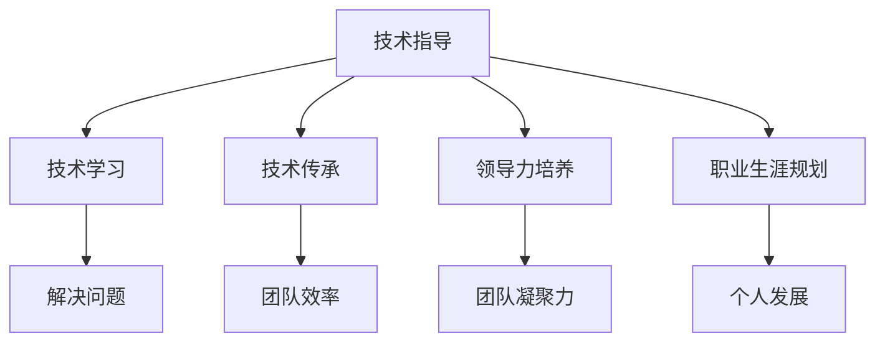

                 

# 技术mentoring：提升影响力

> 关键词：技术指导, 知识传承, 领导力培养, 人才发展, 职业生涯规划

## 1. 背景介绍

### 1.1 问题由来

在信息爆炸和技术快速迭代的时代，技术领域的从业人员面临着前所未有的机遇与挑战。如何有效地将自己的知识和经验传授给团队成员，不仅是一个技术问题，更是一个管理挑战。随着团队的规模和复杂性不断增加，优秀的技术mentoring体系成为提升团队效率、加速人才成长的必要条件。本文将探讨技术mentoring的原理、操作技巧和实践案例，帮助读者构建一套高效且可持续的技术mentoring体系。

### 1.2 问题核心关键点

技术mentoring的核心在于通过一对一或小组式的技术指导，帮助被指导者提升技术能力、解决问题、加速成长，并在职业生涯发展中得到方向指引。优秀的技术mentoring体系不仅能显著提升被指导者的技术水平，还能在团队中培养积极的学习氛围，促进知识共享和技术创新。

技术mentoring的关键点包括：

- **目标设定**：明确技术指导的具体目标，如技能提升、问题解决或项目优化等。
- **匹配合适的指导者**：选择经验丰富、技术水平高且具有良好沟通能力的指导者。
- **定期反馈与评估**：通过定期的反馈和评估，帮助被指导者调整学习路径和方向。
- **动态调整指导计划**：根据被指导者的进展和需求，灵活调整指导计划和内容。

## 2. 核心概念与联系

### 2.1 核心概念概述

为了更好地理解技术mentoring的原理和操作，我们需要明确几个关键概念：

- **技术指导(mentoring)**：通过一对一的指导方式，帮助被指导者提升技术能力，解决实际问题，并在职业生涯规划中提供方向指引。
- **技术学习(learning)**：通过系统的学习和实践，掌握新技术、新方法，并在实际项目中应用。
- **技术传承(knowledge transfer)**：通过技术指导和知识共享，将技术知识和经验传递给团队成员，实现团队整体的技术提升。
- **领导力培养(leadership development)**：通过技术指导和团队管理，提升指导者的领导力和影响力，促进团队成员的自我成长和发展。
- **职业生涯规划(career planning)**：通过技术指导和职业规划，帮助被指导者在技术领域内寻找方向，实现个人职业目标。

这些概念之间存在紧密的联系，共同构成了技术mentoring的完整框架。以下是一个Mermaid流程图，展示了这些概念之间的联系：

通过这个流程图，我们可以看到，技术指导不仅关注技术能力的提升，还涵盖了知识的传递、领导力的培养和职业规划等多个方面。这些要素相互作用，共同推动团队和个人的发展。

## 3. 核心算法原理 & 具体操作步骤

### 3.1 算法原理概述

技术mentoring的本质是一种基于互动的学习和指导过程。其核心原理可以总结为以下几点：

1. **知识传递**：指导者通过分享自己的经验和知识，帮助被指导者快速掌握新技术和新方法。
2. **问题解决**：指导者通过分析和解决问题，帮助被指导者提升解决问题的能力和效率。
3. **能力提升**：指导者通过实战项目的指导，帮助被指导者提升实际操作能力和技术水平。
4. **方向指引**：指导者通过职业生涯规划和职业发展的指导，帮助被指导者明确发展方向，制定长期职业规划。

### 3.2 算法步骤详解

技术mentoring的操作流程可以分为以下几个步骤：

**Step 1: 准备阶段**

- **目标设定**：明确技术指导的具体目标，如技能提升、问题解决或项目优化等。
- **匹配指导者**：选择经验丰富、技术水平高且具有良好沟通能力的指导者。
- **设定计划**：根据目标和需求，制定详细的技术指导计划，包括指导周期、频率和内容。

**Step 2: 实施阶段**

- **定期指导**：按照计划进行定期的技术指导，包括一对一的会议、小组讨论、项目评审等。
- **实践项目**：安排实战项目或任务，让被指导者在实际项目中应用所学知识。
- **持续反馈**：通过定期的反馈和评估，帮助被指导者调整学习路径和方向。

**Step 3: 评估与调整**

- **评估效果**：通过项目成果、技术评估和满意度调查等方式，评估技术指导的效果。
- **动态调整**：根据被指导者的进展和需求，灵活调整指导计划和内容，确保指导的有效性。

### 3.3 算法优缺点

技术mentoring的优点包括：

- **提升技术能力**：通过系统的指导和实践，被指导者可以快速提升技术水平和解决问题的能力。
- **加速成长**：通过知识传递和经验分享，加速团队成员的个人成长和职业发展。
- **促进团队协作**：通过团队内部的技术指导和知识共享，增强团队凝聚力和协作能力。

其缺点包括：

- **资源消耗**：技术指导需要指导者投入大量的时间和精力，特别是对于经验丰富、项目繁忙的指导者来说，可能会产生一定的资源负担。
- **效果依赖**：技术指导的效果取决于指导者的水平和被指导者的接受能力，难以保证每个人都能取得理想的效果。
- **周期较长**：技术指导是一个长期的过程，需要持续的投入和调整，才能看到显著的效果。

### 3.4 算法应用领域

技术mentoring的应用领域广泛，包括但不限于以下几方面：

- **技术团队建设**：通过技术指导和知识共享，提升团队整体的技术水平和协作能力。
- **项目开发**：通过技术指导和实战项目的训练，帮助团队成员提升实际项目开发能力。
- **人才培养**：通过系统的技术指导和职业规划，帮助团队成员实现个人职业目标，加速人才成长。
- **技术创新**：通过技术指导和跨领域知识共享，促进技术创新和团队整体的创新能力提升。

## 4. 数学模型和公式 & 详细讲解 & 举例说明

### 4.1 数学模型构建

技术mentoring的数学模型可以简化为以下形式：

$$
\text{指导效果} = \text{指导质量} \times \text{指导频率} \times \text{被指导者接受度} \times \text{持续改进}
$$

其中，指导质量、指导频率、被指导者接受度和持续改进是影响技术指导效果的关键因素。

### 4.2 公式推导过程

根据上述模型，我们可以进行以下推导：

- **指导质量**：指导者的经验和技能水平直接影响指导效果。指导者应具备丰富的技术背景和良好的沟通能力。
- **指导频率**：指导的频率越高，被指导者能够获得的信息和指导越多，效果也越好。
- **被指导者接受度**：被指导者对指导的接受和认可程度越高，指导效果越好。
- **持续改进**：指导者和被指导者应定期评估指导效果，根据反馈进行调整和改进，以确保指导的有效性。

### 4.3 案例分析与讲解

假设有一支技术团队，指导者A和被指导者B希望通过技术指导提升B的技术水平。他们设定了以下目标：

- **目标**：在6个月内，让B掌握最新的机器学习技术，并能够独立完成相关项目。
- **指导质量**：A具备丰富的机器学习经验，能够提供高质量的指导。
- **指导频率**：每周进行一次1小时的指导，每月进行一次项目评审。
- **被指导者接受度**：B对A的指导持积极态度，乐于接受反馈和学习。
- **持续改进**：A和B定期评估指导效果，根据反馈进行调整。

根据上述模型，我们期望的指导效果为：

$$
\text{指导效果} = 1 \times 1 \times 1 \times 1 = 1
$$

即，通过系统的指导和实践，B能够在6个月内达到目标。

## 5. 项目实践：代码实例和详细解释说明

### 5.1 开发环境搭建

进行技术指导的项目实践，需要搭建一个适合的技术环境。以下是一个典型的开发环境搭建流程：

1. **安装开发工具**：选择适合的项目管理和协作工具，如JIRA、Confluence、Git等。
2. **配置协作环境**：使用GitHub或GitLab等代码托管平台，配置代码仓库和版本控制。
3. **建立指导记录**：使用Trello、Asana等项目管理工具，建立指导记录和任务清单。
4. **设定沟通渠道**：建立沟通渠道，如Slack、Microsoft Teams等，方便指导者和被指导者实时交流。

### 5.2 源代码详细实现

以下是一个技术指导项目的代码实现示例，通过JIRA和Confluence进行管理，使用Git进行版本控制，使用Slack进行实时沟通。

**JIRA配置**：
- **项目创建**：创建项目，设定项目名称、描述和责任人。
- **任务分配**：将任务分配给被指导者，设定任务描述、截止日期和优先级。
- **进度跟踪**：定期更新任务进度，记录指导和反馈情况。

**Confluence配置**：
- **文档创建**：创建项目文档，包括指导计划、技术手册和项目总结等。
- **知识共享**：将技术文档和指导材料共享到Confluence，方便被指导者随时查阅。

**Git配置**：
- **仓库创建**：在GitHub或GitLab上创建代码仓库，设定团队成员的权限。
- **代码提交**：指导者和被指导者定期提交代码，进行版本控制。

**Slack配置**：
- **频道创建**：创建项目频道和讨论组，方便指导者和被指导者沟通交流。
- **消息记录**：记录每次指导和讨论的内容，方便查阅和跟踪。

### 5.3 代码解读与分析

通过上述工具和流程，技术指导项目可以高效地进行。关键点包括：

- **项目管理**：通过JIRA和Confluence，能够高效地进行任务分配和进度跟踪，确保指导和项目进展的可控性。
- **版本控制**：使用Git进行代码管理，确保代码的版本安全和可追溯性。
- **实时沟通**：通过Slack进行实时沟通，确保指导和反馈的及时性和高效性。

## 6. 实际应用场景

### 6.1 技术团队建设

在技术团队建设中，技术指导和知识共享是不可或缺的一部分。通过定期的技术指导和跨团队的知识共享，可以提升团队的整体技术水平和协作能力。以下是一个实际应用场景：

假设某公司技术团队希望在一年内提升整体技术水平，设定以下目标：

- **目标**：在一年内，通过技术指导和知识共享，提升团队成员的技术能力和协作效率。
- **指导者**：选择资深工程师作为指导者。
- **指导频率**：每月进行一次技术分享会和团队讨论会。
- **被指导者**：全体团队成员参与，根据需求进行分组。
- **持续改进**：每季度进行一次指导效果评估，根据反馈进行调整。

通过系统的技术指导和知识共享，团队成员的技术水平和协作效率将显著提升，为公司的技术发展奠定坚实基础。

### 6.2 项目开发

在项目开发中，技术指导和实战项目训练是提升团队成员实际项目开发能力的重要手段。以下是一个实际应用场景：

假设某公司技术团队希望在半年内开发一个新功能，设定以下目标：

- **目标**：在半年内，通过技术指导和实战项目训练，完成新功能的开发和上线。
- **指导者**：选择有经验的工程师作为指导者。
- **指导频率**：每周进行一次项目评审和技术指导。
- **被指导者**：分配给新功能开发小组，包括资深工程师和初级工程师。
- **持续改进**：每月进行一次项目评估和指导效果评估，根据反馈进行调整。

通过系统的技术指导和实战项目训练，新功能开发小组将高效地完成项目，提升团队成员的实际项目开发能力。

### 6.3 人才培养

在人才培养中，技术指导和职业规划是帮助团队成员实现个人职业目标的重要手段。以下是一个实际应用场景：

假设某公司技术团队希望培养一位技术骨干，设定以下目标：

- **目标**：在两年内，通过系统的技术指导和职业规划，培养一位技术骨干。
- **指导者**：选择资深工程师作为指导者。
- **指导频率**：每月进行一次技术指导和职业规划会谈。
- **被指导者**：目标人员A，具备一定技术基础。
- **持续改进**：每半年进行一次指导效果评估，根据反馈进行调整。

通过系统的技术指导和职业规划，目标人员A将快速成长为技术骨干，为公司的技术发展做出更大贡献。

### 6.4 技术创新

在技术创新中，技术指导和跨领域知识共享是促进技术创新和团队整体创新能力提升的重要手段。以下是一个实际应用场景：

假设某公司技术团队希望在一年内推出一款新的AI产品，设定以下目标：

- **目标**：在一年内，通过技术指导和跨领域知识共享，推出一款新的AI产品。
- **指导者**：选择资深工程师和AI专家作为指导者。
- **指导频率**：每月进行一次技术评审和跨领域讨论会。
- **被指导者**：分配给AI产品开发小组，包括机器学习工程师和数据科学家。
- **持续改进**：每季度进行一次项目评估和指导效果评估，根据反馈进行调整。

通过系统的技术指导和跨领域知识共享，AI产品开发小组将高效地完成产品开发，提升团队的整体创新能力。

## 7. 工具和资源推荐

### 7.1 学习资源推荐

为了帮助读者系统掌握技术指导的理论基础和实践技巧，以下是一些优质的学习资源：

1. **《技术指导的艺术》系列博文**：由知名技术导师撰写，深入浅出地介绍了技术指导的原理、方法和最佳实践。
2. **Coursera《领导力与团队管理》课程**：斯坦福大学开设的领导力课程，涵盖团队建设、领导力发展等关键主题，提供系统的理论知识。
3. **《领导力与影响力》书籍**：领导力专家所著，全面介绍了领导力的核心要素和提升方法，提供了实用的指导策略。
4. **JIRA官方文档**：JIRA使用手册和最佳实践，帮助团队高效管理任务和项目。
5. **Confluence使用手册**：Confluence操作手册和模板，帮助团队管理文档和知识共享。
6. **Git官方文档**：Git使用手册和最佳实践，帮助团队高效进行版本控制和代码管理。
7. **Slack官方文档**：Slack使用手册和最佳实践，帮助团队高效进行实时沟通。

通过对这些资源的学习实践，相信读者一定能够快速掌握技术指导的精髓，并用于解决实际的团队管理问题。

### 7.2 开发工具推荐

高效的开发离不开优秀的工具支持。以下是几款用于技术指导开发的常用工具：

1. **JIRA**：项目管理工具，帮助团队高效管理任务和项目，支持任务分配、进度跟踪和反馈评估。
2. **Confluence**：知识管理工具，帮助团队管理文档和知识共享，支持文档创建、版本控制和搜索功能。
3. **Git**：版本控制系统，帮助团队高效进行代码管理，支持版本控制、代码提交和协作开发。
4. **Slack**：实时沟通工具，帮助团队高效进行实时沟通，支持消息记录、频道管理和搜索功能。
5. **Confluence插件**：扩展Confluence功能，如Gantt图表、流程图、Wiki等，帮助团队管理文档和知识共享。
6. **JIRA插件**：扩展JIRA功能，如自定义字段、自定义报表、任务自动化等，帮助团队高效管理任务和项目。

合理利用这些工具，可以显著提升技术指导项目的开发效率，加快创新迭代的步伐。

### 7.3 相关论文推荐

技术指导的研究源于学界的持续研究。以下是几篇奠基性的相关论文，推荐阅读：

1. **《技术指导的理论与实践》**：论文总结了技术指导的理论基础和实践方法，提供了系统的指导框架。
2. **《团队建设与领导力发展》**：论文探讨了团队建设和领导力发展的重要性和方法，提供了实用的指导策略。
3. **《技术指导与职业发展》**：论文探讨了技术指导在职业发展中的作用和影响，提供了实用的指导策略。
4. **《技术指导与知识共享》**：论文探讨了技术指导和知识共享的原理和应用，提供了实用的指导策略。

这些论文代表了大语言模型微调技术的发展脉络。通过学习这些前沿成果，可以帮助读者把握技术指导的学科前进方向，激发更多的创新灵感。

## 8. 总结：未来发展趋势与挑战

### 8.1 总结

本文对技术指导的原理、操作技巧和实践案例进行了全面系统的介绍。首先，明确了技术指导的目标设定、匹配合适的指导者、设定计划、定期指导、持续反馈与评估等关键点。其次，介绍了技术指导的具体步骤和操作流程，包括准备阶段、实施阶段和评估与调整。同时，通过数学模型和公式，详细讲解了技术指导的影响因素和关键要素。最后，通过实际应用场景和工具推荐，展示了技术指导在团队建设、项目开发、人才培养和技术创新中的应用效果。

通过本文的系统梳理，可以看到，技术指导不仅能显著提升被指导者的技术水平，还能在团队中培养积极的学习氛围，促进知识共享和技术创新。未来，伴随技术的不断发展，技术指导将更加多样化、系统化和智能化，助力技术团队实现更高的目标。

### 8.2 未来发展趋势

展望未来，技术指导的发展趋势包括以下几个方面：

1. **智能化和自动化**：通过AI技术和大数据，实现技术指导的智能化和自动化，提升指导效率和效果。
2. **个性化和多样化**：根据被指导者的需求和特点，提供个性化的技术指导方案，实现多样化的指导形式和内容。
3. **远程指导和跨地域合作**：通过在线平台和协作工具，实现远程指导和跨地域合作，打破时间和空间的限制。
4. **持续学习和发展**：通过定期评估和反馈，帮助被指导者持续学习和提升，保持指导的长期有效性。

这些趋势凸显了技术指导的广阔前景，技术指导将进一步提升团队效率、加速人才成长，推动技术团队的不断进步。

### 8.3 面临的挑战

尽管技术指导在团队建设、项目开发、人才培养和技术创新中发挥了重要作用，但在迈向更加智能化、普适化应用的过程中，仍面临诸多挑战：

1. **指导效果不均衡**：技术指导的效果依赖于指导者的水平和被指导者的接受能力，难以保证每个人都能取得理想的效果。
2. **资源消耗高**：技术指导需要指导者投入大量的时间和精力，特别是对于经验丰富、项目繁忙的指导者来说，可能会产生一定的资源负担。
3. **指导过程复杂**：技术指导是一个长期的过程，需要持续的投入和调整，才能看到显著的效果。
4. **指导内容单一**：技术指导的内容主要以技术知识和项目技能为主，缺乏对软技能和跨领域知识的覆盖。
5. **指导效果评估困难**：技术指导的效果评估难以量化，缺乏有效的评估指标和方法。

这些挑战需要通过系统的方法和持续的改进来克服，以确保技术指导的效果和可持续性。

### 8.4 研究展望

面对技术指导所面临的挑战，未来的研究需要在以下几个方面寻求新的突破：

1. **引入AI和大数据**：通过AI技术和大数据，实现技术指导的智能化和自动化，提升指导效率和效果。
2. **建立持续学习机制**：通过定期评估和反馈，帮助被指导者持续学习和提升，保持指导的长期有效性。
3. **开发跨领域指导工具**：开发跨领域指导工具，帮助指导者提供多样化的指导内容，覆盖软技能和跨领域知识。
4. **建立指导效果评估体系**：通过引入量化评估指标和方法，建立指导效果评估体系，提升指导效果的量化和可控性。

这些研究方向的探索，必将引领技术指导技术迈向更高的台阶，为技术团队的发展提供更加科学、系统的指导方案。面向未来，技术指导需要与其他人工智能技术进行更深入的融合，如知识表示、因果推理、强化学习等，多路径协同发力，共同推动技术团队的不断进步。只有勇于创新、敢于突破，才能不断拓展技术指导的边界，让技术团队在竞争激烈的市场中占据优势地位。

