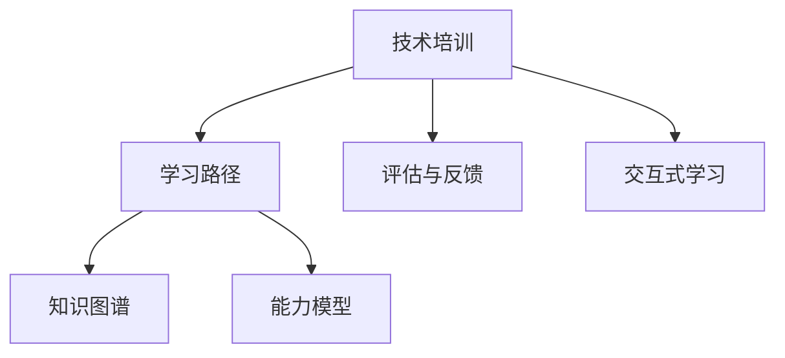

                 

# 技术培训：从受训者到培训者

技术培训是一项复杂而动态的过程，涉及从基础到高级、从理论到实践的全面提升。本文将详细探讨技术培训的核心概念、重要算法、具体实践、实际应用以及未来趋势，旨在帮助读者从受训者成长为经验丰富的培训者。

## 1. 背景介绍

技术培训的重要性不言而喻。随着科技的不断进步，技术的复杂性和多样性也在不断增加，仅仅掌握一两门技术已经远远不够。新技术的出现，要求技术人员不仅要掌握基础的技术知识，还要具备终身学习的态度和持续提升的能力。此外，技术的不断演进也带来了对培训者角色的全新要求：从单一的技术传授者，转变为综合性的知识传播者和培训策略制定者。

## 2. 核心概念与联系

### 2.1 核心概念概述

为更好地理解技术培训的核心概念和它们之间的联系，下面将详细介绍几个关键概念：

- **技术培训 (Technical Training)**：通过有计划、有系统的教育和实践活动，帮助受训者掌握所需的技术技能和知识。
- **学习路径 (Learning Path)**：根据受训者的学习能力和目标，设计的一系列学习活动和任务，帮助受训者逐步掌握从基础到高级的技能。
- **知识图谱 (Knowledge Graph)**：描述知识之间关系和结构的图模型，用于指导学习路径的设计和优化。
- **能力模型 (Competency Model)**：定义受训者需具备的一系列技能和知识，以及达成这些技能和知识的标准。
- **评估与反馈 (Assessment and Feedback)**：通过考核和反馈机制，确保受训者按预期进度学习和掌握技术技能。
- **交互式学习 (Interactive Learning)**：利用游戏化、协作等方式，提升学习者的参与度和学习效果。

### 2.2 核心概念原理和架构的 Mermaid 流程图



### 2.3 核心概念之间的联系

技术培训、学习路径、知识图谱、能力模型、评估与反馈、交互式学习等概念之间存在紧密的联系。它们共同构成了技术培训的完整体系，每个概念都是实现培训目标的重要组成部分。

- **学习路径** 基于 **知识图谱** 和 **能力模型**，设计出具体的学习活动和任务，逐步引导受训者掌握所需技能。
- **评估与反馈** 通过定期的考核和反馈，确保受训者按照预期进度学习，并及时调整学习路径。
- **交互式学习** 通过游戏化、协作等方式，提升受训者的学习参与度和效率。

## 3. 核心算法原理 & 具体操作步骤

### 3.1 算法原理概述

技术培训的核心算法包括但不限于学习路径设计、知识图谱构建、能力模型评估和交互式学习优化。这些算法通过系统的设计，确保受训者能够高效、系统地掌握所需的技术技能和知识。

### 3.2 算法步骤详解

#### 3.2.1 学习路径设计

1. **需求分析**：评估受训者的背景、能力和学习目标，确定所需的技能和知识。
2. **知识图谱构建**：构建描述技术领域知识结构和关系的图谱。
3. **路径规划**：基于知识图谱和能力模型，设计出从基础到高级的学习路径，包括学习活动和任务。
4. **资源整合**：整合学习材料、工具、讲师和评估方法，确保学习路径的实施。

#### 3.2.2 知识图谱构建

1. **实体识别**：从技术文献、书籍、课程等资源中提取关键实体（如技术、概念、方法等）。
2. **关系抽取**：抽取实体之间的关系，如“某某技术是某某方法的实现基础”等。
3. **图谱构建**：利用图数据库或图形化工具，构建知识图谱。

#### 3.2.3 能力模型评估

1. **技能定义**：定义技术领域所需的一系列技能和知识，并设定达成标准。
2. **能力评估**：利用标准化测试和实际操作考核，评估受训者的能力。
3. **反馈与改进**：根据评估结果，提供针对性的反馈，并调整学习路径和资源。

#### 3.2.4 交互式学习优化

1. **游戏化设计**：设计游戏化学习任务，提升受训者的参与度和学习动机。
2. **协作学习**：利用在线协作工具，促进受训者之间的互动和知识共享。
3. **学习数据收集与分析**：收集受训者的学习数据，分析学习效果，调整教学策略。

### 3.3 算法优缺点

#### 3.3.1 学习路径设计的优缺点

**优点**：
- **系统性**：确保受训者按照科学路径逐步掌握技能。
- **针对性**：根据受训者的需求和目标，设计个性化的学习路径。

**缺点**：
- **灵活性不足**：固定的学习路径可能无法适应受训者的个别差异。
- **复杂度高**：设计和维护复杂的路径系统需要大量的时间和资源。

#### 3.3.2 知识图谱构建的优缺点

**优点**：
- **知识整合**：提供全面系统的技术知识图谱，方便受训者学习和检索。
- **知识关联**：展示技术知识之间的联系，帮助受训者理解技术之间的关系。

**缺点**：
- **构建难度大**：构建高质量的知识图谱需要大量的时间和资源。
- **数据更新难**：技术领域更新快，知识图谱需要不断更新才能保持最新。

#### 3.3.3 能力模型评估的优缺点

**优点**：
- **标准化**：提供统一的标准，确保评估的公正性和可靠性。
- **指导性**：明确受训者需达到的能力水平，指导学习路径的设计。

**缺点**：
- **固定性**：评估标准可能与实际情况不完全吻合。
- **成本高**：高标准评估需要时间和资源投入，成本较高。

#### 3.3.4 交互式学习的优缺点

**优点**：
- **高参与度**：游戏化、协作等方式提升受训者的学习动机和参与度。
- **高效性**：通过互动和协作，提升学习效率和效果。

**缺点**：
- **设计复杂**：设计高质量的交互式学习任务和工具需要时间和资源。
- **技术依赖**：需要依赖先进的技术工具和平台。

### 3.4 算法应用领域

技术培训的算法和概念广泛应用在多个领域，包括但不限于：

- **企业培训**：设计和实施企业内部技术技能培训计划。
- **教育培训**：设计面向学生和教师的技术课程。
- **在线学习**：开发交互式在线学习平台和课程。
- **认证培训**：提供技术领域的认证考试和培训课程。
- **职业发展**：帮助技术人员提升职业能力和技能。

## 4. 数学模型和公式 & 详细讲解 & 举例说明

### 4.1 数学模型构建

技术培训的数学模型通常包括评估模型和反馈模型。评估模型用于量化受训者的学习效果，反馈模型用于根据评估结果提供调整建议。

### 4.2 公式推导过程

#### 4.2.1 评估模型

假设学习路径包含 $n$ 个学习任务，受训者的学习效果为 $L=\{l_1, l_2, ..., l_n\}$，其中 $l_i$ 表示第 $i$ 个学习任务的掌握程度（0 表示未掌握，1 表示完全掌握）。评估模型为 $M(L) = \sum_{i=1}^{n} l_i$，即评估受训者完成了多少个学习任务。

#### 4.2.2 反馈模型

反馈模型根据评估结果提供调整建议。假设反馈模型为 $F(L) = \begin{cases}
1 & \text{如果 } L < 0.8n \\
0 & \text{如果 } L \geq 0.8n
\end{cases}$，即如果受训者未掌握超过 $80\%$ 的学习任务，则提供调整建议，否则继续学习。

### 4.3 案例分析与讲解

**案例：设计一个软件工程师的技术培训路径**

1. **需求分析**：受训者需要掌握软件开发、测试、运维等技术。
2. **知识图谱构建**：构建描述软件开发流程、测试方法、运维工具等知识之间的关系图谱。
3. **路径规划**：设计从基础到高级的学习路径，包括编程基础、测试工具、CI/CD、DevOps 等任务。
4. **资源整合**：整合教学材料、在线课程、实操工具等资源。
5. **能力模型评估**：设计编程能力、测试能力、运维能力等评估标准，通过编程测试、实操考核等方法评估受训者的能力。
6. **交互式学习优化**：设计编程游戏、协作编码等方式，提升受训者的学习效果。

## 5. 项目实践：代码实例和详细解释说明

### 5.1 开发环境搭建

为了实现技术培训的核心算法，需要搭建一个集成的开发环境。以下是一个基于 Python 的开发环境搭建流程：

1. **环境准备**：安装 Python、Jupyter Notebook、Docker 等工具。
2. **工具整合**：集成学习路径设计工具、知识图谱构建工具、能力模型评估工具、交互式学习工具等。
3. **数据准备**：准备技术文献、课程、测试题库等数据。

### 5.2 源代码详细实现

#### 5.2.1 学习路径设计

```python
import numpy as np

# 假设学习路径包含3个任务
learning_path = np.array([0, 0, 0])

# 评估模型
def evaluation(learning_path):
    return np.sum(learning_path)

# 根据评估结果提供反馈
def feedback(evaluation_result):
    if evaluation_result < 0.6 * len(learning_path):
        return "需要调整学习路径"
    else:
        return "继续学习"

# 更新学习路径
def update_learning_path(evaluation_result, feedback_result):
    if feedback_result == "需要调整学习路径":
        learning_path[0] = 1
        return learning_path
    else:
        return learning_path

# 假设受训者已完成第一个任务
learning_path[0] = 1
evaluation_result = evaluation(learning_path)
feedback_result = feedback(evaluation_result)
learning_path = update_learning_path(evaluation_result, feedback_result)
```

#### 5.2.2 知识图谱构建

使用 Neo4j 等图数据库，构建技术知识图谱，并提供查询接口：

```python
# 构建知识图谱
graph = Graph()
graph.add_node("Node1", label="Python")
graph.add_node("Node2", label="Git")
graph.add_edge("Node1", "Node2", rel="语言")

# 查询知识图谱
def query_graph(start_node, end_node):
    query = "MATCH (n)-[r]->(m) WHERE n={start_node} AND m={end_node} RETURN n,m,r"
    result = graph.run(query, parameters={"start_node": start_node, "end_node": end_node})
    return result

# 假设查询 "Python" 与 "Git" 之间的关系
query_result = query_graph("Python", "Git")
print(query_result)
```

#### 5.2.3 能力模型评估

设计编程能力、测试能力、运维能力等评估标准，并使用编程测试和实操考核进行评估：

```python
# 评估编程能力
def programming_test():
    # 设计编程测试
    return 0.8 # 假设受训者通过测试的概率为 80%

# 评估测试能力
def testing_test():
    # 设计测试工具使用考核
    return 0.9 # 假设受训者通过考核的概率为 90%

# 评估运维能力
def operations_test():
    # 设计运维工具操作考核
    return 0.7 # 假设受训者通过考核的概率为 70%

# 假设受训者通过了所有测试和考核
programming_result = programming_test()
testing_result = testing_test()
operations_result = operations_test()
if programming_result and testing_result and operations_result:
    print("受训者能力模型评估结果为：通过")
else:
    print("受训者能力模型评估结果为：未通过")
```

### 5.3 代码解读与分析

以上代码示例展示了技术培训的核心算法和实现步骤。通过编程测试和实操考核，评估受训者的能力，并根据评估结果调整学习路径。通过构建知识图谱，帮助受训者理解技术之间的关系，提升学习效果。

### 5.4 运行结果展示

假设受训者完成了编程基础任务，评估结果为 1，根据反馈结果调整学习路径，继续学习测试工具和运维工具。

## 6. 实际应用场景

### 6.1 企业培训

企业内部可以通过技术培训提升员工技能，增强企业竞争力。例如，华为在技术培训方面投入巨大，设计了包括编程、测试、运维等在内的全面培训体系，帮助员工快速掌握新技术，提高工作效率。

### 6.2 在线教育

在线教育平台通过技术培训，向学生和教师提供系统性的技术学习资源。例如，Coursera 提供了从入门到高级的软件工程、人工智能等课程，帮助学生全面掌握相关技术。

### 6.3 认证培训

认证培训通过技术培训，帮助受训者获得技术领域的认证。例如，Microsoft 的 Microsoft Certified: Azure Fundamentals 认证，通过系统化的培训和考核，帮助受训者掌握 Azure 云平台的基础知识和技能。

## 7. 工具和资源推荐

### 7.1 学习资源推荐

1. **Coursera**：提供全球顶尖大学的在线课程，涵盖计算机科学、数据科学、人工智能等领域。
2. **Udacity**：提供实战型在线课程，帮助学员掌握前沿技术。
3. **edX**：提供系统性在线课程，涵盖计算机科学、数据科学、人工智能等领域。
4. **Codecademy**：提供交互式编程学习平台，适合零基础的编程学习者。
5. **Kaggle**：提供数据科学竞赛平台，帮助学习者通过实践提升技能。

### 7.2 开发工具推荐

1. **Jupyter Notebook**：Python 集成开发环境，支持代码和文档的混合编写。
2. **Python**：开源编程语言，功能强大，广泛应用于数据科学和机器学习。
3. **PyTorch**：深度学习框架，支持动态计算图，便于研究。
4. **TensorFlow**：深度学习框架，支持分布式计算，适合大规模工程应用。
5. **Scikit-Learn**：机器学习库，提供各种常用机器学习算法。

### 7.3 相关论文推荐

1. **Deep Learning Specialization by Andrew Ng**：Andrew Ng 在 Coursera 上开设的深度学习课程，涵盖从基础到高级的深度学习技术。
2. **Reinforcement Learning Specialization by Andrew Ng**：Andrew Ng 在 Coursera 上开设的强化学习课程，涵盖从基础到高级的强化学习技术。
3. **Convolutional Neural Networks by George Dahl**：斯坦福大学开设的深度学习课程，涵盖卷积神经网络的基础和应用。
4. **Natural Language Processing with Python**：自然语言处理领域的实战指南，涵盖深度学习在自然语言处理中的应用。

## 8. 总结：未来发展趋势与挑战

### 8.1 研究成果总结

技术培训的算法和概念不断发展，促进了技术教育的现代化和科学化。受训者从知识传授的被动接受者转变为学习的积极参与者，培训者从单一的技术传授者转变为综合性的知识传播者。未来，技术培训将更加注重个性化、系统化和科学化，提高培训效果和质量。

### 8.2 未来发展趋势

未来技术培训将呈现以下几个发展趋势：

1. **个性化学习**：根据受训者的需求和目标，设计个性化的学习路径和内容，提升学习效果。
2. **系统化培训**：构建完整的知识图谱，设计系统的学习路径，帮助受训者全面掌握技术知识。
3. **科学化评估**：引入评估模型和反馈机制，量化评估受训者的学习效果，提供调整建议。
4. **技术融合**：将前沿技术（如深度学习、强化学习等）与技术培训结合，提升培训效果和质量。
5. **全球化发展**：结合多语言和多文化背景，提供全球化的技术培训，提升全球技术人才的素质和能力。

### 8.3 面临的挑战

尽管技术培训不断取得进展，但在实践中仍面临诸多挑战：

1. **个性化不足**：统一的培训路径可能无法满足不同受训者的需求。
2. **质量控制难**：评估模型和反馈机制需要科学设计和持续优化。
3. **技术依赖高**：高质量的培训平台和工具需要较高的技术要求。
4. **师资力量不足**：优秀的讲师和专家资源有限，难以满足大规模培训需求。
5. **学习效果评估难**：受训者的学习效果难以量化和评估。

### 8.4 研究展望

未来，技术培训将在以下几个方面进行研究探索：

1. **动态调整**：利用机器学习和数据分析，实时调整学习路径和内容。
2. **多模态融合**：将视频、音频、图像等多模态数据与文本结合，提升学习效果。
3. **交互式学习**：利用游戏化、协作等方式，提升受训者的参与度和学习效果。
4. **知识图谱增强**：构建更加全面的知识图谱，提供更加丰富的学习资源。
5. **技术结合**：将前沿技术（如深度学习、强化学习等）与技术培训结合，提升培训效果和质量。

## 9. 附录：常见问题与解答

### Q1: 技术培训的重要性体现在哪里？

A: 技术培训的重要性体现在以下几个方面：
- **能力提升**：通过系统化的培训，受训者可以掌握所需的技术知识和技能。
- **就业竞争力**：具备高技术水平的受训者，在就业市场具有较强的竞争力。
- **职业发展**：不断学习和提升，帮助受训者在职业道路上不断进步。
- **知识更新**：技术领域不断更新，持续培训有助于保持最新的知识水平。

### Q2: 如何设计个性化的学习路径？

A: 设计个性化的学习路径需要以下几个步骤：
- **需求分析**：评估受训者的背景、能力和学习目标。
- **资源整合**：整合适合受训者的学习材料和工具。
- **路径规划**：根据需求和目标，设计从基础到高级的学习路径。
- **评估与反馈**：通过评估和反馈机制，调整学习路径和资源。

### Q3: 如何构建高质量的知识图谱？

A: 构建高质量的知识图谱需要以下几个步骤：
- **实体识别**：从技术文献、书籍、课程等资源中提取关键实体。
- **关系抽取**：抽取实体之间的关系，如“某某技术是某某方法的实现基础”等。
- **图谱构建**：利用图数据库或图形化工具，构建知识图谱。
- **持续更新**：根据技术领域的最新进展，不断更新和优化知识图谱。

### Q4: 如何设计有效的评估模型？

A: 设计有效的评估模型需要以下几个步骤：
- **指标选择**：选择适合评估技术技能和知识的指标。
- **数据采集**：收集受训者的学习数据，如编程测试结果、实操考核结果等。
- **模型设计**：设计评估模型，量化受训者的学习效果。
- **反馈机制**：根据评估结果，提供调整建议，帮助受训者不断提升。

### Q5: 如何提升受训者的学习动机和参与度？

A: 提升受训者的学习动机和参与度需要以下几个方法：
- **游戏化设计**：设计有趣的学习任务，提升受训者的参与度。
- **协作学习**：利用在线协作工具，促进受训者之间的互动和知识共享。
- **实时反馈**：提供及时的反馈，帮助受训者及时调整学习策略。
- **激励机制**：设置奖励机制，激励受训者积极学习。

总之，技术培训是一项系统性、科学性的工程，需要不断地研究和优化。通过合理的培训策略和工具，帮助受训者高效地掌握所需技术，才能在快速发展的技术领域中保持竞争力。

