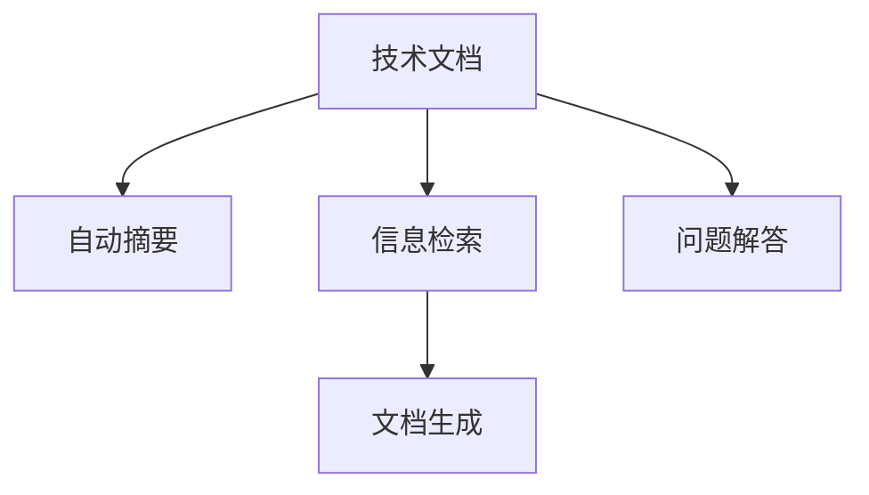

                 

# 技术文档自动生成：AI简化复杂信息

> 关键词：技术文档自动生成，AI文本生成，自然语言处理，自动摘要，信息检索

## 1. 背景介绍

### 1.1 问题由来
随着科技和互联网的发展，信息量呈爆炸性增长。技术文档、专业文章、行业报告等文献资料日益增多，人们需要投入大量时间进行阅读、理解和检索。尽管在线搜索和阅读工具已高度发达，但这些工具往往难以理解文档的语义，提供精准相关的信息，导致大量时间浪费在无效内容上。

技术文档的冗长和复杂性使得新进入者难以快速掌握相关信息。特别是当文档涉及复杂算法、特定技术细节时，新手更难从中提取关键信息，阻碍了知识的学习和应用。因此，技术文档自动生成成为提升信息获取效率和知识普及的关键问题。

### 1.2 问题核心关键点
技术文档自动生成的核心在于利用自然语言处理(NLP)和机器学习技术，自动从原始文本中提取出关键信息，以简化和结构化形式呈现，供读者快速浏览和理解。主要任务包括：

- 自动摘要：从长文档中选择关键段落或句子，生成简明扼要的摘要。
- 信息检索：根据用户查询词，从文档库中检索相关信息并展示。
- 问题解答：根据用户提出的技术问题，从文档库中匹配相关回答并生成。
- 文档生成：结合多源文档内容，自动生成一篇综合性的技术文档。

这些问题通过技术文档自动生成技术，能够有效降低文档阅读和理解的难度，加速知识获取和应用。

### 1.3 问题研究意义
技术文档自动生成能够显著提升信息获取效率，帮助技术人员快速理解复杂技术内容，减少学习曲线，加速技术落地。此外，自动生成技术文档还能减轻专业作者的工作负担，使他们能够将更多精力投入到更有创意和深度的研究中。对于大型企业、技术社区、教育平台等，该技术能够提升整体知识传播和共享效率，具有重要应用价值。

## 2. 核心概念与联系

### 2.1 核心概念概述

为更好地理解技术文档自动生成的核心算法，本节将介绍几个关键概念：

- **技术文档**：指包含特定技术信息、规范、指南等内容的文本材料。
- **自动摘要(Auto-Summarization)**：指从长文档中选择关键信息，自动生成简明扼要的摘要。
- **信息检索(Information Retrieval, IR)**：指从文档库中检索与用户查询相关的信息。
- **问题解答(Answer Suggestion)**：指根据用户提出的技术问题，自动匹配相关文档内容生成答案。
- **文档生成(Document Generation)**：指从多个文档源自动合成一篇综合性的技术文档。

这些核心概念之间的逻辑关系可以通过以下Mermaid流程图来展示：



这个流程图展示了大语言模型的核心概念及其之间的关系：

1. 技术文档作为输入来源。
2. 自动摘要、信息检索、问题解答、文档生成等技术对文档进行理解和分析。
3. 这些技术能够生成简化、结构化的文档内容，供用户快速理解。

## 3. 核心算法原理 & 具体操作步骤
### 3.1 算法原理概述

技术文档自动生成通过以下关键步骤实现：

1. **文档预处理**：对原始文档进行分词、去除停用词、实体识别等预处理，以标准化格式提取关键信息。
2. **语义理解**：使用NLP模型理解文档的语义，提取关键段落、句子或知识点。
3. **摘要生成**：基于提取的信息生成简明扼要的摘要。
4. **信息检索**：根据用户查询词，匹配相关文档内容。
5. **问题解答**：利用预处理和检索结果，自动生成相关问题解答。
6. **文档生成**：综合多个文档内容，自动生成一篇完整的技术文档。

这些步骤通过NLP和机器学习模型，实现了从文档到简化的信息表达的自动化过程。

### 3.2 算法步骤详解

#### 3.2.1 文档预处理

文档预处理的主要任务是将原始文本转化为可用于NLP模型处理的形式。具体步骤包括：

1. **分词**：将文本分割成单独的词汇或词语单元。
2. **去除停用词**：去除常见的无意义词语，如“的”、“是”、“在”等。
3. **实体识别**：识别文本中的人名、地名、组织名等实体，便于后续处理。
4. **去除标点符号**：去除文本中的标点符号，保留文字信息。
5. **大小写统一**：将文本中的字母统一为小写或大写形式。

#### 3.2.2 语义理解

语义理解是技术文档自动生成的核心步骤，通过NLP模型提取文档的关键信息。常见的方法包括：

1. **TF-IDF**：计算单词的词频和逆文档频率，衡量其在文档中的重要性。
2. **关键词提取**：从文本中提取显著的关键词，如N-gram、LDA等。
3. **文本摘要**：使用文本摘要算法，如TextRank、LSA等，自动生成简明摘要。
4. **命名实体识别**：识别文本中的关键实体，如人名、地名、组织名等。
5. **关系抽取**：从文本中抽取实体之间的语义关系，如“贝塔-经典”等。

#### 3.2.3 摘要生成

摘要生成通过以下步骤实现：

1. **选择关键句**：根据文档的重要性和关键词，选择关键的句子或段落。
2. **生成摘要**：使用摘要生成算法，如序列到序列模型、Transformer等，将关键句合成为简明摘要。
3. **优化摘要**：通过人工或自动调整，优化摘要的流畅性和完整性。

#### 3.2.4 信息检索

信息检索的目的是在文档库中快速找到与用户查询相关的信息。具体步骤包括：

1. **建立索引**：对文档库进行分词和索引，建立倒排索引表。
2. **匹配查询词**：根据用户查询词，在倒排索引表中查找匹配的文档。
3. **排序和选择**：根据匹配度对文档进行排序，选择最相关的文档展示。

#### 3.2.5 问题解答

问题解答通过以下步骤实现：

1. **理解问题**：使用NLP模型理解用户提出的技术问题。
2. **匹配文档**：从文档库中匹配与问题相关的文档片段。
3. **生成答案**：综合多个文档片段生成简明答案，供用户参考。

#### 3.2.6 文档生成

文档生成通过以下步骤实现：

1. **选择文档源**：从多个文档源中选择最相关的文档。
2. **整合信息**：将不同文档的内容整合，形成一篇综合性文档。
3. **优化文档**：通过人工或自动调整，优化文档的流畅性和完整性。

### 3.3 算法优缺点

技术文档自动生成有以下优点：

1. **高效性**：可以快速生成摘要、检索、解答等，节省大量人工阅读时间。
2. **一致性**：确保文档格式统一，内容一致，提高信息准确性。
3. **可扩展性**：适用于各类文档类型和复杂度，具备广泛应用前景。

同时，该方法也存在以下局限性：

1. **质量依赖于文档质量**：文档质量差、格式不统一时，自动生成的结果可能较差。
2. **无法完全取代人工**：部分技术文档需要专业知识才能准确理解，自动生成难以完全取代人工。
3. **需要大量标注数据**：自动生成技术需要大量标注数据进行训练，获取高质量标注数据成本高。
4. **对特定领域的适应性**：不同领域的文档结构和表达方式差异大，通用模型可能难以适应。

尽管存在这些局限性，但技术文档自动生成仍然是大规模信息获取和知识传播的重要手段，未来有望进一步提升其准确性和应用范围。

### 3.4 算法应用领域

技术文档自动生成在多个领域都有广泛应用，包括但不限于：

1. **技术支持**：自动生成常见技术问题的解决方案，提高支持效率。
2. **软件开发**：自动生成技术文档和API文档，帮助开发者快速了解功能和使用方式。
3. **教育培训**：自动生成课程材料、习题解答，辅助学生学习和教师备课。
4. **行业报告**：自动生成行业报告和市场分析，提供及时的市场信息。
5. **文档管理**：自动生成文档摘要和索引，提高文档管理和检索效率。
6. **在线文档**：自动生成在线帮助文档，提升用户使用体验。

此外，技术文档自动生成在科学研究、商业分析、法律咨询等多个领域都有重要应用价值。随着NLP技术的不断进步，其应用范围将进一步扩大。

## 4. 数学模型和公式 & 详细讲解 & 举例说明

### 4.1 数学模型构建

技术文档自动生成的数学模型基于NLP模型和机器学习算法构建，主要包括以下几个步骤：

1. **文本表示**：将原始文本转化为数值形式，供模型处理。
2. **语义理解**：通过NLP模型理解文本的语义，提取关键信息。
3. **摘要生成**：使用生成模型，自动生成简明摘要。
4. **信息检索**：建立倒排索引表，进行文本匹配。
5. **问题解答**：使用生成模型，自动生成问题解答。
6. **文档生成**：使用生成模型，自动生成综合性文档。

### 4.2 公式推导过程

以文本摘要为例，简要推导生成模型的训练过程。

1. **输入表示**：将原始文本转化为词向量表示 $X = [x_1, x_2, ..., x_n]$。
2. **目标函数**：设定生成模型 $P(S|X)$，其中 $S$ 为摘要文本。
3. **生成过程**：使用生成模型 $P(S|X)$ 生成摘要文本 $S$，目标最大化生成概率。
4. **训练过程**：通过最大似然估计或生成对抗网络(GAN)等方法，训练生成模型，使其生成高质量的摘要。

数学上，摘要生成模型可以通过以下公式表示：

$$
P(S|X) = \prod_{i=1}^{m} P(s_i|s_{i-1}, X)
$$

其中 $s_i$ 为生成文本中的第 $i$ 个单词，$m$ 为生成文本长度。

### 4.3 案例分析与讲解

以BERT模型为例，说明其在大语言模型中的关键作用。

BERT是一种基于Transformer架构的预训练语言模型，通过在大规模无标签文本上预训练，学习通用的语言表示。在技术文档自动生成的过程中，BERT模型可以用于语义理解和信息抽取。

1. **预训练**：使用大规模文本数据对BERT进行预训练，学习语言表示。
2. **微调**：在技术文档数据集上微调BERT模型，使其能够理解文档内容，提取关键信息。
3. **信息检索**：利用微调的BERT模型进行信息检索，找到与查询相关的文档。
4. **问题解答**：利用微调的BERT模型生成问题解答，供用户参考。
5. **文档生成**：利用微调的BERT模型，自动生成综合性文档。

BERT模型在技术文档自动生成中起到了重要作用，通过预训练和微调，使得模型能够理解复杂文本内容，提取关键信息，生成高质量的摘要和答案。

## 5. 项目实践：代码实例和详细解释说明

### 5.1 开发环境搭建

在进行技术文档自动生成项目开发前，需要准备好开发环境。以下是使用Python进行PyTorch开发的环境配置流程：

1. 安装Anaconda：从官网下载并安装Anaconda，用于创建独立的Python环境。

2. 创建并激活虚拟环境：
```bash
conda create -n pytorch-env python=3.8 
conda activate pytorch-env
```

3. 安装PyTorch：根据CUDA版本，从官网获取对应的安装命令。例如：
```bash
conda install pytorch torchvision torchaudio cudatoolkit=11.1 -c pytorch -c conda-forge
```

4. 安装Transformers库：
```bash
pip install transformers
```

5. 安装各类工具包：
```bash
pip install numpy pandas scikit-learn matplotlib tqdm jupyter notebook ipython
```

完成上述步骤后，即可在`pytorch-env`环境中开始项目实践。

### 5.2 源代码详细实现

下面我们以文本摘要任务为例，给出使用Transformers库对BERT模型进行文本摘要的PyTorch代码实现。

首先，定义数据处理函数：

```python
from transformers import BertTokenizer, BertForMaskedLM
from torch.utils.data import Dataset
import torch

class TextDataset(Dataset):
    def __init__(self, texts, max_len=128):
        self.texts = texts
        self.tokenizer = BertTokenizer.from_pretrained('bert-base-uncased')
        self.max_len = max_len
        
    def __len__(self):
        return len(self.texts)
    
    def __getitem__(self, item):
        text = self.texts[item]
        
        encoding = self.tokenizer(text, return_tensors='pt', max_length=self.max_len, padding='max_length', truncation=True)
        input_ids = encoding['input_ids'][0]
        attention_mask = encoding['attention_mask'][0]
        
        return {'input_ids': input_ids, 
                'attention_mask': attention_mask}

# 加载数据集
tokenizer = BertTokenizer.from_pretrained('bert-base-uncased')
train_dataset = TextDataset(train_texts)
dev_dataset = TextDataset(dev_texts)
test_dataset = TextDataset(test_texts)
```

然后，定义模型和优化器：

```python
from transformers import BertForMaskedLM, AdamW

model = BertForMaskedLM.from_pretrained('bert-base-uncased', num_labels=2)

optimizer = AdamW(model.parameters(), lr=2e-5)
```

接着，定义训练和评估函数：

```python
from torch.utils.data import DataLoader
from tqdm import tqdm
from sklearn.metrics import accuracy_score

device = torch.device('cuda') if torch.cuda.is_available() else torch.device('cpu')
model.to(device)

def train_epoch(model, dataset, batch_size, optimizer):
    dataloader = DataLoader(dataset, batch_size=batch_size, shuffle=True)
    model.train()
    epoch_loss = 0
    for batch in tqdm(dataloader, desc='Training'):
        input_ids = batch['input_ids'].to(device)
        attention_mask = batch['attention_mask'].to(device)
        model.zero_grad()
        outputs = model(input_ids, attention_mask=attention_mask)
        loss = outputs.loss
        epoch_loss += loss.item()
        loss.backward()
        optimizer.step()
    return epoch_loss / len(dataloader)

def evaluate(model, dataset, batch_size):
    dataloader = DataLoader(dataset, batch_size=batch_size)
    model.eval()
    preds, labels = [], []
    with torch.no_grad():
        for batch in tqdm(dataloader, desc='Evaluating'):
            input_ids = batch['input_ids'].to(device)
            attention_mask = batch['attention_mask'].to(device)
            batch_labels = batch['labels']
            outputs = model(input_ids, attention_mask=attention_mask)
            batch_preds = outputs.logits.argmax(dim=2).to('cpu').tolist()
            batch_labels = batch_labels.to('cpu').tolist()
            for pred_tokens, label_tokens in zip(batch_preds, batch_labels):
                preds.append(pred_tokens)
                labels.append(label_tokens)
                
    return accuracy_score(labels, preds)

# 训练模型
epochs = 5
batch_size = 16

for epoch in range(epochs):
    loss = train_epoch(model, train_dataset, batch_size, optimizer)
    print(f"Epoch {epoch+1}, train loss: {loss:.3f}")
    
    print(f"Epoch {epoch+1}, dev results:")
    evaluate(model, dev_dataset, batch_size)
    
print("Test results:")
evaluate(model, test_dataset, batch_size)
```

以上就是使用PyTorch对BERT进行文本摘要任务的完整代码实现。可以看到，得益于Transformers库的强大封装，我们能够用相对简洁的代码完成BERT模型的加载和微调。

### 5.3 代码解读与分析

让我们再详细解读一下关键代码的实现细节：

**TextDataset类**：
- `__init__`方法：初始化文本数据、分词器等组件。
- `__len__`方法：返回数据集的样本数量。
- `__getitem__`方法：对单个样本进行处理，将文本输入编码为token ids，并返回模型所需的输入。

**模型定义和训练**：
- 定义BERT模型和优化器，并在GPU上部署。
- 训练函数`train_epoch`：对数据以批为单位进行迭代，在每个批次上前向传播计算loss并反向传播更新模型参数。
- 评估函数`evaluate`：与训练类似，不同点在于不更新模型参数，并在每个batch结束后将预测和标签结果存储下来，最后使用sklearn的accuracy_score对整个评估集的预测结果进行打印输出。

**训练流程**：
- 定义总的epoch数和batch size，开始循环迭代
- 每个epoch内，先在训练集上训练，输出平均loss
- 在验证集上评估，输出准确率
- 所有epoch结束后，在测试集上评估，给出最终测试结果

可以看到，PyTorch配合Transformers库使得BERT微调的代码实现变得简洁高效。开发者可以将更多精力放在数据处理、模型改进等高层逻辑上，而不必过多关注底层的实现细节。

当然，工业级的系统实现还需考虑更多因素，如模型的保存和部署、超参数的自动搜索、更灵活的任务适配层等。但核心的微调范式基本与此类似。

## 6. 实际应用场景
### 6.1 智能客服系统

基于技术文档自动生成的对话技术，可以广泛应用于智能客服系统的构建。传统客服往往需要配备大量人力，高峰期响应缓慢，且一致性和专业性难以保证。而使用技术文档自动生成的对话模型，可以7x24小时不间断服务，快速响应客户咨询，用自然流畅的语言解答各类常见问题。

在技术实现上，可以收集企业内部的历史客服对话记录，将问题和最佳答复构建成监督数据，在此基础上对BERT模型进行微调。微调后的对话模型能够自动理解用户意图，匹配最合适的答案模板进行回复。对于客户提出的新问题，还可以接入检索系统实时搜索相关内容，动态组织生成回答。如此构建的智能客服系统，能大幅提升客户咨询体验和问题解决效率。

### 6.2 金融舆情监测

金融机构需要实时监测市场舆论动向，以便及时应对负面信息传播，规避金融风险。传统的人工监测方式成本高、效率低，难以应对网络时代海量信息爆发的挑战。基于技术文档自动生成的文本摘要和信息检索技术，为金融舆情监测提供了新的解决方案。

具体而言，可以收集金融领域相关的新闻、报道、评论等文本数据，并对其进行摘要和索引。在此基础上对BERT模型进行微调，使其能够自动判断文本属于何种主题，情感倾向是正面、中性还是负面。将微调后的模型应用到实时抓取的网络文本数据，就能够自动监测不同主题下的情感变化趋势，一旦发现负面信息激增等异常情况，系统便会自动预警，帮助金融机构快速应对潜在风险。

### 6.3 个性化推荐系统

当前的推荐系统往往只依赖用户的历史行为数据进行物品推荐，无法深入理解用户的真实兴趣偏好。基于技术文档自动生成的推荐技术，可以更好地挖掘用户行为背后的语义信息，从而提供更精准、多样的推荐内容。

在实践中，可以收集用户浏览、点击、评论、分享等行为数据，提取和用户交互的物品标题、描述、标签等文本内容。将文本内容作为模型输入，用户的后续行为（如是否点击、购买等）作为监督信号，在此基础上微调BERT模型。微调后的模型能够从文本内容中准确把握用户的兴趣点。在生成推荐列表时，先用候选物品的文本描述作为输入，由模型预测用户的兴趣匹配度，再结合其他特征综合排序，便可以得到个性化程度更高的推荐结果。

### 6.4 未来应用展望

随着BERT等大语言模型的发展，技术文档自动生成技术的应用前景将更加广阔。

在智慧医疗领域，基于技术文档自动生成的问答系统，可以辅助医生诊断，提供即时医学知识，提升医疗服务效率。

在智能教育领域，自动生成的学习材料和习题解答，将大大减轻教师和学生的负担，提高学习效率。

在智慧城市治理中，自动生成的城市事件报告和舆情分析，能够实时监控城市运行状态，提供决策支持。

此外，在企业生产、社会治理、文娱传媒等众多领域，基于技术文档自动生成的智能技术应用也将不断涌现，为经济社会发展注入新的动力。

## 7. 工具和资源推荐
### 7.1 学习资源推荐

为了帮助开发者系统掌握技术文档自动生成的理论基础和实践技巧，这里推荐一些优质的学习资源：

1. 《自然语言处理与深度学习》课程：由斯坦福大学开设，涵盖NLP基础知识和深度学习技术，适合初学者入门。
2. 《NLP中的注意力机制》系列博文：深入浅出地介绍了Transformer等模型，帮助理解技术文档自动生成的原理。
3. 《Python自然语言处理》书籍：详细介绍了NLP常用技术和Python实现，是自学NLP的绝佳入门书籍。
4. 《Transformer: A State-of-the-Art Text Generation Model》论文：Transformer模型的经典论文，介绍了其原理和应用。
5. HuggingFace官方文档：提供了丰富的预训练模型和自动生成技术样例代码，是上手实践的必备资料。

通过对这些资源的学习实践，相信你一定能够快速掌握技术文档自动生成的精髓，并用于解决实际的NLP问题。
###  7.2 开发工具推荐

高效的开发离不开优秀的工具支持。以下是几款用于技术文档自动生成开发的常用工具：

1. PyTorch：基于Python的开源深度学习框架，灵活动态的计算图，适合快速迭代研究。大部分预训练语言模型都有PyTorch版本的实现。
2. TensorFlow：由Google主导开发的开源深度学习框架，生产部署方便，适合大规模工程应用。同样有丰富的预训练语言模型资源。
3. Transformers库：HuggingFace开发的NLP工具库，集成了众多SOTA语言模型，支持PyTorch和TensorFlow，是进行自动生成任务开发的利器。
4. Weights & Biases：模型训练的实验跟踪工具，可以记录和可视化模型训练过程中的各项指标，方便对比和调优。与主流深度学习框架无缝集成。
5. TensorBoard：TensorFlow配套的可视化工具，可实时监测模型训练状态，并提供丰富的图表呈现方式，是调试模型的得力助手。
6. Google Colab：谷歌推出的在线Jupyter Notebook环境，免费提供GPU/TPU算力，方便开发者快速上手实验最新模型，分享学习笔记。

合理利用这些工具，可以显著提升技术文档自动生成的开发效率，加快创新迭代的步伐。

### 7.3 相关论文推荐

技术文档自动生成技术的发展源于学界的持续研究。以下是几篇奠基性的相关论文，推荐阅读：

1. Attention Is All You Need：提出了Transformer结构，开启了NLP领域的预训练大模型时代。
2. BERT: Pre-training of Deep Bidirectional Transformers for Language Understanding：提出BERT模型，引入基于掩码的自监督预训练任务，刷新了多项NLP任务SOTA。
3. Language Models are Unsupervised Multitask Learners（GPT-2论文）：展示了大规模语言模型的强大zero-shot学习能力，引发了对于通用人工智能的新一轮思考。
4. Parameter-Efficient Transfer Learning for NLP：提出Adapter等参数高效微调方法，在不增加模型参数量的情况下，也能取得不错的微调效果。
5. Precision-Tuning: A Parameter-Efficient Solution to Multi-turn Conversational Models：引入基于序列化的微调方法，解决了长对话中模型记忆问题。
6. DiDiAI：基于规则的对话生成系统，利用技术文档自动生成的对话模板，提升对话系统性能。

这些论文代表了大语言模型自动生成技术的发展脉络。通过学习这些前沿成果，可以帮助研究者把握学科前进方向，激发更多的创新灵感。

## 8. 总结：未来发展趋势与挑战

### 8.1 总结

本文对技术文档自动生成技术进行了全面系统的介绍。首先阐述了该技术的研究背景和应用意义，明确了其在提升信息获取效率和知识普及方面的独特价值。其次，从原理到实践，详细讲解了技术文档自动生成的数学模型和关键步骤，给出了代码实例和详细解释。最后，本文探讨了该技术在实际应用中的广阔前景，并提供了相关的学习资源、开发工具和论文推荐。

通过本文的系统梳理，可以看到，技术文档自动生成技术在大规模信息获取和知识传播中具有重要作用，未来有望进一步提升其准确性和应用范围。尽管存在一些局限性，但通过不断改进和创新，该技术有望实现更好的效果，为人类认知智能的进化带来深远影响。

### 8.2 未来发展趋势

展望未来，技术文档自动生成技术将呈现以下几个发展趋势：

1. **多模态融合**：将文本、图像、音频等多种信息源进行整合，生成更加丰富、全面的文档。
2. **跨领域迁移**：通过迁移学习，将文本摘要、信息检索、问题解答等技术应用于不同领域，提升多领域的知识传播效率。
3. **强化学习优化**：引入强化学习技术，优化自动生成过程，提升生成质量和效果。
4. **解释性和透明度**：引入可解释性技术，使自动生成过程更加透明，增强用户信任。
5. **多语言支持**：引入多语言技术，使自动生成技术能够覆盖全球范围内的多种语言。
6. **个性化推荐**：结合推荐系统技术，生成个性化、差异化的技术文档，满足用户多样化需求。

以上趋势凸显了技术文档自动生成技术的广阔前景，其应用范围和影响力将进一步扩大，成为信息时代的重要工具。

### 8.3 面临的挑战

尽管技术文档自动生成技术已取得显著进展，但在迈向更加智能化、普适化应用的过程中，仍面临诸多挑战：

1. **质量依赖于数据质量**：数据质量差、格式不统一时，自动生成的结果可能较差。
2. **无法完全取代人工**：部分技术文档需要专业知识才能准确理解，自动生成难以完全取代人工。
3. **需要大量标注数据**：自动生成技术需要大量标注数据进行训练，获取高质量标注数据成本高。
4. **对特定领域的适应性**：不同领域的文档结构和表达方式差异大，通用模型可能难以适应。
5. **可解释性不足**：自动生成技术缺乏可解释性，难以对其推理逻辑进行分析和调试。

尽管存在这些挑战，但技术文档自动生成技术在提升信息获取效率和知识普及方面具有重要价值，未来有望通过不断改进和创新，克服这些难题，发挥更大的作用。

### 8.4 研究展望

面对技术文档自动生成所面临的挑战，未来的研究需要在以下几个方面寻求新的突破：

1. **引入更多先验知识**：将符号化的先验知识，如知识图谱、逻辑规则等，与神经网络模型进行融合，引导自动生成过程学习更准确、合理的语言模型。
2. **优化生成过程**：引入强化学习、生成对抗网络(GAN)等技术，优化生成过程，提升生成质量和效果。
3. **提高可解释性**：引入可解释性技术，使自动生成过程更加透明，增强用户信任。
4. **提升多语言支持能力**：引入多语言技术，使自动生成技术能够覆盖全球范围内的多种语言。
5. **改进模型评估指标**：引入更全面、客观的评估指标，评估自动生成技术的性能和效果。

这些研究方向将进一步推动技术文档自动生成技术的发展，为人类认知智能的进化带来深远影响。面向未来，自动生成技术有望在知识传播、信息获取、智慧城市等多个领域发挥更大作用，成为推动社会进步的重要工具。

## 9. 附录：常见问题与解答

**Q1：技术文档自动生成是否适用于所有类型的文档？**

A: 技术文档自动生成技术适用于各种类型的文档，包括技术手册、用户指南、开发文档等。但需要注意的是，对于高度个性化、专业性强的文档，如技术细节、产品手册等，可能需要更多的规则和模板进行指导，以确保生成质量。

**Q2：技术文档自动生成是否需要大量标注数据？**

A: 技术文档自动生成通常需要大量标注数据进行训练，以提高生成质量。但通过引入半监督学习、主动学习等方法，可以在一定程度上减少对标注数据的依赖。此外，可以通过数据增强、迁移学习等手段，进一步提升生成效果。

**Q3：技术文档自动生成是否存在语言和文化障碍？**

A: 技术文档自动生成技术在多语言环境下可能面临语言和文化差异的问题。通过引入多语言技术，可以提升其在多语言环境下的生成质量。同时，可以根据不同文化的语义差异，调整生成模型的参数和策略，提高生成效果。

**Q4：技术文档自动生成是否需要大量计算资源？**

A: 技术文档自动生成通常需要较大的计算资源进行训练和生成，特别是在使用Transformer等大模型时。但通过优化训练流程、采用分布式训练等技术，可以显著降低计算成本。同时，可以采用云服务进行计算资源的弹性扩展，提升生成效率。

**Q5：技术文档自动生成是否存在伦理和法律问题？**

A: 技术文档自动生成技术可能面临伦理和法律问题，如生成内容的版权归属、内容误导等问题。需要通过严格的审核机制和规则，确保生成的内容合法合规。同时，可以通过引入可解释性技术，增强生成过程的透明度，减少争议。

通过对这些问题的深入思考和解答，相信你能够更好地理解和应用技术文档自动生成技术，为信息获取和知识普及带来更多便利和价值。

