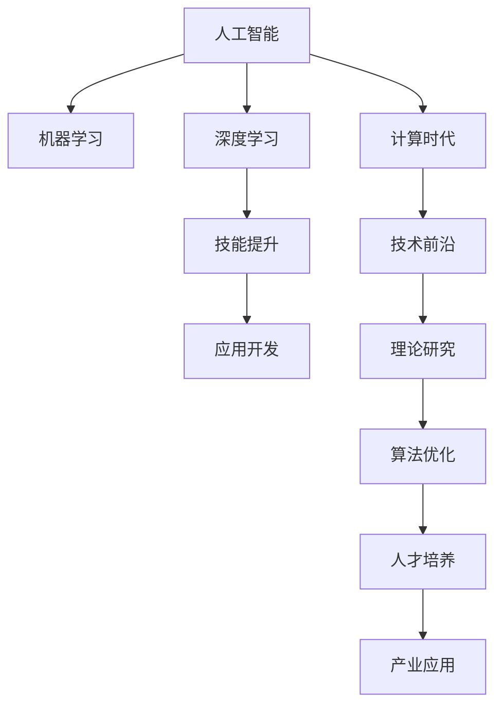

                 

# 技能提升：适应人类计算时代的新需求

> 关键词：技能提升, 人工智能, 机器学习, 深度学习, 计算时代, 技术前沿

## 1. 背景介绍

随着人工智能技术的迅猛发展，人类社会正在迈入一个全新的计算时代。在这一时代，人类将面临前所未有的机遇与挑战。如何提升个人技能，适应这一新的技术环境，将成为每个从业者必须面对的重要课题。本文将围绕人工智能领域的技术前沿，系统梳理当前的技能提升需求，并给出相应的策略和方法。

## 2. 核心概念与联系

### 2.1 核心概念概述

本节将介绍几个与技能提升密切相关的核心概念：

- **人工智能（Artificial Intelligence, AI）**：模拟人类智能行为的计算系统，包括机器学习、深度学习、自然语言处理等技术。
- **机器学习（Machine Learning, ML）**：通过算法使计算机系统从数据中学习规律，实现自主决策的科学。
- **深度学习（Deep Learning, DL）**：使用多层神经网络进行复杂数据表示和模式学习，适用于图像识别、自然语言理解等任务。
- **计算时代（Computational Age）**：人工智能、大数据等技术革新驱动的社会信息化、智能化进程。
- **技能提升（Skill Enhancement）**：通过学习和实践，提升个人在技术、管理、创新等方面的综合能力。
- **技术前沿（Technology Frontier）**：当前及未来一段时期内，人工智能领域的前沿技术和研究热点。

这些概念之间的逻辑关系可以通过以下Mermaid流程图来展示：



这个流程图展示了一系列核心概念之间的关系：

1. 人工智能是基础，涵盖机器学习和深度学习等子领域。
2. 计算时代驱动技术前沿不断涌现，涵盖算法优化和理论研究。
3. 技术前沿推进技能提升，进而推动应用开发和人才培养。
4. 应用开发和人才培养反过来又促进了技术前沿的进步。

## 3. 核心算法原理 & 具体操作步骤

### 3.1 算法原理概述

在技能提升的背景下，我们重点关注深度学习和自然语言处理（NLP）领域的一些核心算法原理。这里以自然语言理解（NLU）任务为例，说明如何通过深度学习模型进行技能提升。

自然语言理解任务的目标是将自然语言文本转化为计算机可理解的形式，以供机器处理和生成。其核心算法包括序列到序列（Seq2Seq）模型、Transformer模型、BERT模型等。这些模型通过自监督学习和监督学习相结合的方式进行训练，以优化模型在特定任务上的性能。

### 3.2 算法步骤详解

深度学习模型进行技能提升的步骤通常包括以下几个环节：

1. **数据准备**：收集和预处理文本数据，构建训练集和验证集。数据通常需要清洗、标注、分词等预处理。
2. **模型选择**：根据任务特点选择合适的深度学习模型，如Seq2Seq、Transformer、BERT等。
3. **模型训练**：使用训练集对模型进行有监督训练，最小化损失函数。
4. **模型评估**：在验证集上评估模型性能，调整超参数。
5. **模型应用**：将训练好的模型应用于实际场景，进行推理和生成。

### 3.3 算法优缺点

深度学习模型在技能提升中具有以下优点：

- **模型性能优越**：通过大量数据训练，能够学习到丰富的语言表示，适用于多种自然语言处理任务。
- **自动化程度高**：模型训练和推理过程自动化，减少了人工干预。
- **泛化能力强**：能够处理多种语言和文本格式，适应性广。

同时，这些模型也存在一些局限：

- **计算资源需求高**：模型参数量巨大，训练和推理需要高性能计算资源。
- **模型可解释性差**：黑盒模型难以解释内部决策过程。
- **数据依赖性强**：模型性能依赖于高质量标注数据。

### 3.4 算法应用领域

深度学习模型在技能提升中具有广泛的应用领域，包括但不限于：

- **自然语言理解**：情感分析、机器翻译、问答系统等。
- **语音识别**：自动语音识别（ASR）、语音合成（TTS）等。
- **图像识别**：物体检测、人脸识别、图像分类等。
- **智能推荐**：内容推荐、广告推荐等。
- **金融分析**：风险评估、投资建议等。
- **医疗健康**：疾病诊断、基因分析等。

## 4. 数学模型和公式 & 详细讲解 & 举例说明

### 4.1 数学模型构建

在自然语言理解任务中，我们通常使用编码器-解码器（Encoder-Decoder）架构。以Seq2Seq模型为例，其基本架构包括：

- **编码器（Encoder）**：将输入序列转化为固定长度的向量表示。
- **解码器（Decoder）**：根据编码器输出的向量表示，生成目标序列。

使用Seq2Seq模型进行自然语言理解，需要解决以下几个核心问题：

1. 如何将输入序列编码为向量表示。
2. 如何将编码器输出的向量表示解码为目标序列。
3. 如何优化模型参数，最小化损失函数。

### 4.2 公式推导过程

以Seq2Seq模型为例，其训练目标函数可以表示为：

$$
\mathcal{L} = -\frac{1}{N}\sum_{i=1}^N \sum_{j=1}^M \log P_{\theta}(y_i|x_j)
$$

其中，$x$ 为输入序列，$y$ 为目标序列，$P_{\theta}(y|x)$ 为模型输出的概率分布，$N$ 为输入序列长度，$M$ 为目标序列长度。

在训练过程中，通常使用反向传播算法计算梯度，使用优化器（如Adam、SGD等）更新模型参数。具体来说，训练过程分为前向传播和反向传播两个步骤：

- **前向传播**：将输入序列输入编码器，生成向量表示；将向量表示输入解码器，生成目标序列的概率分布。
- **反向传播**：计算损失函数对模型参数的梯度，使用优化器更新模型参数。

### 4.3 案例分析与讲解

以情感分析任务为例，假设我们有一个电影评论文本数据集，我们的目标是通过模型判断评论情感是正面还是负面。我们可以使用LSTM或GRU作为编码器，使用一个全连接层作为解码器，对情感进行二分类。训练过程如下：

1. 数据准备：收集电影评论文本数据，进行清洗、标注、分词等预处理。
2. 模型选择：选择LSTM或GRU作为编码器，使用全连接层作为解码器。
3. 模型训练：使用训练集对模型进行有监督训练，最小化交叉熵损失函数。
4. 模型评估：在验证集上评估模型性能，调整超参数。
5. 模型应用：将训练好的模型应用于测试集，判断评论情感是正面还是负面。

## 5. 项目实践：代码实例和详细解释说明

### 5.1 开发环境搭建

在进行项目实践前，我们需要准备好开发环境。以下是使用Python进行PyTorch开发的流程：

1. 安装Anaconda：从官网下载并安装Anaconda，用于创建独立的Python环境。
2. 创建并激活虚拟环境：
```bash
conda create -n pytorch-env python=3.8 
conda activate pytorch-env
```
3. 安装PyTorch：根据CUDA版本，从官网获取对应的安装命令。例如：
```bash
conda install pytorch torchvision torchaudio cudatoolkit=11.1 -c pytorch -c conda-forge
```
4. 安装TensorBoard：用于可视化训练过程和结果。
```bash
pip install tensorboard
```
5. 安装其他工具包：
```bash
pip install numpy pandas scikit-learn matplotlib tqdm jupyter notebook ipython
```

完成上述步骤后，即可在`pytorch-env`环境中开始项目实践。

### 5.2 源代码详细实现

下面以情感分析任务为例，给出使用PyTorch进行项目实践的代码实现。

```python
import torch
from torch import nn, optim
from torch.utils.data import DataLoader
from torchtext.datasets import IMDB
from torchtext.data import Field, BucketIterator

# 定义数据处理
TEXT = Field(tokenize='spacy', include_lengths=True)
LABEL = Field(sequential=False, use_vocab=False)

TEXT.build_vocab(imdb.DICT, specials=["[PAD]", "[UNK]", "[CLS]", "[SEP]"])
LABEL.build_vocab(imdb.LABELS)

train_data, test_data = imdb.splits(TEXT, LABEL)
train_iterator, test_iterator = BucketIterator.splits((train_data, test_data), batch_size=32, sort_key=lambda x: len(x.text))

# 定义模型结构
class RNN(nn.Module):
    def __init__(self, input_size, hidden_size, output_size):
        super(RNN, self).__init__()
        self.hidden_size = hidden_size
        self.embedding = nn.Embedding(input_size, hidden_size)
        self.rnn = nn.RNN(hidden_size, hidden_size, batch_first=True)
        self.fc = nn.Linear(hidden_size, output_size)

    def forward(self, input, hidden):
        embedded = self.embedding(input)
        output, hidden = self.rnn(embedded, hidden)
        assert torch.equal(output[-1,:,:], hidden)
        return self.fc(output[-1,:,:]), hidden

# 初始化模型和优化器
model = RNN(len(TEXT.vocab), 256, 1)
optimizer = optim.Adam(model.parameters(), lr=1e-3)
criterion = nn.BCEWithLogitsLoss()

# 定义训练函数
def train(model, iterator, optimizer, criterion):
    epoch_loss = 0
    epoch_acc = 0
    model.train()
    for batch in iterator:
        optimizer.zero_grad()
        predictions, _ = model(batch.text, batch.hidden)
        loss = criterion(predictions.squeeze(1), batch.label)
        epoch_loss += loss.item()
        accuracy = binary_accuracy(predictions, batch.label)
        epoch_acc += accuracy.item()
        loss.backward()
        optimizer.step()

    return epoch_loss / len(iterator), epoch_acc / len(iterator)

# 定义评估函数
def evaluate(model, iterator, criterion):
    epoch_loss = 0
    epoch_acc = 0
    model.eval()
    with torch.no_grad():
        for batch in iterator:
            predictions, _ = model(batch.text, batch.hidden)
            loss = criterion(predictions.squeeze(1), batch.label)
            epoch_loss += loss.item()
            accuracy = binary_accuracy(predictions, batch.label)
            epoch_acc += accuracy.item()

    return epoch_loss / len(iterator), epoch_acc / len(iterator)

# 训练模型
N_epochs = 10
for epoch in range(N_epochs):
    train_loss, train_acc = train(model, train_iterator, optimizer, criterion)
    test_loss, test_acc = evaluate(model, test_iterator, criterion)
    print(f'Epoch: {epoch+1:02}, Train Loss: {train_loss:.3f}, Train Acc: {train_acc*100:.2f}% / Test Loss: {test_loss:.3f}, Test Acc: {test_acc*100:.2f}%')

print("Optimization Finished!")
```

### 5.3 代码解读与分析

让我们再详细解读一下关键代码的实现细节：

**RNN类**：
- `__init__`方法：定义模型的结构，包括嵌入层、RNN层和全连接层。
- `forward`方法：实现模型前向传播。
- `train`函数：定义训练过程，包含损失函数、优化器、准确率计算等。
- `evaluate`函数：定义评估过程，包含损失函数、准确率计算等。

**train和evaluate函数**：
- 使用`train`函数对模型进行训练，并计算训练集的损失和准确率。
- 使用`evaluate`函数对模型进行评估，并计算测试集的损失和准确率。
- 在训练过程中，每轮训练后输出训练集和测试集的损失和准确率。

通过以上代码，我们可以看到PyTorch提供了非常便捷和灵活的模型构建和训练方式，能够快速实现深度学习模型的项目实践。

## 6. 实际应用场景

### 6.1 智能客服系统

智能客服系统在各行各业中广泛应用，能够提升客户满意度、降低人工成本。基于深度学习的智能客服系统，可以自动处理大量客户咨询，并提供准确的回答。

在实际应用中，智能客服系统通常使用文本分类、情感分析、对话生成等技术。首先，系统通过NLP技术对客户咨询进行分词、标注等预处理；然后，使用深度学习模型进行文本分类和情感分析，判断客户咨询的意图和情感倾向；最后，生成或检索最合适的回答，回复客户。

### 6.2 金融舆情监测

金融舆情监测是金融机构风险管理的重要环节，能够及时发现和应对舆情风险。基于深度学习的金融舆情监测系统，能够自动监测金融市场动态，并及时预警潜在的风险。

在实际应用中，系统使用情感分析、文本分类等技术，对金融市场的新闻、评论等文本数据进行分析。首先，系统进行文本清洗、分词等预处理；然后，使用深度学习模型对文本进行情感分类和主题分类；最后，根据分类结果生成预警信息，提示金融机构采取相应措施。

### 6.3 个性化推荐系统

个性化推荐系统是电商、视频、音乐等平台的重要组成部分，能够提升用户体验和平台收益。基于深度学习的个性化推荐系统，可以分析用户的行为数据，推荐用户感兴趣的内容。

在实际应用中，系统使用序列建模、协同过滤等技术。首先，系统收集用户的历史行为数据，进行预处理和特征提取；然后，使用深度学习模型对用户行为进行建模，生成推荐列表；最后，根据推荐列表为用户推荐感兴趣的内容。

### 6.4 未来应用展望

深度学习模型在技能提升中的应用前景广阔。未来，随着技术的不断进步，深度学习模型将在更多领域得到应用，为各行各业带来变革性影响。

在智慧医疗领域，基于深度学习的医疗影像分析、疾病诊断等应用将提升医疗服务的智能化水平，辅助医生诊断，提升治疗效果。

在智能教育领域，基于深度学习的个性化学习、智能辅导等应用将因材施教，提升教学效果，促进教育公平。

在智慧城市治理中，基于深度学习的城市事件监测、智能交通等应用将提高城市管理的智能化水平，构建更安全、高效的未来城市。

## 7. 工具和资源推荐

### 7.1 学习资源推荐

为了帮助开发者系统掌握深度学习模型的技能提升需求，这里推荐一些优质的学习资源：

1. 《深度学习》（周志华）：全面介绍深度学习的基本概念、算法和应用。
2. 《Python深度学习》（Francois Chollet）：介绍TensorFlow和Keras的使用，涵盖深度学习模型的开发和应用。
3. 《自然语言处理综论》（Daniel Jurafsky和James H. Martin）：全面介绍自然语言处理的基本概念和应用。
4. Coursera和Udacity的深度学习和自然语言处理课程：由顶级大学和公司提供的免费在线课程，涵盖深度学习模型的理论和实践。
5. Kaggle和AI Challenger等数据竞赛平台：提供大量实际问题，供开发者实践和展示技能。

通过对这些资源的学习实践，相信你一定能够快速掌握深度学习模型的技能提升需求，并用于解决实际的NLP问题。

### 7.2 开发工具推荐

高效的开发离不开优秀的工具支持。以下是几款用于深度学习模型开发和部署的常用工具：

1. PyTorch：基于Python的开源深度学习框架，灵活动态的计算图，适合快速迭代研究。
2. TensorFlow：由Google主导开发的开源深度学习框架，生产部署方便，适合大规模工程应用。
3. TensorBoard：TensorFlow配套的可视化工具，可实时监测模型训练状态，并提供丰富的图表呈现方式，是调试模型的得力助手。
4. Weights & Biases：模型训练的实验跟踪工具，可以记录和可视化模型训练过程中的各项指标，方便对比和调优。
5. Jupyter Notebook：交互式编程环境，支持多种编程语言和库，方便实验和协作。
6. Anaconda：Python环境的构建和管理工具，方便创建和管理虚拟环境。

合理利用这些工具，可以显著提升深度学习模型开发和部署的效率，加快创新迭代的步伐。

### 7.3 相关论文推荐

深度学习模型在技能提升中的应用源于学界的持续研究。以下是几篇奠基性的相关论文，推荐阅读：

1. 《ImageNet Classification with Deep Convolutional Neural Networks》（AlexNet论文）：提出卷积神经网络，开启深度学习在图像处理领域的应用。
2. 《A Tutorial on Deep Learning》（Ian Goodfellow等）：全面介绍深度学习的基本概念、算法和应用。
3. 《Attention Is All You Need》（Transformer论文）：提出Transformer结构，开创了深度学习在自然语言处理领域的新时代。
4. 《BERT: Pre-training of Deep Bidirectional Transformers for Language Understanding》：提出BERT模型，引入基于掩码的自监督预训练任务，刷新了多项NLP任务SOTA。
5. 《EfficientNet: Rethinking Model Scaling for Convolutional Neural Networks》：提出EfficientNet模型，通过自动化模型缩放，显著提升模型的性能和效率。
6. 《AdaLoRA: Adaptive Low-Rank Adaptation for Parameter-Efficient Fine-Tuning》：提出AdaLoRA方法，使用自适应低秩适应的微调方法，在参数效率和精度之间取得新的平衡。

这些论文代表了大深度学习模型技能提升的发展脉络。通过学习这些前沿成果，可以帮助研究者把握学科前进方向，激发更多的创新灵感。

## 8. 总结：未来发展趋势与挑战

### 8.1 总结

本文对深度学习模型在技能提升中的应用进行了全面系统的介绍。首先阐述了技能提升在人工智能时代的背景和意义，明确了深度学习模型在技能提升中的核心作用。其次，从原理到实践，详细讲解了深度学习模型的核心算法和操作步骤，给出了项目实践的完整代码实例。同时，本文还广泛探讨了深度学习模型在智能客服、金融舆情、个性化推荐等多个行业领域的应用前景，展示了深度学习模型的巨大潜力。此外，本文精选了深度学习模型的各类学习资源，力求为读者提供全方位的技术指引。

通过本文的系统梳理，可以看到，深度学习模型在技能提升中已经展现出广泛的应用前景。这些技术的不断进步，必将进一步推动人工智能技术的落地应用，为各行各业带来变革性影响。

### 8.2 未来发展趋势

展望未来，深度学习模型在技能提升中的应用将呈现以下几个发展趋势：

1. 模型规模持续增大。随着算力成本的下降和数据规模的扩张，深度学习模型的参数量还将持续增长。超大规模模型蕴含的丰富知识，有望支撑更加复杂多变的技能提升任务。
2. 技能提升方法多样化。除了传统的监督学习和无监督学习，未来会涌现更多半监督学习、自监督学习、少样本学习等方法，以更少的标注样本实现高效的技能提升。
3. 模型应用领域广泛。深度学习模型将在更多领域得到应用，如医疗、金融、教育等，推动这些领域的智能化进程。
4. 模型可解释性增强。未来深度学习模型将更加注重可解释性，通过引入因果推断、符号计算等方法，提升模型的透明性和可信度。
5. 多模态融合趋势明显。深度学习模型将更多地融合视觉、语音、文本等多种模态数据，提升模型的综合理解和推理能力。

以上趋势凸显了深度学习模型在技能提升中的广阔前景。这些方向的探索发展，必将进一步提升技能提升系统的性能和应用范围，为各行各业带来更加智能化的解决方案。

### 8.3 面临的挑战

尽管深度学习模型在技能提升中已经取得了瞩目成就，但在迈向更加智能化、普适化应用的过程中，它仍面临着诸多挑战：

1. 标注成本瓶颈。尽管深度学习模型能够在少量标注样本下进行高效训练，但对于某些任务，获取高质量标注数据的成本仍然较高。如何进一步降低对标注样本的依赖，将是一大难题。
2. 模型鲁棒性不足。深度学习模型面临域外数据的泛化性能差，对于输入的微小扰动，模型的预测容易出现波动。如何提高模型的鲁棒性，避免灾难性遗忘，还需要更多理论和实践的积累。
3. 推理效率有待提高。深度学习模型的推理速度慢，内存占用大，难以满足实时性的要求。如何优化模型结构，提升推理速度，优化资源占用，将是重要的优化方向。
4. 模型可解释性亟需加强。深度学习模型的黑盒特性，难以解释内部决策过程。如何赋予模型更强的可解释性，将是亟待攻克的难题。
5. 安全性有待保障。深度学习模型难免会学习到有害信息，通过技能提升传递到实际应用，产生误导性、歧视性的输出，给实际应用带来安全隐患。如何从数据和算法层面消除模型偏见，避免恶意用途，确保输出的安全性，也将是重要的研究课题。
6. 知识整合能力不足。现有的技能提升模型往往局限于任务内数据，难以灵活吸收和运用更广泛的先验知识。如何让技能提升过程更好地与外部知识库、规则库等专家知识结合，形成更加全面、准确的信息整合能力，还有很大的想象空间。

正视深度学习模型在技能提升中面临的这些挑战，积极应对并寻求突破，将是大规模深度学习模型技能提升走向成熟的必由之路。相信随着学界和产业界的共同努力，这些挑战终将一一被克服，深度学习模型必将在构建智能系统方面发挥更大的作用。

### 8.4 研究展望

面对深度学习模型在技能提升中面临的种种挑战，未来的研究需要在以下几个方面寻求新的突破：

1. 探索无监督和半监督技能提升方法。摆脱对大规模标注数据的依赖，利用自监督学习、主动学习等无监督和半监督范式，最大限度利用非结构化数据，实现更加灵活高效的技能提升。
2. 研究参数高效和计算高效的模型结构。开发更加参数高效的模型结构，在固定大部分模型参数的情况下，只更新极少量的任务相关参数。同时优化模型计算图，减少前向传播和反向传播的资源消耗，实现更加轻量级、实时性的部署。
3. 引入因果分析和博弈论工具。将因果分析方法引入技能提升模型，识别出模型决策的关键特征，增强输出解释的因果性和逻辑性。借助博弈论工具刻画人机交互过程，主动探索并规避模型的脆弱点，提高系统稳定性。
4. 纳入伦理道德约束。在技能提升模型的训练目标中引入伦理导向的评估指标，过滤和惩罚有偏见、有害的输出倾向。同时加强人工干预和审核，建立模型行为的监管机制，确保输出符合人类价值观和伦理道德。
5. 结合符号计算和人工智能技术。将符号化的先验知识，如知识图谱、逻辑规则等，与神经网络模型进行巧妙融合，引导技能提升过程学习更准确、合理的语言模型。同时加强不同模态数据的整合，实现视觉、语音等多模态信息与文本信息的协同建模。

这些研究方向的探索，必将引领深度学习模型在技能提升方面迈向更高的台阶，为构建安全、可靠、可解释、可控的智能系统铺平道路。面向未来，深度学习模型需要在技术、伦理、安全等多个方面进行全面优化，才能真正实现其潜力，为各行各业带来更智能、更高效的服务。

