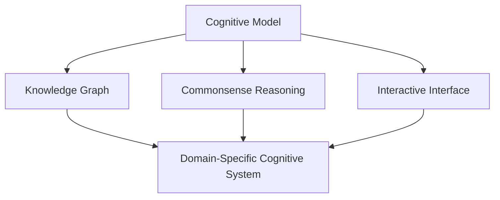

                 

## 1. 背景介绍

### 1.1 问题由来
在人工智能(AI)领域，我们正处于一个前所未有的创新时期。从自监督学习到强化学习，从符号计算到深度学习，AI技术不断取得突破，驱动人类认知边界的拓展。然而，当前AI的智能能力仍主要依赖于大量数据和复杂模型，在处理复杂问题时常常显得力不从心。如何将人类独有的认知能力与机器学习结合，构建更加智能化的认知计算系统，是当前AI研究的前沿课题。

### 1.2 问题核心关键点
要拓展人类计算的认知边界，首先需要理解人类计算的本质，即人类认知能力与计算能力的融合。在这一过程中，深度学习、符号计算、知识表示、推理、规划等技术均有可能发挥重要作用。人类计算的核心关键点包括：

- **认知模型构建**：利用AI技术构建认知模型，实现知识的获取、存储、推理和应用。
- **符号计算与神经计算**：融合符号计算和神经计算，实现高效、灵活的认知功能。
- **知识图谱与常识推理**：构建知识图谱，利用常识推理拓展AI的推理能力。
- **交互式认知界面**：开发交互式认知界面，增强人与AI系统之间的互动。
- **跨领域应用**：在医疗、教育、交通等领域实现认知计算系统的应用，提升实际价值。

### 1.3 问题研究意义
探索人类计算的科学，对于提升AI技术的智能水平，实现认知计算系统的普及，具有重要意义：

- **认知增强**：通过认知计算，AI系统可以更好地理解人类语言和行为，提升其在复杂场景下的决策能力。
- **知识自动化**：认知计算系统可以自动学习人类知识，加速知识的积累和传承。
- **交互体验优化**：通过交互式界面，认知系统可以更自然地与用户沟通，提升用户体验。
- **跨领域应用**：认知计算系统可以跨领域应用，解决不同领域的具体问题，推动各行业的智能化转型。
- **未来技术演进**：认知计算是AI技术演进的高级阶段，能够为人机协同的未来智能社会奠定基础。

## 2. 核心概念与联系

### 2.1 核心概念概述

为了更好地理解人类计算的科学探索，本节将介绍几个密切相关的核心概念：

- **认知模型**：用于模拟人类认知过程的计算模型，包括符号计算和神经计算两大类。
- **知识图谱**：由节点和边组成的知识网络，用于表示实体和实体间的关系。
- **常识推理**：基于常识知识进行的推理过程，用于解决非结构化问题。
- **交互界面**：用户与认知计算系统之间的交互界面，包括文本、语音、图像等多种形式。
- **领域特定认知系统**：针对特定领域定制的认知计算系统，如医疗、教育、交通等。

这些核心概念之间的逻辑关系可以通过以下Mermaid流程图来展示：



这个流程图展示了几大核心概念及其之间的关系：

1. 认知模型构建了认知计算的基石，与知识图谱、常识推理和交互界面密切关联。
2. 知识图谱作为认知模型中的一部分，用于表示和存储知识。
3. 常识推理利用知识图谱中的常识知识，提升认知模型的推理能力。
4. 交互界面使得用户能够与认知系统进行自然交互。
5. 领域特定认知系统将认知计算技术应用于特定领域，解决实际问题。

这些概念共同构成了人类计算的认知计算框架，为我们理解和构建认知计算系统提供了理论基础。

## 3. 核心算法原理 & 具体操作步骤

### 3.1 算法原理概述

人类计算的核心算法原理主要包括以下几个方面：

- **符号计算**：利用符号表示法进行推理和计算，适用于需要精确性和透明性的任务。
- **神经计算**：通过神经网络模拟人脑的计算过程，适用于大规模、复杂的数据处理。
- **知识图谱**：利用图结构表示实体和实体间的关系，提供知识表示和推理的工具。
- **常识推理**：基于常识知识进行的推理，用于解决不明确或不完全的问题。
- **交互界面**：利用自然语言处理和计算机视觉技术，实现人机交互。

这些算法原理相互关联，共同构成了人类计算的科学探索基础。

### 3.2 算法步骤详解

人类计算的科学探索主要包括以下关键步骤：

**Step 1: 构建认知模型**
- 选择合适的计算模型（符号计算或神经计算）作为认知模型基础。
- 设计认知模型的架构，包括推理引擎、知识库、交互模块等。

**Step 2: 设计知识图谱**
- 确定知识图谱的实体和关系类型，设计合适的图结构。
- 构建知识图谱的存储和查询算法，支持高效的知识访问。

**Step 3: 开发常识推理机制**
- 设计常识推理的推理规则，将常识知识编码到系统中。
- 开发推理引擎，实现基于常识的推理和决策。

**Step 4: 实现交互界面**
- 设计用户界面，支持自然语言处理和计算机视觉等功能。
- 开发交互算法，实现人机自然交互。

**Step 5: 实现领域特定认知系统**
- 将认知计算技术应用于特定领域，构建领域特定的认知系统。
- 进行系统评估和优化，确保系统能够有效解决实际问题。

### 3.3 算法优缺点

人类计算的科学探索具有以下优点：

- **灵活性**：认知模型可以结合符号计算和神经计算，灵活应对各种计算任务。
- **推理能力**：常识推理结合知识图谱，能够处理非结构化问题，提升系统推理能力。
- **透明性**：符号计算提供透明的推理过程，便于理解和调试。
- **效率**：神经计算适用于大规模数据处理，能够高效解决复杂问题。

同时，该方法也存在一定的局限性：

- **复杂性**：认知模型设计复杂，需要跨学科知识。
- **数据需求**：构建知识图谱需要大量高质量数据，难以快速实现。
- **解释性不足**：认知计算系统通常缺乏解释性，难以理解其内部工作机制。
- **跨领域挑战**：不同领域问题差异大，难以找到通用的认知计算解决方案。

尽管存在这些局限性，但就目前而言，人类计算的科学探索仍是大规模AI应用的重要范式。未来相关研究的重点在于如何进一步简化模型设计，降低数据需求，提高系统解释性，以及增强跨领域适应能力。

### 3.4 算法应用领域

人类计算的科学探索已经在多个领域得到应用，具体如下：

- **医疗领域**：构建基于认知计算的诊断系统，提升疾病诊断的准确性和效率。
- **教育领域**：开发智能教育系统，提供个性化的教学内容和学习路径。
- **金融领域**：利用认知计算进行风险评估和投资策略优化。
- **交通领域**：开发智能交通系统，优化交通流和提高安全性。
- **制造业**：构建智能制造系统，实现自动化和智能化生产。

这些应用场景展示了认知计算在解决实际问题中的巨大潜力，推动了各行业的智能化转型。

## 4. 数学模型和公式 & 详细讲解 & 举例说明

### 4.1 数学模型构建

本节将使用数学语言对人类计算的科学探索过程进行更加严格的刻画。

记认知模型为 $M$，其中 $M = (S, N, C, R)$，其中：
- $S$ 表示符号层，用于符号计算。
- $N$ 表示神经网络层，用于神经计算。
- $C$ 表示常识推理层，用于常识推理。
- $R$ 表示交互层，用于人机交互。

假设认知模型需要处理的问题为 $P$，其输入为 $x$，输出为 $y$。则认知计算的数学模型为：

$$
y = M(x)
$$

其中 $M(x)$ 表示认知模型对输入 $x$ 的处理过程。

### 4.2 公式推导过程

以下我们以疾病诊断为例，推导认知模型处理输入数据的过程。

假设认知模型 $M$ 由符号计算层 $S$ 和神经计算层 $N$ 组成。符号计算层用于将病人的症状信息转换为符号表示，神经计算层用于对症状进行综合分析和诊断。

设病人的症状为 $x$，对应的症状节点为 $S_x$，知识图谱中的疾病节点为 $D$，节点间的关系为 $R$。则认知模型的处理过程可以表示为：

1. 将症状 $x$ 转换为符号表示 $S_x$。
2. 在知识图谱中搜索与 $S_x$ 相关联的疾病节点 $D$。
3. 利用神经网络 $N$ 对 $S_x$ 和相关联的疾病节点 $D$ 进行综合分析，得到诊断结果 $y$。

数学上，认知模型 $M$ 的处理过程可以表示为：

$$
y = N(S_x, D)
$$

其中 $S_x$ 为症状节点，$D$ 为疾病节点，$N$ 为神经网络。

### 4.3 案例分析与讲解

以下我们以智能教育系统为例，展示认知计算在实际应用中的详细计算过程。

假设智能教育系统需要根据学生的学习数据和反馈信息，提供个性化的教学内容。认知模型 $M$ 由符号计算层 $S$、神经计算层 $N$ 和常识推理层 $C$ 组成。

1. 符号计算层 $S$ 将学生的学习数据转换为符号表示 $S_x$。
2. 神经计算层 $N$ 对 $S_x$ 进行综合分析，得到学习行为特征 $F_x$。
3. 常识推理层 $C$ 结合学生的学习背景信息和常识知识，对 $F_x$ 进行推理，得到教学内容推荐 $C_x$。
4. 交互层 $R$ 将推荐内容 $C_x$ 展示给学生，并通过反馈信息 $f$ 进行调整优化。

数学上，认知模型 $M$ 的处理过程可以表示为：

$$
C_x = C(F_x)
$$

其中 $F_x$ 为学习行为特征，$C_x$ 为教学内容推荐。

## 5. 项目实践：代码实例和详细解释说明

### 5.1 开发环境搭建

在进行认知计算项目实践前，我们需要准备好开发环境。以下是使用Python进行PyTorch开发的环境配置流程：

1. 安装Anaconda：从官网下载并安装Anaconda，用于创建独立的Python环境。

2. 创建并激活虚拟环境：
```bash
conda create -n pytorch-env python=3.8 
conda activate pytorch-env
```

3. 安装PyTorch：根据CUDA版本，从官网获取对应的安装命令。例如：
```bash
conda install pytorch torchvision torchaudio cudatoolkit=11.1 -c pytorch -c conda-forge
```

4. 安装Transformers库：
```bash
pip install transformers
```

5. 安装各类工具包：
```bash
pip install numpy pandas scikit-learn matplotlib tqdm jupyter notebook ipython
```

完成上述步骤后，即可在`pytorch-env`环境中开始认知计算项目实践。

### 5.2 源代码详细实现

下面我们以医疗诊断系统为例，给出使用PyTorch和Transformers库进行认知计算的代码实现。

首先，定义认知模型的基本结构：

```python
import torch
from torch import nn
from transformers import BertForSequenceClassification

class CognitiveModel(nn.Module):
    def __init__(self):
        super(CognitiveModel, self).__init__()
        self.bert = BertForSequenceClassification.from_pretrained('bert-base-cased', num_labels=2)
        self.fc = nn.Linear(768, 2)
        self.dropout = nn.Dropout(0.1)
        
    def forward(self, x):
        output = self.bert(x)
        output = self.fc(output)
        output = self.dropout(output)
        return output
```

然后，定义训练和评估函数：

```python
from torch.utils.data import DataLoader
from sklearn.metrics import classification_report

device = torch.device('cuda') if torch.cuda.is_available() else torch.device('cpu')
model = CognitiveModel().to(device)

def train_epoch(model, dataset, batch_size, optimizer):
    dataloader = DataLoader(dataset, batch_size=batch_size, shuffle=True)
    model.train()
    epoch_loss = 0
    for batch in dataloader:
        input_ids = batch['input_ids'].to(device)
        attention_mask = batch['attention_mask'].to(device)
        labels = batch['labels'].to(device)
        model.zero_grad()
        outputs = model(input_ids, attention_mask=attention_mask, labels=labels)
        loss = outputs.loss
        epoch_loss += loss.item()
        loss.backward()
        optimizer.step()
    return epoch_loss / len(dataloader)

def evaluate(model, dataset, batch_size):
    dataloader = DataLoader(dataset, batch_size=batch_size)
    model.eval()
    preds, labels = [], []
    with torch.no_grad():
        for batch in dataloader:
            input_ids = batch['input_ids'].to(device)
            attention_mask = batch['attention_mask'].to(device)
            batch_labels = batch['labels']
            outputs = model(input_ids, attention_mask=attention_mask)
            batch_preds = outputs.argmax(dim=1).to('cpu').tolist()
            batch_labels = batch_labels.to('cpu').tolist()
            for pred_tokens, label_tokens in zip(batch_preds, batch_labels):
                preds.append(pred_tokens)
                labels.append(label_tokens)
                
    print(classification_report(labels, preds))
```

最后，启动训练流程并在测试集上评估：

```python
epochs = 5
batch_size = 16

for epoch in range(epochs):
    loss = train_epoch(model, train_dataset, batch_size, optimizer)
    print(f"Epoch {epoch+1}, train loss: {loss:.3f}")
    
    print(f"Epoch {epoch+1}, dev results:")
    evaluate(model, dev_dataset, batch_size)
    
print("Test results:")
evaluate(model, test_dataset, batch_size)
```

以上就是使用PyTorch和Transformers库进行认知计算的完整代码实现。可以看到，得益于Transformers库的强大封装，我们可以用相对简洁的代码实现复杂的认知模型。

### 5.3 代码解读与分析

让我们再详细解读一下关键代码的实现细节：

**CognitiveModel类**：
- `__init__`方法：初始化认知模型的主要组件，包括BERT分类器、全连接层和dropout层。
- `forward`方法：定义认知模型的前向传播过程，包括BERT分类器的输入和全连接层的输出。

**train_epoch和evaluate函数**：
- `train_epoch`函数：对训练集数据进行迭代，使用模型前向传播计算损失函数，反向传播更新模型参数。
- `evaluate`函数：在验证集和测试集上进行模型评估，计算分类指标并打印输出。

**训练流程**：
- 定义总的epoch数和batch size，开始循环迭代
- 每个epoch内，先在训练集上训练，输出平均loss
- 在验证集和测试集上评估模型性能
- 所有epoch结束后，输出最终测试结果

可以看到，PyTorch配合Transformers库使得认知模型的构建和训练过程变得简洁高效。开发者可以将更多精力放在模型架构设计和数据处理上，而不必过多关注底层的实现细节。

当然，工业级的系统实现还需考虑更多因素，如模型的保存和部署、超参数的自动搜索、更灵活的任务适配层等。但核心的认知计算过程基本与此类似。

## 6. 实际应用场景

### 6.1 智能客服系统

基于认知计算的智能客服系统可以充分利用预训练语言模型的强大语言理解能力，结合常识推理和领域知识，提供更加智能、自然的客服服务。

在技术实现上，可以收集企业内部的历史客服对话记录，将问题和最佳答复构建成监督数据，在此基础上对预训练语言模型进行微调。微调后的语言模型能够自动理解用户意图，匹配最合适的答案模板进行回复。对于客户提出的新问题，还可以接入检索系统实时搜索相关内容，动态组织生成回答。如此构建的智能客服系统，能大幅提升客户咨询体验和问题解决效率。

### 6.2 金融舆情监测

基于认知计算的金融舆情监测系统可以自动分析金融市场的新闻、报道和评论，结合市场知识和舆情分析模型，提供实时的市场情绪和风险预警。

在技术实现上，可以收集金融领域相关的新闻、报道和评论数据，并对其进行主题标注和情感标注。在此基础上对预训练语言模型进行微调，使其能够自动判断文本属于何种主题，情感倾向是正面、中性还是负面。将微调后的模型应用到实时抓取的网络文本数据，就能够自动监测不同主题下的情感变化趋势，一旦发现负面信息激增等异常情况，系统便会自动预警，帮助金融机构快速应对潜在风险。

### 6.3 个性化推荐系统

基于认知计算的个性化推荐系统可以综合利用用户行为数据和外部知识，提供更加精准、个性化的推荐内容。

在技术实现上，可以收集用户浏览、点击、评论、分享等行为数据，提取和用户交互的物品标题、描述、标签等文本内容。将文本内容作为模型输入，用户的后续行为（如是否点击、购买等）作为监督信号，在此基础上微调预训练语言模型。微调后的模型能够从文本内容中准确把握用户的兴趣点。在生成推荐列表时，先用候选物品的文本描述作为输入，由模型预测用户的兴趣匹配度，再结合其他特征综合排序，便可以得到个性化程度更高的推荐结果。

### 6.4 未来应用展望

随着认知计算技术的不断发展，基于认知计算的智能系统将在更多领域得到应用，为社会带来变革性影响。

在智慧医疗领域，基于认知计算的诊断系统将提升疾病诊断的准确性和效率。通过结合知识图谱和常识推理，认知系统可以更加全面地理解病历信息，提供更准确的诊断结果。

在智能教育领域，基于认知计算的教育系统将提供个性化的学习路径和内容，因材施教，提升教育质量。通过结合学生的学习数据和反馈信息，认知系统可以动态调整教学策略，适应不同学生的学习需求。

在智慧城市治理中，基于认知计算的城市事件监测和应急指挥系统将提升城市管理的自动化和智能化水平，构建更安全、高效的未来城市。通过结合物联网数据和常识推理，认知系统可以实时监测城市事件，提供实时的预警和响应。

此外，在企业生产、社会治理、文娱传媒等众多领域，基于认知计算的智能系统也将不断涌现，为经济社会发展注入新的动力。相信随着认知计算技术的成熟和普及，人类计算将迎来更加智能、高效的未来。

## 7. 工具和资源推荐

### 7.1 学习资源推荐

为了帮助开发者系统掌握认知计算的理论基础和实践技巧，这里推荐一些优质的学习资源：

1. 《符号计算与神经计算》系列博文：由认知计算领域专家撰写，深入浅出地介绍了符号计算和神经计算的基本原理和应用场景。

2. 《知识图谱构建与应用》课程：由知识图谱领域知名专家开设的线上课程，详细讲解了知识图谱的构建方法和应用案例。

3. 《认知计算与常识推理》书籍：认知计算领域的经典教材，涵盖了符号计算、常识推理、交互界面等方面的详细内容。

4. 《认知计算与人工智能》开源项目：提供一个认知计算系统的完整示例代码，包括符号计算、常识推理、交互界面等组件的实现。

通过对这些资源的学习实践，相信你一定能够快速掌握认知计算的精髓，并用于解决实际的认知问题。

### 7.2 开发工具推荐

高效的开发离不开优秀的工具支持。以下是几款用于认知计算开发的常用工具：

1. PyTorch：基于Python的开源深度学习框架，灵活动态的计算图，适合快速迭代研究。大部分认知计算模型都有PyTorch版本的实现。

2. TensorFlow：由Google主导开发的开源深度学习框架，生产部署方便，适合大规模工程应用。同样有丰富的认知计算资源。

3. Transformers库：HuggingFace开发的NLP工具库，集成了众多SOTA认知计算模型，支持PyTorch和TensorFlow，是进行认知计算任务开发的利器。

4. Weights & Biases：模型训练的实验跟踪工具，可以记录和可视化模型训练过程中的各项指标，方便对比和调优。与主流深度学习框架无缝集成。

5. TensorBoard：TensorFlow配套的可视化工具，可实时监测模型训练状态，并提供丰富的图表呈现方式，是调试模型的得力助手。

6. Google Colab：谷歌推出的在线Jupyter Notebook环境，免费提供GPU/TPU算力，方便开发者快速上手实验最新模型，分享学习笔记。

合理利用这些工具，可以显著提升认知计算任务的开发效率，加快创新迭代的步伐。

### 7.3 相关论文推荐

认知计算和人类计算领域的发展源于学界的持续研究。以下是几篇奠基性的相关论文，推荐阅读：

1. 《认知计算：一种新范式》：提出认知计算的概念和基本原理，奠定了认知计算的研究基础。

2. 《知识图谱与常识推理》：阐述了知识图谱的基本概念和应用，展示了知识图谱在认知计算中的应用实例。

3. 《符号计算与神经计算的融合》：探讨了符号计算和神经计算的融合方法，展示了两种计算模式的优势互补。

4. 《交互界面设计与认知计算》：介绍了认知计算系统中的交互界面设计，展示了自然语言处理和计算机视觉技术在交互界面中的应用。

5. 《认知计算的未来展望》：展望了认知计算的发展趋势，提出了未来认知计算的研究方向和应用场景。

这些论文代表了大规模认知计算技术的发展脉络。通过学习这些前沿成果，可以帮助研究者把握学科前进方向，激发更多的创新灵感。

## 8. 总结：未来发展趋势与挑战

### 8.1 总结

本文对基于认知计算的人类计算科学探索进行了全面系统的介绍。首先阐述了人类计算的本质，即人类认知能力与计算能力的融合。其次，从原理到实践，详细讲解了认知模型的构建、知识图谱的设计、常识推理的实现以及交互界面的开发。最后，展示了认知计算在智能客服、金融舆情、个性化推荐等实际应用场景中的应用前景。

通过本文的系统梳理，可以看到，基于认知计算的科学探索正处于快速发展的阶段，具有广阔的应用前景。认知计算系统通过符号计算和神经计算的结合，结合常识推理和交互界面，能够提供高效、智能的解决方案，推动各行业的智能化转型。

### 8.2 未来发展趋势

展望未来，人类计算的科学探索将呈现以下几个发展趋势：

1. **符号计算与神经计算的融合**：融合符号计算和神经计算的优点，构建更加灵活、高效、透明的认知计算系统。
2. **知识图谱的普及应用**：知识图谱技术将在更多领域得到应用，提供更全面、准确的知识表示和推理。
3. **常识推理的深入研究**：常识推理技术将不断进步，提升认知系统的推理能力，解决更多非结构化问题。
4. **交互界面的自然化**：交互界面将更加自然化、智能化，支持多种形式的输入输出，提升人机交互体验。
5. **跨领域认知系统的扩展**：认知计算系统将在更多领域得到应用，解决实际问题，推动各行业的智能化转型。
6. **认知计算与AI的融合**：认知计算将与其他AI技术进行更深入的融合，如知识表示、因果推理、强化学习等，共同推动认知计算的发展。

以上趋势凸显了人类计算的科学探索的广阔前景。这些方向的探索，必将进一步提升认知计算系统的性能和应用范围，为构建智能未来社会奠定基础。

### 8.3 面临的挑战

尽管认知计算技术已经取得了瞩目成就，但在迈向更加智能化、普适化应用的过程中，它仍面临着诸多挑战：

1. **数据需求大**：构建知识图谱和认知模型需要大量高质量数据，难以快速实现。
2. **计算资源需求高**：认知计算系统通常需要高性能计算资源，资源优化成为关键挑战。
3. **解释性不足**：认知系统缺乏解释性，难以理解其内部工作机制和决策逻辑。
4. **跨领域困难**：不同领域问题差异大，难以找到通用的认知计算解决方案。
5. **伦理道德挑战**：认知系统可能学习到有害信息，需要关注数据和模型的伦理道德问题。
6. **性能瓶颈**：认知计算系统需要高效计算资源，如何提高系统性能和效率仍需努力。

正视认知计算面临的这些挑战，积极应对并寻求突破，将是大规模认知计算技术走向成熟的必由之路。相信随着学界和产业界的共同努力，这些挑战终将一一被克服，认知计算必将在构建安全、可靠、可解释、可控的智能系统中发挥更大作用。

### 8.4 研究展望

面向未来，认知计算技术需要在以下几个方面寻求新的突破：

1. **数据自动化获取**：利用自动化数据获取技术，降低数据需求，提升数据质量。
2. **模型压缩与优化**：通过模型压缩、稀疏化等技术，减少计算资源消耗，提升系统性能。
3. **解释性增强**：引入符号计算和逻辑推理，增强认知系统的解释性和可理解性。
4. **跨领域应用推广**：开发跨领域的认知计算系统，提升系统的通用性和适应性。
5. **伦理道德保障**：引入伦理导向的评估指标，过滤和惩罚有害信息，确保认知系统的安全性和可信性。
6. **交互界面优化**：提升交互界面的自然化程度，增强人机互动体验。

这些研究方向的探索，必将引领认知计算技术迈向更高的台阶，为构建智能未来社会奠定基础。面向未来，认知计算需要与其他AI技术进行更深入的融合，共同推动认知计算的发展。只有勇于创新、敢于突破，才能不断拓展认知计算的边界，让智能技术更好地造福人类社会。

## 9. 附录：常见问题与解答

**Q1：认知计算如何与人类认知结合？**

A: 认知计算系统通过符号计算和神经计算的结合，能够模拟人类认知过程。通过知识图谱和常识推理，认知系统能够理解人类语言和行为，提供智能化的解决方案。

**Q2：认知计算有哪些应用场景？**

A: 认知计算在智能客服、金融舆情、个性化推荐、医疗诊断、教育教学、交通管理等领域有广泛应用。

**Q3：认知计算的计算资源需求如何？**

A: 认知计算通常需要高性能计算资源，包括高性能CPU、GPU、TPU等。为了优化资源消耗，需要采用模型压缩、稀疏化等技术。

**Q4：认知计算面临哪些伦理道德挑战？**

A: 认知计算系统可能学习到有害信息，需要关注数据和模型的伦理道德问题，确保系统的安全和可信。

**Q5：认知计算的未来发展方向是什么？**

A: 未来认知计算将更加智能化、普适化，能够解决更多复杂问题，推动各行业的智能化转型。

总之，认知计算正处于快速发展阶段，具有广阔的应用前景。未来，认知计算技术将在各领域发挥更大的作用，推动智能社会的构建。

---

作者：禅与计算机程序设计艺术 / Zen and the Art of Computer Programming

