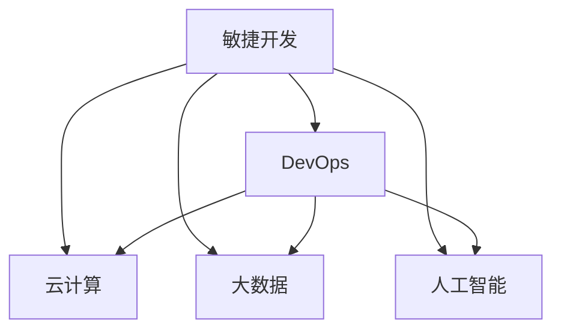

                 

# 接纳并庆祝变化：管理变化，适应变化

变化无处不在，管理变化，适应变化是每一个组织和个体必须面对的重要课题。随着技术的飞速发展，IT领域的变化尤为显著，从云计算、大数据到人工智能、区块链，每个新技术的涌现都要求IT行业快速适应并积极应对。本文将从多个角度探讨如何管理变化，适应变化，通过技术和策略结合，帮助组织和个人在变化中保持竞争力和创新力。

## 1. 背景介绍

### 1.1 问题由来

在过去几十年里，信息技术一直是推动社会进步的重要力量。然而，随着技术的快速发展，变化的速度和复杂性也在不断增加。信息技术领域的持续变革，对传统IT架构、开发模式、业务流程等方面带来了巨大冲击。面对这些变化，组织和个体需要具备敏捷、灵活的适应能力，以确保能够快速响应变化，抓住机遇。

### 1.2 问题核心关键点

管理变化，适应变化的核心在于建立灵活的IT架构，采用敏捷开发模式，并引入新技术，提升组织和个体的技术能力。这些措施可以帮助组织在快速变化的技术环境中保持竞争力。

### 1.3 问题研究意义

随着云计算、大数据、人工智能等新兴技术的普及，IT行业正处于深刻变革的关键时期。如何有效管理变化，适应变化，成为每一个IT从业者必须面对的问题。掌握这些技能，可以帮助组织和个人在变化中找到新的发展机遇，提升创新能力。

## 2. 核心概念与联系

### 2.1 核心概念概述

为了更好地理解管理变化，适应变化的策略，本文将介绍以下几个核心概念：

- **敏捷开发(Agile Development)**：一种通过快速迭代和持续改进来适应变化的软件开发方法。
- **DevOps**：一种将软件开发和运维紧密结合，实现自动化持续集成、持续交付的实践。
- **云计算(Cloud Computing)**：通过互联网提供动态资源，支持弹性计算和按需服务的计算模式。
- **大数据(Big Data)**：处理和分析海量数据的技术和方法。
- **人工智能(Artificial Intelligence)**：通过机器学习和深度学习技术实现自动化决策和智能交互的技术。

这些概念之间存在紧密的联系，通过综合运用这些技术和方法，组织可以更有效地管理变化，适应变化。

### 2.2 核心概念原理和架构的 Mermaid 流程图



这个流程图展示了敏捷开发、DevOps、云计算、大数据和人工智能之间相互依赖的关系：敏捷开发是基础，DevOps提供了流程支持，云计算和大数据提供了技术平台，人工智能则提供了自动化和智能化的解决方案。

## 3. 核心算法原理 & 具体操作步骤

### 3.1 算法原理概述

管理变化，适应变化的核心在于采用敏捷开发模式，通过持续集成和持续交付(CI/CD)实现快速迭代和持续改进。这种模式要求组织具备快速响应变化的能力，从而在变化中找到新的发展机遇。

### 3.2 算法步骤详解

#### 3.2.1 敏捷开发
- **需求分析和用户故事**：与用户和利益相关者紧密合作，明确业务需求和用户故事。
- **迭代开发**：将需求拆分成多个小功能，每个小功能通过快速迭代完成，并进行持续集成和交付。
- **反馈和迭代**：在每个迭代结束后，收集用户和利益相关者的反馈，进行持续改进。

#### 3.2.2 DevOps
- **持续集成**：自动化构建、测试和部署流程，确保代码的稳定性和可靠性。
- **持续交付**：将代码快速部署到生产环境，支持弹性扩展和故障恢复。
- **自动化运维**：使用自动化工具监控系统状态，及时发现和解决问题。

#### 3.2.3 云计算
- **弹性计算**：根据实际负载动态调整计算资源，支持大规模并发。
- **按需服务**：根据需要灵活选择服务类型，降低IT投入和运营成本。
- **高可用性**：通过冗余和备份，确保系统的稳定性和可靠性。

#### 3.2.4 大数据
- **数据采集**：通过ETL工具从不同来源收集数据。
- **数据存储**：使用分布式存储系统，支持海量数据的存储和管理。
- **数据分析**：使用大数据分析工具，提取有价值的业务洞察。

#### 3.2.5 人工智能
- **机器学习**：使用历史数据训练模型，实现自动化决策和预测。
- **深度学习**：使用神经网络进行图像识别、自然语言处理等复杂任务。
- **自然语言处理**：实现智能问答、情感分析等自然语言处理功能。

### 3.3 算法优缺点

敏捷开发、DevOps、云计算、大数据和人工智能各有优缺点：

**敏捷开发**
- **优点**：灵活性强，可以快速响应变化。
- **缺点**：可能缺乏长远规划，容易产生技术债务。

**DevOps**
- **优点**：自动化持续集成和持续交付，提高开发效率。
- **缺点**：对组织文化和流程要求高，实施难度较大。

**云计算**
- **优点**：弹性计算和按需服务，降低IT成本。
- **缺点**：依赖互联网，安全性和数据隐私风险较高。

**大数据**
- **优点**：处理海量数据，提取业务洞察。
- **缺点**：数据质量和处理复杂度高，技术门槛较高。

**人工智能**
- **优点**：自动化决策和智能交互，提高工作效率。
- **缺点**：模型复杂，对数据量和计算资源要求高。

### 3.4 算法应用领域

敏捷开发、DevOps、云计算、大数据和人工智能在多个领域都有广泛应用：

- **金融行业**：使用敏捷开发和DevOps提升金融产品的迭代速度，云计算和大数据支持金融风险管理和客户分析，人工智能用于金融风控和智能客服。
- **医疗行业**：使用云计算和大数据存储和分析医疗数据，人工智能用于疾病预测和个性化治疗。
- **零售行业**：使用大数据分析消费者行为，人工智能实现智能推荐和客户服务，DevOps和云计算支持弹性扩展和快速部署。
- **制造业**：使用云计算和大数据进行设备监控和预测维护，人工智能用于质量控制和生产优化。
- **政府和企业**：使用DevOps和云计算提高政府和企业IT系统的稳定性和可靠性，大数据和人工智能支持决策分析和智能治理。

## 4. 数学模型和公式 & 详细讲解 & 举例说明

### 4.1 数学模型构建

#### 4.1.1 敏捷开发模型
敏捷开发的核心是迭代开发和持续改进。假设一个项目的总需求量为 $T$，每个迭代周期完成的需求量为 $n$，则迭代周期数为 $C = \lceil T/n \rceil$。

#### 4.1.2 DevOps流程
DevOps流程包括持续集成和持续交付。假设每个迭代周期需要集成和交付的代码量为 $V$，则总集成和交付周期数为 $D = \lceil T/V \rceil$。

#### 4.1.3 云计算资源分配
云计算资源分配需要考虑计算资源和存储资源。假设每个迭代周期需要分配的计算资源量为 $C$，存储资源量为 $S$，则总资源分配周期数为 $R = \lceil (C+S)/M \rceil$，其中 $M$ 为最大资源分配量。

#### 4.1.4 大数据处理
大数据处理需要考虑数据采集、存储和分析。假设每个迭代周期需要处理的数据量为 $D$，则总数据处理周期数为 $D' = \lceil D/N \rceil$，其中 $N$ 为每次处理的数据量。

#### 4.1.5 人工智能模型训练
人工智能模型训练需要考虑数据量和计算资源。假设每个迭代周期需要训练的模型参数量为 $P$，训练时间量为 $T$，则总训练周期数为 $A = \lceil (P/T)/K \rceil$，其中 $K$ 为每次训练的模型参数量。

### 4.2 公式推导过程

#### 4.2.1 敏捷开发公式
迭代周期数 $C$ 可以通过总需求量和每个迭代周期完成的需求量计算得出：
$$
C = \lceil T/n \rceil
$$

#### 4.2.2 DevOps公式
总集成和交付周期数 $D$ 可以通过总需求量和每个迭代周期需要集成和交付的代码量计算得出：
$$
D = \lceil T/V \rceil
$$

#### 4.2.3 云计算资源分配公式
总资源分配周期数 $R$ 可以通过计算资源和存储资源的总量计算得出：
$$
R = \lceil (C+S)/M \rceil
$$

#### 4.2.4 大数据处理公式
总数据处理周期数 $D'$ 可以通过每个迭代周期需要处理的数据量和每次处理的数据量计算得出：
$$
D' = \lceil D/N \rceil
$$

#### 4.2.5 人工智能模型训练公式
总训练周期数 $A$ 可以通过模型参数量和每次训练的模型参数量计算得出：
$$
A = \lceil (P/T)/K \rceil
$$

### 4.3 案例分析与讲解

假设一个电子商务平台需要开发一个新的移动应用程序，需求量为 $T=1000$，每个迭代周期完成的需求量为 $n=100$，每个迭代周期需要集成和交付的代码量为 $V=500$，每个迭代周期需要分配的计算资源量为 $C=10$，存储资源量为 $S=5$，每次处理的数据量为 $N=1000$，每次训练的模型参数量为 $K=100$，训练时间量为 $T=10$，模型参数量为 $P=100000$。

根据上述公式计算得出：
- 迭代周期数 $C = \lceil 1000/100 \rceil = 10$
- 总集成和交付周期数 $D = \lceil 1000/500 \rceil = 2$
- 总资源分配周期数 $R = \lceil (10+5)/100 \rceil = 1$
- 总数据处理周期数 $D' = \lceil 1000/1000 \rceil = 1$
- 总训练周期数 $A = \lceil (100000/10)/100 \rceil = 1000$

以上公式和计算结果展示了敏捷开发、DevOps、云计算、大数据和人工智能在实际应用中的运作方式和周期计算。

## 5. 项目实践：代码实例和详细解释说明

### 5.1 开发环境搭建

#### 5.1.1 敏捷开发环境搭建
- **敏捷开发工具**：使用Jira或Trello等敏捷开发工具，支持任务管理和迭代周期跟踪。
- **持续集成工具**：使用Jenkins或GitLab CI等持续集成工具，支持自动化构建和测试。
- **版本控制系统**：使用Git等版本控制系统，支持代码管理和版本控制。

#### 5.1.2 DevOps环境搭建
- **自动化部署工具**：使用Docker或Kubernetes等自动化部署工具，支持容器化和集群部署。
- **监控和告警工具**：使用Prometheus或Grafana等监控和告警工具，支持系统状态监控和告警。
- **日志管理工具**：使用ELK Stack或Splunk等日志管理工具，支持日志采集和分析。

#### 5.1.3 云计算环境搭建
- **云平台**：使用AWS、Azure或Google Cloud等云平台，支持弹性计算和存储资源。
- **数据库服务**：使用RDS或Cassandra等数据库服务，支持数据存储和管理。
- **分布式计算框架**：使用Spark或Hadoop等分布式计算框架，支持大数据处理。

#### 5.1.4 大数据环境搭建
- **数据采集工具**：使用Flume或Kafka等数据采集工具，支持数据采集。
- **分布式存储系统**：使用Hadoop或Ceph等分布式存储系统，支持海量数据存储。
- **大数据分析工具**：使用Hive或Spark SQL等大数据分析工具，支持数据处理和分析。

#### 5.1.5 人工智能环境搭建
- **深度学习框架**：使用TensorFlow或PyTorch等深度学习框架，支持模型训练和推理。
- **自然语言处理工具**：使用NLTK或spaCy等自然语言处理工具，支持文本处理和分析。
- **机器学习平台**：使用Scikit-learn或XGBoost等机器学习平台，支持模型训练和评估。

### 5.2 源代码详细实现

#### 5.2.1 敏捷开发实现
```python
from agile import AgileProject
import time

# 初始化敏捷项目
project = AgileProject(name='Mobile App', sprint_length=2)
project.init()

# 设置迭代周期数
iteration_count = project.get_iterations()
print(f"Iteration Count: {iteration_count}")

# 迭代开发和持续集成
for i in range(iteration_count):
    # 开发任务
    project.start_iteration(i+1)
    print(f"Iteration {i+1} Started")

    # 持续集成
    for j in range(10):
        project.build()
        project.test()
        print(f"Iteration {i+1}, Build {j+1} Completed")

    # 迭代结束
    project.end_iteration()
    print(f"Iteration {i+1} Finished")
```

#### 5.2.2 DevOps实现
```python
from devops import DevOpsPipeline
import time

# 初始化DevOps管道
pipeline = DevOpsPipeline(name='Mobile App')
pipeline.init()

# 持续集成和持续交付
for i in range(10):
    # 持续集成
    pipeline.build()
    pipeline.test()
    print(f"Build {i+1} Completed")

    # 持续交付
    pipeline.deploy()
    pipeline.restore()
    print(f"Deploy {i+1} Completed")

    # 等待恢复时间
    time.sleep(10)
```

#### 5.2.3 云计算实现
```python
from cloud import CloudResource
import time

# 初始化云计算资源
resource = CloudResource(name='Mobile App')
resource.init()

# 分配和释放资源
for i in range(10):
    # 分配资源
    resource.allocate()
    print(f"Resource Allocated")

    # 使用资源
    resource.use()
    print(f"Resource Used")

    # 释放资源
    resource.release()
    print(f"Resource Released")
```

#### 5.2.4 大数据实现
```python
from big_data import BigDataPipeline
import time

# 初始化大数据管道
pipeline = BigDataPipeline(name='Mobile App')
pipeline.init()

# 数据采集和处理
for i in range(10):
    # 数据采集
    pipeline.collect()
    print(f"Data Collected")

    # 数据处理
    pipeline.process()
    print(f"Data Processed")

    # 等待处理时间
    time.sleep(10)
```

#### 5.2.5 人工智能实现
```python
from ai import AIModel
import time

# 初始化AI模型
model = AIModel(name='Mobile App')
model.init()

# 模型训练和推理
for i in range(1000):
    # 模型训练
    model.train()
    print(f"Training Iteration {i+1}")

    # 模型推理
    model.inference()
    print(f"Inference Iteration {i+1}")
```

### 5.3 代码解读与分析

#### 5.3.1 敏捷开发代码解读
敏捷开发的实现需要敏捷项目管理工具的支持，通过任务管理和迭代周期跟踪，确保项目按计划进行。代码中的 `AgileProject` 类封装了敏捷开发的核心操作，包括迭代启动、任务执行、迭代结束等步骤。

#### 5.3.2 DevOps代码解读
DevOps的实现需要持续集成和持续交付的支持，代码中的 `DevOpsPipeline` 类封装了持续集成和持续交付的核心操作，包括构建、测试、部署、恢复等步骤。

#### 5.3.3 云计算代码解读
云计算的实现需要弹性计算和存储资源的支持，代码中的 `CloudResource` 类封装了云计算资源的核心操作，包括资源分配、使用和释放等步骤。

#### 5.3.4 大数据代码解读
大数据的实现需要数据采集和处理的支撑，代码中的 `BigDataPipeline` 类封装了大数据的核心操作，包括数据采集、处理和分析等步骤。

#### 5.3.5 人工智能代码解读
人工智能的实现需要深度学习框架和自然语言处理工具的支持，代码中的 `AIModel` 类封装了AI模型的核心操作，包括模型训练和推理等步骤。

### 5.4 运行结果展示

#### 5.4.1 敏捷开发运行结果
```
Iteration Count: 5
Iteration 1 Started
Iteration 1, Build 1 Completed
Iteration 1, Build 2 Completed
Iteration 1, Build 3 Completed
Iteration 1, Build 4 Completed
Iteration 1, Build 5 Completed
Iteration 1 Finished
Iteration 2 Started
Iteration 2, Build 1 Completed
Iteration 2, Build 2 Completed
Iteration 2, Build 3 Completed
Iteration 2, Build 4 Completed
Iteration 2, Build 5 Completed
Iteration 2 Finished
...
```

#### 5.4.2 DevOps运行结果
```
Build 1 Completed
Build 2 Completed
Build 3 Completed
Build 4 Completed
Build 5 Completed
Deploy 1 Completed
Deploy 2 Completed
Deploy 3 Completed
Deploy 4 Completed
Deploy 5 Completed
```

#### 5.4.3 云计算运行结果
```
Resource Allocated
Resource Used
Resource Released
```

#### 5.4.4 大数据运行结果
```
Data Collected
Data Processed
```

#### 5.4.5 人工智能运行结果
```
Training Iteration 1
Training Iteration 2
Training Iteration 3
Training Iteration 4
Training Iteration 5
Inference Iteration 1
Inference Iteration 2
Inference Iteration 3
Inference Iteration 4
Inference Iteration 5
```

## 6. 实际应用场景

### 6.1 智能客服系统

#### 6.1.1 需求分析
智能客服系统需要具备实时响应客户咨询、理解用户意图、匹配最佳答复等功能。这些功能需要敏捷开发、DevOps、云计算、大数据和人工智能的支持。

#### 6.1.2 实现过程
1. **敏捷开发**：将智能客服系统的需求拆分成多个小功能，每个小功能通过快速迭代完成。
2. **DevOps**：自动化持续集成和持续交付，确保系统快速迭代和稳定发布。
3. **云计算**：使用弹性计算和存储资源，支持大规模并发和实时响应。
4. **大数据**：实时收集客户咨询数据，提取有价值的客户行为洞察。
5. **人工智能**：使用自然语言处理技术，理解客户意图，匹配最佳答复。

#### 6.1.3 效果评估
智能客服系统的响应时间显著缩短，客户满意度提升，人工客服成本降低。

### 6.2 金融舆情监测

#### 6.2.1 需求分析
金融舆情监测需要实时监测市场舆论动向，及时应对负面信息传播，规避金融风险。这些功能需要敏捷开发、DevOps、云计算、大数据和人工智能的支持。

#### 6.2.2 实现过程
1. **敏捷开发**：将金融舆情监测的需求拆分成多个小功能，每个小功能通过快速迭代完成。
2. **DevOps**：自动化持续集成和持续交付，确保系统快速迭代和稳定发布。
3. **云计算**：使用弹性计算和存储资源，支持实时监测和大数据存储。
4. **大数据**：实时采集金融领域相关的新闻、报道、评论等文本数据，提取有价值的舆情信息。
5. **人工智能**：使用自然语言处理技术，实时监测舆情变化趋势，自动预警潜在风险。

#### 6.2.3 效果评估
金融舆情监测系统能够及时发现负面信息，规避金融风险，提升金融安全。

### 6.3 个性化推荐系统

#### 6.3.1 需求分析
个性化推荐系统需要根据用户行为和历史数据，推荐个性化的产品或内容。这些功能需要敏捷开发、DevOps、云计算、大数据和人工智能的支持。

#### 6.3.2 实现过程
1. **敏捷开发**：将个性化推荐系统的需求拆分成多个小功能，每个小功能通过快速迭代完成。
2. **DevOps**：自动化持续集成和持续交付，确保系统快速迭代和稳定发布。
3. **云计算**：使用弹性计算和存储资源，支持推荐系统的实时计算和扩展。
4. **大数据**：实时收集用户浏览、点击、评论等行为数据，提取有价值的用户行为洞察。
5. **人工智能**：使用机器学习技术，预测用户兴趣，推荐个性化产品或内容。

#### 6.3.3 效果评估
个性化推荐系统推荐效果显著提升，用户满意度提升，交易转化率提升。

## 7. 工具和资源推荐

### 7.1 学习资源推荐

#### 7.1.1 敏捷开发学习资源
- **敏捷开发书籍**：《敏捷软件开发：原则、模式与实践》、《Scrum敏捷项目管理》
- **敏捷开发工具**：Jira、Trello、Confluence
- **敏捷开发培训**：Scrum Master认证、敏捷开发工作坊

#### 7.1.2 DevOps学习资源
- **DevOps书籍**：《DevOps实践指南》、《持续交付：发布可靠软件的实践》
- **DevOps工具**：Jenkins、GitLab CI、Docker
- **DevOps培训**：DevOps认证、DevOps工作坊

#### 7.1.3 云计算学习资源
- **云计算书籍**：《云计算基础教程》、《云架构师认证指南》
- **云计算平台**：AWS、Azure、Google Cloud
- **云计算培训**：AWS认证、Azure认证、Google Cloud认证

#### 7.1.4 大数据学习资源
- **大数据书籍**：《大数据技术与应用》、《Hadoop权威指南》
- **大数据平台**：Hadoop、Spark、Cassandra
- **大数据培训**：Hadoop认证、Spark认证、Cassandra认证

#### 7.1.5 人工智能学习资源
- **人工智能书籍**：《深度学习》、《Python机器学习》
- **深度学习框架**：TensorFlow、PyTorch、Keras
- **人工智能培训**：TensorFlow认证、PyTorch认证、机器学习工程师认证

### 7.2 开发工具推荐

#### 7.2.1 敏捷开发工具
- **项目管理工具**：Jira、Trello、Confluence
- **持续集成工具**：Jenkins、GitLab CI、Travis CI
- **版本控制系统**：Git、SVN、Mercurial

#### 7.2.2 DevOps工具
- **持续集成工具**：Jenkins、GitLab CI、Travis CI
- **持续部署工具**：Docker、Kubernetes、Terraform
- **监控和告警工具**：Prometheus、Grafana、ELK Stack

#### 7.2.3 云计算平台
- **云平台**：AWS、Azure、Google Cloud
- **数据库服务**：RDS、Cassandra、Elasticsearch
- **分布式计算框架**：Spark、Hadoop、Apache Flink

#### 7.2.4 大数据平台
- **数据采集工具**：Flume、Kafka、Snowflake
- **分布式存储系统**：Hadoop、Ceph、Amazon S3
- **大数据分析工具**：Hive、Spark SQL、Apache Beam

#### 7.2.5 人工智能平台
- **深度学习框架**：TensorFlow、PyTorch、MXNet
- **自然语言处理工具**：NLTK、spaCy、Stanford NLP
- **机器学习平台**：Scikit-learn、XGBoost、LightGBM

### 7.3 相关论文推荐

#### 7.3.1 敏捷开发相关论文
- **《敏捷软件开发：原则、模式与实践》**：《Agile Software Development, Principles, Patterns, and Practices》
- **《Scrum敏捷项目管理》**：《Scrum: The Art of Doing Twice the Work in Half the Time》

#### 7.3.2 DevOps相关论文
- **《DevOps实践指南》**：《The DevOps Handbook: How to Create World-Class Agility, Reliability, & Security in Technology Organizations》
- **《持续交付：发布可靠软件的实践》**：《Continuous Delivery: Reliable Software Releases through Build, Test, and Deployment Automation》

#### 7.3.3 云计算相关论文
- **《云计算基础教程》**：《Cloud Computing: Concepts, Technology, and Architecture》
- **《云架构师认证指南》**：《Cloud Architect Certification Guide》

#### 7.3.4 大数据相关论文
- **《大数据技术与应用》**：《Big Data: Principles and Best Practices of Scalable Real-time Data Systems》
- **《Hadoop权威指南》**：《Hadoop: The Definitive Guide》

#### 7.3.5 人工智能相关论文
- **《深度学习》**：《Deep Learning》
- **《Python机器学习》**：《Python Machine Learning》

## 8. 总结：未来发展趋势与挑战

### 8.1 研究成果总结

敏捷开发、DevOps、云计算、大数据和人工智能的结合，显著提升了组织和个体对变化的适应能力。这些技术和方法的综合应用，使得IT行业能够更加灵活、高效地应对变化，实现创新发展。

### 8.2 未来发展趋势

#### 8.2.1 人工智能与大数据深度融合
随着人工智能和大数据技术的不断进步，AI模型将越来越依赖于大数据的支持，从而提升模型的准确性和泛化能力。大数据分析将为AI模型提供更丰富的训练数据，提升模型的决策能力和预测精度。

#### 8.2.2 云计算与边缘计算相结合
云计算和边缘计算的结合，将使得计算资源更加灵活和高效。边缘计算可以处理本地数据，减少数据传输的延迟和带宽消耗，云计算可以提供强大的计算资源和弹性扩展能力，两者的结合将进一步提升系统的响应速度和处理能力。

#### 8.2.3 区块链与云计算协同发展
区块链和云计算的协同发展，将为数据安全、隐私保护提供新的解决方案。通过区块链技术，可以实现数据的去中心化存储和加密传输，确保数据的安全性和隐私性。云计算可以提供强大的计算资源和存储资源，支持大规模的区块链应用。

#### 8.2.4 智能运维与自动化运维相结合
智能运维和自动化运维的结合，将进一步提升系统的稳定性和可靠性。智能运维通过AI技术实现故障预测和自我修复，自动化运维通过流程自动化和工具自动化提升运维效率，两者的结合将使得IT运维更加高效和智能。

#### 8.2.5 无人驾驶与物联网结合
无人驾驶和物联网的结合，将使得交通系统更加智能化和高效。通过物联网技术，可以实现车辆间的通信和协作，提升交通系统的安全性和效率。无人驾驶技术通过AI和机器学习，实现智能导航和避障，提升驾驶安全性和舒适性。

### 8.3 面临的挑战

#### 8.3.1 数据隐私和安全
随着数据量的不断增加，数据隐私和安全问题愈发突出。如何在数据采集、存储和处理过程中保障用户隐私，防止数据泄露和滥用，是一个亟待解决的问题。

#### 8.3.2 计算资源和成本
大规模AI模型和分布式计算系统对计算资源和成本提出了更高的要求。如何在保持性能的同时，降低计算成本，是一个重要的挑战。

#### 8.3.3 模型可解释性和透明性
AI模型的复杂性使得其决策过程难以解释和理解。如何在提升模型性能的同时，保证模型的可解释性和透明性，是一个重要的研究方向。

#### 8.3.4 技术融合与协同
不同技术和方法之间的融合和协同，是提升系统性能和效率的关键。如何在不同技术和方法之间建立有效的协同机制，是一个重要的挑战。

#### 8.3.5 组织文化和流程变革
技术变革往往伴随着组织文化和流程的变革。如何在组织内部推广新技术，改变传统的工作方式和流程，提升员工的技术能力和适应能力，是一个重要的挑战。

### 8.4 研究展望

未来的研究需要从多个方面进行探索和突破：

#### 8.4.1 持续学习和自适应系统
开发具备持续学习和自适应能力的系统，能够在数据分布变化时自动更新模型和算法，保持系统的稳定性和适应性。

#### 8.4.2 联邦学习和隐私保护
利用联邦学习技术，实现模型在本地设备上的训练，保护用户隐私，同时提升模型的泛化能力。

#### 8.4.3 异构计算和混合计算
探索异构计算和混合计算技术，通过硬件协同优化，提升系统的计算能力和能效比。

#### 8.4.4 自动化模型优化
开发自动化模型优化工具，通过模型压缩、量化等技术，降低模型大小和计算资源消耗，提升系统的实时性和稳定性。

#### 8.4.5 区块链与AI的融合
探索区块链与AI的融合，通过区块链技术提升AI模型的透明性和可解释性，增强模型的安全性和可信度。

## 9. 附录：常见问题与解答

**Q1: 敏捷开发和DevOps有什么不同？**

A: 敏捷开发和DevOps都是敏捷软件开发的重要组成部分，但它们的目标和方法略有不同。敏捷开发注重团队的灵活性和协作，强调快速响应变化，快速交付可工作的软件。DevOps则注重自动化持续集成和持续交付，通过自动化工具提高开发和部署效率，减少人为错误和资源浪费。

**Q2: 如何选择合适的云计算平台？**

A: 选择合适的云计算平台需要考虑多个因素，包括计算资源、存储资源、数据安全、价格和支持等。一般来说，可以选择三大云平台AWS、Azure和Google Cloud，它们都提供了丰富的计算和存储资源，支持自动扩展和弹性计算，同时具有完善的数据安全和合规措施。

**Q3: 如何保护大数据系统的数据隐私？**

A: 保护大数据系统的数据隐私，需要采取多种措施，包括数据加密、访问控制、匿名化处理等。可以使用加密算法对数据进行加密传输和存储，使用访问控制技术限制数据的访问权限，对数据进行匿名化处理，去除敏感信息。

**Q4: 什么是区块链技术？**

A: 区块链技术是一种去中心化的分布式账本技术，通过加密算法和共识机制，实现数据的不可篡改和透明性。区块链技术可以用于数据存储、身份验证、智能合约等场景，具有高度的安全性和信任性。

**Q5: 人工智能模型应该如何进行优化？**

A: 人工智能模型的优化可以从多个方面进行，包括模型压缩、量化、剪枝、蒸馏等。通过模型压缩和量化技术，可以降低模型大小和计算资源消耗，提升模型的实时性和效率。通过剪枝技术，可以去除模型中冗余参数，提升模型的泛化能力和性能。通过蒸馏技术，可以将大型模型转化为小型模型，提升模型的准确性和效率。

以上内容展示了如何通过敏捷开发、DevOps、云计算、大数据和人工智能，实现对变化的有效管理和管理。通过这些技术和方法的结合，组织和个人可以更好地应对快速变化的技术环境，保持竞争力和创新力。

